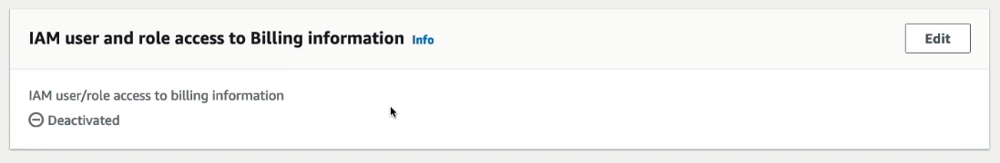
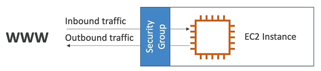
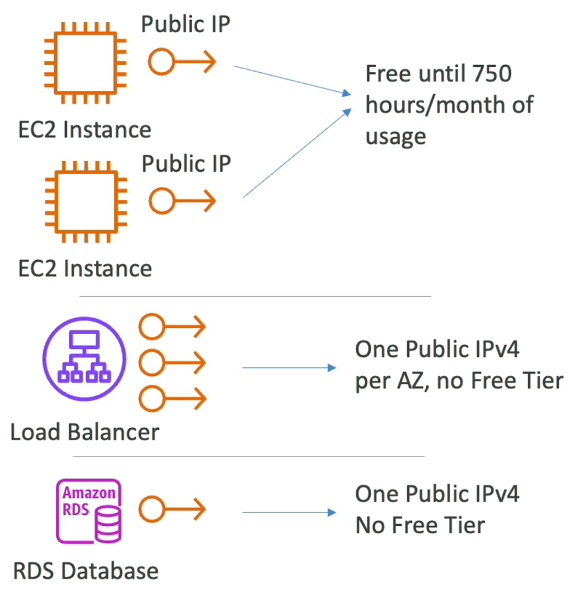
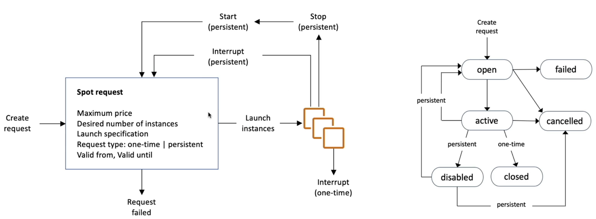
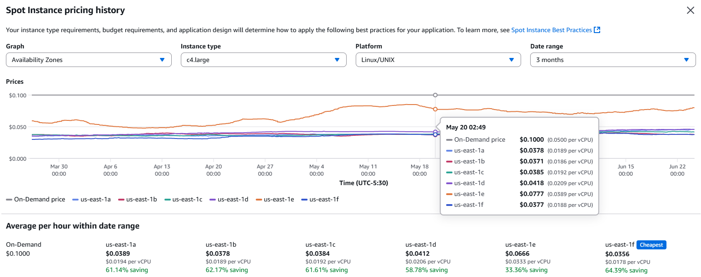
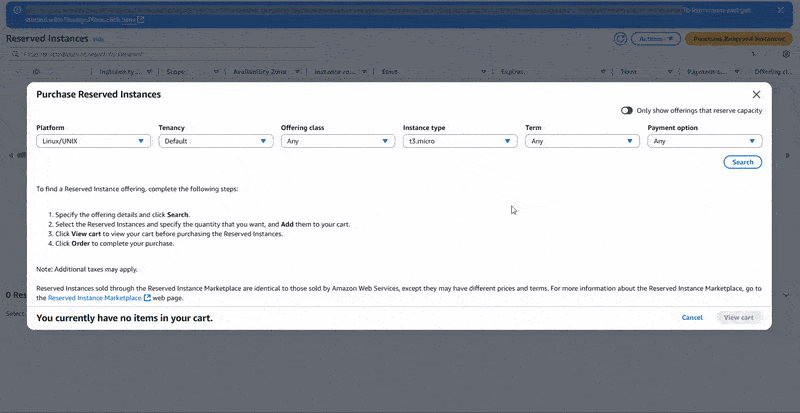

# EC2 Fundamentals

Sections:-
- [1. Understanding and Managing Your AWS Billing](#1-understanding-and-managing-your-aws-billing)
- [2. EC2: Your First Website on AWS](#2-ec2-your-first-website-on-aws)
- [3. Launching Your First EC2 Instance](#3-launching-your-first-ec2-instance)
- [4. EC2 Instance Types](#4-ec2-instance-types)
- [5. Security Groups](#5-security-groups)
- [6. EC2 Security Groups Hands-on](#6-ec2-security-groups-hands-on)
- [7. Connecting to Your Servers](#7-connecting-to-your-servers)
- [8. SSH into your EC2 Instance for Linux and Mac](#8-ssh-into-your-ec2-instance-for-linux-and-mac)
- [9. SSH into EC2 Instance Using Windows with PuTTY](#9-ssh-into-ec2-instance-using-windows-with-putty)
- [10. SSH into EC2 Instance from Windows](#10-ssh-into-ec2-instance-from-windows)
- [11. EC2 Instance Connect: A Browser-Based SSH Alternative](#11-ec2-instance-connect-a-browser-based-ssh-alternative)
- [12. Practicing IAM Roles for EC2 Instances](#12-practicing-iam-roles-for-ec2-instances)
- [13. EC2 Instances Purchasing Options](#13-ec2-instances-purchasing-options)
- [14. Understanding IPv4 Charges in AWS](#14-understanding-ipv4-charges-in-aws)
- [15. EC2 Spot Instances & Spot Fleet Deep Dive](#15-ec2-spot-instances--spot-fleet-deep-dive)
- [16. Launching EC2 Instances: A Comprehensive Guide](#16-launching-ec2-instances-a-comprehensive-guide)

---

## 1. Understanding and Managing Your AWS Billing

To effectively manage your AWS costs and avoid unexpected charges, it's crucial to understand your billing information and set up budgets. Here's how to do it:

### Accessing the Billing Console

1.  Navigate to the Billing and Cost Management console. You can usually find this by clicking on your account name in the top right corner of the AWS Management Console.
2.  ⚠️ **Warning:** If you're logged in as an IAM user, you might encounter "access denied" errors. This is because IAM users, even with administrative access, might not have permission to view billing data by default.

### Enabling IAM User Access to Billing Information



To grant IAM users access to billing information, follow these steps:

1.  Log in to your AWS account as the **root user**.
2.  Navigate to the "Accounts" section.
3.  Scroll down to find "IAM user and role access to billing information."
4.  Activate IAM access. This allows IAM users with administrative privileges to access billing data.
5.  Refresh your billing console. It might take a few moments for the changes to take effect.

### Understanding the Billing Dashboard

Once you have access, the billing dashboard provides valuable insights into your AWS spending.

- **Month-to-date cost:** Shows your current spending for the month.
- **Total forecasted cost:** Predicts your total spending for the current month.
- **Last month's total cost:** Displays your total spending for the previous month.
- **Cost breakdown by month:** Visualizes your spending trends over time.

### Analyzing Your Bills

To understand specific charges, examine your AWS bills:

1.  Go to the "Bills" section in the Billing and Cost Management console.
2.  Select the month you want to analyze. 📌 **Example:** December 2023.
3.  Scroll down to "Charges by service." This section breaks down your costs by AWS service.
4.  Click on a service to see a detailed breakdown of the charges. 📌 **Example:** Elastic Compute Cloud (EC2).

    - You'll see the region where the costs were incurred (e.g., EU Ireland).
    - You'll find a breakdown of the specific resources contributing to the cost (e.g., NAT Gateway, EBS, Elastic IP).

### Leveraging the AWS Free Tier

AWS offers a free tier that allows you to use certain services for free up to a certain limit.

1.  Go to the "Free Tier" section in the Billing and Cost Management console.
2.  Review your current and forecasted usage of free tier services.
3.  ⚠️ **Warning:** If your forecast indicates that you'll exceed the free tier limits, you'll be billed for the overage. Make sure to turn off any resources that are costing you money.

### Setting Up Budgets and Alarms 💰

Budgets help you track your AWS spending and receive alerts when you approach your spending limits.

1.  Go to the "Budgets" section in the Billing and Cost Management console.
2.  Click "Create budget."
3.  You can use templates to simplify the process.

    - **Zero Spend Budget:** Alerts you as soon as you spend 1 cent. This is useful for ensuring you don't accidentally incur any charges.
    - **Monthly Cost Budget:** Allows you to set a monthly spending limit and receive alerts when you reach certain thresholds.

#### Creating a Zero Spend Budget

1.  Select the "Simplified" template.
2.  Choose "Zero spend budget".
3.  Name your budget (e.g., "My Zero Spend Budget").
4.  Enter your email address to receive alerts. 📌
5.  Create the budget.

#### Creating a Monthly Cost Budget

1.  Select the "Simplified" template.
2.  Choose "Monthly cost budget".
3.  Set your desired monthly budget amount. 📌 **Example:** $10.
4.  Enter your email address to receive alerts. 📌 
5.  Configure alert thresholds. 📌 **Example:** Receive an email when your actual spend reaches 85% and 100%, and when your forecasted spend is expected to reach 100%.
6.  Create the budget.

📝 **Note:** Even if you expect to stay within the free tier, setting up a budget is a good practice to prevent unexpected charges due to mistakes.

### Debugging Costing Issues

By using budgets, exploring the free tier dashboard, and analyzing your bills, you should be able to identify and resolve any costing issues you encounter. This is a crucial skill for effectively using AWS.

---

## 2. EC2: Your First Website on AWS

Amazon EC2 (Elastic Compute Cloud) is a cornerstone of AWS, providing Infrastructure as a Service (IaaS). It's a popular and widely used service.

EC2 isn't just one thing; it's a collection of services that includes:

- Virtual machines (EC2 instances) 💻
- Virtual drives (EBS volumes) 💾
- Load balancers (Elastic Load Balancer) ⚖️
- Scalable services (Auto Scaling Group - ASG) 📈

Understanding EC2 is fundamental to grasping how the cloud works, as it allows you to rent compute power on demand.

### EC2 Instance Options

When choosing an EC2 instance, you have many options to configure your virtual server:

1.  **Operating System:** You can select from Linux (most popular), Windows, or macOS. 🐧 💻 🍎
2.  **Compute Power (CPU):** Choose the number of cores you need. 🎛️
3.  **Memory (RAM):** Specify the amount of RAM required. 🧠
4.  **Storage Space:** Decide on the type and amount of storage. 🗄️
    - Network-attached storage (EBS or EFS)
    - Hardware-attached storage (EC2 Instance Store)
5.  **Network:** Configure the network card and public IP. 🌐
6.  **Firewall Rules:** Manage security with Security Groups. 🛡️
7.  **Bootstrap Script:** Use EC2 User Data to configure the instance on first launch. ⚙️

You can customize your virtual machine to meet your specific needs. This flexibility is a key advantage of the cloud.

### Bootstrapping with EC2 User Data

EC2 User Data allows you to bootstrap your instances.

- Bootstrapping means running commands when the machine starts. 🚀
- The script runs only once, during the initial startup. ⏳
- It's designed to automate boot tasks.

Common tasks to automate:

- Installing updates 📦
- Installing software ⚙️
- Downloading files from the internet 🌐

📝 **Note:** The more you add to your User Data script, the longer the boot time.

⚠️ **Warning:** EC2 User Data scripts run with root user privileges.

### EC2 Instance Types

There are many EC2 instance types available, each with different characteristics. Here are a few examples:

- **t2.micro:** 1 vCPU, 1 GB RAM, EBS storage only, low to moderate network performance.
- **t2.xlarge:** 4 vCPU, 16 GB RAM, moderate network performance.
- **c5d.4xlarge:** 16 vCPU, 32 GB RAM, 400 GB NVMe SSD, up to 10 Gbps network performance.
- **r5.16xlarge:** (Example of another instance type with different specs)
- **m5.8xlarge:** (Example of another instance type with different specs)

The goal is to choose the instance type that best fits your application's requirements.

📌 **Example:**

```
Instance Type: t2.micro
vCPU: 1
Memory: 1 GB
Storage: EBS Only
Network: Low to Moderate
```

💡 **Tip:** For this course, we'll be using the `t2.micro` instance, which is part of the AWS Free Tier (up to 750 hours per month). This allows you to run the instance continuously for a month without incurring charges.

---

## 3. Launching Your First EC2 Instance

Let's launch our first EC2 instance running Amazon Linux! 🚀 This will be a visual server, and we'll use the console to create it.

Here's what we'll cover:

- A high-level overview of the various parameters when launching an EC2 instance.
- Launching a web server directly on the EC2 instance using **user data**.
- Starting, stopping, and terminating our instance.

### Launching the EC2 Instance

1.  Navigate to the EC2 Console.
2.  Click on "Instances" and then "Launch Instances".
3.  Add a name and tags:
    - Name: `My First Instance` (This will be the name tag).
    - You can add additional tags if needed, but the name is sufficient for now.

### Choosing the Base Image (AMI)

1.  Select a base image for your EC2 instance (the operating system).
2.  Choose "Amazon Linux 2023" from the Quick Start options. This is provided by AWS and is free tier eligible.
3.  Architecture: 64-bit x86 (leave as default).
4.  📝 **Note:** You can create your own AMIs or find them in the catalog, but we'll use the AWS-provided quick starts for this example.

### Instance Type

1.  Choose an instance type based on CPU, memory, and cost.
2.  Select `t2.micro`, which is free tier eligible.
3.  You can explore other instance types, but `t2.micro` is a good starting point.
4.  💡 **Tip:** Click "Compare Instance Types" to see a detailed comparison of available options.

### Key Pair (SSH Access)

1.  A key pair is required to log into your instance using SSH.
2.  Create a new key pair:
    - Name: `EC2 Tutorial`
    - Key pair type: RSA
    - Key pair format:
      - `.pem` for Mac, Linux, or Windows 10+
      - `.ppk` for Windows 7 or 8 (used with PuTTY)
3.  ⚠️ **Warning:** Choose the correct key pair format based on your operating system.
4.  The key pair will be downloaded automatically.

### Network Settings

1.  Leave the default settings for now. Your instance will get a public IP.
2.  A security group will be attached to your instance to control traffic.
3.  The console creates a security group called `launch-wizard-1`.
4.  Add the following rules:
    - Allow SSH traffic from anywhere.
    - Allow HTTP traffic from anywhere (for the web server).
    - We don't need HTTPS for this example.

### Configure Storage

1.  The default is an 8 GB gp2 root volume. This is sufficient for the free tier (up to 30 GB of EBS general-purpose SSD storage).
2.  In advanced settings, ensure "Delete on Termination" is set to "Yes" (By default it is "Yes"). This means the volume will be deleted when the instance is terminated.

### Advanced Details: User Data ⚙️

1.  Scroll down to the "User Data" section.
2.  User data allows you to pass a script to your EC2 instance to execute on its first launch.
3.  Copy the script from [ec2-fundamentals/ec2-user-data.sh](/resources/ec2-fundamentals/ec2-user-data.sh) and paste it into the User Data field.
4.  This script will:
    - Update a few things.
    - Install the HTTPD web server.
    - Write an HTML file (our web server).

```bash
#!/bin/bash
# Use this for your user data (script from top to bottom)
# install httpd (Linux 2 version)
yum update -y
yum install -y httpd
systemctl start httpd
systemctl enable httpd
echo "<h1>Hello World from $(hostname -f)</h1>" > /var/www/html/index.html
```

### Launch the Instance

1.  Review the summary and ensure everything looks correct.
2.  Click "Launch Instance".
3.  Click "View all Instances" to see the status.
4.  The instance will initially be in a "pending" state. It takes about 10-15 seconds to come up.

### Instance Details

Once the instance is running, you'll see:

- Instance Name: `My First Instance`
- Instance ID: A unique identifier.
- Public IPv4 address: Used to access the instance.
- Private IPv4 address: Used for internal AWS network access.
- Instance Type: `t2.micro`
- AMI: `Amazon Linux 2`
- Key Pair: `EC2 Tutorial`
- Security Group: `launch-wizard-1` with inbound rules for SSH (port 22) and HTTP (port 80).
- Storage: 8 GB volume.

### Troubleshooting

**Q: After launching an EC2 instance, where can I find the logs of the user-data script?**

**A:** The user-data script logs are stored inside the instance. You can check them in these files:

1. **Cloud-Init Log (Linux)**

   ```bash
   cat /var/log/cloud-init-output.log
   ```

   👉 This shows the output of your user-data script.

2. **Other Cloud-Init Logs (Linux)**

   ```bash
   cat /var/log/cloud-init.log
   ```

   👉 Contains detailed execution logs of cloud-init.

3. **System Log from AWS Console**

   * Go to **EC2 Console → Instances → Select your instance → Actions → Monitor and troubleshoot → Get system log**
   * This shows the boot-time messages, including user-data script output.

4. **Windows EC2 Instances**

   * User-data script output is logged in:

     ```
     C:\ProgramData\Amazon\EC2-Windows\Launch\Log\UserdataExecution.log
     ```

💡 **Tip:** Always add logging/echo statements in your user-data script (e.g., `echo "Step 1 completed" >> /var/log/mylog.txt`) so you can easily debug issues later.

### Accessing the Web Server

1.  Copy the Public IPv4 address.
2.  Open a web browser and enter `http://<Public IPv4 address>`.
3.  ⚠️ **Warning:** Make sure to use `http://` and not `https://`.
4.  You should see a "Hello World" message from the web server, including the private IPv4 address.
5.  💡 **Tip:** If the page doesn't load immediately, wait a few minutes and refresh.

### Stopping and Terminating the Instance

- **Stopping an Instance:**
  1.  Select the instance.
  2.  Go to "Instance State" -> "Stop Instance".
  3.  Stopping an instance will not bill you, but the volume is retained.
- **Terminating an Instance:**
  1.  Select the instance.
  2.  Go to "Instance State" -> "Terminate Instance".
  3.  ⚠️ **Warning:** Terminating an instance will delete the instance and the attached volume (if "Delete on Termination" is enabled, by default it is enabled).

### Starting a Stopped Instance

1.  Select the stopped instance.
2.  Go to "Instance State" -> "Start Instance".
3.  The instance will get a new Public IPv4 address.
4.  The Private IPv4 address will remain the same.
5.  Access the web server using the new Public IPv4 address with `http://`.

That's it! You've launched your first EC2 instance and web server in the cloud! 🎉

**Points to Note**:

- Starting a stopped instance will get a new Public IPv4 address, but the Private IPv4 address will remain the same.
- Stopping the instance will not bill you but the volume is retained.
- Terminating the instance will delete the instance and the attached volume.

---

## 4. EC2 Instance Types

EC2 instances come in various types, each optimized for different use cases. Let's explore the different categories and their characteristics. See more: [EC2 Instance Types](https://aws.amazon.com/ec2/instance-types/)

AWS offers a wide range of EC2 instance types, each designed for specific workloads. You can find a comprehensive list on the AWS website, which serves as the primary reference for instance details, costs, and specifications.

Here's a high-level overview of how EC2 instance types are named and categorized:

### Naming Convention

AWS uses a specific naming convention for EC2 instances. 📌 **Example:** `m5.2xlarge`

- **Instance Class:** The first letter (e.g., `m`) indicates the instance class.
- **Generation:** The number (e.g., `5`) represents the generation of the instance. AWS improves hardware over time, leading to new generations.
- **Size:** The final part (e.g., `2xlarge`) denotes the size of the instance within its class. Sizes range from small to larger, with increasing memory and CPU resources.

### Instance Classes

Here's a breakdown of the main EC2 instance classes:

1.  **General Purpose:**
    - Ideal for a variety of workloads like web servers and code repositories.
    - Offer a balance of compute, memory, and networking resources.
    - 📝 **Note:** In this course, we'll use `t2.micro`, a free-tier general-purpose instance.
    - Refer to the AWS website for the latest list of general-purpose instance types.
2.  **Compute Optimized (C):**
    - Optimized for compute-intensive tasks requiring high processor performance.
    - Suitable for:
      - Batch processing
      - Media transcoding
      - High-performance web servers
      - High-performance computing (HPC)
      - Machine learning
      - Dedicated game servers
    - Typically denoted by the `C` family (e.g., `C5`, `C6`).
3.  **Memory Optimized (R):**
    - Designed for workloads that process large datasets in memory (RAM).
    - Use cases include:
      - High-performance relational and non-relational databases (especially in-memory databases)
      - Distributed web-scale cache stores (e.g., Elasticache)
      - In-memory databases optimized for business intelligence (BI)
      - Applications performing real-time processing of big, unstructured data.
    - Often identified by the `R` series (for RAM), as well as `X1` and `Z1` instances.
4.  **Storage Optimized:**
    - Excellent for applications that require high-speed access to large datasets on local storage.
    - Suitable for:
      - High-frequency online transactional processing (OLTP) systems
      - Relational and NoSQL databases
      - Caching for in-memory databases (e.g., Redis)
      - Data warehousing applications
      - Distributed file systems
    - Instance names often start with `I`, `G`, or `H1`.

Note: Other types of instances may exist but only the most important ones have been covered so you get the general idea.

### Instance Type Comparison

Let's compare a few instance types to illustrate the differences:

- `t2.micro`: 1 vCPU, 1 GiB memory
- `r5.16xlarge`: 64 vCPUs, 512 GiB memory (memory-optimized)
- `c5d.4xlarge`: 16 vCPUs, 32 GiB memory (compute-optimized)

As you can see, different instance types prioritize different resources.

### Free Tier

The `t2.micro` instance is part of the AWS Free Tier, offering up to 750 hours per month.

### Useful Resource

For comparing EC2 instance specifications and costs, check out [https://instances.vantage.sh](https://instances.vantage.sh/). This website provides a comprehensive list of instances with details on Linux on-demand costs, reserved instance costs, memory, vCPUs, and more. You can search and sort to find the best instance for your needs. 💡 **Tip:** This is a great resource to bookmark!

---

## 5. Security Groups

Security groups are fundamental for network security in AWS. They act as firewalls around your EC2 instances, controlling inbound and outbound traffic.

- Security groups only contain allow rules. You define what traffic is permitted in and out.
- Rules can reference IP addresses or other security groups.

📌 **Example:** Accessing an EC2 instance from your computer.

1.  You (on the public internet) try to access your EC2 instance.
2.  A security group acts as a firewall around the EC2 instance.
3.  The security group contains rules that define allowed inbound traffic (from the outside to the EC2 instance) and outbound traffic (from the EC2 instance to the internet).



### Deep Dive into Security Groups

Security groups:

- Act as firewalls on EC2 instances.
- Regulate access to ports.
- Authorize IP ranges (IPv4 or IPv6).
- Control inbound and outbound network traffic.

Security group rules define:

- Type (e.g., TCP)
- Protocol
- Port (where traffic can go through on the instance)
- Source (IP address range; `0.0.0.0/0` means everything, while a specific IP like `1.2.3.4/32` means just that one IP)

📌 **Example:**

Imagine an EC2 instance with a security group attached.

- **Inbound Rules:** Your computer is authorized on port 22, allowing traffic from your IP to the EC2 instance. Someone else's computer (different IP) will be blocked.
- **Outbound Rules:** By default, any traffic from the EC2 instance is allowed. The EC2 instance can access any website.

### Key Things to Know About Security Groups

- Multiple instances can use the same security group.
- An instance can have multiple security groups attached.
- Security groups are locked down to a specific region/VPC combination. If you switch regions or VPCs, you need to recreate the security groups.
- Security groups live outside the EC2 instance. Blocked traffic never reaches the instance.

💡 **Tip:** Maintain a separate security group specifically for SSH access. This helps manage the most complex access rules.

⚠️ **Warning:** If your application is timing out, it's likely a security group issue. If you receive a "connection refused" error, the security group is working, but the application is not running or is refusing the connection.

- By default, all inbound traffic is **blocked**.
- By default, all outbound traffic is **authorized**.

### Multiple Security Groups

**Q: Can an EC2 instance have multiple security groups attached in AWS?**

**A:** ✅ Yes. An EC2 instance in AWS can be associated with multiple security groups.

* All inbound and outbound rules from the attached security groups are combined (union of rules).
* The most permissive rule takes effect.
* Example:

  * **SG-1** allows inbound SSH (port 22).
  * **SG-2** allows inbound HTTP (port 80).
  * If both are attached, the instance accepts both SSH and HTTP traffic.
* By default, you can attach **up to 5 security groups per instance** (limit can be increased).

### Referencing Security Groups

An advanced feature allows referencing security groups from other security groups.

📌 **Example:**

- EC2 instance with security group 1.
- Inbound rules for security group 1 authorize security group 1 and security group 2.


Why?

- If another EC2 instance has security group 2, it can connect directly to the first EC2 instance.
- Another EC2 instance with security group 1 can also communicate directly.
- EC2 instances with authorized security groups can communicate regardless of their IP addresses.
- An EC2 instance with security group 3 (not authorized) will be denied access.

This is useful when using load balancers.

### Important Ports for the Exam

- **SSH (Secure Shell):** Port 22. Allows you to log into a Linux EC2 instance.
- **FTP (File Transfer Protocol):** Port 21. Used to upload files to a file share.
- **SFTP (Secure File Transfer Protocol):** Port 22. Securely uploads files using SSH.
- **HTTP:** Port 80. Accesses unsecured websites (e.g., `http://example.com`).
- **HTTPS:** Port 443. Accesses secured websites (e.g., `https://example.com`).
- **RDP (Remote Desktop Protocol):** Port 3389. Used to log into a Windows instance.

📝 **Note:** 22 is for SSH (Linux), and 3389 is for RDP (Windows).

---

## 6. EC2 Security Groups Hands-on

Let's explore **security groups** in AWS, which act as virtual firewalls for your EC2 instances.

We can access security group settings in two ways:

1.  From the EC2 instance details, by clicking on the "Security" tab. This provides a quick overview.
2.  From the left-hand menu under "Networking & Security" and then "Security Groups" for a more complete page.

You'll typically see two security groups:

*   The **default** security group (created by default).
*   A **launch wizard** security group (created when you launch an EC2 instance).

Each security group has a unique ID, just like an EC2 instance.

### Inbound Rules

Inbound rules control the traffic allowed *into* your EC2 instance.

📌 **Example:**

We had two inbound rules:

*   SSH on port 22 from anywhere (0.0.0.0/0).
*   HTTP on port 80 from anywhere (0.0.0.0/0).

The HTTP rule (port 80) is what allowed us to access our web server.

Let's verify this by deleting the HTTP rule:

1.  Edit inbound rules.
2.  Delete the rule for HTTP (port 80).
3.  Save the rules.

Now, if you try to access your web server via HTTP, you'll see a timeout.

💡 **Tip:** Any time you see a **timeout** when trying to connect to your EC2 instance (SSH, HTTP, etc.), the most likely cause is an issue with your **security group rules**.  Double-check your inbound rules!

To fix this, add the HTTP rule back:

1.  Add rule.
2.  Select "HTTP" (port 80 will be automatically selected).
3.  Choose "Anywhere IPv4" (0.0.0.0/0).
4.  Save the rule.

Now, refreshing your web page should restore access.

You can add various types of inbound rules, specifying the port or port range.

📌 **Example:** To allow HTTPS traffic:

1.  Add rule.
2.  Select "HTTPS" (port 443 will be automatically selected).
3.  Choose the source. You can select:
    *   "Anywhere" (0.0.0.0/0) - allows access from any IP address.
    *   "My IP" - only allows access from your current IP address.

⚠️ **Warning:** If you select "My IP" and your IP address changes, you'll lose access to your instance and experience a timeout.

### Outbound Rules

Outbound rules control the traffic allowed *out* of your EC2 instance. By default, all outbound traffic is allowed to anywhere (0.0.0.0/0). This gives your EC2 instance full internet connectivity.

### Multiple Security Groups

📝 **Note:** An EC2 instance can have multiple security groups attached to it (one, two, three, or even more). The rules from all attached security groups are combined.

A security group can also be attached to multiple EC2 instances. This allows you to reuse security group configurations across your infrastructure.

---

## 7. Connecting to Your Servers

Connecting to your servers for maintenance or other actions is a crucial aspect of cloud operations. This section outlines different methods for securely connecting to your Linux servers.

For Linux servers, we can use **SSH** (Secure Shell) to securely connect to our servers. The method you use depends on your operating system:

*   Mac
*   Linux
*   Windows (before version 10)
*   Windows (version 10 and later)

| Operating System | SSH | Putty | EC2 Instance Connect |
|------------------|:---:|:-----:|:---------------------:|
| Mac              | ✅  |       | ✅                   |
| Linux            | ✅  |       | ✅                   |
| Windows < 10     |     | ✅    | ✅                   |
| Windows >= 10    | ✅  | ✅    | ✅                   |

Here's a breakdown of the connection methods:

*   **SSH (Mac, Linux, Windows 10+):** SSH is a command-line interface utility available on Mac, Linux, and Windows 10 and later.

    ```bash
    ssh user@your_server_ip
    ```

*   **Putty (Windows):** If you're using a Windows version earlier than 10, you can use Putty. Putty performs the same function as SSH, allowing you to use the SSH protocol to connect to your EC2 instances. It's valid for any version of Windows.

*   **EC2 Instance Connect:** This method uses your web browser to connect to your EC2 instance, eliminating the need for a terminal or Putty. It works for Mac, Linux, and all versions of Windows. 💻

    *   📝 **Note:** Initially EC2 Instance Connect currently only worked with Amazon Linux 2 (AL2). However, In December 2023, AWS officially announced EC2 Instance Connect support for RHEL, CentOS, and macOS, alongside Amazon Linux and Ubuntu.

### Choosing the Right Method

*   If you're on Mac or Linux, refer to the SSH lecture for Mac/Linux.
*   If you're on Windows, you can either watch the Putty lecture or, if you have Windows 10 or later, the SSH on Windows 10 lecture.

In future lectures, we'll be using **EC2 Instance Connect** because it's simple and doesn't require installing anything or using the command line.

### Troubleshooting SSH Issues

SSH can sometimes be tricky. ⚠️ **Warning:** SSH is often the source of the most common issues. If you encounter problems:

1.  Re-watch the relevant lecture to ensure you haven't missed any steps.
2.  Check for common issues like security group rules, command typos, etc.
3.  Consult the troubleshooting guide provided after these lectures.
4.  Try using EC2 Instance Connect, as it sometimes resolves SSH-related problems.

If one method works, you're good to go! You don't need to get all methods working. If none of the methods work, don't worry too much. This course is introductory, and SSH won't be used extensively.

Now, proceed to the lecture that corresponds to your operating system to learn more about your chosen connection method.

---

## 8. SSH into your EC2 Instance for Linux and Mac

SSH (Secure Shell) is a crucial tool for managing your AWS cloud resources. It allows you to securely control a remote machine or server using your terminal or command line. Let's walk through the process of SSHing into your EC2 instance.

Here's how it works:

1.  You have an EC2 instance running Amazon Linux 2023 with a public IP address.
2.  Your computer (laptop, etc.) will connect to this instance.
3.  The connection goes through port 22, which should be open in your EC2 instance's security group.
4.  Your command-line interface will then act as if you were directly inside the EC2 instance.

Let's get started! 🚀

### Prerequisites

1.  **PEM File:** Ensure you have the `.pem` file (e.g., `ec2-tutorial.pem`) that you downloaded when creating the EC2 instance.
    *   ⚠️ **Warning:** Remove any spaces from the filename. Rename it if necessary.
2.  **Directory:** Place the `.pem` file in a directory on your computer (e.g., `aws-key`).
3.  **EC2 Instance Details:**
    *   Find your EC2 instance in the AWS Management Console.
    *   Obtain the **Public IPv4 address**. You'll need this to connect.
    *   Verify that your instance's security group allows inbound traffic on **Port 22 (SSH)** from `0.0.0.0/0` (anywhere) Or from your IP address. If not, add the rule.

### SSH Command

The basic SSH command structure is:

```bash
ssh -i <key_file> ec2-user@<your_public_ip>
```

*   `ec2-user`: This is the default user for Amazon Linux 2023 AMIs.
*   `@`:  Specifies that you want to access this user on a specific server.
*   `<your_public_ip>`: Replace this with the public IP address of your EC2 instance.

Example: ` ssh -i ~/Downloads/aws-key/ec2-tutorial.pem ec2-user@34.203.203.14`

### Initial Connection Attempt

If you try the basic SSH command without specifying the key, you might get a "too many authentication failures" error. This is because you haven't provided the `.pem` file for authentication.

### Specifying the Key File

To authenticate correctly, you need to reference the `.pem` file in your SSH command.

1.  **Navigate to the Correct Directory:** Open your terminal and navigate to the directory where you saved your `.pem` file.

    *   💡 **Tip:** Use `ls` to list files and verify that your `.pem` file is present.
    *   💡 **Tip:** Use `pwd` to print your current working directory.
    *   📌 **Example:**
        ```bash
        pwd
        # Output: /Users/yourusername
        ls
        # Output: aws-key
        cd aws-course
        ls
        # Output: EC2Tutorial.pem
        ```

2.  **Construct the SSH Command:** Use the following command, replacing `EC2Tutorial.pem` and `<your_public_ip>` with your actual file name and IP address:

    ```bash
    ssh -i EC2Tutorial.pem ec2-user@<your_public_ip>
    ```

    *   `-i`: Specifies the identity file (your `.pem` file) for authentication.

### Resolving "Unprotected Private Key File" Error

You might encounter an error stating that your key file is unprotected. This means the file permissions are too open. To fix this, use the `chmod` command:

```bash
chmod 400 EC2Tutorial.pem
```

This command restricts the file permissions so that only the owner (you) can read it.

### Connecting to the Instance

After setting the correct permissions, try the SSH command again:

```bash
ssh -i EC2Tutorial.pem ec2-user@<your_public_ip>
```

You might be prompted to confirm the connection by typing `yes`.

If successful, you'll be logged into your EC2 instance! The prompt will change to something like `ec2-user@<your_instance_ip>`.

### Verifying the Connection

Once connected, you can run commands directly on the EC2 instance.

📌 **Example:**

```bash
whoami
# Output: ec2-user

ping google.com
# (Shows ping responses from Google)
```

Press `Ctrl+C` to stop the `ping` command.

### Exiting the Instance

To disconnect from the EC2 instance, type `exit` or press `Ctrl+D`.

### Reconnecting

To reconnect, use the same SSH command as before, ensuring you're in the correct directory and using the correct public IP address.

```bash
ssh -i EC2Tutorial.pem ec2-user@<your_public_ip>
```

⚠️ **Warning:** If you stop and start your EC2 instance, the public IP address might change. Always verify the IP address before attempting to connect.

📝 **Note:** SSH is a powerful tool, and understanding how to use it is essential for managing your AWS resources effectively.

---

## 9. SSH into EC2 Instance Using Windows with PuTTY

This section explains how to SSH into your EC2 instance from a Windows machine using PuTTY. SSH allows you to remotely control a machine using the command line. This is particularly useful when working with cloud services like Amazon EC2.

Here's the basic setup:

*   You have an EC2 instance running Amazon Linux 2.
*   The instance has a public IP address.
*   The EC2 instance has an SSH security group configured to allow SSH traffic on port 22 from any IP address. This allows your Windows machine to connect to the instance over the internet.

Let's get started with the requirements for configuring your Windows environment.

### Downloading and Installing PuTTY

PuTTY is a free SSH client for Windows.

1.  Download PuTTY from the internet.
2.  Choose the appropriate installer for your system (e.g., the 64-bit installer).
3.  Run the installer and follow the on-screen instructions.

### Using PuTTYgen to Convert PEM to PPK

PuTTY uses the PPK format for private keys, while AWS often provides keys in the PEM format. If you don't already have a PPK file, you can use PuTTYgen to convert your PEM file.

1.  Open PuTTYgen.
2.  Click on "Load".
3.  In the file selection dialog, change the file type filter to "All Files" to see your PEM file.
4.  Select your PEM file.
5.  You should see a message saying the key was successfully imported.
6.  Click on "Save private key".
7.  ⚠️ **Warning:** If prompted about a passphrase, you can choose to proceed without one by clicking "Yes".
8.  Save the file with a `.ppk` extension (e.g., `EC2tutorial.ppk`).

### Configuring PuTTY to Access Your EC2 Instance

Now, let's configure PuTTY to connect to your EC2 instance.

1.  Open the PuTTY application.
2.  Enter the public IPv4 address of your EC2 instance in the "Host Name (or IP address)" field.
3.  Enter a name for this connection in the "Saved Sessions" field (e.g., "EC2 Instance").
4.  Click "Save".
5.  Navigate to "SSH" -> "Auth" in the left-hand menu.
6.  Click on "Browse" and select the PPK file you generated earlier.
7.  Go back to "Session" in the left-hand menu.
8.  Click "Save" again to save the profile with the key configured.
9.  💡 **Tip:** To avoid authentication issues, modify the "Host Name" field to include the default user for Amazon Linux 2: `ec2-user@your_instance_ip`.
10. Click "Open" to start the SSH session.
11. If this is your first time connecting, you may see a security alert. Click "Accept" to trust the host and continue.

You should now be logged into your EC2 instance via SSH.

### Verifying the Connection

Once connected, you can verify the connection by running commands:

*   `whoami`: This command will show you the current user (should be `ec2-user`).
*   `ping google.com`: This command will test the internet connectivity of your instance. Press `Ctrl+C` to stop the ping.

To exit the SSH session, simply close the PuTTY window.

### Saving Your PuTTY Configuration

To ensure you don't have to repeat these steps every time you connect, PuTTY saves your configuration.

1.  Open PuTTY.
2.  Select your saved session ("EC2 Instance").
3.  Click "Load".
4.  Verify that all your settings, including the SSH key, are loaded correctly.
5.  Click "Open" to connect.

You should now be able to connect to your EC2 instance with a single click.

### SSH Command Reference

If you see "SSH" referred to in the course, it means you should connect to your instance using PuTTY.

📌 **Example:**

```bash
whoami
ping google.com
```

⌨️ **Shortcut:** `Ctrl+C` to stop a running command.

📝 **Note:** This guide is primarily for users with older versions of Windows. Windows 10 users have an alternative SSH client available, which will be covered in the next section.

---

## 10. SSH into EC2 Instance from Windows

This section details how to SSH into your EC2 instance directly from a Windows machine.

First, verify that the SSH command is available on your system. You can do this through either Windows PowerShell or the command prompt.

1.  Open **Windows PowerShell** or **Command Prompt**.
2.  Type `ssh`.
3.  If you see a response indicating the command is recognized, SSH is available.
    *   If the SSH command is not available, you'll need to use the patching method described in the previous lecture.

For this example, we'll use PowerShell.

1.  Navigate to the directory containing your `.pem` file.
    *   📌 **Example:**
        ```powershell
        cd C:\users\stephanemaarek
        ls
        cd .\Desktop
        ls
        ```
    *   Ensure your `EC2Tutorial.pem` file (or whatever you named it) is present. The `.ppk` file is only relevant if you are using PuTTY.

2.  Verify that your security group has port 22 open for SSH access.

3.  Execute the SSH command:
    ```powershell
    ssh -i "EC2Tutorial.pem" ec2-user@<your_ec2_public_ip>
    ```
    *   Replace `<your_ec2_public_ip>` with the actual public IP address of your EC2 instance.
    *   💡 **Tip:** Use the `Tab` key for autocompletion of the `.pem` file name.
    *   This command instructs SSH to connect to the specified IP address as the `ec2-user` using the provided `.pem` key file.

4.  You may see a message about the authenticity of the host. Type `yes` to continue.

You should now be logged into your EC2 instance.

### Resolving Permission Issues 🔑

Sometimes, you may encounter permission issues. Here's how to resolve them:

1.  Locate your `.pem` file (e.g., on your Desktop).
2.  Right-click the `.pem` file and select **Properties**.
3.  Go to the **Security** tab.
4.  Click **Advanced**.
5.  Ensure you are the owner of the file:
    *   If not, click **Change**.
    *   Click **Object Types**, ensure your computer is selected under **Locations**.
    *   Enter your username and click **Check Names**.
    *   Click **OK**.
6.  Disable inheritance:
    *   Click **Disable inheritance**.
    *   Select "Remove all inherited permissions from this object".
7.  Grant yourself full control:
    *   Click **Add**.
    *   Click **Select a principal**.
    *   Enter your username, click **Check Names**, and click **OK**.
    *   Give yourself **Full control**.
    *   Click **OK**.
8.  Click **Apply** and then **OK** on all dialogs.

Now, when you check the **Security** tab in the file's properties, you should only see your username with full permissions.

After adjusting the permissions, retry the SSH command. You should no longer encounter permission issues or be prompted with the "yes/no" question.

📌 **Example:**
```powershell
ssh -i "EC2Tutorial.pem" ec2-user@<your_ec2_public_ip>
```

You can also perform the SSH connection from the command prompt.

To exit the SSH session, type `exit` or press `Ctrl + D`.

---

## 11. EC2 Instance Connect: A Browser-Based SSH Alternative

EC2 Instance Connect offers a simpler alternative to traditional SSH for connecting to your EC2 instances. It provides a browser-based SSH session, eliminating the need for managing SSH keys in many cases.

Here's how to use it:

1.  Select your instance (📌 **Example:** My First Instance).
2.  Click on "Connect".
3.  Choose "EC2 Instance Connect".
4.  Verify the public IP address.
5.  The username defaults to "ec2-user" for Amazon Linux 2023 AMIs. You can override it, but 📝 **Note:** it usually works best with "ec2-user" for these AMIs.
6.  Click "Connect". A new tab will open with your SSH session.

You can now run commands directly in your browser:

```bash
whoami
ping google.com
```

The advantage is that you don't need a separate terminal application or SSH client.

### Important Considerations

*   This method relies on SSH behind the scenes.
*   If you encounter connection problems, it's likely due to security group settings.

### Security Group Configuration

If you can't connect, check your instance's security group:

1.  Go to your Instance and look at the security group.
2.  Edit the inbound rules.
3.  Ensure that SSH (port 22) is allowed.

Specifically, add the following inbound rules:

*   Type: SSH, Source: Anywhere IPv4 (0.0.0.0/0)
*   Type: SSH, Source: Anywhere IPv6 (::/0) ⚠️ **Warning:**  Sometimes IPv6 is necessary depending on your setup.

Here's how to add the rules:

1.  Click on your security group.
2.  Edit inbound rules.
3.  Add rule, select "SSH" from the type dropdown.
4.  For source, select "Anywhere IPv4" and then "Anywhere IPv6".
5.  Save rules.

With these rules in place, EC2 Instance Connect should work correctly. 💡 **Tip:** If you still have issues, double-check that your security group is associated with the correct instance.

This method will be used frequently throughout this course, offering a convenient way to interact with your EC2 instances.

### Troubleshooting

I can connect to my EC2 instance from my local machine using SSH, but not through **EC2 Instance Connect (browser-based SSH)**. Why?

📝 **Note:**
If EC2 Instance Connect isn’t working, the most common cause is a **security group restriction**. The browser-based connection originates from AWS-managed IP addresses, not from your local machine.

* If your security group is set to allow SSH (port 22) **only from your local IP**, browser-based SSH will fail.
* To fix this, update the security group to allow SSH traffic:

  * ✅ From **0.0.0.0/0** (quick but less secure), or
  * ✅ From the official **AWS EC2 Instance Connect IP ranges** (more secure).

This ensures both your local SSH client and the browser-based Instance Connect can access the instance.

---

## 12. Practicing IAM Roles for EC2 Instances

Let's explore how to use IAM roles with your EC2 instances.

First, connect to your EC2 instance. You can use SSH or EC2 Instance Connect. EC2 Instance Connect is convenient as it works directly in your web browser.

1.  Connect to your instance using EC2 Instance Connect.
2.  You should see a terminal prompt similar to `ec2-user@<private_ip>`. This indicates you're successfully connected.
3.  You can now run Linux commands. 📌 **Example:** `ping google.com` to test network connectivity. Use `Ctrl+C` to stop the ping command.
4.  Type `clear` to clear the terminal screen.

The Amazon Linux AMI comes pre-installed with the AWS CLI. You can verify this by trying an AWS command `aws --version`.

📌 **Example:**

```bash
aws iam list-users
```

You'll likely see an error message: "Unable to locate credentials". This is expected!

⚠️ **Warning:** **Never** configure AWS credentials directly on an EC2 instance using `aws configure`. This involves entering your Access Key ID and Secret Access Key. If you do this, anyone who gains access to your EC2 instance could potentially retrieve these credentials, which is a major security risk.

Instead, use IAM roles to grant permissions to your EC2 instance.

Here's how to attach an IAM role to your EC2 instance:

1.  Navigate to the EC2 Management Console.
2.  Select your instance.
3.  Go to "Security".
4.  You'll see that there's currently no IAM role attached to your instance.
5.  Go back to your Instances list, select your instance, click "Actions", then "Security", and then "Modify IAM role".
6.  Choose the IAM role you want to attach (e.g., `DemoRoleForEC2`).
7.  Click "Save".

Now, if you go back to the "Security" tab for your instance, you should see the attached IAM role.

To verify that the IAM role is working:

1.  Run the `aws iam list-users` command again in your EC2 instance's terminal.

```bash
aws iam list-users
```

If the role has the necessary permissions, you should now see a list of IAM users. You did not need to run `aws configure`!

To further demonstrate the role's effect:

1.  Detach the policy (e.g., `IAMReadOnlyAccess`) from the IAM role in the IAM console.
2.  Run `aws iam list-users` again. You should now receive an "Access Denied" error, confirming that the EC2 instance's permissions are controlled by the attached IAM role.
3.  Re-attach the policy to the IAM role.
4.  Run `aws iam list-users` again. It might take a short time for the changes to propagate. If you still get "Access Denied", wait a moment and try again. You should eventually see the list of IAM users.

💡 **Tip:** IAM role changes can take a few seconds to propagate. If a command fails immediately after modifying a role, wait a short time and try again.

📝 **Note:** This process demonstrates how to securely provide AWS credentials to your EC2 instances using IAM roles. Always use IAM roles instead of directly configuring credentials on the instance.

---

## 13. EC2 Instances Purchasing Options

We've primarily used on-demand EC2 instances so far. These are great for:

*   Short workloads
*   Predictable pricing
*   Paying by the seconds

However, different workloads can benefit from optimized discounts and pricing. Let's explore the various purchasing options AWS offers.

### On-Demand Instances

On-demand instances are the most common and cost-effective way to use EC2. Short workloads, predictable pricing, and pay by the seconds.

*   Benefit: Flexible pricing.
*   Payment: Pay for what you use.
*   Ideal for: Short workloads, predictable pricing.

### Reserved Instances (1 & 3 Years)

Reserved Instances are suitable for long workloads.

*   Term: One year or three years.
*   Ideal for: Running databases for extended periods.
*   Convertible Reserved Instances: Allow you to change the instance type over time, providing flexibility.

### Savings Plans (1 & 3 Years)

Savings Plans are a more modern approach for long workloads.

*   Term: One year or three years.
*   Commitment: Commit to a specific amount of usage in dollars, rather than a specific instance type.

### Spot Instances

Spot Instances are designed for very short workloads.

*   Benefit: Very cheap.
*   ⚠️ **Warning:** You can lose these instances at any time, making them less reliable.

### Dedicated Host

Dedicated Hosts allow you to book an entire physical server.

*   Benefit: Control instance placements.

### Dedicated Instances

Dedicated Instances ensure that no other customers share your hardware.

### Capacity Reservations

Capacity Reservations allow you to reserve capacity in a specific Availability Zone (AZ) for any duration.

Now let's look at them in detail.

### EC2 On-Demand

*   Payment: Pay for what you use.
*   Billing:
    *   Linux or Windows: Per second billing after the first minute.
    *   Other operating systems: Per hour billing.
*   Characteristics:
    *   Highest cost.
    *   No upfront payments.
    *   No long-term commitments.
*   Recommendation: Short-term and uninterrupted workloads where you cannot predict application behavior.

### Reserved Instances (Detailed)

*   Discount: Up to 72% discount compared to on-demand.
*   Reservation: Reserve specific instance attributes:
    *   Instance type
    *   Region
    *   Tenancy
    *   OS
*   Reservation Period: One year or three years for more discounts. Not 1 to 3 years, it's either 1 or 3.
*   Payment Options:
    *   All upfront (maximum discount)
    *   Partial upfront
    *   No upfront
*   Scope:
    *   Region
    *   Availability Zone (AZ) - reserve capacity in a specific AZ.
*   Use Case: Steady-state usage applications (e.g., databases).
*   Flexibility: You can buy or sell your reserved instances in a marketplace if you no longer need them.
*   Convertible Reserved Instances:
    *   Allows changing instance type, instance family, operating system, scope, and tenancy.
    *   Discount: Up to 66% discount (less than standard Reserved Instances due to increased flexibility).

### EC2 Savings Plans (Detailed)

*   Discount: Similar to Reserved Instances (up to 70%).
*   Commitment: Commit to spending a specific dollar amount per hour (e.g., $10 per hour for 1 or 3 years).
*   Billing: Usage beyond the savings plan is billed at the on-demand price.
*   Lock-in: Specific instance family and region (e.g., M5 in us-east-1).
*   Flexibility:
    *   Instance size (e.g., m5.xlarge, m5.2xlarge).
    *   OS (switch between Linux and Windows).
    *   Tenancy (switch between host, dedicated, and default).

### Spot Instances (Detailed)

*   Discount: Most aggressive discounts (up to 90% compared to on-demand).
*   Risk: Instances can be terminated at any time.
*   Mechanism: You define a maximum price you're willing to pay. If the spot price exceeds your max price, you lose the instance.
*   Use Cases:
    *   Batch jobs
    *   Data analysis
    *   Image processing
    *   Distributed workloads
    *   Workloads with flexible start and end times
*   Unsuitable For: Critical jobs or databases.

### Dedicated Hosts (Detailed)

*   Benefit: Get an actual physical server with EC2 instance capacity fully dedicated to your use case.
*   Use Cases:
    *   Compliance requirements.
    *   Using existing server-bound software licenses (per-socket, per-core, per-VM).
*   Pricing:
    *   On-demand (pay per second).
    *   Reservation - one or three years. (No upfront, partial upfront, or all upfront.)
*   Cost: Most expensive option.
*   Licensing: Bring Your Own License (BYOL) model.
*   Regulatory Needs: Strong regulatory or compliance needs.

### Dedicated Instances (Detailed)

*   Runs on hardware dedicated to you.
*   May share hardware with other instances in the same account.
*   No control over instance placements.
*   Key Difference: Dedicated instances provide your own instance on dedicated hardware, while dedicated hosts give you access to the physical server itself.

### Capacity Reservations for EC2 (Detailed)

*   Reserve on-demand instances in a specific AZ for any duration.
*   Access capacity whenever needed.
*   No time commitment (reserve or cancel at any time).
*   No billing discounts.
*   Purpose: To reserve capacity.
*   Discounts: Combine with regional reserved instances or savings plans for billing discounts.
*   Billing: Charged at on-demand rates, whether or not you run instances.
*   Use Case: Short-term uninterrupted workloads that need to be in a specific AZ.

### Choosing the Right Purchasing Option

It can be difficult to understand which purchasing option is right for you. Here's a summary using a resort analogy:

*   On-Demand: Come to the resort whenever you like and pay the full price.
*   Reserved: Plan ahead and stay for a long time (1 or 3 years) to get a good discount.
*   Savings Plan: Commit to spending a specific amount per month and change room types over time.
*   Spot Instances: Last-minute discounts on empty rooms, but you can be kicked out at any time if someone is willing to pay more.
*   Dedicated Host: Book the entire building of the resort (your own hardware).
*   Capacity Reservation: Book a room, even if you're not sure you'll stay in it, but you'll pay full price nonetheless.

### Price Comparison 📌 **Example:**

Here's an example of pricing for an m4.large instance in us-east-1 (prices are subject to change):

| Purchasing Option                               | Price (Linux/UNIX, us‑east‑1)                                                 |
| ----------------------------------------------- | ----------------------------------------------------------------------------- |
| **On‑Demand**                                   | \$0.100 per hour |
| **Spot (typical 70–80 % off)**                  | \$0.02–\$0.03 per hour (\~70–80 % discount)                     |
| **Reserved (1 yr, No Upfront)**                 | ≈ \$0.06 per hour (\~40 % off)                                                |
| **Reserved (3 yr, All Upfront)**                | ≈ \$0.04 per hour (\~60 % off) |
| **EC2 Savings Plan**                            | Similar to Standard RI: \$0.04–\$0.06/hr (up to 72 % off)                     |
| **Reserved (Convertible, 3 yr)**                | ≈ \$0.046 per hour (\~54 % off)                                               |
| **Dedicated Host (On‑Demand)**                  | Same as On‑Demand host price (depends on host SKU)                            |
| **Dedicated Host Reservation (up to 70 % off)** | Up to \$0.03 per hour (70 % off hypothetical host cost) |
| **Capacity Reservation**                        | Charged at On‑Demand rate: \$0.100/hr |

Also see: [AWS console or Cost Calculator](https://aws.amazon.com/ec2/pricing/)

💡 Notes & Assumptions

* **Spot prices** fluctuate by zone and demand; \$0.02–\$0.03/hr reflects recent average low-end values.
* **Reserved Instances**:

  * **1‑year, no upfront**: \~40 % off yields \$0.06/hr.
  * **3‑year, all upfront**: \~60 % off yields \$0.04/hr. 
* **Convertible RIs** (3‑year): \~54 % off → \$0.046/hr.
* **Savings Plans** closely mirror RI discount levels and offer flexible usage.
* **Dedicated Host** pricing depends on the full host (typically 8 vCPUs); reservation can yield up to 70 % discounts .

### Exam Preparation

The exam will ask you to identify the right instance type based on your workloads. Remember the key characteristics of each option.

---

## 14. Understanding IPv4 Charges in AWS

As of February 1st, 2024, AWS has introduced charges for all Public IPv4 addresses created in your account, regardless of whether they are in use. Let's break down what this means for you.

*   💰 The charge is \$0.005 per hour per Public IPv4 address.
*   🗓️ This equates to approximately \$3.60 per month per Public IPv4 address.

When do you get a Public IPv4 address?

*   📌 **Example:** When you create an EC2 instance.

### EC2 Free Tier

For new AWS accounts, there's a 12-month free tier for EC2.

*   🎁 Within the first 12 months, you get 750 hours of Public IPv4 usage per month.
*   ⚠️ **Warning:** If you exceed 750 hours of Public IPv4 usage across all your EC2 instances, you will be charged for the excess.
*   📝 **Note:** This free tier only applies to the EC2 service.

### Public IPv4 Usage and Charges

Let's illustrate how this works:

1.  You create an EC2 instance with a Public IP. This usage counts towards your 750 hours/month free tier.
2.  You create a second EC2 instance with a Public IP. This also counts towards the 750 hours/month.
3.  As long as the combined usage of all your EC2 Public IPs is less than 750 hours per month, you won't be charged.
4.  ⚠️ **Warning:** If you have, for example, four Public IPv4 addresses active simultaneously, you'll likely exceed the free tier and incur charges.

### Other Services and Public IPv4

Many other AWS services also use Public IPv4 addresses.

*   📌 **Example:** Load Balancers. A load balancer deployed across three Availability Zones (AZs) will use three Public IPv4 addresses.
*   📌 **Example:** Amazon RDS Databases. If you want to connect to a database from your public computer, you will create a public IPv4 address.
*   ⚠️ **Warning:** There is **no** free tier for Public IPv4 usage with services other than EC2. You will be charged from the moment they are provisioned.



### IPv6 Considerations

AWS is encouraging migration to IPv6, which is easier to manage at scale.

*   🤔 Why not use IPv6 in this course?
*   Unfortunately, many internet service providers (ISPs) worldwide do not yet fully support IPv6.
*   This means the course might not work for all students if it were exclusively IPv6-based.

You can test IPv6 by going to [https://test-ipv6.com](https://test-ipv6.com).

If you want to use IPv6:

*   👍 If you're comfortable with networking, you can use IPv6 on your own to avoid IPv4 charges.
*   ⚠️ **Warning:** You'll need to configure your own security group rules and networking settings.
*   If you're new to cloud computing, AWS, IT, or networking, it's recommended to stick with IPv4 and be mindful of the associated charges.

### Troubleshooting IPv4 Charges

If you incur unexpected charges, here's how to investigate:

1.  Go to **Billing and Cost Management** in your AWS account.
2.  Select **Bills** on the left-hand side.
3.  Review the **Bill Summary** to see charges by service.
4.  Drill down into the details to identify the source of the IPv4 charges.

### Using Amazon VPC IP Address Manager (IPAM)

You can use IPAM to monitor your IP addresses:

1.  Search for **IPAM** in the AWS console.
2.  Go to **Amazon VPC IP Address Manager**.
3.  Click on **Public IP Insights**.
4.  Create an IPAM, accepting the default settings.
5.  Select the regions you want to monitor.
6.  Click on **Create IPAM**.

This will provide insights into your Public IPv4 usage within the free tier.

```
# Example: Accessing Billing Information via AWS CLI
aws billing get-cost-and-usage --time-period Start=2024-03-01,End=2024-03-31 --granularity MONTHLY --metrics "UnblendedCost"
```

---

## 15. EC2 Spot Instances & Spot Fleet Deep Dive

Spot instances offer significant cost savings, up to 90% compared to On-Demand instances. Here's a breakdown of how they work:

### Spot Instance Basics
*   You define a **max spot price** 💰 you're willing to pay.
*   As long as the current spot price is below your max price, you keep the instance.
*   The hourly spot price varies based on offer and capacity.

### Handling Spot Price Increases
If the current spot price exceeds your max price, you have 2 minutes grace period and two options:

1.  **Stop** your instance:
    *   Shut down your work.
    *   Stop the instance.
    *   If the spot price later drops below your max price, you can restart and continue.
2.  **Terminate** your instance:
    *   Lose the instance state.
    *   Restart with a fresh instance when needed.

📝 **Note:** Choose the strategy based on your workload's requirements.

See more: [Spot Request](https://us-east-1.console.aws.amazon.com/ec2/home?region=us-east-1#SpotInstances:)


### Spot Blocks
*   If you don't want your instance reclaimed, use a **spot block**.
*   A spot block reserves an instance for a specified timeframe (1-6 hours).
*   The instance is guaranteed not to be interrupted (though rare exceptions exist).

Note: ❌ Spot Blocks (fixed-duration Spot instances) are no longer available for new users. AWS officially ended support for new Spot Blocks on July 1, 2021, per their blog. Customers who had used them before could continue only until December 31, 2022, after which they were fully discontinued. You can’t request a Spot Instance with a fixed duration anymore (1–6 hours). 

### Use Cases for Spot Instances
Spot instances are ideal for:
*   Batch jobs
*   Data analysis
*   Workloads resilient to failures

⚠️ **Warning:** Avoid using spot instances for critical jobs or databases.

### Spot Instance Pricing
*   Spot prices vary based on the Availability Zone (AZ).
*   Prices fluctuate over time.
*   You can optimize costs by setting a max price.

📌 **Example:**
    *   On-Demand price: \$0.10 per hour
    *   Spot instance price: \$0.04 per hour (60% saving)

### Terminating Spot Instances
To properly terminate spot instances, you need to understand spot requests.

#### Spot Requests
A spot request defines:
*   Number of instances
*   Maximum price
*   Launch specification (AMI, etc.)
*   Validity period (from/until)
*   Request type

#### Request Types
There are two types of spot requests:

1.  **One-time request:**
    *   Instances are launched when the request is fulfilled.
    *   The spot request disappears after fulfillment.
2.  **Persistent request:**
    *   The request remains active as long as it's valid.
    *   If instances are stopped or interrupted, the request will relaunch them.

⚠️ **Warning:** If you stop a spot instance in persistent mode while the request is active, it will automatically relaunch.



#### Canceling Spot Requests
*   To cancel a spot request, it must be in the `open`, `active`, or `disabled` state.
*   Canceling a spot request does **not** terminate existing instances.

#### Proper Termination Procedure
To terminate spot instances permanently:

1.  Cancel the spot request.
2.  Terminate the associated spot instances.

⚠️ **Warning:** Terminating instances first will cause the spot request to relaunch them.

### Spot Fleets
Spot Fleets are the ultimate way to save money by using a combination of Spot and On-Demand instances.

*   A spot fleet attempts to meet your target capacity within your price constraints.
*   It launches instances from multiple launch pools (different instance types, OS, AZs).
*   The fleet stops launching instances when it reaches your budget or capacity.

#### Spot Fleet Allocation Strategies
You define a strategy to allocate spot instances:

1.  **Lowest Price:**
    *   Launches instances from the pool with the lowest price.
    *   Great for short workloads.
2.  **Diversified:**
    *   Distributes instances across all defined pools.
    *   Good for availability and long workloads.
3.  **Capacity Optimized:**
    *   Uses the pool with the optimal capacity for the number of instances.
4.  **Price Capacity Optimized:**
    *   Chooses the pool with the highest capacity and then selects the lowest price within that pool.
    *   Best choice for most workloads.

💡 **Tip:** Spot Fleets can be complicated, but remember that they allow you to define multiple launch pools and instance types.

By using the lowest price strategy, spot fleets automatically request the spot instances with the lowest price, maximizing savings.

Spot fleets provide extra savings compared to simple spot instance requests by intelligently choosing the right spot instance pool.

The key difference is that with a simple spot instance request, you specify the exact instance type and AZ, while with a spot fleet, you provide a range of options and let AWS choose the most cost-effective combination.

---

## 16. Launching EC2 Instances: A Comprehensive Guide

Let's explore the various methods for launching EC2 instances.

### Spot Requests

The first method involves using **spot requests**.

*   Click on "Spot Requests" in the AWS EC2 console.
*   You can view the pricing history of EC2 instances.
    📌 **Example:** A `c4.large` instance running Linux/Unix.
*   Select a time range (e.g., three months) to observe price fluctuations.
*   The on-demand price is represented by a black bar.
*   Spot prices vary based on Availability Zone (AZ).
*   Spot instances can offer significant savings compared to on-demand prices.
    📌 **Example:** Savings of 69-70% for a `c4.large` instance.



#### Requesting Spot Instances

1.  Click on "Create Spot Fleet Request"
2.  You'll be directed to the spot fleet request screen.
3.  Configure launch parameters:
    *   Use launch templates or manually configure settings.
    *   Specify the AMI (e.g., Amazon Linux 2).
    *   Select a key pair.
    *   Define other launch parameters as you would for a regular EC2 instance.
4.  Define request details:
    *   Set a maximum price.
    *   Specify the request's validity period (from and until).
    *   Choose whether to terminate instances upon request expiration.
    *   Link instances to classic load balancers or target groups.
5.  Set target capacity:
    *   Specify the desired number of instances.
        📌 **Example:** 10 instances.
    *   Alternatively, specify capacity in terms of vCPUs or memory.
        📌 **Example:** 10 vCPUs.
    *   Define interruption behavior: terminate, stop, or hibernate instances.
    *   Consider capacity rebalancing options.
6.  Configure networking settings:
    *   Choose specific AZs or VPCs.
7.  Specify instance types:
    *   Manually select EC2 instances based on criteria.
        📌 **Example:** `c3.large`, `c4.large`.
    *   Define instance attributes (vCPUs, memory, etc.).
    *   AWS will suggest matching instance types.
    *   💡 **Tip:** Less restrictive parameters yield more instance type matches.
8.  Choose an allocation strategy:
    *   Optimize for capacity or lowest price.
    *   If manually selecting instance types, consider diversifying the instance pool.
9.  Review the fleet request summary:
    *   Check fleet strength, matching instances, and AZ distribution.
    *   View the estimated hourly price and potential savings.
        📌 **Example:** \$0.156 per hour with 73% savings compared to on-demand.

📝 **Note:** You don't need to memorize all these parameters, but understanding them is beneficial.

#### Launching a Single Spot Instance

1.  Go to "Instances" and click "Launch Instance."
2.  Scroll down to "Advanced Details."
3.  Find the option to "Request Spot Instance."
4.  The spot price is capped at the on-demand price by default.
5.  Customize the maximum price if desired.
6.  Choose the request type:
    *   One-time: The instance is terminated if reclaimed.
    *   Persistent: The instance keeps coming back when price requirements are met.
7.  For persistent requests, set a validity period (until a date or no expiry).
8.  Define interruption behavior (hibernate or stop) if the price exceeds the maximum.
9.  Block duration is an outdated feature and may not be available.

### Reserved Instances

Reserved Instances allow you to purchase a specific instance type for a set period.

1.  Search for a specific instance type.
    📌 **Example:** `c5.large`.
2.  View available offerings.
3.  Consider the term length (e.g., 12 or 36 months) and type (standard or convertible).
4.  Choose an upfront payment option: all upfront, no upfront, or partial upfront.
5.  Specify the number of instances you want.
    📌 **Example:** Two instances.
6.  Add the reserved instance to your cart.
7.  View the cart and order.
    ⚠️ **Warning:** Ordering will incur significant costs.

📝 **Note:** Reserved Instances might be phased out in favor of AWS Savings Plans. 

You can see below message in the EC2 Management Console:
> We recommend Savings Plans over Reserved Instances. Savings Plans are the easiest and most flexible way to save money on your AWS compute costs and offer lower prices (up to 72% off) just like Reserved Instances.



### Savings Plans

Savings Plans allow you to dedicate a specific dollar amount per hour for a one, or three-year term.

*   Offer flexibility in instance type and AZ selection.
*   Generally recommended over Reserved Instances.

Savings Plans are a flexible pricing model that offer low prices on EC2, Fargate and Lambda usage, in exchange for a commitment to a consistent amount of usage (measured in $/hour) for a 1 or 3 year term. Savings Plans provide you the flexibility to use the compute option that best suits your needs and automatically save money, all without having to perform exchanges or modifications. When you sign up for a Savings Plan, you will be charged the discounted Savings Plans price for your usage up to your commitment.

Savings Plans allow you to easily reduce your bill by making a commitment to compute usage (e.g. $10/hour) instead of making commitments to specific instance configurations or compute services. Amazon Web Services offers two types of Savings Plans - Compute Savings Plans and EC2 Instance Savings Plans.


### Dedicated Hosts

Dedicated Hosts provide access to lower-level hardware for better licensing pricing.

*   Clicking on "Dedicated Hosts" redirects you to the License Manager.
*   The License Manager simplifies dedicated host management.
*   To launch a dedicated host directly:
    1.  Click on "Allocate Dedicated Host."
    2.  Name the host.
    3.  Specify the instance family.
        📌 **Example:** `c5`.
    4.  Choose an AZ.
    5.  Configure other settings.
    6.  Click "Allocate."
    ⚠️ **Warning:** Allocating a dedicated host can be very expensive.

### Capacity Reservations

Capacity Reservations ensure that capacity is available for your EC2 instance launches.

1.  Specify the instance type and quantity.
    📌 **Example:** Four `m5.2xlarge` instances.
2.  Choose an AZ.
    📌 **Example:** `eu-central-1`.
3.  Define when the reservation ends (manually or at a specific time).
4.  Capacity is guaranteed, but you pay for the reservation regardless of usage.

---
