# EC2 Solutions Architect Associate Level

Sections:-
- [1. Private vs. Public IP Addresses](#1-private-vs-public-ip-addresses)
- [2. Understanding IP Address Behavior in AWS EC2](#2-understanding-ip-address-behavior-in-aws-ec2)
- [3. EC2 Placement Groups](#3-ec2-placement-groups)
- [4. Placement Groups Practice](#4-placement-groups-practice)
- [5. Elastic Network Interfaces (ENI)](#5-elastic-network-interfaces-eni)
- [6. Elastic Network Interfaces (ENI) Hands-On](#6-elastic-network-interfaces-eni-hands-on)
- [7. ENI Extra Reading](#7-eni-extra-reading)
- [8. EC2 Hibernate](#8-ec2-hibernate)
- [9. EC2 Hibernate Feature Practice](#9-ec2-hibernate-feature-practice)
- [10. Q & A](#10-q--a)

---

## 1. Private vs. Public IP Addresses

Networking relies heavily on IP addresses, specifically IPv4 and IPv6. Let's break down the differences and how they're used.

- IPv4: This is the most common type, consisting of four numbers separated by dots (e.g., `192.168.1.1`). We'll primarily use IPv4 in this course.
- IPv6: Less common, it uses a longer, more complex string of numbers and letters (e.g., `2560:d0c2:9d26:eb77:f3d5:8ca3:2069:7783`). AWS supports IPv6, but IPv4 is still widely used. IPv6 is often used for IoT (Internet of Things) devices.

IPv4 allows for approximately 3.7 billion unique public addresses. Each number in an IPv4 address can range from 0 to 255.

### Public IP Addresses

- A public IP address allows a server to be accessible over the internet.
- 📌 **Example:** EC2 instances can have public IPs, allowing them to communicate with other servers over the internet.
- Public IPs must be unique across the entire internet. No two machines can have the same public IP.
- You can often find the geolocation of a public IP address using online tools.

### Private IP Addresses

- Private IPs are used within a private network, such as a company's internal network.
- Computers within the same private network can communicate with each other using their private IPs.
- Private IP addresses are defined within specific ranges.
- Machines on a private network connect to the internet through a NAT (Network Address Translation) device or an internet gateway, which acts as a proxy.
- Private IPs only need to be unique within their own private network. Different private networks (e.g., different companies) can use the same private IP addresses without conflict.

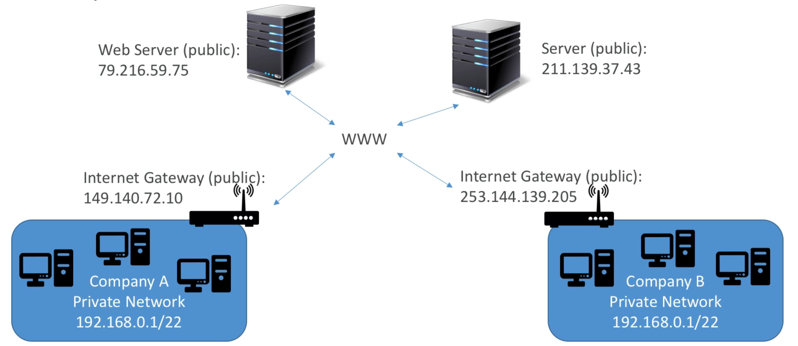

### Key Differences Summarized

- Public IP: Accessible over the internet.
- Private IP: Accessible only within a private network.

### Elastic IPs

- When you stop and start an EC2 instance, its public IP address can change.
- An Elastic IP is a static public IPv4 address that you own (as long as you don't delete it).
- You can attach an Elastic IP to only one instance at a time.
- Elastic IPs can be used to mask the failure of an instance by quickly moving the IP to another instance.
- ⚠️ **Warning:** By default, you are limited to five Elastic IPs per AWS account.
- 💡 **Tip:** It's generally recommended to avoid using Elastic IPs due to architectural considerations.

### Alternatives to Elastic IPs

- Use a random public IP and assign a DNS name to it. DNS management (using services like Route 53) provides more control and scalability.
- Use a Load Balancer, which can eliminate the need for public IPs on individual instances. This is often the preferred pattern in AWS.

### EC2 Instances and IP Addresses

- By default, an EC2 instance comes with:
  - A private IP for internal AWS network communication.
  - A public IP for communication over the World Wide Web (WWW).
- To SSH into an EC2 instance from outside the AWS network (without a VPN), you must use its public IP address.
- Remember that the public IP address of an EC2 instance can change when the instance is stopped and started.

---

## 2. Understanding IP Address Behavior in AWS EC2

This section explores the behavior of IP addresses in AWS EC2, covering public and private IPv4 addresses, and how to use Elastic IPs to maintain a consistent public IP.

### Public vs. Private IPv4 Addresses

- When you launch an EC2 instance, it gets both a public and a private IPv4 address.
- The **public IPv4** allows you to connect to your instance from the internet, for example, using SSH.
- The **private IPv4** is used for communication within the AWS private network.

Connecting to your instance:

1.  You can successfully SSH into your instance using the public IPv4 address.
2.  Once logged in, you can use the private IP address for internal communication.
3.  However, you **cannot** directly SSH into your instance from your local machine using the private IPv4 address.

Why? 🤔

- Private IPv4 addresses are only accessible within the AWS private network.
- Your local machine is connected to the internet, not the AWS private network.
- You need a public IP to access AWS resources from the internet.

### Instance Stop/Start and Public IP Changes

- Stopping and starting an EC2 instance (not rebooting) will, by default, change its public IPv4 address.
- This means that if you've hardcoded the public IP address anywhere, you'll need to update it after each stop/start.

📌 **Example:**

1.  Note down the initial public IPv4 address of your instance.
2.  Stop the instance.
3.  Start the instance.
4.  Observe that the public IPv4 address has changed.
5.  Attempting to SSH using the old IP will fail.

### Elastic IPs: Static Public IPs

To avoid the changing public IP issue, you can use an **Elastic IP**.

- An Elastic IP is a static public IPv4 address that you can associate with your EC2 instance.
- The instance will retain this IP address even after stopping and starting it.

Allocating and Associating an Elastic IP:

1.  Navigate to the Elastic IPs section in the AWS console.
2.  Allocate a new Elastic IP address.
3.  Associate the Elastic IP address with your EC2 instance. Choose the instance and the private IP address to associate it with. Select the Elastic IP address you allocated => Actions => Associate Elastic IP address => Resource type: Instance => Instance ID: Your instance's ID => Private IP address: The private IP address of the instance you want to associate the Elastic IP with => Associate.

Now, the public IPv4 address of your instance will be the Elastic IP.

Benefits of using Elastic IPs:

- Consistent public IP address even after stopping and starting the instance.
- Simplifies DNS configuration and external access.

### Elastic IP Pricing 💰

⚠️ **Warning:** There are costs associated with Elastic IPs.

- You are charged a small hourly fee (approximately $0.005 per hour, or $3.50 per month) for Elastic IPs that are allocated but not associated with a running instance, or associated with a stopped instance.
- AWS provides 750 hours of free public IPv4 address usage per month.

💡 **Tip:** To avoid unnecessary charges, always release Elastic IPs when you no longer need them. Terminate your instances when you are done.

Releasing an Elastic IP:

1.  Disassociate the Elastic IP from your instance.
2.  Release the Elastic IP address.

### Hands-on Demonstration

1.  Allocate an Elastic IP.
2.  Associate the Elastic IP with your running EC2 instance.
3.  Verify that the instance's public IPv4 address now matches the Elastic IP.
4.  Stop the instance. Notice that the instance still has a public IPv4 (the Elastic IP).
5.  Start the instance.
6.  Verify that the public IPv4 address remains the same (the Elastic IP).
7.  SSH into the instance using the Elastic IP.
8.  Disassociate the Elastic IP from the instance.
9.  Release the Elastic IP.
10. Verify that the instance now has a new public IPv4 address.
11. Terminate the instance.

📝 **Note:** Remember to terminate your EC2 instances and release any unused Elastic IPs to avoid incurring charges.

---

## 3. EC2 Placement Groups

Placement groups offer control over how EC2 instances are placed within the AWS infrastructure. While we don't directly interact with AWS hardware, placement groups allow us to communicate our desired instance placement relative to each other. There are three placement group strategies: Cluster, Spread, and Partition.

### Cluster Placement Group

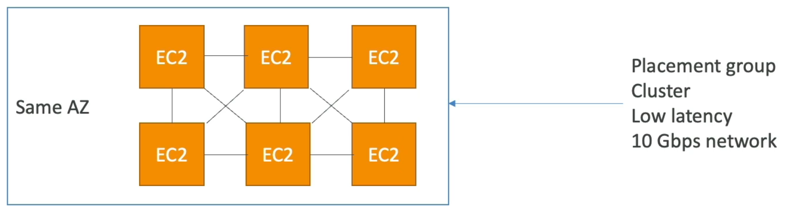

- Instances are grouped together in a low-latency hardware setup within a single Availability Zone (AZ).
- Provides high performance but also carries a higher risk.

  - Great networking: ~10 Gbps bandwidth between instances with enhanced networking enabled.
  - Low latency, high throughput network.
  - Ideal for computational jobs.

- ⚠️ **Warning:** If the AZ fails, all instances in the cluster placement group will fail simultaneously.
- Use Cases:
  - Big data jobs requiring fast completion with high networking.
  - Applications needing extremely low latency and high throughput between instances.

### Spread Placement Group

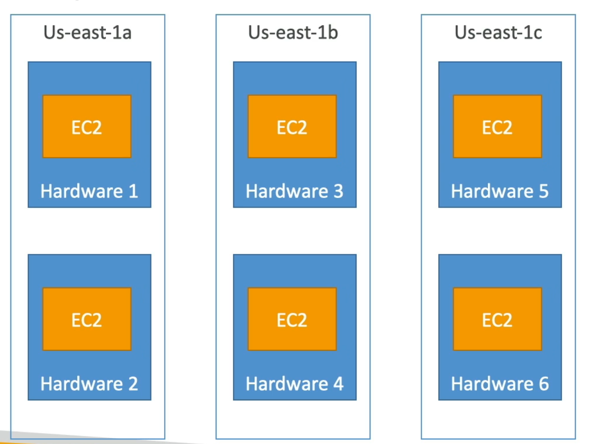

- Instances are spread across different hardware.
- Minimizes failure risk.
- Spans across multiple AZs.
- Reduces the risk of simultaneous failure because instances are on separate hardware.
- ⚠️ **Warning:** Limited to seven EC2 instances per placement group _per_ AZ.
- Use Cases:
  - Applications requiring maximized high availability and reduced risk.
  - Critical applications where instance failures must be isolated.

### Partition Placement Group

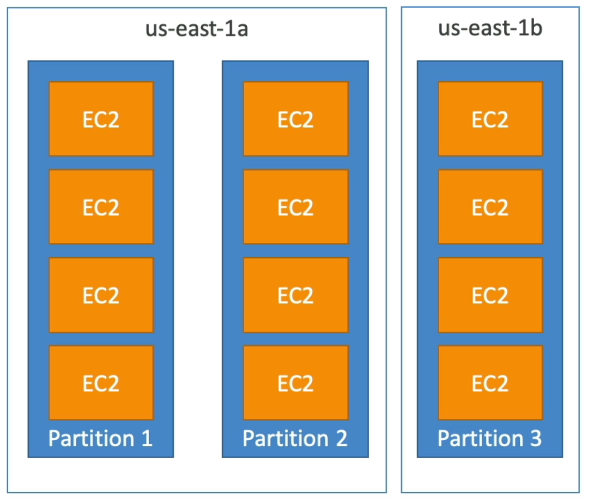

- Similar to Spread, but instances are spread across multiple partitions (physical racks).
- Partitions rely on different sets of hardware racks within an AZ.
- Partitions are isolated from each other's failures.
- Allows scaling to hundreds of EC2 instances per group.
- Up to 7 partitions per AZ.
- Partitions can span multiple AZs in the same region.
- Up to 100s of EC2 instances.
- Instances in one partition do not share the same physical rack as instances in other partitions.
- Each partition is isolated from failure. If one partition goes down, others should remain operational.
- Information about which partition an EC2 instance belongs to can be accessed via the metadata service.
- Use Cases:
  - Applications that are partition-aware and can distribute data and servers across partitions.
  - Big data applications like HDFS, HBase, Cassandra, and Apache Kafka.

📝 **Note:** Each placement group strategy offers a different balance between performance, availability, and scalability. Choose the strategy that best fits your application's requirements.

📌 **Example:**

Let's say you have a Cassandra cluster. You could use a partition placement group to ensure that each node in the cluster is on a separate rack, minimizing the impact of a rack failure.

```
# Example: Hypothetical Cassandra setup using Partition Placement Group
# Each partition represents a rack.
partition1: [cassandra_node_1, cassandra_node_2]
partition2: [cassandra_node_3, cassandra_node_4]
partition3: [cassandra_node_5, cassandra_node_6]
```

---

## 4. Placement Groups Practice

Let's practice using placement groups in AWS. We'll create three different placement groups, each with a different strategy.

First, navigate to the "Placement Groups" option under "Network & Security" in the AWS EC2 console.

We will create three placement groups:

1.  **High-Performance Group**: This group will use the **cluster** placement strategy.
2.  **Critical Group**: This group will use the **spread** placement strategy.
3.  **Distributed Group**: This group will use the **partition** placement strategy.

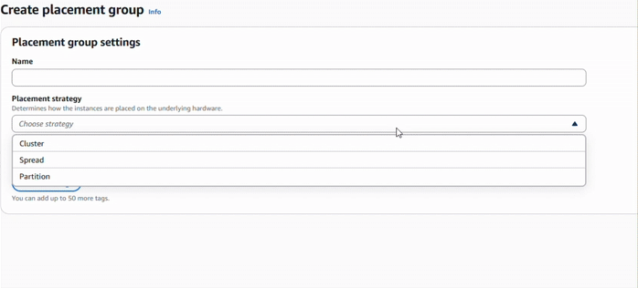

### Creating the High-Performance Group

1.  Create a new placement group named `my-high-performance-group`.
2.  Select the **cluster** placement strategy. 🚀
    - This strategy places instances close to each other to maximize network performance.

### Creating the Critical Group

1.  Create a new placement group named `my-critical-group`.
2.  Select the **spread** placement strategy. 🌐
    - This strategy distributes instances as much as possible to improve availability.
3.  Set the spread level to **rack**.
    - 📝 **Note:** The "host" level is only available for Outposts, which we are not using.

### Creating the Distributed Group

1.  Create a new placement group named `my-distributed-group`.
2.  Select the **partition** placement strategy. ➗
3.  Choose the number of partitions between 1 and 7. 📌 **Example:** Set it to `4`.

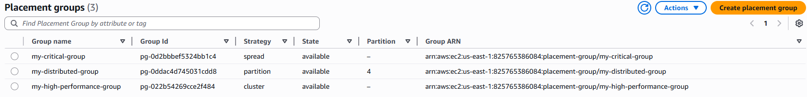

### Launching an Instance in a Placement Group

Now that we've created our placement groups, let's launch an instance within one of them.

1.  Click on "Launch Instances".
2.  Scroll down to the "Advanced Details" section.
3.  Find the "Placement Group Name" setting.
4.  Select the desired placement group (e.g., `my-critical-group`, `my-distributed-group`, or `my-high-performance-group`). ⚙️
    - The available options will reflect the placement groups you've created.

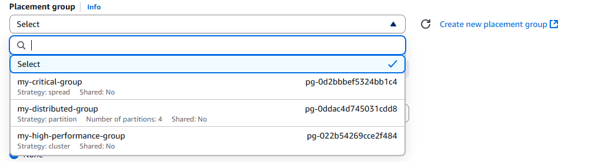

That's it! You now know how to create and use placement groups in AWS.

### Troubleshooting Placement Groups

Error message: **Instance launch failed**: Cluster placement groups are not supported by the 't2.medium' instance type. Specify a supported instance type or change the placement group strategy, and try again.

That error means you tried to launch a **t2.medium** instance inside a **cluster placement group**, but AWS doesn’t allow that.

📌 **Why it happens:**

* **Cluster Placement Groups** are designed for instances that need **low-latency networking** (HPC, tightly-coupled workloads).
* Only certain instance families support them (generally **Compute Optimized (C5, C6i, etc.), Memory Optimized (R5, R6i, etc.), Storage Optimized (I3, etc.), and some newer General Purpose (M5, M6i, etc.)**).
* **T2 instances** (like `t2.medium`) don’t support enhanced networking and therefore can’t be placed in cluster placement groups.

✅ **How to fix it:**

1. **Option 1: Use a supported instance type**

   * Switch to an instance type that supports placement groups (e.g., `c5.large`, `m5.large`, `r5.large`).
   * This is the best choice if you really need a cluster placement group.

2. **Option 2: Change placement group strategy**

   * If you don’t need cluster networking, switch the placement group strategy to **spread** or **partition** (those are supported by more instance types).

3. **Option 3: Don’t use a placement group**

   * If you don’t actually require one, just launch the instance without assigning it to a placement group.

⚠️ **Note:** For high-performance networking (100 Gbps bandwidth, low latency), you’ll need **EBS-optimized** instances with **ENA (Elastic Network Adapter)** enabled — which t2.medium cannot provide.

---

## 5. Elastic Network Interfaces (ENI)

Elastic Network Interfaces (ENI), are logical components within a VPC that represent a virtual network card. They provide network access to EC2 Instances, and are also used in other contexts.

- ENIs are a logical component in a VPC.
- They represent a virtual network card.
- They provide EC2 Instances with network access.
- They are used outside of EC2 Instances as well.

📌 **Example:**

Imagine an Availability Zone with an EC2 Instance. Attached to it is `eth0`, your primary ENI. This ENI provides the EC2 Instance with network connectivity, including a private IP address.

Each ENI can have the following attributes:

1.  A primary private IPv4 address.
2.  One or more secondary IPv4 addresses.
    📌 **Example:** You can add a secondary ENI to an EC2 instance (e.g., `eth1`), which will provide another private IPv4 address.
3.  One Elastic IP (IPv4) per private IPv4 address.
4.  One Public IPv4 address.
5.  One or more security groups attached.
6.  A MAC address.

You can create ENIs independently from EC2 instances and attach them on the fly, or move them between EC2 instances for failover purposes.

⚠️ **Warning:** ENIs are bound to a specific Availability Zone (AZ). If you create an ENI in a specific AZ, it can only be used within that AZ.

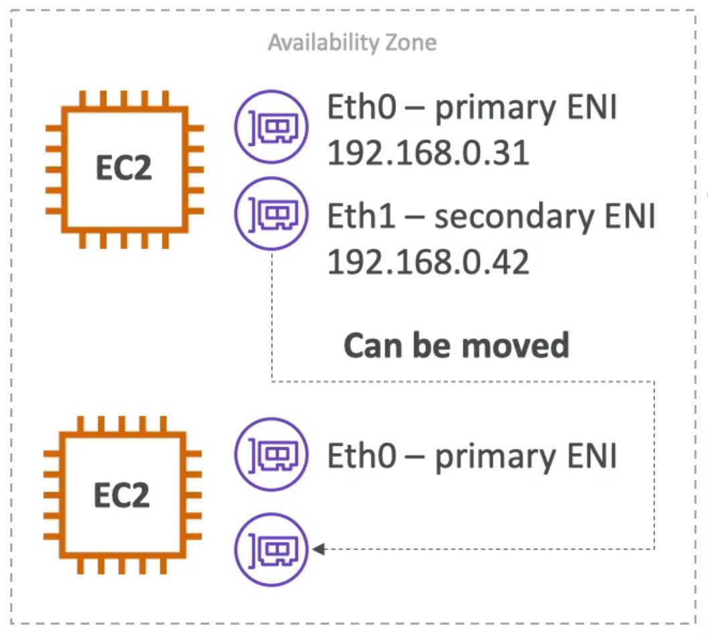

Here's how you can move ENIs between EC2 instances:

1.  Detach `eth1` from the first EC2 instance.
2.  Attach `eth1` to the second EC2 instance.

This moves the private IP address associated with `eth1` from the first EC2 instance to the second. This is very useful for failover scenarios.

📌 **Example:** If your EC2 instance is accessed via a private static IP address, you can move the IP address between instances for failover.

---

## 6. Elastic Network Interfaces (ENI) Hands-On

Let's explore elastic network interfaces (ENI) through a hands-on practice.

First, we'll launch two EC2 instances:

1.  Choose Amazon Linux 2 AMI.
2.  Select a `t.2.micro` instance type.
3.  Assign any key pair.
4.  Use an existing security group (e.g., launch wizard one).
5.  Launch two instances. 🚀

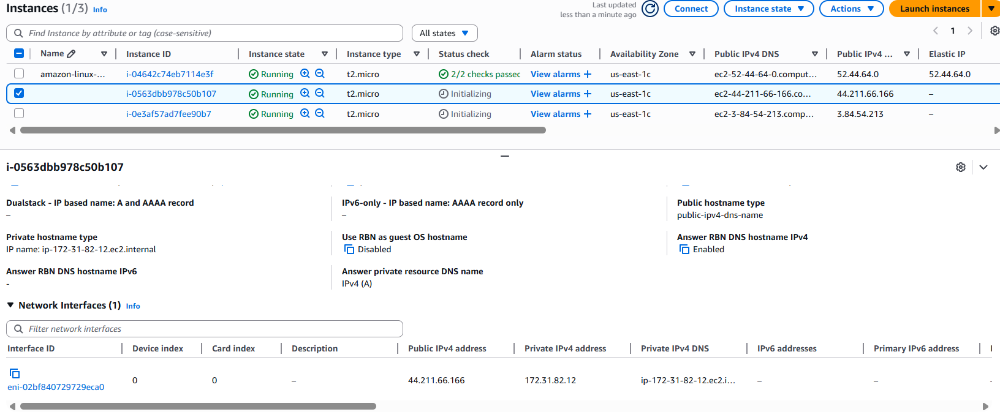

Once the instances are running, select an instance and navigate to the **Networking** tab for each instance. You'll find:

- Each instance has one network interface.
- Each network interface has an ENI ID.
- Each interface contains a public IPv4 address, a private IPv4 address, and a private IPv4 DNS.

You can also find the ENIs under **EC2 Console** > **Network & Security** > **Network Interfaces** in the EC2 console. Here, you'll see the two ENIs attached to your EC2 instances. The status will show "in-use," and you can see the associated instance IDs.

Now, let's create a new network interface:

1.  Go to **Network Interfaces** in the EC2 console.
2.  Click **Create network interface**.
3.  Provide a description (e.g., "demo ENI").
4.  Select a subnet. ⚠️ **Warning:** The subnet must be in the same Availability Zone (AZ) as your EC2 instances (e.g., `us-east-2a`).
5.  Choose to auto-assign a private IPv4 address. You can also customize this if needed.
6.  Attach a security group to the ENI.
7.  Click **Create network interface**. 🎉

You've now created a secondary private IPv4 address. The new ENI will be in the "available" state.

Next, attach the new ENI to one of your instances:

1.  Select the "demo ENI".
2.  Click **Actions** > **Attach**.
3.  Choose an instance to attach it to.
4.  Click **Attach**.

Go back to the instance you attached the ENI to and refresh the **Networking** tab. You should now see two network interfaces:

- The primary ENI (with public and private IPv4 addresses).
- The "demo ENI" (with a secondary private IPv4 address).

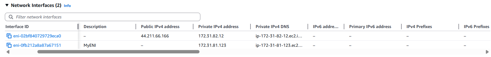

Why would you do this? 🤔 This gives you control over the ENI. You can move it from one EC2 instance to another.

This enables a quick and easy network failover between instances. If two instances are running the same application and you want to access them using a specific private IPv4 address, you can move the ENI to the active instance.

Let's demonstrate this failover:

1.  Select the "demo ENI".
2.  Click **Actions** > **Detach**.
3.  Confirm the detachment.
4.  ⚠️ **Warning:** If detaching normally fails, use **Actions** > **Detach** with **Force detach**.
5.  Once detached, select the "demo ENI" again.
6.  Click **Actions** > **Attach**.
7.  Choose the _other_ instance to attach it to.
8.  Click **Attach**.

Refresh the **Networking** tabs of both instances. The first instance should now have only one network interface, and the second instance should have two, including the "demo ENI". 🚀

This demonstrates how you can perform failover between instances using ENIs.

Finally, let's terminate the instances:

1.  Select both instances.
2.  Click **Actions** > **Instance State** > **Terminate**.
3.  Confirm the termination.

What happens to the ENIs? 🤔

- The ENIs created alongside the EC2 instances will be automatically deleted.
- The "demo ENI," which was created manually, will remain.

By creating your own ENIs, you gain more control over your private IPv4 addresses and your networking configuration. This can be helpful in advanced use cases. 💡 **Tip:** Remember to delete the "demo ENI" if you no longer need it. It won't cost you anything to keep it, but it's good practice to clean up resources.

---

## 7. ENI Extra Reading

Clarification on ENI

It's possible that for some of you, ENIs are not clear just yet. That's okay, they are an advanced concept in AWS and one that can take time to master.

If you'd like to learn more on ENI, I found that many students were helped by reading this blog: https://aws.amazon.com/blogs/aws/new-elastic-network-interfaces-in-the-virtual-private-cloud/

I hope this will help you. If you still don't understand it, no worries, this is not a blocker for the course. Keep on going, and come back to this concept towards the end.

---

## 8. EC2 Hibernate

Let's explore EC2 Hibernate, a feature that allows you to preserve the in-memory state of your instances.

We know we can stop and terminate EC2 instances. When you stop an instance, the data on your EBS disk remains intact until the next start. If you terminate an instance, the root volume is destroyed if configured to do so, but other volumes are kept.

When you start a stopped instance, the OS boots, the EC2 User Data script runs, and then your applications start and caches warm up. This can take time because you are booting the machine.

Hibernate aims to achieve a different state. When you hibernate an instance, the in-memory state (RAM) is preserved.

### What is EC2 Hibernate?

- Instance boot is much faster. 🚀
- The OS isn't stopped or restarted; it's frozen. 🧊
- The contents of RAM are written to a file on the root EBS volume. 💾

### How it Works

1.  An EC2 instance is running with data in RAM.
2.  The hibernation process starts.
3.  The instance enters the stopping state.
4.  RAM is dumped into the encrypted EBS volume.
5.  The instance shuts down, and RAM disappears from the instance itself.
6.  When the instance is started, RAM is loaded from the EBS volume back into the EC2 instance memory.
7.  The EC2 instance resumes as if it was never stopped. 🪄

### Use Cases

- Long-running processes that you don't want to stop. ⏳
- Saving the RAM state. 💾
- Fast boot times when services take a long time to initialize. ⏱️

### Important Considerations

- Supports many instance families.
- **Instance RAM size must be less than 150 GB.** ⚠️
- **Doesn't work for bare metal instances.**
- Works with Linux and Windows. 🐧 🪟
- The root volume must be an **EBS volume.**
- The root volume must be **encrypted**. 🔑
- The root volume must be large enough to contain the RAM dump.
- Available for On-Demand, Reserved, and Spot Instances.
- Hibernation is meant to be for **no more than 60 days**. ⏳

---

## 9. EC2 Hibernate Feature Practice

Let's practice using the EC2 hibernate feature. We'll launch an instance and enable hibernation.

First, launch an EC2 instance:

1.  Choose **Amazon Linux 2** as the AMI.
2.  Select **t2.micro** as the instance type.
3.  Choose an existing key pair.
4.  For network security, use an existing security group (e.g., launch-wizard-1).
5.  Configure storage.

To enable hibernation, you need to ensure the root volume has enough storage to fit the RAM of the EC2 instance and that the root EBS volume is encrypted.

Here's how to configure the EBS volume:

1.  Go to **Advanced** settings.
2.  Choose your EBS volume.
3.  ✅ **Encrypt** the volume.
4.  Select the default **AWS/EBS key** for encryption.

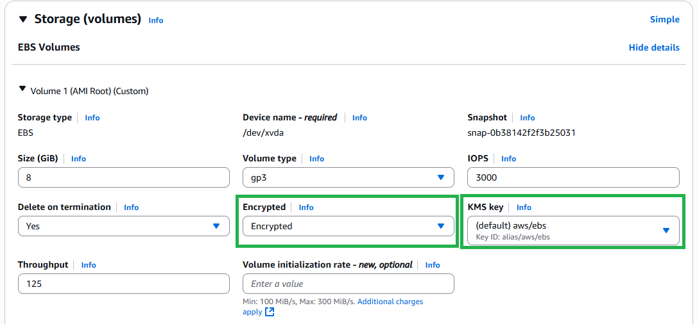

Now, verify that the EBS volume size is sufficient. For a t2.micro instance with 1 GB of RAM, an 8 GB volume is enough.

In the advanced settings, enable hibernation by setting the **Hibernate** option to **Enabled**. It will give the following message:-

> To enable hibernation, space is allocated on the root volume to store the instance memory (RAM). Make sure that the root volume is large enough to store the RAM contents and accommodate your expected usage, e.g. OS, applications. To use hibernation, the root volume must be an encrypted EBS volume.

Launch the instance with hibernation enabled.

Now, let's verify that hibernation works.

1.  Connect to the instance using **EC2 Instance Connect**.

    ```
    ssh -i <your_key_pair.pem> ec2-user@<your_instance_public_ip>
    ```

2.  Use the `uptime` command to check how long the instance has been running.

    ```bash
    uptime
    ```

    The `uptime` command shows how long the instance has been running since its last restart. Initially, it will show a small value (e.g., one minute).

3.  Disconnect from the instance.
4.  Hibernate the instance: **Instance state** -> **Hibernate instance**. This stores the RAM data onto the EBS volume.
5.  Wait for the instance to stop.
6.  Start the instance again.

Without hibernation, stopping and starting the instance would reset the `uptime` to zero. However, with hibernation, the `uptime` should reflect the time the instance was running before hibernation.

Connect to the instance again and run `uptime`. You should see that the uptime is greater than zero (e.g., two or three minutes), indicating that the instance preserved its state during hibernation.

Finally, terminate the instance to avoid incurring further charges. **Instance state** -> **Terminate instance**.

That's it! You've successfully practiced using the EC2 hibernate feature.

---

## 10. Q & A

### Does EC2 hibernation change the public IPv4 address?

<details>

<summary>Explanation</summary>

Yes, in EC2 **hibernation**, the **public IPv4 address does change** **after you stop and start the instance**, unless you're using an **Elastic IP**.

Here's a breakdown:

* **Public IPv4 Address (Default):**

  * When you stop and start a hibernated instance, AWS releases the existing public IPv4 address.
  * When the instance starts again, it's assigned a **new** public IPv4 address.

* **Elastic IP Address (Optional):**

  * If you associate an **Elastic IP** with the instance, that IP **persists** across stop/start/hibernate cycles.
  * Elastic IPs are static and do **not** change unless manually disassociated.

#### Summary

| IP Type     | After Hibernate → Stop/Start | Changes? |
| ----------- | ---------------------------- | -------- |
| Public IPv4 | Automatically assigned       | **Yes**  |
| Elastic IP  | User-assigned static IP      | **No**   |

If you need a stable IP for your instance—even across hibernation or stop/start—you should allocate and associate an **Elastic IP**.

</details>

---