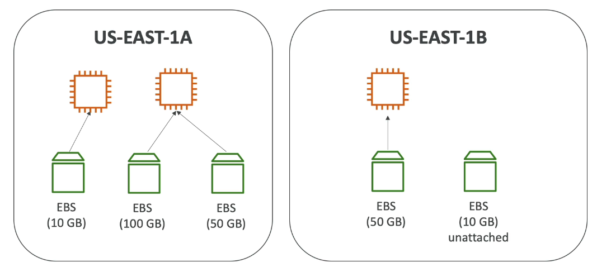
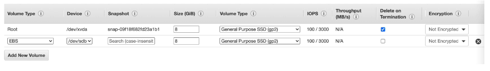
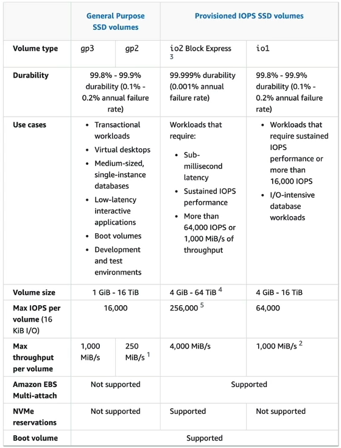
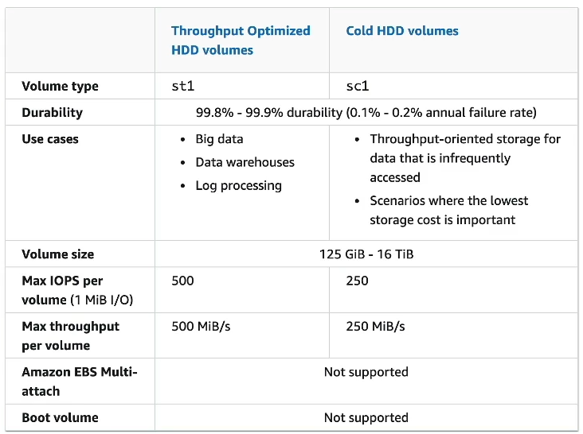
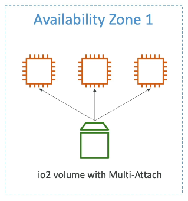
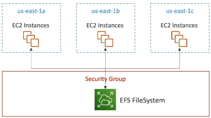
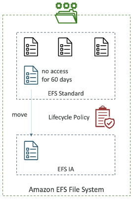

# EC2 Instance Storage

Sections:-
- [1. EBS Volumes for EC2 Instances](#1-ebs-volumes-for-ec2-instances)
- [2. Understanding and Managing EBS Volumes](#2-understanding-and-managing-ebs-volumes)
- [3. EBS Snapshots 📸](#3-ebs-snapshots-)
- [4. EBS Snapshots](#4-ebs-snapshots)
- [5. Understanding Amazon Machine Images (AMIs)](#5-understanding-amazon-machine-images-amis)
- [6. Creating and Using Amazon Machine Images (AMIs)](#6-creating-and-using-amazon-machine-images-amis)
- [7. EC2 Instance Store](#7-ec2-instance-store)
- [8. EBS Volume Types](#8-ebs-volume-types)
- [9. Multi-Attach Feature of EBS Volumes](#9-multi-attach-feature-of-ebs-volumes)
- [10. Encrypting EBS Volumes](#10-encrypting-ebs-volumes)
- [11. Amazon EFS - Elastic File System](#11-amazon-efs---elastic-file-system)
- [12. Practicing with Amazon Elastic File System (EFS)](#12-practicing-with-amazon-elastic-file-system-efs)
- [13. EBS Volumes vs. EFS File Systems](#13-ebs-volumes-vs-efs-file-systems)
- [14. Cleaning Up AWS Resources 🧹](#14-cleaning-up-aws-resources-)

---

## 1. EBS Volumes for EC2 Instances

Let's explore the different storage options for EC2 instances, focusing on EBS Volumes.

**Storage Space:** Decide on the type and amount of storage. 🗄️
- Network-attached storage (EBS or EFS)
- Hardware-attached storage (EC2 Instance Store)

An EBS Volume stands for Elastic Block Store. It's a network drive that you can attach to your instances while they are running. We've likely been using them already!

EBS Volumes allow us to persist data, even after an instance is terminated. This is very helpful because we can recreate an instance and mount the same EBS Volume from before to get our data back. 💾

Here's a breakdown of key concepts:

*   EBS Volumes can only be mounted to **one instance at a time** (at the CCP level), but at associated level (Solutions Architect, Developer, SysOps) "multi-attach" feature for some EBS.
*   When you create an EBS Volume, it is bound to a specific **Availability Zone (AZ)**.

📌 **Example:** You cannot attach an EBS Volume created in `us-east-1a` to an instance in `us-east-1b`.

Think of EBS Volumes as network USB sticks. You can take it from one computer and "plug" it into another, but it's done through the network. 💻

AWS provides 30 GBs of free EBS storage of type General Purpose SSD or Magnetic per month. In this course, we will be using GP2 to GP3 Volumes.

### Key Characteristics of EBS Volumes

*   EBS Volumes are **network drives**, not physical drives. Communication between the instance and the EBS Volume happens over the network.
*   Because the network is used, there may be some latency. 🌐
*   EBS Volumes can be detached from an EC2 instance and attached to another one very quickly. This is useful for failovers. 🚀
*   EBS Volumes are locked to a specific Availability Zone. An EBS Volume in `us-east-1a` cannot be attached to an EC2 instance in `us-east-1b`. To move a volume across AZs, we first need to snapshot it and restore it to the new AZ.
*   You have to provision capacity in advance, specifying the number of GBs and IOPS (I/O operations per second). You'll be billed for the provisioned capacity. You can increase the capacity over time if needed. 💰

### EBS Volume Diagram

Imagine `us-east-1a` with one EC2 instance. You can attach one EBS Volume to that instance.

If you create another EC2 instance, you cannot attach the same EBS Volume to both instances simultaneously (at the CCP level). The second EC2 instance needs its own EBS Volume.



However, you *can* have two EBS Volumes attached to one instance. Think of it as plugging two network USB sticks into one machine. 👯

If you want EBS Volumes in another AZ, you need to create them separately in that AZ. EC2 instances and EBS Volumes are both bound to an AZ.

You can create EBS Volumes and leave them unattached. They don't need to be attached to an EC2 instance and can be attached on demand.

### Delete on Termination Attribute

When creating EBS Volumes through EC2 instances, there's an attribute called "Delete on Termination." This is important for the exam! 📝



When creating an EC2 instance, the second to last column in the console is "Delete on Termination."

*   By default, it is **ticked (enabled)** for the **Root Volume**.
*   By default, it is **not ticked (disabled)** for any **new EBS Volume** you attach.

This attribute controls the EBS behavior when an EC2 instance is terminated.

*   When enabled, the root EBS Volume is deleted alongside the instance.
*   When disabled, the EBS Volume is not deleted when the instance is terminated.

You can control whether to enable or disable "Delete on Termination."

📌 **Example:** If you want to preserve the root volume when an instance is terminated (e.g., to save some data), you can disable "Delete on Termination" for the root volume. This could be an exam scenario. 💾

---

## 2. Understanding and Managing EBS Volumes

Let's explore how to work with Elastic Block Storage (EBS) volumes in AWS. We'll cover attaching, creating, and deleting volumes, as well as understanding the "delete on termination" attribute.

First, let's examine the existing EBS volumes attached to an EC2 instance.

1.  Navigate to the **Instances** section in the EC2 console.
2.  Select your instance.
3.  Go to the **Storage** tab.
4.  You'll see the **Root device** and any other block devices attached. 📌 **Example:** You might see one volume of 8 GB.

Clicking on the volume ID will take you to the **Volumes** section of the EC2 console, where you can view and manage your EBS volumes. You can also directly access this section from the left-hand navigation pane by clicking on **Volumes**.

### Creating a New EBS Volume

Let's create a new EBS volume and attach it to our instance.

1.  In the **Volumes** section, click **Create Volume**.
2.  Choose the volume type. 📌 **Example:** `GP2` is a common choice.
3.  Specify the size of the volume. 📌 **Example:** 2 GB.
4.  ⚠️ **Important:** Select the **Availability Zone (AZ)** that matches your EC2 instance. To find your instance's AZ:
    *   Go to the **Instances** section.
    *   Select your instance.
    *   Look for the **Availability Zone** under the **Networking** tab. 📌 **Example:** `eu-west-1b`.
5.  Click **Create Volume**.

Once the volume is created and available, you can attach it to your instance.

1.  Select the newly created volume.
2.  Click **Actions** and choose **Attach Volume**.
3.  Select your running EC2 instance.
4.  Device name: `/dev/sdf`
5.  Click **Attach Volume**.

Now, your instance has two EBS volumes attached! You can verify this by:

1.  Going back to the **Instances** section.
2.  Selecting your instance.
3.  Navigating to the **Storage** tab.
4.  You should see two block devices listed.

📝 **Note:** To actually use the new block device within your operating system, you'll need to format and mount it. This is outside the scope of this explanation, but you can search for "format EBS volume attach EC2" for detailed instructions. 💡 **Tip:** A good starting point is the AWS documentation on making an Amazon EBS volume available for use on Linux.

### EBS Volumes and Availability Zones

EBS volumes are bound to specific Availability Zones. You cannot attach a volume to an instance in a different AZ.

📌 **Example:** If your instance is in `eu-west-1b`, you cannot attach a volume created in `eu-west-1a`.

To demonstrate this:

1.  Create a new volume in a different AZ than your instance. 📌 **Example:** Create a 2 GB `GP2` volume in `eu-west-1a` while your instance is in `eu-west-1b`.
2.  Try to attach the volume to your instance. You will see that your instance is not available for selection.

### Deleting an EBS Volume

Deleting an EBS volume is straightforward:

1.  Select the volume you want to delete.
2.  Click **Actions** and choose **Delete Volume**.

This demonstrates the flexibility of the cloud, allowing you to quickly provision and de-provision storage as needed.

### Understanding "Delete on Termination"

When you terminate an EC2 instance, the root volume's behavior depends on the "delete on termination" attribute.

*   If set to **yes**, the volume is automatically deleted when the instance is terminated.
*   If set to **no**, the volume persists even after the instance is terminated.

To check this attribute:

1.  Go to the **Instances** section.
2.  Select your instance.
3.  Go to the **Storage** tab.
4.  Look at the **Block devices** table.
5.  Scroll to the right to find the **Delete on termination** column.

By default, the root volume has "delete on termination" set to **yes**. You can change this setting when launching an instance:

1.  Go through the process of launching an instance.
2.  In the **Configure Storage** step, click **Advanced**.
3.  You'll see the root volume and the "delete on termination" option. You can change it to **no** if you want to preserve the root volume after termination.

📌 **Example:** If you terminate an instance with the root volume's "delete on termination" set to **yes**, the root volume will disappear after termination. Any other attached volumes with "delete on termination" set to **no** will remain available.

To demonstrate this:

1.  Ensure you have an instance with a root volume set to "delete on termination = yes" and another attached volume set to "delete on termination = no".
2.  Terminate the instance.
3.  After termination, the root volume will be gone, but the other volume will still exist in the **Volumes** section.

This concludes our overview of EBS volumes. You should now have a solid understanding of how to create, attach, delete, and manage these essential storage resources in AWS.

---

## 3. EBS Snapshots 📸

An EBS Snapshot is a backup of your EBS volume at a specific point in time.

It's recommended, but not required, to detach your EBS volume from your EC2 instance before taking a snapshot.

You can copy EBS Snapshots across different Availability Zones (AZs) or even across different Regions.

📌 **Example:** Transferring an EBS volume from one AZ to another:

1.  You have an EC2 instance with an EBS volume in `US-EAST-1A`.
2.  You have another EC2 instance in `US-EAST-1B`.
3.  Take a snapshot of the EBS volume in `US-EAST-1A`.
4.  Restore the snapshot in `US-EAST-1B`. This effectively moves the EBS volume.

Here are some important EBS Snapshot features:

*   **EBS Snapshot Archive:** 📦
    *   Allows you to move snapshots to an "archive tier" that is up to 75% cheaper.
    *   Restoring from the archive tier takes 24 to 72 hours. It's not immediate.

*   **Recycle Bin for EBS Snapshots:** 🗑️
    *   If you delete an EBS Snapshot, it's moved to the Recycle Bin instead of being permanently deleted.
    *   This allows you to recover from accidental deletions.
    *   You can set the retention period for the Recycle Bin from 1 day to 1 year.

*   **Fast Snapshot Restore (FSR):** ⚡
    *   Forces a full initialization of your snapshot.
    *   Ensures no latency on the first use of the restored volume.
    *   Helpful for large snapshots that need to be initialized quickly.
    *   ⚠️ **Warning:** This feature is expensive, so use it judiciously.

---

## 4. EBS Snapshots

This section covers how to create, copy, and restore EBS snapshots, as well as how to use the Recycle Bin for accidental deletion protection and storage tiers for cost optimization.

### Creating a Snapshot 📸

1.  Navigate to the EC2 console and select **Volumes**.
2.  Select the desired volume (e.g., a 2 GB GP2 EBS Volume).
3.  From **Actions**, choose **Create snapshot**.
4.  Add a **Description** (📌 **Example:** "DemoSnapshots").
5.  Click **Create snapshot**.

### Viewing Snapshots 👁️

1.  In the left-hand menu, click on **Snapshots**.
2.  This displays a list of all your snapshots, including their status (e.g., Completed, 100% Available) and other relevant information.

### Copying Snapshots Across Regions 🌍

1.  Right-click on a snapshot and select **Copy Snapshots**.
2.  Choose the **Destination Region** where you want to copy the snapshot. You can choose any Region around the world.
3.  This is useful for disaster recovery strategies, ensuring data is backed up in another AWS region.

### Restoring a Volume from a Snapshot 💾

1.  Right-click on a snapshot and select **Create volume from snapshot**.
2.  Choose the **Volume Type** (e.g., 2 GB GP2).
3.  Select the **Target Availability Zone** (AZ). 📌 **Example:** You can restore to `eu-west-1b` even if the original volume was in `eu-west-1a`. While creating a volume from a snapshot you can change the Availability Zone within a Region but you can't change the Region.
4.  Optionally, enable **Encryption** and add **Tags**.
5.  Click **Create volume**.
6.  The new volume will be created in the specified AZ, restored from the snapshot.

💡 **Tip:** Snapshots allow you to effectively "copy" EBS volumes across different Availability Zones.

### Recycle Bin for Snapshot Protection 🗑️

The Recycle Bin protects your EBS snapshots and AMIs from accidental deletion.

1.  Navigate to the **Recycle Bin** in the EC2 console. EC2 -> Snapshots -> Recycle Bin (Right-Top Corner, left side one external link is available).
2.  Click on **Create Retention Rule**.
3.  Give the rule a **Name** (📌 **Example:** "DemoRetentionRule").
4.  Select the **Resource Type** (EBS Snapshots).
5.  Choose whether to **Apply to all resources**.
6.  Set the **Retention period** (e.g., 1 day).
7.  Choose the **Rule Lock Setting**.  It can be left unlocked to allow deletion of the rule.

### Deleting and Recovering Snapshots 💣➡️✨

1.  Go to **Snapshots** in the EC2 console.
2.  Select a snapshot and click **Delete**.
3.  The snapshot will be moved to the Recycle Bin instead of being permanently deleted.
4.  To recover a snapshot, go to the **Recycle Bin**, select the snapshot, and click **Recover**.
5.  Confirm by clicking **Recover Resources**.
6.  The snapshot will be restored to your Snapshots list.

### Storage Tiers 🗄️

1.  Select a Snapshot.
2.  Before deleting, you can move the Storage Tier by Archiving a snapshot.
3.  This moves the snapshot to a lower pricing level.
4.  ⚠️ **Warning:** Restoring an archived snapshot can take 24-72 hours.

---

## 5. Understanding Amazon Machine Images (AMIs)

AMIs, or Amazon Machine Images, are the foundation for powering EC2 instances. They represent a customization of an EC2 instance.

What's inside an AMI?

*   ⚙️ Software configuration
*   🖥️ Operating system setup
*   📊 Monitoring tools

Creating your own AMIs offers several advantages:

*   🚀 Faster boot times
*   ⚙️ Faster configuration times
*   📦 Prepackaged software

AMIs are region-specific but can be copied across regions to leverage AWS's global infrastructure.

### Types of AMIs

You can launch EC2 instances from different types of AMIs:

1.  **Public AMIs:** Provided by AWS. 📌 **Example:** Amazon Linux 2 AMI.
2.  **Your Own AMIs:** You create and maintain these yourself. There are tools to automate this process.
3.  **AWS Marketplace AMIs:** Created and potentially sold by third-party vendors. This allows you to buy pre-configured software and save time. You can even create a business selling AMIs on the AWS Marketplace!

### AMI Creation Process from an EC2 Instance

Here's how the AMI creation process works:

1.  🚀 Start an EC2 instance.
2.  ⚙️ Customize the instance.
3.  🛑 Stop the instance (to ensure data integrity).
4.  📦 Build an AMI from the stopped instance. This creates EBS snapshots behind the scenes.
5.  🚀 Launch new instances from the newly created AMI.

📌 **Example:** Copying an EC2 instance across availability zones:

1.  Launch an instance in `US-EAST-1A`.
2.  Customize the instance.
3.  Create an AMI from it (your custom AMI).
4.  In `US-EAST-1B`, launch a new instance from your custom AMI. This effectively creates a copy of your EC2 instance in a different availability zone.

---

## 6. Creating and Using Amazon Machine Images (AMIs)

Let's practice using Amazon Machine Images (AMIs) to save and reuse the state of an EC2 instance.

### Launching an Instance

1.  Launch a new EC2 instance.
2.  Choose **Amazon Linux 2** as the operating system.
3.  Select a **t2.micro** instance type.
4.  Choose your key pair (e.g., `easy-to-draw`).
5.  Edit the network settings and select an existing security group (e.g., `launch-wizard-1`).
6.  Keep the default storage settings.

### Configuring User Data

1.  In the **Advanced details** section, find the **User data** field.
2.  Copy the following script, **excluding the last line** (the `systemctl` command):

    ```bash
    #!/bin/bash
    yum update -y
    yum install -y httpd
    systemctl start httpd
    systemctl enable httpd
    ```

    📝 **Note:** The first four lines install and configure the Apache web server (HTTPD). We are omitting the last line which creates a default index file, because we want to create an AMI *before* that step.
3.  Launch the instance.

### Verifying Apache Installation

1.  The instance will launch and execute the user data script, installing the Apache web server.
2.  ⚠️ **Warning:** Don't try to access the instance's public IP address immediately. You need to wait for the script to finish running. It may take 1-2 minutes.
3.  If you try to access the IP address too soon, you'll likely get a "connection refused" error.
4.  Once the script has finished, refresh the page. You should see the default Apache test page.

### Creating an AMI

1.  Right-click on the running EC2 instance.
2.  Select **Image and templates** -> **Create image**.
3.  Give the image a name (e.g., "demo image").
4.  Leave the other settings as default.
5.  Click **Create image**.

### Monitoring AMI Creation

1.  Navigate to **Images** -> **AMIs** in the left-hand menu.
2.  You should see your new AMI ("demo image") with a status of "pending".
3.  Wait for the status to change to "available" (created).

### Launching an Instance from the AMI

1.  You can launch an instance from the AMI in two ways:
    *   From the AMI page: Select the AMI and click **Launch instance from AMI**.
    *   From the instance launch page:
        1.  Go to the EC2 dashboard and click **Launch instance**.
        2.  In the **Choose an Amazon Machine Image (AMI)** section, select the **My AMIs** tab.
        3.  Choose the "demo image" AMI you created.
2.  Select your key pair.
3.  Edit network settings and select your existing security group.

### Adding Custom User Data (Optional)

1.  In the **Advanced details** section, add the following user data to create a custom `index.html` file:

    ```bash
    #!/bin/bash
    echo "<h1>Hello World from my AMI!</h1>" > /var/www/html/index.html
    ```

    📝 **Note:** Because the AMI already contains the installed and configured Apache web server, we don't need to reinstall it. This significantly speeds up the boot time.
2.  Launch the instance.

### Verifying the AMI

1.  Wait for the instance to be fully created and running.
2.  Access the instance's public IP address in your browser.
3.  You should see the "Hello World from my AMI!" message, confirming that the custom user data was executed.
4.  💡 **Tip:** Notice how much faster this instance booted up compared to the first one, because the AMI already contained the pre-installed Apache web server.

### Benefits of Using AMIs

*   Faster boot times.
*   Pre-configured software and settings.
*   Consistent environments.
*   Simplified deployment.

📌 **Example:** You can include security software, prerequisite software, and other configurations in your AMI to streamline the deployment process.

### Cleaning Up

1.  Select both the original instance and the instance launched from the AMI.
2.  Terminate them to avoid incurring further charges.

---

## 7. EC2 Instance Store

EC2 Instance Stores provide high-performance storage directly attached to the physical server hosting your EC2 instance. While EBS volumes offer good performance, Instance Stores can provide even better I/O for specific use cases.

EC2 Instance Store is the name of the hardware, the hard drive attached to the physical server.

### Key Benefits:

*   🚀 **Better I/O Performance:** Instance Stores are optimized for high throughput and low latency.
*   ⚡ **High Disk Performance:** Ideal when you need extremely fast disk access.

### Important Considerations:

*   ⚠️ **Ephemeral Storage:** Data on an Instance Store is lost when the EC2 instance is stopped or terminated. It is not a durable, long-term storage solution.
*   ⚠️ **Data Loss Risk:** If the underlying server fails, data on the Instance Store will be lost.
*   🛡️ **Backup Responsibility:** If you use an Instance Store, you are responsible for backing up and replicating the data based on your needs.

### Use Cases:

Instance Stores are well-suited for:

*   Buffers
*   Caches
*   Scratch data
*   Temporary content

📌 **Example:**

These are not suitable for long-term storage. For long-term storage, consider using EBS volumes.

### Performance Comparison:

The I3 instance family often utilizes Instance Stores. Consider the following example (numbers are illustrative):

*   I3 Instance: Can achieve millions of Read/Write IOPS.
*   EBS gp2 Volume: Limited to tens of thousands of IOPS.

📝 **Note:** These numbers are just for illustration.

📌 **Example:**

If you see a question about very high-performance hardware attached volume for EC2 instances, think local EC2 Instance Store.

---

## 8. EBS Volume Types

EBS (Elastic Block Storage) volumes come in six different types, categorized based on performance and cost.

### Volume Type Categories

*   **General Purpose SSD (gp2 and gp3):** Balances price and performance.
*   **Highest-Performance SSD (io1 and io2):** For mission-critical, low-latency, and high-throughput workloads.
*   **Low-Cost HDD (st1 and sc1):** Designed for frequently and infrequently accessed throughput-intensive workloads.

### EBS Volume Definition Factors

EBS volumes are defined by several factors:

*   Size
*   Throughput
*   IOPS (I/O Operations Per Second)

📝 **Note:** Always consult the official AWS documentation for the most up-to-date information.

### Boot Volumes

Only the following volume types can be used as boot volumes for EC2 instances (where the root OS runs):

*   gp2
*   gp3
*   io1
*   io2

### General Purpose SSD Volumes: gp2 and gp3

These are cost-effective storage options with low latency. They are suitable for:

*   System boot volumes
*   Virtual desktops
*   Development and test environments

Sizes range from 1 GB to 16 TB.

#### gp3 (Newer Generation)

*   Baseline: 3,000 IOPS and 125 MB/s throughput.
*   Scalable: Can increase IOPS up to 16,000 and throughput up to 1,000 MB/s independently. 🚀

#### gp2 (Older Version)

*   Small volumes can burst up to 3,000 IOPS.
*   IOPS are linked to volume size. 🔗
*   Increasing the volume size increases IOPS (3 IOPS per GB) up to a maximum of 16,000 IOPS.
    *   📌 **Example:** A 5,334 GB volume will have 16,000 IOPS (maxed out).

💡 **Tip:** Remember that with gp3, you can independently set the IOPS and throughput, while with gp2, they are linked.

### Provisioned IOPS Volumes: io1 and io2

These are designed for critical business applications that require sustained IOPS performance or high IOPS (more than 16,000).

*   Ideal for database workloads sensitive to storage performance and consistency. 🗄️

#### io1

*   Size: 4 GB to 16 TB.
*   Max Provisioned IOPS (PIOPS):
    *   64,000 for Nitro EC2 instances.
    *   32,000 for other instance types.
*   Provisioned IOPS can be increased independently of storage size.

#### io2 Block Express

*   Size: 4 GB to 64 TB.
*   Sub-millisecond latency.
*   Max IOPS: 256,000.
*   IOPS to GB ratio: 1,000:1.
*   Very high-performance I/O.
*   Supports EBS multi-attach.



### Throughput Optimized HDD (st1) and Cold HDD (sc1)

- These volume types cannot be used as boot volumes. 
- 125 GB to 16 TB.

#### st1 (Throughput Optimized HDD)

*   Great for big data, data warehousing, and log processing. 📊
*   Max throughput: 500 MB/s.
*   Max IOPS: 500.

#### sc1 (Cold HDD)

*   For archive data (infrequently accessed). 💾
*   Use when the lowest possible cost is required.
*   Max throughput: 250 MB/s.
*   Max IOPS: 250.



⚠️ **Warning:** You don't need to memorize all the specific details for the exam. Focus on understanding the high-level differences between the volume types.

### Key Differences to Remember

*   **General Purpose SSD (gp2/gp3) vs. Provisioned IOPS SSD (io1/io2):** Use Provisioned IOPS for databases.
*   **st1 and sc1:** Use for high throughput and lowest cost.

📝 **Note:** If you need more than 32,000 IOPS, you need EC2 Nitro instances with io1 or io2 volumes.

---

## 9. Multi-Attach Feature of EBS Volumes

The Multi-Attach feature allows you to attach the same EBS volume to multiple EC2 instances within the same Availability Zone. Let's break down what this means:

*   You can have multiple EC2 instances.
*   You have an `io2` volume with the Multi-Attach feature enabled.
*   This volume can be attached to multiple EC2 instances simultaneously.

This feature is exclusively available for the `io1` and `io2` families of EBS volumes. Each instance will have full read and write permissions to the high-performance volume, allowing concurrent read and write operations.



**Use Cases:**

*   Higher application availability in case of a clustered Linux application (📌 **Example:** Teradata).
*   Applications that must manage concurrent write operations.

**Limitations and Important Considerations:**

*   The Multi-Attach feature is only available within a single Availability Zone. You cannot attach an EBS volume from one AZ to another.
*   ⚠️ **Warning:** A maximum of **16 EC2 instances** can be attached to the same volume at a time. **Remember this number for the exam!**
*   To use Multi-Attach, you must use a cluster-aware file system. This is different from standard file systems like XFS or EXT4. 📝 **Note:** This is an important detail to consider when implementing this feature.

---

## 10. Encrypting EBS Volumes

When you create an encrypted EBS volume, you automatically get the following benefits:

*   🔒 Data at rest is encrypted inside the volume.
*   ✈️ All data in flight between the instance and the volume is encrypted.
*   📸 All snapshots are encrypted.
*   💾 All volumes created from the snapshots are encrypted.

The entire encryption and decryption process is handled transparently by EC2 and EBS. You don't need to manage it directly.

- Encryption has a minimal impact on latency and leverages keys from KMS (AES-256).
- Copying an unencrypted snapshot allows encryption to be added.
- Snapshots of encrypted volumes are encrypted.

### Encrypting an Unencrypted EBS Volume

Here's how to encrypt an existing unencrypted EBS volume:

1.  📸 Create an EBS snapshot of the unencrypted volume.
2.  🔑 Encrypt the EBS snapshot using the copy function.
3.  💾 Create a new EBS volume from the encrypted snapshot. This new volume will be encrypted.
4.  🔗 Attach the encrypted volume to the original instance.

Let's look at how to do this in the console.

### Demonstration in the AWS Console

1.  **Create an Unencrypted Volume:**

    *   Create a 1 GB EBS volume and leave the encryption setting unchecked.
    *   Verify that the volume's encryption state is "not encrypted".

2.  **Create an Unencrypted Snapshot:**

    *   Create a snapshot from the unencrypted volume.
    *   The snapshot will also be unencrypted.

3.  **Create an Encrypted Snapshot:**

    *   Select the unencrypted snapshot.
    *   Choose "Action" and then "Copy Snapshot".
    *   Enable encryption in the copy settings.
    *   Select a KMS key.
    *   Copy the snapshot. The new snapshot will be encrypted.

4.  **Create an Encrypted Volume from the Encrypted Snapshot:**

    *   Once the encrypted snapshot is complete, select it.
    *   Choose "Action" and then "Create Volume from Snapshot".
    *   The new volume will be encrypted because the underlying snapshot is encrypted.
    *   Create the volume.
    *   Verify that the new volume's encryption state is "encrypted".

### ⌨️ **Shortcut:** Encrypting Directly from an Unencrypted Snapshot

You can directly create an encrypted EBS volume from an unencrypted snapshot:

1.  Select the unencrypted snapshot.
2.  Choose "Action" and then "Create Volume from Snapshot".
3.  Enable encryption on the fly in the volume creation settings.
4.  Select a KMS key.
5.  Create the encrypted EBS volume.

### Cleanup

⚠️ **Warning:** Don't forget to clean up your resources to avoid unnecessary charges!

1.  Delete all snapshots by typing "delete" to confirm.
2.  Delete all EBS volumes.

---

## 11. Amazon EFS - Elastic File System

Amazon EFS (Elastic File System) is a managed NFS (Network File System). Because it's a network file system, it can be mounted on many EC2 instances, even those in different Availability Zones. This is the core strength of EFS.

*   Highly available ✅
*   Very scalable ✅
*   Expensive (approximately three times the cost of a GP2 EBS volume) 💰
*   Pay-per-use (no need to provision capacity in advance) 💸

EFS allows multiple EC2 instances across different Availability Zones to connect to the same network file system.

📌 **Example:**

You can have EC2 instances in `us-east-1A`, `us-east-1B`, and `us-east-1C` all connecting to the same EFS file system.



### Use Cases

EFS is well-suited for:

*   Content management ✍️
*   Web serving 🌐
*   Data sharing 🤝
*   WordPress 🚀

### Key Features

*   Uses the NFS protocol internally.
*   Access is controlled via security groups.
*   **Only compatible with Linux-based AMIs (not Windows)**. 🐧
*   Encryption at rest can be enabled using KMS. 🔑
*   Standard file system on Linux, using the POSIX system and a standard file API.
*   No need to plan capacity in advance; the file system scales automatically. ⬆️
*   Pay-per-use for each gigabyte of data used. 💸

### Performance

#### a. Scalability

*   Supports thousands of concurrent NFS clients. 🧑‍🤝‍🧑
*   Offers 10 GBps+ of throughput. ⚡
*   Can grow to a petabyte scale automatically. 📈

#### b. Performance Modes

You can set the performance mode at EFS creation time.

1.  **General Purpose:** (Default) For latency-sensitive use cases like web servers and CMS. 💻
2.  **Max I/O:** High latency, but higher throughput and highly parallel. Suitable for big data applications and media processing. 🎬

#### c. Throughput Modes

*   **Bursting:** Provides a baseline throughput with the ability to burst to higher throughput levels. 💥
    *   📌 **Example:** 1 TB = 50 MBps + bursts up to 100 MBps.
*   **Provisioned:** Allows you to set a specific throughput level regardless of storage size. ⚙️
    *   📌 **Example:** You can provision 1 GBps for 1 terabyte of storage. This decouples throughput from storage.
*   **Elastic:** Automatically scales throughput up and down based on your workload. Great for unpredictable workloads. 💫
    *   📌 **Example:** Up to 3 GBps for reads and 1 GBps for writes based on workload.

### Storage Classes

EFS offers storage tiers, which are a lifecycle management feature to move files to different storage tiers after a certain number of days.

1.  **Standard:** For frequently accessed files. 📁
2.  **EFS-IA (Infrequent Access):** Lower price to store files, but incurs a cost to retrieve them. 📉
3.  **Archive:** For rarely accessed data (accessed a few times a year). The cheapest storage option. 🗄️

Lifecycle policies can be implemented to automatically move files between storage tiers based on age.

📌 **Example:**

Files in EFS Standard that haven't been accessed for 60 days can be automatically moved to EFS-IA using a lifecycle policy.



### Availability and Durability

*   **Standard:** Multi-AZ setup for production workloads, providing resilience to disasters. 🛡️
*   **One Zone:** Cheaper option for development, residing in a single Availability Zone with backups. Compatible with the IA storage tier (EFS One Zone-IA). 📍

💡 **Tip:** Using the right EFS storage classes can result in up to 90% cost savings. 💰

---

## 12. Practicing with Amazon Elastic File System (EFS)

Let's dive into using the Amazon Elastic File System (EFS) service.

### Creating an EFS File System 📁

1.  Navigate to the EFS service in the AWS console.
2.  Click on "Create file system".
3.  You can provide an optional name for your file system.
4.  Choose the VPC where you want to connect your file system. The default VPC is pre-selected.
5.  Click "Customize" to explore configuration options.

### Customization Options ⚙️

*   **Name:** You can leave the name field empty (optional).
*   **File System Type:** Choose between:
    *   **Regional:** 
        *   Provides high availability and durability across multiple Availability Zones (AZs).
        *   Recommended for production environments.
    *   **One Zone:**
        *   Requires selecting a specific Availability Zone.
        *   Suitable for development environments.
        *   ⚠️ **Warning:** Data is inaccessible if the chosen AZ becomes unavailable.
*   **Automatic Backups:** 📝 **Note:** It's recommended to keep automatic backups enabled.
*   **Lifecycle Management:** 🔄
    *   Move data across different storage tiers to optimize costs.
    *   Transition data to infrequent access or archive tiers, and back to standard.
    *   📌 **Example:**
        *   Move files to infrequent access (IA) after 30 days of no access.
        *   Move files to archive after 90 days of no access.
        *   Transition files back to standard upon **first access**.
*   **Encryption:** Keep encryption enabled.
*   **Performance Settings:** 🚀
    *   **Throughput Mode:**
        *   **Bursting:** Throughput scales with storage usage.
        *   **Enhanced:** 
            *   **Elastic:** 
                *   Recommended for workloads with unpredictable I/O. **Choose this for our demo.**
                *   Automatically scales I/O based on demand. It can scale 0 GBps to 3 GBps within no time.
                *   Pay only for what you use.
            *   **Provisioned:**
                *   You have to specify the required throughput in advance.
                *   Pay for the provisioned throughput.
    *   **Additional Settings:**
        *   **General Purpose:** High performance and low latency applications.
        *   **Max I/O:** Highly parallelized workloads with tolerance for higher latency.

    💡 **Tip:** AWS recommends using Elastic with General Purpose for optimal performance.

    If we select the **Enhanced** && **Elastic** throughput mode then in performance settings only **General Purpose** storage class is available for selection. 

### Network Access Configuration 🌐

1.  Choose the VPC.
2.  Select the default subnets.
3.  IP is set to automatic.
4.  Assign a security group.
    *   Create a specific security group for your EFS file system.
    *   📌 **Example:** Create a security group named "sg-efs-demo".
    *   Navigate to the EC2 console, then Security Groups.
    *   Create a security group, give it a name (e.g., "efs-demo-sg") and a description (e.g., "EFS Demo SG").
    *   For now, do not add any inbound rules.
    *   Create the security group.
    *   Refresh the EFS configuration page to see the new security group.
    *   Remove the default security groups and select the newly created EFS security group.

### File System Policy 📜

*   File system policy is optional and can be skipped for basic setups.

### Review and Create 🧐

1.  Review all file system settings.
2.  Click "Create" to initiate the file system creation process.

### Mounting EFS onto EC2 Instances 🖥️

1.  Launch EC2 instances.
    *   📌 **Example:** Name one instance "Instance A" and launch it in subnet AZA.
    *   Use Amazon Linux 2.
    *   Select a t2.micro instance (free tier eligible).
    *   Disable key pair and use EC2 Instance Connect.
    *   In network settings, select the appropriate subnet (e.g., eu-west-1a). Without selecting a subnet, we can't configure EFS.
    *   Security groups: Keep the default security group.
2.  Configure EFS mount during EC2 instance creation. In the "Storage" section > File system (won't available if subnet is not selected):
    *   Edit the storage configuration.
    *   Add a file system of type EFS.
    *   Add shared file system: Select the EFS file system you created.
    *   Use the default mount point (`/mnt/efs/fs1/`).
    *   AWS will automatically create and attach security groups and mount the shared file system using user data scripts.
3.  Launch another EC2 instance.
    *   📌 **Example:** Name it "Instance B" and launch it in a different AZ (e.g., eu-west-1b).
    *   Repeat the EFS mount configuration steps.

### Verifying the EFS Mount 🔍

1.  Connect to both EC2 instances using EC2 Instance Connect.
2.  Elevate your privileges:
    ```bash
    sudo su
    ls /mnt/efs/fs1/
    ```
3.  Create a file in the EFS mount point on one instance:
    ```bash
    echo "hello world" > /mnt/efs/fs1/hello.txt
    ```
4.  Verify the file exists and its content on the other instance:
    ```bash
    ls /mnt/efs/fs1/
    cat /mnt/efs/fs1/hello.txt
    ```

### Cleaning Up Resources 🧹

1.  Terminate the EC2 instances.
2.  Delete the EFS file system.
    *   Enter the file system ID to confirm deletion.
3.  Delete the extra security groups created during the demo.

---

## 13. EBS Volumes vs. EFS File Systems

Let's explore the key differences between EBS volumes and EFS file systems in AWS.

### EBS Volumes

*   EBS volumes are attached to only one instance at a time. ⚠️ **Warning:** The exception is using the multi-attach feature with `io1` and `io2` volume types, but this is for very specific use cases.
*   EBS volumes are locked at the Availability Zone (AZ) level.

    📌 **Example:** An EC2 instance in AZ 1 with an attached EBS volume cannot be attached to an EC2 instance in AZ 2.

    ```
    EC2 (AZ 1) <--> EBS Volume (AZ 1)
    ```

*   For `gp2` volumes, IO increases with disk size.
*   For `gp3` and `io1` volumes, IO can be increased independently of disk size.
*   To migrate an EBS volume across AZs:
    1.  Take a snapshot of the EBS volume. 📸
    2.  Restore the snapshot into another AZ. 🔄

*   EBS volume backups use IO. ⚠️ **Warning:** Avoid running backups during periods of high application traffic to prevent performance impact.
*   By default, the root EBS volumes of EC2 instances will be terminated if the EC2 instance is terminated. 📝 **Note:** You can disable this behavior.

### EFS File Systems

*   EFS is a network file system designed to be attached to hundreds of instances across Availability Zones. 🌐
*   One EFS file system can have multiple mount targets in different AZs.
*   Multiple instances can share a single EFS file system. 🤝
*   EFS is helpful for scenarios like WordPress deployments.
*   EFS is only for Linux instances because it uses the POSIX system. 🐧
*   EFS has a higher price point than EBS. 💰 💡 **Tip:** Leverage storage tiers for cost savings.

### EC2 Instance Store

*   Instance store is physically attached to the EC2 instance. 
* ⚠️ **Warning:** If you lose your EC2 instance, you will lose the storage as well. 💥

---

## 14. Cleaning Up AWS Resources 🧹

To avoid unnecessary charges, it's crucial to clean up your AWS resources after completing a section or project. Here's a step-by-step guide:

1.  **File Systems:** 🗑️
    *   Navigate to "Action" on your file system.
    *   Select "Delete".
    *   You'll be prompted to enter the file system ID. Copy and paste it to confirm deletion.

2.  **EC2 Instances:** 💻
    *   Ensure all running EC2 instances are terminated.

3.  **Volumes:** 💾
    *   Clear up any available volumes.
    *   Right-click on each volume and select "Delete".

4.  **Snapshots:** 📸
    *   Delete all snapshots to avoid storage charges.

5.  **Security Groups:** 🛡️
    *   You can delete most security groups, but ⚠️ **Warning:** do **NOT** delete the default security group.
    *   Security groups can only be deleted after all associated EC2 instances are terminated.
    *   You may need to retry deleting security groups after the instances have fully shut down.

    ```
    # Example: Deleting a security group using the AWS CLI
    aws ec2 delete-security-group --group-id sg-xxxxxxxxxxxxxxxxx
    ```

    *   Deletion might not be immediate; be patient.

    *   📌 **Example:** You might need to delete load balancers associated with security groups before deleting the security groups themselves.

    *   📝 **Note:** Some security groups, like those associated with EFS, might require waiting for instances to fully shut down before deletion.

Once you've completed these steps, you're ready to move on to the next section! 🎉

---

## Q & A

### Question 1 

**You can use an AMI in N.Virginia Region us-east-1 to launch an EC2 instance in any AWS Region.**

- True
- False

<details>

<summary>Explanation</summary>

Answer: False.

AMIs are built for a specific AWS Region, they're unique for each AWS Region. You can't launch an EC2 instance using an AMI in another AWS Region, but you can copy the AMI to the target AWS Region and then use it to create your EC2 instances.

</details>

---

### Question 2

**You would like to have a high-performance local cache for your application hosted on an EC2 instance. You don't mind losing the cache upon the termination of your EC2 instance. Which storage mechanism do you recommend as a Solutions Architect?**

Options:-

- Amazon Elastic Block Store (EBS)
- Amazon Elastic File System (EFS)
- Amazon Elastic Compute Cloud (EC2) Instance Store

<details>

<summary>Explanation</summary>

Answer: Instance Store.

EC2 Instance store provides the best disk I/O performance.

</details>

---

### Question 3 

**You are running a high-performance database that requires an IOPS of 310,000 for its underlying storage. What do you recommend?**

Options:-
- Use an EBS `gp2` drive.
- Use an EBS `io1` drive.
- Use an EC2 Instance Store.
- Use an EBS `io2` Block Express drive. 

<details>
<summary>Explanation</summary>

You can run a database on an EC2 instance that uses an Instance Store, but you'll have a problem that the data will be lost if the EC2 instance is stopped (it can be restarted without problems). One solution is that you can set up a replication mechanism on another EC2 instance with an Instance Store to have a standby copy. Another solution is to set up backup mechanisms for your data. It's all up to you how you want to set up your architecture to validate your requirements. In this use case, it's around IOPS, so we have to choose an EC2 Instance Store.

#### **Correct Answer: Use an EC2 Instance Store.**

Because your requirement is **310,000 IOPS**, which is extremely high and **beyond what EBS volumes can provide**, including **io1** and **io2 / io2 Block Express**.

---

#### ✅ Why **io2** (or io2 Block Express) is the WRONG answer

### **1. io2 maximum IOPS is much lower than 310,000**

* **Standard io2 max:** ~**64,000 IOPS**
* **io2 Block Express max:** **256,000 IOPS**

Your requirement: **310,000 IOPS**

👉 Even the highest-end io2 Block Express volume **does NOT support 310K IOPS**.

Therefore, **io2 cannot meet the requirement**.

---

#### 🟩 Why **EC2 Instance Store** is the correct choice

##### Instance Store NVMe SSDs offer:

* **Millions** of IOPS
* **Ultra-low latency (<100 microseconds)**
* Directly attached physical NVMe drives

Examples:

* `i3` / `i4i` / `im4gn` instances
* Easily exceed **1,000,000+ IOPS**

So **only Instance Store** can comfortably support a workload requiring **310,000 IOPS**.

#### 🔥 Summary

| Storage Option            | Max IOPS       | Suitable for 310K IOPS? |
| ------------------------- | -------------- | ----------------------- |
| gp2                       | ~16,000        | ❌                       |
| io1                       | 64,000         | ❌                       |
| io2                       | 64,000         | ❌                       |
| io2 Block Express         | 256,000        | ❌                       |
| EC2 Instance Store (NVMe) | **1,000,000+** | ✅                       |

</details>

---