# High Availability And Scalability ELB & ASG

Sections:-
- [1. Scalability and High Availability](#1-scalability-and-high-availability)
- [2. Load Balancing Explained](#2-load-balancing-explained)
- [3. Classic Load Balancer (CLB)](#3-classic-load-balancer-clb)
- [4. Application Load Balancer (ALB)](#4-application-load-balancer-alb)
- [5. Launching an Application Load Balancer (ALB) 🚀](#5-launching-an-application-load-balancer-alb-🚀)
- [6. Advanced Load Balancer Concepts](#6-advanced-load-balancer-concepts)
- [7. Network Load Balancer (NLB)](#7-network-load-balancer-nlb)
- [8. Creating a Network Load Balancer](#8-creating-a-network-load-balancer)
- [9. Gateway Load Balancer](#9-gateway-load-balancer)
- [10. Sticky Sessions (Session Affinity) 🍪](#10-sticky-sessions-session-affinity-)
- [11. Cross Zone Load Balancing](#11-cross-zone-load-balancing)
- [12. SSL and TLS Certificates](#12-ssl-and-tls-certificates)
- [13. Enabling SSL Certificates on ALB and NLB](#13-enabling-ssl-certificates-on-alb-and-nlb)
- [14. Connection Draining / Deregistration Delay](#14-connection-draining--deregistration-delay)
- [15. Understanding Auto Scaling Groups (ASG)](#15-understanding-auto-scaling-groups-asg)
- [16. Auto Scaling Groups Practice](#16-auto-scaling-groups-practice)
- [17. Auto Scaling Group Scaling Policies](#17-auto-scaling-group-scaling-policies)
- [18. Automatic Scaling for ASG](#18-automatic-scaling-for-asg)
- [Q & A](#q--a)

---

## 1. Scalability and High Availability

This lecture provides a beginner-level overview of scalability and high availability, two crucial concepts in system design. Scalability refers to the ability of a system to handle increased load by adapting its resources. High availability ensures that a system remains operational even in the event of failures.

**💡 Easy way to remember**

* **Vertical ( | ) = Up** (make one machine taller/stronger).
* **Horizontal ( __ ) = Out** (add more machines side by side).

### Vertical Scalability

Vertical scalability involves increasing the resources of a single instance.

*   This is like upgrading a phone operator from a junior level (handling 5 calls/minute) to a senior level (handling 10 calls/minute).
*   📌 **Example:** In AWS EC2, this means upgrading an instance from `t2.micro` to `t2.large`.

When to use vertical scalability:

*   Common for non-distributed systems, such as databases.
*   RDS or ElastiCache can be scaled vertically by upgrading the instance type.

⚠️ **Warning:** There are hardware limits to vertical scaling.

### Horizontal Scalability

Horizontal scalability involves increasing the number of instances or systems. This is also known as elasticity.

*   This is like hiring more phone operators to handle increased call volume.
*   📌 **Example:** Starting with one operator, then hiring a second, third, or even six operators.

When to use horizontal scalability:

*   Implies a distributed system, common for web applications or modern applications.
*   Horizontal scaling is easier with cloud offerings like Amazon EC2.

📝 **Note:** Not every application can be a distributed system.

### High Availability

High availability means running your application in at least two data centers or Availability Zones (AZs).

*   The goal is to survive a data center loss. If one data center goes down, the application continues running in another.
*   📌 **Example:** Having three phone operators in New York and three in San Francisco. If the New York building loses internet, the San Francisco operators can still take calls.

High availability can be:

*   Passive: 📌 **Example:** RDS Multi-AZ with a standby instance.
*   Active: Achieved through horizontal scaling, where multiple instances are running simultaneously. 📌 **Example:** Having phone operators in two buildings in New York, both taking calls.

### Scalability and High Availability in AWS

*   **Vertical Scaling:** Increasing instance size (scale up or down).
    *   📌 **Example:** Scaling from `t2.nano` (0.5 GB RAM, 1 vCPU) to `u-12tb1.metal` (12.3 TB RAM, 448 vCPUs).
*   **Horizontal Scaling:** Increasing the number of instances (scale out or scale in).
    *   Scale out: Increase the number of instances.
    *   Scale in: Decrease the number of instances.
    *   Used with Auto Scaling Groups and Load Balancers.
*   **High Availability:** Running the same application across multiple AZs.
    *   Achieved with Auto Scaling Groups or Load Balancers with multi-AZ enabled.

Understanding these concepts is crucial for answering exam questions related to system design and deployment. Remember the call center example to help visualize the differences between vertical scalability, horizontal scalability, and high availability.

---

## 2. Load Balancing Explained

A load balancer is a server, or a set of servers, that forwards incoming traffic to multiple backend (downstream) EC2 instances or servers. 🚦 This distributes the workload across multiple resources.

📌 **Example:**

Imagine you have three EC2 instances. They are fronted by an Elastic Load Balancer (ELB).

*   User 1 connects to the ELB and their load is sent to EC2 Instance 1.
*   User 2 connects to the ELB and their load is sent to EC2 Instance 2.
*   User 3 connects to the ELB and their load is sent to EC2 Instance 3.

The ELB balances the load across the EC2 instances. Users only interact with the ELB endpoint and are unaware of the specific backend instance they are connected to.

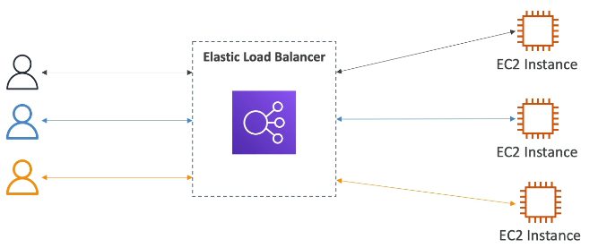

### Why Use a Load Balancer?

*   **Single Point of Access:** Expose a single entry point to your applications. 🚪
*   **Seamless Failure Handling:** Automatically handle failures of downstream instances. ⚙️ The load balancer uses health checks to determine which instances can receive traffic.
*   **Health Checks:** Monitor the health of your instances. ✅
*   **SSL Termination:** Handle HTTPS encrypted traffic for your websites. 🔒
*   **Stickiness:** Enforce session stickiness with cookies. 🍪
*   **High Availability:** Achieve high availability across availability zones. 🌐
*   **Traffic Separation:** Separate public traffic from private traffic. ☁️

### Elastic Load Balancer (ELB)

The Elastic Load Balancer is a managed load balancer service on AWS.

*   AWS manages the ELB, guaranteeing its operation.
*   AWS handles upgrades, maintenance, and high availability.
*   You have configuration options to tweak the ELB's behavior.

Using an ELB is generally more cost-effective and easier to manage than setting up your own load balancer. It also offers better scalability.

The ELB integrates with various AWS services, including:

*   EC2 instances
*   Auto Scaling groups
*   Amazon ECS
*   Certificate Manager
*   CloudWatch
*   Route 53
*   WAF
*   Global Accelerator
*   And more!

### Health Checks in Detail

Health checks are crucial for load balancers. They verify if an EC2 instance is working correctly. If an instance is unhealthy, the load balancer will not send traffic to it.

Health checks are configured using:

*   A port
*   A route to check the health endpoint

📌 **Example:**

*   Protocol: HTTP
*   Port: 4567
*   Endpoint: `/health`

If the EC2 instance does not respond with a 200 OK status code, it is marked as unhealthy.

### Types of Managed Load Balancers on AWS

AWS offers four types of managed load balancers:

1.  **Classic Load Balancer (CLB):** 👴 (Older Generation/V1 - 2009)
    *   Supports HTTP, HTTPS, TCP, and SSL.
    *   AWS recommends using newer generation load balancers. It is shown as **deprecated** in the console but is still available.

2.  **Application Load Balancer (ALB):** 🌐 (2016)
    *   Supports HTTP, HTTPS, and WebSocket protocols.

3.  **Network Load Balancer (NLB):** ⚡ (2017)
    *   Supports TCP, TLS, UDP, and TCP protocols.

4.  **Gateway Load Balancer (GWLB):** 🚪 (2020)
    *   Operates at the network layer (Layer 3).
    *   Supports IP protocol.

It is recommended to use the newer generation load balancers (ALB, NLB, GWLB) as they provide more features.

Load balancers can be:

*   **Internal (Private):** For private access within your network.
*   **External (Public):** For public-facing applications and websites.

### Security Considerations

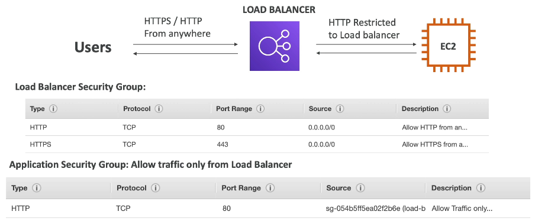

Users access your load balancer via HTTP or HTTPS.

*   **Load Balancer Security Group Rule:**
    *   Port Range: 80 or 443
    *   Source: `0.0.0.0/0` (anywhere)

```
# Example Security Group Rule for Load Balancer
Type: HTTP/HTTPS
Port Range: 80/443
Source: 0.0.0.0/0
```

EC2 instances should only allow traffic from the load balancer.

*   **EC2 Instance Security Group Rule:**
    *   Allow HTTP traffic on port 80.
    *   Source: Security Group of the Load Balancer.
    * It should allow the HTTP traffic only from the load balancer.

```
# Example Security Group Rule for EC2 Instance
Type: HTTP
Port: 80
Source: <Security Group ID of Load Balancer>
```

This enhances security by ensuring that EC2 instances only accept traffic originating from the load balancer.

---

## 3. Classic Load Balancer (CLB)

Note: About the Classic Load Balancer (CLB)

The Classic Load Balancer is deprecated at AWS and will soon not be available in the AWS Console.

The exam also has removed any references to it, so we will not cover it in depth in the course, nor the hands-on

---

## 4. Application Load Balancer (ALB)

The second type of load balancer we'll explore is the Application Load Balancer (ALB).

*   It operates at **Layer 7** of the OSI model, focusing on HTTP and HTTPS traffic.
*   It routes traffic to multiple HTTP applications across different machines.
*   These machines are grouped into **target groups**.

### Key Features of ALB

*   ✅ Load balancing to multiple applications on the same EC2 instance, especially useful with containers and ECS.
*   ✅ Support for HTTP/2 and WebSockets.
*   ✅ Redirection capabilities, such as automatically redirecting HTTP traffic to HTTPS.
*   ✅ Advanced routing based on:
    *   Target path in the URL (e.g., `example.com/users` vs. `example.com/posts`).
    *   Hostname (e.g., `one.example.com` vs. `other.example.com`).
    *   Query strings and headers (e.g., `example.com/reserves?id=123&order=false`).

### Use Cases

ALBs are ideal for:

*   Microservices architectures.
*   Container-based applications.

When using Docker and Amazon ECS, ALBs are often the preferred choice due to their port mapping features, allowing redirection to dynamic ports on ECS instances.

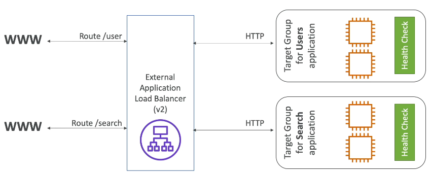

### Comparison with Classic Load Balancers

Unlike Classic Load Balancers, which require one load balancer per application, a single ALB can manage multiple applications.

### Target Groups Explained

Target groups can consist of:

*   EC2 instances (managed by Auto Scaling Groups).
*   ECS tasks (covered in the ECS section).
*   Lambda functions (enabling serverless architectures).
*   IP addresses (must be private IP addresses).

ALBs can route traffic to multiple target groups, and health checks are performed at the target group level.

### 📌 Example: Routing Based on Client Type (Query Strings/Parameters Routing)

Imagine an ALB with two target groups:

1.  EC2 instances on AWS.
2.  Private servers in an on-premises data center.

We want to route mobile traffic to the first target group and desktop traffic to the second. We can achieve this using query string parameters:

*   If the URL contains `?Platform=Mobile`, route to the first target group.
*   If the URL contains `?Platform=Desktop`, route to the second target group.

This can be configured in the ALB's routing rules.

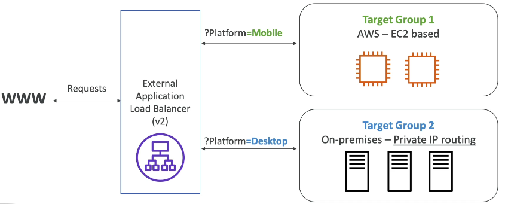

### Important Considerations

*   ALBs provide a fixed hostname (`XX.region.elb.amazonaws.com`), similar to Classic Load Balancers.
*   Application servers do not directly see the client's IP address.
*   The client's true IP is inserted into the `X-Forwarded-For` header.
*   The port is available in the `X-Forwarded-Port` header.
*   The protocol is available in the `X-Forwarded-Proto` header.

### Client-Load Balancer Interaction

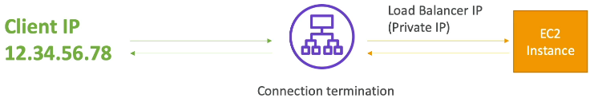

1.  The client (e.g., IP `12.34.56.78`) connects to the load balancer.
2.  The load balancer terminates the connection.
3.  The load balancer connects to the EC2 instance using its private IP.
4.  To determine the client's IP, the EC2 instance must examine the `X-Forwarded-For` header.

```
Client (12.34.56.78) --> ALB --> EC2 Instance (Check X-Forwarded-For header)
```

That concludes the overview of Application Load Balancers.

---

## 5. Launching an Application Load Balancer (ALB) 🚀

This section walks you through launching an Application Load Balancer (ALB) to distribute traffic between two EC2 instances.

### 1. Launching EC2 Instances 🖥️

First, we need to create the EC2 instances that the load balancer will manage.

1.  Go to the EC2 Management Console and select "Launch Instances".
2.  Launch **two** instances.
3.  Name the first instance "My First Instance". The second will be renamed later.
4.  Choose **Amazon Linux 2023** as the AMI.
5.  Select a **t2.micro** instance type.
6.  Choose **not to use a key pair** as we will use EC2 Instance Connect if needed.
7.  For network settings, select an existing security group, specifically **Launch Wizard 1 security group**, which allows HTTP and SSH traffic. For HTTP traffic, it should allow both MyIP and Load Balancer security groups, therefore either add them both in the inbound rules or allow all traffic (0.0.0.0/0) on port 80. We will see more about this later.
8.  Use the default storage settings.
9.  In "Advanced Details", add the following EC2 user data script:

    ```bash
    #!/bin/bash
    yum update -y
    yum install -y httpd
    systemctl start httpd
    systemctl enable httpd
    echo "<h1>Hello World from $(hostname -f)</h1>" > /var/www/html/index.html
    ```

10. Launch the instances.
11. Rename the second instance to "My Second Instance".
12. Wait for both instances to be in the "running" state.

### 2. Verifying EC2 Instances 🌐

1.  Copy the IPv4 address of "My First Instance".
2.  Paste the IPv4 address into your browser. You should see "Hello World" from the instance.
3.  Repeat for "My Second Instance". You should see "Hello World" from the second instance.

### 3. Creating the Application Load Balancer (ALB) ⚖️

Now, let's create the ALB to balance traffic between the two instances.

1.  Navigate to the Load Balancers section in the EC2 Management Console.
2.  Click "Create Load Balancer".
3.  Select **Application Load Balancer**.
4.  Name the load balancer **DemoALB**.
5.  Set the scheme to **Internet-facing** and the address type to **IPv4**.
6.  For network mapping, select **all available Availability Zones**.
7.  Create a new security group for the load balancer:
    *   Name: `demo-sg-load-balancer`
    *   Description: `Allow HTTP into ALB`
    *   Inbound Rules: Allow HTTP (port `80`) from anywhere (0.0.0.0/0).
    *   Outbound Rules: The default rules are fine.
8.  Refresh the security group list and select **demo-sg-load-balancer**. Remove the default security group.
9.  Under "Listeners and Routing", you'll need to create a target group.

### 4. Creating a Target Group 🎯

A target group is a collection of EC2 instances that the load balancer will distribute traffic to.

1.  Click the link to create a target group.
2.  Choose **Instances** as the target type.
3.  Name the target group **demo-tg-alb**.
4.  Set the protocol to **HTTP** and the port to **80**.
5.  Keep HTTP version as **HTTP1**.
6.  Click "Next".
7.  Register both EC2 instances ("My First Instance" and "My Second Instance") as targets on port 80.
8.  Include them as pending below.
9.  Click "Create target group".
10. Refresh the load balancer configuration page and select the **demo-tg-alb** target group.
11. Click "Create load balancer".

### 5. Verifying the Load Balancer 🚦

1.  Wait for the load balancer to become active (provisioning state).
2.  Copy the **DNS name** of the load balancer.
3.  Paste the DNS name into your browser. You should see "Hello World" from one of the instances.
4.  Refresh the page multiple times. You should see the "Hello World" message alternating between the two instances, demonstrating load balancing.

### 6. Testing Health Checks ✅

1.  Navigate to the target group (**demo-tg-alb**) and check the targets. Both should be healthy.
2.  Stop one of the EC2 instances ("My First Instance").
3.  Wait for about 30 seconds.
4.  Refresh the target group page. The stopped instance should now be marked as unhealthy.
5.  Go back to the load balancer DNS name in your browser and refresh. You should only see the "Hello World" message from the healthy instance.
6.  Start the stopped EC2 instance ("My First Instance") again.
7.  Wait for the instance to be healthy again in the target group.
8.  Refresh the load balancer DNS name in your browser. You should now see the "Hello World" message alternating between both instances again.

📝 **Note:** The target group health checks ensure that the load balancer only sends traffic to healthy instances.

💡 **Tip:** Load balancers provide high availability and scalability for your applications by distributing traffic across multiple instances and automatically removing unhealthy instances from the pool.

---

## 6. Advanced Load Balancer Concepts

This section covers advanced concepts for load balancers, focusing on network security and application load balancer rules.

### Network Security 🛡️

It's often preferable to only allow access to EC2 instances through the load balancer, enhancing security. Here's how to configure this:

1.  Locate the security group associated with your EC2 instances.
2.  Edit the inbound rules for the EC2 instance security group.
3.  Remove the existing HTTP rule that allows traffic from anywhere.
4.  Add a new HTTP rule.
5.  Instead of specifying a CIDR block, select the security group of your load balancer as the source.

    ```
    Type: HTTP
    Source: [Your Load Balancer Security Group]
    ```

6.  Save the rule.

Now, direct access to the EC2 instance via its public IP will be blocked, but the load balancer can still access the instances.

📌 **Example:** If your load balancer's security group is named `load-balancer-sg`, the inbound rule for your EC2 instance should allow HTTP traffic only from `load-balancer-sg`.

### Application Load Balancer (ALB) Rules 🚦

ALB rules allow you to route traffic based on various conditions.

1.  Navigate to your ALB in the AWS console.
2.  Go to **Listeners** and select your listener.
3.  Scroll down to **Rules** and click **Add rule**.
4.  Give your rule a descriptive name (e.g., `DemoRule`).
5.  Add conditions to filter requests. Available conditions include:
    *   Host headers (e.g., `*.example.com`, `myapp.example.com`)
    *   Path (e.g., `/error`)
    *   HTTP request method (GET, POST, etc.)
    *   Source IP
    *   Query string
    *   HTTP header

    📌 **Example:** To create a rule that triggers when the path contains `/error`, select **Path** and enter `/error`.
6.  Define the action to take when the condition is met. Actions include:
    *   Forwarding to specific target groups.
    *   Redirecting to a specific URL (with customizable URI parts, full URL, protocol, and status code).
    *   Returning a fixed response.

    📌 **Example:** To return a 404 "Not Found" error when the path is `/error`, select **Return fixed response**, choose the **404** status code, and enter "Not found, custom error" as the response body.
7.  Set the priority of the rule. Lower numbers indicate higher priority (1 is the highest, up to 50,000). If multiple rules match a request, the rule with the highest priority wins.
8.  Review and create the rule.
  


Now, when a request matches the rule's condition, the specified action will be executed.

📌 **Example:** Accessing `http://your-load-balancer-dns/error` will trigger the rule and return the 404 "Not found, custom error" response.

---

## 7. Network Load Balancer (NLB)

The Network Load Balancer (NLB) operates at **layer 4** of the OSI model, dealing with TCP and UDP traffic. 🌐 Unlike Application Load Balancers (ALB) which handle HTTP (layer 7), NLBs work at a lower level.

*   NLBs are known for their **high performance**, capable of handling millions of requests per second with **ultra-low latency**. 🚀
*   Each NLB has **one static IP per Availability Zone (AZ)**, and supports assigning Elastic IP (helpful for whitelisting specific IP). You can assign an Elastic IP to each AZ. 📍
*   This is useful when your application needs to be accessed via a set of static IPs. When the requirement says you application should be accessed only via a set of static IPs (like only 2-3 IPs) then you need to think about network load balancer.

If you encounter scenarios involving extreme performance, TCP/UDP traffic, or the need for static IPs, consider the Network Load Balancer. 💡 **Tip:** Remember TCP/UDP = NLB.

⚠️ **Warning:** NLB usage is not included in the AWS Free Tier.

How it works:

1.  Create target groups.
2.  The NLB redirects traffic to these target groups.
3.  You can use TCP traffic on the front end and HTTP on the backend, for example.

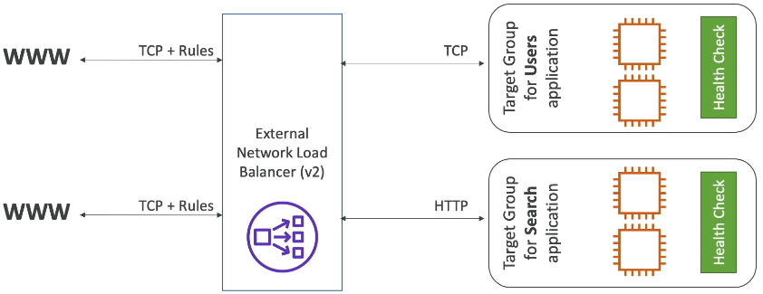


**Target groups for NLBs can include**:

*   EC2 instances: The NLB can send TCP or UDP traffic directly to your EC2 instances.
*   IP addresses: You can register IP addresses, which **must be private IPs**. 🔑
*   Lambda functions: You can register Lambda functions.
*   ALBs: You can register ALBs.

Why use private IPs?

*   You can use the private IP of an EC2 instance you own.
*   You can also use the private IP of a server in your own data center, allowing both to be fronted by the same NLB. 🏢

NLB in front of ALB:

It's possible to place an NLB in front of an ALB.

Why?

*   NLB provides fixed IP addresses.
*   ALB provides advanced rules for handling HTTP traffic.
*   This combination offers the benefits of both. 🤝

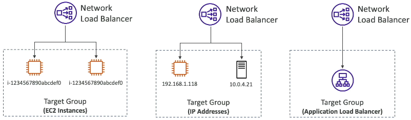

Health Checks:

The health checks performed by NLB target groups support three protocols:

1.  TCP
2.  HTTP
3.  HTTPS

If your backend application supports HTTP or HTTPS, you can define health checks using those protocols. ✅

📌 **Example:** You have an application that requires static IP addresses for security reasons. You can use an NLB to provide these static IPs, and then route the traffic to an ALB for HTTP-level routing and management.

📝 **Note:** NLBs are ideal for applications requiring high throughput and low latency, such as gaming servers or real-time streaming applications.

---

## 8. Creating a Network Load Balancer

Let's walk through the process of creating a Network Load Balancer (NLB).

1.  **Create the NLB:**
    *   Name: `DemoNLB`
    *   Scheme: Internet-facing
    *   IP Address Type: IPv4

2.  **Network Mapping:**
    *   Select your VPC.
    *   Choose all available Availability Zones (AZs). 📝 **Note:** Each AZ enabled for your NLB will be assigned a fixed IPv4 address by AWS. You can optionally use an Elastic IP address for each AZ.

3.  **Attach a Security Group:** 💡 **Tip:** Attaching a security group is highly recommended.
    *   Create a new security group (e.g., `demo-sg-nlb`).
    *   Inbound Rule: Allow HTTP traffic (port 80) from anywhere.
    *   Outbound Rules: Default outbound rules are usually sufficient.
    *   Select the newly created security group (`demo-sg-nlb`) and remove the default security group.

4.  **Listeners and Routing:**
    *   Protocol: TCP
    *   Port: 80
    *   Target Group: Create a new target group.

5.  **Create Target Group:**
    *   Choose target type: Instances
    *   Target group name: `demo-tg-nlb`
    *   Protocol: TCP
    *   Port: 80
    *   VPC: Select your VPC.
    *   **Health Checks:**
        *   Protocol: HTTP (since we have an HTTP application running on the EC2 instances)
        *   Advanced Health Check Settings:
            *   Healthy threshold: 2
            *   Timeout: 2 seconds
            *   Interval: 5 seconds
    * **Register Targets:**
        *   Select your available EC2 instances.
        *   Include them as pending targets.
        *   Create the target group.

6.  **Associate Target Group with NLB:**
    *   Refresh the target group list in the NLB configuration.
    *   Select the `demo-tg-nlb` target group.

7.  **Create the NLB:** Review the configuration and create the NLB.

8.  **Troubleshooting Unhealthy Instances:**
    *   If the instances in the target group show as unhealthy, check the security group configuration of the EC2 instances.
    *   The EC2 instances need to allow HTTP traffic from the NLB's security group (`demo-sg-nlb`).
    *   📌 **Example:**
        *   Original EC2 Security Group: Allowed HTTP from the Application Load Balancer's (ALB) security group.
        *   Required Change: Add an inbound rule to allow HTTP traffic from the NLB's security group (`demo-sg-nlb`).

    ```
    # Example of a security group rule (Conceptual)
    # Allow HTTP (port 80) from the NLB security group
    ```

9.  **Verify Functionality:**
    *   Once the EC2 instances are healthy, access the NLB's URL in a web browser.
    *   You should see traffic being load balanced between the instances.

10. **Clean Up Resources (to avoid costs):**
    *   Delete the `DemoNLB` load balancer.
    *   Optionally, delete the `demo-tg-nlb` target group.
    *   Optionally, delete the `demo-sg-nlb` security group.

---

## 9. Gateway Load Balancer

The Gateway Load Balancer is the newest type of load balancer. It's used to deploy, scale, and manage your fleet of third-party network virtual appliances in AWS. Let's explore what that means.

You would use a Gateway Load Balancer if you want all traffic of your network to go through:

*   A firewall.
*   An intrusion detection and prevention system (IDPS).
*   A deep packet inspection system.
*   A system to modify payloads at the network level.

Let's simplify this with a diagram. Imagine users accessing your applications.

Normally, users access applications directly through an Application Load Balancer (ALB). Traffic flows directly from users to the ALB, and then to the application.

But what if you need all network traffic inspected *before* reaching your application? You might have deployed third-party virtual appliances (e.g., EC2 instances) that all traffic must pass through.

Previously, this was complicated. Now, with a Gateway Load Balancer, it's much simpler.

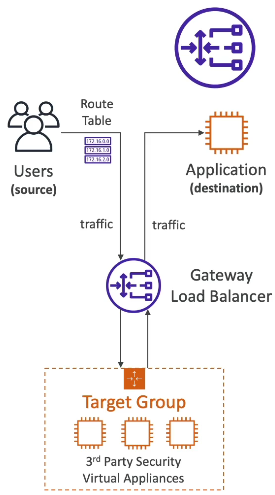

You create a Gateway Load Balancer. Behind the scenes, route tables in your VPC are updated. 📝 **Note:** This is more on the networking side.

Now, all user traffic first goes through the Gateway Load Balancer. The Gateway Load Balancer distributes the traffic across a target group of your virtual appliances.

1.  Traffic reaches these appliances.
2.  The appliances analyze the traffic (e.g., firewall, intrusion detection).
3.  If the appliances are happy with the traffic, they send it back to the Gateway Load Balancer.
4.  If not, they can drop the traffic. 📌 **Example:** A firewall might drop malicious traffic.

If the traffic is accepted, it goes through the Gateway Load Balancer again, which then forwards the traffic to your application. This process is transparent to your application. The key is that all traffic has been analyzed by your third-party virtual appliances, allowing you to analyze network traffic and potentially drop it.

This is the power of the Gateway Load Balancer: analyzing network traffic.

How does it work? The Gateway Load Balancer operates at Layer 3 (network layer for IP packets).

The Gateway Load Balancer has two primary functions:

1.  Transparent Network Gateway: All traffic in your VPC goes through a single entry and exit point – the Gateway Load Balancer.
2.  Load Balancer: It distributes traffic across a set of virtual appliances in your target group.

So, remember these two functions.

If you see the **GENEVE** protocol on port **6081** in an exam question, it's likely related to the Gateway Load Balancer.

What can be target groups for Gateway Load Balancers? These are your third-party appliances. They can be:

*   EC2 instances (registered by instance ID).
*   IP addresses (must be private IPs). 📌 **Example:** If you're running virtual appliances on your own network/data center, you can register them by IP manually.

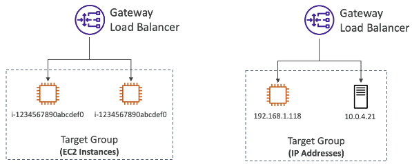


That's the core concept of the Gateway Load Balancer. 💡 **Tip:** Understand the diagram of traffic flow; it's key to understanding Gateway Load Balancers. You're unlikely to encounter deep-dive questions, but understanding the high-level functionality is important.

---

## 10. Sticky Sessions (Session Affinity) 🍪

Sticky sessions, also known as session affinity, allow you to direct client requests to the same backend instance behind a load balancer. Let's dive into how this works!

### How Sticky Sessions Work ⚙️

The core idea is that if a client makes multiple requests to a load balancer, all those requests will be handled by the same EC2 instance.

📌 **Example:**

Imagine an Application Load Balancer (ALB) with two EC2 instances and three clients.

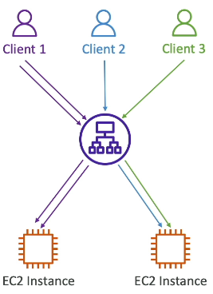

*   Client 1 makes a request and it's routed to EC2 Instance 1. Subsequent requests from Client 1 will also be routed to EC2 Instance 1.
*   Client 2's requests are routed to EC2 Instance 2, and all its future requests will also go to EC2 Instance 2.
*   The same applies to Client 3.

This behavior differs from the default load balancing behavior, where requests are spread across all available EC2 instances.

Sticky sessions can be enabled for:

*   Classic Load Balancer
*   Application Load Balancer
*   Network Load Balancer

### The Cookie Connection 🍪

Sticky sessions rely on cookies. When a client makes a request, the load balancer sends a cookie back to the client. This cookie contains information about the stickiness and an expiration date.

*   When the cookie expires, the client may be redirected to a different EC2 instance.

> Note: NLB works without cookies. 

### Use Cases and Considerations 🤔

The primary use case for sticky sessions is to ensure that a user remains connected to the same backend instance to avoid losing session data. This is particularly important for applications that store user-specific information, such as login details, in the session.

⚠️ **Warning:** Enabling stickiness can lead to an imbalance in the load across your backend EC2 instances. If some users are particularly "sticky," their associated instances may become overloaded.

### Types of Cookies 🍪

There are two main types of cookies used for sticky sessions:

1.  Application-Based Cookies
2.  Duration-Based Cookies

#### 1. Application-Based Cookies 🍪

* Custom Cookie
  *   Generated by your application/target itself.
  *   You can include any custom attributes required by your application.
  *   The cookie name must be specified individually for each target group.
  *   You **must not** use the following reserved names: `AWSALB`, `AWSALBAPPOR`, or `AWSALBTG`.

      📌 **Example:**
      Your application sets a cookie named `MYCUSTOMCOOKIE`.
* Application Cookie
  *   Generated by the load balancer.
  *   The cookie name is `AWSALBAPP` for the ALB.

#### 2. Duration-Based Cookies ⏳

*   These cookies are generated by the load balancer.
*   The cookie name is `AWSALB` for the ALB and `AWSELB` for the CLB.
*   They have an expiry based on a specific duration set by the load balancer.
*   With application-based cookies, the duration can be specified by the application itself.

📝 **Note:** While you don't need to memorize the exact cookie names, remember the distinction between application-based and duration-based cookies, as this becomes relevant when working with CloudFront.

### Enabling Sticky Sessions in the AWS Console ⚙️

Here's how to enable sticky sessions using the AWS Management Console:

1.  Navigate to the **Target Group** associated with your load balancer.
2.  Choose **Actions** and then **Edit attributes**.
3.  Locate the **Target selection configuration** section.
4.  Find the **Stickiness** setting and turn it **On**.
5.  Select the type of stickiness you want to use:

    *   **Load balancer generated cookie:** Allows you to set a duration (from 1 second to 7 days).
    *   **Application-based cookie:** Requires you to specify an application cookie name (e.g., `MYCUSTOMCOOKIEAPP`).

    > For our demo, we'll use the **Load balancer generated cookie**, and keep the default durations.

6.  Click **Save changes**.

### Verifying Sticky Sessions 🕵️‍♀️

To verify that sticky sessions are working:

1.  Open your browser's developer tools (usually by pressing F12).
2.  Go to the **Network** tab.
3.  Refresh the page multiple times.
4.  Observe the server instance that's responding to your requests. With sticky sessions enabled, you should consistently see the same instance.
5.  Examine the **Cookies** associated with the requests. You should see a cookie (`AWSALB` or your custom application cookie) being set by the load balancer and sent back with subsequent requests.

### Disabling Sticky Sessions 🚫

To disable sticky sessions and revert to the default load balancing behavior:

1.  Go back to your **Target Group**.
2.  Edit the **Attributes**.
3.  Turn **Stickiness** **Off**.
4.  Click **Save changes**.

---

## 11. Cross Zone Load Balancing

Cross-zone load balancing distributes traffic across multiple Availability Zones (AZs) to improve application availability and fault tolerance. Let's explore how it works with different types of load balancers.

### Cross Zone Load Balancing: An Imbalanced Example

Imagine a scenario with two Availability Zones:

*   AZ1: Contains a load balancer with 2 EC2 instances.
*   AZ2: Contains a load balancer with 8 EC2 instances.

Clients access these load balancers, which are part of a larger, general load balancer.

#### 1. With Cross Zone Load Balancing Enabled

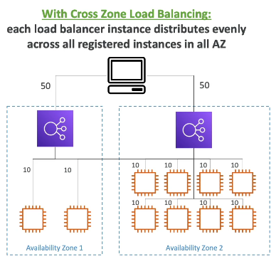

When cross-zone load balancing is enabled:

1.  Clients send traffic (e.g., 50%) to each load balancer instance.
2.  But each load balancer instance redirect/distributes traffic evenly across **all** registered instances in **all** AZs regardless of their own AZ.
3.  📌 **Example:** The second ALB instance sends 10% of its received traffic to each of the 10 EC2 instances (2 in AZ1 and 8 in AZ2). The first ALB instance does the same.

This ensures even traffic distribution across all EC2 instances, regardless of their AZ.

#### 2. Without Cross Zone Load Balancing Enabled

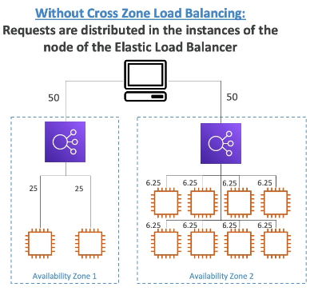

When cross-zone load balancing is disabled:

1.  Clients send traffic (e.g., 50%) to each AZ.
2.  Each load balancer instance distributes traffic only to the EC2 instances within its own AZ.
3.  📌 **Example:** The ALB instance in AZ1 sends traffic only to the 2 EC2 instances in AZ1 (each receiving 25% of the overall traffic). The ALB instance in AZ2 sends traffic only to the 8 EC2 instances in AZ2.

In this case, traffic is contained within each AZ. If there's an imbalanced number of EC2 instances in each AZ, some instances will receive more traffic than others.

### Load Balancer Types and Cross Zone Load Balancing

The behavior of cross-zone load balancing varies depending on the type of load balancer:

*   **Application Load Balancer (ALB):**
    *   Enabled by default.
    *   Can be disabled at the target group level.
    *   No charges for inter-AZ data transfer. 💰
*   **Network Load Balancer (NLB) & Gateway Load Balancer:**
    *   Disabled by default.
    *   Enabling it incurs charges ($$) for inter-AZ data transfer. 💸
*   **Classic Load Balancer:**
    *   Disabled by default.
    *   No charges for inter-AZ data transfer if enabled. 💰
    *   ⚠️ **Warning:** The Classic Load Balancer is being retired soon, so it's not recommended for new deployments.

### Configuring Cross Zone Load Balancing

Let's look at how to configure cross-zone load balancing for different load balancer types.

#### Network Load Balancer

1.  Go to the Network Load Balancer in the AWS console.
2.  Click on "Attributes".
3.  Edit the "Cross-zone load balancing" setting to "On".
    ```
    Enable cross zone balancing?
    This may include some regional charges for your NLB.
    ```

#### Gateway Load Balancer

The configuration is similar to the Gateway Load Balancer.

1.  Go to the Gateway Load Balancer in the AWS console.
2.  Click on "Attributes".
3.  Edit the "Cross-zone load balancing" setting to "On".
    ```
    Enable cross zone balancing?
    This will imply data charges.
    ```

#### Application Load Balancer

Cross-zone load balancing is enabled by default at the load balancer level. However, you can control it at the target group level:

1.  Go to the Application Load Balancer in the AWS console.
2.  Go to "Target Groups" and select the target group you want to configure.
3.  Click on "Attributes".
4.  Edit the "Cross-zone load balancing" setting. You can choose to:
    *   Inherit settings from the load balancer attributes (On by default).
    *   Force "On".
    *   Force "Off".

### Key Takeaways

*   Cross-zone load balancing distributes traffic across multiple AZs.
*   ALBs have it enabled by default (and no inter-AZ charges).
*   NLBs and Gateway Load Balancers have it disabled by default (and incur inter-AZ charges if enabled).
*   Classic Load Balancers are being retired.
*   The choice to enable or disable cross-zone load balancing depends on your specific use case and cost considerations. 💡 **Tip:** Consider the distribution of your instances across AZs and the potential cost implications when making your decision.

---

## 12. SSL and TLS Certificates

This section provides a simplified explanation of SSL and TLS certificates, including their use with load balancers and the importance of Server Name Indication (SNI).

An SSL certificate encrypts traffic between clients and a load balancer while in transit, a process known as in-flight encryption. This ensures that data is protected as it travels across the network. And only going to be decrypted by the sender and receiver.

*   SSL (Secure Sockets Layer) is used to encrypt transfer connections.
*   TLS (Transport Layer Security) is the newer version of SSL.
*   📝 **Note:**: Nowadays, TLS certificates are mainly used, but the people still refer as "SSL" (for simplicity).

Public SSL certificates are issued by Certificate Authorities (CAs) such as:

*   Comodo
*   Symantec
*   GoDaddy
*   GlobalSign
*   Digicert
*   Letsencrypt

Using a public SSL certificate on a load balancer encrypts the connection between clients and the load balancer. A lock icon in a web browser indicates that traffic is encrypted. A warning sign indicates that the traffic is not encrypted.

SSL certificates have an expiration date and must be renewed regularly to maintain authenticity.

### How it Works with Load Balancers

1.  Users connect over HTTPS (HTTP Secure), which uses SSL certificates for encryption.
2.  The connection travels over the public internet to the load balancer.
3.  The load balancer performs SSL certificate termination.
4.  Internally, the load balancer can communicate with EC2 instances using HTTP over the VPC (Virtual Private Cloud), which is a private network.
5.  The load balancer loads an X.509 certificate, also known as an SSL or TLS server certificate.

SSL certificates can be managed in AWS using AWS Certificate Manager (ACM). You can upload your own certificates to ACM. When configuring an HTTPS listener, a default certificate must be specified. An optional list of certificates can be added to support multiple domains. Clients can use SNI (Server Name Indication) to specify the hostname they are trying to reach. A specific security policy can be set to support older versions of SSL and TLS for legacy clients.

### Server Name Indication (SNI) Explained

SNI is crucial for loading multiple SSL certificates onto a single web server to serve multiple websites. It is a newer protocol and requires the client to indicate the hostname of the target server during the initial SSL handshake.

*   The client tells the server which website it wants to connect to.
*   The server then knows which certificate to load.

This functionality is supported by:

*   Application Load Balancer (ALB)
*   Network Load Balancer (NLB)
*   CloudFront

⚠️ **Warning:** SNI is **not** supported by the Classic Load Balancer. If you need multiple SSL certificates, use ALB or NLB.

📌 **Example:**

Imagine an ALB with two target groups: `www.mycorp.com` and `Domain1.example.com`. The ALB has two SSL certificates corresponding to these domains.

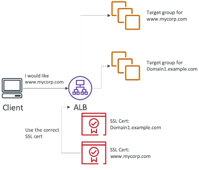

1.  A client connects to the ALB and requests `www.mycorp.com`.
2.  The ALB, using SNI, identifies the requested hostname.
3.  The ALB selects the `www.mycorp.com` SSL certificate.
4.  The traffic is encrypted using the correct certificate.
5.  The ALB routes the traffic to the `www.mycorp.com` target group.

The same process applies if another client connects to `Domain1.example.com`.

SNI enables the use of multiple target groups for different websites, each using its own SSL certificate.

### SSL Certificate Support by Load Balancer Type

*   **Classic Load Balancer [Deprecated]:** Supports only one SSL certificate. To support multiple hostnames with multiple SSL certificates, use multiple Classic Load Balancers.
*   **Application Load Balancer (ALB):** Supports multiple listeners with multiple SSL certificates, using SNI.
*   **Network Load Balancer (NLB):** Supports multiple listeners with multiple SSL certificates, using SNI.

---

## 13. Enabling SSL Certificates on ALB and NLB

Let's explore how to enable SSL certificates on both the Application Load Balancer (ALB) and the Network Load Balancer (NLB).

### Application Load Balancer (ALB)

To enable SSL on an ALB, you need to add an HTTPS listener.

1.  Add a new listener.
2.  Set the protocol to HTTPS and the port to 443 (default).
3.  Configure the listener to forward traffic from port 443 to a specific target group.
4.  Configure secure listener settings:
    *   Set an SSL security policy to manage certificate negotiation. This is important for compatibility with older SSL/TLS versions. You can usually leave this as default.
    *   Specify the location of your SSL/TLS certificate. You have several options:
        *   Amazon Certificate Manager (ACM): This is the recommended approach.
        *   IAM: Not recommended.
        *   Import: You can paste the private key, certificate body, and certificate chain directly. This imports the certificate into ACM.

### Network Load Balancer (NLB)

The process for NLB is similar to ALB.

1.  Go to the NLB listeners.
2.  Add a listener and set the protocol to TLS.
3.  Forward traffic to a target group.
4.  Configure the security policy.
5.  Choose the certificate source:
    *   ACM
    *   IAM
    *   Import
6.  Optionally, configure Application Layer Protocol Negotiation (ALPN). 📝 **Note:** This is an advanced TLS setting.

That's how you can use SSL/TLS certificates on your load balancers! 🚀

---

## 14. Connection Draining / Deregistration Delay

This lecture covers Connection Draining (for Classic Load Balancers) and Deregistration Delay (for Application and Network Load Balancers). These features are important for ensuring smooth transitions when instances are being deregistered or marked as unhealthy.

The core idea is to allow instances time to complete active requests before being fully removed from service.

Here's how it works:

*   When an instance is being drained:
    *   The ELB stops sending new requests to that instance.
    *   Existing connections are allowed to complete within a specified time period (the "draining period").
*   Users already connected to the draining instance are given time to complete their existing requests.
*   New users are routed to healthy instances.
   
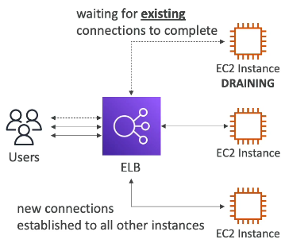

Let's visualize this: Imagine three EC2 instances behind a load balancer. One instance is set to draining mode.

1.  Users already connected to the draining instance are given time to complete their requests.
2.  New connections are established with the other two instances.

You can configure the Connection Draining/Deregistration Delay period.

*   The configurable range is 1 to 3,600 seconds.
*   The default is 300 seconds (5 minutes).
*   You can disable it entirely by setting the value to zero.

Here's a summary of the configuration options:

*   **Range:** 1 - 3600 seconds
*   **Default:** 300 seconds
*   **Disabled:** 0 seconds

Choosing the right value depends on the nature of your requests:

*   If requests are short (e.g., less than 1 second), a shorter draining period (e.g., 30 seconds) is appropriate. This allows for faster instance removal.
*   If requests are long-lived (e.g., uploads), a longer draining period is necessary. ⚠️ **Warning:** This means the instance will remain active for a longer period before being terminated.

💡 **Tip:** Consider the trade-off between allowing requests to complete and the time it takes to remove an instance.

---

## 15. Understanding Auto Scaling Groups (ASG)

When deploying a website or application, the load can fluctuate. Auto Scaling Groups (ASGs) automate the process of adjusting the number of EC2 instances to match the current demand.

The primary goal of an ASG is to:

*   📈 **Scale Out:** Add EC2 instances to handle increased load.
*   📉 **Scale In:** Remove EC2 instances to match decreased load.

The size of the ASG varies dynamically based on the load. You can define parameters to ensure a minimum and maximum number of EC2 instances are running at any time.

### Key Features of ASGs

*   🔗 **Load Balancer Integration:** ASGs seamlessly integrate with load balancers. Any EC2 instance launched as part of the ASG is automatically linked to the load balancer.
*   🩺 **Health Checks:** If an instance is deemed unhealthy, the ASG automatically terminates it and launches a new one to replace it. This ensures high availability and resilience.
*   💰 **Cost-Effective:** ASGs themselves are free. You only pay for the underlying resources, such as the EC2 instances that are launched.

### How ASGs Work

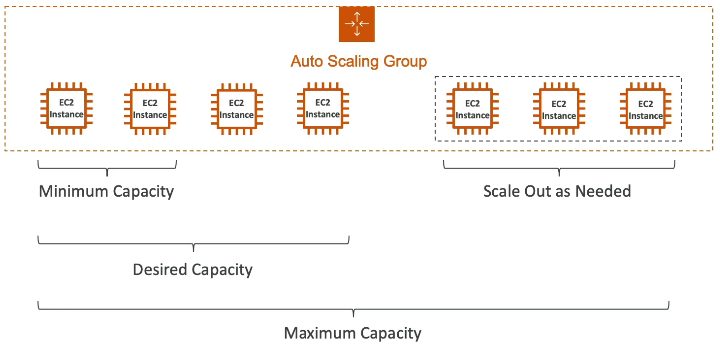

1.  **Define Capacity:**
    *   **Minimum Capacity:** The minimum number of instances the ASG should maintain. 📌 **Example:** 2
    *   **Desired Capacity:** The desired number of instances the ASG should aim for. 📌 **Example:** 4
    *   **Maximum Capacity:** The maximum number of instances the ASG can scale up to. 📌 **Example:** 7
2.  **Scaling Out:** If the desired capacity is increased (but remains less than the maximum capacity), the ASG will launch additional EC2 instances to meet the demand.
3.  **Load Balancer Integration:** When instances are registered in the ASG, the Elastic Load Balancer (ELB) distributes traffic to them.
4.  **Health Checks:** The ELB performs health checks on the EC2 instances. If an instance fails the health check, the ELB informs the ASG.
5.  **Automatic Instance Replacement:** The ASG terminates unhealthy instances (as identified by the ELB) and launches new ones to maintain the desired capacity.

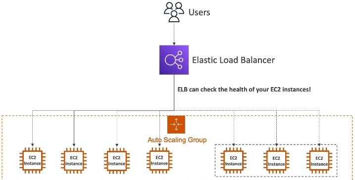

### Load Balancer and ASG Synergy

Using a load balancer with an ASG is a powerful combination:

*   The ELB distributes traffic evenly across healthy instances.
*   The ASG ensures that the desired number of healthy instances is always running.
*   When the ASG scales out, the ELB automatically starts sending traffic to the new instances.

### Attributes for Creating an ASG

To create an ASG, you need a **Launch Template**. Launch Configurations are deprecated, but the concept is the same.

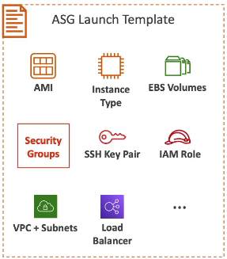

A launch template contains the information needed to launch EC2 instances within the ASG, including:

*   AMI ID
*   Instance Type
*   EC2 User Data
*   EBS Volumes
*   Security Groups
*   SSH Key Pair
*   IAM Roles
*   Network and Subnet Information
*   Load Balancer Information

These parameters are similar to those specified when creating an EC2 instance manually.

In addition to the launch template, you need to define:

*   Minimum Size
*   Maximum Size
*   Initial Capacity
*   Scaling Policies

### Scaling Policies and CloudWatch Alarms

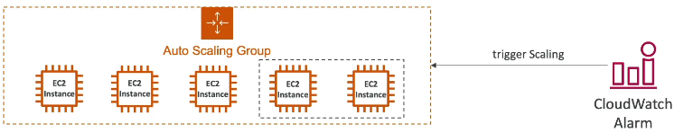

ASGs can be integrated with CloudWatch alarms to automate scaling based on metrics.

1.  **CloudWatch Alarms:** CloudWatch monitors metrics (e.g., average CPU utilization) and triggers alarms when thresholds are breached.
2.  **Scaling Policies:** Based on the alarm state, the ASG executes scaling policies.
    *   **Scale-Out Policies:** Increase the number of instances.
    *   **Scale-In Policies:** Decrease the number of instances.

📌 **Example:** If the average CPU utilization across the ASG exceeds 70%, a CloudWatch alarm can trigger a scale-out policy, adding more EC2 instances to the ASG.

This integration provides an automatic scaling mechanism, hence the name "Auto Scaling Group."

---

## 16. Auto Scaling Groups Practice

Let's practice using auto scaling groups (ASG).

First, ensure you have zero instances running in EC2 by terminating all existing instances.

Next, we'll create an auto scaling group.

1.  Navigate to "Auto Scaling Groups" in the AWS console.
2.  Click "Create auto scaling group".
3.  Name the ASG "DemoASG".
4.  We need to refer to a launch template, so let's create one.

### Creating a Launch Template

1.  Give the launch template a name, such as "MyDemoTemplate", and a description, like "Templates".
2.  Specify the following options:
    *   **Amazon Machine Image (AMI):** Choose "Amazon Linux 2023" from Quick Start. Select a free tier eligible AMI.
    *   **Instance Type:** Select "t2.micro" (free tier eligible).
    *   **Key Pair:** Include your EC2 key pair (e.g., "EC2 tutorial").
    *   **Security Group:** Select an existing security group (e.g., "launch wizard 1").
    *   **Volume:** Accept the default 8 GB gp2 volume.
    *   **User Data:** Input the user data to create a web server on each EC2 instance in the ASG. 📌 **Example:**

        ```bash
        #!/bin/bash
        yum update -y
        yum install -y httpd
        systemctl start httpd
        systemctl enable httpd
        echo "<h1>Hello World from ASG - $(hostname -f)</h1>" > /var/www/html/index.html
        ```
3.  Create the launch template.
4.  Refresh the ASG creation page and select the newly created launch template ("my demo template").

### Configuring the Auto Scaling Group

1.  Choose instance launch options. You can override the launch template with specific instance type requirements, but for this demo, reset to the launch template to use only `t2.micro`.
2.  Under "Network", select your VPC and multiple Availability Zones (AZs) to launch instances across them. Keep the AZ distribution as "balanced best effort".
3.  Optionally, integrate with a load balancer:
    *   Attach the ASG to an existing load balancer target group (e.g., "demo tg alb load balancer"). This will attach all instances from the ASG to the load balancer through the target group.
4.  For health checks, enable both EC2 health checks (by default enabled) and load balancer health checks. The load balancer will check the health of the EC2 instances, and the ASG can terminate unhealthy instances.
5.  Set the desired, minimum, and maximum capacity to 1. We'll explore scaling later.
6.  Leave the automatic scaling settings as default for now.
7.  Review the options and create the auto scaling group.

### Verifying the Auto Scaling Group

The ASG will create one EC2 instance.

1.  Click on the ASG to view details, including desired, minimum, and maximum capacity, and the launch template used.
2.  Go to the "Activity" tab to see the ASG's actions.
3.  Refresh the activity history to see the launching of a new instance. This is because the ASG is increasing the number of EC2 instances to match the desired capacity.
4.  In the "Instance management" tab, you'll see the EC2 instance created by the ASG.
5.  Go to the EC2 instances tab to confirm the instance is running and initializing.

### Verifying Load Balancer Integration

Because the ASG is linked to the target group:

1.  Go to "Target Groups" and find your target group.
2.  Go to "Targets". Your EC2 instance will be registered into the ALB.
3.  Initially, the instance may show as unhealthy because it's still bootstrapping.
4.  Once the instance is healthy, it will be registered into the ALB.
5.  Go to your ALB and refresh. You should see the "Hello World" response, indicating everything is functioning correctly.

⚠️ **Warning:** If the instance never becomes healthy, it will be terminated and a new one will be created. This is likely due to a misconfiguration in the security group or EC2 user data script. Check these before troubleshooting.

### Scaling the Auto Scaling Group

1.  Edit the auto scaling group size to increase the desired capacity to 2. Make sure to increase the maximum capacity as well.
2.  Update the ASG.
3.  Go to the activity history and refresh. You'll see a new activity for launching an EC2 instance.
4.  A second EC2 instance will be created and, after a while, registered into the target group.
5.  Once the instance is healthy, go to your ALB and refresh. You should see two IPs looping through your ALB.

### Scaling Down the Auto Scaling Group

1.  Edit the auto scaling group size to decrease the desired capacity back to 1.
2.  Update the ASG.
3.  The ASG will terminate one of the instances and deregister it from the target group.
4.  You'll be back to one EC2 instance in your ASG.

You've now seen the power of ASGs! 🚀

---

## 17. Auto Scaling Group Scaling Policies

Auto Scaling Groups (ASG) offer several scaling policies to dynamically adjust capacity based on demand. Here's a breakdown:

### a. Dynamic Scaling

This category includes policies that automatically adjust capacity based on real-time conditions.

*   **Target Tracking Scaling:** 🎯
    *   Simple to set up.
    *   Define a metric for your ASG (e.g., CPU utilization).
    *   Define a target value (e.g., 40%).
    *   The ASG automatically scales out or in to maintain the metric around the target value.
*   **Simple or Step Scaling:** 🪜
    *   Define CloudWatch alarms.
    *   Alarms trigger when you want to add or remove capacity from the ASG. Example: CPU utilization is > 70% then add 2 units. When CPU utilization is < 30%, remove 1 unit.

### b. Scheduled Scaling

This is based on anticipated scaling needs.

*   You predict scaling based on known usage patterns.
*   📌 **Example:** Increase minimum capacity to 10 every Friday at 5:00 PM to handle increased user traffic.
   
### c. Predictive Scaling

This uses historical data to forecast future load.

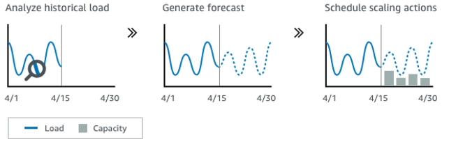

*   Continuously forecasts load and schedules scaling actions ahead of time.
*   Ideal for repeating patterns.
*   The ASG analyzes historical load, generates a forecast, and schedules scaling actions based on the forecast.
*   Very useful for cyclical data.

### Metrics to Scale On

Choosing the right metric depends on your application. Here are some common options:

1.  **CPU Utilization:** 💻
    *   Instances use CPU when processing requests.
    *   Higher average CPU utilization across instances indicates increased load.
2.  **RequestCountPerTarget:** 🚦
    *   Application-specific.
    *   Based on testing, determine the optimal number of requests an EC2 instance can handle (e.g., 1,000 requests per target).
    *   📌 **Example:** An ASG with three EC2 instances and an ALB distributing requests evenly results in a RequestCountPerTarget of three (each instance handles three requests on average).
3.  **Average Network In/Out:** 🌐
    *   Useful for network-bound applications (e.g., frequent uploads/downloads).
    *   Scale based on network traffic thresholds.
4.  **Custom Metrics:** ⚙️
    *   Push application-specific metrics to CloudWatch.
    *   Create scaling policies based on these custom metrics.

### Scaling Cooldown

*   After a scaling activity (adding or removing instances), the ASG enters a cooldown period.
*   The default cooldown period is five minutes (300 seconds).
*   During the cooldown, the ASG will not launch or terminate additional instances.
*   This allows metrics to stabilize and new instances to become effective.

The logic is as follows:

```
IF default cooldown in effect:
  Ignore the scaling action
ELSE:
  Proceed with scaling action (launch or terminate instances)
```

### 💡 **Tip:** Reducing Cooldown Time

*   Use a ready-to-use AMI to reduce configuration time for EC2 instances.
*   Faster configuration allows instances to serve requests sooner.
*   Faster activation allows for a decreased cooldown period.
*   This enables more dynamic scaling up and down.

### Monitoring

*   Enable detailed monitoring for your ASG to get metrics every one minute.
*   This ensures that metrics are updated frequently enough for effective scaling.

---

## 18. Automatic Scaling for ASG

Let's explore automatic scaling options for your Auto Scaling Group (ASG). There are three main categories:

*   Dynamic scaling policies
*   Predictive scaling policies
*   Scheduled actions

### Scheduled Actions

Scheduled actions are the simplest. Use them when you want to schedule a scaling action for a future, predictable event.

*   You define the desired capacity, minimum, or maximum.
*   You specify the schedule: once, weekly, hourly, or a custom schedule.
*   You set a start and end time.

📌 **Example:** You know you'll run a big promotion next Saturday, so you schedule increased capacity.

### Predictive Scaling Policies

Predictive scaling policies use machine learning to scale based on forecasts.

1.  The policy analyzes past scaling behavior.
2.  You choose a metric to monitor, such as:
    *   CPU utilization
    *   Network in/out
    *   Application Load Balancer request counts
    *   A custom metric
3.  You set a target utilization (e.g., 50% CPU utilization).
4.  The system forecasts future utilization based on historical data (e.g., the past week).
5.  The ASG scales based on this forecast.

📝 **Note:** Demonstrating this requires enabling the policy for an extended period (e.g., a week) with consistent application usage.

Setting it up is straightforward: specify the metric and target utilization, and machine learning handles the scaling.

### Dynamic Scaling Policies

Dynamic scaling policies offer more immediate control. There are three types:

*   Simple scaling
*   Step scaling
*   Target tracking

#### Simple Scaling

With simple scaling, you specify a CloudWatch alarm that triggers scaling actions.

1.  Create a CloudWatch alarm.
2.  Define the scaling action:
    *   Add or remove a fixed number of capacity units (e.g., add two instances).
    *   Add or remove a percentage of the current group size (e.g., add 10%).
    *   Set to a specific capacity.
3.  Specify the minimum increment for adding capacity units (e.g., at least two units).

You can create separate policies for scaling out (adding instances) and scaling in (removing instances).

#### Step Scaling

Step scaling allows you to define multiple alarms and corresponding scaling steps.

*   If the alarm value is very high, add a large number of capacity units (e.g., 10).
*   If the alarm value is high but not too high, add a smaller number of capacity units (e.g., 1).

#### Target Tracking

Target tracking is often the easiest to use because it creates CloudWatch alarms automatically.

1.  Specify a target metric (e.g., average CPU utilization).
2.  Set a target value (e.g., 40%).
3.  The ASG automatically adjusts capacity to maintain the target.

📌 **Example:** Target average CPU utilization of 40%. The ASG adds capacity if utilization exceeds 40% and removes capacity if it falls below a certain threshold.

To see target tracking in action:

1.  Set the ASG's minimum, desired, and maximum capacity. The maximum must be greater than the minimum.
2.  Monitor the CPU utilization. Initially, it will be close to zero.
3.  Stress the EC2 instance to increase CPU utilization to 100%.

    ```bash
    # Install stress
    sudo yum install stress -y

    # Run stress to max out CPU
    stress -c 4
    ```

4.  Observe the ASG activity. You should see a scaling action triggered.
5.  The ASG will launch a new instance, increasing capacity.

The target tracking policy creates two CloudWatch alarms:

*   **AlarmHigh:** Scales out (adds instances) if CPU utilization is above 40% for three data points within three minutes.
*   **AlarmLow:** Scales in (removes instances) if CPU utilization is below 28% for 15 data points.

If the `AlarmHigh` is triggered, the ASG adds instances. If `AlarmLow` is triggered, the ASG removes instances.

To simulate a scale-in event:

1.  Stop the stress command on the EC2 instance.
2.  Reboot the instance to ensure CPU utilization drops.

    ```bash
    sudo reboot
    ```

3.  Monitor the ASG activity. You should see instances being terminated as the CPU utilization falls below the threshold.

⚠️ **Warning:** Ensure you delete the scaling policy when you're finished to avoid unexpected scaling events and costs.

---

## Q & A

### Question 

An application is deployed with an Application Load Balancer and an Auto Scaling Group. Currently, you manually scale the ASG and you would like to define a Scaling Policy that will ensure the average number of connections to your EC2 instances is around 1000. Which Scaling Policy should you use?

Options:

1. Simple Scaling
2. Step Scaling
3. Target Tracking
4. Scheduled Scaling

<details>

<summary>Explanation</summary>

Answer: Target Tracking Policy

</details>

---

### Question

**Your boss asked you to scale your Auto Scaling Group based on the number of requests per minute your application makes to your database. What should you do?**

* Create a CloudWatch custom metric then create a CloudWatch Alarm on this metric to scale your ASG
* You politely tell him it's impossible
* Enable Detailed Monitoring then create a CloudWatch Alarm to scale your ASG

<details>

<summary>Explanation</summary>

Answer: Create a CloudWatch custom metric then create a CloudWatch alarm on this metric to scale your ASG.

Note: Question asked for **number of requests per minute your application makes to your database**, not the number of requests per minute your client makes to your application/ALB.

Number of request made by client to your application has a default metric **RequestCountPerTarget**. But for application to db connections, you need to create a custom metric.
</details>

---

### Question 9:

Application Load Balancers can route traffic to different Target Groups based on the following, **EXCEPT**:

**Options:**

1. Client's Location (Geography)
2. Hostname
3. Request URL Path
4. Source IP Address

<details>

<summary>Explanation</summary>

✅ **Correct Answer:**

**Client's Location (Geography)**

Application Load Balancers (ALBs) cannot make routing decisions based on **geographic location**. They operate at **Layer 7** (Application Layer) and can inspect request content like:

* **Hostname (Host-based routing)**
* **Request URL Path (Path-based routing)**
* **HTTP Headers**
* **Query Strings**
* **Source IP (via advanced routing rules / conditions)**

#### ❌ Why Client's Location is Incorrect

* **Geolocation-based routing** is a feature of **Amazon Route 53 (DNS-level)**, not Application Load Balancers.
* ALBs don't have the ability to determine or act on the client's physical geography.

So if you want to direct traffic based on **where the user is located**, you use **Route 53 Geolocation Routing**, not an ALB.

</details>

---

### **Question 11:**

For compliance purposes, you would like to expose a **fixed static IP address** to your end-users so they can write firewall rules that will be stable and approved by regulators.
What type of Elastic Load Balancer would you choose?


* 🅐 Application Load Balancer with an Elastic IP attached to it
* 🅑 Network Load Balancer
* 🅒 Classic Load Balancer

<details>

<summary>Explanation</summary>

* **Network Load Balancer (NLB)**

  * Provides a **static IP address per Availability Zone**.
  * You can also associate **Elastic IPs (EIPs)** for even more control.
  * Best suited when clients or regulators require **whitelisting a fixed IP**.

* **Application Load Balancer (ALB)**

  * Does **not** support static IPs.
  * Only provides a **DNS name** that resolves to dynamic IPs.

* **Classic Load Balancer (CLB)**

  * Also only exposes a **DNS name**, not a static IP.

⚠️ So, if compliance requires **fixed IPs for firewall rules**, only the **NLB** works.

**Correct Answer:** **Network Load Balancer (NLB)**

✅ **Summary:**

* **NLB = fixed static IPs (compliance-friendly)**
* **ALB & CLB = DNS name only, no fixed IP**

</details>

---

### **Question 20:**

You have an **ASG (Auto Scaling Group)** and a **Network Load Balancer (NLB)**.
The application on your ASG supports the **HTTP protocol** and is integrated with the Load Balancer **health checks**.

You are currently using **TCP health checks**.
You would like to migrate to using **HTTP health checks**.
What do you do?

**Options:**

* 🅐 Migrate to an Application Load Balancer
* 🅑 Migrate the health check to HTTP

<details>

<summary>Explanation</summary>

* **Network Load Balancer (NLB)** supports multiple types of health checks:

  * **TCP** (default, checks if the port is open)
  * **HTTP / HTTPS** (can validate application-level responses)

* Since your application already speaks **HTTP**, you don't need to switch to an **Application Load Balancer (ALB)** just to get HTTP checks.
  Instead, you can **reconfigure the NLB target group health check protocol to HTTP**.

**Correct Answer:** **Migrate the health check to HTTP**

✅ **Summary:**

* **NLB supports TCP, HTTP, HTTPS health checks.**
* If the app supports HTTP → simply update the health check to **HTTP**.
* No need to migrate to an ALB unless you need **layer 7 routing features** (like host/path-based routing).

</details>

---

### Question 21:

You have a website hosted in EC2 instances in an Auto Scaling Group fronted by an Application Load Balancer. Currently, the website is served over HTTP, and you have been tasked to configure it to use HTTPS. You have created a certificate in ACM and attached it to the Application Load Balancer. What can you do to force users to access the website using HTTPS instead of HTTP?

**Options:**

1. Send an email to all customers to use HTTPS instead of HTTP
2. Configure the Application Load Balancer to redirect HTTP to HTTPS
3. Configure the DNS record to redirect HTTP to HTTPS

<details>

<summary>Explanation</summary>

✅ **Correct Answer:**

**Configure the Application Load Balancer to redirect HTTP to HTTPS**
The ALB can listen on both HTTP (port 80) and HTTPS (port 443). You can configure a rule on the HTTP listener to redirect all requests automatically to HTTPS, ensuring all traffic is encrypted. This is the correct and AWS-recommended way.

#### ❌ Why Option 3 is Incorrect

**DNS cannot perform protocol redirection.**

DNS only resolves domain names to IP addresses (or load balancer endpoints). It has no concept of protocols (HTTP vs HTTPS) and cannot perform redirection. If a user types `http://myapp.com`, DNS will still return the ALB's IP, and the request will remain HTTP unless the **Application Load Balancer** enforces the redirect.

In short:

* **DNS = name resolution only** (no protocol awareness, no redirects).
* **ALB = can inspect HTTP requests and enforce HTTPS redirects.**

</details>

---

### Question 5:

You are using an Application Load Balancer to distribute traffic to your website hosted on EC2 instances. It turns out that your website only sees traffic coming from private IPv4 addresses which are in fact your Application Load Balancer's IP addresses. 

**What should you do to get the IP address of clients connected to your website?**

* Modify your website’s frontend so that users send their IP in every request
* Modify your website’s backend to get the client IP address from the X-Forwarded-For header
* Modify your website’s backend to get the client IP address from the X-Forwarded-Port header
* Modify your website’s backend to get the client IP address from the X-Forwarded-Proto header

<details>

<summary>Explanation</summary>

Answer: Modify your website's backend to get the client IP address from the **X-Forwarded-For** header.

</details>

---

### Question 8:

Application Load Balancers support the following protocols, **EXCEPT**:

**Options:**

1. HTTP
2. HTTPS
3. TCP
4. WebSocket

<details>

<summary>Explanation</summary>

✅ **Correct Answer:**

**TCP**
Application Load Balancers (ALBs) only support **HTTP, HTTPS, and WebSocket** protocols because they operate at **Layer 7 (Application Layer)** of the OSI model. They can inspect and route requests based on content (e.g., URL, headers, host-based routing).

#### ❌ Why TCP is Incorrect in ALB

TCP operates at **Layer 4 (Transport Layer)**. Protocols like TCP are supported by **Network Load Balancers (NLBs)**, not ALBs.

* **ALB** → Layer 7 → Protocol-aware (HTTP/HTTPS/WebSocket).
* **NLB** → Layer 4 → Supports TCP, UDP, TLS.

That's why **TCP is not supported by Application Load Balancers**, making it the correct choice for this "EXCEPT" question.

</details>

---