# AWS RDS Aurora & Elasticache

Sections:-
- [1. Overview of AWS RDS](#1-overview-of-aws-rds)
- [2. RDS Read Replicas vs. Multi AZ 🗄️](#2-rds-read-replicas-vs-multi-az-️)
- [3. Creating Your First Amazon RDS Database Instance](#3-creating-your-first-amazon-rds-database-instance)
- [4. RDS Custom for Oracle and Microsoft SQL Server](#4-rds-custom-for-oracle-and-microsoft-sql-server)
- [5. Amazon Aurora](#5-amazon-aurora)
- [6. Creating an Amazon Aurora Database](#6-creating-an-amazon-aurora-database)
- [7. Advanced Concepts of Aurora](#7-advanced-concepts-of-aurora)
- [8. RDS & Aurora - Backup & Monitoring](#8-rds--aurora---backup--monitoring)
- [9. RDS and Aurora Security](#9-rds-and-aurora-security)
- [10. Amazon RDS Proxy](#10-amazon-rds-proxy)
- [11. Amazon ElastiCache](#11-amazon-elasticache)
- [12. Creating an ElastiCache Cluster](#12-creating-an-elasticache-cluster)
- [13. ElastiCache Security](#13-elasticache-security)
- [14. List of Ports to be familiar with](#14-list-of-ports-to-be-familiar-with)
- [15. Q & A](#15-q--a)

---

## 1. Overview of AWS RDS

RDS (Relational Database Service) is a managed database service for databases that use SQL (Structured Query Language). SQL is a structured language to query databases and is well-adapted and runs on many engines. RDS allows you to create databases in the cloud, managed by AWS, offering numerous benefits.

### Supported Database Engines

AWS RDS manages the following database engines:

*   PostgreSQL
*   MySQL
*   MariaDB
*   Oracle
*   Microsoft SQL Server
*   IBM DB2
*   Aurora (AWS proprietary database)

📝 **Note:** Remember the types of engines supported by Amazon RDS.

### Why Use RDS?

Why use RDS instead of deploying your own database service on an EC2 instance? RDS is a managed service, and AWS provides many services beyond just providing a database:

*   Fully automated database provisioning.
*   Automated operating system patching.
*   Continuous backups with Point in Time Restore.
*   Monitoring dashboards for database performance.
*   Read replicas (covered in a dedicated lecture).
*   Multi-AZ setup for disaster recovery (covered in dedicated sections).
*   Maintenance windows for upgrades.
*   Scaling capabilities:
    *   Vertical scaling (increasing instance type).
    *   Horizontal scaling (adding read replicas).
*   Storage backed by EBS.

⚠️ **Warning:** You cannot SSH into RDS instances because it's a managed service. AWS provides the service, and you don't have access to the underlying EC2 instance.

### RDS Storage Auto Scaling 🚀

RDS Storage Auto Scaling is a feature that automatically scales your database storage when you're about to run out of space.

When creating an RDS database, you specify the initial storage (e.g., 20 GB). If your database usage increases and you're running out of space, RDS Storage Auto Scaling will automatically increase the storage without requiring manual intervention.

This avoids the need to take down the database to increase storage manually.

The application reads and writes to the RDS database, and the storage auto-scales based on defined thresholds.

To use this feature, you need to set a maximum storage threshold to limit how much the storage can grow.

Automatic storage modification occurs if:

*   Free storage is less than 10% of allocated storage.
*   Low storage condition lasts for more than five minutes.
*   Six hours have passed since the last modification.

If these conditions are met, the storage will auto-increase when enabled.

This is helpful for applications with unpredictable workloads and supports all database engines for RDS.

📌 **Example:**

Let's say you have an RDS instance with 100GB of allocated storage. If the free space drops below 10GB (10% of 100GB) and remains below that threshold for more than 5 minutes, and it has been more than 6 hours since the last storage modification, RDS Auto Scaling will automatically increase the storage.

💡 **Tip:** RDS Storage Auto Scaling helps avoid the operational overhead of manually scaling your database storage.

---

## 2. RDS Read Replicas vs. Multi AZ 🗄️

Understanding the difference between RDS Read Replicas and Multi-AZ deployments is crucial, especially when preparing for exams. This section will help clarify their use cases and key characteristics.

### Read Replicas 📚

Read Replicas are designed to scale read operations.

📌 **Example:** Imagine your application is read-heavy and your main database instance is struggling to keep up with the load.

*   You can create up to 15 Read Replicas.
*   These replicas can reside within the same Availability Zone (AZ), across different AZs, or even across different regions. 🌍

The replication between the main RDS database instance and the Read Replicas is **asynchronous** (multitasking).

> * **Synchronous = wait in line ⏳** Tasks are executed **one after another**. Each task **must finish** before the next one starts. If one task takes time, the whole program waits.  
> * **Asynchronous = multitasking 🚀** Tasks can **start and run without waiting** for others to finish. The program can handle multiple things at once (concurrency). Useful for I/O-bound operations like API calls, file reads, DB queries.

*   This means the data on the Read Replicas is **eventually consistent**.
*   If a Read Replica is queried before it has fully replicated the latest data, it might return stale information.

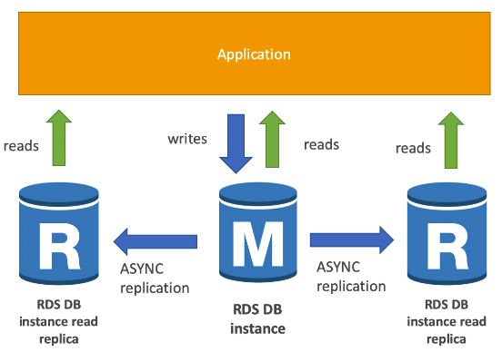

Read Replicas can be promoted to become standalone databases.

*   Once promoted, they are no longer part of the replication mechanism.
*   They have their own lifecycle.

📝 **Note:** When using Read Replicas, the application needs to be configured to connect to the list of available Read Replicas. This usually involves updating the connection string.

#### Use Case: Reporting and Analytics 📊

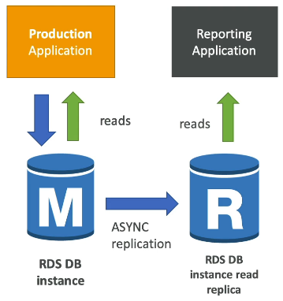

A common use case for Read Replicas is offloading reporting and analytics workloads.

1.  Your production database handles normal read and write operations.
2.  A new team wants to run reporting and analytics on the data.
3.  Connecting the reporting application directly to the main database could overload it and impact production performance.
4.  The solution: Create a Read Replica.
5.  The reporting application connects to the Read Replica, performing only read operations.
6.  The production database remains unaffected.

⚠️ **Warning:** Read Replicas should only be used for `SELECT` statements (read operations). Avoid using `INSERT`, `UPDATE`, or `DELETE` statements on Read Replicas.

#### Networking Costs 🌐

*   Within the same region but different AZs, replication traffic for RDS Read Replicas is **free**.
    *   📌 **Example:** An RDS instance in `us-east-1a` replicating to a Read Replica in `us-east-1b` does not incur inter-AZ data transfer costs.
*   Cross-region replication incurs network costs.
    *   📌 **Example:** Replicating from `us-east-1` to `eu-west-1` will result in replication fees.

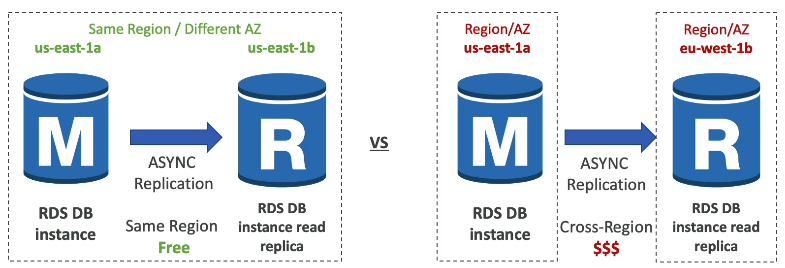

### RDS Multi-AZ (Disaster Recovery) 🛡️

Multi-AZ deployments are primarily used for **disaster recovery**.

*   Your application reads and writes to a master database instance in one AZ (e.g., AZ A).
*   There is **synchronous** replication to a standby instance in another AZ (e.g., AZ B).
*   Every change to the master is immediately replicated to the standby.

The application connects to a single DNS name.

*   In case of a failure of the master database, there is an automatic failover to the standby database (thanks to the single DNS name).
*   This increases availability.

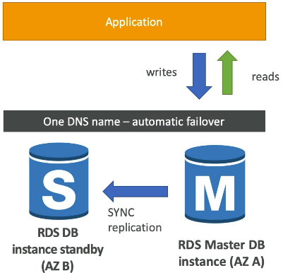

Failover occurs in scenarios such as:

*   Loss of an entire AZ
*   Network failure
*   Instance or storage failure of the master database

The standby database becomes the new master automatically.

*   No manual intervention is required from the application, as long as it is configured to automatically reconnect to the database using the same DNS name.
*   Multi-AZ is **not** used for scaling read operations. The standby database is solely for failover purposes.

📝 **Note:** Can we configure the read replicas to be Multi-AZ? Yes, we can configure Read Replicas to be Multi-AZ for Disaster Recovery (DR). > **Common Exam Question.**

### Single AZ to Multi AZ Conversion 🔄

It's possible to convert an RDS database from Single AZ to Multi AZ.

*   This is a **zero-downtime** operation.
*   You don't need to stop the database.
*   Simply modify the database settings and enable Multi-AZ.

Behind the scenes, the following happens:

1.  RDS automatically takes a snapshot of the main database.
2.  The snapshot is restored to create a new standby database.
3.  Synchronization is established between the two databases.
4.  The standby database catches up with the main RDS database.
5.  The database is now in a Multi-AZ setup.

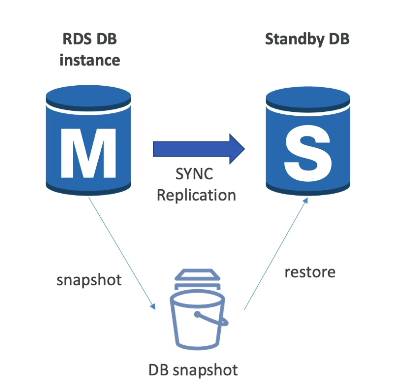  

---

## 3. Creating Your First Amazon RDS Database Instance

Let's walk through the process of creating your first Amazon RDS database instance.

1.  Navigate to **Databases** in the left-hand menu and click on **Create database**.

2.  On the creation screen, you'll need to select the database engine. There are six engine types available.

3.  Choose a database creation method: **Standard Create** or **Easy Create**. We'll use **Standard Create** to explore all available options.

### Database Engine Options

The available engine options include:

*   Aurora
*   MySQL
*   MariaDB
*   PostgreSQL
*   Oracle
*   Microsoft SQL Server

For this example, we'll use **MySQL**. Select the provided version (e.g., MySQL 8.0.28) or the default selected version.

### Templates

Choose a template to meet your use case:

*   **Free tier:** Pre-selects options suitable for the free tier.
*   **Dev/Test:** Pre-selects options for development and testing environments.
*   **Production:** Gives you full control over every option.

We'll use the **Production** template but modify the options to fit within the free tier. This allows us to review all available settings.

### Availability and Durability

You have three options:

*   Single DB instance: 1 instance - Creates a single DB instance without standby instances. 
*   Multi-AZ DB instance: 2 instances - Creates a primary DB instance with a non-readable standby instance in a separate Availability Zone. 
*   Multi-AZ DB Cluster: 3 instances - Creates a primary DB instance with two readable standbys in separate Availability Zones.

To stay within the free tier, choose **Single DB instance**. Multi-AZ options provide standby database instances for higher availability.

### Settings

*   **DB identifier:** Set this to `database-1`.
*   **Credential:** Use `admin` as the username.
*   **Password:** Enter a password.

### Instance Configuration

This section configures the underlying EC2 instance size.

*   Available classes: Standard, Memory Optimized, and Burstable.
*   To remain in the free tier, select **Burstable classes** and choose **db.t3.micro**.

### Storage

*   For production environments, use `io1` type EBS volumes.
*   For the free tier, use `gp2` volumes for lower performance.
*   Set the allocated storage to 20 GB (which is minimum).

You can also enable **Storage autoscaling** to automatically increase the EBS volume size when nearing a threshold. Set a maximum storage limit (e.g., 1,000 GB). Note: It is not available for Multi-AZ DB instances (production env).

### Connectivity

The connectivity section allows you to connect to an EC2 compute resource.

*   If you want to ensure connectivity between a specific EC2 instance and your RDS database, choose it from the list. The networking configuration will be handled automatically.
*   For this example, select **Don't connect to an EC2 compute resource**.

This requires you to deploy in a specified VPC and specify a subnet group. You also need to decide whether to allow public access to the database. Select **Yes** to access the database from your computer.

You'll need to create a new security group. Name it `demo-database-mysql`. The default port for MySQL is 3306.

### Database Authentication

You have three authentication mechanisms:

*   Password authentication (username and password)
*   IAM database authentication (IAM users and roles directly access RDS)
*   Kerberos

We'll use **password authentication**.

### Monitoring

You can enable monitoring. Enhanced monitoring provides 60-second granularity on your resources. You can disable it for now.

### Additional Configuration

*   **Initial database name:** Enter `mydb`.
*   **Backups:** Automated backups are enabled by default with a retention period of 1-35 days. Setting it to zero disables backups. We'll leave it at seven days.
*   **Backup window:** Choose a specific time window for backups or select "No preference".
*   **Log Exports:** You can export logs (e.g., audit logs) to CloudWatch Logs for long-term retention.
*   **Maintenance window:** Choose a window for minor version upgrades.
*   **Deletion protection:** Enable this to prevent accidental deletion of the database.

⚠️ **Warning:** The estimated DB cost may not accurately reflect free tier eligibility. Using a `db.t2.micro` instance type should qualify for the free tier, despite the estimated cost displayed.

Click **Create database** to start the creation process.

### Connecting to the Database

While the database is being created, download **Sqlectron**, a SQL client, to connect to the database.

1.  Go to the Sqlectron website and click on **Download GUI**.
2.  Download the latest version for your platform (Windows or macOS).
3.  Open and install the application.

Once the database is created and its status is **Available**, you can connect to it.

1.  In the RDS console, find the **Endpoint** and **Port** (3306) for your database.
2.  Click on the linked security group.
3.  In the inbound rules, verify that there's an inbound rule on TCP port 3306 allowing connections from your IP address.

⚠️ **Warning:** If you have trouble connecting, modify the security group to allow connections from `Anywhere IPv4`.

### Connecting with Sqlectron

1.  Open Sqlectron and add a new database connection.
2.  Name the connection `RDSDemo`.
3.  Select `MySQL` as the database type.
4.  Enter the **Server address** (endpoint) and port (3306).
5.  Enter the username (`admin`) and password.
6.  Enter the initial database name (`mydb`).
7.  Click **Test** to verify the connection.

⚠️ **Warning:** If the connection fails, ensure the database is publicly accessible and that your security group allows connections from your IP address.

8.  Save the connection and connect to the database.

You should now be connected to the `mydb` database.

📌 **Example:** You can execute SQL statements like `CREATE TABLE` to create tables.

```sql
CREATE TABLE mytable (
  name VARCHAR(20),
  first_name VARCHAR(20)
);
```

```sql
INSERT INTO mytable (name, first_name) VALUES ('test', 'user');
```

### Additional RDS Features

*   **Read Replicas:** Create read replicas to increase read capacity.
*   **Monitoring:** Monitor CPU utilization, database connection counts, and other metrics.
*   **Snapshots:** Create snapshots to back up your database and restore it to a specific point in time. You can also migrate snapshots to different regions.

### Deleting the Database

⚠️ **Warning:** Remember to delete the database when you're finished to avoid incurring charges.

1.  Disable **Deletion protection**:
    *   Go to **Modify**.
    *   Scroll to the bottom and find the "Delete protection" setting.
    *   Disable it and apply the changes immediately.
2.  Delete the database:
    *   Select the database.
    *   Click **Delete**.
    *   Uncheck "Create final snapshot".
    *   Type `delete me` to confirm.
    *   Click **Delete**.

---

## 4. RDS Custom for Oracle and Microsoft SQL Server

With standard RDS, you don't have access to the underlying operating system or customization options. RDS Custom changes that!

RDS Custom is available for two database types: Oracle and Microsoft SQL Server. It provides access to both the OS and database customization options.

With RDS Custom, you still get the benefits of automated setup, operations, and scaling of the database in AWS. However, you also gain access to the underlying database and operating system.

This allows you to:

*   Configure internal settings.
*   Install patches.
*   Enable native features.
*   Access the underlying EC2 instance behind RDS using SSH or SSM Session Manager.

📌 **Example:** You can SSH into the EC2 instance and apply customizations.

To perform any customization, it's recommended to deactivate the automation mode. This prevents RDS from performing any automation, maintenance, or scaling while you are making changes.

⚠️ **Warning:** Because you now have access to the underlying EC2 instance, you could potentially break things.

It is highly recommended to take a database snapshot before performing any customizations. This will allow you to recover from any unintended consequences of your actions.

Here's a summary of the key differences between RDS and RDS Custom:

| Feature        | RDS                                    | RDS Custom                              |
| -------------- | -------------------------------------- | --------------------------------------- |
| Management     | AWS manages the entire database and OS | You have full admin access to OS and DB |
| Database Types | Multiple                               | Oracle and Microsoft SQL Server only    |
| Access to OS   | No                                     | Yes                                     |
| Customization  | Limited                                | Full                                    |

In short:

*   RDS manages everything for you.
*   RDS Custom gives you full control over the OS and database (Oracle and Microsoft SQL Server only).

---

## 5. Amazon Aurora

Aurora is a proprietary technology from AWS (not open-sourced), but designed to be compatible with both Postgres and MySQL. This means your Aurora database will work with existing Postgres or MySQL drivers.

Aurora is cloud-optimized, offering significant performance improvements:

*   🚀 Up to 5x performance improvement over MySQL on RDS.
*   🚀 Up to 3x performance improvement over Postgres on RDS.

Aurora's storage automatically grows, which is a key feature:

*   Starts at 10GB and automatically scales up to 128TB.
*   This eliminates the need for manual disk monitoring and management.

Aurora offers robust read scaling and high availability:

*   Supports up to 15 read replicas.
*   Replication lag is typically sub-10ms.
*   Failover is near instantaneous, much faster than Multi-AZ MySQL RDS.
*   High availability is built-in due to its cloud-native design.

While Aurora costs about 20% more than RDS, its efficiency often leads to cost savings at scale.

### High Availability and Read Scaling

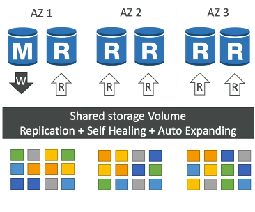

Aurora stores six copies of your data across three Availability Zones (AZs).

*   For writes, Aurora requires only 4 out of 6 copies to be available.
*   For reads, it requires only 3 out of 6 copies.
*   This ensures high availability even if an AZ is down.

Aurora features a self-healing process:

*   Data corruption is automatically corrected using peer-to-peer replication.
*   Data is distributed across hundreds of volumes, reducing risk.

Visually, imagine three AZs with a shared, logical storage volume that handles replication, self-healing, and auto-expansion. Data is written in six copies across these AZs and striped across different volumes.

### Aurora as Multi-AZ for RDS

Aurora operates with a single master instance for writes, similar to Multi-AZ for RDS.

*   Failover typically occurs in less than 30 seconds.
*   Up to 15 read replicas can serve read traffic.
*   Any read replica can become the master in case of a failover.
*   Read replicas support cross-region replication.

Key things to remember: One master, multiple read replicas, and replicated, self-healing, auto-expanding storage.

### Aurora Cluster Architecture

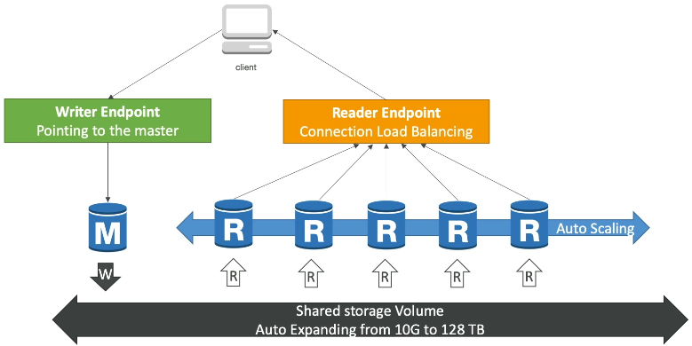

When clients interact with an Aurora cluster, they connect to specific endpoints.

*   Shared storage volume: Auto-expands from 10GB to 128TB.
*   Master instance: Handles all write operations.

Aurora provides two key endpoints:

1.  **Writer Endpoint**:
    *   A DNS name that always points to the current master instance.
    *   Clients use this endpoint for write operations.
    *   Automatically redirects connections to the new master after a failover.
2.  **Reader Endpoint**:
    *   Helps with connection load balancing across read replicas.
    *   Automatically connects clients to available read replicas.
    *   Load balancing occurs at the connection level, not the statement level.

Read replicas can be configured with auto-scaling, allowing you to dynamically adjust the number of read replicas (from 1 to 15) based on workload.

📌 **Example:**

```
# Connecting to the writer endpoint
connection = connect_to_database("writer_endpoint")

# Connecting to the reader endpoint
connection = connect_to_database("reader_endpoint")
```

Remember writer endpoint, reader endpoint, auto-scaling, and the shared storage volume that auto-expands.

### Aurora Features

Aurora offers a range of features, including:

*   Automatic failover
*   Backup and recovery
*   Isolation and security
*   Industry compliance
*   Push-button scaling via auto-scaling
*   Automated patching with zero downtime
*   Advanced monitoring
*   Routine maintenance

Aurora also includes a feature called **backtrack**, which allows you to restore data to any point in time without relying on backups.

📝 **Note:** Backtrack relies on a different mechanism than traditional backups.

You can easily revert to a specific point in time, such as yesterday at 4:00 PM, and even adjust the restoration point if needed.

---

## 6. Creating an Amazon Aurora Database

Let's walk through the process of creating an Amazon Aurora database.

⚠️ **Warning:** Following along with this hands-on exercise will incur costs. Be mindful of the resources you create and remember to delete them when you're finished.

Here's a breakdown of the steps:

1.  **Choose a Standard Create:** Select the standard creation method.
2.  **Select Aurora Engine:** You'll have two options:
    *   MySQL-compatible
    *   PostgreSQL-compatible

    📌 **Example:** For this demonstration, we'll use the MySQL-compatible option.
3.  **Choose a Version:** Select the desired version.
    *   You can filter versions based on feature support (e.g., global database, parallel query, Serverless v2).
    *   The console proposes a default version.
    📌 **Example:** The default version is 3.04.1.
4.  **Choose a Template:** Select a template.
    *   Choosing "Production" allows you to configure all settings.
5.  **DB Cluster Identifier:** Provide a name for your DB cluster.
    📌 **Example:** "db-aurora-mysql"
6.  **Master Username:** The default username is "admin."
7.  **Master Password:** Enter a secure password.
8.  **Cluster Storage Configuration:** Choose between:
    *   Aurora Standard: Cost-effective for general workloads.
    *   IO Optimized: Suitable for high read/write operations.
9.  **Instance Configuration:** Select the instance class for your database.
    *   Options include memory-optimized and burstable classes.
    *   📌 **Example:** `db.t3.medium`
    *   If using a Serverless-compatible version, you'll configure Aurora Capacity Units (ACUs) instead of instance types.
        *   Specify a minimum and maximum ACU range for automatic scaling.
10. **Availability and Durability:** Configure Aurora replicas for enhanced availability and faster failovers.
    *   This creates a reader node in a different Availability Zone (AZ).
11. **Network Configuration:**
    *   Choose a network type (IPv4 or dual-stack for IPv6).
    *   Select the default VPC and subnet group.
    *   Allow public access if you need to connect from a public IP address.
12. **VPC Security Group:** Create a new security group to control access to your Aurora database.
    *   📌 **Example:** `demo-database-aurora-sg`
13. **Additional Configuration:**
    *   Database Port: The default MySQL port is 3306.
    *   Local Write Forwarding: Enables easier connection management by forwarding writes from read replicas to the writer instance.
    *   Database Authentication: Options include IAM-based and Kerberos-based authentication. Keep Default (none selected).
    *   Enhanced Monitoring: Can be disabled if not needed.
    *   Initial Database Name: Specify the initial database name.
        *   📌 **Example:** "myDB"
    *   Backup Retention: Set the backup retention period.
        *   📌 **Example:** One day.
    *   Encryption: Configure encryption for your database.
    *   Deletion Protection: Enable to prevent accidental deletion.

14. **Review Costs:** Be aware of the estimated monthly costs before creating the database.
15. **Create Database:** Click the button to create the Aurora database.

Once created, you'll have a regional cluster with a writer instance and a reader instance in different AZs.

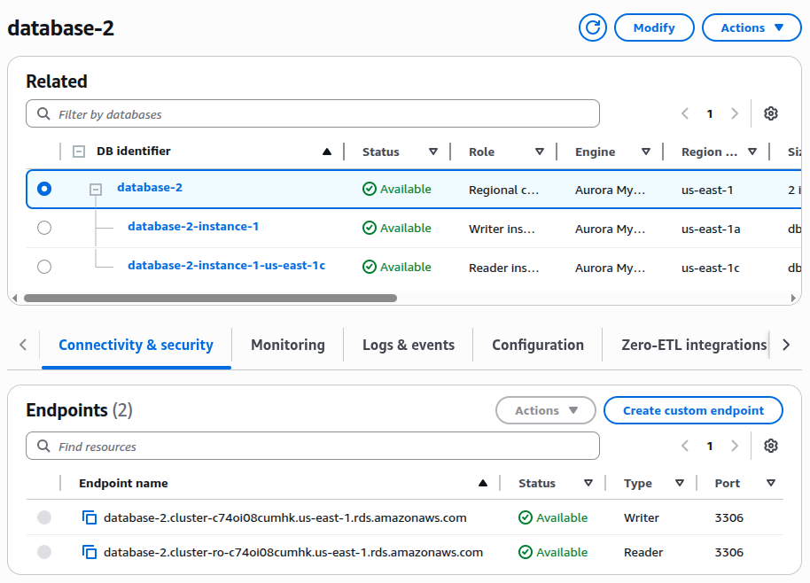

*   **Endpoints:** Aurora provides reader and writer endpoints.
    *   These endpoints always point to the correct writer or reader instance, even during failovers.
    *   Your application should use these endpoints to connect to Aurora.
    *   Reader Endpoint: `database-2.cluster-ro-c74oi08cumhk.us-east-1.rds.amazonaws.com`
    *   Writer Endpoint: `database-2.cluster-c74oi08cumhk.us-east-1.rds.amazonaws.com`

Note: Individual instances also have dedicated endpoints.

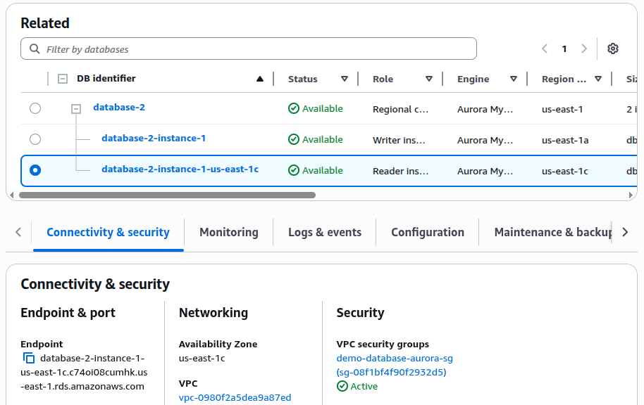

Endpoint: `database-2-instance-1-us-east-1c.c74oi08cumhk.us-east-1.rds.amazonaws.com`

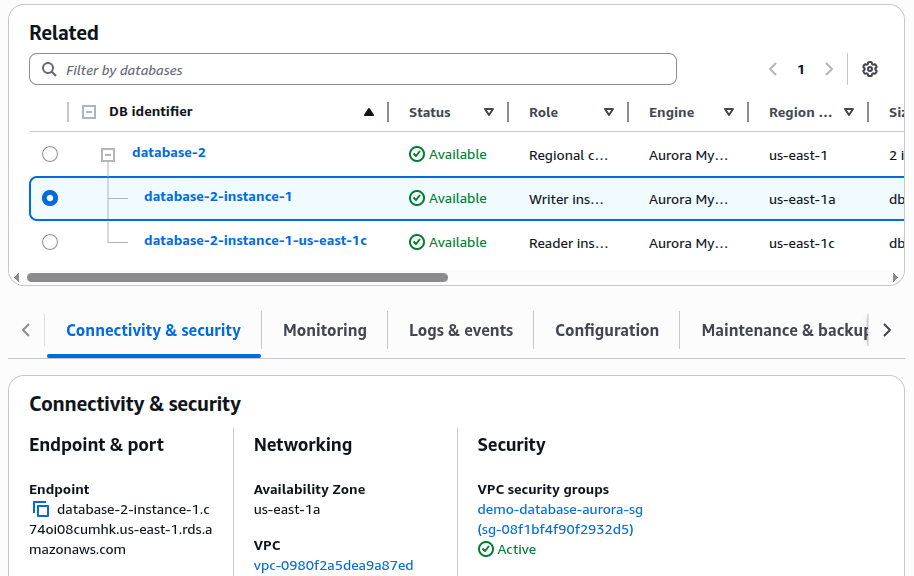

Endpoint: `database-2-instance-1.c74oi08cumhk.us-east-1.rds.amazonaws.com`

### Additional Aurora Features

*   **Add Readers:** Increase read scaling capacity by adding more readers to the reader cluster.
*   **Cross-Region Read Replica:** Create a replica in another AWS region.
*   **Restore to Point in Time:** Restore the database to a specific point in time.
*   **Replica Auto-Scaling:** Automatically scale read replicas based on metrics like average utilization or number of connections.
    1.  Create a scaling policy.
    2.  Define a target value for the metric (e.g., 60% average utilization).
    3.  Set a minimum and maximum number of replicas.
        *   📌 **Example:** 1 to 15 replicas.
*   **Global Aurora:** Add AWS regions to create a global Aurora database.
    *   This feature requires a compatible instance size.
    *   Go to Action and select "Add AWS Region".

### Deleting the Aurora Database

To avoid incurring further costs, delete the Aurora database when you're finished.

1.  Delete the reader instance.
    *   Type "delete me" to confirm.
2.  Delete the writer instance.
    *   Type "delete me" to confirm.
3.  Once both instances are deleted, you can delete the entire cluster.

---

## 7. Advanced Concepts of Aurora

Let's explore some advanced Aurora concepts essential for exam preparation.

### Replica Auto Scaling 🚀

Imagine a scenario with a client and three Aurora instances. One instance handles writes via the Writer Endpoint, while the other two handle reads via the Reader Endpoint.

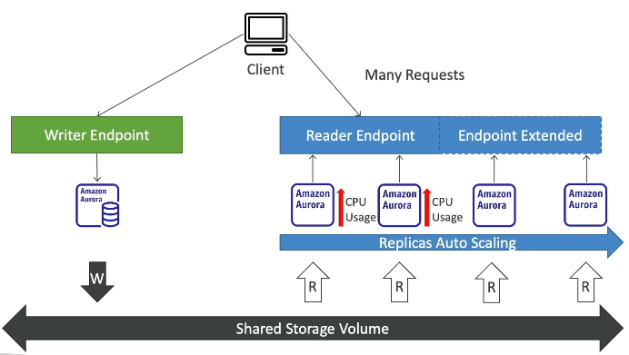

If the Reader Endpoint experiences high read request volume, leading to increased CPU usage on the Aurora databases, replica auto-scaling comes to the rescue!

*   Replica auto-scaling automatically adds more Aurora Replicas.
*   The Reader Endpoint is extended to include these new replicas.
*   The new replicas share the read traffic, distributing the load and reducing overall CPU usage.

### Custom Endpoints 🛠️

Consider a setup with different types of replicas, such as `db.r3.large` and `db.r5.2xlarge`. Some Read Replicas are more powerful than others.

The goal is to define a subset of your Aurora instances as a Custom Endpoint.

*   📌 **Example:** Define a Custom Endpoint on the two larger Aurora instances (`db.r5.2xlarge`).
   
!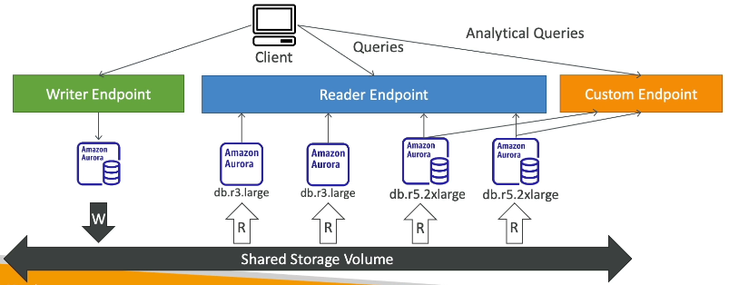

This is useful when you want to run specific workloads on more powerful instances, such as analytical queries.

*   **When a Custom Endpoint is defined, the original Reader Endpoint is generally not used anymore.**
*   Multiple Custom Endpoints can be set up for different workload types.
*   This allows you to query only a subset of your Aurora Replicas.

### Serverless ☁️

Aurora Serverless provides automated database instantiation and auto-scaling based on actual usage.

*   Ideal for infrequent, intermittent, or unpredictable workloads.
*   Eliminates the need for capacity planning.
*   You pay per second of Aurora instance usage, potentially making it more cost-effective.

How it works:

1.  The client connects to a proxy fleet managed by Aurora.
2.  Aurora dynamically creates Aurora instances in the backend based on the workload.
3.  No need to provision capacity in advance!
  
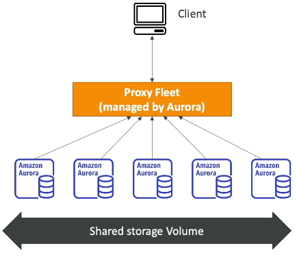

### Global Aurora 🌍

**Aurora Cross Region Read Replicas**:
* Useful for disaster recovery.
* Simple to put in place.

But **Aurora Global Database** is the recommended approach for cross-region replication and disaster recovery.

*   One primary region handles all reads and writes.
*   Up to five secondary read-only regions can be configured.
*   Replication lag is typically less than one second.
*   Up to 16 Read Replicas are supported per secondary region.

Benefits:

*   Decreased latency for read workloads globally.
*   Improved disaster recovery capabilities.
*   Recovery Time Objective (RTO) of less than one minute for promoting another region in case of an outage.

📝 **Note:** Replication across regions for Aurora Global Database takes, on average, less than one second. This is a key indicator for using Global Aurora in exam scenarios.

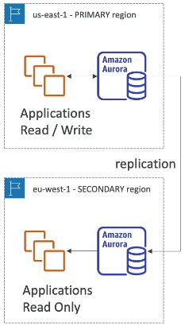

📌 **Example:**

*   `us-east-1` is the PRIMARY region (read/write).
*   `eu-west-1` is a SECONDARY region (read-only).
*   In case of failure in `us-east-1`, failover to `eu-west-1` by promoting it to a read/write Aurora cluster.

### Aurora Machine Learning 🤖

Aurora integrates with AWS machine learning services, enabling ML-based predictions via SQL.

*   Simple, optimized, and secure integration.
*   Supported services: 
    *   SageMaker (for any ML model)
    *   Amazon Comprehend (for sentiment analysis).
*   No machine learning expertise is required to use this feature.

Use Cases:

*   Fraud detection
*   Ads targeting
*   Sentiment analysis
*   Product recommendation

!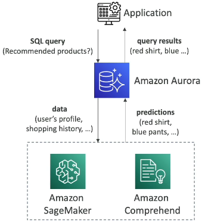

Architecture:

1.  Your application runs a SQL query (e.g., "What are the recommended products?").
2.  Aurora sends data (user profile, shopping history, etc.) to the machine learning service.
3.  The machine learning service returns a prediction (e.g., "The user should buy a red shirt and blue pants").
4.  Aurora returns the query results to the application.

### Babelfish for Aurora PostgreSQL 🐟

!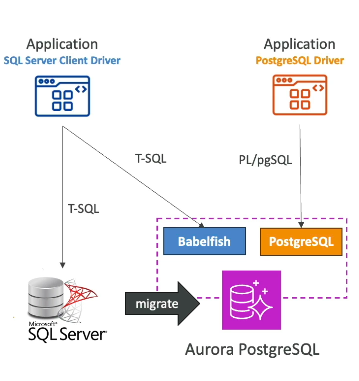

Babelfish allows Aurora PostgreSQL to understand commands targeted for Microsoft SQL Server using T-SQL.

Scenario:

*   You have an application using Microsoft SQL Server and the SQL Server Client Driver, sending T-SQL commands.
*   You want to migrate to Aurora PostgreSQL.

Challenge:

*   Aurora PostgreSQL uses the PostgreSQL driver and the PL/pgSQL language.
*   Rewriting the application to use PL/pgSQL would be a significant effort.

Solution:

*   Enable Babelfish on Aurora PostgreSQL.
*   Your application can communicate with Aurora PostgreSQL using T-SQL through Babelfish.
*   Minimal code changes are required.

Benefits:

*   Easy migration of SQL Server applications to Aurora PostgreSQL.
*   Little to no code changes required.
*   Use the same SQL Server Client Driver.

Migration Tools:

*   AWS SCT (Schema Conversion Tool)
*   AWS DMS (Database Migration Service)

These tools help migrate from SQL Server to Aurora PostgreSQL. Babelfish handles the translation of T-SQL queries into Aurora PostgreSQL.

---

## 8. RDS & Aurora - Backup & Monitoring

Let's explore RDS backup options, covering automated backups, manual snapshots, restore options, and Aurora database cloning.

### RDS Automated Backups 💾

*   The RDS service automatically performs a daily full backup of the database during a defined backup window.
*   Transaction logs are backed up every 5 minutes. This means you can restore to any point in time up to 5 minutes prior to the current time.
*   Retention period: Configurable from 1 to 35 days.
*   To disable automated backups, set the retention period to 0.

### RDS Manual DB Snapshots 📸

*   These are manually triggered by the user.
*   The key benefit is that you can retain these snapshots for as long as you need.
*   **Automated backups expire, but manual snapshots do not.**

💡 **Tip:** Manual DB Snapshots can be used to save costs.

Trick: in a stopped RDS database, you will still pay for storage. If you plan on stopping it for a short time, you should snapshot & restore instead.

📌 **Example:**

1.  Take a snapshot of your RDS database after using it for a short period (e.g., 2 hours per month).
2.  Delete the original database.
3.  The snapshot storage cost is significantly less than the RDS database storage cost.
4.  When you need to use the database again, restore it from the snapshot.

### Aurora Backups 🌟

*   Automated backups are similar to RDS, with a retention period of 1 to 35 days.
*   ⚠️ **Warning:** Automated backups **cannot** be disabled in Aurora.
*   Point-in-time recovery is available within the retention timeframe.
*   Manual DB Snapshots are also supported, manually triggered, and can be retained indefinitely for as long as you need.

### Restore Options ⚙️

*   RDS or Aurora backups (snapshots) can be restored into a **new** database instance. Restoring always creates a new database.
*   **Restoring MySQL RDS databases from Amazon S3**

    *   Create a backup of your on-premises database.
    *   Upload the backup to Amazon S3.
    *   Restore the backup file to a new RDS instance running MySQL.

*   **Restoring MySQL Aurora Cluster from Amazon S3**

    1.  Take a backup of your on-premises database using **Percona XtraBackup**.
    2.  Upload the Percona XtraBackup file to Amazon S3.
    3.  Restore the backup file to a new Aurora cluster running MySQL.

📝 **Note:** Restoring to Aurora MySQL requires using Percona XtraBackup.

### Aurora Database Cloning 🧬

*   Allows you to create a new Aurora database cluster from an existing one.
*   Useful for creating staging environments for testing.
*   Faster than snapshot and restore.

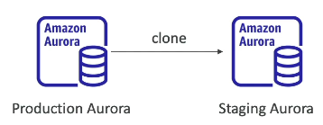

How Cloning Works:

*   Cloning uses a copy-on-write protocol.
*   Initially, the clone shares the same data volume as the original database cluster. This is fast and efficient.
*   As updates are made to either the production or staging database, new storage is allocated, and data is copied and separated.

Benefits:

*   Fast and cost-effective.
*   Enables **creating staging databases from production databases without impacting the production environment**.
*   Avoids the need for snapshot and restore procedures.

---

## 9. RDS and Aurora Security

You can **encrypt data at-rest** on your RDS and Aurora databases. This means the data is encrypted on the underlying storage volumes.

*   The master database and any read replicas are encrypted using KMS.
*   Encryption is defined at launch time during the initial database creation.

⚠️ **Warning:** If the master database is not encrypted initially, read replicas cannot be encrypted.

To encrypt an already existing unencrypted database:

1.  Take a database snapshot from the unencrypted database. 📸
2.  Restore the database snapshot as an encrypted database. 🔄

This process requires a snapshot and restore operation.

### In-Flight Encryption

RDS and Aurora databases are configured for in-flight encryption by default, securing data transmitted between clients and the database.

*   Clients must use the TLS root certificates provided by AWS, available on the AWS website. 🛡️

### Database Authentication

RDS and Aurora offer multiple authentication methods:

*   Classic username and password combination. 🔑
*   IAM roles: EC2 instances with IAM roles can authenticate directly to the database, eliminating the need for usernames and passwords. This simplifies security management within AWS and IAM. 👤

### Network Access Control

You can control network access to your database using security groups.

*   Allow or block specific ports. 🚦
*   Allow or block specific IP addresses. 🌐
*   Allow or block specific security groups. 🔒

### SSH Access

RDS and Aurora do not provide SSH access, as they are managed services. The exception is if you use RDS Custom (Oracle or SQL Server). 🚫

### Audit Logs

To track queries and database activity over time, you can enable Audit Logs. 🕵️‍♀️

📝 **Note:** Audit Logs are retained for a limited time.

To preserve Audit Logs for longer periods:

*   Send them to AWS CloudWatch Logs. ☁️

```text
# Example: Sending Audit Logs to CloudWatch
# Configure RDS/Aurora to stream logs to CloudWatch Logs
```

---

## 10. Amazon RDS Proxy

We can deploy our RDS database within our VPC, but we can also deploy a fully managed database proxy for RDS. But why use a proxy when we can access our RDS database directly?

Using an RDS Proxy allows your application to pool and share database connections established with the database. Instead of each application connecting directly to your RDS database instance, they connect to the proxy. The proxy then pools these connections into fewer connections to the RDS database instance.

Why is this beneficial?

*   **It improves database efficiency by reducing stress on database resources (CPU, RAM).** 🚀
*   **It minimizes open connections and timeouts**. ⏳

From an exam perspective, remember these key benefits.

The RDS Proxy is fully serverless and auto-scaling, so you don't need to manage its capacity. It's also highly available across multiple Availability Zones (AZs).

In case of a failover on your RDS database instance (e.g., from primary to standby), the RDS Proxy reduces the failover time by up to 66% for RDS and Aurora. ⏱️

Instead of applications handling failovers themselves, they connect to the RDS Proxy, which handles the failover of the RDS database instance, improving failover time.

The RDS Proxy supports:

*   MySQL
*   PostgreSQL
*   MariaDB
*   Microsoft SQL Server
*   Aurora for MySQL and PostgreSQL

It doesn't require any code changes in your application. Just connect to your RDS Proxy instead of your RDS or Aurora database. ✅

Another advantage of using an RDS Proxy is that it **enforces IAM authentication for your database**. This ensures that **users can only connect to your RDS database instance using IAM**. These credentials can be **securely stored in AWS Secrets Manager**. 🔐

**If you need to enforce IAM authentication for your database, consider using RDS Proxy**.

The **RDS Proxy is never publicly accessible; it's only accessible from within your VPC**, enhancing security. 🛡️

**Lambda functions can greatly benefit from the RDS Proxy**. Lambda functions execute pieces of code and can appear and disappear rapidly. If you have hundreds or thousands of Lambda functions opening connections to your RDS database instance, it can lead to open connections, timeouts, and a general mess.

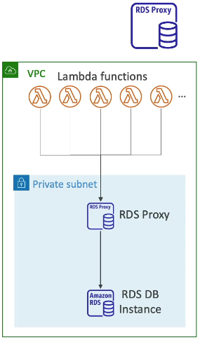

Using the RDS Proxy to pool connections for your Lambda functions solves this problem. The Lambda functions overload the RDS Proxy, which is designed to handle it. The RDS Proxy then pools these connections into fewer connections to the RDS database instance.

In summary, the RDS Proxy is used to:

*   Minimize and pool connections on your RDS database instance. 🤝
*   Minimize failover time and reduce it by up to 66%. 📉
*   Enforce IAM authentication for your database and securely store credentials in AWS Secrets Manager. 🔑

---

## 11. Amazon ElastiCache

Amazon ElastiCache helps you manage Redis or Memcached, which are caching technologies, similar to how RDS manages relational databases.

### What are Caches? 🤔

* Caches are in-memory databases offering high performance and low latency. They reduce the load on databases for read-intensive workloads. Common queries are cached, preventing the database from being queried every time. The cache is used to retrieve the results.
* ElastiCache also helps make your application stateless by storing the application state in ElastiCache. 
* AWS handles maintenance, patching, optimization, setup, configuration, monitoring, failure recovery, and backups, similar to RDS.

⚠️ **Warning:** Using Amazon ElastiCache requires **significant application code changes**. You need to modify your application to query the cache before or after querying the database.

### Architecture for ElastiCache 🏗️

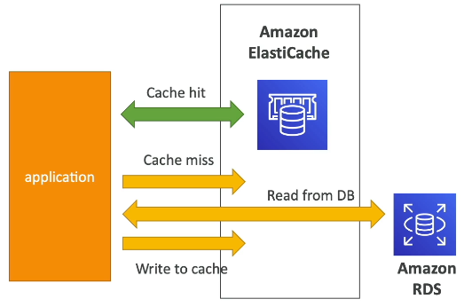

Here's an example architecture:

1.  Your application queries ElastiCache first.
2.  If the data is in ElastiCache (a **cache hit**), the application retrieves the data directly from ElastiCache. This saves a trip to the database.
3.  If the data is not in ElastiCache (a **cache miss**), the application fetches the data from the database.
4.  The application then writes the data back into the cache. Subsequent queries will result in a cache hit.

The goal is to relieve the load from your RDS database.

📝 **Note:** A cache invalidation strategy is crucial to ensure that only the most current data is used. **This is a key challenge in using caching technologies**.

### Storing User Sessions 🧑‍💻

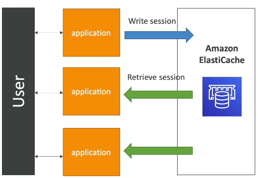

Another architecture involves storing user sessions to make your application stateless:

1.  A user logs into your application.
2.  The application writes the session data into Amazon ElastiCache.
3.  If the user is redirected to another instance of your application, the application retrieves the session data from ElastiCache.
4.  The user remains logged in without needing to re-authenticate.

This makes your application stateless by storing user session data in ElastiCache.

### Redis vs. Memcached 🆚

Here's a quick comparison of Redis and Memcached:


#### Redis ⚙️

*   Multi-AZ with auto-failover.
*   Read replicas for scaling reads and high availability.
*   Data durability using AOF persistence.
*   Backup and restore features.
*   Supports sets and sorted sets (useful for leaderboards).

💡 **Tip:** Think of Redis as a node being replicated into another one.

#### Memcached 🔩

*   Multiple nodes set up, partitioning data (sharding).
*   No high availability or replication (generally).
*   Non persistent.
*   Backup and restore features are only available for the serverless version.
*   Multi-threaded architecture (potentially good for performance).

💡 **Tip:** Think of Memcached as multiple nodes next to each other, partitioning the data.

⚠️ **Warning:** If you have an issue with Memcached, you may lose your entire cache.

📝 **Note:** The exam may not heavily focus on choosing between Redis and Memcached, but it's good to understand the differences for reference.

---

## 12. Creating an ElastiCache Cluster

Note: For our demo purpose, choose all ✅ options.

Let's walk through the process of creating an ElastiCache cluster. We'll focus on a Redis cluster for this example, but keep in mind that Memcached is also an option.

1.  **Choose Your Cache Type:** You have two main options:

    *   **Serverless:** 🚀 Automatically scales to meet application traffic demands. Easier to manage, but generally more expensive.
    *   **Design Your Own:** 🛠️ Provides greater control over configuration and architecture. We'll use this approach for a better understanding of how to architect a cache on AWS. ✅ 

2.  **Configure Your Cache:** When designing your own cache, you have several methods:

    *   Restore from a backup.
    *   Easy create - using recommended best practices configurations (production, dev/test, demo).
    *   Cluster Cache - Configure everything manually. ⚙️ We'll choose this option to explore all available settings. ✅

3.  **Cluster Mode:**

    *   **Disabled:** Single shard with one primary node and up to five read replicas. We'll use this mode. ✅
    *   **Enabled:** Multiple shards across multiple servers.

4.  **Basic Settings:**

    *   **Cluster Name:** `DemoCluster`
    *   **Location:** AWS Cloud ✅ (optionally, you can run ElastiCache on-premises using AWS Outpost).
    *   **Multi-AZ:** 🚫 Disabled for this example to reduce costs. ⚠️ **Warning:** Enabling Multi-AZ is highly recommended for high availability and failover.
    *   **Auto Failover:** Enabled (if Multi-AZ were enabled). ✅

5.  **Cluster Settings:**

    *   **Engine Version:** Specify the Redis engine version.
    *   **Port:** Specify the port.
    *   **Parameter Groups:** Configure parameter groups.
    *   **Node Type:** Choose an instance type. 📌 **Example:** `t2.micro` or `t3.micro` (these are often in the free tier).
    *   **Replicas:** Set to zero for cost purposes. ⚠️ **Warning:** In a Multi-AZ setup, you should have more replicas.

6.  **Subnet Group:**

    *   Create a new subnet group (Name: `my-first-subnet-group`). This tells ElastiCache which subnets it can run the cache in.
    *   Select the VPC.
    *   Subnets are automatically selected, but you can specify them manually.
    *   AZ Placements: Specify which replicas can go to each AZ (not relevant when Multi-AZ is disabled).

7.  **Encryption:**

    *   **Encryption at Rest:** Choose whether to encrypt data at rest. If enabled, you'll need to specify a key. 🚫
    *   **Encryption in Transit:** Choose whether to encrypt data between clients and the server. 🚫
        *   If enabled, you gain access control features.
        *   **Redis AUTH:** Specify a password (AUTH token) to connect to the Redis cluster.
        *   **User Group Access Control List (ACL):** Create user groups from the ElastiCache console.
        *   We'll disable encryption in transit for this example.

8.  **Security Groups:**

    *   Manage which applications have network access to your cluster. 🚫

9.  **Other Settings:**

    *   **Backup:** Enable or disable backups. 🚫
    *   **Maintenance Window:** Schedule maintenance windows for minor version upgrades. 🚫 (Keep Default)
    *   **Auto Minor Version Upgrade:** Enable or disable minor version upgrades. It is enabled by default. ✅
    *   **Logs:** Configure logs (slow logs, engine logs) to be sent to CloudWatch Logs. 🚫
    *   **Tags:** Add tags for organization and management.

10. **Review and Create:**

    *   Review all settings.
    *   Click "Create" to launch the ElastiCache cluster.

11. **Connecting to Your Cache:**

    *   Once created, you can find the primary endpoint (or reader endpoint for read replicas).
    *   Use these endpoints in your application code to connect to the cache.
    *   📝 **Note:** Connecting to a Redis cache requires writing code, which is beyond the scope of this guide.

12. **Exploring the ElastiCache Console:**

    *   The console provides details on nodes, metrics, logs, network security, and more.
    *   It's similar to the RDS console.

13. **Deleting the Cluster:**

    *   Select the Redis cluster.
    *   Choose "Action" then "Delete."
    *   Choose whether to create a final backup.
    *   Type the name of the cluster to confirm deletion.

---

## 13. ElastiCache Security

ElastiCache offers different security mechanisms depending on the engine you choose.

*   For Redis, it supports IAM authentication, but only for AWS API-level security. For security within Redis itself, you use Redis AUTH.
*   For Memcached, it supports SASL-based authentication.

### Redis Security

*   IAM policies on ElastiCache are used for AWS API-level security.
*   Redis AUTH provides an extra layer of security for your cache on top of security groups. You set a password and a token when creating a Redis cluster.
*   Supports SSL in-flight encryption.

### Memcached Security

*   Memcached supports SASL-based authentication. 📝 **Note:** Just remember the name.

### Connecting to ElastiCache

📌 **Example:**

*   An EC2 instance (client) can connect to a Redis Cluster protected by a Redis Security Group using Redis AUTH and in-flight encryption.
*   Alternatively, you can leverage IAM authentication for Redis.

### Data Loading Patterns

There are three main patterns for loading data into ElastiCache:

1.  **Lazy Loading:** 😴
    *   All read data is cached.
    *   Data can become stale in the cache.
    *   When a cache miss occurs, data is read from the database and written to the cache.
2.  **Write Through:** ✍️
    *   Data is added or updated in the cache whenever it is written to the database.
    *   No stale data.
3.  **Session Store:** 🧑‍💻
    *   ElastiCache is used as a session store.
    *   Sessions can be expired using Time To Live (TTL) features.

### Caching Challenges

Caching is a complex topic. As the famous quote says: 
> "There are only two hard things in computer science: caching invalidation and naming things."

### Lazy Loading Strategy Illustrated


1.  Application attempts to read data.
2.  **Cache Hit:** Data is retrieved from ElastiCache. ✅
3.  **Cache Miss:** Data is read from the database and then written to ElastiCache. ❌

This is called lazy loading because data is loaded into ElastiCache only when there is a cache miss.

### Redis Use Case: Gaming Leaderboard 🎮

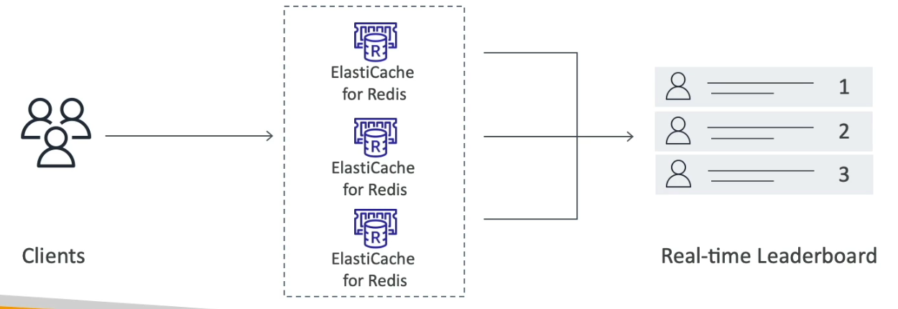

A key use case for Redis, especially for exam preparation, is creating a gaming leaderboard.

*   **Redis Sorted Sets** guarantee both uniqueness and element ordering.
*   Each time an element (e.g., player score) is added, it's ranked in real-time and added in the correct order.
*   With a Redis cluster, you can create a real-time leaderboard with number one, number two, and number three players.
*   All Redis caches will have the same leaderboard available.
*   Clients accessing Amazon ElastiCache using Redis can access this real-time leaderboard without needing to program the feature application-side.

You can leverage Redis with sorted sets to get access to your real-time leaderboard. This is a potential exam topic.

---

## 14. List of Ports to be familiar with

Here's a list of standard ports you should see at least once 📝. You shouldn't remember them (the exam will not test you on that), but you should be able to differentiate between an **Important Port** and an **RDS Database Port**:

**Important Ports:**
*   **FTP**: 21
*   **SSH**: 22
*   **SFTP**: 22 (same as SSH)
*   **HTTP**: 80
*   **HTTPS**: 443

**vs RDS Database Ports:**
*   **PostgreSQL**: 5432
*   **MySQL**: 3306
*   **Oracle RDS**: 1521
*   **MSSQL Server**: 1433
*   **MariaDB**: 3306 (same as MySQL)
*   **Aurora**: 5432 (if PostgreSQL compatible) or 3306 (if MySQL compatible)

Don't stress out on remembering those 🙅‍♂️, just read that list once today and once before going into the exam and you should be all set 😊. Remember, you should just be able to differentiate an **"Important Port"** vs an **"RDS Database Port"**.

---

## 15. Q & A

### **Question 8:**

**You would like to ensure you have a replica of your database available in another AWS Region if a disaster happens to your main AWS Region. Which database do you recommend to implement this easily?**

**Options:**

* 🅐 RDS Read Replicas
* 🅑 RDS Multi-AZ
* 🅒 Aurora Read Replicas
* 🅓 Aurora Global Database

<details>

<summary>Explanation</summary>

**Aurora Global Databases** are designed for **disaster recovery and globally distributed applications**. 

**Correct Answer:** **Aurora Global Database** ✅ *(Correct)*

#### **Why Not the Other Options?**

| Option                   | Limitation                                                                  |
| ------------------------ | --------------------------------------------------------------------------- |
| **RDS Read Replicas**    | Limited support for cross-region; not optimized for disaster recovery.      |
| **RDS Multi-AZ**         | Provides high availability, but **only within the same AWS Region**.        |

The requirement is:

> **A replica in ANOTHER AWS REGION for disaster recovery**

And the service designed *specifically* for cross-region DR is **Aurora Global Database**.

### 🔍 Difference Between Option 3 and Option 4

#### **🅒 Aurora Read Replicas**

Aurora Read Replicas support:

✔ Same AZ
✔ Different AZ
✔ Different Region (but slower + older method)

**However:**

* Cross-Region Aurora Read Replicas use **asynchronous replication**
* Recovery time can be slower
* Not optimized for <1 second global replication
* Failover is manual
* Performance impact is higher
* Not recommended for global-scale, enterprise DR setups

Useful for:

* Basic cross-region read scaling
* Lower-cost DR (but slower)

#### **🅓 Aurora Global Database**

Purpose-built for **global disaster recovery** and **multi-region deployments**.

✔ Optimized, dedicated **sub-1-second** replication
✔ Minimal performance impact on primary
✔ Fast DR failover (~1 minute)
✔ Designed for *mission-critical* global workloads
✔ Reader region can be promoted to full read/write quickly

This is the **recommended** and **fully managed** way to maintain a replica in another region.

#### 📌 Summary Table

| Feature                   | Aurora Read Replicas | Aurora Global Database                      |
| ------------------------- | -------------------- | ------------------------------------------- |
| Cross-Region support      | Yes                  | Yes                                         |
| Replication method        | Standard async       | **Dedicated global replication**, very fast |
| DR failover time          | Slow, manual         | **Very fast (~1 minute), managed**          |
| Performance impact        | Higher               | Very low                                    |
| Designed for global apps  | ❌ No                 | **✔ Yes**                                   |
| Best for exam DR question | ❌ No                 | **✔ Yes**                                   |

#### 🎯 Final Summary

* **Option 3 (Aurora Read Replicas)** can work but is **not the recommended or easiest** solution for cross-region DR.
* **Option 4 (Aurora Global Database)** is **purpose-built** for exactly this use case.

</details>

---

### **Question 11:**

**You would like to create a disaster recovery strategy for your RDS PostgreSQL database so that in case of a regional outage the database can be quickly made available for both read and write workloads in another AWS Region. The DR database must be highly available. What do you recommend?**

### **Options:**

* 🅐 Create a Read Replica in the same region and enable Multi-AZ on the main database
* 🅑 Create a Read Replica in a different region and enable Multi-AZ on the Read Replica
* 🅒 Create a Read Replica in the same region and enable Multi-AZ on the Read Replica
* 🅓 Enable Multi-Region option on the main database

<details>

<summary>Explanation</summary>

To achieve high availability and disaster recovery for an **RDS PostgreSQL** database across regions, the best approach is:

* **Create a Read Replica in a different AWS Region**, which ensures data replication across regions and prepares you for regional outages.
* **Enable Multi-AZ on the Read Replica**, which provides high availability within the secondary region itself, allowing automatic failover in case of AZ-level failure.

This setup allows you to **promote the cross-region Read Replica to a standalone read/write instance** during a disaster, minimizing downtime and ensuring business continuity.

**Correct Answer:**

**Create a Read Replica in a different region and enable Multi-AZ on the Read Replica** ✅ *(Correct)*

#### **Why Not the Other Options?**

| Option                                              | Reason It's Incorrect                                                                          |
| --------------------------------------------------- | ---------------------------------------------------------------------------------------------- |
| **A. Same region replica with Multi-AZ**            | Doesn't protect against regional outages—only AZ-level failures.                               |
| **C. Same region replica with Multi-AZ on replica** | Same limitation—still tied to the same region.                                                 |
| **D. Enable Multi-Region on main DB**               | Not a valid option for RDS PostgreSQL; no direct "multi-region" toggle exists for this engine. |

</details>

---

### **Question 13:**

**Which of the following statement is true regarding replication in both RDS Read Replicas and Multi-AZ?**

**Options:**

* 🅐 Read Replica uses Asynchronous Replication and Multi-AZ uses Asynchronous Replication
* 🅑 Read Replica uses Asynchronous Replication and Multi-AZ uses Synchronous Replication
* 🅒 Read Replica uses Synchronous Replication and Multi-AZ uses Synchronous Replication
* 🅓 Read Replica uses Synchronous Replication and Multi-AZ uses Asynchronous Replication

<details>

<summary>Explanation</summary>

* **RDS Read Replicas**:
  Use **asynchronous replication**, meaning changes made to the source database are **eventually propagated** to the read replica. This setup is primarily used for **scaling read workloads** and is not ideal for high availability.

* **Multi-AZ Deployments**:
  Use **synchronous replication**, where data is written to both the primary and standby instances at the same time. This ensures **high availability and failover support** in case of AZ (Availability Zone) failure.

**Correct Answer:**

**Read Replica uses Asynchronous Replication and Multi-AZ uses Synchronous Replication** ✅ *(Correct)*

#### **Why the Other Options Are Incorrect**

| Option                                   | Reason                                                        |
| ---------------------------------------- | ------------------------------------------------------------- |
| 🅐 Both use asynchronous replication     | ❌ Incorrect — Multi-AZ uses **synchronous** replication.      |
| 🅒 Both use synchronous replication      | ❌ Incorrect — Read Replicas use **asynchronous** replication. |
| 🅓 Read Replica = Sync, Multi-AZ = Async | ❌ Completely reversed.                                        |

</details>

---

### **Question 18:**

**An application running in production is using an Aurora Cluster as its database. Your development team would like to run a version of the application in a scaled-down application with the ability to perform some heavy workload on a need-basis. Most of the time, the application will be unused. Your CIO has tasked you with helping the team to achieve this while minimizing costs. What do you suggest?**

**Options:**

* 🅐 Use an Aurora Global Database
* 🅑 Use an RDS database
* 🅒 Use Aurora Serverless
* 🅓 Run Aurora on EC2, and write a script to shut down the EC2 instance at night

<details>

<summary>Explanation</summary>

**Aurora Serverless** is the ideal solution in this case because:

* It is **cost-effective** for workloads that are **intermittent, infrequent, or unpredictable**.
* It **automatically starts up, scales up/down**, and **shuts down** based on the application's needs.
* You **only pay for what you use** — it is billed per second of usage when the database is active.
* Perfect for **development, testing, or lightly used applications** where continuous uptime isn't needed.

**Correct Answer:**

**Use Aurora Serverless** ✅ *(Correct)*

#### **Why Not the Other Options?**

| Option                                     | Reason It's Not Ideal                                                                                                                               |
| ------------------------------------------ | --------------------------------------------------------------------------------------------------------------------------------------------------- |
| **Aurora Global Database**                 | Designed for **multi-region read replicas and disaster recovery**, not cost optimization or sporadic usage.                                         |
| **RDS Database**                           | Standard RDS instances run continuously and don't scale down or pause — not cost-efficient for rarely used workloads.                               |
| **Run Aurora on EC2 with shutdown script** | Not a supported architecture — Aurora doesn't run directly on EC2. Also, this is a **manual and fragile workaround** compared to Aurora Serverless. |

</details>

---

### **Question 24:**

**Your development team would like to perform a suite of read and write tests against your production Aurora database because they need access to production data as soon as possible. What do you advise?**

**Options:**

* 🅐 Create an Aurora Read Replica for them
* 🅑 Do the test against the production database
* 🅒 Make a DB Snapshot and Restore it into a new database
* 🅓 Use the Aurora Cloning feature

<details>

<summary>Explanation</summary>

The **Aurora Cloning feature** enables you to create a **copy of your production database instantly** without duplicating the entire dataset.

* **Fast and efficient**: Aurora uses a copy-on-write model, meaning the cloned database initially shares the same storage as the source.
* **Cost-effective**: Since no full data copy is required upfront, it's cheaper and faster than snapshot-based restores.
* **Safe**: Developers can run read/write tests **without affecting the production database**.
* **Near real-time access**: Perfect when developers need quick access to production-like data.

**Correct Answer:**

**Use the Aurora Cloning feature** ✅ *(Correct)*

#### **Why Other Options Are Less Suitable**

| Option                       | Reason It's Not Ideal                                          |
| ---------------------------- | -------------------------------------------------------------- |
| **A. Aurora Read Replica**   | Read-only — cannot perform write tests.                        |
| **B. Test on Production DB** | Risky — can cause performance issues or data corruption.       |
| **C. Snapshot & Restore**    | Slower and more storage-intensive than cloning. Not immediate. |

</details>

---
