# Route 53

Sections:-
- [1. What is DNS?](#1-what-is-dns)
- [2. Amazon Route 53](#2-amazon-route-53)
- [3. Registering Domains in Route 53 ](#3-registering-domains-in-route-53)
- [4. Creating Your First Route 53 Records](#4-creating-your-first-route-53-records)
- [5. Setting Up EC2 Instances and ALB for Route 53](#5-setting-up-ec2-instances-and-alb-for-route-53)
- [6. Understanding Time To Live (TTL) in DNS Records](#6-understanding-time-to-live-ttl-in-dns-records)
- [7. CNAME vs. Alias Records in Route 53](#7-cname-vs-alias-records-in-route-53)
- [8. Simple Routing Policy in Route 53](#8-simple-routing-policy-in-route-53)
- [9. Weighted Routing Policy](#9-weighted-routing-policy)
- [10. Latency-Based Routing Policy](#10-latency-based-routing-policy)
- [11. Health Checks in Route 53](#11-health-checks-in-route-53)
- [12. Creating Health Checks](#12-creating-health-checks)
- [13. Route 53 Failover Routing Policy](#13-route-53-failover-routing-policy)
- [14. Routing Policy: Geolocation](#14-routing-policy-geolocation)
- [15. Geoproximity Routing](#15-geoproximity-routing)
- [16. IP-based Routing](#16-ip-based-routing)
- [17. Multi-Value Routing Policy](#17-multi-value-routing-policy)
- [18. Domain Registrar vs. DNS Service](#18-domain-registrar-vs-dns-service)
- [19. Route 53 Resolvers & Hybrid DNS](#19-route-53-resolvers--hybrid-dns)
- [20. Cleaning Up Route 53 and AWS Resources ](#20-cleaning-up-route-53-and-aws-resources)
- [21. Q & A](#21-q--a)
- [Others](#others)

---

## 1. What is DNS?

A Domain Name System (DNS) translates human-friendly hostnames into the IP addresses of target servers. This allows users to access websites using names like `www.google.com` instead of IP addresses. The DNS is the backbone of the internet, enabling the translation of URLs into IPs.

### Hierarchical Naming Structure

The DNS uses a hierarchical naming structure. For example, in `www.google.com`:

*   `.com` is at the root.
*   `google.com` is more precise.
*   `www.google.com` or `api.google.com` are even more specific.

### Terminology 📚

Here are some key terms related to DNS:

*   **Domain Registrar:** Where you register your domain names (e.g., Amazon Route 53, GoDaddy).
*   **DNS Records:** Different types of records (A, AAAA, CNAME, NS, etc.) that map hostnames to IPs or other addresses. We'll explore these in detail.
*   **Zone File:** Contains all the DNS records for a domain.
*   **Name Servers:** Servers that resolve DNS queries.
*   **Top Level Domain (TLD):** `.com`, `.us`, `.in`, `.gov`, `.org`, etc.
*   **Second Level Domain:** `amazon.com`, `google.com`, etc.

📌 **Example:** Fully Qualified Domain Name (FQDN)

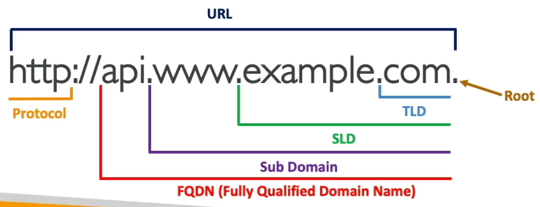

Consider the FQDN: `http://api.www.example.com`.

*   The last dot represents the **root** of all domain names.
*   `.com` is the **Top Level Domain (TLD)**.
*   `example.com` is the **Second Level Domain**.
*   `www.example.com` is a **Subdomain**.
*   `api.www.example.com` is the **FQDN** (Fully Qualified Domain Name).
*   `HTTP` is the **protocol**.
*   All of these together form the **URL**.

### How DNS Works ⚙️

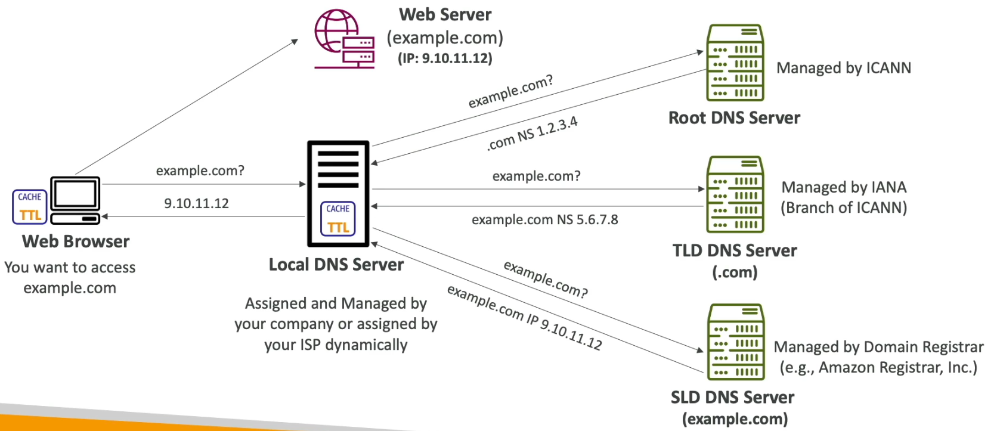

Let's illustrate how DNS works with an example. Suppose you have a web server with a public IP address `9.10.11.12`, and you want to access it using the domain name `example.com`.

1.  **Web Browser Request:** Your web browser wants to access `example.com` and asks its local DNS server, "Hey, do you know what `example.com` is?"

2.  **Local DNS Server:** This server is usually managed by your company or internet service provider. If it doesn't know the answer, it queries the root DNS server.

3.  **Root DNS Server:** Managed by ICANN, it's the first server queried. It responds, "I don't know `example.com`, but I know `.com`." It provides the NS record (Name Server) for `.com` at IP `1.2.3.4`.

4.  **Top Level Domain (TLD) Server (.com):** The local DNS server asks the `.com` domain server at `1.2.3.4` for the answer.

5.  **.com Domain Server:** Managed by IANA, it responds, "I know about `example.com`. Ask the server at `5.6.7.8`."

6.  **Second-Level Domain DNS Server (example.com):** This server is managed by your domain registrar (e.g., Amazon Route 53). The local DNS server asks, "Hey, do you know about `example.com`?"

7.  **Authoritative Answer:** The `example.com` DNS server has an entry for `example.com` and responds, "Yes, `example.com` is an A record with the IP `9.10.11.12`."

8.  **Caching:** The local DNS server caches this answer for future requests.

9.  **Response to Browser:** The local DNS server sends the IP address `9.10.11.12` back to your web browser.

10. **Web Server Access:** Your web browser uses the IP address to access your web server.

In summary, the DNS server recursively asks DNS servers, finding the most specific one to resolve the domain name to an IP address.

📝 **Note:** You've been using DNS every time you access a website like `www.google.com`. Now you understand how these DNS queries work behind the scenes.

This background knowledge is essential as we move into Route 53 to learn how to manage our own DNS servers.

---

## 2. Amazon Route 53

Amazon Route 53 is a highly available, scalable, and fully managed authoritative DNS service.

*   **Authoritative DNS:** You, as the customer, can update the DNS records, giving you full control.

Here's how it works:

1.  Clients want to access your EC2 Instance (e.g., `example.com`).
2.  Your EC2 Instance initially has only a public IP.
3.  You write DNS records into Amazon Route 53 within a hosted zone.
4.  When a client queries `example.com`, Route 53 responds with the associated IP address (e.g., `54.22.33.44`).
5.  The client then connects directly to your EC2 Instance. 🚀

Route 53 also functions as a domain registrar, allowing you to register domain names like `example.com`. We'll explore this in the hands-on section.

Route 53 provides health checks for your resources. This will be covered later.

📝 **Note:** Route 53 is the only AWS service that offers a 100% availability SLA.

Why it is named as Route 53? The name "Route 53" refers to the traditional DNS port (53) used by DNS services.

### DNS Records in Route 53

You define DNS records in Route 53 to control how traffic is routed to a specific domain. Each record contains the following information:

*   Domain or subdomain name (e.g., `example.com`).
*   Record type (e.g., A, AAAA, CNAME, NS).
*   Value (e.g., `12.34.56.78`).
*   Routing policy (how Route 53 responds to queries).
*   TTL (Time To Live): The duration the record is cached at DNS resolvers.

Route 53 supports various DNS record types. The most important ones to know are:

1.  A
2.  AAAA
3.  CNAME
4.  NS

We'll examine these in the hands-on lab. Other records types are: CAA, DS, MX, NAPTR, PTR, SOA, TXT, SPF, SRV.

### Important Record Types

Let's delve into the key record types for the exam:

*   **A:** Maps a hostname to an IPv4 address.
    📌 **Example:** `example.com` -> `1.2.3.4`
*   **AAAA:** Maps a hostname to an IPv6 address. This is the IPv6 equivalent of the A record.
*   **CNAME:** Maps a hostname to another hostname. The target hostname must have an A or AAAA record.

    ⚠️ **Warning:** You cannot create CNAME records for the top node of a DNS namespace (Zone Apex).
    📌 **Example:** You cannot create a CNAME for `example.com`, but you can for `www.example.com`.
*   **NS:** Specifies the name servers for a hosted zone. These servers respond to DNS queries for your domain and control traffic routing.

### Hosted Zones

Hosted zones are containers for records that define how to route traffic to a domain and its subdomains. There are two types:

1.  Public Hosted Zones
2.  Private Hosted Zones

*   **Public Hosted Zones:** Used for public domain names (e.g., `mypublicdomain.com`). They answer queries from the public internet.
    📌 **Example:** Resolving the IP address for `application1.mypublicdomainname.com`.
*   **Private Hosted Zones:** Used for private domain names that are not publicly accessible. Only resources within your VPC can resolve these URLs.
    📌 **Example:** Resolving `application1.company.internal` within a corporate network.

📝 **Note:** You'll incur costs for using Route 53:

*   $0.50 per month per hosted zone.
*   Domain registration costs a minimum of $12 per year.

### Public vs. Private Hosted Zones

| Feature          | Public Hosted Zone                                   | Private Hosted Zone                                  |
| ---------------- | ---------------------------------------------------- | ---------------------------------------------------- |
| Accessibility    | Accessible from the public internet.                 | Accessible only from within your VPC.               |
| Use Case         | Resolving public domain names.                       | Resolving private domain names for internal resources. |
| 📌 **Example**    | Resolving `example.com` to a public IP.            | Resolving `webapp.example.internal` to a private IP. |
| Resolution       | Web browsers can resolve the domain.                 | EC2 instances within the VPC can resolve the domain. |

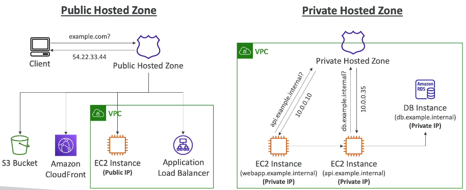

📌 **Example: Private Hosted Zone**

*   You have EC2 instances that you want to identify with private domain names:
    *   `webapp.example.internal`
    *   `api.example.internal`
    *   `database.example.internal`
*   You register a private hosted zone.
*   An EC2 instance requests `api.example.internal`.
*   The private hosted zone responds with the private IP `10.0.0.10`.
*   The EC2 instance connects to the second EC2 instance.
*   The second EC2 instance needs to connect to the database and requests `database.example.internal`.
*   The private hosted zone responds with the database's private IP.
*   The EC2 instance connects directly to the database.

Public and private hosted zones function similarly, but public zones allow anyone on the internet to query your public records, while private zones are queried only from within your private resources (e.g., your VPC).

Now, let's move on to the next lecture to register a domain and create some records! 🚀

---

## 3. Registering Domains in Route 53 

Let's walk through the process of registering a domain using Route 53.

📝 **Note:** You might see a slightly different console experience if you're using an older version. Make sure you're using the new console experience, as this is what will be used moving forward.

### Registering a Domain

1.  Navigate to the "Register Domains" section in the Route 53 console.
2.  Enter your desired domain name in the search bar. 💡 **Tip:** Choose a unique name that hasn't been registered by anyone else.
3.  If the domain name is available, you'll see the price per year. Select it and add it to your basket.
4.  Proceed to checkout.

### Checkout and Configuration

1.  **Duration:** Choose the registration duration (e.g., one year).
2.  **Autorenew:** Decide whether to enable autorenewal.
    *   If you plan to keep the domain, leave autorenew **on**.
    *   If you only need it for a short period (e.g., for this course), turn it **off**. ⚠️ **Warning:** If you disable autorenew and forget to renew, someone else can purchase your domain.
3.  Click "Next".

### Contact Information

1.  Review and update your contact information. This information is pre-populated from your AWS account.
2.  Ensure the admin and tech contacts are correct. They can be the same as the registrant contact.
3.  Enable privacy protection. 💡 **Tip:** This hides your personal contact information (address, phone number, etc.) from the public WHOIS database and helps prevent spam.

### Review and Submit

1.  Carefully review all the information on the review page.
2.  Check the terms and conditions.
3.  Click "Submit" to register the domain. ⚠️ **Warning:** This will charge your account the displayed amount. Don't proceed if you don't want to pay.

### Confirmation

1.  Domain registration can take a few minutes to a few hours.
2.  To confirm registration, go to "Hosted Zones" on the left-hand side of the Route 53 console.
3.  Click on your newly registered domain name.
4.  You should see at least two records: NS and SOA.

### Understanding NS and SOA Records

*   **NS (Name Server) Record:** This record indicates that AWS DNS (Route 53) should be used to resolve DNS queries for your domain.
*   **SOA (Start of Authority) Record:** This record contains administrative information about the domain.

### Route 53 as the Source of Truth

Now that you have a hosted zone, any DNS records you create (e.g., A, CNAME) will be managed by Route 53. Route 53 becomes the authoritative source for your domain's DNS information.

We are now ready to configure DNS records in the next lecture! 🎉

> If you already have a domain name, you can directly create a hosted zone with Route 53. Go to the Route 53 console and navigate to the "Hosted Zones" section. Click "Create Hosted Zone." Provide the domain name and click "Create hosted zone." 🎉 You also have to update the name servers in you domain registerer (like GoDaddy). Let's see how to do it. We have created a hosted zone for domain: `vikas9dev.xyz`. Check [section 18](#18-domain-registrar-vs-dns-service) for more detail.

✅ 2. Get Your Route 53 Name Servers

In Route 53 → Hosted Zones → `vikas9dev.xyz`, check the **NS record**.
Example:

**Note:** Remove the trailing dots (.) from the name servers.

```
NS Record: 
ns-652.awsdns-17.net.
ns-453.awsdns-56.com.
ns-1726.awsdns-23.co.uk.
ns-1176.awsdns-19.org.
```

✅ 3. Update GoDaddy with AWS Name Servers

1. Go to your **GoDaddy DNS settings** for `vikas9dev.xyz`
2. Find the **Nameservers** section
3. Click **Change** → Choose **Custom**
4. Paste the **4 Route 53 name servers** from AWS
5. Save and confirm

🕒 DNS propagation takes up to **5–10 minutes** typically, but can take up to **48 hours globally**.

---

## 4. Creating Your First Route 53 Records

Let's create our first records in Route 53.

First, navigate to your hosted zone.

To create a record:

1.  Click on the button to create a record.
2.  Enter the record name. 📌 **Example:** `test.vikas9dev.xyz`. You can enter any domain name you want.
3.  Specify the record type. There are many options, but we'll use an A record for this example. An A record routes an IPv4 address to a domain name.
4.  Enter the value, which will be an IPv4 address. 📌 **Example:** `11.22.33.44`. 📝 **Note:** This is just a random IP address for demonstration purposes. Later, we'll route to a real EC2 instance.
5.  Set the TTL (Time To Live). We'll leave it at 300 seconds for now.
6.  Leave the routing policy as "Simple routing" for now. We'll explore other routing policies later.
7.  Click "Create record". 🎉 Your record has been successfully created!

The idea is that when you go to `test.vikas9dev.xyz`, it will query your hosted zone, which will return the value `11.22.33.44`.

If you try to access `test.vikas9dev.xyz` in a web browser, it won't work because there's likely no server at the IP address `11.22.33.44`.

To verify the record, we'll use command-line tools.

You can use your own terminal on Windows or Mac. However, to ensure everyone follows the same steps, we'll use the AWS CloudShell environment.

1.  Open the AWS Management Console.
2.  Click to open CloudShell.

CloudShell provides a standard Linux command-line interface.

If you're on Windows, the `nslookup` command should work. On Mac, the `dig` command should work.

However, these commands might not be available in CloudShell by default. If you encounter a "command not found" error, you'll need to install them:

```bash
sudo yum install -y bind-utils
```

This command installs both `nslookup` and `dig`.

Now, let's query the record:

```bash
nslookup test.vikas9dev.xyz
```

You should see an answer showing that `test.vikas9dev.xyz` resolves to `11.22.33.44`.

I prefer the `dig` command:

```bash
dig test.vikas9dev.xyz
```

The `dig` command provides more information, including the TTL and the record type (A record).

The "ANSWER SECTION" will show:

```
test.vikas9dev.xyz.  300 IN  A   11.22.33.44
```

Complete output:-

```bash
$ nslookup test.vikas9dev.xyz
Server:         10.0.0.2
Address:        10.0.0.2#53

Non-authoritative answer:
Name:   test.vikas9dev.xyz
Address: 11.22.33.44
```

```bash
$ dig test.vikas9dev.xyz

; <<>> DiG 9.18.33 <<>> test.vikas9dev.xyz
;; global options: +cmd
;; Got answer:
;; ->>HEADER<<- opcode: QUERY, status: NOERROR, id: 53126
;; flags: qr rd ra; QUERY: 1, ANSWER: 1, AUTHORITY: 0, ADDITIONAL: 1

;; OPT PSEUDOSECTION:
; EDNS: version: 0, flags:; udp: 4096
;; QUESTION SECTION:
;test.vikas9dev.xyz.            IN      A

;; ANSWER SECTION:
test.vikas9dev.xyz.     68      IN      A       11.22.33.44

;; Query time: 0 msec
;; SERVER: 10.0.0.2#53(10.0.0.2) (UDP)
;; WHEN: Tue Jul 15 16:13:51 UTC 2025
;; MSG SIZE  rcvd: 63
```

We have successfully created our first Route 53 record and queried it using a terminal! 🚀

While loading it from a webpage doesn't work yet, we'll see how to do that later when we have a real server.

---

## 5. Setting Up EC2 Instances and ALB for Route 53

Let's set up the infrastructure needed before configuring Route 53. This involves creating three EC2 instances in different regions and one Application Load Balancer (ALB).

Note: Since we want to launch the instances in different regions, consider the following points:-
* **Security Group**: Security groups are region-specific, so if you want to launch EC2 instances in multiple regions, you must create a separate security group in each region, even if the rules are identical.
* **Launch Template**: Cannot be used across regions because it's tied to region-specific resources like AMIs, subnets, and key pairs.
* **AMI**: Not usable in other regions directly since AMIs are stored regionally and have different IDs per region.

### Creating EC2 Instances

We'll launch EC2 instances in Frankfurt, Northern Virginia, and Singapore.

1.  **Frankfurt (eu-central-1)**
    *   Launch an EC2 instance.
    *   Choose Amazon Linux 2.
    *   Instance type: t2.micro.
    *   No key pair needed (using EC2 Instance Connect).
    *   Create a security group allowing SSH and HTTP from anywhere.
    *   Add a bootstrap user data script: Paste the script into the Advanced Details section under User data.

        ```bash
        #!/bin/bash
        yum update -y
        yum install -y httpd
        systemctl start httpd
        systemctl enable httpd
        # updated script to make it work with Amazon Linux 2023
        CHECK_IMDSV1_ENABLED=$(curl -s -o /dev/null -w "%{http_code}" http://169.254.169.254/latest/meta-data/)
        if [[ "$CHECK_IMDSV1_ENABLED" -eq 200 ]]
        then
            EC2_AVAIL_ZONE="$(curl -s http://169.254.169.254/latest/meta-data/placement/availability-zone)"
        else
            EC2_AVAIL_ZONE="$(TOKEN=$(curl -s -X PUT "http://169.254.169.254/latest/api/token" -H "X-aws-ec2-metadata-token-ttl-seconds: 21600") && curl -s -H "X-aws-ec2-metadata-token: $TOKEN" http://169.254.169.254/latest/meta-data/placement/availability-zone)"
        fi
        echo "<h1>Hello world from $(hostname -f) in AZ $EC2_AVAIL_ZONE </h1>" > /var/www/html/index.html
        ```
    *   Launch the instance.

2.  **Northern Virginia (us-east-1)**
    *   Launch an EC2 instance.
    *   Use the same settings as Frankfurt:
        *   Amazon Linux 2, t2.micro, no key pair.
        *   Allow HTTP.
        *   Use the same user data script.
    *   Launch the instance.

3.  **Singapore (ap-southeast-1)**
    *   Launch an EC2 instance.
    *   Use the same settings as the previous instances:
        *   Amazon Linux 2, t2.micro, no key pair.
        *   Allow HTTP.
        *   Use the same user data script.
    *   Launch the instance.

### Creating an Application Load Balancer (ALB)

We'll create an ALB in N. Verginia (Load Balancer is also Regional).

1.  Go to the Load Balancers section in the EC2 console.
2.  Create a new load balancer.
3.  Choose Application Load Balancer (ALB).
4.  Name: `DemoRoute53ALB`.
5.  Scheme: Internet-facing, IPv4.
6.  Mapping: Select all subnets.
7.  Security group: Choose a security group with HTTP enabled (e.g., the one created earlier).
8.  Listener:
    *   Protocol: HTTP, Port 80.
    *   Forward to a new target group.
9.  Target Group:
    *   Name: `demo-tg-route53`.
    *   Target type: Instances.
    *   Register the EC2 instance.
    *   Include as pending below.
    *   Review targets and create the target group.
10. Refresh the load balancer configuration and select the `demo-tg-route53` target group.
11. Create the load balancer.
12. View the load balancer.

Now we have 4 resources:-
- 1 EC2 in Frankfurt
- 1 EC2 in Northern Virginia
- 1 EC2 in Singapore
- 1 ALB in Northern Virginia

### Verifying the Setup

1.  **EC2 Instance Verification:**
    *   For each EC2 instance, get the public IP address.
    *   Access the IP address via HTTP in your browser.
    *   Verify the "Hello World" message and the Availability Zone (AZ).
    *   📌 **Example:** `Hello World from AZ eu-central-1b`
    *   📝 **Note:** Keep a record of each instance's IP address and region.

2.  **ALB Verification:**
    *   Get the DNS name of the ALB.
    *   Access the DNS name in your browser.
    *   Verify that it displays the "Hello World" message from the Frankfurt EC2 instance.
    *   📝 **Note:** DNS provisioning can take some time.

        ```text
        EC2 Instance 1: <IP_Address_1> - EU Central 1
        EC2 Instance 2: <IP_Address_2> - US East 1
        EC2 Instance 3: <IP_Address_3> - AP Southeast 1
        ```

With these steps completed, you have successfully set up the EC2 instances and ALB, preparing you for the next steps with Route 53. 🚀

```log
Northern Virginia
44.192.95.199
Hello world from ip-172-31-71-84.ec2.internal in AZ us-east-1f

Frankfurt
18.156.82.22
Hello world from ip-172-31-31-181.eu-central-1.compute.internal in AZ eu-central-1a

Singapur
54.169.233.238
Hello world from ip-172-31-30-248.ap-southeast-1.compute.internal in AZ ap-southeast-1b

ALB - US
http://demoroute53alb-2011903872.us-east-1.elb.amazonaws.com/
Hello world from ip-172-31-71-84.ec2.internal in AZ us-east-1f
```

---

## 6. Understanding Time To Live (TTL) in DNS Records

A record's **TTL** (Time To Live) determines how long clients should cache DNS query results. Let's explore how this works with an example involving a client, DNS Route 53, and a web server.

1.  The client makes a DNS request for `myapp.example.com`.
2.  The DNS responds with an A record containing the IP address and a **TTL**, 📌 **Example:** 300 seconds.
3.  The **TTL** instructs the client to cache this result for the specified duration.

### Caching Behavior

For the duration of the **TTL**, the client will:

*   Not query the DNS system for the same hostname.
*   Use the cached IP address to directly access the web server.
*   Perform HTTP requests and responses using the cached information.

The primary reason for using **TTL** is to reduce the frequency of DNS queries, assuming records don't change frequently.

### High vs. Low TTL Values

There are trade-offs when choosing **TTL** values:

*   **High TTL** (📌 **Example:** 24 hours):
    *   ✅ Less traffic to Route 53.
    *   ⚠️ Clients may use outdated records for longer periods.
    *   ⏳ Longer wait times for record changes to propagate.
*   **Low TTL** (📌 **Example:** 60 seconds):
    *   ❌ More traffic to your DNS service (higher cost).
    *   ✅ Records are outdated for shorter periods.
    *   🚀 Faster propagation of record changes.

The optimal **TTL** depends on your specific needs.

### Strategy for Record Changes

If you plan to change a record, consider this strategy:

1.  📉 Decrease the **TTL** (📌 **Example:** to 60 seconds) for a period (📌 **Example:** 24 hours).
2.  🔄 Wait for the original **TTL** to expire to ensure most clients have the new, lower **TTL**.
3.  📝 **Note:** This ensures that clients refresh their cache more frequently.
4.  ✅ Change the record value.
5.  📈 Increase the **TTL** back to its original value.

### TTL in Route 53

*   **TTL** is mandatory for most record types.
*   Alias records are an exception (covered in the next lecture).

### Demo: TTL in Action

Let's see how **TTL** works in the Route 53 console.

1.  Create a new record:
    *   Name: `demo.vikas9dev.xyz`
    *   Type: A record
    *   Value: IP address of an EC2 instance (📌 **Example:** in `eu-central-1`)
    *   TTL: 120 seconds (2 minutes)
2.  Verify the record is working using a browser (Chrome is recommended).
3.  Use `nslookup` or `dig` in CloudShell to query the record.

    ```bash
    nslookup demo.vikas9dev.xyz
    ```

    ```bash
    dig demo.vikas9dev.xyz
    ```

4.  Observe the **TTL** value in the `dig` output.  The "answer section" displays the remaining **TTL** for the cached record.
```
demo.vikas9dev.xyz.	120	IN	A	44.192.95.199
demo.vikas9dev.xyz.	88	IN	A	44.192.95.199
demo.vikas9dev.xyz.	18	IN	A	44.192.95.199
```
5.  Edit the record and change the IP address (📌 **Example:** to an instance in `ap-southeast-1`).
6.  Re-run the `dig` command immediately.  The output will still show the old IP address and a decreasing **TTL**, because the old record is still cached.
7.  Wait for the **TTL** to expire.
8.  Refresh the browser and re-run the `dig` command. You should now see the new IP address and a new **TTL** value.

```
demo.vikas9dev.xyz.	120	IN	A	18.156.82.22
```

This demo illustrates how **TTL** affects DNS resolution and how long it takes for changes to propagate.

---

## 7. CNAME vs. Alias Records in Route 53

When working with AWS resources like Load Balancers or CloudFront, you often need to map their hostnames to a domain you own (e.g., `myapp.mydomain.com`). Route 53 provides two options for this: CNAME records and Alias records. Let's explore the differences.

### CNAME Records

*   CNAME (Canonical Name) records point a hostname to another hostname.
    📌 **Example:** `app.mydomain.com` points to `blabla.anything.com`.
*   ⚠️ **Warning:** CNAME records only work for **non-root** domain names (e.g., `something.mydomain.com`). They **cannot** be used for the root domain itself (e.g., `mydomain.com`).

### Alias Records

*   Alias records are specific to Route 53.
*   They point a hostname to a specific AWS resource.
    📌 **Example:** `app.mydomain.com` points to `blabla.amazonaws.com`.
*   Alias records work for **both root domains** and **non-root domains**. This is a key advantage.
*   Alias records are **free of charge**. 💰
*   They have **native health check** capabilities. ✅

Major Difference between CNAME and Alias Records (Exam may test on this)
- CNAME records only work for non-root domain names.
- Alias records work for both root and non-root domain names.

### Alias Record Details

*   Alias records are exclusively mapped to AWS resources.
*   📌 **Example:** You can create an alias record of type A for `example.com`, with the value being the DNS name of your load balancer.
*   Alias records are an extension to standard DNS functionality.
*   If the underlying resource (e.g., an ALB) has IP address changes, the alias record automatically recognizes them.
*   Alias records can be used for the Zone Apex (the top node of the DNS namespace, e.g., `example.com`).
*   Alias records are always of type A (IPv4) or AAAA (IPv6).
*   You **cannot set the TTL (Time To Live)** for alias records; Route 53 manages it automatically.

### Alias Record Targets

Alias records can target the following AWS resources:

*   Elastic Load Balancers (ELB)
*   CloudFront Distributions
*   API Gateway
*   Elastic Beanstalk environments
*   S3 Websites (when buckets are enabled as websites)
*   VPC Interface Endpoints
*   Global Accelerator accelerators
*   Route 53 records in the same hosted zone

⚠️ **Warning:** You **cannot** set an alias for an EC2 DNS name.

### Practical Demonstration

Let's walk through a practical example using the AWS console to illustrate the differences between CNAME and Alias records.

1.  **Creating a CNAME Record:**

    *   Create a record named `myapp.vikas9dev.xyz`.
    *   Set the record type to CNAME.
    *   Set the value to the domain name of an existing ALB (Application Load Balancer).
    *   This allows you to access the ALB using `myapp.vikas9dev.xyz` instead of the ALB's default URL.
    *   This is not AWS native and will work for many domain names.
2.  **Creating an Alias Record:**

    *   Create a record named `myalias.vikas9dev.xyz`.
    *   Set the record type to A (for IPv4).
    *   Enable the "Alias" option.
    *   Choose the target as "Alias to an Application and Classic Load Balancer".
    *   Select the appropriate region (e.g., `eu-central-1`).
    *   Choose the specific load balancer.
    *   Enable "Evaluate target health" to leverage the native health check.
    *   This record is FREE to query.
3.  **Attempting a CNAME Record at the Domain Apex:**

    *   Try to create a CNAME record for `vikas9dev.xyz` (the root domain) pointing to the ALB's domain name.
    *   This will fail with a "Bad request" error 🚫 because CNAME records are not permitted at the apex of the zone. 😔
4.  **Creating an Alias Record at the Domain Apex:**

    *   Create an alias record for `vikas9dev.xyz` of type A.
    *   Set the alias to point to the ALB in the appropriate region.
    *   This will succeed because alias records are allowed at the domain apex.

### Summary

| Feature          | CNAME Record                               | Alias Record                                  |
| ---------------- | ------------------------------------------ | --------------------------------------------- |
| Target           | Hostname                                   | AWS Resource                                  |
| Root Domain      | Not Supported                              | Supported                                     |
| Cost             | Standard DNS query costs                   | Free                                          |
| Health Checks    | No Native Support                          | Native Support                                |
| IP Address Updates | Requires DNS propagation                   | Automatically handled by Route 53             |

📝 **Note:** Understanding the differences between CNAME and Alias records, especially regarding root domain support, is crucial for the AWS Certified Cloud Practitioner exam.

---

## 8. Simple Routing Policy in Route 53

A routing policy helps Route 53 respond to DNS queries. It's important to understand that this "routing" is from a DNS perspective, not like a load balancer routing traffic to backend EC2 instances. DNS doesn't route traffic; it only responds to DNS queries, informing clients where to send their requests (e.g., HTTP queries). The DNS translates hostnames into endpoints.

Route 53 supports several routing policies:

- Simple
- Weighted
- Failover
- Latency Based
- Geolocation
- Multi-Value Answer
- Geoproximity

### Simple Routing Policy

Let's start with the **Simple Routing Policy**.

With this policy, you typically route traffic to a single resource.

📌 **Example:**

A client queries `foo.example.com`, and Route 53 responds with a single IP address (an A record).

It's possible to specify multiple values in the same record. If multiple values are returned by the DNS, the client randomly chooses one.

📌 **Example:**

A client queries `foo.example.com`, and Route 53 responds with three IP addresses in the A record. The client picks one randomly.

If you enable an alias record alongside the simple policy, you can only specify one AWS resource as a target.

The simple routing policy is, well, simple! Therefore, you cannot associate it with health checks. We'll cover health checks later.

Let's see how to create a simple routing policy in the AWS console.

1.  Create a record.
2.  Set the record name (e.g., `simple.vikas9dev.xyz`).
3.  Choose the record type as "A".
4.  Specify a value (e.g., the IP address of an instance in `ap-southeast-1`). 
5.  Set a low TTL (e.g., 20 seconds).
6.  Select "Simple" as the routing policy.
7.  Create the record.

Now, if you navigate to `simple.vikas9dev.xyz`, you should see the response from your instance in `ap-southeast-1b`.

You can use the `dig` command to verify the DNS record:

```bash
sudo yum install bind-utils
dig simple.vikas9dev.xyz
```

This will show an A record with a TTL of 20 seconds pointing to the specified IP address.

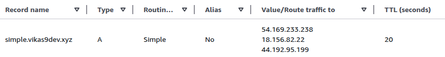

You can edit the record to include multiple IP addresses.

1.  Edit the record.
2.  Add multiple IP addresses as values (e.g., one in `ap-southeast-1` and one in `us-east-1`).
3.  Save the record.

After the TTL expires, the DNS query will return both IP addresses.

You can use CloudShell to verify this:

```bash
dig simple.vikas9dev.xyz
```

The output will show 3 A records, one for each IP address.

Since it's a client-side choice, refreshing the website might direct you to either `ap-southeast-1` or `us-east-1`.

This demonstrates how simple records work.

Note if you don't get the actual TTL in dig then try: `$ dig simple.vikas9dev.xyz @ns-652.awsdns-17.net`, (Replace @ns-1478.awsdns-56.org with your domain’s actual nameserver — get it via dig NS vikas9dev.xyz)

---

## 9. Weighted Routing Policy

The weighted routing policy allows you to direct a percentage of your traffic to specific resources based on assigned weights.

Here's how it works:

*   Amazon Route 53 receives DNS queries.
*   You have multiple resources (e.g., EC2 instances) with assigned weights.
*   Route 53 directs traffic to these resources based on their weights.

📌 **Example:**

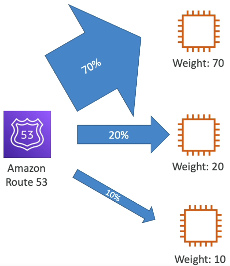

Imagine three EC2 instances with weights of 70, 20, and 10. This means:

*   70% of DNS responses will redirect to the first EC2 instance.
*   20% of DNS responses will redirect to the second EC2 instance.
*   10% of DNS responses will redirect to the third EC2 instance.

📝 **Note:** The weights don't necessarily need to sum up to 100. They represent a relative proportion of traffic distribution.

### How Weights are Calculated

The traffic percentage sent to each record is calculated as:

`Record Weight / Sum of All Record Weights`

This gives you the percentage of traffic directed to that specific record.

### Requirements

To use weighted routing:

*   DNS records must have the same name and type.
*   You can associate health checks with these records. We'll cover health checks soon.

### Use Cases

Weighted routing is useful for:

*   ⚖️ **Load balancing:** Distributing traffic across different regions.
*   🧪 **Testing new application versions:** Sending a small percentage of traffic to the new version.
*   🔄 **Gradual Traffic Shifting:** Shifting weight over time to migrate traffic.

💡 **Tip:** Setting a weight of zero will stop traffic from being sent to a specific resource.

If all resource records have a weight of zero, the records will be returned with equal weights.

### Console Demonstration

Let's see how to configure weighted routing in the AWS console.

1.  **Create a New Record:**

    *   Name: `weighted.vikas9dev.xyz`
    *   Type: `A` record
    *   Routing Policy: `Weighted`

2.  **Configure the First Record:**

    *   Value: IP address from `ap-southeast-1` region
    *   Weight: `10`
    *   TTL: `3` seconds (for demonstration purposes only - ⚠️ **Warning:** do not use this in production)
    *   Record ID: `southeast`

3.  **Add a Second Record:**

    *   Name: `weighted.vikas9dev.xyz`
    *   Routing Policy: `Weighted`
    *   Value: IP address from `us-east-1` region
    *   Weight: `70`
    *   Record ID: `US East`
    *   TTL: `3` seconds

4.  **Add a Third Record:**

    *   Name: `weighted.vikas9dev.xyz`
    *   Value: IP address from `eu-central-1` region
    *   Routing Policy: `Weighted`
    *   Weight: `20`
    *   Record ID: `EU`
    *   TTL: `3` seconds

5.  **Create the Records:**

    You should now see three records in your Route 53 zone, each with a different weight.

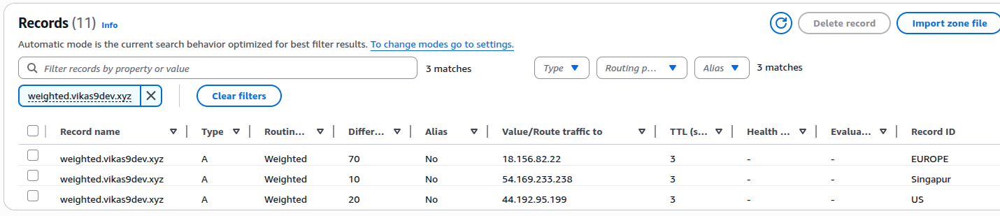

### Testing the Configuration

Access the URL `weighted.vikas9dev.xyz` in your browser. You should initially see responses primarily from the `us-east-1` region (weight 70). Refreshing the page (every 3 seconds due to the low TTL) should occasionally return responses from the other regions.

You can also use the `dig` command to observe the DNS responses:

```bash
dig weighted.vikas9dev.xyz
```

The output will show the TTL and the IP address being returned. Repeatedly running the command should show different IP addresses corresponding to the different regions, reflecting the configured weights.

The weighted routing policy effectively redirects most queries to the resource with the highest weight, while occasionally returning other answers based on their respective weights.

---

## 10. Latency-Based Routing Policy

The latency-based routing policy redirects users to the resource with the lowest latency, effectively directing them to the closest AWS region. This is particularly useful when latency is a primary concern for your websites or applications. 🚀

Latency is measured by how quickly users can connect to the nearest identified AWS region for a given record. 🌐

📌 **Example:** A user in Germany might be redirected to a resource in the US if the latency to that US resource is lower than to any resource within Germany.

This policy can be combined with health checks, which will be discussed in the next lecture. 🩺

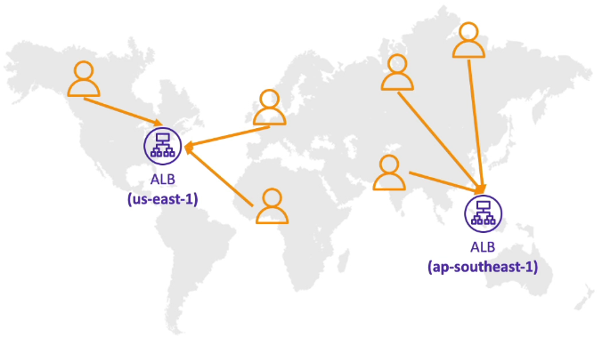

Let's consider an application deployed in two regions: `us-east-1` and `ap-southeast-1`. Route 53 evaluates latency for users worldwide.

*   Users with the lowest latency to `us-east-1` are directed there. ➡️
*   Other users are directed to `ap-southeast-1`. ➡️

Now, let's implement this in the AWS console. 💻

1.  Create a new record with the name `latency.vikas9dev.xyz`.
2.  Set the value to the IP address of the resource in `ap-southeast-1`.
3.  Set the Routing policy to **Latency**.
4.  Specify the region for the record. In this case, it's `ap-southeast-1` (Singapore).

📝 **Note:** When using an IP address as the value, you must specify the region. Alias records can automatically infer the region, but IP addresses require explicit specification.

You can also associate a health check and a Record ID.

📌 **Example:** Set the Record ID to `ap-southeast-1`.

5.  Add another record for `us-east-1`.
6.  Set the value to the IP address of the resource in `us-east-1`.
7.  Set the Routing policy to **Latency**.
8.  Specify the region as `us-east-1`.
9.  Set the Record ID to `us-east-1`.
10. Add a final record for `eu-central-1`.
11. Set the value to the IP address of the resource in `eu-central-1`.
12. Set the Routing policy to **Latency**.
13. Specify the region as `eu-central-1`.

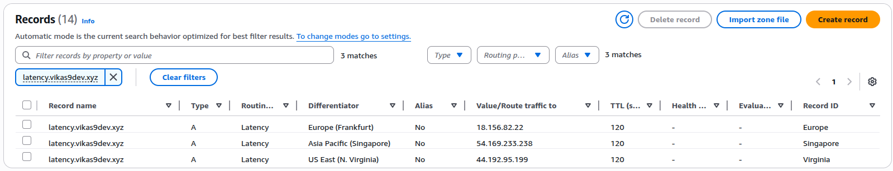

After creating these three records, you can test the configuration.

Since the instructor is located in Europe, accessing `latency.vikas9dev.xyz` should direct them to the instance in `eu-central-1`.

📌 **Example:** Accessing the URL returns "Hello World" from the IP address associated with `eu-central-1c`.

Using `dig` command in CloudShell (located in Europe) will also return the IP address of the `eu-central-1` instance.

```bash
dig latency.vikas9dev.xyz
```

To test routing to other regions, a VPN can be used to simulate connections from different locations.

📌 **Example:** Connecting to a VPN server in Canada results in being routed to the `us-east-1` instance.

This is because the latency from Canada is lower to `us-east-1` than to `eu-central-1` or `ap-southeast-1`.

Changing the VPN location clears the DNS cache, allowing the browser to retrieve the updated routing information.

📌 **Example:** Connecting to a VPN server in Hong Kong results in being routed to the `ap-southeast-1` instance.

This demonstrates that the latency-based routing policy is working correctly, directing users to the closest region based on latency. ✅

---

## 11. Health Checks in Route 53

Health checks in Route 53 allow you to monitor the health of your resources, primarily public ones, but also private resources using CloudWatch.

Here's how they work:

*   Imagine you have two Load Balancers in different regions (e.g., `us-east-1` and `eu-west-1`) [both are public], both running your application for high availability.
*   You use Route 53 to create DNS records (e.g., `mydomain.com`) that direct users to the closest Load Balancer (using a latency-based record).
*   To ensure users aren't sent to a failing region, you create health checks.

Route 53 health checks offer automated DNS failover.

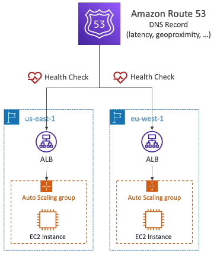

There are three types of health checks:

1.  Monitor an endpoint: This is a public endpoint like an application, server, or another AWS resource.
2.  Monitor other health checks: This is also called a calculated health check.
3.  Monitor a CloudWatch Alarm: This provides more control and is useful for private resources.

📝 **Note:** Health checks have their own metrics that you can view in CloudWatch.

### Health Checks for Specific Endpoints

Let's examine how health checks work with a specific endpoint, such as an Application Load Balancer (ALB) in `eu-west-1`.

*   AWS health checkers, located globally (approximately 15), send requests to your public endpoint.
*   If a 200 OK code (or a code you define) is returned, the resource is considered healthy.

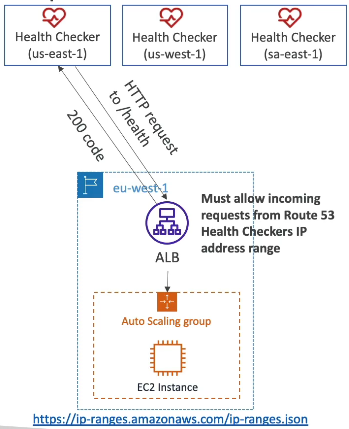

Key configuration options:

*   **Threshold:** Set the threshold for healthy or unhealthy status.
*   **Interval:** Choose between:
    *   Regular health checks: 30-second intervals.
    *   Fast health checks: 10-second intervals (higher cost).
*   **Protocols:** Supported protocols include HTTP, HTTPS, and TCP.

The rule for determining health: If over 18% of the health checkers report the endpoint as healthy, Route 53 considers it healthy. You can also choose the locations used for health checks.

Health checks pass only if the load balancer returns a 2xx or 3xx status code.

💡 **Tip:** For text-based responses, health checkers can inspect the first 5,120 bytes for specific text.

⚠️ **Warning:** For health checks to function, the Route 53 health checkers must be able to access your Application Load Balancer or other endpoints. Allow incoming requests from the Route 53 health checkers' IP address range. You can find this address range [here](https://docs.aws.amazon.com/Route53/latest/DeveloperGuide/route-53-ip-addresses.html).

### Calculated Health Checks

Calculated health checks combine the results of multiple health checks into a single health check.

📌 **Example:**

Imagine you have three EC2 instances.

1.  Create three health checks, each monitoring one EC2 instance (child health checks).
2.  Define a parent health check that aggregates the child health checks.

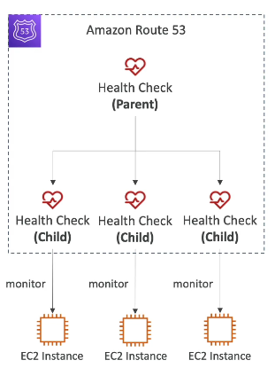

You can use conditions like OR, AND, or NOT to combine the health check results. You can monitor up to 256 child health checks and specify how many must pass for the parent to pass.

Use case: Perform maintenance on your website without causing all health checks to fail.

### Health Checks for Monitoring Private Resources

Monitoring private resources requires a different approach because Route 53 health checkers are outside your VPC and cannot access private endpoints.

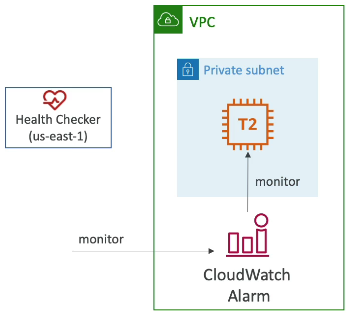

The solution: Use CloudWatch.

1.  Create a CloudWatch Metric to monitor the health of your EC2 instance in a private subnet.
2.  Assign a CloudWatch Alarm to the metric.
3.  Associate the CloudWatch Alarm with the health checker.

When the alarm enters the alarm state, the health checker automatically becomes unhealthy, effectively creating a health check on a private resource. This is a common use case.

---

## 12. Creating Health Checks

Let's create some health checks to monitor our EC2 instances (Route 53 => Health Checks). We'll create three health checks, each monitoring an instance in a different AWS region. Name:-

1.  **US East (N. Virginia) - `us-east-1`**
2.  **Asia Pacific (Singapore) - `ap-southeast-1`**
3.  **EU Central (Frankfurt) - `eu-central-1`**

### Configuring Health Checks

For each health check, we'll specify the following:

*   Endpoint: IP address of the EC2 instance.
*   Port: 80 (HTTP).
*   Path: `/` (root). 💡 **Tip:** For real applications, a dedicated health check endpoint like `/health` is recommended.

#### Step-by-step guide:

- Name: `us-east-1`
- Want to monitor: Endpoint
- Specify Endpoint by: IP address
- Protocol: HTTP
- IP address: `44.192.95.199`
- Port: 80
- Path: `/`

Review advanced configuration options:

* Request Interval:   **Standard vs. Fast Health Checks:** Standard checks occur every 30 seconds, while fast checks occur every 10 seconds. Fast checks are more expensive. We will keep them standard.
*   **Failure Threshold:**  The number of consecutive failures before the health check is considered unhealthy => 3.
*   **String Matching:**  Optionally search for a specific string in the first 5,120 bytes of the response. No.
*   **Latency Graph:**  Enable to visualize latency over time. Keep default.
*   **Invert Health Check Status:**  Invert the meaning of healthy/unhealthy. Keep default.
*   **Health Check Regions:**  Customize the regions from which health checks are performed.  The default "recommended" setting is usually sufficient.
*   **Notifications:**  Configure alarms to be notified when a health check fails. We can opt out of this feature.

Do the same for `ap-southeast-1`, and finally for `eu-central-1`.

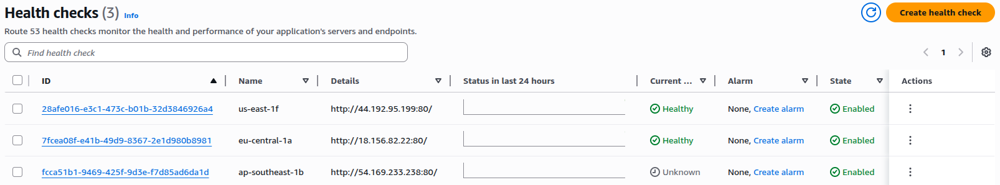

We will use these health checks in the next lectures.

### Simulating a Failure

To demonstrate a failing health check, we'll block port 80 on the EC2 instance in the `ap-southeast-1` region by modifying its security group.

1.  Locate the security group associated with the `ap-southeast-1` instance.
2.  Edit the inbound rules.
3.  Remove the rule allowing HTTP (port 80) traffic.

This will cause the health check for `ap-southeast-1` to report an unhealthy status due to connection timeouts.

### Analyzing Health Check Results

After blocking port 80, the health check for `ap-southeast-1` should transition to an unhealthy state.

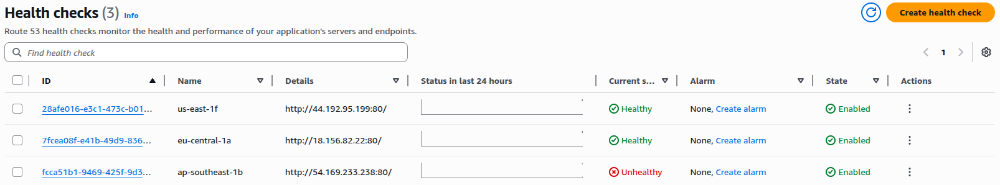

*   You can view the error status to see details about the failure, such as connection timeouts.
*   The "View last failed check" option provides detailed information about the failure.

📌 **Example:** The error status will likely indicate a connection timeout, confirming that the security group change is blocking the health check requests.

### Calculated Health Checks

Route 53 allows you to create calculated health checks, which monitor the status of other health checks.

1.  Create a new calculated health check.
2.  Select the health checks you want to monitor.
3.  Define the criteria for the calculated health check to be considered healthy (e.g., all monitored health checks must be healthy, or at least one must be healthy).

📌 **Example:** You can configure a calculated health check to report healthy only when all three of our region-specific health checks are healthy.

### Monitoring CloudWatch Alarms

> We don't have an alarm, so we won't create this. Just see, how it can be done.

You can also create health checks that monitor the state of CloudWatch alarms.

1.  Specify the region where the CloudWatch alarm is located.
2.  Select the CloudWatch alarm to monitor.

This allows you to integrate the health of private resources (monitored by CloudWatch alarms) into Route 53 health checks. 📝 **Note:** You need an existing CloudWatch alarm to create this type of health check.

The calculated health check will now report unhealthy because the `ap-southeast-1` health check is failing, demonstrating the power and flexibility of Route 53 health checks.

---

## 13. Route 53 Failover Routing Policy

This section explains how to configure a failover routing policy in Route 53 for disaster recovery. The goal is to automatically switch traffic from a primary EC2 instance to a secondary (disaster recovery) EC2 instance if the primary instance becomes unhealthy.

The setup involves:

*   Route 53 acting as the DNS service.
*   A primary EC2 instance.
*   A secondary (disaster recovery) EC2 instance.

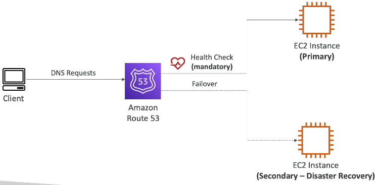

Here's how it works:

1.  Associate the primary record in Route 53 with a health check. ⚠️ **Warning:** This association is mandatory for failover routing.
2.  If the health check for the primary instance becomes unhealthy, Route 53 automatically fails over to the secondary EC2 instance.
3.  The secondary EC2 instance can also be associated with a health check, but this is optional.
4.  Clients making DNS requests will automatically receive the resource that is deemed healthy.

*   If the primary instance is healthy, Route 53 responds with the primary record.
*   If the health check for the primary instance is unhealthy, Route 53 responds with the secondary record.

This setup allows for seamless failover.

### Hands-on Example: Creating a Failover Record

Let's create a failover record in Route 53 using health checks.

1.  **Create a Record for the Primary Instance:**
    *   Record Name: `failover.vikas9dev.xyz`
    *   Record Type: A
    *   Value: IP address of the EU-central-1 instance.
    *   Routing Policy: Failover
    *   TTL: 60 seconds (a low value for faster failover).
    *   Failover Record Type: Primary
    *   Associate with Health Check: Select the health check for the EU-central-1 instance (e.g., `EU-central-1`).
    *   Record ID: `EU` (or any identifier).

2.  **Create a Record for the Secondary Instance:**
    *   Record Name: `failover.vikas9dev.xyz`
    *   Record Type: A
    *   Value: IP address of the US-east-1 instance.
    *   Routing Policy: Failover
    *   TTL: 60 seconds.
    *   Failover Record Type: Secondary
    *   Associate with Health Check: Optionally, select the health check for the US-east-1 instance.
    *   Record ID: `US` (or any identifier).

3.  **Verify the Setup:**
    *   Initially, both health checks should be healthy.
    *   Access `failover.vikas9dev.xyz` in a browser. You should receive a response from the EU-central-1 instance.

4.  **Simulate a Failure:**
    *   Go to the EC2 console in the EU-central-1 region.
    *   Find the security group associated with the EU-central-1 instance.
    *   Remove the inbound rule for HTTP (port 80) to make the instance unreachable by the health checkers.

5.  **Test the Failover:**
    *   Wait for the EU-central-1 health check to become unhealthy. You can monitor the health check status in the Route 53 console.
    *   Once the health check is unhealthy, refresh `failover.vikas9dev.xyz` in your browser. You should now receive a response from the US-east-1 instance.

The failover has occurred seamlessly.

6.  **Fix the Issue:**
    *   Go back to the security group of the EU-central-1 instance.
    *   Add back the inbound rule for HTTP (port 80).
    *   The health check will automatically pass again, and Route 53 will fail back to the primary location (EU-central-1).

📝 **Note:** This example demonstrates a simple failover scenario. In a real-world scenario, you might have more complex health checks and configurations.

💡 **Tip:** Use a low TTL value for faster failover times.

---

## 14. Routing Policy: Geolocation

Geolocation routing policy directs traffic to different resources based on the geographic location of the user. This is distinct from Latency-based routing.

*   🌍 It determines the user's location by continent, country, or even U.S. state.
*   📍 The most precise location match is selected first.
*   ⚠️ **Warning:** Always create a default record to handle requests from locations that don't match any specific rule.

Use Cases:

*   🌐 Website localization: Serving different language versions of a website based on the user's location.
*   🔒 Restricting content distribution: Limiting access to content based on geographic regions.
*   ⚖️ Load balancing: Distributing traffic across different servers based on user location.

📝 **Note:** Geolocation records can be associated with health checks to ensure traffic is only routed to healthy endpoints.

📌 **Example:**

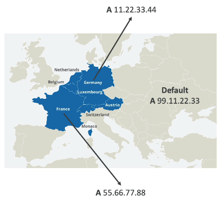

Imagine a map of Europe. You can configure:

*   🇩🇪 Users from Germany are routed to an IP address hosting the German version of your app.
*   🇫🇷 Users from France are routed to an IP address hosting the French version of your app.
*   🇬🇧 All other users are routed to a default IP address hosting the English version of your app.

> Make ap-southeast-1 back to healty by adding the inbound rule for HTTP (port 80) to the security group of the ap-southeast-1 instance.

### Console Practice: Creating Geolocation Records

Let's create a few geolocation records in the AWS console.

1.  **Create a record for Asia:**

    *   Record Name: geo
    *   Record Type: A
    *   Value: ap-southeast-1 (Singapore region) IP address
    *   Routing Policy: Geolocation
    *   Location: Asia (We have specified the continent)
    *   Record ID: geo-asia

    This record routes all users from Asia to the `ap-southeast-1` EC2 instance. You can also associate a health check.

2.  **Create a record for the United States:**

    *   Record Name: geo
    *   Record Type: A
    *   Value: us-east-1 (N. Virginia region) IP address
    *   Routing Policy: Geolocation
    *   Location: United States (We have specified the country)
    *   Record ID: geo-us

    This record routes all users from the United States to the `us-east-1` EC2 instance.

3.  **Create a default record:**

    *   Record Name: geo
    *   Record Type: A
    *   Value: eu-central-1 (Frankfurt region) IP address
    *   Routing Policy: Geolocation
    *   Location: Default
    *   Record ID: geo-default-eu

    This record acts as a catch-all. Any user not located in Asia or the United States will be routed to the `eu-central-1` EC2 instance.

```
# Example Route 53 Record (Conceptual)
{
  "Name": "geo.example.com",
  "Type": "A",
  "RoutingPolicy": "Geolocation",
  "GeoLocationDetails": [
    {
      "Location": "Asia",
      "Value": "ap-southeast-1"
    },
    {
      "Location": "US",
      "Value": "us-east-1"
    },
    {
      "Location": "Default",
      "Value": "eu-central-1"
    }
  ]
}
```

### Testing the Configuration

1.  **Test the default record:** If you are not located in the U.S. or Asia, accessing the URL should route you to the `eu-central-1` region.

2.  **Test the Asia record:** Use a VPN to connect to a server in Asia (e.g., India). Refreshing the page should now route you to the `ap-southeast-1` instance.

    ⚠️ **Warning:** If you encounter a timeout, check your security group rules. Ensure that the HTTP rule (port 80) is enabled for inbound traffic to your EC2 instance.

3.  **Test the U.S. record:** Connect to a VPN server in the United States. Refreshing the page should route you to the `us-east-1` instance.

4.  **Test the default record again:** Connect to a VPN server in Mexico (a location not explicitly defined in your Route 53 records). Refreshing the page should route you to the `eu-central-1` instance (the default).

---

## 15. Geoproximity Routing

Geoproximity Routing allows you to route traffic to your resources based on the geographic location of your users and resources. With this policy, you can use a bias to shift more traffic to resources based on specific locations.

To change the size of a geographic location, you need to specify a **bias** value.

*   If you want more traffic to go to a specific resource, expand the bias value by increasing it. 📈
*   If you want less traffic to go to your resource, shrink it by decreasing the bias values to a negative number. 📉

In short:-   
* To expand (1 to 99) - more traffic to the resource
* To shrink (-1 to -99) - less traffic to the resource

Resources can be:

*   AWS resources: Specify the region, and AWS will compute the correct routing.
*   Non-AWS resources (e.g., on-premises data center): Specify the latitude and longitude.

📝 **Note:** To leverage the bias feature, you need to use the advanced Route 53 Traffic Flow.

Let's look at some examples to understand how bias affects routing.

### 📌 **Example:** No Bias (Bias: 0)

Imagine you have one resource in `us-west-1` and another in `us-east-1`. The bias is set to zero in both regions.

Users across the US trying to access these resources will be routed based on a dividing line. Users to the left of the line go to `us-west-1`, and users to the right go to `us-east-1`. This is like routing to the closest resource region based on the user's location.

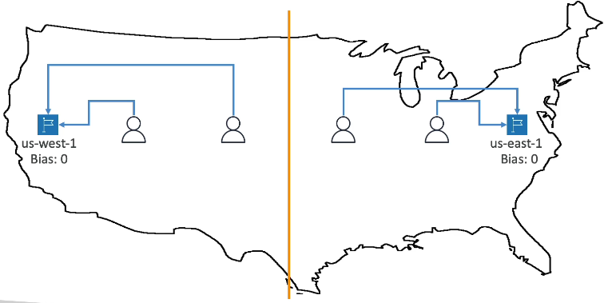

### 📌 **Example:** Positive Bias

Now, let's say you have the same setup: `us-west-1` and `us-east-1`. The bias is set to zero in `us-west-1`, but you set a positive bias of 50 in `us-east-1`.

Since the bias attracts more users and traffic to that resource, the dividing line between the two resources shifts to the left because of the higher bias in `us-east-1`. This means users to the left of the new line still go to `us-west-1`, but more users to the right now go to `us-east-1`.

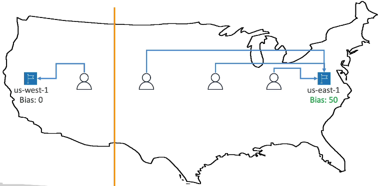

### Why would you do this?

For example, if you have resources around the world and need to shift more traffic to a specific region, you would use a Geoproximity Routing Policy to increase the bias in that region. This attracts more users and traffic to that region.

💡 **Tip:** Geoproximity Routing is helpful when you need to shift traffic from one region to another by increasing the bias.

---

## 16. IP-based Routing

IP-based routing is an intuitive routing policy that defines routing based on client IP addresses. In Route 53, you define a list of CIDRs (IP ranges for your clients) and specify which location the traffic should be sent to based on the CIDR.

The use cases for IP-based routing include:

*   Optimizing performance 🚀 because you know the IP addresses in advance.
*   Reducing network costs 💰 because you know where the IPs are coming from.

📌 **Example:** If you know that a specific internet provider uses a specific CIDR of IP addresses, you can route them to a specific endpoint using this strategy.

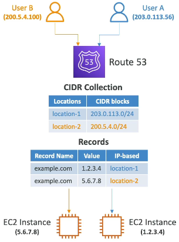

Let's walk through an example:

1.  In Route 53, define two locations with two different CIDR blocks. For instance, one CIDR block starts with `203`, and the other starts with `200`, each defining specific IP ranges.

2.  Link these locations to a specific record. For example, for `example.com`, associate location one (the first CIDR block) with the value `1.2.3.4`, and location two (the second CIDR block) with the value `5.6.7.8`. These values represent the public IPs of two EC2 instances.

    ```
    example.com -> Location 1 (CIDR Block 1) -> 1.2.3.4
    example.com -> Location 2 (CIDR Block 2) -> 5.6.7.8
    ```

3.  Now, if a user (User A) comes in with a specific IP address that falls within the location one CIDR block, they will be directed to the first EC2 instance with IP `1.2.3.4`.

4.  Similarly, if another user (User B) has an IP address that belongs to location two, they will receive a DNS query response that directs them to the EC2 instance with IP `5.6.7.8`.

In summary, IP-based routing is a straightforward method for directing traffic based on the originating IP address.

---

## 17. Multi-Value Routing Policy

The Multi-Value routing policy is used to route traffic to multiple resources. Route 53 will return multiple values or resources in response to a query.

*   You can associate these resources with Health Checks.
*   Only resources associated with a healthy Health Check will be returned.
*   Up to 8 healthy records are returned for each Multi-Value query.

📝 **Note:** While it might seem similar, Multi-Value routing is **not** a substitute for an ELB (Elastic Load Balancer). It provides client-side load balancing.

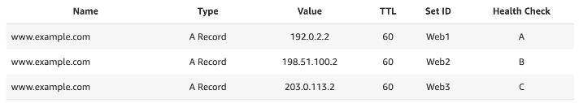

📌 **Example:**

1.  Set up multiple A Records for your domain (e.g., `example.com`).
2.  Associate each A Record with a Health Check.
3.  When a client performs a Multi-Value query, it will receive up to eight healthy records.
4.  The client then chooses one of these records.

By combining Multi-Value routing with Health Checks, you ensure that the client receives only healthy endpoints.

This differs from Simple routing, which doesn't support Health Checks. With Simple routing, a returned resource could be unhealthy. Multi-Value routing offers a more robust solution.

### Testing Multi-Value Records in the UI

Let's walk through creating and testing a Multi-Value record in the Route 53 console.

1.  Create a new record:
    *   Name: `multi.example.com` (replace `example.com` with your domain)
    *   Value: Linked to `us-east-1` (replace with your resource)
    *   Routing policy: Multivalue answer
    *   Health check: `us-east-1` (replace with your health check)
    *   Record ID: `US`
    *   TTL: 60 seconds

2.  Add another record:
    *   Name: `multi.example.com`
    *   Value: Linked to `ap-southeast-1`
    *   Routing policy: Multivalue answer
    *   Health check: `ap-southeast-1`
    *   Record ID: `Asia`
    *   TTL: 60 seconds

3.  Add a third record:
    *   Name: `multi.example.com`
    *   Value: Linked to `eu-central-1`
    *   Routing policy: Multivalue answer
    *   Health check: `eu-central-1`
    *   Record ID: `EU`
    *   TTL: 60 seconds

4.  Create the records.

### Testing the Setup

Use CloudShell to test the Multi-Value record.

1.  Reconnect to CloudShell.
2.  Use the `dig` command to query the record:

    ```bash
    dig multi.example.com
    ```

    Initially, you should see three IP addresses returned, assuming all three health checks are healthy.

3.  Simulate an unhealthy endpoint:
    *   Edit the `eu-central-1` health check.
    *   Enable "Invert health check status." This will make the healthy endpoint appear unhealthy.

4.  Re-run the `dig` command:

    ```bash
    dig multi.example.com
    ```

    You should now see only two IP addresses returned, demonstrating that the Multi-Value routing policy is excluding the unhealthy endpoint.

5.  Revert the health check:
    *   Edit the `eu-central-1` health check.
    *   Disable "Invert health check status."

🎉 The Multi-Value routing policy is now working as expected!

---

## 18. Domain Registrar vs. DNS Service

It's important to understand the distinction between a domain registrar and a DNS service. You can purchase your domain name from any domain registrar you prefer, and you'll typically pay annual charges.

In this course, we've been using the Amazon Registrar through the Route 53 console. However, you're free to use other domain name registrars like GoDaddy or Google Domains.

Usually, when you register a domain with a domain registrar, they also provide a DNS service to manage your DNS records. For example, when we registered a domain name with Amazon, we used a Route 53 hosted zone to manage our DNS records.

However, you're not obligated to use the DNS service provided by your domain registrar.

*   You can register your domain with Amazon Registrar and choose not to use AWS Route 53 for your DNS records.
*   Conversely, you can register your domain with GoDaddy (purchasing `example.com`, for instance) and use Amazon Route 53 to manage your DNS records. This is a perfectly valid setup.

So, how do you configure this?

1.  Register your domain with GoDaddy.
2.  Locate the "name servers" option in your GoDaddy domain settings.
3.  Specify custom name servers.

What values should you enter for the custom name servers?

1.  Go to Amazon Route 53.
2.  Create a public hosted zone for your domain.
3.  In the hosted zone details, find the "name servers" listed on the right-hand side.
4.  These four name servers are what you'll need to update on the GoDaddy website.

When GoDaddy receives a query asking which name server to use for your domain, it will now point to the Amazon Route 53 name servers. This allows you to use Amazon Route 53 to manage all the DNS records from the Route 53 console.

To summarize:

If you buy your domain from a third-party registrar, you can still use Route 53 as your DNS service provider. To do this:

1.  Create a public hosted zone in Route 53.
2.  Update the NS (name server) records on the third-party website where you bought your domain.
3.  Point the NS records to the Route 53 name servers.

📝 **Note:** A domain registrar is distinct from a DNS service, even though domain registrars often include some DNS features.

---

## 19. Route 53 Resolvers & Hybrid DNS

Let’s talk about the **Route 53 Resolver** and how it helps with DNS resolution in AWS.

By default, when you create a Route 53 Resolver in your AWS account, it can:

* ✅ Answer **DNS queries** for **local domain names** of your EC2 instances.
* ✅ Resolve records in your **private hosted zones**.
* ✅ Handle queries for records in your **public name server**.

This means that anything you create under Route 53 will be resolved within your AWS account.

But what if you want a **hybrid DNS setup**? In that case, you want your Route 53 Resolver to also resolve DNS names from your **on-premises network**, and vice versa. Essentially, you’re establishing connectivity between **AWS Cloud DNS** and your **on-premises DNS**.

### Using Resolver Endpoints

To achieve hybrid DNS, AWS provides **Resolver Endpoints**:

* **Inbound Endpoint** → Allows on-premises DNS resolvers to query and resolve AWS resource domain names.
* **Outbound Endpoint** → Allows AWS resources (like EC2 instances) to query and resolve on-premises DNS names.

### How Inbound Endpoints Work

📌 Example:

1. You have a Route 53 Resolver in AWS with a private hosted zone and an EC2 instance.
2. You also have an on-premises data center with its own DNS server.
3. First, you establish **network connectivity** between AWS and your data center (via **VPN** or **Direct Connect**).
4. When an on-premises server makes a DNS query (e.g., a domain in your AWS private hosted zone), the request goes to the **on-premises resolver**.
5. That resolver is configured to forward queries to the **AWS inbound endpoint**.
6. The inbound endpoint passes the query to the Route 53 Resolver, which resolves it.

This forms a full DNS lookup chain from your **on-premises data center → AWS Cloud**.

### How Outbound Endpoints Work

📌 Example:

1. Your EC2 instance in AWS queries a DNS name that belongs to your on-premises network (e.g., `web.onpremise.private`).
2. The query is passed to the **AWS outbound endpoint**.
3. The outbound endpoint forwards the request to your **on-premises DNS resolvers**.
4. The query is resolved successfully by the on-premises infrastructure.

This setup allows **two-way DNS resolution** between AWS and on-premises.

### Key Takeaway

💡 If you want **bidirectional DNS resolution** between your **on-premises data center** and **AWS**, you must configure both:

* 🔹 **Inbound Resolver Endpoint** (on-premises → AWS)
* 🔹 **Outbound Resolver Endpoint** (AWS → on-premises)

That’s the essence of Route 53 Resolver in a hybrid DNS setup!

---

## 20. Cleaning Up Route 53 and AWS Resources 

🧹 To avoid incurring unnecessary costs after working with Route 53 and other AWS resources, follow these steps to clean up your environment.

### Domain Name 🌐

*   The domain name you purchased remains in your account.
*   Renewal costs will be approximately $12 per year, but may vary depending on the domain.

### Hosted Zone 🗺️

*   If you are not actively using your hosted zone, you can delete it to avoid monthly charges.
*   ⚠️ **Warning:** Before deleting the hosted zone, you **must** first empty all the records within it.
*   Otherwise, you will be charged $0.50 per month to keep the hosted zone active.
*   📝 **Note:** The number of records within the hosted zone does not affect the cost, as long as the zone exists.

### EC2 Instances and Application Load Balancer (ALB) ☁️

*   You need to terminate all EC2 instances and delete the ALB in all regions where they were created.
*   📌 **Example:** In this case, EC2 instances were launched in three different regions: Frankfurt, us-east-1, and ap-southeast-1.
*   Follow these steps for each region:
    1.  Terminate the EC2 instance.
    2.  Delete the Application Load Balancer (ALB).
    3.  Delete the target group associated with the ALB.

### Step-by-Step Cleanup Process 🪜

1.  **Frankfurt:**
    *   Terminate the EC2 instance.
    *   Delete the ALB.
    *   Delete the associated target group.
2.  **us-east-1:**
    *   Terminate the EC2 instance & security group.
3.  **ap-southeast-1:**
    *   Terminate the EC2 instance & security group.

### Final Check ✅

After completing these steps, you should not incur any further costs from this lecture.

---

## 21. Q & A

### **Question 3:**

**You have updated a Route 53 Record's `myapp.mydomain.com` value to point to a new Elastic Load Balancer, but it looks like users are still redirected to the old ELB. What is a possible cause for this behavior?**

**Options:**

* 🅐 Because of the Alias record
* 🅑 Because of the CNAME record
* 🅒 Because of the TTL 
* 🅓 Because of Route 53 Health Checks

<details>

<summary>Explanation</summary>

* **TTL (Time To Live)** is a DNS setting that tells DNS resolvers how long to cache a DNS record before checking for updates.
* If the TTL value is **high**, clients and DNS resolvers may continue to use the **old IP address or endpoint** (in this case, the old ELB) even after you've updated the Route 53 record.
* As a result, **DNS propagation is delayed**, and users are still routed to the previous destination.

**Correct Answer:**

**Because of the TTL** ✅ *(Correct)*

**Best practice:**
When planning a DNS change, you can reduce the TTL value beforehand (e.g., to 60 seconds) so the update propagates more quickly when you make the change.

#### **Why Other Options Are Incorrect**

| Option                     | Why It's Not Correct                                                                                           |
| -------------------------- | -------------------------------------------------------------------------------------------------------------- |
| **Alias record**           | Alias records work similarly to CNAMEs and are not the root cause of delayed propagation.                      |
| **CNAME record**           | The record type isn't the issue—the **TTL** is what controls caching duration.                                 |
| **Route 53 Health Checks** | These control **routing based on resource health**, not the delay in pointing to a new ELB after a DNS change. |

</details>

---

Here is the full breakdown of **Question 6** from the image, including the question, all answer choices, the correct answer, and a detailed explanation:

---

### **Question 6:**

**You have purchased a domain on GoDaddy and would like to use Route 53 as the DNS Service Provider. What should you do to make this work?**

**Options:**

* 🅐 Request for a domain transfer
* 🅑 Create a Private Hosted Zone and update the 3rd party Registrar NS records
* 🅒 Create a Public Hosted Zone and update the Route 53 NS records
* 🅓 Create a Public Hosted Zone and update the 3rd party Registrar NS records 

<details>

<summary>Explanation</summary>

When you buy a domain from a third-party registrar like **GoDaddy**, but want to use **Amazon Route 53** as your **DNS service provider**, you must:

1. **Create a Public Hosted Zone** in Route 53 for your domain (e.g., `example.com`).
2. Route 53 will automatically assign **NS (Name Server)** records for your hosted zone.
3. **Copy those NS records** and **paste them into GoDaddy's DNS settings** for your domain, replacing the default name servers.

This tells the global DNS system to delegate DNS resolution for your domain to Route 53.

**Correct Answer:**

**Create a Public Hosted Zone and update the 3rd party Registrar NS records** ✅ *(Correct)*

#### **Why the Other Options Are Incorrect**

| Option                               | Reason It's Incorrect                                                                                              |
| ------------------------------------ | ------------------------------------------------------------------------------------------------------------------ |
| **A. Request for a domain transfer** | Unnecessary — transferring domain ownership is not required to use Route 53 as DNS.                                |
| **B. Private Hosted Zone**           | Used only for internal AWS resources (e.g., within a VPC), not public domains.                                     |
| **C. Update Route 53 NS records**    | Misleading — you **don't update Route 53's NS records**, you update **GoDaddy's NS records** to point to Route 53. |

</details>

---

## Others

### Active-Active vs Active-Passive Failover

You can use Route 53 health checking to configure active-active and active-passive failover configurations. You configure active-active failover using any routing policy (or combination of routing policies) other than failover, and you configure active-passive failover using the failover routing policy.


**Active-Active Failover**

Use this failover configuration when you want all of your resources to be available the majority of the time. When a resource becomes unavailable, Route 53 can detect that it’s unhealthy and stop including it when responding to queries.

In active-active failover, all the records that have the same name, the same type (such as A or AAAA), and the same routing policy (such as weighted or latency) are active unless Route 53 considers them unhealthy. Route 53 can respond to a DNS query using any healthy record.

Hence, Configuring an Active-Active Failover with Weighted routing policy is correct.

**Active-Passive Failover**

Use an active-passive failover configuration when you want a primary resource or group of resources to be available the majority of the time and you want a secondary resource or group of resources to be on standby in case all the primary resources become unavailable. When responding to queries, Route 53 includes only the healthy primary resources. If all the primary resources are unhealthy, Route 53 begins to include only the healthy secondary resources in response to DNS queries.

---
