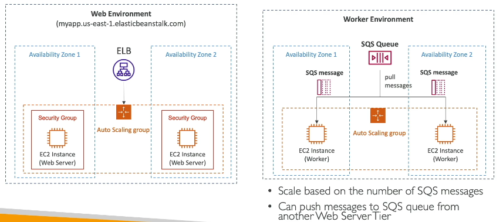
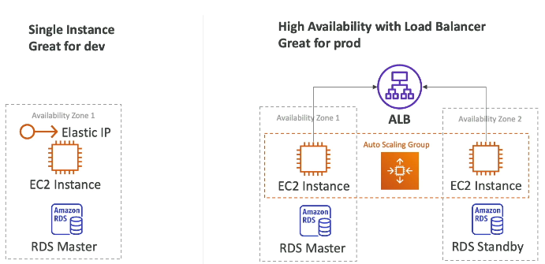

# Classic Solutions Architecture Discussions

Sections:-
- [1. Solution Architectures](#1-solution-architectures)
- [2. WhatIsTheTime.com: A Solution Architecture Journey ⏰](#2-whatisthetimecom-a-solution-architecture-journey-)
- [3. MyClothes.com: Building a Stateful Web Application](#3-myclothescom-building-a-stateful-web-application)
- [4. MyWordPress.com: A Scalable WordPress Website](#4-mywordpresscom-a-scalable-wordpress-website)
- [5. Instantiating Applications Quickly](#5-instantiating-applications-quickly)
- [6. Elastic Beanstalk](#6-elastic-beanstalk)
- [7. Creating Your First Elastic Beanstalk Application](#7-creating-your-first-elastic-beanstalk-application)
- [8. What is the difference between **Service Role** and **EC2 Instance Profile** in AWS Elastic Beanstalk? ❓](#8-what-is-the-difference-between-service-role-and-ec2-instance-profile-in-aws-elastic-beanstalk-)

---

## 1. Solution Architectures

This section focuses on understanding how individual technologies integrate to form comprehensive solution architectures. This is a crucial area to master for the exam.

We will explore solution architecture iteratively through simple case studies. The goal is to become comfortable with how different technologies work together.

We'll cover the following examples:

*   whatisthetime.com
*   myclothes.com
*   mywordpress.com

We will also discuss:

*   How to instantiate applications quickly.
*   Beanstalk.

The progression will be natural and increasingly complex, aiming to provide a good perspective on how various AWS services fit together.

Specifically, we'll examine the relationships between:

*   EC2
*   ELB
*   ASG
*   EBS
*   EFS
*   RDS
*   Elastic... and more.

The aim is to understand how these services work together to create robust and scalable solutions. Let's get started! 🚀

---

## 2. WhatIsTheTime.com: A Solution Architecture Journey ⏰

Let's explore the evolution of a simple application, WhatIsTheTime.com, from a basic setup to a highly available and scalable architecture. This journey highlights the challenges and decisions a solutions architect faces.

### Starting Simple 🐣

Initially, the application is incredibly basic:

*   A single T2 micro EC2 instance.
*   A user asks, "What time is it?" and the server responds.
*   To ensure a consistent IP address after restarts, an Elastic IP is attached.

This setup serves as a Proof of Concept (PoC) and receives positive feedback.

### Vertical Scaling 💪

As the application gains popularity, the T2 micro instance becomes insufficient. The solution? Vertical scaling:

1.  Stop the EC2 instance.
2.  Change the instance type to a larger one, such as M5 large.
3.  Start the instance.

Because of the Elastic IP, the public IP address remains the same. However, this process introduces downtime, impacting user experience.

### Horizontal Scaling (Attempt 1) ↔️

To handle even more traffic, horizontal scaling is attempted:

*   Multiple M5 large EC2 instances are added, each with its own Elastic IP.
*   Users need to be aware of all the Elastic IPs to access the application.

This approach quickly becomes unmanageable due to the increasing number of IPs and infrastructure complexity. ⚠️ **Warning:** There's a limit of five Elastic IPs per region per account by default.

### Horizontal Scaling with Route 53 🗺️

A better approach involves Route 53:

1.  Remove Elastic IPs from the EC2 instances.
2.  Set up a Route 53 A record for `api.whatisthetime.com` with a TTL of one hour.
3.  The A record points to the IP addresses of the EC2 instances.

Now, users query Route 53 to get the IP addresses. This eliminates the need to manage Elastic IPs directly.

However, a problem arises when removing an instance. Users who received the old IP address from Route 53 will experience downtime for up to one hour (the TTL). ⚠️ **Warning:** High TTL values can lead to prolonged downtime during updates.

### Introducing a Load Balancer ⚖️

To address the downtime issue, a load balancer is introduced:

*   EC2 instances are now private.
*   A public-facing Elastic Load Balancer (ELB) is used to distribute traffic.
*   Health checks are configured on the ELB to ensure traffic is only sent to healthy instances.
*   Security Group rules restrict traffic to the EC2 instances, only allowing connections from the ELB.

The Route 53 record is updated to use an Alias record, pointing to the ELB. This allows the ELB to dynamically manage the underlying EC2 instances without impacting users. 🎉 **Benefit:** No downtime during instance updates or removals!

### Auto Scaling Group Integration ⚙️

To automate the management of EC2 instances, an Auto Scaling Group (ASG) is implemented:

*   The ASG manages the private EC2 instances within a single Availability Zone (AZ).
*   The ASG scales instances based on demand, ensuring optimal resource utilization.

This setup provides a stable, load-balanced, and auto-scaling application.

### Multi-AZ Deployment 🌍

To improve resilience, the application is deployed across multiple Availability Zones (AZs):

*   The ELB is configured to span multiple AZs (e.g., AZ 1, AZ 2, and AZ 3).
*   The Auto Scaling Group is also configured to launch instances across multiple AZs.

This ensures that if one AZ goes down, the application remains available in the other AZs. 🎉 **Benefit:** High availability and resilience to failures.

### Cost Optimization with Reserved Instances 💰

To reduce costs, Reserved Instances are used for the minimum capacity of the Auto Scaling Group:

*   Since at least two instances are always required, reserving capacity for these instances provides significant cost savings.
*   Additional instances launched by the ASG can be On-Demand or even Spot Instances for further cost optimization.

### Review of Key Concepts 🧐

*   **Public vs. Private IPs:** Understanding their roles in the architecture.
*   **Elastic IP vs. Route 53 vs. Load Balancer:** Weighing the benefits of each.
*   **Route 53 TTL:** Impact on application availability.
*   **Manual EC2 Instance Management vs. Auto Scaling Groups:** Automation and cost savings.
*   **Multi-AZ Deployment:** Disaster recovery and high availability.
*   **ELB Health Checks:** Ensuring traffic is only sent to healthy instances.
*   **Security Group Rules:** Restricting traffic to the EC2 instances.
*   **Reserved Instances:** Cost optimization for baseline capacity.

This journey demonstrates how a solutions architect iteratively improves an application's architecture to meet evolving requirements, focusing on scalability, availability, resilience, and cost efficiency. 💡 **Tip:** Understanding these trade-offs is crucial for the solutions architect exam.

---

## 3. MyClothes.com: Building a Stateful Web Application

In this lecture, we'll explore how to build a stateful web application, MyClothes.com, that allows users to buy clothes online with a shopping cart. The challenge is to maintain horizontal scalability and keep the web tier as stateless as possible, ensuring users don't lose their shopping carts while navigating the site.

### The Problem: Lost Shopping Carts 🛒

Imagine a user browsing MyClothes.com. The application architecture looks like this:

*   User -> Route 53 -> Multi-AZ ELB -> Autoscaling Group (3 AZ)

The user adds an item to their shopping cart, but the next request is routed to a different EC2 instance. The shopping cart is lost! 😱 This happens repeatedly, leading to a frustrating user experience and lost sales.

### Solution 1: ELB Stickiness (Session Affinity) 🤝

One approach is to enable **ELB stickiness**, a feature that ensures a user's requests are always routed to the same EC2 instance.

*   User -> ELB (with stickiness) -> EC2 Instance A

This solves the immediate problem, but what happens if EC2 Instance A is terminated? The shopping cart is still lost. ⚠️ **Warning:** Stickiness improves the situation but doesn't completely solve the problem of data loss.

### Solution 2: User Cookies 🍪

Instead of storing the shopping cart content on the EC2 instances, we can store it in the user's browser using **web cookies**.

*   The user's browser sends the shopping cart content with every request.

This achieves statelessness because each EC2 instance doesn't need to remember previous interactions. However, there are drawbacks:

*   HTTP requests become heavier as the shopping cart grows.
*   Security risks: Cookies can be altered by attackers. ⚠️ **Warning:** EC2 instances must validate the content of user cookies.
*   Cookie size limitations: Cookies can only store a limited amount of data (less than 4KB).

📝 **Note:** This pattern is used by many web application frameworks.

### Solution 3: Server Sessions with ElastiCache 🚀

A better approach is to use **server sessions**. Instead of sending the entire shopping cart in a cookie, we send only a **session ID**.

*   User -> ELB -> EC2 Instance -> ElastiCache

Here's how it works:

1.  The user sends a request with a session ID.
2.  The EC2 instance uses the session ID to retrieve the shopping cart content from **ElastiCache**.
3.  ElastiCache provides sub-millisecond performance, making this a fast and efficient solution.

📌 **Example:**

```
User adds item -> EC2 instance stores item in ElastiCache with session ID -> Subsequent requests use session ID to retrieve cart.
```

An alternative to ElastiCache is **DynamoDB**.

This approach is more secure because ElastiCache is the source of truth, and attackers cannot easily modify its contents.

### Storing User Data with RDS 🗄️

For long-term storage of user data (address, name, etc.), use **RDS**.

*   EC2 instances can directly access RDS to store and retrieve user data.

This provides a durable and accessible solution for user information.

### Scaling Reads with RDS Read Replicas 📚

As your application grows, you'll need to scale reads. Use **RDS Read Replicas**.

*   The RDS Master handles writes.
*   Read Replicas handle reads, scaling the read capacity of your database.
*   You can have up to 15 Read Replicas.

### Lazy Loading with ElastiCache 😴

Another way to scale reads is to use **lazy loading** with ElastiCache.

1.  An EC2 instance checks ElastiCache for the requested data.
2.  If the data is not in the cache (cache miss), it reads the data from RDS and stores it in ElastiCache.
3.  Subsequent requests for the same data (cache hit) are served directly from ElastiCache.

This reduces traffic to RDS and improves performance. ⚠️ **Warning:** Requires cache maintenance.

### Disaster Recovery with Multi-AZ 🛡️

To ensure your application survives disasters, implement a **Multi-AZ** architecture.

*   Route 53: Highly available by default.
*   ELB: Multi-AZ.
*   Autoscaling Group: Multi-AZ.
*   RDS: Multi-AZ with a standby replica.
*   ElastiCache: Multi-AZ (using Redis).

This ensures your application can survive an Availability Zone outage.

### Security Groups 🔒

Implement tight security using security groups.

*   ALB: Open HTTP/HTTPS traffic from anywhere.
*   EC2 instances: Restrict traffic to the load balancer.
*   ElastiCache: Restrict traffic to the EC2 security group.
*   RDS: Restrict traffic to the EC2 security group.

### Architecture Summary 📝

*   **ELB Sticky Sessions:** Route user requests to the same instance.
*   **Web Clients (Cookies):** Store shopping cart data in the user's browser.
*   **Server Sessions (ElastiCache/DynamoDB):** Store session data on the server.
*   **RDS:** Store durable user data.
*   **RDS Read Replicas:** Scale reads.
*   **Multi-AZ:** Disaster recovery.
*   **Security Groups:** Tighten security.

This is a three-tier architecture (client, web, database) and a very common pattern for web applications. While it may increase costs, it provides good trade-offs for scalability, availability, and security.

---

## 4. MyWordPress.com: A Scalable WordPress Website

This lecture explores how to create a fully scalable WordPress website on AWS. WordPress is a popular platform, and deploying it on AWS offers flexibility and control. We'll cover storing user data, blog content, and, importantly, handling picture uploads so they are accessible across all instances. The goal is to achieve global scalability.

### Database Layer with RDS or Aurora

The first step is setting up the database layer. A common approach is to use RDS with Multi-AZ for high availability.

*   RDS in the backend
*   Multi-AZ setup

However, for improved scalability and reduced operational overhead, consider using Aurora MySQL.

*   Aurora MySQL offers Multi-AZ and read replicas.
*   Global databases are an option for further scaling.
*   💡 **Tip:** Aurora can simplify operations and facilitate easier upgrades.

The choice between RDS and Aurora depends on your specific needs and priorities as a solutions architect.

### Storing Images: EBS vs. EFS

Let's examine how to store images effectively, especially when scaling.

#### Single Instance with EBS

In a simple setup with one EC2 instance and one EBS volume, image storage is straightforward.

1.  User uploads an image.
2.  Image is stored on the attached EBS volume.
3.  Image retrieval is also from the same EBS volume.

This works well for a single instance.

#### Scaling Issues with EBS

The problem arises when you scale to multiple EC2 instances across different Availability Zones (AZs), each with its own EBS volume.

1.  An image is uploaded to one instance and stored on its EBS volume.
2.  If a user tries to access that image through a different instance, it won't be found because the EBS volumes are not shared.

⚠️ **Warning:** EBS volumes are not shared across instances, leading to inconsistent image access in a scaled environment.

#### Solution: EFS (Elastic File System)

EFS provides a network file system (NFS) that allows shared storage across multiple EC2 instances.

1.  EFS creates Elastic Network Interfaces (ENIs) in each AZ.
2.  EC2 instances use these ENIs to access the shared EFS drive.
3.  When an image is uploaded, it's stored in EFS.
4.  Any instance can then retrieve the image from EFS.

This ensures that all instances have access to the same files, regardless of their AZ or instance count.

### EBS vs. EFS: Trade-offs

*   Aurora Database: Less operations, Multi-AZ, and read replicas.
*   EBS: Works great for single-instance applications.
*   EFS: Suitable for distributed applications across multiple AZs.

Cost is a significant factor. EBS is generally cheaper than EFS. However, EFS offers advantages in scalability and data consistency for multi-instance setups.

💡 **Tip:** As a solutions architect, carefully weigh the trade-offs between cost and functionality when choosing between EBS and EFS. Understand the cost implications of your decisions.

📝 **Note:** EFS is a common way of scaling website storage across many different EC2 instances to allow them all to have access to the same files regardless of their availability zone and how many instances we have.

---

## 5. Instantiating Applications Quickly

When launching a full-stack application, the time it takes to install applications, restore data, and configure everything can be significant. ⏳ Let's explore how to leverage the cloud to speed up this process.

### EC2 Instances

*   **Golden AMI:**
    *   A golden AMI is a pre-configured Amazon Machine Image (AMI) with your applications, OS dependencies, and other necessary components already installed. 📦
    *   Launch future EC2 instances directly from this golden AMI.
    *   Benefit: Avoid reinstalling applications and dependencies each time, resulting in faster startup times. 🚀
    *   💡 **Tip:** Golden AMIs are a common and efficient pattern in cloud environments.
*   **User Data:**
    *   User data allows you to bootstrap (configure) an instance when it first starts. ⚙️
    *   Bootstrapping can involve installing applications and OS dependencies, but this can be slow if repeated for each instance.
    *   Use user data for dynamic configurations, such as retrieving database URLs and passwords. 🔑
    *   💡 **Tip:** Combine a golden AMI with user data for a hybrid approach. The AMI provides the base configuration, and user data handles dynamic settings.
    *   📌 **Example:** Elastic Beanstalk uses this hybrid approach, reconfiguring an AMI and adding user data.

### RDS Databases

*   Restore your RDS databases from snapshots. 📸
*   Benefit: The database will have the schemas and data ready, which is much faster than running large insert statements. ⚡

### EBS Volumes

*   Restore EBS volumes from snapshots. 💾
*   Benefit: Avoid starting with an empty, unformatted disk. The snapshot will already be formatted and contain the necessary data. ✅

### Key Takeaways for Solutions Architects

When designing solutions, consider these methods to speed up the instantiation of applications and infrastructure:

1.  Use golden AMIs and user data for EC2 instances. ☁️
2.  Restore RDS databases from snapshots. 🗄️
3.  Restore EBS volumes from snapshots. 📦

By using these techniques, you can significantly reduce the time it takes to deploy and configure your applications in the cloud. ⏱️

---

## 6. Elastic Beanstalk

So far, when deploying applications, we've used a consistent architecture: a load balancer distributing requests to an auto-scaling group across multiple availability zones, each with EC2 instances. The backend often includes data subnets with an RDS database (potentially with replicas) and ElastiCache for caching.

Deploying many applications with the same architecture can become repetitive and complex. Managing infrastructure, deploying code, and configuring databases, load balancers, and scaling can be challenging for developers.

Most web applications share a similar architecture with a load balancer and auto-scaling group. Developers primarily want their code to run without worrying about the underlying infrastructure. 💡 **Tip:** Elastic Beanstalk simplifies this process.

Beanstalk provides a developer-centric approach to deploying applications on AWS. It leverages existing components like EC2, ASG, ELB, and RDS as a managed service, handling capacity provisioning, load balancer configuration, scaling, application health monitoring, and instance configuration.

As a developer, your main focus is the code. You retain full control over the configuration of each component, but they are bundled into a single interface within Beanstalk. Beanstalk also offers a convenient way to update applications.

The Beanstalk service itself is free, but you pay for the underlying resources it uses, such as EC2 instances, ASG, and ELB.

### Beanstalk Components

Beanstalk consists of the following components:

*   **Application:** A collection of Beanstalk components, including environments, versions, and configurations.
*   **Version:** An iteration of your application code (e.g., version one, version two, version three).
*   **Environment:** A collection of resources running a specific application version. An environment can only run one application version at a time, but you can update the application version within an environment (e.g., from version one to version two).
*   **Tiers:**
    *   Web server environment tier
    *   Worker environment tier

You can create multiple environments in Beanstalk, such as dev, test, and prod.

### Beanstalk Workflow

The typical workflow involves these steps:

1.  Create an application.
2.  Upload a version.
3.  Launch an environment.
4.  Manage the environment lifecycle.
5.  To iterate, upload a new version and deploy it to the environment to update the application stack.

### Supported Programming Languages

Beanstalk supports a wide range of programming languages and platforms, including:

*   Go
*   Java SE
*   Java with Tomcat
*   .NET Core on Linux
*   .NET on Windows Server
*   Node.js
*   PHP
*   Python
*   Ruby
*   Packer Builder
*   Single Docker Container
*   Multi Docker Container
*   Pre-configured Docker

Beanstalk aims to support the deployment of virtually any application.

### Web Tier vs. Worker Tier

*   **Web Tier:** This is the traditional architecture with a load balancer distributing traffic to an auto-scaling group of EC2 instances acting as web servers.
*   **Worker Tier:** In this architecture, clients don't directly access EC2 instances. Instead, an SQS queue is used. Messages are sent to the SQS queue, and EC2 instances (workers) pull messages from the queue for processing. The worker environment scales based on the number of messages in the SQS queue.

You can combine the web and worker environments by having the web environment push messages into the SQS queue of the worker environment.



### Deployment Modes

There are two main deployment modes:

1.  **Single Instance:** Suitable for development purposes. It involves a single EC2 instance with an Elastic IP. It can also launch an RDS database.
2.  **High Availability with Load Balancer:** Ideal for production environments. It uses a load balancer to distribute traffic across multiple EC2 instances managed by an auto-scaling group in multiple availability zones. It may also include a multi-AZ RDS database with a master and standby.



---

## 7. Creating Your First Elastic Beanstalk Application

Let's practice using the Elastic Beanstalk service. We'll walk through creating a simple web application.

1.  Navigate to the Elastic Beanstalk console.
2.  Click on **Create Application**.

You'll be presented with two environment options:

*   Web server environment: 🌐 Choose this to run a website. ✅
*   Worker environment: ⚙️ Choose this to process tasks off of a queue.

For this example, we'll select **Web server environment**.

### Application and Environment Setup

1.  **Application Name:** Enter `MyApplication`.
2.  **Environment Information:**
    *   **Environment Name:** `MyApplication-dev` (This represents the development environment).
    *   A Domain name will be automatically generated for accessing your web servers. However, you can specify the sub-domain name (case to the availability). It will have domain `___.us-east-1.elasticbeanstalk.com` for the `us-east-1` region.

### Platform Selection

1.  **Platform:** Choose a managed platform.
2.  **Platform Type:** Select `Node.js`.
3.  Use the default options for the Node.js version. 💡 **Tip:** Using the latest defaults should work fine.
4.  **Application Code:** Select **Sample application**. 📝 **Note:** This sample application will match the chosen environment.

### Configuration Presets

Beanstalk configuration can be complex. To simplify things, choose a preset:

*   Single instance (free tier eligible)
*   High availability (with a load balancer)
*   Custom configuration

For this example, select **Single instance**. ✅

### Service Access Configuration

This is a crucial step involving IAM roles.

1.  **Service Role:** Create a new Service role. This will create `elasticbeanstalk-service-role`.
2.  **EC2 Instance Profile:** This might not be pre-filled due to a console bug. If it's not, you need to manually create an EC2 Instance profile in the IAM console.

#### Manually Creating the EC2 Instance Profile

1.  Go to the IAM console.
2.  On the left, click on **Roles** and then **Create role**.
3.  Select **AWS service** as the trusted entity type.
4.  Choose **EC2** as the service that will use this role.
5.  Click **Next**.
6.  For Permissions policy, filter by `beanstalk`.
7.  Select the following policies:
    *   `AWSElasticBeanstalkWebTier`
    *   `AWSElasticBeanstalkWorkerTier`
    *   `AWSElasticBeanstalkMulticontainerDocker`
8.  Click **Next**.
9.  **Role name:** Enter `aws-elasticbeanstalk-ec2-role` (with hyphens).
10. Click **Create role**.

Now, go back to the Beanstalk console, refresh the EC2 instance profile dropdown, and select the newly created role (`aws-elasticbeanstalk-ec2-role`).

### Review and Launch

1.  Click **Skip to review** ✅ to use the default settings for the single instance mode.
2.  Ensure the **Service role** and **EC2 instance profile** are selected under Service access.
3.  Click **Submit** to create your first Beanstalk environment.

### Monitoring the Deployment

*   Under the **Events** tab, you can see the deployment progress. These events come from CloudFormation.
*   You can also go to the CloudFormation console to see the Elastic Beanstalk stack being created.
*   Under CloudFormation's **Events** tab, you'll see the status of each resource (e.g., `CREATE_IN_PROGRESS`, `CREATE_COMPLETE`).
*   Under CloudFormation's **Resources** tab, you can see the created resources (e.g., Autoscaling group, LaunchConfiguration, Elastic IP).
*   Under CloudFormation's **Template** tab, you can view the template in Application Composer to visualize the created infrastructure.

### Verifying the Resources

After the deployment completes, you can verify the resources in the EC2 console:

*   **Instances:** You should see one running EC2 instance (e.g., a t3.micro instance).
*   **Elastic IPs:** An Elastic IP address should be created and associated with the EC2 instance.
*   **Auto Scaling Groups:** An Auto Scaling group should be created, managing the EC2 instance.

### Accessing the Application

Once the environment health is "Ok," you'll have a domain name (e.g., `http://myapplication-env.eba-pnrdnm67.us-east-1.elasticbeanstalk.com/`). Click on it to access your running application. You should see a "Congratulations" message indicating that Elastic Beanstalk is running on the EC2 instance. 🎉

### Exploring Beanstalk Features

*   **Upload and Deploy:** You can upload new versions of your code, and Beanstalk will automatically deploy them.
*   **Health:** Provides health check information for your instances.
*   **Logs:** Allows you to view application logs.
*   **Monitoring:** Shows metrics for your application.
*   **Configuration:** Lets you view and modify the configuration of your Beanstalk environment.

### Managing Environments

You can create multiple environments for your application (e.g., `MyApplication-prod` for production). This allows you to manage different stages of your application lifecycle.

### Beanstalk vs. CloudFormation

*   Beanstalk is centered around code and environments.
*   CloudFormation is used to deploy arbitrary stacks with any kind of infrastructure. Beanstalk uses CloudFormation behind the scenes.

### Cleanup

⚠️ **Warning:** If you're continuing with more Beanstalk lectures, do not delete your application.

If you're done with Beanstalk and have learned enough for the exam:

1.  Go to your application in the Beanstalk console.
2.  Click **Action**.
3.  Select **Delete application**.

This will clean up all the resources created by Beanstalk.

---

## Q & A

8. What is the difference between **Service Role** and **EC2 Instance Profile** in AWS Elastic Beanstalk? ❓

<details>

<summary>Explanation</summary>

### ✅ Answer:

**1. Service Role (Elastic Beanstalk Service Role)**

* This is an **IAM role** that Elastic Beanstalk itself assumes.
* It allows Elastic Beanstalk to **manage AWS resources** on your behalf.
* Example tasks:

  * Creating Auto Scaling groups
  * Managing Load Balancers
  * Monitoring logs and metrics in CloudWatch
  * Deploying and updating environments

📌 **Example Policy Permissions**:

* `elasticbeanstalk.amazonaws.com`
* `autoscaling:*`
* `elasticloadbalancing:*`
* `cloudwatch:*`

**2. EC2 Instance Profile (Instance Role)**

* This is an **IAM role attached to the EC2 instances** running inside the Elastic Beanstalk environment.
* It provides permissions to the **application code running on the instances**.
* Example tasks:

  * Reading/Writing to S3
  * Accessing DynamoDB or RDS
  * Sending messages to SQS
  * Writing logs to CloudWatch

📌 **Example Policy Permissions**:

* `s3:GetObject`
* `s3:PutObject`
* `dynamodb:Query`
* `logs:CreateLogStream`

### 📝 Summary:

* **Service Role →** Used by Elastic Beanstalk service itself to manage infrastructure.
* **Instance Profile →** Used by the EC2 instances to allow your **application** to access AWS services.

</details>

---
