# AWS S3 Advance

Sections:-
- [1. Moving Objects Between Storage Classes](#1-moving-objects-between-storage-classes)
- [2. Creating Lifecycle Rules for S3 Buckets](#2-creating-lifecycle-rules-for-s3-buckets)
- [3. S3 Requester Pays](#3-s3-requester-pays)
- [4. S3 Event Notifications](#4-s3-event-notifications)
- [5. S3 Event Notifications](#5-s3-event-notifications)
- [6. S3 Baseline Performance](#6-s3-baseline-performance)
- [7. S3 Batch Operations](#7-s3-batch-operations)
- [8. S3 Storage Lens](#8-s3-storage-lens)
- [9. Q & A](#9-q--a)

---

## 1. Moving Objects Between Storage Classes

It's possible to transition objects between different S3 storage classes. Here's a summary of how:

*   You can move objects from Standard to Standard IA, Intelligent Tiering, or One-Zone IA.
*   From One-Zone IA, you can move to Flexible Retrieval or Deep Archive.
*   All possible transitions are shown in the AWS documentation.

If you know your objects will be infrequently accessed, move them to Standard IA. For archiving, move them to Glacier tiers or Deep Archive.

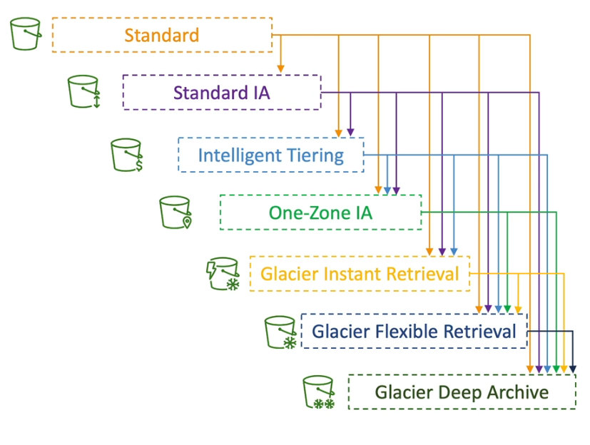

### Automating Object Transitions with Lifecycle Rules

Object transitions can be automated using lifecycle rules. These rules consist of:

1.  **Transition Actions:** Configure objects to transition to another storage class. 📌 **Example:** Move to Standard IA after 60 days or to Glacier after six months.
2.  **Expiration Actions:** Configure objects to be deleted after a specified time. 📌 **Example:** Delete access logs after 365 days, delete old file versions (if versioning is enabled), or delete incomplete multipart uploads older than two weeks.

Lifecycle rules can be specified for:

*   Entire buckets.
*   Specific paths within buckets (using a prefix). Example: `s3://my-bucket/mp3/*`
*   Specific object tags. 📌 **Example:** Apply a rule only to the "finance" department.

### Scenarios and Design Considerations

📌 **Example:** An EC2 application creates thumbnails after profile photos are uploaded to S3. Thumbnails can be recreated easily and only need to be kept for 60 days. Source images should be immediately retrievable for 60 days, after which users can wait up to six hours.

Here's a possible design:

*   S3 source images: Standard class with a lifecycle configuration to transition to Glacier after 60 days.
*   Thumbnails: One-Zone IA (infrequently accessed, easily recreated) with a lifecycle configuration to expire/delete after 60 days. Use a prefix to differentiate between source images and thumbnails.

📌 **Example:** A company rule requires immediate recovery of deleted S3 objects for 30 days, followed by recovery within 48 hours for up to 365 days.

Solution:

1.  Enable S3 versioning to keep object versions (deleted objects are hidden by delete markers).
2.  Create a rule to transition non-current versions to Standard IA.
3.  Transition non-current versions to Glacier Deep Archive for archival purposes.

### Determining Optimal Transition Times with S3 Analytics

Amazon S3 Analytics can help determine the optimal number of days to transition objects between storage classes.

*   It provides recommendations for Standard and Standard IA.
*   It does not work with One-Zone IA or Glacier.
   
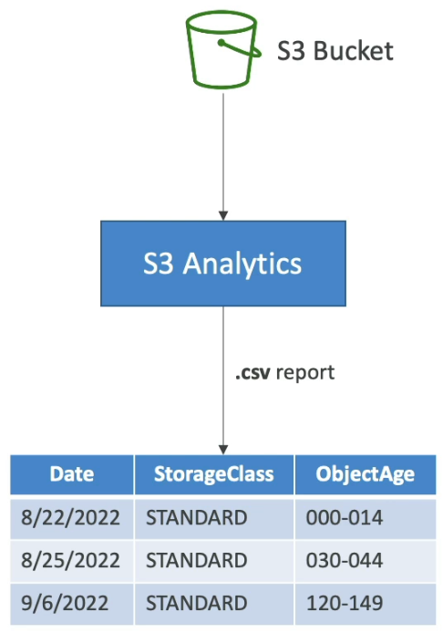

How it works:

1.  S3 Analytics runs on top of S3 buckets.
2.  It generates a CSV report with recommendations and statistics.
3.  The report is updated daily.
4.  It takes 24-48 hours to start seeing data analysis.

💡 **Tip:** Use the CSV report as a starting point to create or improve lifecycle rules.

---

## 2. Creating Lifecycle Rules for S3 Buckets

Let's create a lifecycle rule for our S3 buckets to automate object management.

1.  Navigate to **Management** in your S3 bucket.
2.  Click on **Create lifecycle rule**.
3.  Give your rule a name. 📌 **Example:** `demo rule`.
4.  Apply the rule to all objects in the bucket.
5.  Acknowledge the application of the rule.

We now have five different rule actions available:

*   Move current versions of objects between storage classes.
*   Move non-current versions of objects between storage classes.
*   Expire current versions of objects.
*   Permanently delete non-current versions of objects.
*   Delete expired objects, delete markers, or incomplete multi-part uploads.

Let's examine each of these actions in detail.

### Moving Current Version Objects Between Storage Classes 📦

This action applies to versioned buckets. The "current version" is the most recent version displayed to users.

📌 **Example:** Transitioning objects through different storage tiers:

*   Transition to Standard IA after 30 days.
*   Transition to Intelligent-Tiering after 60 days.
*   Transition to Glacier Instant Retrieval after 90 days.
*   Transition to Glacier Flexible Retrieval after 180 days.
*   Transition to Deep Archive after 365 days.

You can define as many transitions as needed.

### Moving Non-Current Versions of Objects Between Storage Classes 🗑️

This action applies to objects that have been overridden by newer versions.

📌 **Example:** Moving non-current objects to Glacier Flexible Retrieval after 90 days, assuming they are no longer needed for retrieval.

You can add multiple transitions for non-current versions as well.

### Expiring Current Versions of Objects ⏳

You can set a timeframe after which current versions of objects will expire.

📌 **Example:** Expire current versions of objects after 700 days.

### Permanently Deleting Non-Current Versions of Objects ❌

You can set a timeframe after which non-current versions of objects will be permanently deleted.

📌 **Example:** Permanently delete non-current versions of objects after 700 days.

### Reviewing Transitions and Expiration Actions 🗓️

The console provides a timeline view showing what will happen to both current and non-current versions of your objects based on the defined rules.

If you are satisfied with the configuration, create the rule. The rule will then automatically manage your objects in the background.

Now you know how to automate moving objects in AWS S3 between different storage classes! 🚀

---

## 3. S3 Requester Pays

This is a feature that might appear on the exam. S3 Requester Pays is a straightforward concept.

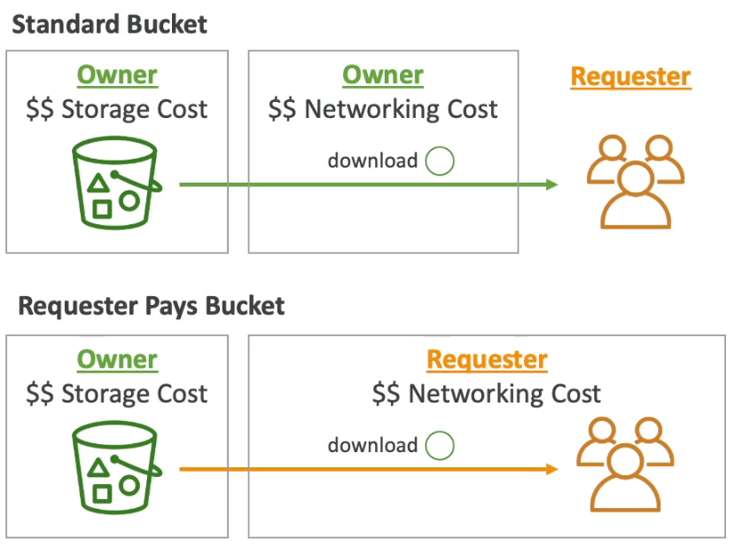

Normally, bucket owners pay for:

*   💰 Amazon S3 storage
*   🌐 Data transfer costs associated with their buckets

📌 **Example:**

1.  You have a bucket with objects stored in it.
2.  A user (requester) downloads a file from your bucket.
3.  The networking cost is billed to the bucket and object owner.

However, if you have large files that customers frequently download, you might want to enable Requester Pays buckets.

In this case:

*   The requester pays for the data download of the objects, not the bucket owner.

📌 **Example:**

1.  The owner pays for the storage costs of the objects in the bucket.
2.  The requester downloads the object.
3.  The requester pays for the networking costs associated with that download.

This is particularly useful when sharing large datasets with other AWS accounts.

📝 **Note:** The requester *must* be authenticated in AWS.

Why? Because AWS needs to know who to bill for the object download. If the requester is authenticated, AWS can accurately bill them for the data transfer.

💡 **Tip:** Remember this feature! It could appear in a scenario-based question on the exam.

---

## 4. S3 Event Notifications

S3 Event Notifications allow you to react automatically to events happening in your Amazon S3 buckets.

### What are S3 Events? 🤔

Events in S3 include:

*   Object creation (S3:ObjectCreated)
*   Object removal (S3:ObjectRemoved)
*   Object restoration (S3:ObjectRestored)
*   Replication events (S3:Replication:*)
*   Lifecycle events (S3:Lifecycle:*)
*   Put events (S3:ObjectCreated:Put)
*   Copy events (S3:ObjectCreated:Copy)
*   Delete events (S3:ObjectRemoved:Delete)
*   Restore events (S3:ObjectRestored:Restore)

You can also filter these events. 📌 **Example:** You might only want to consider objects with a `.JPEG` extension.

### Use Cases 🚀

A common use case is automatically reacting to events in S3. 📌 **Example:** Generating thumbnails for images uploaded to S3.

### Destinations for Event Notifications 🎯

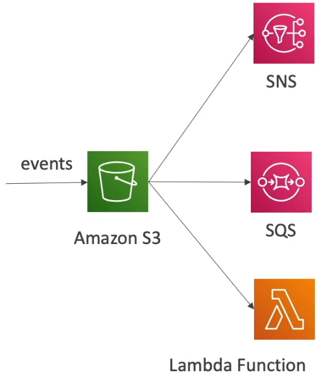

You can send S3 Event Notifications to the following destinations:

*   SNS Topic
*   SQS Queue
*   Lambda Function
*   Amazon EventBridge

📝 **Note:** We'll cover SNS, SQS, Lambda, and EventBridge in more detail later.

You can create as many S3 event notifications as you need and send them to the desired targets. Events are typically delivered within seconds, but it can sometimes take a minute or longer.

### IAM Permissions 🔑

IAM permissions are crucial for S3 Event Notifications to function correctly.

*   S3 needs permission to send data to SNS topics and SQS queues, and to invoke Lambda functions.
*   Instead of using IAM roles for S3, we define resource access policies on the destination services.
   
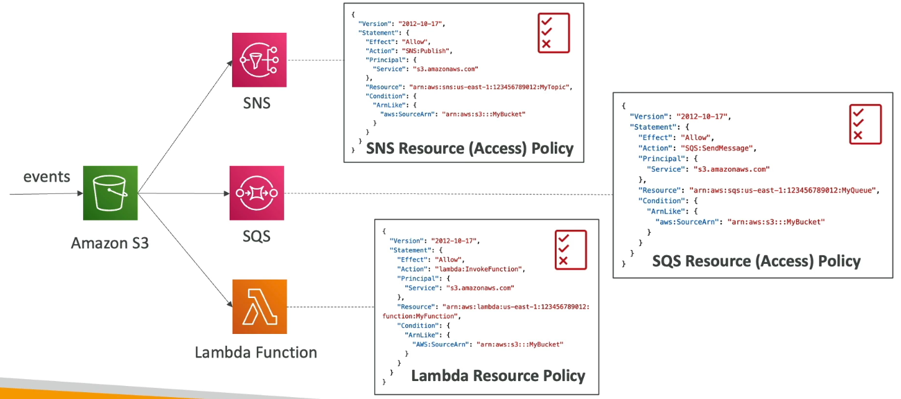

Here's how it works for each destination:

*   **SNS:** Attach an SNS resource access policy to the SNS topic. This allows the S3 bucket to send messages directly to the topic.
*   **SQS:** Create an SQS resource access policy that authorizes the S3 service to send data to the SQS queue.
*   **Lambda:** Attach a Lambda resource policy to the Lambda function, granting Amazon S3 the permission to invoke the function.

These resource access policies function similarly to S3 bucket policies.

### Amazon EventBridge Integration 🌉

All S3 events are sent to Amazon EventBridge, regardless of other configured destinations. From EventBridge, you can set up rules to route these events to over 18 different AWS services.

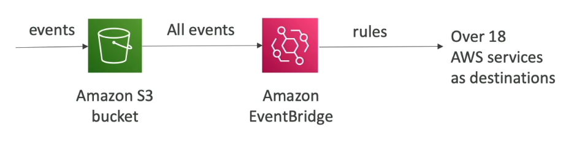

EventBridge enhances S3 Event Notification capabilities with:

*   Advanced filtering options (metadata, object size, name)
*   Ability to send to multiple destinations simultaneously
*   Integration with services like Step Functions, Kinesis Data Streams, and Firehose
*   Features like event archiving, event replay, and more reliable delivery

### Summary 📝

React to events happening in Amazon S3 by sending notifications to SQS, SNS, Lambda, or Amazon EventBridge.

---
 
## 5. S3 Event Notifications - Hands On

Let's explore how to set up S3 Event Notifications. This allows you to trigger actions based on events happening in your S3 bucket, such as object creation.

First, we need to create an S3 bucket.

1.  Go to the S3 service in the AWS Management Console.
2.  Click on "Create bucket".
3.  Give your bucket a unique name (e.g., "events-notifications-<account_id>").
4.  Choose a region.
5.  Create the bucket.

Now that the bucket is created, let's configure event notifications:

1.  Navigate to your newly created bucket.
2.  Go to the "Properties" tab.
3.  Scroll down to "Event notifications".

You'll see two sections:

*   Create an event notification.
*   Enable Amazon EventBridge integration.

The EventBridge integration allows you to send all events from the S3 bucket to EventBridge for more complex routing and processing.  We'll focus on the simpler approach of creating a direct event notification.

1.  Click on "Create event notification".
2.  Give the event notification a name (e.g., "DemoEventNotification").
3.  Optionally, specify a prefix or suffix to filter events based on object names.
4.  Choose the event types you want to react to. 📌 **Example:**  Select "All object create events" to trigger an event whenever an object is created in the bucket. You can also select object removals, restores, and other events.
5.  Select the destination to publish the event to. You have three options:
    *   Lambda Function
    *   SNS Topic
    *   SQS Queue

We'll use an SQS queue for this demonstration. However, we need to create the queue first and grant S3 permission to publish messages to it.

1.  Go to the SQS service in the AWS Management Console.
2.  Click on "Create queue".
3.  Give your queue a name (e.g., "DemoS3Notification").
4.  Create the queue.

Now, let's try to configure the S3 event notification to use the new SQS queue.

1.  Go back to the S3 event notification configuration.
2.  Refresh the page to see your queue appear in the dropdown.
3.  Select your SQS queue ("DemoS3Notification").
4.  Try to save the changes.

You might encounter an error. ⚠️ **Warning:** This is because S3 doesn't yet have permission to send messages to the SQS queue.

To fix this, we need to modify the SQS queue's access policy:

1.  Go to the SQS queue in the AWS Management Console.
2.  Click on "Edit" under "Access policy".
3.  Use the Policy Generator to create a policy that allows S3 to send messages to the queue.
    *   Select "SQS Queue Policy".
    *   Set the effect to "Allow".
    *   Choose "SendMessage" as the action.
    *   Paste the ARN of your SQS queue.
    *   Add the statement and generate the policy.
4.  Copy the generated policy.
5.  Paste the policy into the SQS queue's access policy.
6.  Save the changes.

```json
{
  "Version": "2012-10-17",
  "Statement": [
    {
      "Sid": "AllowS3ToSendMessages",
      "Effect": "Allow",
      "Principal": "*",
      "Action": "sqs:SendMessage",
      "Resource": "arn:aws:sqs:YOUR_REGION:YOUR_ACCOUNT_ID:DemoS3Notification"
    }
  ]
}
```

📝 **Note:**  This policy is very permissive and allows anyone to send messages to your SQS queue. In a production environment, you should restrict the `Principal` to only allow your S3 bucket to send messages.

Now, go back to the S3 event notification configuration and try to save the changes again. It should now succeed.

To verify that the event notification is working, S3 sends a test event to the SQS queue.

1.  Go to the SQS queue in the AWS Management Console.
2.  Click on "Send and receive messages".
3.  Click on "Poll for messages".

You should see a message from Amazon S3 indicating a test event.  You can delete this message.

Now, let's test the event notification with a real object upload.

1.  Go to your S3 bucket.
2.  Upload a file (e.g., "coffee.jpg").
3.  Go back to the SQS queue.
4.  Poll for messages.

You should see a new message in the queue.  This message contains information about the object creation event.

If you examine the message, you'll find details like:

*   `eventName`: "ObjectCreated:Put"
*   `key`: "coffee.jpg"

This demonstrates that the S3 Event Notification is working correctly and sending messages to the SQS queue whenever an object is created.

You can now use this event to trigger other actions, such as creating a thumbnail of the uploaded image.

In summary, S3 Event Notifications allow you to react to events happening in your S3 bucket. You can send these events to:

*   SQS Queues
*   SNS Topics
*   Lambda Functions
*   Amazon EventBridge

This enables you to build event-driven applications that respond to changes in your S3 storage. 

💡 **Tip:** Remember to configure the correct permissions to allow S3 to publish messages to your chosen destination.

---

## 6. S3 Baseline Performance

Amazon S3 is designed to automatically scale to handle a very high number of requests with low latency. Here's a breakdown of its baseline performance and optimization techniques.

### S3 Performance Basics

*   Latency: Expect between 100 and 200 milliseconds to get the first byte from S3.
*   Request Limits
    *   3,500 PUT/COPY/POST/DELETE requests per second per prefix in a bucket OR
    *   5,500 GET/HEAD requests per second per prefix in a bucket.

### Understanding "Per Prefix"

It's crucial to understand what "per prefix" means in the context of S3 performance. A prefix is essentially the path within your bucket leading to your object. There are no limits to the number of prefixes in your bucket.

📌 **Example:**

Here's a breakdown of the prefixes for each object:

| Object | Prefix |
| --- | --- |
| `folder1/sub1/file.txt` | `folder1/sub1/` |
| `folder1/sub2/file.txt` | `folder1/sub2/` |
| `folder2/sub1/file.txt` | `folder2/sub1/` |
| `folder2/sub2/file.txt` | `folder2/sub2/` |

Each of these prefixes can handle 3,500 PUTs and 5,500 GETs per second.

Therefore, if you evenly distribute reads across these four prefixes, you can achieve 22,000 GET/HEAD requests per second (5,500 requests/prefix * 4 prefixes).

### Optimizing S3 Performance

Here are several ways to optimize S3 performance:

1.  **Multi-Part Upload 🚀**

    *   💡 **Tip:** Recommended for files over 100 MB and *required* for files over 5 GB.
    *   How it works: Divides the file into smaller parts and uploads them in parallel.
    *   Benefit: Speeds up transfers by maximizing bandwidth utilization.

    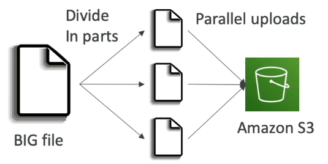

    📌 **Example:**

    Imagine uploading a large video file. Instead of sending the entire file as one large chunk, multi-part upload breaks it down:

    ```
    [Part 1] --> S3
    [Part 2] --> S3
    [Part 3] --> S3
    ...
    [Part N] --> S3
    ```

    S3 then reassembles the parts into the complete file.

2.  **S3 Transfer Acceleration 🚀**

    *   Use case: Speeds up uploads and downloads.
    *   How it works: Transfers files to an AWS edge location, which then forwards the data to the S3 bucket in the target region over the AWS private network.
    *   Benefit: Minimizes the use of the public internet, leveraging the faster AWS private network.
    *   📝 **Note:** Compatible with multi-part upload.

     📌 **Example:**

    Uploading a file from the USA to an S3 bucket in Australia:

    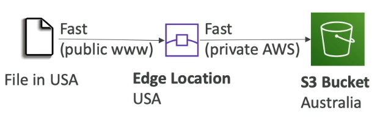

    - Your File in USA
    - Edge Location in USA
    - Upload to the Edge Location through the Public Internet
    - AWS Private Network
    - S3 Bucket in Australia
    - Transfer data through the AWS Private Network.

3.  **S3 Byte Range Fetches 🚀**

    *   Use case: Parallelizes GET requests by retrieving specific byte ranges of a file.
    *   Benefits:
        *   Speeds up downloads.
        *   Improves resilience: If a byte range request fails, you can retry with a smaller range.
        *   Allows retrieving only a portion of a file (e.g., headers).

    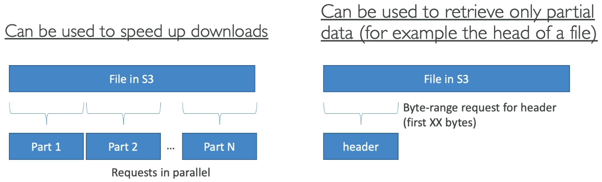

    📌 **Example:**

    Requesting specific parts of a large file in parallel:

    ```
    [Request Part 1 (bytes 0-1023)] --> S3
    [Request Part 2 (bytes 1024-2047)] --> S3
    [Request Part 3 (bytes 2048-3071)] --> S3
    ...
    ```

    Or, requesting only the first 50 bytes to retrieve file headers.

---

## 7. S3 Batch Operations

S3 Batch Operations allow you to perform bulk operations on existing S3 objects with a single request. This is useful for managing and modifying large numbers of objects efficiently.

Here are some use cases:

*   Modify object metadata and properties.
*   Copy objects between S3 buckets.
*   Encrypt the unencrypted objects in S3 buckets.
*   Modify ACLs or tags.
*   Restore objects from S3 Glacier.
*   Invoke a Lambda function to perform custom actions on objects.

A job consists of:

*   A list of objects.
*   The action to perform.
*   Optional parameters.

Why use S3 Batch Operations instead of scripting?

*   Management of retries.
*   Progress tracking.
*   Completion notifications.
*   Report generation.

How to generate a list of objects for S3 Batch Operations:

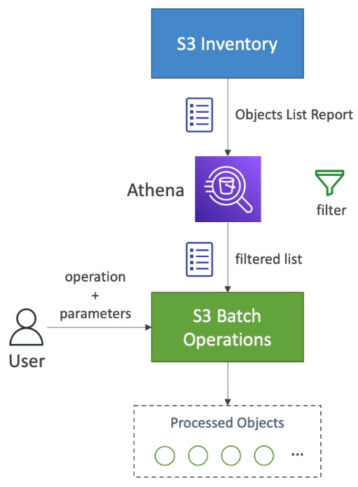

1.  Use S3 Inventory to get a list of objects in an S3 bucket.
2.  Use Athena to query and filter the list.

    ```sql
    -- 📌 Example: Querying S3 Inventory data using Athena
    SELECT * FROM s3_inventory_table WHERE encryption_status = 'UNENCRYPTED';
    ```

3.  Pass the filtered list to S3 Batch Operations, along with the desired operation and parameters.

The S3 Batch service will then process the objects.

One common use case is to find all unencrypted objects using S3 Inventory and then encrypt them using S3 Batch Operations. 💡 **Tip:** This is a good way to ensure all your data is encrypted at rest.

---

## 8. S3 Storage Lens

S3 Storage Lens is a service designed to help you understand, analyze, and optimize your storage across your entire AWS Organization. 🚀 It enables you to:

*   🔍 Discover anomalies.
*   💰 Identify cost efficiencies.
*   🛡️ Apply protection best practices.

You'll gain access to 30-day usage and activity metrics, and you can aggregate data at various levels:

*   🏢 Organization
*   🔑 Specific accounts
*   🌍 Regions
*   🗄️ Buckets
*   📂 Prefixes

You can use the default dashboard provided by Storage Lens or create your own customized dashboard. All metrics and reports can be exported to an S3 bucket in CSV or Parquet format.

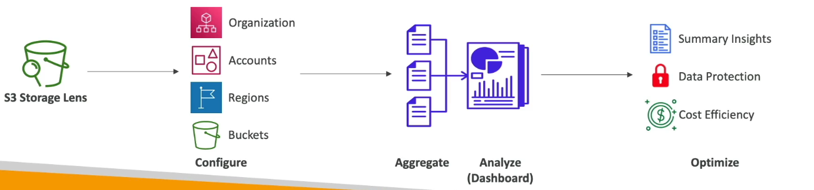

In summary, Storage Lens considers:

1.  Organizations
2.  Accounts
3.  Regions
4.  Buckets

It aggregates this data into a report to aid in analysis, providing summary insights, data protection measures, and cost efficiency strategies, ultimately optimizing your Amazon S3 usage.

### Default Dashboard

When using S3 Storage Lens, you're provided with a default dashboard that offers summarized insights and trends for both free and advanced metrics. This dashboard displays data across multiple regions and accounts without requiring any special setup or filters, as it's pre-configured by Amazon S3.

📝 **Note:** You cannot delete the default dashboard, but you have the option to disable it.

The UI allows you to select specific regions, accounts, buckets, and storage classes for centralized configuration. The dashboard provides information such as:

*   Total storage
*   Object count
*   Average object size
*   Number of buckets
*   Number of accounts

You can also obtain detailed information per account or region.

### Available Metrics

Understanding the available metrics in Storage Lens is crucial for determining its suitability. Here's a breakdown:

*   **Summary Metrics:** Provide general insights about your S3 storage.
    *   📌 **Example:** Storage bytes (size of storage) and object counts (number of objects).
    *   Use cases include identifying the fastest-growing or unused buckets and prefixes.

*   **Cost Optimization Metrics:** Help manage and optimize storage costs.
    *   📌 **Example:** Non-current version storage bytes and incomplete multi-part upload storage bytes.
    *   Use cases include identifying buckets with failed multi-part uploads or objects that can be transitioned to lower-cost storage classes.

*   **Data Protection Metrics:** Provide insights into data protection features.
    *   📌 **Example:** Versioning enabled bucket counts and MFA delete enabled bucket counts.
    *   Use cases include identifying buckets not following data protection best practices.

*   **Access Management Metrics:** Provide insights for S3 bucket ownership.
    *   Use cases include identifying which object ownership settings your buckets currently use.

*   **Event Metrics:** Provide insights for S3 event notifications.
    *   Use cases include knowing how many buckets have S3 event notifications configured.

*   **Performance Metrics:** Provide insights into S3 Transfer Acceleration.
    *   Use cases include seeing how many buckets have S3 Transfer Acceleration enabled.

*   **Activity Metrics:** Provide information about all requests (GET, PUT), bytes downloaded, and more.

*   **HTTP Status Code Metrics:** Help understand the type of usage your buckets are getting (e.g., 200 OK, 403 Forbidden).

### Free vs. Paid Metrics

S3 Storage Lens offers both free and paid metrics.

*   **Free Metrics:**
    *   Automatically available to all customers.
    *   Includes approximately 28 usage metrics.
    *   Data is available for queries for 14 days.

*   **Advanced (Paid) Metrics and Recommendations:**
    *   Advanced metrics: Includes activity metrics, advanced cost optimization, advanced data protection, and status codes.
    *   CloudWatch Publishing: Metrics are published to CloudWatch at no additional charge.
    *   Prefix Aggregation: Allows collecting metrics at the prefix level within S3 buckets.
    *   Data is available for 15 months.

### Key Takeaways

S3 Storage Lens is a valuable service for optimizing your S3 storage. Remember:

*   Understand the difference between free and paid metrics.
*   The default dashboard provides data across multiple accounts and regions.
*   Storage Lens covers your object storage, allowing you to track the number of encrypted objects.

---

## 9. Q & A

**Question 6:**

**You are looking to build an index of your files in S3, using Amazon RDS PostgreSQL. To build this index, it is necessary to read the first 250 bytes of each object in S3, which contains some metadata about the content of the file itself. There are over 100,000 files in your S3 bucket, amounting to 50 TB of data. How can you build this index efficiently?**

### **Options:**

* 🅐 Use the RDS Import feature to load the data from S3 to PostgreSQL, and run a SQL query to build the index
* 🅑 Create an application that will traverse the S3 bucket, read all the files one by one, extract the first 250 bytes, and store that information in RDS
* 🅒 Create an application that will traverse the S3 bucket, issue a Byte Range Fetch for the first 250 bytes, and store that information in RDS
* 🅓 Create an application that will traverse the S3 bucket, use Athena to get the first 250 bytes, and store that information in RDS

<details>

<summary>Explanation</summary>

**Correct Answer:**

**✅ Create an application that will traverse the S3 bucket, issue a Byte Range Fetch for the first 250 bytes, and store that information in RDS**

* **Byte Range Fetch** allows you to download only a portion of an S3 object — in this case, just the first 250 bytes.
* This is **extremely efficient**, especially with large files, as it avoids downloading entire objects (which could be TBs in total).
* You can write a lightweight application or script that:

  1. Lists all objects in the S3 bucket.
  2. Uses the **Range** HTTP header (`Range: bytes=0-249`) to fetch only the metadata portion.
  3. Parses and stores that data into **Amazon RDS PostgreSQL**.

#### **Why Other Options Are Not Efficient**

| Option                            | Issue                                                                                                                  |
| --------------------------------- | ---------------------------------------------------------------------------------------------------------------------- |
| **🅐 RDS Import from S3**         | Not suitable for partial reads; designed for bulk imports, and not optimized for reading small portions.               |
| **🅑 Read full files one by one** | Extremely slow and costly due to downloading all 50 TB unnecessarily.                                                  |
| **🅓 Use Athena**                 | Athena is used for querying structured data (like CSV/Parquet), **not for arbitrary byte-level reads** from raw files. |

</details>


---