# AWS S3 Security

Sections:-
- [1. Object Encryption in Amazon S3](#1-object-encryption-in-amazon-s3)
- [2. About DSSE-KMS](#2-about-dsse-kms)
- [3. Encryption Practice with S3](#3-encryption-practice-with-s3)
- [4. Default Encryption vs. Bucket Policies](#4-default-encryption-vs-bucket-policies)
- [5. CORS (Cross-Origin Resource Sharing)](#5-cors-cross-origin-resource-sharing)
- [6. Practicing CORS](#6-practicing-cors)
- [7. MFA Delete in S3](#7-mfa-delete-in-s3)
- [8. MFA Delete Hands On](#8-mfa-delete-hands-on)
- [9. S3 Access Logs](#9-s3-access-logs)
- [10. S3 Access Logs: A Practical Guide 📝](#10-s3-access-logs-a-practical-guide-📝)
- [11. Amazon S3 Pre-Signed URLs](#11-amazon-s3-pre-signed-urls)
- [12. S3 Pre-Signed URLs Hands-on](#12-s3-pre-signed-urls-hands-on)
- [13. S3 Glacier Vault Lock and S3 Object Lock](#13-s3-glacier-vault-lock-and-s3-object-lock)
- [14. S3 Access Points](#14-s3-access-points)
- [15. S3 Object Lambda](#15-s3-object-lambda)
- [16. Q & A](#16-q--a)

---

## 1. Object Encryption in Amazon S3

You can encrypt objects in S3 buckets using one of the following four methods:

1.  Server-Side Encryption (SSE) -> having 3 flavors
2.  Client-Side Encryption

Let's explore each method in detail. It's important to understand which ones are for which scenario for the exam.

### 1. Server-Side Encryption (SSE)

There are three flavors of SSE:

* a.  **SSE-S3**: Server-Side Encryption with Amazon S3-Managed Keys. Enabled by default. Encrypt S3 objects using keys handled, managed, and owned by AWS.
* b.  **SSE-KMS**: Server-Side Encryption with KMS Keys. Leverage AWS key management service (AWS KMS) to manage encryption keys.
* c.  **SSE-C**: Server-Side Encryption with Customer-Provided Keys. When you want to mange your own encryption keys, use this option.

#### a. SSE-S3

*   Encryption uses a key that's handled, managed, and owned by AWS. You never have access to this key.
*   Object is encrypted server-side by AWS using AES-256.
*   To request Amazon S3 to encrypt the object using SSE-S3, set the header:

    ```
    "x-amz-server-side-encryption": "AES256"
    ```

*   SSE-S3 is **enabled by default** for new buckets and new objects.

How it works:

1.  You upload a file with the correct header.
2.  Amazon S3 pairs it with an S3-owned key.
3.  Encryption is performed by mixing the key and the object.
4.  The encrypted object is stored in your S3 bucket.

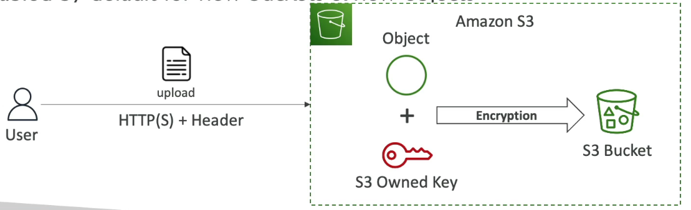

#####  What if you don’t send the `x-amz-server-side-encryption: AES256` header?

* **If the bucket has default SSE-S3 encryption enabled (default for new buckets since Jan 5, 2023)**:
  → **Object will still be encrypted automatically** with SSE-S3.

* **If default encryption is not set (older buckets)**:
  → **Object will be stored unencrypted** unless you specify the header.

**Best Practice:**
Either send the header or enable default encryption on the bucket to ensure all objects are encrypted.

To check default encryption:

```bash
aws s3api get-bucket-encryption --bucket <bucket-name>
```
Response:

```json
{
    "ServerSideEncryptionConfiguration": {
        "Rules": [
            {
                "ApplyServerSideEncryptionByDefault": {
                    "SSEAlgorithm": "AES256"
                },
                "BucketKeyEnabled": true
            }
        ]
    }
}
```

#### b. SSE-KMS

*   You manage your own keys using the KMS (Key Management Service).
*   Advantages of using KMS:
    *   User control over the key. You can create keys yourself within KMS.
    *   You can audit key usage using CloudTrail. Every key usage is logged.
*   To use SSE-KMS, set the header:

    ```
    "x-amz-server-side-encryption": "aws:kms"
    ```

How it works:

1.  You upload the object with the header specifying the KMS key to use.
2.  The KMS key is retrieved from AWS KMS.
3.  The object and KMS key are blended for encryption.
4.  The encrypted file is stored in the S3 bucket.

To read the file, you need access to both the object and the underlying KMS key. This provides an extra layer of security.

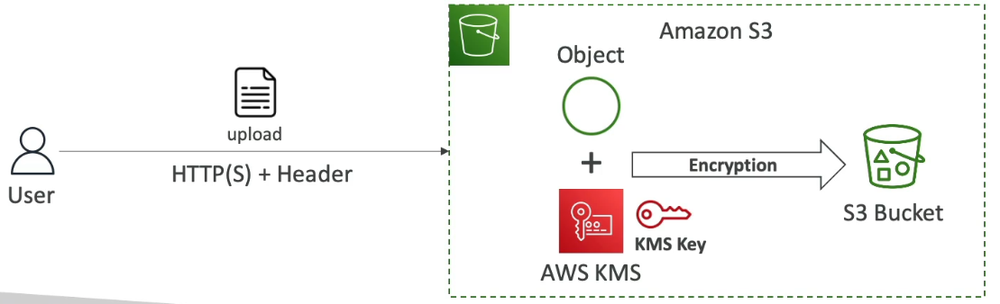

⚠️ **Warning:** SSE-KMS has limitations. 
- Each API call to KMS counts towards KMS quotas (API calls per second) (5500, 10000, 30000 req/s based on region). 
- When you upload, it calls the GenerateDataKey KMS API. 
- When you download, it calls the Decrypt KMS API.
- If you have a very high throughput S3 bucket with everything encrypted using KMS keys, you may encounter throttling. 
- Check your region's limits and consider using the Service Quotas Console to request increases if needed.

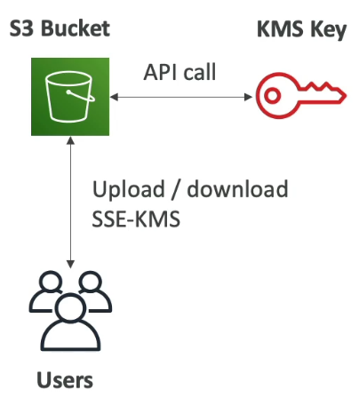

#### c. SSE-C

*   Keys are managed outside of AWS (by the client), but encryption is still server-side.
*   Amazon S3 never stores the encryption key you provide; it's discarded after use.
*   **Must use HTTPS.**
*   And **must pass the encryption key as part of HTTPS headers for every request.**
*   To read the file, you must provide the same key used for encryption.
   
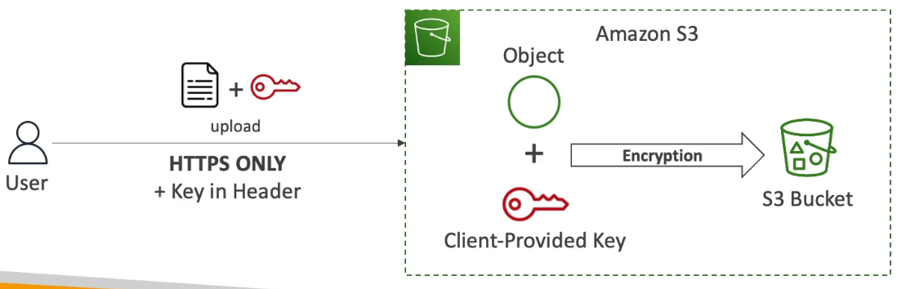

How it works:

1.  You upload a file and the key (managed outside of AWS).
2.  Amazon S3 uses the provided key and the object to perform encryption.
3.  The encrypted file is stored in the S3 bucket.
4.  To read the file, you must provide the same key used for encryption.

### 2. Client-Side Encryption

*   Clients encrypt data themselves before sending it to Amazon S3.
*   Decryption happens on the client outside of Amazon S3.
*   Clients fully manage the keys and the encryption cycle.
*   💡 **Tip:** Consider using a client library like the Client-Side Encryption Library for easier implementation.

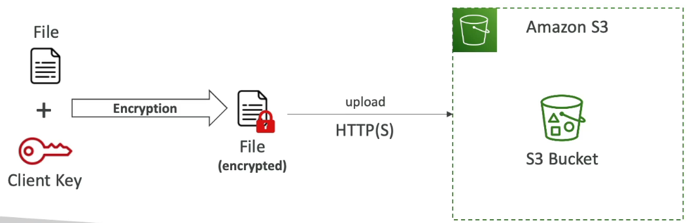

How it works:

1.  You have a file and a client-side key (outside of AWS).
2.  The client performs the encryption.
3.  The encrypted file is uploaded to Amazon S3.

### Encryption in Transit

Encryption in transit (also called SSL/TLS or "in flight" encryption) secures data while it's being transmitted.

*   Amazon S3 buckets have two endpoints:
    *   HTTP (not encrypted)
    *   HTTPS (encrypted)
*   It's highly recommended to use HTTPS for secure data transmission.
*   If using SSE-C, you *must* use HTTPS.

Most clients use the HTTPS endpoint by default.

### How to force encryption in transit?

Use a bucket policy to deny any `GetObject` operation if the connection is not secure (i.e., using HTTP).

```json
{
  "Version": "2012-10-17",
  "Statement": [
    {
      "Effect": "Deny",
      "Principal": "*",
      "Action": "s3:GetObject",
      "Resource": "arn:aws:s3:::your-bucket/*",
      "Condition": {
        "Bool": {
          "aws:SecureTransport": "false"
        }
      }
    }
  ]
}
```

This policy denies `GetObject` requests if `aws:SecureTransport` is `false` (meaning HTTP is used).  HTTPS connections will be allowed.

---

## 2. About DSSE-KMS

In the next lecture, when doing the hands-on you will realize a new encryption option is available, named DSSE-KMS and released in June 2023.

DSSE-KMS is just "double encryption based on KMS".

As long as it is not coming up in the exam, We will not include it in this course. 

---

## 3. Encryption Practice with S3

Let's explore encryption options in Amazon S3. We'll cover setting up default encryption, uploading encrypted objects, and understanding the different encryption types.

### Creating a Bucket with Default Encryption 🪣

1.  Create a new S3 bucket. For this 📌 **Example**, the bucket name is `demo-encryption-<account_id>`.
2.  Leave the default settings for now.
3.  Enable **bucket versioning**. This is important to see how encryption changes affect object versions.
4.  Enable **default encryption** for the bucket. You must choose a default encryption method.
5.  Select **SSE-S3** (Server-Side Encryption with Amazon S3-Managed Keys) for now. We'll look at SSE-KMS and DSSE-KMS later.
6.  Click "Create bucket".

### Verifying Default Encryption 🔍

1.  Upload an object to the bucket. For this 📌 **Example**, we're uploading `coffee.jpg`.
2.  After uploading, click on the file.
3.  Scroll down to find the "Server-side encryption settings".
4.  You should see that the file is encrypted with SSE-S3, meaning Amazon S3 managed the encryption keys.

### Editing Encryption for an Existing Object ✏️

1.  You can change the encryption mechanism for individual files.
2.  Click "Edit" on the object's properties.
3.  ⚠️ **Warning:** Editing the server-side encryption creates a new version of the object. This is why we enabled versioning earlier.
4.  Override the bucket's default encryption settings for this specific object.
5.  Choose either SSE-KMS or DSSE-KMS.
    *   DSSE-KMS is essentially two layers of encryption with KMS, providing stronger security.
    *   For simplicity and cost-effectiveness, we'll use SSE-KMS.
6.  Specify a KMS key.
    *   You can enter a KMS key ARN or choose from your KMS keys.
    *   You should see the `aws/s3` key, which is the default KMS key for S3.
    *   Using the default key doesn't incur additional costs.
    *   Creating your own KMS key will cost you money each month.
7.  Select the default `aws/s3` KMS key.
8.  Leave "Additional copy settings" as default.
9.  Save the changes.

### Verifying the New Version and Encryption 🔑

1.  Go to the "Versions" tab of the object.
2.  You should see two versions of the file.
3.  The current version is now encrypted with SSE-KMS using the default `aws/s3` KMS key.

### Uploading with Encryption Properties ⬆️

1.  You can also specify encryption during the upload process.
2.  Upload a new file (e.g., `beach.jpg`).
3.  In the "Properties" section, find "Server-side encryption".
4.  Here, you can choose to use the default bucket encryption or override it with SSE-S3, SSE-KMS, or DSSE-KMS.

### Changing Default Encryption Properties ⚙️

1.  Navigate to the bucket's "Properties" tab.
2.  Scroll down to "Default encryption".
3.  Click "Edit".
4.  You can now change the default encryption to SSE-S3, SSE-KMS, or DSSE-KMS.
5.  If you choose SSE-KMS, you'll see the "Bucket Key" option.
    *   The Bucket Key reduces costs by decreasing the number of API calls to AWS KMS.
    *   It's enabled by default when using SSE-KMS.
    *   This setting is irrelevant if you're using SSE-S3.

### SSE-C and Client-Side Encryption 🚫

*   📝 **Note:** SSE-C (Server-Side Encryption with Customer-Provided Keys) is not available through the AWS Management Console. You can only use it via the AWS CLI or SDKs.
*   For client-side encryption, you encrypt the data before uploading it to S3 and decrypt it after downloading. **You don't need to explicitly tell AWS that the data is client-side encrypted.**

### Summary ✅

The AWS Management Console allows you to configure SSE-S3, SSE-KMS, and DSSE-KMS. Remember that SSE-C is only available through the CLI or SDKs, and client-side encryption is handled entirely on your end.

---

## 4. Default Encryption vs. Bucket Policies

By default, all new S3 buckets now have default encryption enabled using SSE-S3. This means that new objects added to these buckets are automatically encrypted.

However, you have the flexibility to change the default encryption type. For instance, you could switch to SSE-KMS.

You can also enforce encryption using bucket policies. This involves configuring the bucket policy to reject any API calls that attempt to upload an S3 object without the required encryption headers (e.g., SSE-KMS or SSE-C).

📌 **Example:**

Here's an example of a bucket policy that enforces encryption:

```json
{
  "Version": "2012-10-17",
  "Statement": [
    {
      "Sid": "DenyIncorrectEncryptionHeader",
      "Effect": "Deny",
      "Principal": "*",
      "Action": "s3:PutObject",
      "Resource": "arn:aws:s3:::your-bucket/*",
      "Condition": {
        "StringNotEquals": {
          "s3:x-amz-server-side-encryption": "aws:kms"
        }
      }
    },
    {
      "Sid": "DenyUnencryptedObjectUploads",
      "Effect": "Deny",
      "Principal": "*",
      "Action": "s3:PutObject",
      "Resource": "arn:aws:s3:::your-bucket/*",
      "Condition": {
        "Null": {
          "s3:x-amz-server-side-encryption-customer-algorithm": "true"
        }
      }
    }
  ]
}
```

This policy contains two statements:

1.  The first statement denies any `PutObject` request that doesn't include the `s3:x-amz-server-side-encryption` header set to `aws:kms`.
2.  The second statement denies any `PutObject` request that doesn't include the `s3:x-amz-server-side-encryption-customer-algorithm` header, effectively enforcing SSE-C.

This is just one example, but it demonstrates how bucket policies can be used to enforce encryption on your S3 buckets.

📝 **Note:** Bucket policies are always evaluated *before* default encryption settings. This means that if a bucket policy denies an unencrypted upload, the default encryption setting will not be applied.

In summary:

*   Default encryption is enabled by default using SSE-S3. 🛡️
*   You can change the default encryption type. ⚙️
*   You can use bucket policies to proactively enforce specific encryption types. 🔒

---

## 5. CORS (Cross-Origin Resource Sharing)

CORS, or Cross-Origin Resource Sharing, is a crucial concept to understand, especially for exam questions. This section will provide an in-depth explanation of how CORS works, making it easier to answer related questions.

The **origin** is defined by:

*   Scheme (protocol)
*   Host (domain)
*   Port

📌 **Example:** For the URL `https://www.example.com`:

*   The implied port is 443 (for HTTPS).
*   The protocol is HTTPS.
*   The domain is `www.example.com`.

CORS is a web browser-based security mechanism that allows or denies requests to other origins while visiting a main origin.

### Same Origin vs. Different Origin

Two URLs share the **same origin** if they have the same:

*   Scheme
*   Host
*   Port

📌 **Example:** Two URLs sharing the same origin. Like `http://example.com/app1` and `http://example.com/app2`.

Different origins exist when the scheme, host, or port differ.

📌 **Example:** `http://www.example.com` and `http://other.example.com` have different origins.

If a web browser visits one website and needs to make a request to another website, these requests will be blocked unless the other origin allows the request using CORS headers, specifically the `Access-Control-Allow-Origin` header.

### CORS Workflow

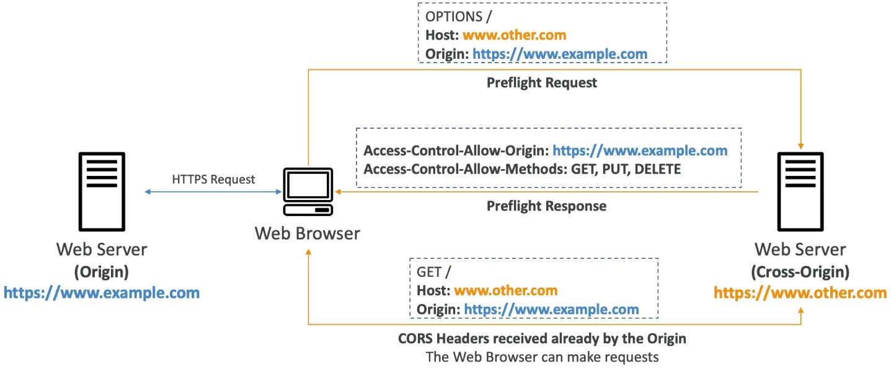

Let's examine a diagram to understand how CORS works:

1.  A web browser makes an HTTPS request to a web server (origin: `https://www.example.com`).
2.  The server responds with an HTML file (e.g., `index.html`) that instructs the browser to fetch images from another web server (cross-origin: `www.other.com`).
3.  The web browser, due to its built-in security, performs a **pre-flight request** to the cross-origin server.
    *   The pre-flight request is an `OPTIONS` request.
    *   It includes the origin of the request (`https://www.example.com`).
4.  The cross-origin web server, if configured for CORS, responds with CORS headers. 📌 **Example:**
   ```
   Access-Control-Allow-Origin: https://www.example.com
   Access-Control-Allow-Methods: GET, PUT, DELETE
   ```
5.  If the web browser is satisfied with the CORS headers, it proceeds to make the actual request to the cross-origin server to retrieve the files.

### CORS and Amazon S3

CORS is particularly relevant when working with Amazon S3.

If a client makes a cross-origin request to your S3 bucket, you must enable the correct CORS headers. This is a common exam topic.

You can allow a specific origin or allow all origins using `*`.

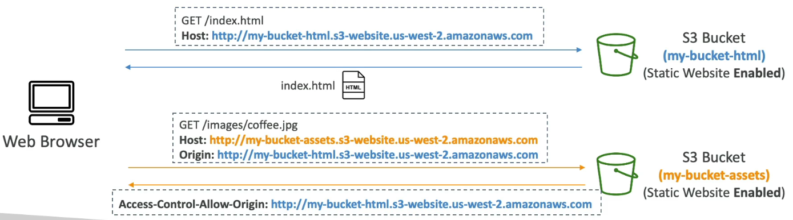

📌 **Example:** Configuring CORS for an S3 bucket.

1.  A web browser accesses an S3 bucket (`my-bucket.html`) configured for static website hosting.
2.  The `index.html` file contains an image that resides in another S3 bucket (`my-bucket-assets`) also configured for static website hosting.
3.  The web browser attempts to retrieve the image (`images/coffee`) from the second S3 bucket.
4.  The browser sends a request to the second S3 bucket with the origin set to the first S3 bucket's URL.
5.  If the second S3 bucket (`my-bucket-assets`) is not configured with the correct CORS headers, the request will be denied. Otherwise, the request will succeed, and the image will be retrieved.

📝 **Note:** CORS allows you to enable images, assets, or files to be retrieved from one S3 bucket when the request originates from another origin.

---

## 6. Practicing CORS

Let's practice using **CORS**!

First, we need to modify the `index.html` file.

`index.html`
```html
<html>
    <head>
        <title>My First Webpage</title>
    </head>
    <body>
        <h1>I love coffee</h1>
        <p>Hello world!</p>
    </body>

    

    <!-- CORS demo -->
    <div id="tofetch"/>
    <script>
        var tofetch = document.getElementById("tofetch");

        // fetch('http://<bucket URL>/extra-page.html')
        fetch('https://other-cors.s3.ap-south-1.amazonaws.com/extra-page.html')
        .then((response) => { 
            return response.text();
        })
        .then((html) => {
            tofetch.innerHTML = html     
        });
    </script>
</html>
```

The webpage will initially display "Hello world I love coffee" along with a coffee image.  After that, a script will fetch and display content from an external HTML page from the same bucket.

`extra-page.html`
```html
<p>This <strong>extra page</strong> has been successfully loaded!</p>
```

The external HTML page will display the text: "This extra page has been successfully loaded."

Next, upload the necessary files to your S3 bucket.

1.  Upload `extra-page.html` and `index.html` to your bucket.
2.  Once uploaded, access your bucket's endpoint URL. You should see "Hello world I love coffee," the coffee image, and the message "This extra page has been successfully loaded." This confirms that the `fetch` request worked within the same origin, as both files are in the same bucket.

Now, let's demonstrate **CORS** in action.

1.  Create a new S3 bucket.  For example, `demo-other-origin-stephane`.
2.  Choose a different AWS region for this bucket to simulate different servers.  For example, Canada.
3.  Disable "Block all public access" for this new bucket, as we'll be making it public.
4.  Enable static website hosting for the new bucket under the "Properties" tab. Set the index document to `index.html`.
5.  Make the bucket public by creating a bucket policy under the "Permissions" tab.
    *   Copy an existing bucket policy and paste it into the policy editor.
    *   Replace the bucket ARN in the policy with the ARN of the new bucket.
    *   Save the changes.

Now, upload the `extra-page.html` file to the new bucket (`demo-other-origin-stephane`).

The `extra-page.html` file should now be publicly accessible through the bucket's website endpoint.

Next, modify the `index.html` file in your *original* bucket to fetch the `extra-page.html` file from the *new* bucket.

1.  Remove the `extra-page.html` from the original bucket, as it's no longer needed there.
2.  Edit the `index.html` file to update the `fetch` request URL to point to the full path of `extra-page.html` in the new bucket.  This will trigger a cross-origin request.

📌 **Example:**

```html
fetch('https://other-cors.s3.ap-south-1.amazonaws.com/extra-page.html')
  .then(response => response.text())
  .then(data => {
    document.getElementById("extra-page-content").innerHTML = data;
  });
```

Upload the modified `index.html` file to your original bucket, overwriting the existing one.

Now, access your original webpage.

1.  Open your browser's developer tools (Chrome Developer Tools) under "More tools" -> "Developer tools".
2.  Refresh the page.

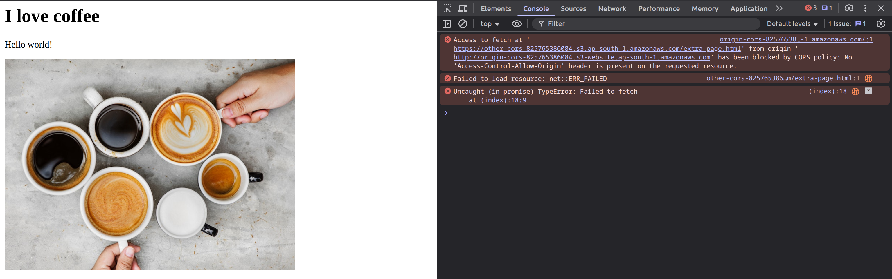

Initially, you'll likely see a **CORS** error in the console. This indicates that the cross-origin request is blocked because the new bucket isn't configured for **CORS**.  The error message will state that the `Access-Control-Allow-Origin` header is missing.

To fix this, configure **CORS** on the *new* bucket (`other-cors`).

1.  Go to the "Permissions" tab of the new bucket.
2.  Edit the **CORS** configuration.
3.  Add a **CORS** configuration in JSON format that allows requests from the origin of your *original* bucket.

📌 **Example:**

```json
[
    {
        "AllowedHeaders": [
            "Authorization"
        ],
        "AllowedMethods": [
            "GET"
        ],
        "AllowedOrigins": [
            "<url of first bucket with http://...without slash / at the end>"
        ],
        "ExposeHeaders": [],
        "MaxAgeSeconds": 3000
    }
]
```

⚠️ **Warning:**  Ensure that the `AllowedOrigins` URL includes `http://` or `https://` and does *not* end with a trailing slash.

Save the **CORS** settings.  This tells the new bucket to allow requests from the specified origin.

Refresh your original webpage again.  This time, the "extra page has been successfully loaded" message should appear, indicating that **CORS** is now working correctly.

You can verify this by inspecting the network tab in the developer tools.  Look at the response headers for the request to `extra-page.html`. You should see the `Access-Control-Request-Method` and `Access-Control-Allow-Origin` headers, confirming that the cross-origin request was allowed.

The `Access-Control-Allow-Origin` or `Origin` header will match the origin of your first bucket.

This exercise demonstrates how **CORS** works and how to configure it to allow cross-origin requests.  While this may seem advanced, understanding the basics of **CORS** is important for the exam.

---

## 7. MFA Delete in S3

MFA Delete is a security feature in Amazon S3 that leverages multi-factor authentication (MFA) to protect against accidental or malicious permanent data loss.

MFA requires users to generate a code on a device, such as:

*   📱 A mobile phone using an authenticator app (e.g., Google Authenticator).
*   🔑 A dedicated MFA hardware device.

This code must be entered into Amazon S3 to authorize specific operations.

When is MFA required? MFA is mandatory for the following actions:

*   🗑️ Permanently deleting an object version. This provides a safeguard against unintended or malicious permanent deletions.
*   🚫 Suspending Versioning on an S3 bucket. This is also considered a destructive operation.

MFA is **not** required for:

*   ✅ Enabling Versioning.
*   📜 Listing deleted versions.

These actions are not considered dangerous.

To use MFA Delete:

1.  Enable Versioning on the S3 bucket. MFA Delete is intrinsically linked to Versioning.
2.  **Only the bucket owner (root account) can enable or disable MFA Delete.**

⚠️ **Warning:** Using the root account should be minimized, but it's necessary for managing MFA Delete.

📝 **Note:** MFA Delete provides an extra layer of protection against the permanent deletion of specific object versions. It's a crucial security measure for data protection.

---

## 8. MFA Delete Hands On

This note explains how to enable and disable MFA Delete on an S3 bucket using the AWS CLI. On UI there is no way to enable or disable MFA Delete.

First, create a bucket and enable versioning:

1.  Create a new S3 bucket (e.g., `demo-MFA-delete-2026`) in a region like `eu-west-1`.
2.  Enable **bucket versioning** for the bucket.

The AWS console UI does not allow enabling MFA Delete directly. You must use the AWS CLI.

### Prerequisites

Login through your root account.

*   Ensure you have an MFA device set up for your root account in IAM.
    1.  Go to your security credentials: Right-click on the root account and click on "security Credentials".
    2.  Verify that you have a virtual MFA device configured and note its ARN.

### Configuring the AWS CLI

⚠️ **Warning:**  It's generally not recommended to use the root account for CLI configuration, except when enabling MFA Delete.

1.  Create new access keys for your root account.
2.  Download the key file and/or note the access key ID and secret access key.
3.  Configure the AWS CLI with a new profile using the root account credentials:

    ```bash
    aws configure --profile roots-MFA-delete-demo
    ```

    *   Enter the access key ID.
    *   Enter the secret access key.
    *   Set the default region name (e.g., `eu-west-1`).
    *   Set the default output format (optional).

4.  Verify the profile is working:

    ```bash
    aws s3 ls --profile roots-MFA-delete-demo
    ```

    This should list your S3 buckets.

### Enabling MFA Delete

1.  Use the following command to enable MFA Delete.  Replace the bucket name, MFA device ARN, and MFA code (get it from the MFA device like Google Authenticator) with your actual values.

    ```bash
    aws s3api put-bucket-versioning --bucket <your-bucket-name> --versioning-configuration Status=Enabled,MFADelete=Enabled --mfa "<your-mfa-device-arn> <mfa-code>" --profile roots-MFA-delete-demo
    ```

    📌 **Example:**

    ```bash
    aws s3api put-bucket-versioning --bucket demo-MFA-delete-2026 --versioning-configuration Status=Enabled,MFADelete=Enabled --mfa "arn:aws:iam::123456789012:mfa/root-account-mfa-device 123456" --profile roots-MFA-delete-demo
    ```

2.  Verify that MFA Delete is enabled by checking the bucket's versioning properties in the AWS console.  It should now show "MFA delete enabled".

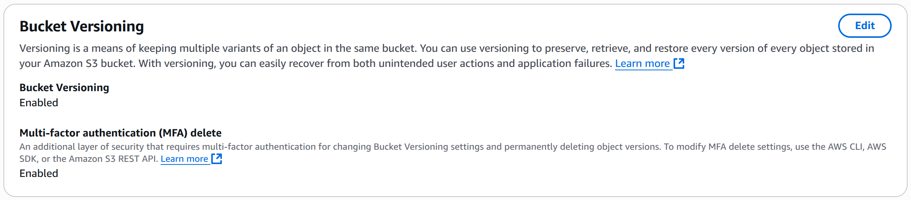

### Testing MFA Delete

1.  Upload an object to the bucket.
2.  Delete the object. This will create a delete marker because versioning is enabled.
3.  Try to permanently delete a specific version of the object using the AWS console.  **This should fail because MFA Delete is enabled.**

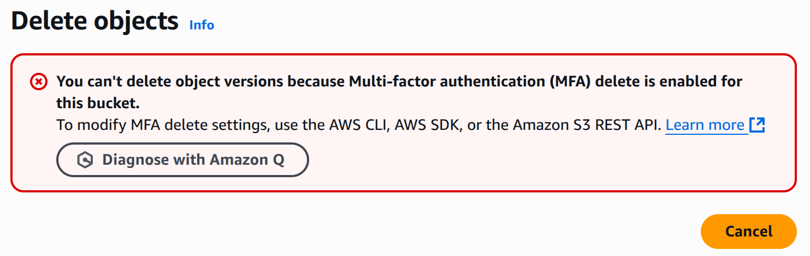

### Disabling MFA Delete

1.  Use the same previous command with little change to disable MFA Delete. Previously we used `MFADelete=Enabled` but now we use `MFADelete=Disabled`. Replace the bucket name, MFA device ARN, and MFA code with your actual values. Use the latest MFA code from your MFA device.

    📌 **Example:**

    ```bash
    aws s3api put-bucket-versioning --bucket demo-MFA-delete-2026 --versioning-configuration Status=Enabled,MFADelete=Disabled --mfa "arn:aws:iam::123456789012:mfa/root-account-mfa-device 123456" --profile roots-MFA-delete-demo
    ```

2.  Verify that MFA Delete is disabled by checking the bucket's versioning properties in the AWS console.  It should now show "MFA delete disabled". Now you can permanently delete the object.

### Post-Lecture Cleanup

⚠️ **Warning:**  It is crucial to delete the root access keys after enabling/disabling MFA Delete.

1.  Deactivate and then delete the root access keys you created for this process.
2.  This is a critical security measure.

💡 **Tip:** Consider using IAM roles and temporary credentials instead of root account access keys for most AWS CLI operations.

You can also delete the configured profile from your `~/.aws` file. Manually remove the profile from config files. AWS CLI stores profiles in two files:
- ~/.aws/config — contains region, output format, etc.
- ~/.aws/credentials — contains access and secret keys.

Each profile looks like:

* In `~/.aws/config`:

  ```
  [profile my-profile]
  region = us-east-1
  output = json
  ```

* In `~/.aws/credentials`:

  ```
  [my-profile]
  aws_access_key_id = ...
  aws_secret_access_key = ...
  ```

```bash
# Open the config files in your editor
vim ~/.aws/config
vim ~/.aws/credentials
```

Delete the blocks corresponding to your profile (e.g., `[my-profile]` and `[profile my-profile]`).

---

## 9. S3 Access Logs

For audit purposes, you might need to log all access attempts to your S3 buckets. This includes every request made to your S3 bucket from any account, regardless of whether the request was authorized or denied. These logs are saved as files in another S3 bucket. You can then analyze this data using tools like Amazon Athena.

📝 **Note:** **The target logging bucket must be in the same AWS region as the bucket you are monitoring.**

How does it work?

1.  Requests are made against your S3 bucket.
2.  You enable access logs on your S3 bucket.
3.  All requests are then logged into the designated logging bucket.

There's a specific format for these logs. You can find the details at the AWS documentation.

⚠️ **Warning:** **Never set the logging bucket to be the same as the bucket you are monitoring!** This will create a logging loop, leading to exponential growth of your bucket size and unexpected costs.

📌 **Example:**

Imagine you have an application bucket and you mistakenly set the logging bucket to be the same.

```
App Bucket == Logging Bucket
```

Every time data is written to the application bucket, a log entry is created and written to the logging bucket. Because the logging bucket *is* the application bucket, this write operation triggers *another* log entry, and so on, creating an infinite loop.

This can quickly escalate costs. 💸

So, avoid this configuration!

---

## 10. S3 Access Logs: A Practical Guide 📝

Let's walk through setting up S3 access logs.

First, we'll create a dedicated S3 bucket for storing these logs.

1.  Create an S3 bucket (no need to unblock the public access). This will be our logging bucket.

    📝 **Note:** Keep this bucket open in your console.

2.  In another tab, select the S3 bucket for which you want to enable logging.

3.  Navigate to **Properties** and find **Server access logging**.

4.  Click **Edit** to configure the logging settings.

### Enabling Server Access Logging ⚙️

1.  Enable server access logging.

    ⚠️ **Warning:** Enabling logging will update the bucket policy of the target bucket.

2.  Specify the destination for the logs:

    *   **Destination Bucket:** Select the logging bucket you created earlier. 📌 **Example:** `stefan-access-log-v3`.
    *   **Destination Region:** Ensure the correct region is selected. 📌 **Example:** `EU West one`.
    *   **Destination Bucket Name Prefix:** This is an optional prefix within the logging bucket. We'll skip this for now.

3.  Configure the **Log object key format**.

    *   You have options for the key format. The default option is usually sufficient.

        📌 **Example:** The default format provides a simple key structure. Alternative formats can include S3 event time or log file delivery time.

4.  Click **Save changes** to enable S3 server access logging.

### Generating and Viewing Logs 🔎

1.  Generate activity in your target bucket.

    *   Upload files, open objects, etc. 📌 **Example:** Upload a JPEG file.

2.  It takes time for logs to appear in the logging bucket.

    📝 **Note:** Don't be alarmed if logs aren't immediately visible.

### Verifying Bucket Policy Update ✅

1.  Go back to the target bucket and check its **Permissions**.
2.  Scroll down to **Bucket Policy**.
3.  Verify that the bucket policy has been updated to allow the Amazon S3 logging service to put objects into the bucket.

    💡 **Tip:** The policy should grant `s3:PutObject` permission to the `logging.s3.amazonaws.com` service principal.

### Accessing and Interpreting Logs 📊

1.  After some time (potentially hours), refresh your logging bucket.
2.  You should see new objects representing the access logs.
3.  Open one of the log files.
4.  The log file contains detailed information about bucket access:

    *   API calls
    *   Success rate
    *   User information
    *   Bucket accessed
    *   Timestamps

    📝 **Note:** The log format can be difficult to decipher without specialized tools.

That concludes the setup and basic usage of S3 access logs.

---

## 11. Amazon S3 Pre-Signed URLs

Pre-signed URLs are URLs that you can generate using the S3 console, the CLI, or the SDK. The key feature is that the URL has an expiration date.

*   Using the console, the expiration can be up to 12 hours. (1 min to 12 hours)
*   Using the CLI, you can set the expiration for up to 168 hours = 7 days. (default 3600 secs)

The core idea is that when you generate a pre-signed URL, the user who receives that URL inherits the permissions of the user who generated it, specifically for `GET` or `PUT` requests.

### Use Case 🔑

Imagine you have a private S3 bucket and you want to grant someone outside of AWS access to a single file. You don't want to make the file public or compromise your security. Here's how pre-signed URLs help:

1.  As the bucket owner or an authorized user, you generate a pre-signed URL for the specific file. 🔑
2.  The S3 bucket creates a URL that is "pre-signed," meaning it carries your credentials for authorization to access that file.
3.  You send this URL to the target user, granting them access to the file for a limited time. 📧
4.  The user uses the URL to access the file in the S3 bucket.
5.  The user can then download the file, for example. ✅

Pre-signed URLs are a common solution for providing temporary access to a specific file for either download or upload.

### 📌 Examples:

*   Allow only logged-in users to download a premium video from your S3 bucket. 🎬
*   Enable a dynamically changing list of users to download files by generating URLs on the fly. ⚙️
*   Temporarily allow a user to upload a file to a specific location in your S3 bucket while keeping the bucket private. ⬆️

This approach is useful for maintaining your S3 bucket's privacy while providing controlled, temporary access to specific resources.

---

## 12. S3 Pre-Signed URLs Hands-on

Let's explore how to use S3 pre-signed URLs. We'll start with a private S3 bucket and demonstrate how to grant temporary access to objects within it.

First, let's confirm that our S3 object is indeed private.

1.  Select an object in your S3 bucket (e.g., `coffee.jpg`).
2.  Attempt to access the object URL directly.
3.  You should receive an "Access Denied" error, confirming the object's privacy.

The standard object URL will not work because the bucket is not public. However, if you open the object directly from the AWS console, it works! This is because the console uses a pre-signed URL.

So, how do we generate these pre-signed URLs ourselves? There are two methods:

1.  Using the AWS CLI.
2.  Using the AWS Management Console.

Let's focus on using the console:

1.  Navigate to your S3 object in the AWS Management Console.
2.  Click on "Object actions" and select "Share a pre-signed URL".
3.  ⚠️ **Warning:** The console will display a message stating that anyone with this URL can access the object until it expires, even if the bucket and object are private.
4.  Specify the expiration time for the URL (e.g., 5 minutes).
5.  Click "Create pre-signed URL".

Now you have a pre-signed URL that you can share! Anyone with this URL will be able to access the object within the specified timeframe.

📌 **Example:** You can copy the generated URL and share it with someone. They can paste it into their browser, press Enter, and access the image.

📝 **Note:** Pre-signed URLs are a great way to grant temporary access to files in your S3 bucket. They are particularly useful when you need to share access quickly and want to ensure that the URL expires for security reasons. 

💡 **Tip:** Always set an appropriate expiration time to minimize the risk of unauthorized access.

---

## 13. S3 Glacier Vault Lock and S3 Object Lock

Let's explore S3 Glacier Vault Lock and S3 Object Lock, both designed to ensure data immutability.

### S3 Glacier Vault Lock 🔒

The primary goal of S3 Glacier Vault Lock is to lock your Glacier Vault to adhere to a **WORM** (Write Once Read Many) model.

*   You place an object into your S3 Glacier Vault.
*   You then lock the vault to prevent any modifications or deletions.

To achieve this:

1.  Create a Vault Lock Policy on your Glacier vault.
2.  Lock the policy itself to prevent future edits.

Once a Vault Lock Policy is set and locked:

*   It cannot be changed or deleted by anyone, including administrators or AWS itself. 🛡️
*   This is extremely useful for compliance and data retention purposes.

If an object is in a Glacier vault with a Vault Lock Policy, the object can never be deleted. This is particularly helpful for legal and compliance requirements.

### S3 Object Lock 🗄️

S3 Object Lock offers similar functionality to Glacier Vault Lock but at the object level within S3 buckets.

📝 **Note:** To enable S3 Object Lock, you must first enable **versioning** on your S3 bucket.

S3 Object Lock allows you to adopt a WORM model, but the lock is applied to individual objects within the bucket, not the entire bucket. This allows you to block specific object versions from being deleted for a defined period.

#### Retention Modes ⏳

There are two retention modes available:

1.  **Compliance Mode:**

    *   This mode is similar to S3 Glacier Vault Lock.
    *   Object versions cannot be overwritten or deleted by any user, including the root user. 🚫
    *   Retention modes and periods cannot be changed or shortened.
    *   This is the strictest mode for compliance.
2.  **Governance Mode:**

    *   Most users cannot override or delete object versions or alter their lock settings. 🛡️
    *   Admin users with special IAM permissions can change the retention or delete objects directly.
    *   This mode offers more flexibility than Compliance Mode.

In both modes, you must set a **retention period** to specify how long the object should be protected. This period can be extended if needed.

#### Legal Hold ⚖️

In addition to retention modes, you can also place a **legal hold** on an object.

*   A legal hold protects an object indefinitely, regardless of the retention period or mode.
*   Think of it as marking an object as crucial for legal proceedings.
*   Users with the `S3:PutObjectLegalHold` IAM permission can place or remove legal holds.

📌 **Example:** If an object is needed for a trial, a legal hold can be placed on it to ensure it is protected indefinitely.

This provides a flexible way to protect specific objects when needed. Once the legal investigation is over, the legal hold can be removed.

#### Key Differences Summarized 🔑

*   **Glacier Vault Lock:** Applies to the entire Glacier vault.
*   **S3 Object Lock:** Applies to individual objects within an S3 bucket.
*   **Compliance Mode:** Strict, no one can override.
*   **Governance Mode:** More lenient, admins can override.
*   **Legal Hold:** Indefinite protection, independent of retention settings.

Understanding these differences is crucial.

---

## 14. S3 Access Points

Let's explore S3 access points and how they can simplify security management for S3 buckets.

Imagine an S3 bucket containing a variety of data, such as finance and sales information. Different users or groups need access to specific portions of this data. A complex S3 bucket policy could become unmanageable as the number of users and data grows.

The solution? S3 access points! 🚀

We can create dedicated access points tailored to specific data subsets.

📌 **Example:**

*   A "finance" access point connected to finance data.
*   A "sales" access point connected to sales data.
*   An "analytics" access point with read-only access to both finance and sales data.

How are these access points connected to their respective data? Through **access point policies**. These policies, similar to S3 bucket policies, grant read/write access to specific prefixes within the bucket.

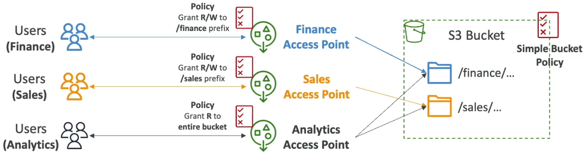

Here's how it works:

1.  Create a **finance access point**.
2.  Define an **access point policy** granting read/write access to the "finance" prefix.
3.  Create a **sales access point**.
4.  Define a separate **access point policy** granting read/write access to the "sales" prefix.
5.  Create an **analytics access point**.
6.  Define a **read-only access point policy** allowing access to both "finance" and "sales" prefixes.

This approach shifts security management from a single, potentially unwieldy S3 bucket policy to individual access points, each with its own security rules.

With proper IAM permissions, users can access only the access points relevant to their needs. Finance users access the finance access point, sales users access the sales access point, and the analytics group can access both finance and sales through the analytics access point.

Benefits of using access points:

*   Simplified security management. ✅
*   Policies attached to each access point. ✅
*   Simplified bucket policy on Amazon S3. ✅
*   Scalable access to S3 buckets. ✅

To summarize, access points simplify security management for S3 buckets. Each access point has its own DNS name, allowing you to connect to it. You can configure it to be connected to the internet or a VPC for private traffic.

S3 access points can be privately accessible through a VPC origin. An EC2 instance within a VPC can access the S3 bucket without traversing the internet, using a VPC access point and a VPC origin.

To enable this private access, you need to create a **VPC endpoint** to access the access point. This VPC endpoint acts as a secure connection point within your VPC, allowing private access to the access point through the VPC origin.

The VPC endpoint also has a policy that must allow access to the target buckets and the access points. This policy ensures that your EC2 instance can connect to both the access points and the S3 buckets.

Security layers involved in VPC access points:

1.  VPC endpoint policy for security.
2.  Access point policy for security.
3.  S3 bucket level security.

```
# Example: VPC Endpoint Policy (Conceptual)
{
  "Version": "2012-10-17",
  "Statement": [
    {
      "Effect": "Allow",
      "Principal": "*",
      "Action": [
        "s3:GetObject",
        "s3:ListBucket"
      ],
      "Resource": [
        "arn:aws:s3:::your-bucket-name",
        "arn:aws:s3:::your-bucket-name/*",
        "arn:aws:s3:region:account-id:accesspoint/your-access-point-name"
      ],
      "Condition": {
        "StringEquals": {
          "aws:SourceVpc": "vpc-yourvpcid"
        }
      }
    }
  ]
}
```

📝 **Note:** The above policy is a simplified example and should be tailored to your specific requirements.  Always follow the principle of least privilege.

By implementing these security measures, you can ensure secure and controlled access to your S3 data through access points.

---

## 15. S3 Object Lambda

Another use case for S3 access points is with S3 Object Lambda. The core idea is to modify an object in an S3 bucket through a Lambda function just before it's retrieved by an application. This avoids duplicating buckets for different versions of the same object.

Only one S3 bucket is needed, on top of which we create S3 Access Point and S3 Object Lambda access points.

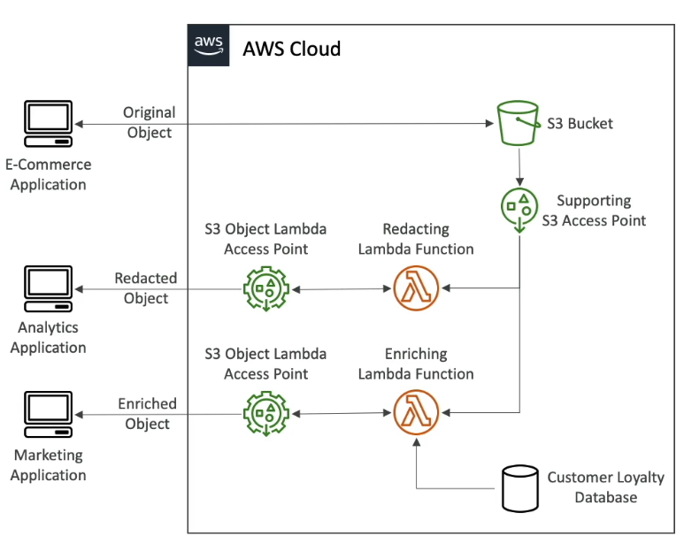

Here's how it works:

1.  Imagine you have an S3 bucket containing data owned by an e-commerce application. This application can directly access the S3 bucket to put and get the original objects.
2.  Now, suppose an analytics application needs access to a *redacted* version of the same data. Instead of creating a separate S3 bucket, you can use S3 Object Lambda.
3.  Create an S3 access point on top of the S3 bucket and connect it to a Lambda function.
4.  This Lambda function will redact the object as it's being retrieved.
5.  Create an S3 Object Lambda access point on top of the Lambda function.
6.  The analytics application accesses the S3 bucket through this S3 Object Lambda access point.

In summary:

*   The analytics application accesses the S3 Object Lambda access point.
*   This invokes the Lambda function.
*   The Lambda function retrieves the data from the S3 bucket.
*   The Lambda function runs code to redact the data.
*   The analytics application receives the redacted object from the same S3 bucket used by the e-commerce application. 📦

Now, consider a marketing application that needs an *enriched* version of the data, using a customer loyalty database. Again, instead of creating a new S3 bucket:

1.  Use another Lambda function.
2.  This Lambda function enriches the data by looking it up in the customer loyalty database.
3.  Create another S3 Object Lambda access point on top of this Lambda function.
4.  The marketing application accesses this S3 Object Lambda access point to get the enriched objects. ➕

As you can see, you only need one S3 bucket, but you can use access points and Object Lambda to modify the data as needed. 🧰

Use cases for S3 Object Lambda include:

*   Redacting PII (Personally Identifiable Information) for analytics or non-production environments. 🛡️
*   Converting data formats (e.g., XML to JSON).
*   Performing any kind of data transformation.
*   Resizing and watermarking images on the fly, where the watermark is specific to the user requesting the object. 🖼️

📌 **Example:** Watermarking images with a user-specific identifier.

```
# Sample Lambda function (Python) - simplified
def lambda_handler(event, context):
    # Get the object from the event
    bucket = event['bucketArn']
    key = event['key']

    # Download the object from S3
    response = s3.get_object(Bucket=bucket, Key=key)
    image_data = response['Body'].read()

    # Add watermark to the image (implementation omitted)
    watermarked_image = add_watermark(image_data, user_id)

    # Return the modified object
    return {
        'statusCode': 200,
        'body': watermarked_image,
        'headers': {
            'Content-Type': 'image/jpeg'  # Or the appropriate content type
        }
    }
```

---

## 16. Q & A

### ❓ Question

A company has its data and files stored on some S3 buckets. Some of these files need to be kept for a predefined period of time and protected from being overwritten and deletion according to company compliance policy. Which S3 feature helps you in doing this?

* S3 Object Lock – Retention Governance Mode
* S3 Versioning
* S3 Object Lock – Retention Compliance Mode
* S3 Glacier Vault Lock

<details>

<summary>Explanation</summary>

### 📝 Explanation (focusing on 1st & 3rd options)

#### 1. **S3 Object Lock – Retention Governance Mode**

* Protects objects from accidental overwrites and deletions.
* Users with special IAM permission (`s3:BypassGovernanceRetention`) can still **override or remove locks** if needed.
* Suitable for **internal governance policies**, but not strict legal compliance.

#### 3. **S3 Object Lock – Retention Compliance Mode** ✅

* Provides **regulatory-grade immutability**.
* Once enabled, **no user—including the root account—can modify or delete** the object until the retention period ends.
* Meets **WORM (Write Once, Read Many)** requirements.
* Ideal for **legal, audit, and compliance-driven needs**.

### 📊 Governance Mode vs Compliance Mode

| Feature                        | Governance Mode 🛠️                    | Compliance Mode 🔒               |
| ------------------------------ | -------------------------------------- | -------------------------------- |
| Accidental deletion protection | ✅ Yes                                  | ✅ Yes                            |
| Can privileged users override? | ⚠️ Yes, with permission                | ❌ No, not even root can override |
| Best suited for                | Internal governance, flexible policies | Regulatory/legal compliance      |
| WORM enforcement               | Partial (overridable)                  | Full, strict                     |

✅ Answer:- **S3 Object Lock – Retention Compliance Mode**

</details>

---

### ❓ Question

A company you're working for wants their data stored in S3 to be encrypted. They don't mind the encryption keys stored and managed by AWS, but they want to maintain control over the **rotation policy of the encryption keys**. You recommend them to use …

* SSE-S3
* SSE-KMS
* SSE-C

<details>

<summary>Explanation</summary>

* **SSE-S3**

  * Encryption keys are **fully managed by AWS**.
  * No visibility or control over key rotation.
  * Simplest option but not suitable if you want control.

* **SSE-KMS**

  * Encryption happens in AWS, keys are stored and managed in **AWS KMS**.
  * You get **full control over key policies, permissions, and rotation**.
  * Can choose between **AWS-managed keys (auto-rotated annually)** or **customer-managed keys (CMKs)** where you define and control the rotation schedule.
  * Best suited when compliance or security policies demand more control.

* **SSE-C**

  * Customer provides their own encryption key **with each request**.
  * AWS does not store the key.
  * Customer is fully responsible for key management and rotation.
  * More complex and not needed here since the company is fine with AWS storing the keys.

✅ Answer: **SSE-KMS (Server-Side Encryption with AWS Key Management Service)**

### 📊 Quick Comparison

| Option        | Key Storage | Rotation Control                        | Who Manages Keys                                |
| ------------- | ----------- | --------------------------------------- | ----------------------------------------------- |
| **SSE-S3**    | AWS         | ❌ No                                    | AWS                                             |
| **SSE-KMS** ✅ | AWS KMS     | ✅ Yes (AWS-managed or customer-managed) | Shared (AWS stores, customer controls rotation) |
| **SSE-C**     | Customer    | ✅ Yes (fully manual)                    | Customer only                                   |

⚡ **In this scenario:** Since the company wants AWS to store/manage the keys **but** still retain **control over rotation**, the right choice is **SSE-KMS**.

</details>

---

### ❓ Question

Which of the following S3 Object Lock configuration allows you to prevent an object or its versions from being overwritten or deleted indefinitely and gives you the ability to remove it manually?

- a. Retention Governance Mode
- b. Retention Compliance Mode
- c. Legal Hold Mode


<details>

<summary>Explanation</summary>

Answer: **c. Legal Hold Mode**

</details>

---
