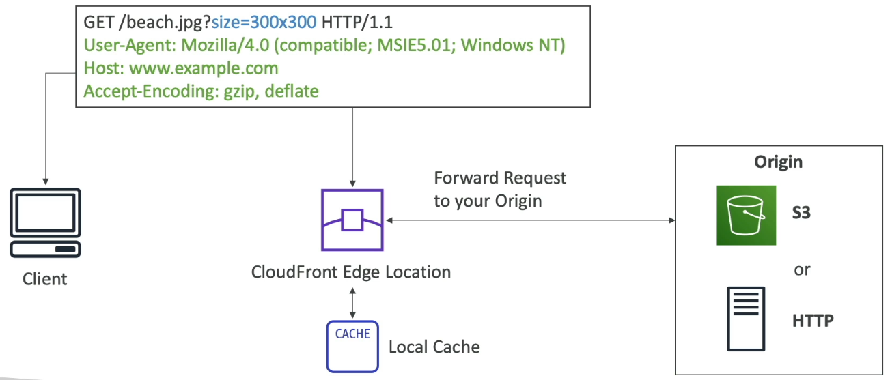
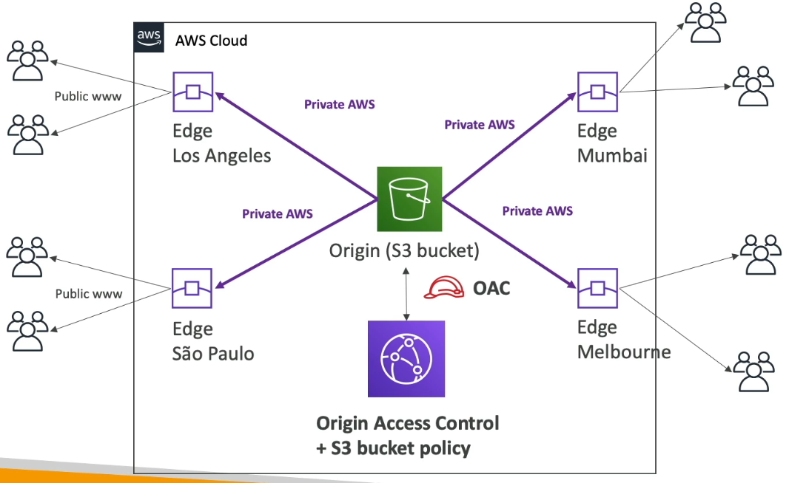
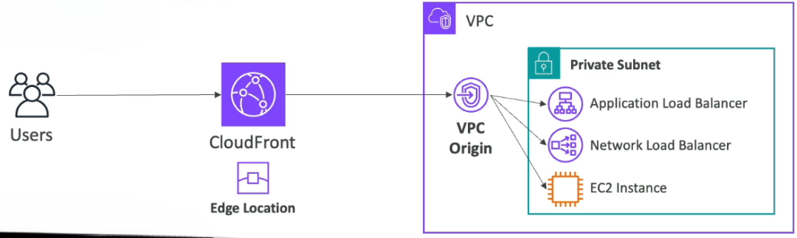
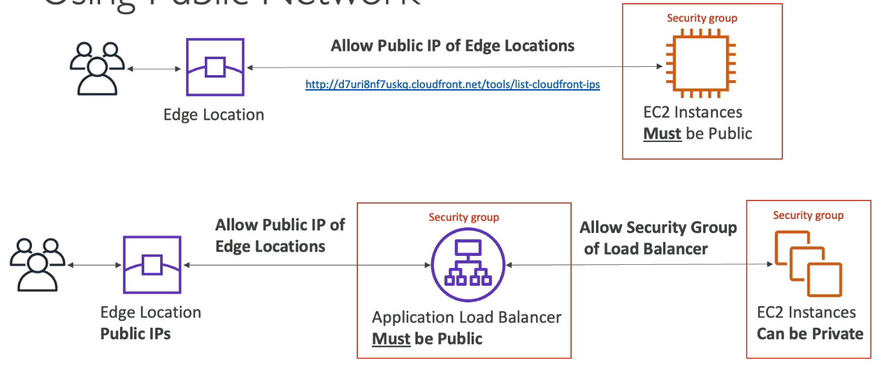
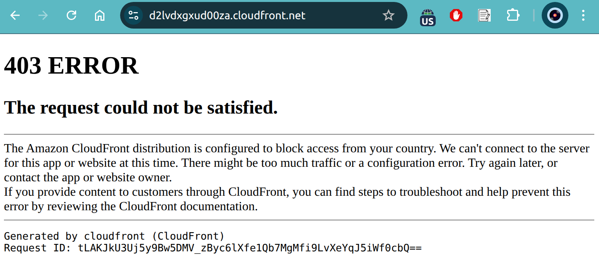
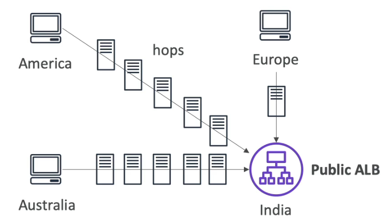
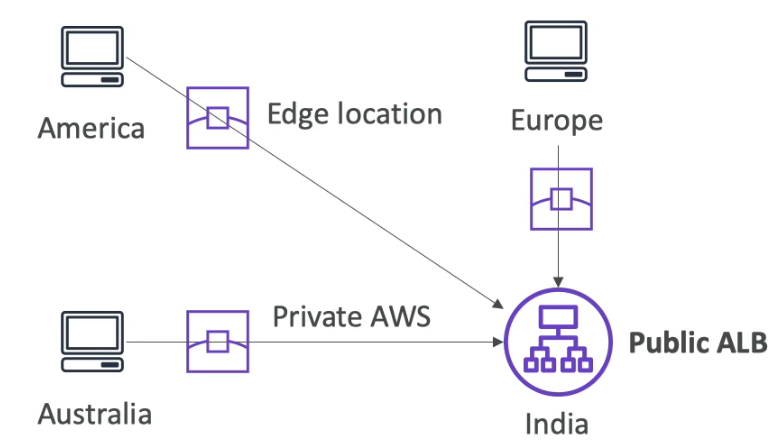
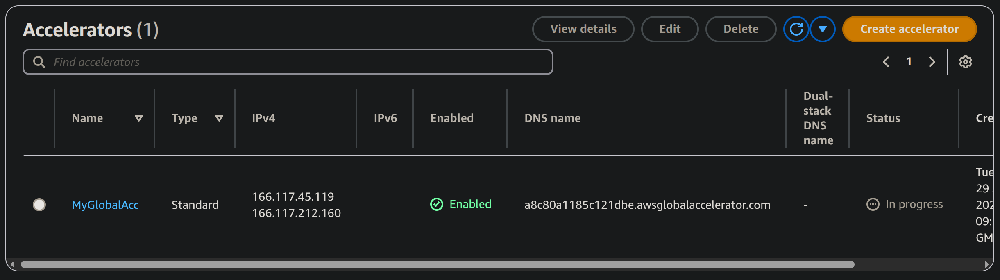

# Cloudfront & AWS Global Accelerator

Sections:-
- [1. CloudFront Overview](#1-cloudfront-overview)
- [2. Using CloudFront with S3](#2-using-cloudfront-with-s3)
- [3. Connecting CloudFront to Application Load Balancers or EC2 Instances](#3-connecting-cloudfront-to-application-load-balancers-or-ec2-instances)
- [4. CloudFront Geo Restriction](#4-cloudfront-geo-restriction)
- [5. CloudFront Advanced Options: Pricing and Price Classes](#5-cloudfront-advanced-options-pricing-and-price-classes)
- [6. Cache Invalidations in CloudFront](#6-cache-invalidations-in-cloudfront)
- [7. AWS Global Accelerator - Overview](#7-aws-global-accelerator---overview)
- [8. AWS Global Accelerator - Hands On](#8-aws-global-accelerator---hands-on)

---

## 1. CloudFront Overview

Amazon **CloudFront** is a **Content Delivery Network (CDN)** designed to improve the performance and security of your applications by distributing content globally and reducing latency.


### 🌐 What is CloudFront?

- CloudFront is AWS’s **CDN solution**.
- Anytime you see "CDN" on the exam, **think CloudFront**.
- It improves **read performance** by **caching content at global Edge locations**.
- This allows users around the world to access content with **lower latency**, greatly enhancing the **user experience**.


### 🌍 Global Reach

- CloudFront operates through **216+ Points of Presence (PoPs)**, also known as **Edge locations**.
- AWS is **continually adding more locations** to enhance global reach and performance.
- 💡 **Tip:** The distributed nature of CloudFront not only speeds up content delivery but also provides **DDoS protection**.


### 🛡️ Security Features

- CloudFront offers protection against **DDoS attacks**.
- Enhanced security is enabled by:
  - **AWS Shield**
  - **Web Application Firewall (WAF)** (covered in the security section)


### 📌 Example: How CloudFront Works

Imagine you host a website on an **S3 bucket in Australia**, and a user in the **U.S.** accesses it:

1. The user’s request is routed to a **U.S. Edge location**.
2. CloudFront **fetches the content from the origin (Australia)** if not cached.
3. The content is then **cached** at the U.S. Edge location.
4. Subsequent users in the U.S. get content **directly from the Edge**—no more fetching from Australia.

This reduces latency and improves performance across global users.


### 🔗 CloudFront Origins

CloudFront supports multiple **origin types** (i.e., backends):

- **Amazon S3 buckets**:
  - Used for **static files distribution** and **Edge caching**.
  - Supports **file uploads** to S3 via CloudFront.
  - Secured using **Origin Access Control (OAC)**.

- **VPC-based origins**:
  - For applications hosted in **private subnets**.
  - Can include:
    - **Application Load Balancer (ALB)**
    - **Network Load Balancer (NLB)**
    - **EC2 instances**

- **Custom HTTP origins**:
  - Any backend accessible via HTTP.
  - 💡 **Tip:** For S3 websites, ensure the **S3 bucket is configured as a static site**.


### ⚙️ How CloudFront Works (Simplified Flow)



1. 🌍 **Edge Locations** are globally available.
2. 🌐 **Client** sends an HTTP request to the nearest Edge location.
3. 🧠 **Edge checks its cache**:
   - If **cached**, it serves directly.
   - If **not cached**, it fetches from the origin.
4. 🗃️ The content is then **stored (cached)** at the Edge.
5. 🔁 Future requests are served from the cache, **reducing latency**.


### 📌 Example: S3 as an Origin



- Your **S3 bucket** is in one AWS region.
- **Edge locations** in cities like Los Angeles or São Paulo fetch content.
- They serve users from nearby locations for **faster delivery**.
- Content is fetched via a **private network** secured with:
  - **Origin Access Control (OAC)**
  - **S3 Bucket Policy**


### 🔁 CloudFront vs. S3 Cross-Region Replication

| Feature                         | CloudFront                                      | S3 Cross-Region Replication                 |
|-------------------------------|--------------------------------------------------|---------------------------------------------|
| Purpose                        | Distribute content globally via cache           | Replicate S3 bucket to specific regions     |
| Reach                          | 🌍 Global (216+ Edge locations)                 | 📍 Limited to configured regions. Must be setup for each region you want replication to happen            |
| Content Refresh                | Cached for ~1 day                               | Real-time replication                       |
| Ideal for                      | Static content that must be available everywhere                                 | Read only. Dynamic content that needs to be available at low-latency in few regions                            |
| Usage                          | CDN with latency optimization                   | Backup/failover and multi-region access     |

💡 **Tip:** Use **CloudFront** for **fast, cached delivery**, and **S3 Replication** for **real-time content syncing** between regions.


### ✅ Summary

- CloudFront is AWS's **CDN** that caches and distributes content globally.
- It improves **performance**, **reduces latency**, and enhances **security**.
- Supports multiple **origin types** (S3, VPC, Custom HTTP).
- **CloudFront ≠ S3 replication**—they solve different problems.

---

## 2. Using CloudFront with S3

Let's practice using CloudFront to serve content from an S3 bucket.

### Creating an S3 Bucket 🗂️

First, we need to create an S3 bucket to hold the files for our CloudFront distribution.

1.  Create a new bucket.  For this 📌 **Example**, the bucket is named `demo-cloudfront-account-id`.
2.  Leave all settings as default.
3.  Click on "Create bucket".

### Uploading Files to S3 📤

Next, upload the files you want to serve via CloudFront to the newly created S3 bucket.

1.  Select the bucket.
2.  Click on "Upload".
3.  Add the desired files. In this 📌 **Example**, the files are `beach.jpeg`, `coffee.jpeg`, and `index.html`.
4.  Click on "Upload".

### Understanding S3 Object URLs and Pre-Signed URLs 🔗

Before setting up CloudFront, it's important to understand how S3 object URLs work.

*   Directly accessing the object URL will result in an "Access Denied" error because the object is not public.
*   Clicking "Open" generates a pre-signed URL, allowing temporary access to the object.

### Setting Up CloudFront ⚙️

Now, let's configure CloudFront to serve the files without making them publicly accessible in S3.

1.  Open the CloudFront console. 📝 **Note:** CloudFront is a global service, so there's no region selection.
2.  Origin Type: Amazon S3. 
3.  Choose an origin domain. Select the S3 bucket you created (`demo-cloudfront-account-id` in this 📌 **Example**). 💡 **Tip:** You can enter any domain name here, including custom HTTP origins.
4. Origin Path: Keep default (since we want to apply on overall bucket).
5. Settings (keep defaults).
    *  ✅ Allow private S3 bucket access to CloudFront.
    * Origin settings: (keep defaults) -> Use recommended origin settings.
    * Cache settings: (keep defaults) -> Use recommended cache settings tailored to serving S3 content.
6.  Disable WAF security protections if not needed.
7.  Create the distribution. 

⚠️ **Warning:** Distribution creation can take some time.

Note: We must set the default root object to `index.html` for the distribution to work. If you did not get option to set the default root object while Cloudfront creation, then you have to update it manually after creating the distribution. Select Created Distributions > select yours > General > Settings > Set the default root object to `index.html`.

### Updating the S3 Bucket Policy 📝

**Note**: CloudFront **automatically** updates the bucket policy to allow CloudFront to access the bucket. Nowadays, we don't need to update the bucket policy ourselves Manually. 

> **However** sometimes it updates wrong policy. If you get Access Denied error, you need to update the bucket policy manually. After creating the CloudFront distribution, go to CloudFront Distributions > select yours > Origins > select Origins > Edit > Choose Origin access control settings (recommended) > Choose your existing OAC or create a new one > Copy the policy > Navigate to the S3 bucket's "Permissions" tab > Click on "Edit" in the Bucket Policy section > Paste the copied policy into the editor.

To allow CloudFront to access the S3 bucket, you need to update the bucket policy.

1.  Copy the policy from the CloudFront console.
2.  Navigate to the S3 bucket's "Permissions" tab.
3.  Click on "Edit" in the Bucket Policy section.
4.  Paste the copied policy into the editor.

📌 **Example** Policy:

```json
{
    "Version": "2008-10-17",
    "Statement": [
        {
            "Sid": "AllowCloudFrontServicePrincipalReadOnly",
            "Effect": "Allow",
            "Principal": {
                "Service": "cloudfront.amazonaws.com"
            },
            "Action": "s3:GetObject",
            "Resource": "arn:aws:s3:::demo-cloudfront-account-id/*",
            "Condition": {
                "StringEquals": {
                    "AWS:SourceArn": "arn:aws:cloudfront::111122223333:distribution/EDFDVBD6EXAMPLE"
                }
            }
        }
    ]
}
```

This policy allows the CloudFront service to perform `GetObject` on any file in the bucket, as long as the request originates from the specified CloudFront distribution.

### Testing the CloudFront Distribution ✅

1.  Wait for the CloudFront distribution to be deployed.
2.  Copy the distribution's domain name.
3.  Open the domain name in a new tab.
4.  Verify that the `index.html` file is displayed correctly.
5.  Test accessing other files, such as `/coffee.jpeg` and `/beach.jpeg`.

The files are now served through CloudFront's cache, resulting in faster loading times.  The first request goes to S3, and subsequent requests are served from the CloudFront cache.

### Origin Access Control Location 📍

You can find your origin access controls in the CloudFront console under "Origin Access".

---

## 3. Connecting CloudFront to Application Load Balancers or EC2 Instances

How can we connect CloudFront to an Application Load Balancer (ALB) or an EC2 instance as an origin? There are two primary methods:

### VPC Origins (Recommended) 🚀

This is the preferred and more modern approach. VPC origins allow you to deliver content directly from applications hosted in your private subnets within your Virtual Private Cloud (VPC). This ensures that your backend infrastructure remains private and doesn't need to be exposed to the public internet.

With VPC origins, you can deliver traffic to:

*   Private Application Load Balancers (ALBs)
*   Network Load Balancers (NLBs)
*   EC2 instances



Here's how it works:

1.  A user accesses your content through a CloudFront distribution, which utilizes a network of edge locations.
2.  From CloudFront, you create a VPC origin.
3.  This VPC origin is then connected to your backend resources (ALB, NLB, or EC2 instance).
4.  CloudFront uses the VPC origin to route traffic to your private subnets and applications.

From a network security standpoint, this is a highly secure setup. Your applications remain hosted privately, and you control what is exposed through CloudFront.

### Public Network (Legacy Method) 👴

This method was used before the introduction of VPC origins. While not recommended for new deployments, understanding it can be helpful.

In this approach:

1.  You need to have a public EC2 instance or ALB.
2.  You would need to obtain a list of all the public IP addresses of CloudFront's edge locations.
3.  You would then configure the security group of your EC2 instance or ALB to allow traffic only from these CloudFront IP addresses.

📌 **Example:** You would update the security group rules to permit inbound traffic from the CloudFront IP ranges.

📝 **Note:** You can find the list of CloudFront IP addresses using AWS documentation.



The process involves:

1.  Making the EC2 instance or ALB public.
2.  Restricting access to only CloudFront edge locations via security group rules.
3.  If using an ALB, your EC2 instances behind the ALB could be private, with private networking between the ALB and EC2 instances using security groups.
4.  Ensuring the ALB's security group allows traffic from CloudFront's public IPs.

⚠️ **Warning:** This method is more complex and carries a higher risk.

*   It requires manually updating security groups with CloudFront's IP ranges.
*   If the security group of your ALB or EC2 instance is misconfigured, your instance could be exposed to the public internet beyond CloudFront.

💡 **Tip:** Always prioritize using VPC origins for a more secure and manageable setup.

---

## 4. CloudFront Geo Restriction

You can restrict access to your CloudFront distribution based on the user's country of origin. This allows you to control who can access your content based on geographic location.

You have two options:

*   **Allowlist:** Define a list of approved countries. Only users from these countries can access your distribution. ✅
*   **Blocklist:** Define a list of banned countries. Users from these countries will be blocked from accessing your distribution. 🚫

The country is determined by matching the user's IP address to a country using a third-party Geo-IP database. 🌍

A common use case for geo restriction is to comply with copyright laws and control access to content based on regional restrictions. 📝 **Note:** Geo-restrictions are not foolproof and can be bypassed by sophisticated users.

To configure geographic restrictions:

1.  Navigate to the **Security** settings in your CloudFront distribution configuration. 🛡️
2.  Locate **CloudFront geographic restrictions** and click on **Edit**. 🖱️
3.  Choose either **Allowlist** or **Blocklist**. ✍️
4.  Select the desired countries from the list. 🗺️
    📌 **Example:** To allow only users from India and the United States, select those countries when configuring the allowlist.
5.  Save your changes. 💾

The configuration will now display the type of list (allowlist or blocklist) and the list of countries. 🎉

```
# Example: CloudFront Geo Restriction Configuration
Type: Allowlist
Countries: India, UK
```



That's all there is to it! You've successfully configured geo restrictions for your CloudFront distribution. 👍

---

## 5. CloudFront Advanced Options: Pricing and Price Classes

CloudFront's edge locations are globally distributed, but the cost of data transfer varies depending on the location. Let's dive into how pricing works and how you can optimize costs using price classes.

### CloudFront Pricing 💰

The cost of data transfer out of CloudFront depends on the geographic region of the edge location.

*   Data transfer costs vary by continent/region. 🌍
*   📌 **Example:** Data transfer from an edge location in India is more expensive than from one in the United States.
*   The more data transferred, the lower the cost per gigabyte. 📉

📌 **Example:**

*   2 - 10 TB from Mexico, United States, and Canada: \$0.085 per GB.
*   2 - 10 TB from India: \$0.109 per GB.
*   Over 5 PB from the United States: \$0.02 per GB.

| Per Month         | United States, Mexico, and Canada | Europe, Israel, and Türkiye | South Africa, Kenya, Nigeria, Egypt, and Middle East | South America | Japan  | Australia and New Zealand | Hong Kong, Indonesia, Philippines, Singapore, South Korea, Taiwan, Thailand, Malaysia, and Vietnam | India  |
|------------------|-----------------------------------|------------------------------|--------------------------------------------------------|----------------|--------|----------------------------|-----------------------------------------------------------------------------------------------------|--------|
| First 1TB        | Free                              | Free                         | Free                                                   | Free           | Free   | Free                       | Free                                                                                                | Free   |
| Next 9TB         | $0.085                            | $0.085                       | $0.110                                                 | $0.110         | $0.114 | $0.114                     | $0.120                                                                                              | $0.109 |
| Next 40TB        | $0.080                            | $0.080                       | $0.105                                                 | $0.105         | $0.089 | $0.098                     | $0.100                                                                                              | $0.085 |
| Next 100TB       | $0.060                            | $0.060                       | $0.090                                                 | $0.090         | $0.086 | $0.094                     | $0.095                                                                                              | $0.082 |
| Next 350TB       | $0.040                            | $0.040                       | $0.080                                                 | $0.080         | $0.084 | $0.092                     | $0.090                                                                                              | $0.080 |
| Next 524TB       | $0.030                            | $0.030                       | $0.060                                                 | $0.060         | $0.080 | $0.090                     | $0.080                                                                                              | $0.078 |
| Next 4PB         | $0.025                            | $0.025                       | $0.050                                                 | $0.050         | $0.070 | $0.085                     | $0.070                                                                                              | $0.075 |
| Over 5PB         | $0.020                            | $0.020                       | $0.040                                                 | $0.040         | $0.060 | $0.080                     | $0.060                                                                                              | $0.072 |

### CloudFront Price Classes 💲

To reduce costs, you can limit the number of edge locations used by your CloudFront distribution by using Price Classes. There are three options:

1.  **Price Class All:** 🌐
    *   Includes all regions.
    *   Offers the best performance.
    *   Most expensive option.
2.  **Price Class 200:** 🌍+
    *   Includes most regions.
    *   Excludes the most expensive regions.
    *   A balance between cost and performance.
3.  **Price Class 100:** 🌎
    *   Includes only the least expensive regions (North America and Europe).
    *   Least expensive option.
    *   May result in higher latency for users outside of these regions.

Here's a simple breakdown of the regions covered by each price class:

*   **Price Class 100:** North America, Europe
*   **Price Class 200:** Adds some additional regions to Price Class 100.
*   **Price Class All:** Includes all available edge locations globally.

| **Price Class** | **US, Mexico, Canada** | **Europe, Israel, Türkiye** | **South Africa, Kenya, Nigeria, Egypt, and Middle East** | **South America** | **Japan** | **Australia & NZ** | **Hong Kong, Indonesia,  Philippines, Singapore, South Korea, Taiwan, Thailand,  Malaysia, and Vietnam** | **India** |
|-----------------|------------------------|------------------------------|--------------------------|-------------------|-----------|--------------------|---------------------|-----------|
| **All**         | ✅ Yes                 | ✅ Yes                       | ✅ Yes                   | ✅ Yes            | ✅ Yes    | ✅ Yes             | ✅ Yes              | ✅ Yes    |
| **200**         | ✅ Yes                 | ✅ Yes                       | ✅ Yes                   | ❌ No             | ✅ Yes    | ❌ No              | ✅ Yes              | ✅ Yes    |
| **100**         | ✅ Yes                 | ✅ Yes                       | ❌ No                    | ❌ No             | ❌ No     | ❌ No              | ❌ No               | ❌ No     |

Choosing the right price class depends on your budget and the geographic distribution of your users. Consider where your users are located and how much you are willing to spend to deliver content to them.

---

## 6. Cache Invalidations in CloudFront

CloudFront uses a backend origin to serve content. When you update the content in your origin, the CloudFront edge locations won't automatically reflect these changes until the Time-To-Live (TTL) of the cached content expires. This delay might be undesirable if you need the updated content to be served immediately.

To address this, you can force a full or partial cache refresh using **CloudFront invalidations**. This eliminates the existing TTL and ensures the latest content is served.

Here's how it works:

1.  You specify the file paths to invalidate. You can invalidate:
    *   All files using a wildcard (`*`).
    *   Specific paths, like `/images/*`.

📌 **Example:**

Let's say you have a CloudFront distribution with two edge locations. Each location has its own cache containing `index.html` and images fetched from an S3 bucket (your origin). The TTL for these files is set to one day.

1.  **Initial State:** Edge locations cache `index.html` and images from your S3 bucket. TTL is 1 day.
2.  **Update Origin:** You, as an administrator, update the files in the S3 bucket (add/change images, modify `index.html`).
3.  **Initiate Invalidation:** To reflect these changes immediately, you invalidate the following paths:
    *   `/index.html` (to invalidate the specific HTML file)
    *   `/images/*` (to remove all images from the cache)

    ```
    # Example of invalidation paths
    /index.html
    /images/*
    ```

4.  **CloudFront Action:** CloudFront instructs the edge locations to remove the specified files from their caches.
5.  **User Request:** When a user requests `index.html`, CloudFront forwards the request to an edge location.
6.  **Cache Miss:** The edge location realizes that `index.html` is no longer in its cache.
7.  **Origin Fetch:** The edge location requests the updated `index.html` from your S3 bucket (origin).
8.  **Updated Content Served:** The user receives the latest version of `index.html`.

This process demonstrates the value of cache invalidations in ensuring users receive the most up-to-date content from your CloudFront distribution.

---

## 7. AWS Global Accelerator - Overview

**AWS Global Accelerator** is a powerful service designed to improve the performance and availability of your global applications by using AWS's global network infrastructure. Let’s explore what problem it solves, how it works, and how it compares to other services like CloudFront.

### 🌍 The Problem: Global Latency



Imagine you have an application deployed in **only one region** (e.g., India), but users are accessing it from all over the world—America, Europe, Australia.

- These users access your app over the **public internet**, resulting in:
  - 🌐 Multiple network hops
  - ⏱️ Increased latency
  - ⚠️ Unreliable connections

💡 **Tip:** The more hops across the internet, the higher the latency and the risk of packet loss.

### 🧠 The Concept: Unicast vs Anycast IPs

To understand **Global Accelerator**, it's important to understand two key concepts:

#### 🔹 Unicast IP
- A **traditional IP model**: one IP is associated with one server.
- Traffic to IP `12.x.x.x` goes to Server A.
- Traffic to IP `98.x.x.x` goes to Server B.

#### 🔹 Anycast IP
- All servers **share the same IP address**.
- The user is automatically routed to the **nearest server** based on routing metrics.
- This provides **low latency** and **redundancy**.

💡 **Tip:** Global Accelerator leverages **Anycast IPs** for fast, intelligent routing.


### 🚀 How Global Accelerator Works



- 🌐 Users access your application through **two static Anycast IPs**.
- 🛰️ Requests go to the **nearest AWS Edge Location**.
- 🔁 From there, traffic is routed over **AWS’s internal global network** to your backend (e.g., ALB in India).
- This avoids the latency and unpredictability of the public internet.

📌 **Example:**
- A user in America connects to the **closest Edge Location** in the U.S.
- From there, the request is routed over AWS’s **private backbone network** to India.


### 💼 Supported Backends

Global Accelerator works with a variety of AWS resources:

- **Elastic IPs**
- **EC2 Instances**
- **Application Load Balancer (ALB)**
- **Network Load Balancer (NLB)**

These resources can be **public or private**.


### ⚙️ Key Features

- 🧠 **Intelligent Routing**: Traffic automatically directed to the lowest latency endpoint.
- 🔁 **Fast Failover**:
  - Built-in **health checks** for backends.
  - Automatic failover to healthy regions in **under 1 minute**.
- 🔐 **Security**:
  - Only **two static IPs** to whitelist.
  - Built-in **DDoS protection** via **AWS Shield**.
- 📈 **Consistent Performance**: Leverages AWS’s optimized global network.

📝 **Note:** Since the IPs are static, there's no issue with client-side caching. Clients always connect to the same IPs.


### 🔄 Global Accelerator vs CloudFront

| Feature                            | **Global Accelerator**                                    | **CloudFront**                                                |
|------------------------------------|------------------------------------------------------------|----------------------------------------------------------------|
| **Purpose**                        | Improves performance for **non-HTTP and HTTP** traffic (wide range of applications over TCP or UDP)    | Improves performance for **HTTP(S) cacheable content**         |
| **IP Type**                        | Uses **Anycast IPs** for direct routing                    | Uses **regional DNS names**                                     |
| **Caching**                        | ❌ **No caching**                                           | ✅ **Caching at Edge locations**                                |
| **Traffic Flow**                   | Proxies traffic from edge → origin                         | Delivers content from edge (cached) → fetches origin if needed |
| **Best for**                       | Good fit for non-HTTP use cases like Real-time apps, gaming (UDP), VoIP (Voice Over IP), IoT (MQTT), Good for HTTP use cases that require static IP addresses, Good for HTTP use cases that required deterministic, fast regional failover | Static websites, media, images, videos, dynamic websites               |
| **Failover**                       | Global, automatic failover with health checks              | None built-in                                                  |
| **Latency Optimization**          | Based on network performance and health                    | Based on cache and edge proximity                              |

⚠️ **Warning:** Don’t confuse Global Accelerator with CloudFront. They serve **different purposes** even though they both use edge locations and integrate with AWS Shield.


### ✅ Summary

- **AWS Global Accelerator** is a **global traffic manager** that uses **Anycast IPs** and **AWS’s global network** to route traffic to the **nearest healthy application endpoint**.
- It is ideal for:
  - 🔹 Real-time applications (e.g., gaming, IoT, VoIP)
  - 🔹 Applications needing static IPs globally
  - 🔹 Scenarios requiring fast, reliable **regional failover**
- Provides consistent, low-latency performance and high availability.

🛡️ **Security** is built-in via AWS Shield, and only two static IPs are exposed to clients.


In the next lecture, we’ll get hands-on and learn how to **set up AWS Global Accelerator** for your applications.

---

## 8. AWS Global Accelerator - Hands On

💡 **Tip:** This hands-on is **not free**. If you want to avoid any AWS charges, skip using the Global Accelerator service. However, if you're okay spending a few cents, follow along.

### 🌍 Understanding Global Accelerator Setup

- No matter what AWS region you start from (e.g., Frankfurt), opening Global Accelerator will redirect you to **US West (Oregon)**.
- This happens because Global Accelerator is a **global service** and its configuration is centralized.

### 🛠️ Step 1: Create EC2 Instances in Two Regions

#### Region 1: US East (N. Virginia)

1. Navigate to the **EC2 service** in `us-east-1`.
2. Launch a new **Amazon Linux 2 AMI** instance.
3. Choose `t2.micro` and configure instance details.
4. Under **User Data**, paste this script (with region-specific info):
   ```bash
   #!/bin/bash
   yum update -y
   yum install -y httpd
   systemctl start httpd
   systemctl enable httpd
   echo "Hello from $(hostname -f) in us-east-1" > /var/www/html/index.html
   ```

1. Configure **Security Group**:

   * Allow HTTP (port 80) from anywhere (`0.0.0.0/0`)
   * Name it: `global-accelerator-demo`
2. Proceed without a key pair (since no SSH access is needed).
3. Launch the instance.

#### Region 2: AP South (Mumbai)

1. Open `ap-south-1` in a new tab.
2. Repeat the same EC2 launch process.
3. Modify **User Data** to:

   ```bash
   #!/bin/bash
   yum update -y
   yum install -y httpd
   systemctl start httpd
   systemctl enable httpd
   echo "Hello from  $(hostname -f) AP South 1" > /var/www/html/index.html
   ```
4. Create a new Security Group for this region as well (rules and name same as above).
5. Proceed without a key pair and launch the instance.

### ✅ Verifying EC2 Instances

* Wait a bit for the instances to initialize.
* Open the **public DNS** or **public IP** in your browser:

  * You should see: `Hello from US East 1`
  * And from Mumbai: `Hello from AP South 1`

### 🚀 Step 2: Create Your First Global Accelerator

1. Go to **Global Accelerator** service and click **Create Accelerator**.
2. Name it: `"MyFirstAccelerator"` and click **Next**.

#### Setup Listener

* Protocol: **TCP**
* Port: **80**
* Client Affinity (Optional): Can choose `Source IP` to keep users sticky to a specific endpoint. For our demo, just choose None.

#### Configure Endpoint Groups

1. **US East 1**

   * Traffic dial: `100` (Means 100% traffic to this region)
   * Health check:

     * Protocol: `HTTP`
     * Path: `/`
     * Interval: `10s`
     * Threshold count: `3`
2. **AP South 1**

   * Traffic dial: `100`
   * Same health check settings

#### Add Endpoints for both Endpoint Groups

* Type: **EC2 Instance**
* Select the instances from both regions
* Assign weights as needed (`128`, keep default)
* Click **Create Accelerator**

### 🔄 Testing Your Global Accelerator



* Once deployed, Global Accelerator provides:

  * Two **static anycast IPs**
  * One **DNS name**
* Access the DNS from **Europe** → You will be routed to **US East 1**
* Use a **VPN to Indonesia**:

  * Now, access the DNS again
  * You should be routed to **AP South 1**

📝 **Note:** Global Accelerator automatically routes you to the **closest healthy endpoint**.

### 🔍 Health Check Test

To simulate a failed endpoint:

1. Go to **AP South 1 EC2 Security Group**
2. Edit **Inbound Rules**
3. Remove the HTTP rule → Health checks will start failing

* Wait about a minute
* Refresh Global Accelerator status:

  * AP South 1 should show as **unhealthy**
* Access the DNS again → You’ll be routed to **US East 1**

💡 **Tip:** This shows how Global Accelerator provides **automatic failover** for high availability.

### 🧹 Clean Up Resources

1. Terminate both EC2 instances:

   * Northern Virginia
   * Mumbai
2. Disconnect from VPN (optional)
3. Delete the accelerator:

   * First, **disable it**
   * Then type **"delete"** to confirm

### 💰 Global Accelerator Pricing Overview

⚠️ **Warning:** This is a **premium service** with costs:

* **\$0.025/hour** per active accelerator
* **Data transfer fees** vary by region:

  * **\$0.01/GB** (low)
  * Up to **\$0.08/GB** (e.g., Australia)

📝 **Note:** Despite the cost, Global Accelerator is a **valuable service** and important for the AWS certification exam.

That concludes this hands-on! ✅

---
