# AWS Integration & Messaging: Decoupling Applications SQS, SNA, Kinesis, Active MQ

Sections:-
- [1. AWS Integration and Messaging](#1-aws-integration-and-messaging)
- [2. Amazon SQS: Simple Queue Service](#2-amazon-sqs-simple-queue-service)
- [3. Practicing Amazon SQS](#3-practicing-amazon-sqs)
- [4. SQS - Message Visibility Timeout](#4-sqs---message-visibility-timeout)
- [5. Long Polling in Amazon SQS](#5-long-polling-in-amazon-sqs)
- [6. Amazon SQS FIFO Queues](#6-amazon-sqs-fifo-queues)
- [7. Using SQS with Auto Scaling Groups (ASG)](#7-using-sqs-with-auto-scaling-groups-asg)
- [8. Amazon SNS](#8-amazon-sns)
- [9. SNS + SQS Fan-Out Pattern 📢](#9-sns--sqs-fan-out-pattern-)
- [10. Practicing with SNS](#10-practicing-with-sns)
- [11. Kinesis Data Streams](#11-kinesis-data-streams)
- [12. Kinesis Data Streams Practice](#12-kinesis-data-streams-practice)
- [13. Amazon Data Firehose](#13-amazon-data-firehose)
- [14. Practicing with Amazon Data Firehose](#14-practicing-with-amazon-data-firehose)
- [15. SQS vs. SNS vs. Kinesis: Key Differences](#15-sqs-vs-sns-vs-kinesis-key-differences)
- [16. Amazon MQ](#16-amazon-mq)
- [17. Q & A](#17-q--a)

---

## 1. AWS Integration and Messaging

This section explores how to orchestrate communication between different services using middleware. When deploying multiple applications, they inevitably need to communicate and share data. There are two main patterns for application communication:

1.  Synchronous Communication
2.  Asynchronous Communication (Event-Based)

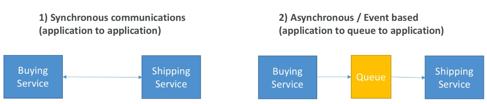

### Synchronous Communication

In synchronous communication, applications directly connect to each other.

📌 **Example:** A buying service directly connects to a shipping service. When an item is bought, the buying service tells the shipping service to ship it.

This creates a direct dependency between the two services.

### Asynchronous Communication (Event-Based)

In asynchronous communication, a middleware component (like a queue) connects the applications.

📌 **Example:** The buying service puts a message in a queue indicating that an item was bought. The shipping service checks the queue for new orders and processes them.

In this case, the buying and shipping services are not directly connected, providing decoupling.

### Synchronous vs. Asynchronous: When to Choose?

Synchronous communication can become problematic when one service overwhelms another due to sudden spikes in traffic.

📌 **Example:** A video encoding service usually encodes 10 videos but suddenly needs to encode 1,000. This can lead to outages.

When you anticipate unpredictable traffic patterns or sudden spikes, it's better to decouple your applications and use a decoupling layer that can scale.

### AWS Services for Asynchronous Communication

AWS offers several services for decoupling applications:

*   **SQS (Simple Queue Service):** For a queue-based model.
*   **SNS (Simple Notification Service):** For a publish/subscribe (pub/sub) model.
*   **Kinesis:** For real-time streaming and big data scenarios.

Using these services allows your services to scale independently. SQS, SNS, and Kinesis are designed to scale very well.

We will explore these three technologies in detail in this section.

---

## 2. Amazon SQS: Simple Queue Service

SQS (Simple Queue Service) is a fully managed queuing service used to decouple applications. At its core, SQS uses queues to store messages.

### SQS Queue Components

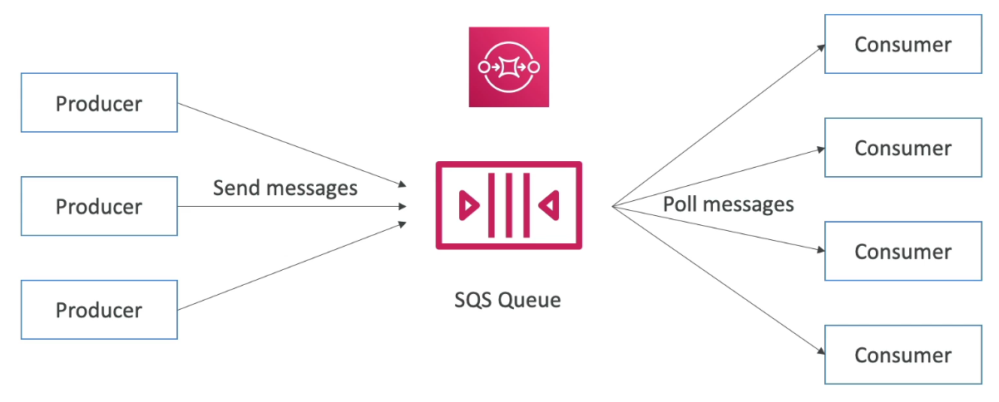

*   **Producers:** 🧑‍💻 Applications that send messages into the SQS queue. You can have one or multiple producers.
*   **Messages:** ✉️ The data sent to the queue. Messages can contain information like "process this order" or "process this video."
*   **Consumers:** ⚙️ Applications that process messages from the queue. Consumers poll the queue for messages, process them, and then delete them from the queue. You can have multiple consumers.

### SQS Standard Queues

Amazon SQS standard queues are the original SQS offering and one of the oldest services on AWS (over 20 years old). 

Amazon SQS (Simple Queue Service) was launched in 2004, making it: One of the first AWS services ever released (even before S3 and EC2). While AWS officially launched in **2006**, **SQS predates that** and is considered the **first AWS service**, dating back to **late 2004**.

*   **Decoupling:** 🔗 SQS is primarily used for application decoupling. If you see application decoupling in your exam, think SQS.
*   **Unlimited Throughput:** 🚀 No limits on the number of messages per second or the number of messages in the queue.
*   **Message Retention:** ⏳ Messages are short-lived.
    *   Default retention: 4 days
    *   Maximum retention: 14 days
    *   Messages must be read and deleted within the retention period.
*   **Low Latency:** ⚡️ Less than 10 milliseconds on publish and receive.
*   **Message Size Limit:** 📏 Messages must be less than 1024 KB per message.
*   **At Least Once Delivery:** ⚠️ Possible duplicate messages, it means that sometimes the same message might be sent multiple times (that's why it's called "at least once delivery"). You need to account for this in your application.
*   **Best-Effort Ordering:** ⚠️ Messages may arrive out of order.

### Producers in Detail

*   **Message Size:** Messages up to 1024 KB.
*   **Sending Messages:** Producers send messages to SQS using an SDK.
*   **API Call:** The API to send a message to SQS is called `SendMessage`.
    ```
    // Example: Sending a message to SQS
    SendMessageRequest send_msg_request = new SendMessageRequest()
                .withQueueUrl(queueUrl)
                .withMessageBody("hello world");
    sqs.sendMessage(send_msg_request);
    ```
*   **Message Persistence:** Messages are persisted in the queue until a consumer reads and deletes them.
*   **Use Case:** 📌 **Example:** Processing an order. Send a message with order ID, customer ID, address, etc.

### Consumers in Detail

*   **Application Type:** Consumers are applications that you write.
*   **Location:** Consumers can run on:
    *   EC2 instances (virtual servers on AWS)
    *   On-premises servers
    *   Lambda functions (serverless compute)
*   **Polling:** Consumers poll SQS for messages.
*   **Message Limit:** Consumers can receive up to 10 messages at a time.
*   **Processing:** Consumers are responsible for processing the messages (e.g., inserting orders into an RDS database).
*   **API Call:** Consumers delete messages from the queue using the `DeleteMessage` API after processing.
    ```
    // Example: Deleting a message from SQS
    String receiptHandle = result.getMessages().get(0).getReceiptHandle();
    sqs.deleteMessage(new DeleteMessageRequest(queueUrl, receiptHandle));
    ```
*   **Scaling:** You can have multiple consumers to process messages in parallel.
*   **At Least Once Delivery & Ordering:** If a message is not processed fast enough, it may be received by other consumers, leading to at-least-once delivery and best-effort ordering.

**💡Horizontal vs Vertical - Easy way to remember**
* **Vertical ( | ) = Up** (make one machine taller/stronger).
* **Horizontal ( __ ) = Out** (add more machines side by side).

We can scale consumers horizontally by adding more instances of the same consumer to improve throughput of processing.

### Auto Scaling with SQS

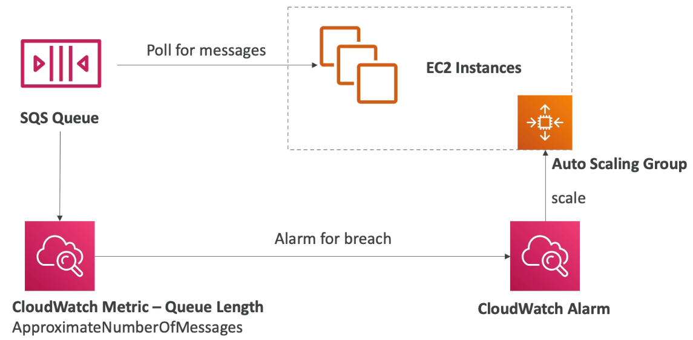

*   **Horizontal Scaling:** Increase throughput by adding more consumers.
*   **Integration with Auto Scaling Groups (ASG):** Consumers run on EC2 instances inside an ASG.
*   **Scaling Metric:** Use the `ApproximateNumberOfMessages` CloudWatch metric (Queue Length) to trigger scaling events.
*   **Alarm Setup:** Create a CloudWatch Alarm that increases the capacity of your ASG when the queue length exceeds a certain threshold.

### 🔄 Decoupling Application Tiers for Scalable Video Processing

📌 **Example Use Case:** A video processing platform like **Vimeo**, **Netflix**, **Udemy**, or **Twitch**.

When building applications that handle heavy workloads like video processing, using a **monolithic architecture** can quickly become a bottleneck. Let’s explore how decoupling the application tiers with **Amazon SQS** helps improve scalability and performance.

#### ❌ Traditional Monolithic Approach

In a monolithic setup, a single application handles everything:

* Accepting user upload requests
* Processing videos (e.g., encoding, transcoding)
* Storing final output to **Amazon S3**

⚠️ **Problem:**
This blocks the application thread, leading to slower response times and reduced scalability. Heavy processing affects user experience.

#### ✅ Decoupled Architecture with Amazon SQS

Instead of doing everything in one place, we separate the concerns using **Amazon SQS** for message queuing and asynchronous processing.

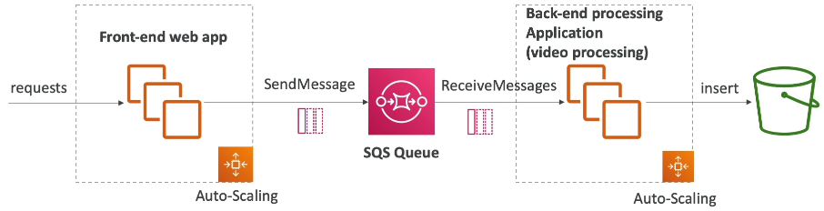

**Architecture Flow:**

1. **Frontend Tier:**

   * Accepts video upload requests.
   * Sends a message to an **SQS queue** with video metadata.
   * Returns immediately to the user, without waiting for processing.

2. **SQS Queue:**

   * Acts as a buffer to hold video processing jobs.
   * Enables retry logic and fault tolerance.

3. **Processing Tier:**

   * A set of EC2 instances (in an **Auto Scaling Group**) polls the queue.
   * Processes the videos (e.g., compression, encoding, watermarking).
   * Uploads the final output to **Amazon S3** for storage and delivery.

#### 🎯 Key Benefits

* **🚀 Independent Scaling:**
  Frontend and backend scale independently based on load.

* **⚙️ Optimized Resource Usage:**
  You can use **GPU-based EC2 instances** for the processing tier to handle encoding efficiently, while the frontend runs on lightweight compute.

* **🔁 Fault-Tolerant Workflow:**
  If a job fails, it stays in the queue for retry. No loss of data or jobs.


### SQS Security

*   **Encryption in-flight:** Use HTTPS API.
*   **Encryption at-rest:** Use KMS keys.
*   **Client-side encryption:** The client performs encryption and decryption.
*   **Access Control:**
    *   IAM policies: Regulate access to the SQS API.
    *   SQS access policies: Similar to S3 bucket policies, used for cross-account access or allowing other services (e.g., SNS, S3) to write to the queue.

---

## 3. Practicing Amazon SQS

Let's dive into practicing with Amazon SQS! 🚀

First, we'll navigate to the SQS console and create a new queue.

SQS offers two types of queues:

*   Standard Queue
*   FIFO Queue

We'll start with the **Standard Queue** and name it "Demo Queue." We'll explore FIFO queues later.

### Queue Configuration

We'll cover the following configurations in more detail in future lectures:

*   Visibility Timeout
*   Delivery Delay
*   Wait Time
*   Retention Period
*   Maximum Message Size

For now, let's set the retention period to **four days** (1 - 14 days). The maximum message size will be **1024 KB**.

### Encryption Options

SQS provides several encryption options:

*   Disable encryption altogether.
*   Enable encryption with an Amazon SQS key (SSE-SQS). This is the default.
*   Use KMS (Key Management Service).

If using KMS, you can choose a Customer Master Key (CMK).

*   You can use the default AWS CMK, aliased as `alias/AWS/SQS`.
*   You can define a data key reuse period (e.g., five minutes) to limit API calls to KMS.

For this demo, we'll stick with the default **Amazon SQS key (SSE-SQS)**.

### Access Policy

The access policy defines who can access the queue. You can configure it using the provided prompts.

*   Specify who can send messages (e.g., only the queue owner, or specific AWS accounts, IAM users, and roles).
*   Specify who can receive messages (e.g., only the queue owner, or specific AWS accounts, IAM users, and roles).

This configuration generates a JSON document similar to Amazon S3 bucket policies. It's a resource policy for SQS.

### Redrive and Dead-Letter Queue

We'll cover redrive and dead-letter queues in a later lecture. For now, we'll skip this.

Click "Create Queue" to create the queue. 🎉

### Sending and Receiving Messages

Once the queue is created, you can send and receive messages.

1.  Go to the top right-hand side and click on "Send and receive messages."
2.  You'll see panels for sending and receiving messages.

Initially, the queue will have zero messages available.

1.  Enter "hello world!" in the message body and send the message.
2.  The message is now sent and ready to be received.
3.  The number of available messages will update to one.
4.  Click "Pull for messages" to retrieve the message.

You should see the received message.

*   You'll see a message ID.
*   Click on "Message details" to view message information.

The message details include metadata such as:

*   Message hash
*   Sender information
*   Receive count
*   Size in bytes

The message body ("hello world!") is also displayed. If you had message attributes, they would be visible here as well.

The producer (sender) and consumer (receiver) are now decoupled.

📝 **Note:** If a message isn't processed within the visibility timeout (30 seconds by default), it goes back into the queue and can be received again.

To prevent reprocessing:

1.  Select the message.
2.  Click "Delete" to signal to SQS that the message has been successfully processed.

The number of available messages will return to zero.

### Sending Multiple Messages

You can send multiple messages:

1.  Enter different messages (e.g., "hello world", "hello world 2", "hello world 3").
2.  Send each message.
3.  Refresh the window to see the updated number of available messages.
4.  Click "Pull for messages" to retrieve all the messages.
5.  Select and delete the messages after processing them.

### Queue Actions

Back in the queue view, you have several options:

*   **Edit Queue:** Modify the queue's configurations.
*   **Purge Queue:** ⚠️ **Warning:** Delete all messages in the queue. You'll need to type "purge" to confirm. This is helpful for development but should be avoided in production.
*   **Monitoring:** View metrics like the number of messages in the queue and the age of the oldest message. This can be used for auto-scaling.
*   **Access Policy:** Manage who can access the queue.
*   **Encryption:** View and modify the server-side encryption settings.
*   **Dead-Letter Redrive Status:** Configure dead-letter queue settings.

That concludes our practice session with Amazon SQS! 🎉

---

## 4. SQS - Message Visibility Timeout

The **Message Visibility Timeout** in Amazon SQS is a crucial concept to understand for both practical applications and certification exams.

### 🔍 What is Message Visibility Timeout?

- When a message is **polled by a consumer**, it becomes **invisible** to all other consumers for a set duration—this is called the **visibility timeout**.
- ⏱️ **Default timeout:** 30 seconds.

📌 **Example:**
- A consumer makes a `ReceiveMessage` API call and receives a message.
- That message now enters a "visibility window" and is hidden from other consumers.
- If another consumer tries to receive messages during this period, the hidden message won’t appear.

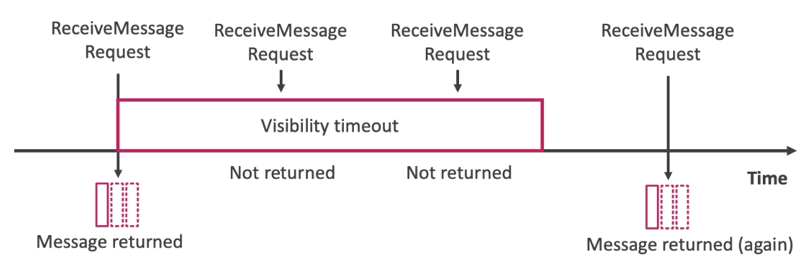

### 🧠 Why is it Important?

- During the **visibility timeout**, the message must be processed.
- If **not deleted** within this timeout:
  - It becomes **visible again** in the queue.
  - Another consumer (or the same one) may pick it up.
  - This can lead to **duplicate processing**.

⚠️ **Warning:**
- If the visibility timeout is **too high** (e.g., hours), and the consumer **crashes**, the message won’t reappear for a long time.
- If it's **too low** (e.g., a few seconds), and processing isn’t finished in time, it could lead to **multiple duplicate reads**.

### 💡 Tip: Use `ChangeMessageVisibility` API

If the consumer knows it needs more time to process the message:
- Call `ChangeMessageVisibility` to **extend the timeout**.
- This prevents the message from reappearing before it’s been fully handled.

```bash
aws sqs change-message-visibility \
  --queue-url <YourQueueURL> \
  --receipt-handle <MessageReceiptHandle> \
  --visibility-timeout <NewTimeoutInSeconds>
```

### 🛠 Demo Walkthrough

1. Open two windows: for **sending/receiving** messages.
2. In Window 1:

   * Send a message like **"hello world"**.
   * It enters the queue with the default **30s visibility timeout**.
3. In Window 1:

   * Poll and receive the message.
4. In Window 2:

   * Try polling. The message **won’t appear** (it's within visibility window).
5. Wait >30s without deleting it.
6. In Window 2:

   * Poll again, now the message **reappears**.
7. If the message is now **deleted**, it’s fully processed.

   * But check the **receive count** — it shows **2** (processed twice).

### ⚙️ Adjusting Default Visibility Timeout

* Go to **Edit** queue settings.
* Set visibility timeout anywhere from **0 seconds** (⚠️ not recommended) to **12 hours**.
* **30 seconds** is a typical default.

📝 **Note:**
Always program consumers to:

* Delete messages after processing.
* Extend visibility timeout if processing takes longer using `ChangeMessageVisibility`.

✅ Understanding the visibility timeout is key for building **reliable distributed systems** and is **frequently tested** in AWS certification exams.

---

## 5. Long Polling in Amazon SQS

Long polling is a technique used with Amazon SQS where a consumer requesting messages from a queue can wait for messages to arrive if the queue is currently empty.

Here's how it works:

1.  You have an SQS queue.
2.  Your consumer polls the queue.
3.  The consumer waits for a message to arrive. ⏳
4.  As soon as a message arrives in the queue, it's immediately sent to the consumer. 🚀

The benefits of using long polling are:

*   Reduced number of API calls: Consumers make fewer requests because each request can wait longer for a message. 📞➡️ 😴
*   Reduced latency: Messages are delivered to the consumer as soon as they arrive in the queue. ⏱️➡️💨

With long polling, your consumer is essentially making longer API calls. For 📌 **Example**, a consumer might ask the SQS queue for a message and wait for up to 10 seconds.

The wait time for long polling can be set between 1 and 20 seconds. The longer the wait time, the more efficient your polling will be, and the fewer API calls you'll make to SQS. A wait time of 20 seconds is often preferable. ⏱️

Overall, you should generally prefer long polling over short polling. You can enable long polling either at the queue level or at the API level using the `WaitTimeSeconds` parameter. ⚙️

📝 **Note:** Long polling helps optimize your SQS usage by reducing costs and improving message delivery speed.

---

## 6. Amazon SQS FIFO Queues

FIFO (First-In, First-Out) queues in Amazon SQS guarantee the order of messages. This means that the order in which messages are sent by a producer is the same order in which they are received by a consumer.

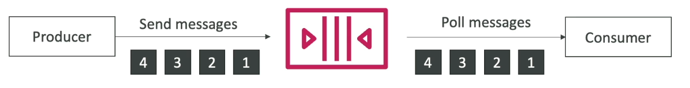

*   Producer sends messages in order: 1, 2, 3, 4
*   Consumer receives messages in order: 1, 2, 3, 4

This ordering guarantee is a key difference between FIFO and standard SQS queues, where messages may be received out of order.

Because of the ordering guarantee, FIFO queues have throughput limits:

*   300 messages per second without batching.
*   3,000 messages per second with batching.

FIFO queues offer exactly-once send capability, which removes duplicate messages at the queue level.

*   To use this, provide a deduplication ID with each message.
*   If the same ID is seen twice within a five-minute window, the duplicate is removed. 📝 **Note:** This is useful for preventing duplicates within a short timeframe.

Messages are processed in order at the message group ID level.

*   A message group ID must be included with each message sent to a FIFO queue.
*   Messages within the same group ID are guaranteed to be in order.

### Creating a FIFO Queue in the AWS Console

Let's walk through creating a FIFO queue in the AWS console.

1.  Go to the SQS console and choose to create a new queue.
2.  Select the "FIFO" queue type. This ensures first-in-first-out delivery and message ordering.
3.  Name the queue. ⚠️ **Warning:** The queue name must end with `.fifo`. For example: `DemoQueue.fifo`.
4.  Configure content-based deduplication. This automatically deduplicates messages if the same content is sent twice within a five-minute window. You may enable this option or leave it disabled.
5.  Leave the access policy, encryption, and other settings as default for this example.
6.  Create the queue.

### Sending and Receiving Messages

After creating the queue, you can send and receive messages to test the FIFO behavior.

1.  Go to the "Send and receive messages" section of the queue in the AWS console.
2.  Enter a message body. 📌 **Example:** "Hello World 1".
3.  Specify a message group ID. 📌 **Example:** "demo". Use the same group ID for all messages in this example to ensure ordering within the group.
4.  Provide a deduplication ID. 📌 **Example:** "ID1". This is used for exactly-once send.
5.  Send the message.
6.  Repeat steps 2-5 to send multiple messages with different message bodies and deduplication IDs, but the same message group ID. 📌 **Example:** "Hello World 2" with deduplication ID "ID2", and so on.
7.  Receive the messages. You should see that the messages are received in the same order they were sent. 💡 **Tip:** Check the message bodies to confirm the order.

```text
Message 1: Hello World 1
Message 2: Hello World 2
Message 3: Hello World 3
Message 4: Hello World 4
```

8.  Delete the messages after verifying the order.

If producer send the message with the same deduplication ID, the message will overwrite to the existing message. 

In a FIFO queue, the message deduplication ID is used for deduplication of sent messages. If a message with a particular message deduplication ID is sent successfully, any messages sent with the same message deduplication ID are accepted successfully **but aren't delivered during the 5-minute deduplication interval**.

### Deduplication Interval in SQS FIFO

The **deduplication interval** is a fixed **5-minute window** during which SQS uses the **Deduplication ID** (or message body hash if content-based deduplication is enabled) to prevent duplicate messages from being accepted.

If a new message with the **same Deduplication ID** arrives **within 5 minutes**, it is discarded. After 5 minutes, the same Deduplication ID is considered new, and the message is accepted.

#### 📌 Example 1: Content-Based Deduplication

1. **Send Message**

   ```
   Body: "OrderID: 12345"
   Time: 10:00
   ```

   ✅ Accepted → Message delivered.

2. **Send Again (within 5 min)**

   ```
   Body: "OrderID: 12345"
   Time: 10:02
   ```

   ❌ Discarded → considered duplicate.

3. **Send Again (after 5 min)**

   ```
   Body: "OrderID: 12345"
   Time: 10:06
   ```

   ✅ Accepted → new message delivered.

#### 📌 Example 2: Manual Deduplication ID

1. **Send First Message**

   ```
   Body: "hello1"
   Deduplication ID: 123
   Time: 10:00
   ```

   ✅ Accepted → `"hello1"` is in the queue.

2. **Send Second Message (within 5 min)**

   ```
   Body: "hello9"
   Deduplication ID: 123
   Time: 10:03
   ```

   ❌ Discarded → `"hello9"` never enters the queue.

3. **Send Again (after 5 min with same Deduplication ID)**

   ```
   Body: "hello9"
   Deduplication ID: 123
   Time: 10:06
   ```

   ✅ Accepted → `"hello9"` is **also** delivered this time in the same queue. Now both `"hello1"` and `"hello9"` are present until consumed or expired.

**Takeaway:**
* Within 5 min → only the **first message** stays.
* After 5 min → new messages with the same Deduplication ID are accepted, so you can have **multiple different messages with the same Deduplication ID coexisting in the queue**.


#### 📌 Example 3: If You Don’t Send Again

* `"hello1"` stays in the queue until it’s consumed or expires (retention period: default 4 days).
* `"hello9"` is discarded and never comes back.
* After the 5-minute interval passes, nothing changes unless you send another message.

✅ **Key Takeaway:**
The **deduplication interval is always 5 minutes**. During this time, SQS accepts only the **first message** with a given Deduplication ID and discards duplicates. After 5 minutes, the same ID can be reused and messages will be accepted again.

---

## 7. Using SQS with Auto Scaling Groups (ASG)

This section explains how to use SQS queues with Auto Scaling Groups (ASG) and the patterns this combination enables.


The core idea is to automatically scale an ASG based on the size of an SQS queue. Here's how it works:

1.  We have an SQS queue and an ASG.
2.  EC2 instances within the ASG poll for messages from the SQS queue.
3.  We monitor the `ApproximateNumberOfMessages` CloudWatch metric, which represents the number of messages in the queue.
4.  We set up a CloudWatch alarm. 📌 **Example:** If the `ApproximateNumberOfMessages` metric exceeds 1,000, the alarm triggers.
5.  The alarm triggers a scaling action in the ASG, adding more EC2 instances.
6.  The increased capacity processes messages faster, reducing the queue size.
7.  The ASG can scale up or down based on the queue size.

This setup allows for automatic scaling based on demand, ensuring messages are processed efficiently.

### Patterns Enabled by SQS and ASG

Using SQS with ASG opens up several useful patterns:

#### 1. Buffering Database Writes

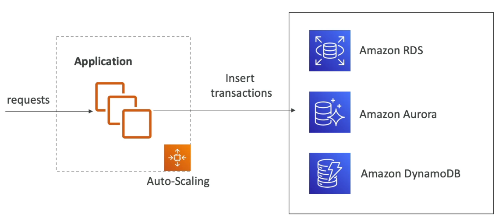

Imagine a large sale where many customers are placing orders. These orders need to be written to a database (e.g., Amazon RDS, Aurora, or DynamoDB).  If the database is overloaded, transactions may fail, leading to lost customer data.

To solve this, we can use SQS as a buffer:

1.  The application writes transaction requests to the SQS queue instead of directly to the database.
2.  SQS is infinitely scalable and won't experience throughput issues. 🚀
3.  Another ASG is created to dequeue messages from the SQS queue.
4.  The instances in this ASG insert the messages into the database.
5.  Only after a message is successfully inserted into the database is it deleted from the SQS queue.

This guarantees that every transaction will eventually be written to the database.

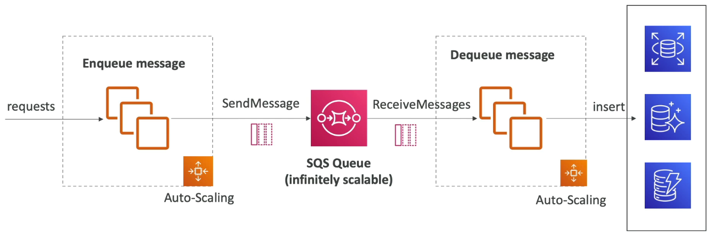

📝 **Note:** This pattern works best when the client doesn't need immediate confirmation that the write has occurred in the database. The guarantee that the write *will* happen eventually is sufficient.

#### 2. Decoupling Application Tiers

SQS can also decouple application tiers. Instead of an application processing a request and immediately sending a response, we can:

1.  Have a front-end web application receive requests.
2.  The front-end application sends the request as a message to an SQS queue.
3.  A back-end processing job receives messages from the queue and processes them.
4.  The back-end processing job can be scaled independently using an ASG.

This allows for independent scaling and improved resilience.

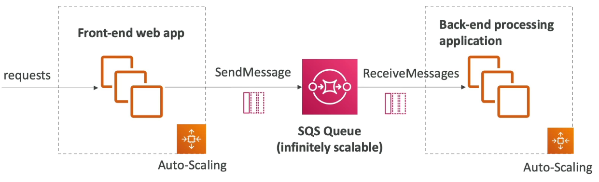

### SQS and the AWS Certified Solutions Architect Exam

SQS is a very common topic on the AWS Certified Solutions Architect exam. ⚠️ **Warning:** Be prepared to answer questions about it!

Anytime you see scenarios involving:

*   Decoupling
*   Sudden spike in load
*   Timeouts
*   The need for rapid scaling

Consider using an SQS queue. 💡 **Tip:** SQS is often the right solution in these situations.

---

## 8. Amazon SNS

Let's explore Amazon SNS (Simple Notification Service).

What if you want to send one message to many different receivers? You could have direct integrations, but this becomes cumbersome as you add more receiving services.

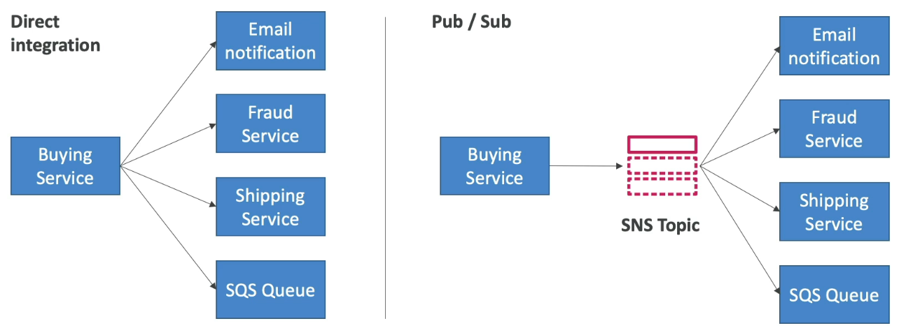

Instead, consider a Pub/Sub (Publish-Subscribe) pattern.

*   The buying service sends a message to an SNS topic.
*   The SNS topic publishes the message.
*   Subscribers to the topic receive the message.

This is a more scalable and maintainable approach.

### Key Concepts in Pub/Sub

*   **Event Producer:** Sends messages to a specific SNS topic.
*   **Event Receivers (Subscriptions):** Listen to the SNS topic for notifications.
*   Each subscriber gets all messages sent to the topic, unless message filtering is used.

### Limits

*   Up to 12,500,000+ subscriptions per topic.
*   Up to 100,000 topics per account (can be increased).

📝 **Note:** These limits are subject to change, but you won't be tested on the specific limits themselves.

### Subscribers

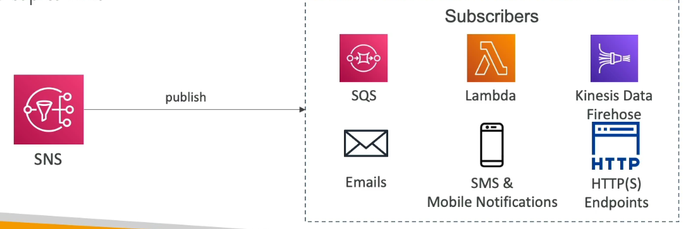

SNS can send messages to various destinations:

*   📧 Emails
*   📱 SMS and mobile notifications
*   🌐 HTTP/HTTPS endpoints
*   AWS Services:
    *   SQS (Queue)
    *   Lambda (Function)
    *   Amazon Data Firehose (e.g., to S3, Redshift)

### SNS as a Receiver

Many AWS services can send data directly to SNS topics:

*   CloudWatch Alarms
*   Auto Scaling Group notifications
*   CloudFormation state changes
*   Budgets
*   S3 buckets
*   DMS
*   Lambda
*   DynamoDB
*   RDS events

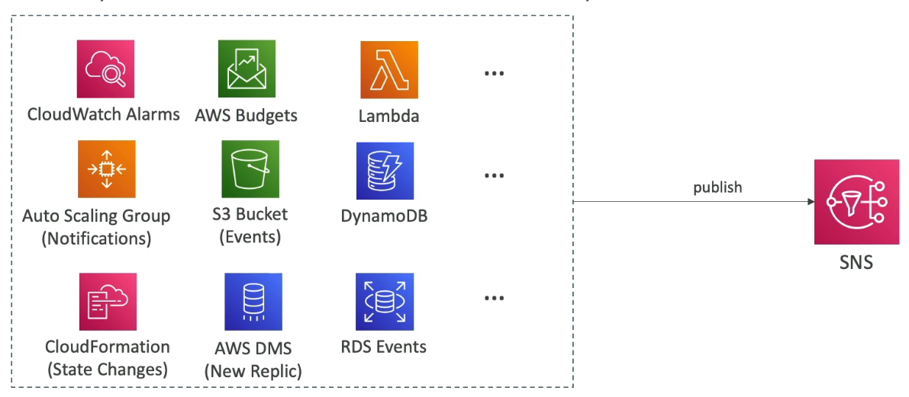

📝 **Note:** You don't need to memorize this list, but be aware that many AWS services can trigger SNS notifications.

### Publishing to SNS

To publish a message to SNS (Using the SDK):

1.  Create an SNS topic.
2.  Create one or more subscriptions to the topic.
3.  Publish to the SNS topic using the `topic.publish` SDK.

```python
# Example (Conceptual)
import boto3

sns_client = boto3.client('sns')
topic_arn = 'arn:aws:sns:REGION:ACCOUNT_ID:TOPIC_NAME'
message = 'Hello, SNS!'

response = sns_client.publish(
    TopicArn=topic_arn,
    Message=message
)

print(response)
```

All subscribers will automatically receive the message.

### Direct Publish for Mobile Apps

For mobile apps, you can use direct publish via the mobile apps SDK:

1.  Create a platform application.
2.  Create a platform endpoint.
3.  Publish to the platform endpoint.

This works with:

*   Google GCM
*   Apple APNS
*   Amazon ADM

These are different ways for mobile applications to receive notifications.

### Security

SNS has similar security features to SQS:

*   In-flight encryption by default.
*   At-rest encryption using KMS keys.
*   Client-side encryption (optional).

⚠️ **Warning:** If using client-side encryption, the client is responsible for encryption and decryption.

### Access Control

*   IAM policies are central to security. All SNS APIs are regulated by IAM policies.
*   SNS access policies (similar to S3 bucket policies) are useful for:
    *   Cross-account access to SNS topics.
    *   Allowing other services (e.g., S3 events) to write to SNS topics.

---

## 9. SNS + SQS Fan-Out Pattern 📢

The SNS plus SQS fan-out pattern allows you to send a message to multiple SQS queues efficiently. Instead of sending messages individually to each queue, which can lead to issues like application crashes, delivery failures, or difficulties adding new queues, the fan-out pattern provides a more robust solution.

The core idea is to:

1.  Push a message to an SNS topic once. 📤
2.  Subscribe multiple SQS queues to that SNS topic. 🔗

These queues, acting as subscribers, will then receive all messages sent to the SNS topic.

📌 **Example:** A buying service needs to send messages to two SQS queues: one for fraud detection and another for shipping. Instead of sending messages directly to each queue, the buying service sends a single message to an SNS topic. The fraud and shipping services have their SQS queues subscribed to this topic, allowing them to receive and process the message independently.

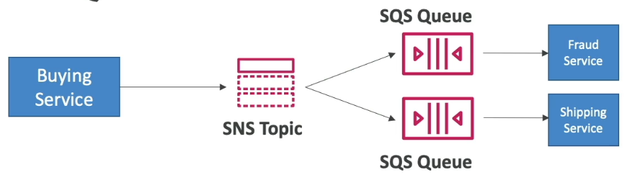

This approach offers several advantages:

*   Fully decoupled model. 🧩
*   No data loss (SQS provides data persistence). 💾
*   Delayed processing and retries are handled by SQS. ⏳
*   Easy to add more SQS queues as subscribers over time. ➕

⚠️ **Warning:** Ensure your SQS queue access policy allows the SNS topic to write to the SQS queue. This is crucial for the pattern to function correctly.

Cross-region delivery is also possible, allowing an SNS topic in one region to send messages to SQS queues in other regions, provided the security configuration permits it. 🌍

### Application: S3 Events into Multiple Queues 🪣➡️📢➡️📦

The fan-out pattern can also be used to overcome limitations with S3 event rules.

📝 **Note:** S3 event rules have a limitation: for a specific combination of event type (e.g., object creation) and prefix (e.g., `images/`), you can only have one S3 event rule.

If you need to send the same S3 event notification to multiple SQS queues, the fan-out pattern is the solution.

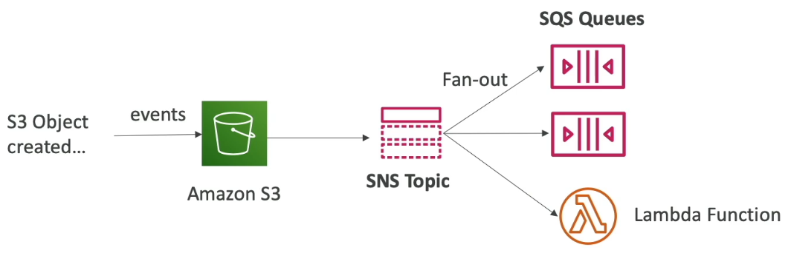

1.  Configure an S3 event to send notifications to an SNS topic. 📤
2.  Subscribe multiple SQS queues to the SNS topic. 🔗

📌 **Example:** When an object is created in an S3 bucket, the event is sent to an SNS topic. Multiple SQS queues are subscribed to this topic, allowing different services to process the event. You can also subscribe other applications like email or Lambda functions.

This ensures that the S3 event message reaches multiple destinations. 🎯

### Application: SNS to S3 via Amazon Data Firehose 📢➡️🔥➡️🪣

You can also send data directly from SNS to Amazon S3 using Amazon Data Firehose (KDF).

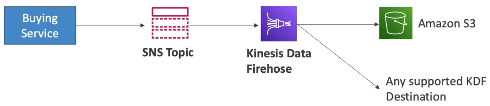

Since SNS integrates directly with KDF:

1.  The buying service sends data to an SNS topic. 📤
2.  Amazon Data Firehose receives the data from the SNS topic. 🔥
3.  KDF then delivers the data to your Amazon S3 bucket (or any other supported KDF destination). 📦

This provides a flexible way to persist messages from your SNS topic.

### Fan-Out with FIFO Topics 📢 FIFO

The fan-out pattern can also be applied to FIFO (First-In, First-Out) topics in SNS.

SNS FIFO provides message ordering within the topic.

*   Producers send messages in a specific order (e.g., 1, 2, 3, 4). 🔢
*   Subscribers (currently only SQS FIFO queues) receive messages in the same order (1, 2, 3, 4). 📦

SNS FIFO offers the same features as SQS FIFO:

*   Ordering by message group ID. 🗂️
*   Deduplication using a deduplication ID or content-based deduplication. 🆔

Both SQS standard and FIFO queues can be subscribers.

📝 **Note:** Throughput is limited to the same throughput as SQS FIFO queues.

The main use case for SNS FIFO is when you need fan-out, ordering, and deduplication with SQS FIFO queues.

📌 **Example:** A buying service sends data to an SNS FIFO topic, which then fans out to two SQS FIFO queues for the fraud and shipping services. This ensures that messages are processed in the correct order.

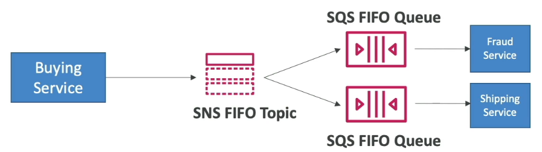

### Message Filtering in SNS ✉️

SNS offers message filtering, which allows you to filter messages sent to SNS topic subscriptions based on a JSON policy.

*   If a subscription doesn't have a filter policy, it receives every message (default behavior). ✉️

📌 **Example:** A buying service sends transaction data to an SNS topic. The transaction data includes information like order number, product, quantity, and state.

```json
{
  "order_number": "12345",
  "product": "pencil",
  "quantity": 4,
  "state": "Placed"
}
```

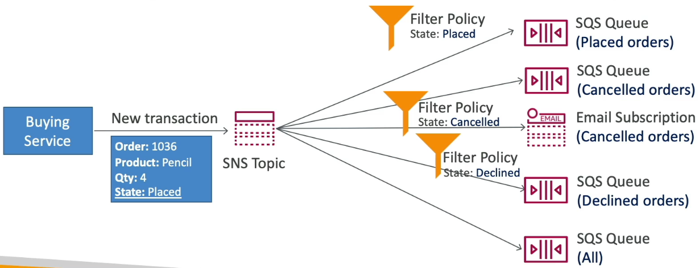

You can create an SQS queue specifically for "Placed" orders.

1.  Subscribe the SQS queue to the SNS topic. 🔗
2.  Apply a filter policy in JSON to the subscription, specifying that `State` must equal `"Placed"`. ⚙️

```json
{
  "State": ["Placed"]
}
```

Only messages matching the filter policy will be delivered to the SQS queue.

You can create different filter policies for different SQS queues (e.g., "Canceled" orders). You can also use the same filter policy for other subscriptions, such as email notifications.

An SQS queue without a filter policy will receive all messages from the SNS topic.

By combining fan-out patterns, message filtering, and FIFO queues/topics, you can create highly flexible and efficient messaging architectures. 🏗️

---

## 10. Practicing with SNS

Let's walk through a hands-on example of using the Simple Notification Service (SNS).

First, we'll create an SNS topic:

1.  Navigate to the Simple Notification Service in the AWS Management Console.
2.  Click on "Create topic".
3.  Enter a name for your topic. 📌 **Example:** `MyFirstTopic`.
4.  Click "Next step".

You'll then need to choose the topic type. There are two options:

*   Standard
*   FIFO

### Standard Topic

*   Best-effort message ordering.
*   At least once message delivery.
*   Highest throughput in terms of publishes per second.
*   Supports SQS, Lambda, HTTPS, SMS, email, and mobile application endpoints as subscribers.

### FIFO (First-In, First-Out) Topic

*   Strictly preserved message ordering.
*   Exactly once message delivery.
*   High throughput (up to 300 publishes per second).
*   Only SQS queues can subscribe to FIFO SNS topics.
*   📝 **Note:** The topic name must end with `.fifo`. 📌 **Example:** `MyFirstTopic.fifo`.

For this example, we'll use a standard topic.

1.  Select "Standard".
2.  Enter `MyFirstTopic` as the name.
3.  You can encrypt messages and set up an access policy. The access policy defines who and what can write to the SNS topic. This is similar to S3 bucket policies and SQS queue policies.
4.  📌 **Example:** You can configure an S3 bucket to write events to an SNS topic, which then sends data to SQS. The access policy allows the S3 bucket to write to the SNS topic.
5.  For now, choose the "Basic" access policy.
6.  Click "Create topic".

Now that the topic is created, we need to create a subscription.

1.  Click on "Create subscription".
2.  Choose a protocol. Available protocols include: Amazon Data Firehose, SQS, Lambda, Email, Email-JSON, HTTP, HTTPS, and SMS. ⚠️ **Warning:** Remember these for the exam!
3.  For this hands-on, we'll use "Email".
4.  Enter an email address as the endpoint. 📌 **Example:** `vikas9dev@mailinator.com`. Mailinator is a service for temporary email addresses. You can use your gmail address also.
5.  You can set up a subscription filter policy (optional). This policy filters messages sent to the subscription. This is helpful if subscribers only need a subset of messages.
6.  Click "Create subscription".

The subscription is now pending confirmation. To confirm it:

1.  Go to your email inbox (e.g., Mailinator).
2.  Find the confirmation email from AWS.
3.  Click the "Confirm subscription" link.
4.  Refresh the SNS console page. The subscription status should now be "Confirmed".

Now let's test the setup by publishing a message:

1.  Click on "Publish message".
2.  Enter a message. 📌 **Example:** `"hello world"`.
3.  Click "Publish message".

Check your email inbox. You should receive an email from AWS containing the message "hello world". 🎉

If you want to implement the SQS fanout pattern, use SQS as the protocol and set up multiple queues as subscribers to the SNS topic.

Finally, to clean up:

1.  Delete the subscription.
2.  Go back to the topic.
3.  Click "Delete".
4.  Type "delete me" to confirm.

That's it for SNS! 🚀

---

## 11. Kinesis Data Streams

Kinesis Data Streams is a service used to collect and store streaming data in **real time**. This is the key aspect to remember for the exam.

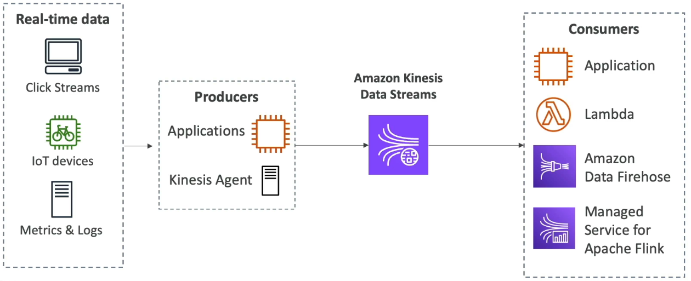

Here's a breakdown:

*   Real-time data is data created and used immediately.
*   📌 **Example:**
    *   Clickstreams (user clicks on a website)
    *   Data from connected devices (e.g., a connected bicycle)
    *   Metrics and logs from servers

To send data into Kinesis Data Streams, you need **producers**:

*   Producers can be:
    *   Applications: You'll need to write code to send data from your website or devices.
    *   Kinesis Agent: Install this on your servers to act as a producer for metrics and logs.

Data is sent in real time to Kinesis Data Streams, allowing **consumer applications** to leverage it immediately.

*   Consumers can be:
    *   Applications (requiring custom code to read from Kinesis Data Streams)
    *   Lambda functions
    *   Amazon Data Firehose (covered in a later lecture)
    *   Managed Service for Apache Flink (for stream analytics)

### Key features of Kinesis Data Streams

*   Data retention: Data can be retained for up to 365 days.
*   Reprocessing: You can reprocess or replay data due to its persistence.
*   ⚠️ **Warning:** Once data is sent, you cannot delete it; you must wait for it to expire.
*   Data size: Up to 1 MB of data can be sent. However, it's typically used for small, real-time data.
*   Data ordering: Data is ordered if data points share the same Partition ID. This indicates a temporal relationship.
*   Security: KMS encryption at rest and HTTPS encryption in flight.

For optimized applications:

*   💡 **Tip:** For high-throughput producer applications, use the Kinesis Producer Library (KPL).
*   💡 **Tip:** For optimized consumer applications, use the Kinesis Client Library (KCL).

Capacity Modes:

1.  **Provisioned Mode:**

    *   You choose the number of **shards** for your stream.
    *   A shard determines the stream's capacity.
    *   More shards = more throughput.
    *   Capacity per shard:
        *   Inbound: 1 MB/second or 1,000 records/second
        *   Outbound: 2 MB/second
    *   📌 **Example:** To send 10,000 records/second or 10 MB/second, you need 10 shards.
    *   You can manually scale the number of shards up or down.
    *   Monitor throughput to determine the appropriate number of shards.
    *   Payment is per shard provisioned per hour.

2.  **On-Demand Mode:**

    *   No need to provision or manage capacity.
    *   Default capacity: Approximately 4,000 records/second or 4 MB/second inbound.
    *   Kinesis Data Streams automatically scales based on observed throughput over the past 30 days.
    *   Payment is per stream per hour, billed based on data going in and out.

---

## 12. Kinesis Data Streams Practice

Let's practice using Kinesis Data Streams. We'll create a stream, send data to it, and then consume that data.

First, navigate to the Kinesis service in the AWS console. You'll see three options: 
- Data Streams
- Data Firehose
- Data Analytics. 
 
We're focusing on Data Streams for now.

Pricing is per shard, at $0.015 per hour, plus the cost of PUT requests to send data into the stream.

### Creating a Data Stream

1.  Name the stream: `DemoStream`.
2.  Define the data stream capacity. There are two modes:
    *   **On-demand mode:** Automatically scales, with a maximum throughput of 200 MiB/s and 200,000 records/second (WRITE capacity), and a maximum READ capacity of 400 MiB/s per consumer (using enhanced Fan-Out). Pay-per-throughput pricing. ⚠️ **Warning:** No free tier.
    *   **Provisioned mode:** You provision shards. Use the Shard estimator tool to determine the number of shards needed based on records per second, record size, and number of consumers. ⚠️ **Warning:** No free tier.
3.  For this demo, we'll use one shard (provisioned mode).
    *   One shard provides 1 MiB/s for writes and 2 MiB/s for reads.
    *   Adding more shards multiplies the throughput accordingly.
4.  Click "Create data stream".
    *   ⚠️ **Warning:** You will incur costs for the shard, even if you delete it quickly. If you do not want to pay any money, then do not do this hands on.

### Producers and Consumers

Once the stream is created, you'll see options for producers and consumers.

*   **Producers:**
    *   Recommended options: Kinesis Agents, SDK, or Kinesis Producer Library (KPL).
    *   These are available on GitHub.
    *   Kinesis Agents: Stream data from application servers.
    *   SDK: Develop producers at a low level.
    *   KPL: Develop producers at a high level with a better API.
*   **Consumers:**
    *   Kinesis Data Analytics, Amazon Data Firehose, Kinesis Client Library (KCL), or Lambda.

You can monitor the stream's metrics, such as the number of records being sent. You can also scale the stream by adjusting the number of shards. However, you can only **double** the number of shards in one operation so you would go from 1 shard to 2 shards, not to 5. Enhanced Fan-Out can be configured for consumer applications.

For this demo, we'll use the SDK for producing and consuming. We will use the [Kinesis Data Stream](/resources/kinesis/kinesis-data-streams.sh) script for this demo.

### Using the AWS CLI with CloudShell

1.  Open AWS CloudShell (icon next to the bell icon).
    *   Alternatively, you can use your own terminal if it's preconfigured.
    *   CloudShell is free on AWS.
2.  Determine your AWS CLI version:
    ```bash
    aws --version
    ```
    *   CloudShell typically uses CLI version 2.
3.  We'll use CLI commands version two.

### Sending Data to the Stream

We'll use the `put-record` API to send data.

```bash
aws kinesis put-record \
    --stream-name DemoStream \
    --partition-key user1 \
    --data "Users signup" \
    --cli-binary-format raw-in-base64-out
```

*   Replace `DemoStream` with your stream name.
*   `partition-key`: Data with the same partition key goes to the same shard.
*   `data`: The data to send.
*   `--cli-binary-format raw-in-base64-out`: Required for text data.

CloudShell is automatically configured with your IAM credentials and region.

After running the command, you'll receive a successful message with the shard ID and sequence number.

📌 **Example:**

```json
{
    "ShardId": "shardId-000000000000",
    "SequenceNumber": "49665696174892641602935845937449757056593689585356111874"
}
```

Send a few more messages with different data (e.g., "User login", "User logout").

If you wait a bit and check the stream metrics in CloudWatch, you'll see the `PutRecord` count increase.

### Consuming Data from the Stream

1.  Describe the stream to get information about its shards:
    ```bash
    aws kinesis describe-stream --stream-name DemoStream
    ```
    📝 **Note:** You need the shard ID to consume data.
2.  Consume data using the `get-shard-iterator` and `get-records` APIs.
    *   Get the ShardIterator:
        ```bash
        aws kinesis get-shard-iterator \
            --stream-name DemoStream \
            --shard-id shardId-0000000000000 \
            --shard-iterator-type TRIM_HORIZON
        ```
        *   Replace `DemoStream` with your stream name and `shardId-0000000000000` with your shard ID.
        *   `--shard-iterator-type TRIM_HORIZON` reads from the beginning of the stream.
        *   The other option is `LATEST` to only receive the records from that very moment onwards when from a new launched CLI command.
    *   Get records using the ShardIterator:
        ```bash
        aws kinesis get-records --shard-iterator <ShardIterator>
        ```
        *   Replace `<ShardIterator>` with the ShardIterator value from the previous command.

This consumption mode uses shared consumption and not enhanced Fan-Out. For enhanced Fan-Out, use the Kinesis Client Library (KCL).

The output will contain a batch of records. The data is base64-encoded.

📌 **Example:**

```json
{
    "Records": [
        {
            "SequenceNumber": "49665696174892641602935845937449757056593689585356111874",
            "ApproximateArrivalTimestamp": "2025-07-31T15:10:01.093000+00:00",
            "Data": "VXNlcnMgc2lnbnVw",
            "PartitionKey": "user1"
        },
        {
            "SequenceNumber": "49665696174892641602935845937450965982413311430075875330",
            "ApproximateArrivalTimestamp": "2025-07-31T15:11:47.088000+00:00",
            "Data": "VXNlcnMgbG9naW4=",
            "PartitionKey": "user1"
        },
        {
            "SequenceNumber": "49665696174892641602935845937455801685691770221652606978",
            "ApproximateArrivalTimestamp": "2025-07-31T15:11:50.655000+00:00",
            "Data": "VXNlcnMgbG9nb3V0",
            "PartitionKey": "user1"
        }
    ],
    "NextShardIterator": "AAAAAAAAAAFGX+v11P56QhxWoK/WUmspvmJxNThTIZdpvt5yaCwjiahxoiX4QedEebQVb4V2DXAgESHR7OKXTzBV9hfKQfpnxeZgrD+FGhPXzeTZDfn75vkDZgQvRjO6hdtS9yNK6AQ1MKPSbUWoQAHftisJz+zVMnAGMk/Gc3L1Rp71VzGY3irsVl/YhaSFrwOhCQtzjYckywMLOfJksRneqj/2BQA7RLCbbBc93F+T7CYBI6yUvA==",
    "MillisBehindLatest": 0
}
```

To decode the data, use an online base64 decoder.

📌 **Example:**

*   `VXNlcnMgc2lnbnVw` decodes to "User signup".
*   `VXNlciBsb2dpbg==` decodes to "User login".

The output also contains a `NextShardIterator`. Use this in subsequent `get-records` calls to continue consuming from where you left off.

💡 **Tip:** You need to iterate through the `NextShardIterator` in your code to consume all the data.

We've now successfully produced and consumed data from a Kinesis Data Stream using the AWS CLI and CloudShell! 🎉

Keep the stream open for the next lecture on Amazon Data Firehose.

---

## 13. Amazon Data Firehose

Amazon Data Firehose is a service designed to send data from various sources to target destinations. Let's explore how it works:

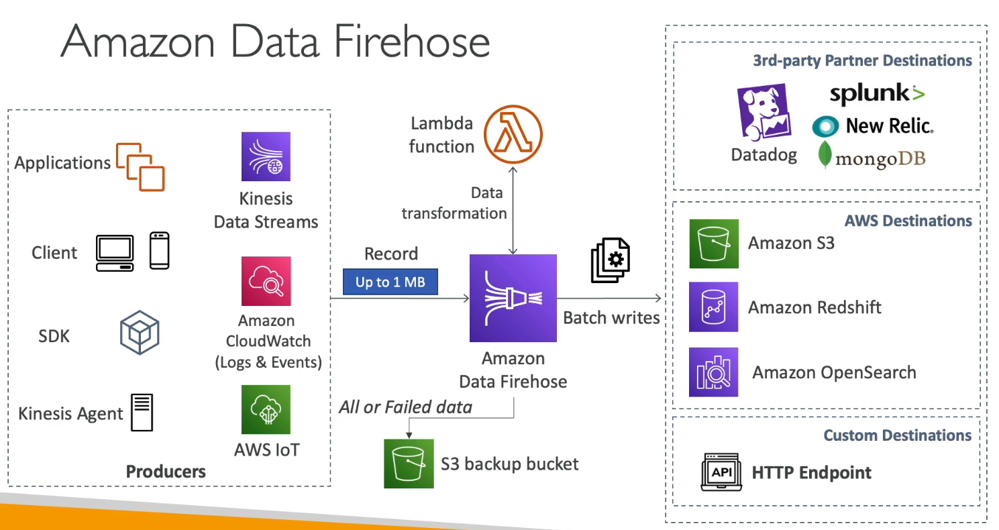

**Data Ingestion:**

*   Producers (applications, clients, custom code) use the SDK to send data to Firehose.
*   Kinesis agents can also be used.
*   Firehose can pull data directly from services like:
    *   Kinesis Data Streams
    *   Amazon CloudWatch Logs and Events
    *   AWS IoT

**Data Transformation (Optional):**

*   Records received by Firehose can be transformed using a Lambda function. This is useful for data conversion or formatting. 📌 **Example:** Converting CSV to JSON.

**Buffering and Batch Writing:**

*   Records are accumulated into a buffer.
*   The buffer is flushed periodically to write data in batches to various destinations.

**Destinations:**

*   **AWS Destinations:**
    *   Amazon S3 🗄️
    *   Amazon Redshift 📊 (for analytics)
    *   Amazon OpenSearch 🔍
*   **Third-Party Partner Destinations:**
    *   Datadog
    *   Splunk
    *   New Relic
    *   MongoDB
*   **Custom Destinations:**
    *   HTTP Endpoint Integration: Allows sending data to any destination.

**Backup:**

*   Firehose can write all data or only failed data to an S3 bucket for backup purposes.

**Key Features:**

*   Formerly known as Kinesis Data Firehose (but now called Amazon Data Firehose).
*   Fully managed service. Supports:- 
    *   Amazon Redshift, Amazon S3, Amazon OpenSearch Service
    *   3rd party: Datadog, Splunk, MongoDB, New Relic
    *   Custom HTTP endpoints.
*   Automatic scaling.
*   Serverless
*   Pay-per-use model.
*   Near real-time service. 💡 **Tip:** Remember this for the exam!

**Near Real-Time Explanation:**

*   Firehose uses a buffer that can be configured based on size or time.
*   Data is accumulated in the buffer and then flushed to the destination.
*   This buffering process introduces a slight delay, making it "**near real-time**."

**Supported Data Types:**

*   CSV
*   JSON
*   Parquet
*   Avro
*   Text
*   Binary

**Data Conversion and Compression:**

*   Firehose can convert data to Parquet or ORC formats.
*   Compression options include gzip and snappy.
*   For custom conversions or transformations, use AWS Lambda.

**Comparison: Kinesis Data Streams vs. Amazon Data Firehose**

| Feature             | Kinesis Data Streams                               | Amazon Data Firehose                                  |
| ------------------- | -------------------------------------------------- | ----------------------------------------------------- |
| Purpose             | Streaming data collection                            | Loading streaming data into target destinations        |
| Code                | Requires writing producer and consumer code        | Fully managed                                         |
| Real-time           | Real-time                                          | Near real-time                                        |
| Scaling             | Provisioned and On-Demand Modes                      | Automatic Scaling                                     |
| Data Storage        | Up to one year                                     | No data storage                                       |
| Replay Capability   | Yes                                                | No                                                    |

📝 **Note:** Understanding the differences between Kinesis Data Streams and Firehose is crucial.

---

## 14. Practicing with Amazon Data Firehose

Let's walk through using Amazon Data Firehose with Amazon Data Firehose. Documentation: [What is Amazon Data Firehose?](https://docs.aws.amazon.com/firehose/latest/dev/what-is-this-service.html)

First, navigate to the Amazon Data Firehose console and click on "Amazon Data Firehose".

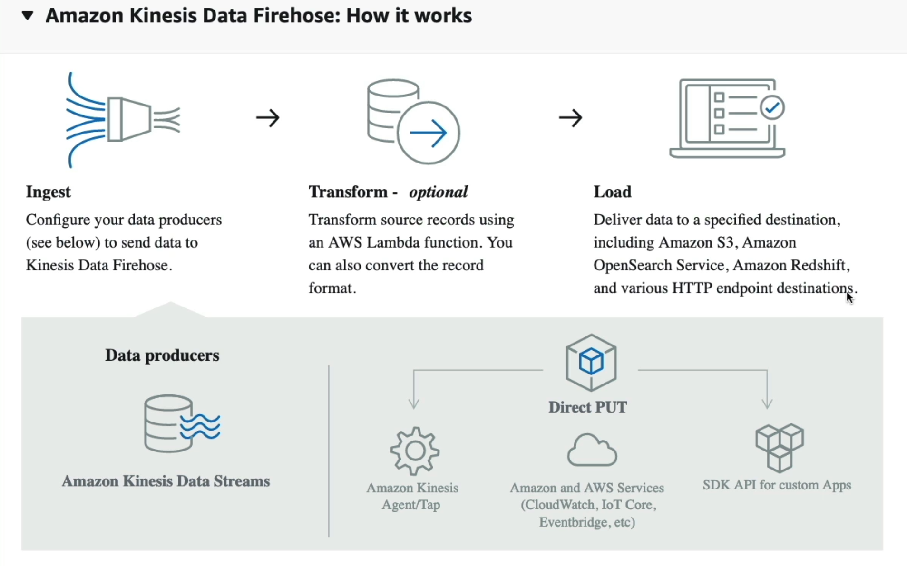

You'll see a detailed diagram of how Amazon Data Firehose works:

*   Data is ingested from producers. These producers can be:
    *   A Kinesis Data Stream (our use case).
    *   Direct PUTs through Kinesis Data Agents.
    *   Other AWS services (CloudWatch, IoT Core, EventBridge, etc.).
    *   Your own applications using the SDK.
*   Optionally, the data can be transformed using a Lambda function. This can be used for:
    *   Converting the record format.
    *   Filtering data.
    *   Uncompressing data.
    *   Processing source records.
*   Finally, the data is loaded into target stores:
    *   Amazon S3.
    *   Amazon OpenSearch Service (formerly ElasticSearch).
    *   Amazon Redshift.
    *   Various HTTP endpoint destinations.

📌 **Example:** In this example, the source will be a Kinesis Data Stream, and the destination will be Amazon S3.

It's important to remember the main target stores: OpenSearch Service (ElasticSearch), Redshift, and S3. There are also third-party services and custom HTTP Endpoints available as destinations.

### Creating a Data Firehose

1.  Choose Amazon S3 as the destination.
2.  For the source, browse and choose your Kinesis Data Stream.
    📌 **Example:** The ARN DemoStream is used in the example.
3.  The Data Firehose name is automatically generated.
4.  Next, configure the "Transform and convert records" section. This step is optional.

### Transforming Records with Lambda

You can transform source records using Lambda functions. These functions allow you to transform, filter, un-compress, convert, and process source records before delivery.

💡 **Tip:** Lambda functions are pieces of code that you can run in AWS to perform custom operations on your data.

If you enable transformation, you need to choose a Lambda function.

### Converting Record Format

You can convert the record format into Parquet or ORC based on advanced options. This is useful depending on where you are sending your data.

📝 **Note:** This is covered in more detail in the AWS Data and Analytics certification. For now, just remember that you can convert record formats.

### Choosing a Destination

1.  Choose an S3 bucket. You can use an existing one or create a new one.
    📌 **Example:** The bucket `demo-firehose-aws-v3` is used.
2.  Decide whether to use dynamic partitioning. In this example, it's set to "no".
3.  Configure the S3 bucket prefix. This is optional.
4.  Configure a bucket error output prefix. This is also optional.

### Buffer Hints, Compression, and Encryption

These settings are important for optimizing performance and cost.

*   **Buffer Hints:** The buffer is a way for Amazon Data Firehose to accumulate records before delivering them to the target (Min: 1 MiB, Max: 128 MiB).
    *   By default, Kinesis will write 5 MiB of data into the buffer before delivering it to Amazon S3.
    *   You can adjust the buffer size for efficiency or speed.
        *   Larger buffer size (e.g., 128 MiB) for more efficiency.
        *   Smaller buffer size for faster delivery.
    *   The buffer interval determines how often the buffer is flushed to the target, even if the buffer size isn't full (Min:0 seconds, Max:900 seconds).
        *   If you choose 300 seconds, you'll wait 5 minutes to fill the buffer. If the buffer isn't full after 5 minutes, it will be flushed anyway.
        *   A lower buffer interval (e.g., 60 seconds) guarantees that the buffer will be flushed at least every 60 seconds.
        *   A longer buffer size (e.g., 900 seconds) means waiting 15 minutes before the buffer is flushed.
    *   📌 **Example:** For the demo, a buffer interval of 60 seconds (the minimum) is chosen for speed.
*   **Compression:** You can compress the records in the target (e.g., with GZIP, Snappy, Zip, or Hadoop-Compatible Snappy) to save space and reduce costs. Keep default (Not Enabled).
*   **Encryption:** You can choose to encrypt your records. Keep default.

### Permissions (Server Access)

The creation process automatically creates an IAM role with the necessary permissions to write to Amazon S3 and read from the Kinesis Data Stream. This role is essential for Amazon Data Firehose to access the target buckets and the source data stream. If the role already exist, you can choose to use it.

Create the Firehose stream. Wait a few seconds if you just created/updated the role — IAM changes might take a few seconds to propagate.

### Testing the Firehose Stream

1.  After creating the firehose stream, it will be in an "Active" state. 
2.  You can view metrics to monitor the data flow.
3.  You can also check the configuration and error logs in CloudWatch Logs.

To test the stream, send data to the Kinesis Data Stream.

📝 **Note:** Even if data was sent to the Kinesis Data Stream before setting up Firehose, you need to send new data after setting up Firehose for it to become active.

1.  Use CloudShell to send data to the Kinesis Data Stream.
2.  Modify the command to use the correct stream name.
    📌 **Example:** The stream name is `DemoStream`.

```bash
aws kinesis put-record \
    --stream-name DemoStream \
    --partition-key user1 \
    --data "Users signup" \
    --cli-binary-format raw-in-base64-out
```
3.  Send sample data (e.g., user signup, user login, user logout).  

After sending the data, check the S3 bucket to see if the data has appeared.

It may take up to the buffer interval (e.g., 60 seconds) for the data to appear in S3.

### Verifying the Data in S3

1.  Go to the S3 console.
2.  Find your bucket.
3.  Refresh the bucket contents.
4.  You should see new objects partitioned by date.
5.  Open the record and view the data in a text editor.

You should see the data that was sent to the Kinesis Data Stream (e.g., user signup, user login, user logout) in the text file.

### Cleaning Up

To avoid incurring costs, it's important to delete the resources after testing.

1.  Delete the Data Firehose. You'll need to type in the name to confirm the deletion.
2.  ⚠️ **Warning:** Delete the Kinesis Data Stream itself. Leaving it running will cost you money every hour.

---

## 15. SQS vs. SNS vs. Kinesis: Key Differences

It's crucial to understand the distinctions between SQS, SNS, and Kinesis. Here's a breakdown:

### SQS (Simple Queue Service)

*   Model: Consumers **pull** data by requesting messages from the SQS queue. 📥
*   Processing: Once processed, the consumer **must delete** the message from the queue to prevent reprocessing. 🗑️
*   Scalability: Supports numerous workers (consumers) collaborating to consume and delete messages. 🧑‍🤝‍🧑
*   Throughput: Managed service that scales rapidly to handle hundreds of thousands of messages without pre-provisioning. 🚀
*   Ordering: Ordering guarantees are available only with FIFO (First-In, First-Out) queues. ⏳
*   Message Delay: Individual messages can be delayed, appearing in the queue after a specified time (e.g., 30 seconds). ⏱️

### SNS (Simple Notification Service)

*   Model: **Pub/Sub** (Publish-Subscribe). Data is **pushed** to multiple subscribers, each receiving a copy of the message. 📢
*   Subscribers: Supports up to 12,500,000 subscribers per SNS topic. 👥
*   Persistence: Data is **not persistent**. If delivery fails, the message may be lost. ⚠️
*   Scalability: Scales to hundreds of thousands of topics without pre-provisioning. 📈
*   Fan-Out: Can be combined with SQS using the fan-out pattern. SNS FIFO topics can also be combined with SQS FIFO queues. 🔗

### Kinesis

*   Consumption Modes:
    *   Standard: Consumers **pull** data from Kinesis (2 MB/second per shard). ⬇️
    *   Enhanced Fan-Out: Kinesis **pushes** data to consumers (2 MB/second per shard per consumer), offering higher throughput and support for more applications. ⬆️
*   Replay: Data can be replayed because it's persisted within the Kinesis data stream. ⏪
*   Use Cases: Real-time big data analytics and ETL (Extract, Transform, Load). 📊
*   Ordering: Ordering is guaranteed at the shard level. 🗂️
*   Shards: The number of shards per Kinesis data stream must be specified in advance. Scaling shards is a manual process. ⚙️
*   Data Retention: Data expires after a set period (typically between 1 and 365 days). 🗓️
*   Capacity Modes:
    *   Provisioned: You specify the number of shards in advance. 🔢
    *   On-Demand: Kinesis automatically adjusts the number of shards. 🤖

---

## 16. Amazon MQ

Amazon MQ is a managed message broker service provided by AWS. It's designed to help you migrate traditional applications to the cloud without needing to re-engineer them to use SQS or SNS protocols.

Here's a breakdown:

*   SQS and SNS are cloud-native services using proprietary AWS protocols and APIs.
*   Traditional on-premises applications often use open protocols like MQTT, AMQP, STOMP, Openwire, and WSS.
*   Amazon MQ supports these open protocols, allowing you to continue using them when migrating to the cloud.

Amazon MQ simplifies the process by offering managed message brokers for two key technologies:

*   RabbitMQ
*   ActiveMQ

These technologies are commonly used on-premises and provide access to the open protocols mentioned above. Amazon MQ provides a managed version of these brokers in the cloud.

📝 **Note:** Amazon MQ doesn't scale as much as SQS or SNS, which offer virtually infinite scaling. Because it runs on servers, you might encounter server-related issues.

To ensure high availability, you can configure a multi-AZ setup with failover.

Amazon MQ offers both queue (similar to SQS) and topic (similar to SNS) features within a single broker.

### High Availability with Amazon MQ

Let's examine how high availability is achieved using Amazon MQ.

1.  Consider a region, such as `us-east-1`, with two Availability Zones (AZs): `us-east-1a` and `us-east-1b`.
2.  You'll have an Amazon MQ broker in each AZ, with one designated as active and the other as standby.
3.  For failover to function correctly, you must use Amazon EFS (Elastic File System) as your backend storage.

    *   EFS is a network file system that can be mounted across multiple AZs.

4.  During a failover event:

    *   The standby broker mounts the Amazon EFS volume.
    *   The standby broker gains access to the same data as the original active broker.
    *   The failover process occurs seamlessly.

If a client is communicating with the Amazon MQ broker and a failover happens, the data remains safe and consistent thanks to Amazon EFS.

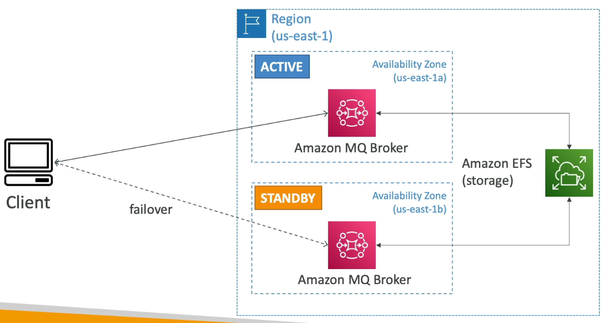

📌 **Example:**

Imagine your client is sending messages to the active broker in `us-east-1a`. If that broker fails, the standby broker in `us-east-1b` automatically takes over, accessing the latest messages from the shared EFS volume.

```
# Simplified illustration of failover

# Initial state:
# Active broker: us-east-1a (connected to EFS)
# Standby broker: us-east-1b (connected to EFS)

# Failover event:
# us-east-1a fails
# us-east-1b becomes active, continuing from the last state on EFS
```

---

## 17. Q & A

### ❓ Question 1

You have an e-commerce website and you're preparing for **Black Friday**, the biggest sale of the year. You expect traffic to increase **by 100x**. Your site is already using an **SQS Standard Queue**, and you're running a fleet of **EC2 instances in an Auto Scaling Group** to consume SQS messages.

**What should you do to prepare your SQS queue?**

#### **Options:**

* 🅐 Contact AWS Support to pre-warm your SQS Standard Queue
* 🅑 Enable Auto Scaling in your SQS queue
* 🅒 Increase the capacity of the SQS queue
* 🅓 Do nothing, SQS scales automatically 

<details>

<summary>Explanation</summary>

* **Amazon SQS (Standard Queue)** is a **fully managed, serverless** messaging queue that **scales automatically** and **nearly infinitely**.
* It doesn't require manual pre-scaling, capacity adjustments, or pre-warming—even if message throughput surges suddenly (like during Black Friday).
* Your application (consumers, e.g., EC2 in Auto Scaling Groups) must scale appropriately to handle increased message volume, but the **SQS queue itself will handle the load**.

**Correct Answer:** **Do nothing, SQS scales automatically** ✅ *(Correct)*

#### **Why Other Options Are Incorrect**

| Option                              | Reason                                                                                                                                          |
| ----------------------------------- | ----------------------------------------------------------------------------------------------------------------------------------------------- |
| 🅐 **Pre-warming SQS**              | SQS Standard Queues do not require pre-warming. This is something that used to be needed in older services like DynamoDB or some ALBs, not SQS. |
| 🅑 **Enable Auto Scaling in queue** | Auto Scaling is for compute resources (like EC2), **not queues**. Queues scale automatically.                                                   |
| 🅒 **Increase capacity**            | SQS does **not** have a manual capacity configuration. It's **serverless and elastic**.                                                         |

</details>

### ❓ Question 8

Which of the following is **NOT** a supported subscriber for **AWS SNS**?

* Amazon SQS
* HTTP(S) Endpoint
* AWS Lambda
* Amazon Kinesis Data Streams

<details>

<summary>Explanation</summary>

**Amazon Simple Notification Service (SNS)** is a fully managed pub/sub messaging service that allows publishers to send messages to multiple subscribers.

✅ Answer: **Amazon Kinesis Data Streams**

SNS supports the following subscriber types:

* **Amazon SQS** – Push messages directly into an SQS queue.
* **AWS Lambda** – Trigger Lambda functions for event-driven processing.
* **HTTP/HTTPS endpoints** – Deliver messages via REST APIs.
* **Email/Email-JSON** – Send notifications via email.
* **SMS** – Send notifications as text messages.
* **Amazon Kinesis Data Firehose** – ✅ Supported (for real-time delivery into S3, Redshift, etc.).

❌ **Not Supported:**

* **Amazon Kinesis Data Streams** is **not** a direct subscriber for SNS.

  * SNS cannot push messages into Data Streams.
  * However, **Kinesis Data Firehose** is supported.
  * If you need to integrate SNS with Data Streams, you'd typically do it indirectly (e.g., SNS → Lambda → Kinesis Data Streams).

⚡ **Key Point to Remember:**

* SNS → **SQS, Lambda, HTTP(S), SMS, Email, Firehose** = Supported
* SNS → **Kinesis Data Streams** = ❌ Not Supported

</details>

### Question 5:

You have a Kinesis data stream with **6 shards provisioned**. This data stream usually receives **5 MB/s** of data and sends out **8 MB/s**. Occasionally, your traffic spikes up to **2x** and you get a `ProvisionedThroughputExceeded` exception. What should you do to resolve the issue?

Options:

1. Add more Shards
2. Enable Kinesis Replication
3. Use SQS as a buffer to Kinesis

<details>

<summary>Explanation</summary>

* The **`ProvisionedThroughputExceeded`** exception occurs when the **incoming or outgoing data exceeds the shard capacity**.
* Each **Kinesis shard** supports:

  * **1 MB/s of incoming data**
  * **2 MB/s of outgoing data**
* Currently:

  * You have **6 shards** → 6 MB/s in, 12 MB/s out.
  * Your usual traffic: **5 MB/s in, 8 MB/s out** → within limits.
  * Traffic spikes **2x** → 10 MB/s in, 16 MB/s out → exceeds the shard limits.
* **Solution:** Increase the number of shards to handle peak traffic and avoid throttling.

Correct Answer: **Add more Shards** ✅

#### Comparison: Option 1 vs Option 3

| Feature                        | **Add More Shards**                   | **Use SQS as a buffer**                                                           |
| ------------------------------ | ------------------------------------- | --------------------------------------------------------------------------------- |
| Resolves Throughput Exception? | ✅ Directly increases capacity         | ❌ Does **not** increase Kinesis throughput; only smooths spikes                   |
| Handling Traffic Spikes        | ✅ Handles peak load by scaling shards | ⚠️ May delay spikes but doesn't prevent exception if Kinesis still gets throttled |
| Complexity                     | Medium – just reshard Kinesis         | Higher – requires SQS integration and additional logic to feed Kinesis            |
| Cost                           | Increases Kinesis cost (more shards)  | Cost of SQS + extra processing                                                    |

**Conclusion:**

* **Adding shards** is the correct and direct solution.
* Using **SQS** could act as a temporary buffer, but it **won't solve the underlying capacity limitation** of the shards.

</details>

---