# Containers On AWS ECS Fargate, ECR & EKS

Sections:-
- [1. Docker, ECS, and EKS: An Introduction to Containerization](#1-docker-ecs-and-eks-an-introduction-to-containerization)
- [2. Amazon ECS](#2-amazon-ecs)
- [3. IMPORTANT: ECS UI CHANGES](#3-important-ecs-ui-changes)
- [4. Practicing with Amazon ECS](#4-practicing-with-amazon-ecs)
- [5. Creating an ECS Service on Fargate](#5-creating-an-ecs-service-on-fargate)
- [6. ECS Service Auto Scaling](#6-ecs-service-auto-scaling)
- [7. Solution Architectures with Amazon ECS](#7-solution-architectures-with-amazon-ecs)
- [8. Destroying Everything](#8-destroying-everything)
- [9. Amazon ECR Explained](#9-amazon-ecr-explained)
- [10. Amazon EKS](#10-amazon-eks)
- [11. Amazon EKS Hands-On Demo](#11-amazon-eks-hands-on-demo)
- [12. AWS App Runner Service](#12-aws-app-runner-service)
- [13. AWS App Runner: Deploying a Simple HTTPD Server](#13-aws-app-runner-deploying-a-simple-httpd-server)
- [14. AWS App2Container (A2C)](#14-aws-app2container-a2c)
- [15. Q & A](#15-q--a)

---

## 1. Docker, ECS, and EKS: An Introduction to Containerization

Docker is a software development platform designed for deploying applications. It leverages container technology to package applications into standardized units called containers. These containers can then be run on any operating system, ensuring consistency across different environments.

### Benefits of Using Docker 🚀

-   Eliminates compatibility issues.
-   Provides predictable application behavior.
-   Simplifies maintenance and deployment.
-   Supports various languages, operating systems, and technologies.

### Use Cases for Docker 🏢

-   Microservice architectures.
-   Migrating applications from on-premises environments to the cloud ("lift and shift").
-   General containerization needs.

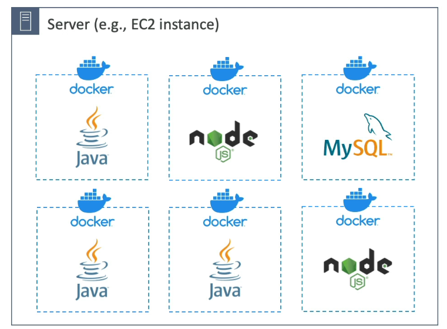

### How Docker Works ⚙️

1.  A server (e.g., an EC2 instance) runs a Docker agent.
2.  The Docker agent starts Docker containers.
3.  Each container can host different applications (e.g., Java, Node.js) or databases (e.g., MySQL).
4.  Multiple instances of the same application can run in separate containers.

### Docker Repositories 📦

Docker images are stored in Docker repositories. Here are some options:

-   **Docker Hub:** A public repository with base images for various technologies and operating systems (e.g., Ubuntu, MySQL).
-   **Amazon ECR (Elastic Container Registry):** 
    -   A private repository for storing your own images. 
    -   It also offers a public repository option called the Amazon ECR Public Gallery. [https://gallery.ecr.aws/](https://gallery.ecr.aws/)

### Virtual Machines (VMs) vs Docker 🆚 

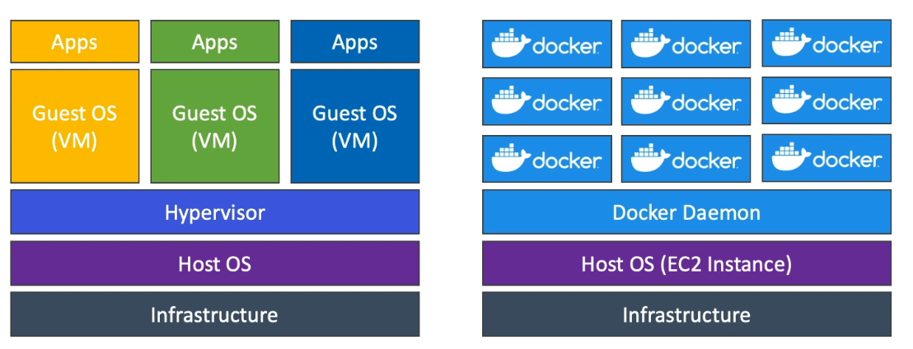

Docker and VMs both offer virtualization, but they differ significantly in their approach:

-   **VM Architecture:** Infrastructure -> Host OS -> Hypervisor -> Guest OS -> Apps
-   **Docker Architecture:** Infrastructure -> Host OS -> Docker Daemon -> Containers -> Apps

Key differences:

-   VMs provide complete isolation and dedicated resources for each instance.
-   Docker containers share resources with the host OS, allowing for more containers on a single server.
-   Docker is generally considered less secure than VMs due to shared resources, but it offers greater efficiency.

### Getting Started with Docker 🧑‍💻

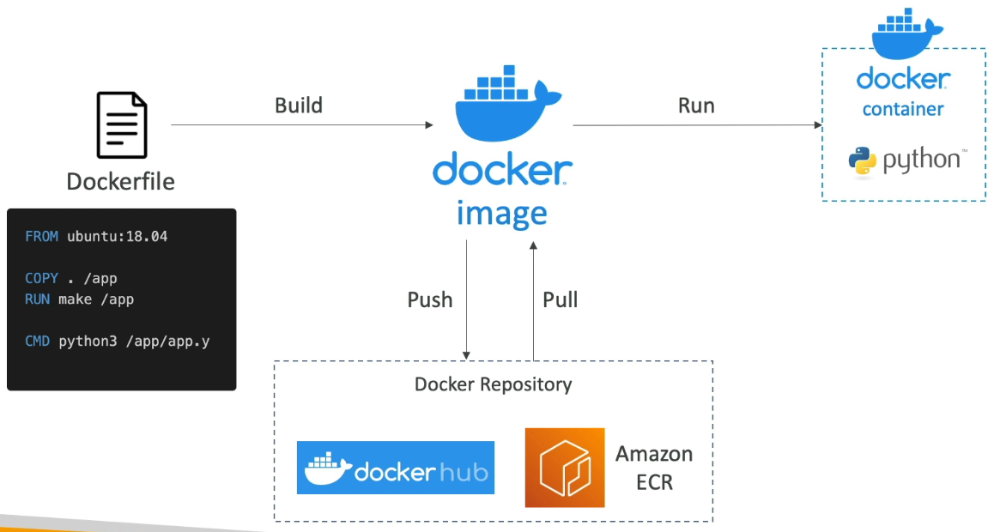

1.  **Write a Dockerfile:** Define how your Docker container will be built.
2.  **Build the Docker Image:** Use the Dockerfile to create a Docker image.
3.  **Push the Image:** Store the Docker image in a Docker repository (Docker Hub or Amazon ECR).
4.  **Pull the Image:** Retrieve the Docker image from the repository.
5.  **Run the Image:** Create a Docker container from the image, which then runs your code.

### Docker Container Management on AWS ☁️

AWS offers several services for managing Docker containers:

-   **Amazon ECS (Elastic Container Service):** Amazon's native platform for Docker management.
-   **Amazon EKS (Elastic Kubernetes Service):** Amazon's managed version of Kubernetes, an open-source container orchestration platform.
-   **AWS Fargate:** A serverless compute engine for containers that works with both ECS and EKS.
-   **Amazon ECR (Elastic Container Registry):** Used to store container images.

## 2. Amazon ECS

Amazon ECS (Elastic Container Service) is a fully managed container orchestration service that helps you run and manage Docker containers on AWS. It offers different launch types, role integrations, load balancer support, and persistent storage options.

### EC2 Launch Type

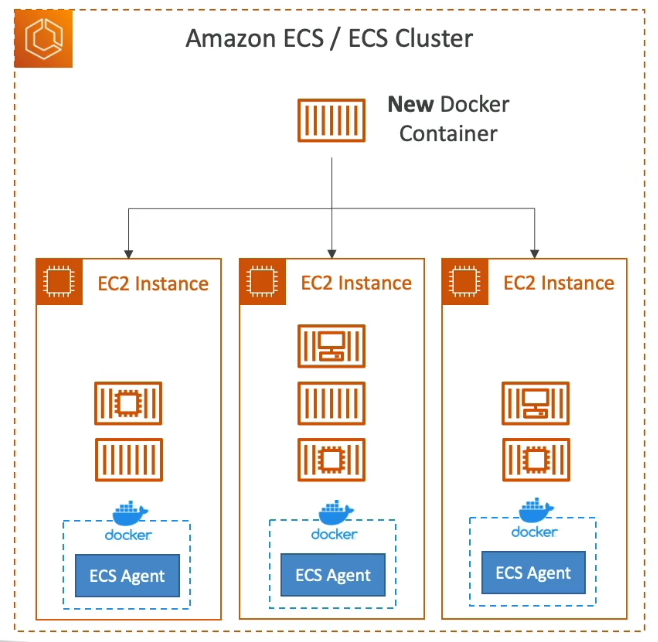

When using the **EC2 Launch Type**, you run ECS tasks on EC2 instances that **you provision and manage yourself**.

- ECS Tasks run on an **ECS Cluster**.
- An ECS Cluster consists of **EC2 instances**.
- Each EC2 instance must run the **ECS Agent**, which:
  - Registers the instance to the ECS service.
  - Associates it with the specified ECS Cluster.

Once set up:

- ECS Tasks (Docker containers) can be started/stopped.
- ECS schedules and places these containers automatically across EC2 instances.

📌 **Example:**  
Launching a Docker container on EC2 Launch Type automatically assigns it to an available EC2 instance in your cluster.

⚠️ **Warning:**  
You are responsible for provisioning, updating, and maintaining the EC2 instances.

### Fargate Launch Type

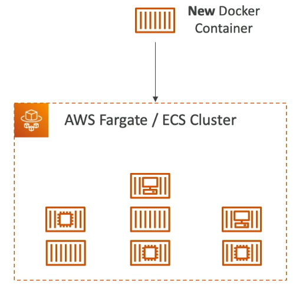

The **Fargate Launch Type** offers a **serverless** way to run ECS Tasks without managing EC2 infrastructure.

- You only define the task (container) and specify required **CPU** and **RAM**.
- You do not provision the infrastructure (no EC2 instances to manage).
- AWS runs the ECS task for you—no EC2 provisioning required.
- It's completely **serverless** (though servers exist in the background).

💡 **Tip:**  
To scale with Fargate, just **increase the number of tasks**. No EC2 management is necessary.

📌 **Example:**  
Start a Docker container using Fargate, and it runs in an isolated environment managed by AWS.

💡 **Tip:**  
The **AWS exam** often recommends using Fargate because it simplifies container management.

### IAM Roles for ECS

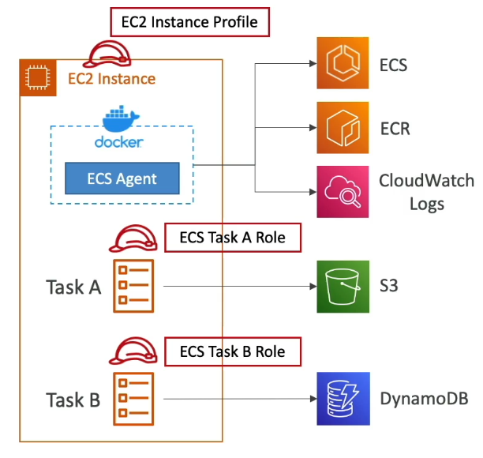

IAM roles provide ECS with permissions to interact with AWS services securely.

There are two types of roles:

#### 1. EC2 Instance Profile (only for EC2 Launch Type)

- Used by the ECS Agent running on EC2.
- Allows:
  - API calls to ECS (to register instance)
  - Sending logs to CloudWatch
  - Pulling images from ECR
  - Accessing Secrets Manager or SSM Parameter Store

#### 2. ECS Task Role (for both EC2 and Fargate)

- Each ECS Task can have its own role.
- Defined in the **task definition**.
- Grants permissions for the containers within that task.

📌 **Example:**
- **Task A Role** → allows access to **S3**.
- **Task B Role** → allows access to **DynamoDB**.

💡 **Tip:**  
Use **distinct roles** for each ECS task if they interact with different AWS services.

### Load Balancer Integrations

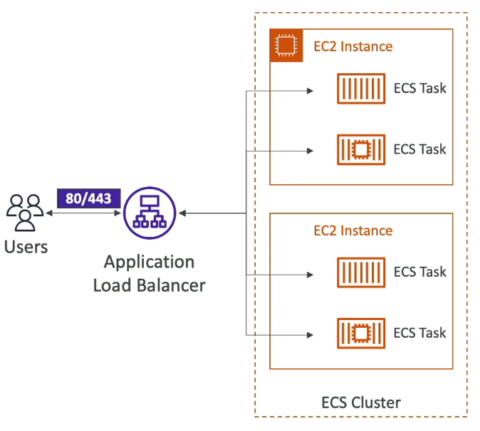

To expose ECS Tasks as HTTP/HTTPS endpoints, use a **load balancer**.

Supported options:

- **Application Load Balancer (ALB)**: Best choice, works with both EC2 and Fargate.
- **Network Load Balancer (NLB)**: For **high throughput** or **PrivateLink** use cases.
- **Classic Load Balancer (CLB)**: Not recommended.
  - Lacks advanced features.
  - Doesn’t support Fargate.

📌 **Example:**  
Use an ALB to route user traffic to multiple ECS Tasks running behind it.

💡 **Tip:**  
For Fargate compatibility and modern features, **ALB is preferred**.

### Persistent Storage with ECS

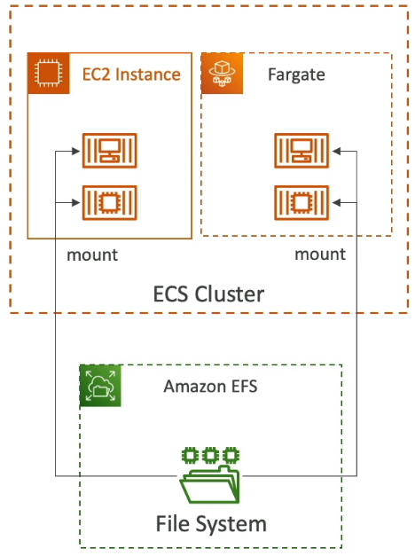

To persist data across ECS Tasks, use **Data Volumes** (EFS).

One popular choice is:

#### Amazon EFS (Elastic File System)

- Compatible with **both EC2 and Fargate** launch types.
- Provides a shared network file system.
- Mountable directly onto ECS tasks.

📝 **Note:**  
EFS is also **serverless** and **pay-as-you-go**, requiring no server maintenance.

📌 **Example:**  
Tasks running in any AZ linked to the EFS filesystem can **share and access** the same files.

💡 **Tip:**  
The best combo: **Fargate + Amazon EFS** for fully serverless, persistent, shared storage.

- **Fargate + Amazon EFS** = Serverless
  
Note: **Amazon S3 can't be mounted as a file system**.

**AWS EFS (Elastic File System) is region-scoped**. Each EFS file system exists **within a single AWS region** and has a **unique file system ID**. You can **mount it on EC2 instances or Lambda functions** within the same region. To use it across regions, you would need to **replicate it** using **EFS Replication**, which copies data to another region.

### Use Cases for EFS with ECS

- Multi-AZ persistent storage for containers
- Shared storage across ECS Tasks
- Stateful applications or file-based coordination between containers

---

## 3. IMPORTANT: ECS UI CHANGES

It is supposed to show the updated new UI for the ECS. However, if it is not showing then from the toggle button on the left side of the page you can change the view to the new one.

---

## 4. Practicing with Amazon ECS

Let's explore how to use Amazon ECS by navigating the ECS console and enabling the new ECS experience.

1.  Enable the new ECS experience in the top left corner of the console.
2.  Navigate to "Clusters" and create a new cluster.
3.  Name the cluster. 📌 **Example:** `DemoCluster`. Leave the default namespace as is.

### Infrastructure Options

When creating an ECS cluster, you have three infrastructure options:

*   AWS Fargate: ☁️ A serverless option where AWS manages the compute resources on demand. You only provide the containers.
*   Amazon EC2 instances: You provide your own EC2 instances to run the containers.
*   External instances (ECS Anywhere): Use your own infrastructure, like a data center, to run ECS containers.

For this demo, we'll **enable both Fargate and Amazon EC2 instances**.

### Configuring EC2 Instances

Upon enabling the Amazon EC2 instances option, it will ask to create an auto scaling group.

1.  Select "Create new ASG".
2.  Choose an operating system. 📌 **Example:** Amazon Linux 2 or Amazon Linux 2023.
3.  Select an EC2 instance type. 📌 **Example:** `t2.micro` (free tier eligible).
4.  Set the desired capacity. 📌 **Example:** Minimum 0, maximum 5.
5.  Leave the SSH key pair unconfigured. Or, create a new key pair.
6.  Leave the root EBS volume size as is.

### Network Settings

Configure network settings for the EC2 instances:

1.  Use the default VPC.
2.  Select the available subnets.
3.  Use an existing security group. 📌 **Example:** The default security group.
4.  For auto-assign public IP, use the subnet setting.

Leave monitoring and tags untouched. Click "Create" to create the cluster.

### Auto Scaling Group Verification

While the cluster is being created, verify the auto scaling group:

1.  Navigate to "Auto Scaling Groups" in the AWS console.
2.  You should see an auto scaling group created for you. 📌 **Example:** `Infra-ECS-Cluster`.
3.  Verify the desired, minimum, and maximum capacities.
4.  Confirm that the auto scaling group was created by your ECS cluster.
5.  Check that the cluster spans three availability zones (AZs). This ensures that ECS tasks will be launched across these AZs.

### Exploring the Created Cluster

Once the cluster is created, explore it:

1.  Click on the cluster name (📌 **Example:** `DemoCluster`).
2.  Initially, services and tasks will be zero because nothing has been launched yet.
3.  Go to the "Infrastructure" tab.

### Capacity Providers

You'll see three capacity providers:

*   FARGATE: Allows launching Fargate tasks onto the ECS cluster.
*   FARGATE_SPOT: Allows launching Fargate tasks using spot instances.
*   ASGProvider: Allows launching EC2 instances directly through the auto scaling group.

| Capacity Provider                                                                 | Type            | ASG                                                                                  |
|----------------------------------------------------------------------------------|-----------------|--------------------------------------------------------------------------------------|
| FARGATE                                                                          | FargateProvider | -                                                                                    |
| FARGATE_SPOT                                                                     | FargateProvider | -                                                                                    |
| Infra-ECS-Cluster-0cc5f695-1b06-49a1-9d5f-f1c495ba4dc8-EC2CapacityProvider-yG5YRRTisLrU | ASGProvider      | Infra-ECS-Cluster-0cc5f695-1b06-49a1-9d5f-f1c495ba4dc8                               |

The ASGProvider is in managed scaling mode. The current size is zero, but you can change it.

### Scaling the Cluster

To scale the cluster and launch an EC2 instance:

1.  Go to the ASG & Edit.
2.  Edit the desired capacity to 1.

This will trigger the creation of an EC2 instance. Once created, the instance will register itself with the `DemoCluster` and appear under "Container Instances."

ECS tasks can then be launched on either:

*   FARGATE
*   FARGATE_SPOT
*   The container instances launched as part of the ASG.

### Verifying the Instance

Wait for the instance to be in the running state and registered with the ECS cluster. Refresh the ECS console.

*   The instance should be "InService" and show its type (📌 **Example:** `t2.micro`).
*   In the ECS cluster, it will be registered as a container instance.
*   The container instance will show available CPU and memory. This represents the capacity available for launching tasks.

Now you have an ECS cluster with three capacity providers and a container instance ready to run tasks.

We're good to go! We have an ECS cluster, we've seen the capacity providers, and we've seen the container instances.

Next, we'll run our first service in the next lecture.

---

## 5. Creating an ECS Service on Fargate

Let's walk through creating an ECS service using Fargate. First, we need to define a task.

### Creating a Task Definition 📝

1.  Navigate to the task definition panel and create a new task definition.
2.  Give the task definition a name. 📌 **Example:** `nginxdemos-hello`. (Since we will be using this:- [nginxdemos/hello](https://hub.docker.com/r/nginxdemos/hello/))

### Infrastructure Requirements 🏗️

1.  Choose the infrastructure requirements. You can launch on Fargate (serverless) or EC2 instances.
2.  Enable Fargate for serverless compute. If you enable EC2 instances, the task/service can be launched on your EC2 instances. We will use Fargate for this demo.
3.  Select the OS and architecture. Linux is a common choice.
4.  Define the task size for the Fargate container:
    *   Specify the number of vCPUs. 📌 **Example:** 0.5 vCPU, but you can go up to 16 vCPU.
    *   Adjust the memory. 📌 **Example:** 1 GB, but you can go up to 120 GB.
5.  Task Role:
    *   This is an IAM role that can be assigned to the task if it needs to make API requests to AWS services.
    *   📝 **Note:** If your containers need to use AWS, this is very important.
    *   If your container does not need to use AWS, you do not need to specify a task role.
6.  Task Execution Role:
    *   Leave it as default.
    *   If the ECS task execution role is not created yet, the ECS service will create it automatically.

### Container Configuration 🐳

1.  Container Name: 📌 **Example:** `nginxdemos-hello`.
2.  Image URL: 📌 **Example:** `nginxdemos/hello`. This will pull the image from Docker Hub.
3.  Essential Container: Yes
4.  Port Mappings:
    *   Map port 80 to port 80 of the container.
    *   You can add more port mappings if needed.
5.  Other Options:
    *   You can set resource allocation limits, environment variables, and logging.
    *   For this demo, leave these as default.
6.  Storage:
    *   Fargate comes with ephemeral storage.
    *   The default is 21 GB. Leave the default value.
7.  Create the task definition. You might see version two if you've created it before; otherwise, you'll see version one.

### Launching the Task Definition as a Service 🚀

1.  Go to Clusters and select your cluster (e.g., `DemoCluster`).
2.  Under Services, create a new service.
3.  Compute Option:
    *   Choose Launch Type and select Fargate.
    *   Set the platform version to `LATEST`.
4.  Application Type:
    *   Select `Service` for long-running applications like web apps.
    *   Use `Task` for tasks that terminate, like batch jobs.
5.  Select the task definition family (e.g., `nginxdemo-hello`) and choose the latest revision.
6.  Service Name: 📌 **Example:** `nginxdemos-hello` (same as the task definition).
7. Environment:
    - Compute configuration - advanced
        *   Capacity Provider Strategy: Use custom (Advanced)
        *   Capacity Provider: `FARGATE`
7.  Deployment Configuration:
    *  Scheduling Strategy: `REPLICA`
    *  Desired Tasks: 1
    *  Deployment Options: Leave as default.
9.  Networking:
    *   Deploy into your VPC.
    *   Select the subnets.
    * **Create a new security group**:
        *   Name: 📌 **Example:** `nginxdemos-hello`.
        *   Description: 📌 **Example:** "Security group for NGINX".
        *   Allow HTTP on port 80 from anywhere.
        *   Enable public IP.
11. Load Balancing:
    *   Enable load balancing.
    *   Choose Application Load Balancer.
    *   Create a new load balancer (e.g., `DemoALBForECS`).
    *   Listener: Select the container on port 80 with protocol HTTP.
    *   Target Group: Create a new target group (e.g., `tg-nginxdemos-hello`).
    *   Protocol: HTTP.
    *   Health Check Protocol: HTTP.
    *   Health Check Path: `/`.
12. Service Auto Scaling and Task Placement:
    *   These are available, but we won't configure them now.
    *   📝 **Note:** You can use these to automatically scale ECS based on CloudWatch alarm.
13. Create the service.
14. Wait for the deployment to complete.

### Verifying the Deployment ✅

1.  Click on the service to view its details.
2.  Check that the desired task count matches the running task count and the status is active.
3.  Click on the target group to see the linked Application Load Balancer.
4.  Verify that one IP address is registered as a target. This is the IP address of your container.
5.  **Copy the DNS name of the load balancer** and open it in a new tab.
6.  You should see the Nginx welcome page.
7.  Verify that the server address matches the private IP registered in the target group.
8.  Under the service, go to Tasks to see the running container.
9.  Click on the task to view its configuration, task revision, launch details, private IP, and containers.
10. Check the logs of the Nginx container.
11. Go to the service's Events to see the task start, target group registration, deployment completion, and steady state.

### Scaling the Service 📈

1.  Update the service.
2.  Change the desired number of tasks to 3 (one per AZ).
3.  Leave the task definition, compute configuration, and load balancing settings as is.
4.  Update the service.
5.  ECS will provision two more tasks.
6.  Wait for the tasks to be provisioned on Fargate.
7.  Refresh the load balancer's DNS name in your browser. The IP address should change with each refresh, indicating that the load balancer is distributing traffic across the containers.

### Scaling Down the Service 📉

1.  Update the service.
2.  Set the desired number of tasks to zero.
3.  Under the Application Load Balancer's auto scaling group, set the desired capacity to zero.
4.  Verify that the tasks are gone.
5.  Check the events to see what ECS did while updating the service.

---

## 6. ECS Service Auto Scaling

We can manually increase the number of ECS tasks in our service, but we can also automate this process using **AWS Application Auto Scaling**.

There are three primary metrics we can use for scaling:

*   CPU Utilization of the ECS Service.
*   Memory Utilization (RAM) of the ECS Service.
*   ALB Request Count Per Target (a metric from the ALB).

You can set up different types of auto scaling:

*   Target Tracking: Scale to maintain a specific target value for the metrics above.
*   Step Scaling: Scale based on predefined steps or adjustments.
*   Scheduled Scaling: Scale your ECS Service ahead of time based on predictable changes.

📝 **Note:** Scaling your ECS Service at the task level is different from scaling your cluster of EC2 instances (if using the EC2 launch type).
> **ECS Service Auto Scaling (task level) != EC2 Auto Scaling (EC2 instance level)**

### Fargate and Auto Scaling

Using Fargate simplifies service auto scaling because it's serverless. This eliminates the need to manage EC2 instances directly.

💡 **Tip:** The exam often encourages the use of Fargate.

### EC2 Launch Type Scaling

If you're using the EC2 launch type, you have a couple of options for scaling the underlying EC2 instances:

1.  Auto Scaling Group (ASG) Scaling: Scale your ASG based on metrics like CPU Utilization. As CPU usage increases, add more EC2 instances.
2.  ECS Cluster Capacity Provider: This is a more advanced feature. The Capacity Provider intelligently scales your ASG when it detects a lack of capacity to launch new tasks. It's paired with an Auto Scaling Group, and when RAM or CPU is insufficient, it automatically creates new EC2 instances.

💡 **Tip:** If you have to choose between Auto Scaling Group Scaling and ECS Cluster Capacity Provider, use ECS Cluster Capacity Provider for your EC2 launch type. It's the smarter approach.

### ECS Auto Scaling - Service CPU Usage Example

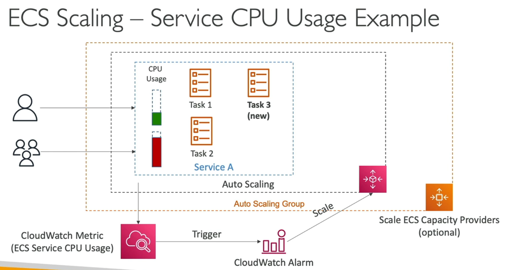

Let's consider an example:

We have Service A with two tasks. CPU usage is monitored and auto-scaled by AWS Application Auto Scaling.

1.  Increased User Load: More users lead to higher CPU usage.
2.  CloudWatch Monitoring: A CloudWatch metric monitors CPU usage at the ECS service level.
3.  CloudWatch Alarm: When CPU usage exceeds a threshold, a CloudWatch Alarm is triggered.
4.  Scaling Activity: The alarm triggers a scaling activity in Auto Scaling for the ECS service.
5.  Desired Capacity Increase: The desired capacity for the ECS Service increases.
6.  New Task Creation: A new task is created to handle the increased load.
7.  EC2 Scaling (Optional): If the service is running on the EC2 launch type, ECS Capacity Providers can scale the ECS cluster backed by EC2 instances as needed.

---

## 7. Solution Architectures with Amazon ECS

Let's explore some common solution architectures you can implement with Amazon ECS.

### ECS Tasks Invoked by Event Bridge 🚀

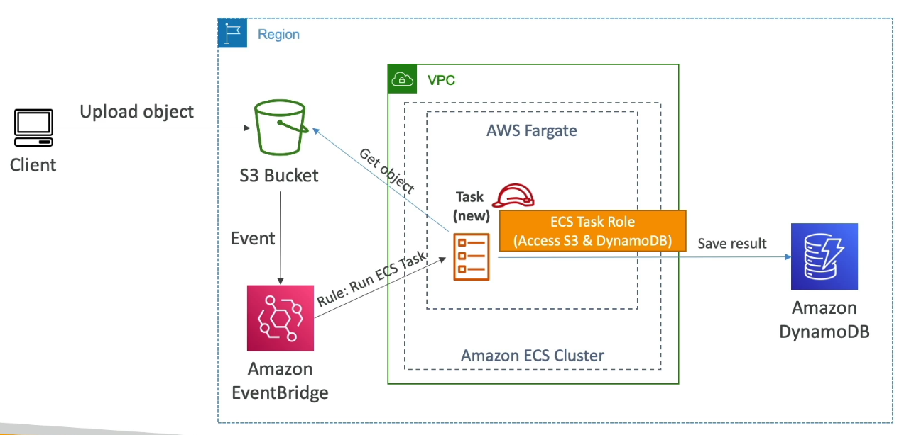

One approach involves triggering ECS tasks using Amazon Event Bridge.

Here's how it works:

1.  Users upload objects to an S3 bucket.
2.  The S3 bucket is integrated with Amazon Event Bridge to send events.
3.  Event Bridge has a rule to run ECS tasks in response to these events.
4.  When an ECS task is created, it's associated with an ECS task role.
5.  The task can then:
    *   Get objects from S3.
    *   Process the objects.
    *   Send the results to Amazon DynamoDB.

This is possible because of the ECS task role that grants the necessary permissions.

📌 **Example:** Processing images uploaded to S3 using a Docker container.

This architecture provides a serverless way to process objects from S3 using Docker containers, leveraging Amazon Event Bridge, ECS in Fargate mode, and ECS task roles.

### Event Bridge Schedule ⏰

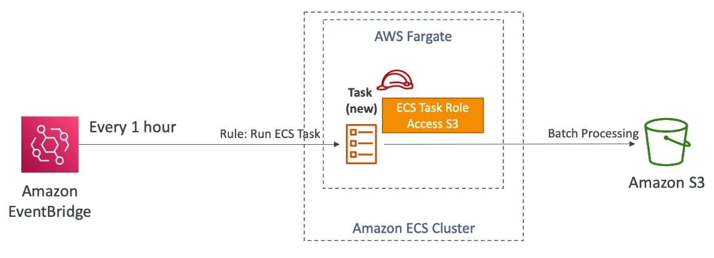

Another architecture utilizes an Event Bridge schedule to trigger ECS tasks.

1.  An Amazon ECS cluster is backed by Fargate.
2.  Amazon Event Bridge schedules a rule to be triggered, for example, every 1 hour.
3.  This rule runs ECS tasks in Fargate.
4.  Every time the rule is triggered, a new task is created in the Fargate cluster.
5.  The task can perform any desired operation.

📌 **Example:** Performing batch processing on files in Amazon S3 every hour. The ECS task role would need access to S3.

This setup is also fully serverless.

### ECS and SQS Queue ✉️

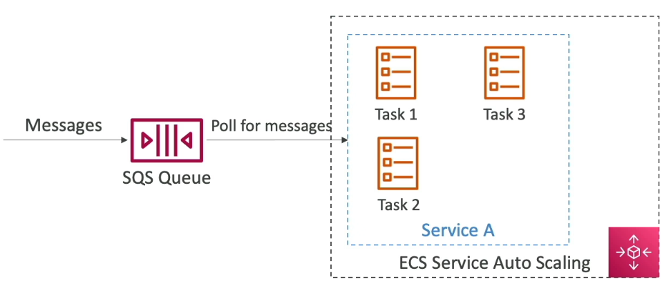

ECS can be integrated with an SQS queue for message processing.

1.  A service runs on ECS with multiple ECS tasks.
2.  Messages are sent to an SQS queue.
3.  The ECS service pulls messages from the SQS queue and processes them.
4.  ECS Service Auto Scaling can be enabled.

This means that as the number of messages in the SQS queue increases, the ECS service automatically scales up by creating more tasks.

### Event Bridge for ECS Cluster Events 🚦

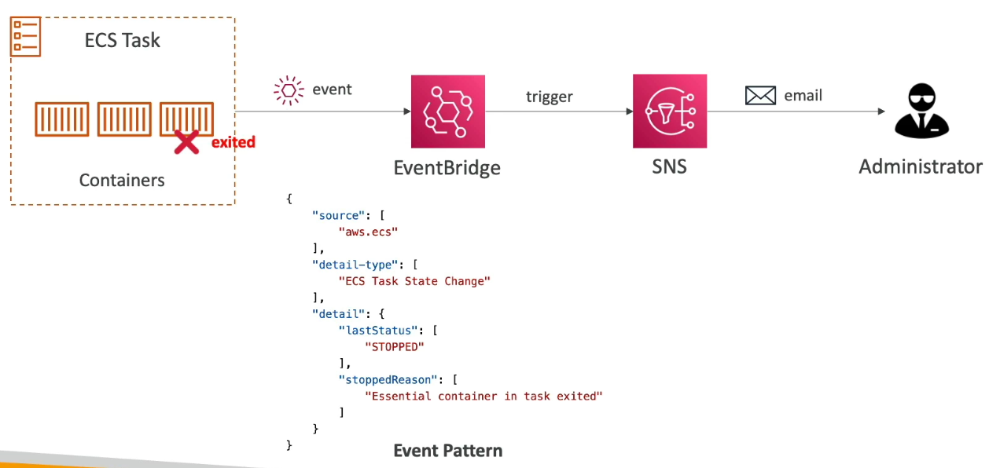

Event Bridge can also intercept events from within your ECS cluster.

📌 **Example:** Reacting to tasks exiting.

1.  Any task starting or stopping in your ECS cluster can trigger an event in Event Bridge.
2.  The event will contain information such as the ECS task state change (e.g., "stopped") and the reason for stopping.
3.  From there, you can trigger other actions.

📌 **Example:** Alerting an SNS topic to send emails to administrators when a task fails.

```json
{
  "detail-type": ["ECS Task State Change"],
  "detail": {
    "lastStatus": ["STOPPED"],
    "stoppedReason": ["Essential container in task exited"]
  }
}
```

Event Bridge allows you to monitor the lifecycle of your containers in your ECS cluster.

---

## 8. Destroying Everything

To ensure everything is properly cleaned up after using the service, follow these steps:

1.  **Stop the Service** 🛑

    *   Ensure there are zero tasks running.
    *   If tasks are running, update the service and set the desired task count to zero.
    *   Click on "Delete Service" and type "Delete" to confirm.

2.  **Understand CloudFormation's Role** ☁️

    *   Deleting the service triggers CloudFormation to delete the entire stack.
    *   This includes:
        *   ECS service
        *   Load Balancer Listener
        *   Load Balancer
        *   Security Group
        *   Target Groups
    *   📝 **Note:** This process can take some time. Wait for everything to be fully deleted.

3.  **Delete the Cluster** 🗑️

    *   Once the service is fully deleted, you can delete the cluster.
    *   Click on "Delete Cluster" to delete the demo cluster.
    *   This also initiates a CloudFormation process to delete the ECS cluster infrastructure.
    *   This includes:
        *   Capacity Provider
        *   Auto-Scaling Group
        *   Cluster
        *   Launch Templates

4.  **Task Definitions** ✅

    *   Task definitions don't incur costs, so you can leave them as they are.
    *   However, if you want to remove them:
        *   Click on the task definition.
        *   Choose "Action" and then "Deregister".

---

## 9. Amazon ECR Explained

Amazon ECR (Elastic Container Registry) is used to store and manage Docker images on AWS. 🐳 Instead of relying solely on public repositories like Docker Hub, you can leverage ECR to host your own images.

You have two main options with ECR:

*   Private repositories: Store images privately within your AWS account(s). 🔒
*   Public repositories: Publish images to the Amazon ECR Public Gallery [https://gallery.ecr.aws/](https://gallery.ecr.aws/). 🌐

ECR is tightly integrated with Amazon ECS, making it a seamless experience. 🤝 Behind the scenes, your images are **stored in Amazon S3**. 📦

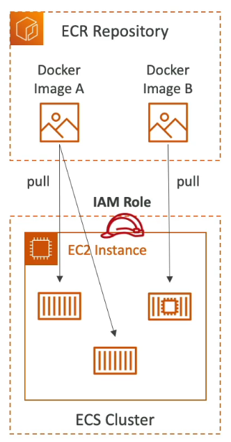

Here's how ECR and ECS work together:

1.  Your ECR repository contains different Docker images.
2.  Your ECS cluster (e.g., an EC2 instance) needs to pull these images.
3.  To enable this, you assign an IAM role to your EC2 instance. 🔑
4.  This IAM role grants the instance permission to pull Docker images from ECR.
5.  All access to ECR is protected by IAM. 🛡️
6.  After the images are pulled, your containers are started on your EC2 instance. 🚀

⚠️ **Warning:** If you encounter permission errors with ECR, carefully review your IAM policies.

Amazon ECR offers several benefits beyond basic image storage:

*   Image vulnerability scanning 🔍
*   Versioning 🔢
*   Image tags 🏷️
*   Image lifecycle management ⏳

💡 **Tip:** Whenever you encounter questions about storing Docker images, think ECR! This should be sufficient for the exam. ✅

---

## 10. Amazon EKS

Amazon EKS stands for Amazon Elastic Kubernetes Service. It's a way to launch and manage a Kubernetes cluster on AWS.

### What is Kubernetes?

Kubernetes is an open-source system for automating deployment, scaling, and management of containerized applications (usually Docker). It serves as an alternative to ECS, aiming to run your containers but with a different API.

*   ECS is not open-source.
*   Kubernetes is open-source and used by many cloud providers, offering standardization.

### EKS Launch Modes

EKS supports two launch modes:

1.  EC2 launch mode: Deploy worker nodes as EC2 instances.
2.  Fargate mode: Deploy serverless containers in an EKS cluster.

### Use Case

Use EKS if:

*   Your company is already using Kubernetes on-premises.
*   Your company is already using Kubernetes in another cloud.
*   You want to use the Kubernetes API and AWS to manage the Kubernetes cluster.

📌 **Example:** Migrating between clouds can be simplified using Amazon EKS.

### Cloud Agnostic

**Kubernetes is cloud agnostic** and can be used on Azure, Google Cloud, etc. This simplifies container migration between clouds.

### Architecture

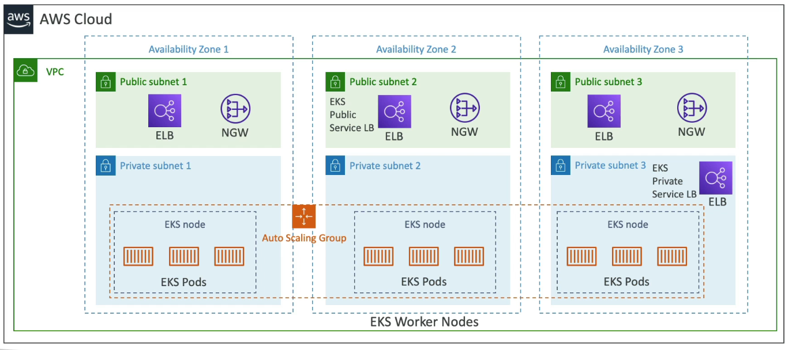

The architecture involves a VPC with 3 Availability Zones (AZs) separated into public and private subnets.

*   EKS Worker Nodes (e.g., EC2 instances) run EKS Pods.
*   EKS Pods are similar to ECS tasks. 📝 **Note:** Pods relate to Amazon Kubernetes.
*   EKS Nodes can be managed by an Auto Scaling group.
*   EKS Services (Kubernetes Service) can be exposed using private or public load balancers.

### Node Types

There are different node types for Amazon EKS:

1.  **Managed Node Groups:** AWS creates and manages EC2 instances for you. These nodes are part of an Auto Scaling group managed by the EKS service. Supports On-Demand and Spot Instances.
2.  **Self-Managed Nodes:** You create and manage the nodes yourself for more customization and control. You need to register them to an EKS cluster and manage them as part of an ASG. You can use the pre-built Amazon EKS Optimized AMI or build your own AMI. Supports On-Demand and Spot Instances.
3.  **Fargate:** No node maintenance is required. You can run containers on top of Amazon EKS without managing any nodes.

### Data Volumes

You can attach data volumes to your Amazon EKS cluster.

*   Specify a StorageClass manifest on your EKS cluster.
*   Leverages the **Container Storage Interface** (CSI) compliant driver.

Supported storage options:

*   Amazon EBS
*   Amazon EFS (only storage class that works with Fargate)
*   Amazon FSx for Lustre
*   Amazon FSx for NetApp ONTAP

---

## 11. Amazon EKS Hands-On Demo

This section provides a quick hands-on demonstration of Amazon EKS (Elastic Kubernetes Service). ⚠️ **Warning:** Creating an EKS cluster will incur costs, so it's recommended to follow along visually rather than creating a cluster yourself.

### Creating an EKS Cluster

1.  **Cluster Creation:** We'll start by creating a new cluster on AWS.
    *   Name: `DemoEKS`
    *   Kubernetes Version: Use the default version.
    *   Service Role: A service role is required to manage the cluster.

2.  **Creating the EKS Cluster Role:**
    *   Navigate to IAM (Identity and Access Management).
    *   Create a new role specifically for EKS.
    *   Select "AWS service" as the trusted entity.
    *   Choose "EKS" as the service.
    *   Select "EKS - Cluster".
    *   Attach the `AmazonEKSClusterPolicy` to allow access to other AWS services.
    *   Name the role `EKSClusterRole` (or similar).
    *   Create the role.

3.  **Cluster Configuration:**
    *   Encryption: Choose whether to encrypt secrets with KMS (Key Management Service). For this demo, we're skipping it.
    *   VPC and Subnets: Select the VPC and subnets where the cluster will be deployed for high availability.
    *   Security Groups: Choose the security groups for the cluster. 📌 **Example:** The default security group can be used.
    *   IPv4 Type: Select the IPv4 type for services.
    *   Cluster Endpoint Access: Set the cluster endpoint access to "Public" to access it from your computer.
    *   Networking Add-ons: Choose the default networking add-ons, proxy, and DNS.
    *   Control Plane Logging: Configure logging for the control plane (optional).

4.  **Review and Create:** Review all settings and create the cluster. This process will create the cluster itself.

### Provisioning Compute Capacity

After the cluster is created, you need to provision compute capacity. There are two primary methods:

1.  **Managed Node Groups:**
    *   Navigate to "Compute" then "Node Groups".
    *   Add a new node group. 📌 **Example:** `demo node group`.
    *   IAM Role for Node Group: Create an IAM role for the EC2 instances within the managed node group.
        *   Select "EC2" as the service.
        *   Attach the `AmazonEKSWorkerNodePolicy`.
        *   Attach the `AmazonEC2ContainerRegistryReadOnly` policy.
        *   Attach the `AmazonEKS_CNI_Policy`.
        *   Name the role `AmazonEKSNodeRole` (or similar).
        *   Create the role.
    *   Select the newly created IAM role for the node group.
    *   Launch Template: Optionally specify a launch template for EC2 instances.
    *   Node Group Configuration:
        *   Amazon Linux 2 is a good choice for the OS.
        *   Choose between on-demand or spot instances.
        *   Select the instance type (e.g., T3 medium, T3 micro).
        *   Specify the disk size.
        *   Configure node scaling (number of nodes). This is the OS scaling group settings.
        *   Configure node group update settings (how many nodes can be updated concurrently).
    *   Subnets: Select the subnets for the node group to access.
    *   Create the managed node group. 💡 **Tip:** Managed node groups simplify EC2 instance deployment and management for EKS clusters.

2.  **Fargate Profiles:**
    *   Fargate allows you to run containers without provisioning EC2 instances.
    *   Navigate to "Compute" and then explore the option to add a Fargate profile.
    *   📝 **Note:** We are not setting up a Fargate profile in this demo, but it's an alternative to node groups.

### Add-ons

*   Add-ons can extend the functionality of your EKS cluster.
*   📌 **Example:** The Amazon EBS CSI driver allows you to leverage EBS volumes for your EKS cluster.
*   Other add-ons include those for EFS.

### Deleting the Cluster

1.  Delete Node Groups: Before deleting the cluster, you must delete any associated node groups.
2.  Delete Cluster: Type the cluster name (`demo EKS`) to confirm and delete the cluster.

---

## 12. AWS App Runner Service

The AWS App Runner service is a fully managed service designed to simplify the deployment of web applications and APIs at scale. 🚀 It allows anyone to deploy to AWS without requiring in-depth knowledge of infrastructure, containers, or source code.

Here's how it works:

1.  **Start with your Source Code or Docker Container Image:** You begin with either your application's source code or a pre-built Docker container image. 📦
2.  **Configure Settings:** Define the basic settings for your web application or API. This includes:
    *   Number of vCPUs 💻
    *   Memory allocation for your containers 💾
    *   Autoscaling configuration ⚙️
    *   Health checks ✅
3.  **Automatic Build and Deployment:** App Runner automatically builds and deploys your web application using the configured settings. The container is created, deployed, and made accessible via a URL. 🌐

The key benefit is that you don't need to understand the underlying AWS services. App Runner abstracts away the complexity, allowing you to focus on your application.

With App Runner, you get:

*   Automatic scaling 📈
*   High availability ⚙️
*   Load balancing ⚖️
*   Encryption 🔒
*   VPC access: Your container can connect to your databases, caches, and message queue services within your VPC. 🔗

The primary use cases for App Runner include:

*   Rapid deployment of web apps 🚀
*   API deployment 📡
*   Microservices deployment 🧩
*   Rapid production deployments with best practices ✅

📝 **Note:** App Runner is a simple yet powerful service that streamlines the deployment process.

---

## 13. AWS App Runner: Deploying a Simple HTTPD Server

This note outlines how to deploy a simple HTTPD server using AWS App Runner.

⚠️ **Warning:** Following along with this demo will incur costs for vCPU and per-gigabyte usage.

### Creating an App Runner Service

1.  **Source of Deployment:** Choose the source of your deployment. You can select either:
    *   Container Registry
    *   Source Code (e.g., GitHub)

    For this example, we'll use a Container Registry.

2.  **Container Registry Type:** Select the type of container registry:
    *   Amazon ECR (for private Docker containers)
    *   Amazon ECR Public (for public images) 🐳

    We'll use Amazon ECR Public.

3.  **Public Image Selection:**
    *   Navigate to the [Amazon ECR Public Gallery](https://gallery.ecr.aws/).
    *   Search for `HTTPD`.
    *   Copy the image address.
        📌 **Example:** `public.ecr.aws/docker/library/httpd:latest`
    *   Paste the address into the App Runner configuration.

4.  **Deployment Settings:** Choose your deployment trigger.
    *   Manual: Deploy the application manually.
    *   Automatic: Automatically deploy on changes to the Source Code Repo or Amazon ECR.

    We'll use manual deployment for this example.

### Configuring the App Runner Service

1.  **Service Name:** Provide a name for your service.
    📌 **Example:** `DemoHTTP`

2.  **Resource Allocation:** Choose the vCPU and memory allocation.
    *   vCPU: Select the number of vCPUs.
    *   Memory: Select the amount of memory (in GB).

    📝 **Note:** The minimum allocation is typically 1 vCPU and 2 GB of memory.

3.  **Environment Variables:** Pass any necessary environment variables to your container.

4.  **Port Configuration:** Configure the port for your service.
    *   For HTTPD, the default port is typically port 80.

    ```text
    Port: 80
    ```

5.  **Auto Scaling:** Configure auto-scaling settings.
    *   Default Configuration: Scale from 1 to 25 instances with 100 concurrent requests per instance.
    *   Custom Configuration: Define your own scaling parameters.

6.  **Health Checks:** Configure health checks to ensure your application is healthy.

7.  **Security:** Configure an instance role for your containers, if needed.

8.  **Networking:** Choose the network access type.
    *   Public Access: Deploy with a public access type.
    *   Custom VPC: Deploy into your Custom VPC.

9.  **Tracing:** Enable tracing with AWS X-Ray, if desired.

### Deploying the Service

1.  **Review Settings:** Verify all the settings are correct.
    *   Ensure the correct public HTTPD image is selected.
    *   Confirm the port is set to 80.

2.  **Create and Deploy:** Click "Create and Deploy".

    App Runner will automatically:
    *   Deploy an auto-scaling group.
    *   Deploy scaling triggers.
    *   Deploy target containers.
    *   Deploy a load balancer.
    *   Provide a domain.

### Accessing and Monitoring the Service

1.  **Access the Application:** Once the service is deployed, access the provided default domain.
    *   A successful deployment of HTTPD will display the message "It works!".

2.  **Monitoring:** Use the App Runner console to access:
    *   Logs
    *   Activity
    *   Metrics
    *   Observability
    *   Configuration

3.  **Custom Domain:** Connect a custom domain to your App Runner service.

### Deleting the Service

1.  To delete the application, type "delete" in the confirmation prompt.

---

## 14. AWS App2Container (A2C)

AWS App2Container (A2C) is a command-line interface (CLI) tool designed to migrate and modernize Java and .NET web applications into Docker containers. 🐳

The primary goal is to facilitate a "lift-and-shift" migration, where applications running on-premises (e.g., bare metal or virtual machines) are moved to AWS. 🚀

This approach accelerates modernization without requiring any code changes. You can migrate legacy applications to the cloud without altering the existing codebase. ☁️

Here's a breakdown of how A2C works:

1.  **Discovery and Analysis:** The CLI is used to discover and analyze which applications are suitable for migration. 🔍
2.  **Extraction and Containerization:** The application is extracted and containerized into a Docker image. 📦
3.  **Artifact Generation:** Deployment artifacts are generated, including:
    *   CloudFormation templates 📝
    *   ECS Task and EKS Pod definitions
    *   CI/CD pipelines (if needed)
    *   Other necessary infrastructure components
4.  **Deployment to AWS:** The Docker container image is stored in Amazon ECR and deployed to your chosen compute service. 🚀

The tool generates CloudFormation templates for compute, network, and other resources. It also registers the generated Docker containers in Amazon ECR. You can then deploy to:

*   ECS (Elastic Container Service)
*   EKS (Elastic Kubernetes Service)
*   App Runner

A2C also supports prebuilt CI/CD pipelines for automated deployments. ⚙️

The Docker container image is stored in Amazon ECR and can be deployed to ECS, EKS, or App Runner.

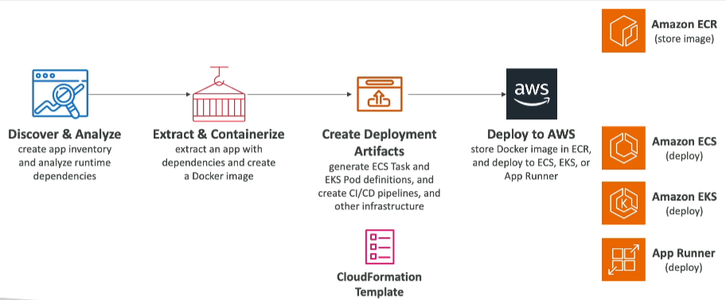

📌 **Example:** You have a legacy .NET web application running on a Windows server on-premises. Using A2C, you can containerize this application and deploy it to ECS on AWS without modifying the application's code.

📝 **Note:** A2C is designed for simple migrations of Java and .NET web applications to AWS.

In summary, **if you need to migrate a Java or .NET web application to AWS quickly and easily**, AWS App2Container is a suitable tool. ✅

---

## 15. Q & A

### ❓ Question 5

You are deploying an application on an **ECS Cluster** made of EC2 instances. Currently, the cluster is hosting one application that is issuing API calls to **DynamoDB** successfully.

Upon adding a second application, which issues API calls to **S3**, you are getting authorization issues.

What should you do to resolve the problem and ensure proper security?

* Edit the EC2 instance role to add permissions to S3
* Enable the Fargate mode
* Edit the S3 bucket policy to allow the ECS task
* Create an IAM task role for the new application

<details>

<summary>Explanation</summary>

In **Amazon ECS**, there are two main types of IAM roles:

1. **EC2 Instance Role** (for the ECS container instances)

   * Provides permissions to the underlying EC2 host.
   * Not specific to individual tasks/containers.

2. **ECS Task Role**

   * Provides fine-grained permissions **per task**.
   * Best practice: Assign least-privilege IAM roles at the task level instead of relying only on the EC2 instance role.

⚠️ **What happened here?**

* The first application (using DynamoDB) worked fine, probably because the EC2 instance role allowed DynamoDB access.
* The second application (using S3) failed, since the EC2 instance role did **not** have the correct S3 permissions.

👉 Instead of broadening the EC2 instance role (bad security practice), you should:

* **Create a dedicated IAM Task Role** for the new ECS task.
* Attach the required **AmazonS3FullAccess** (or least-privilege S3 policy) to that task role.

This ensures **principle of least privilege** ✅ and isolates permissions between applications.

✅ Answer: **Create an IAM task role for the new application**

#### 📌 Key Takeaway

* **Use ECS Task Roles** for application-level permissions.
* Don't overload the **EC2 instance role** with multiple permissions—it can become a security risk.

</details>

### ❓ Question:

You have an application hosted on an **ECS Cluster (EC2 Launch Type)** where you want your ECS tasks to **upload files to an S3 bucket**.
Which IAM Role for your ECS Tasks should you modify?

Options:

1. **EC2 Instance Profile**
2. **ECS Task Role** 

<details>

<summary>Explanation</summary>

In Amazon ECS (Elastic Container Service), when using the **EC2 launch type**, two IAM roles are commonly used — but for different purposes.

| Role                     | Used By                                          | Purpose                                                                                                                   |
| ------------------------ | ------------------------------------------------ | ------------------------------------------------------------------------------------------------------------------------- |
| **EC2 Instance Profile** | ECS container instance (the underlying EC2 host) | Allows the **ECS Agent** to perform actions like pulling images from ECR and sending logs to CloudWatch.                  |
| **ECS Task Role**        | ECS task (your containerized application)        | Grants permissions for the **application running inside the container** to access AWS services (like S3, DynamoDB, etc.). |

📌 Example:

If your ECS task needs to **upload files to an S3 bucket**, the application code inside the container must have **S3 permissions**.
Therefore, you should modify the **ECS Task Role** and attach a policy like:

```json
{
  "Version": "2012-10-17",
  "Statement": [
    {
      "Effect": "Allow",
      "Action": ["s3:PutObject"],
      "Resource": ["arn:aws:s3:::your-bucket-name/*"]
    }
  ]
}
```

Attach this role under the **Task Role ARN** section of your ECS Task Definition.

#### ⚙️ Comparison

| Feature             | EC2 Instance Profile             | ECS Task Role           |
| ------------------- | -------------------------------- | ----------------------- |
| Used For            | ECS agent actions                | Application actions     |
| Typical Permissions | ECR image pulls, CloudWatch logs | S3, DynamoDB, SNS, etc. |
| Level               | EC2 Instance (Host)              | ECS Task (Container)    |

✅ Correct Answer: **ECS Task Role**

#### ⚠️ Common Mistake

It's a common misconception to modify the **EC2 Instance Profile** for granting application-level access.
However, permissions for your **containerized app** should always be provided through the **ECS Task Role**.

✅ **In summary:**
To allow ECS tasks to upload files to S3, **modify the ECS Task Role**, not the EC2 Instance Profile.

</details>


---