# 24 AWS Monitoring & Audit Cloudwatch, Cloudtrail & Config

Sections:-
- [1. Monitoring in the Cloud ☁️](#1-monitoring-in-the-cloud-️)
- [2. Amazon CloudWatch Metrics](#2-amazon-cloudwatch-metrics)
- [3. CloudWatch Logs](#3-cloudwatch-logs)
- [4. CloudWatch Logs Overview](#4-cloudwatch-logs-overview)
- [5. CloudWatch Logs: Live Tail Feature](#5-cloudwatch-logs-live-tail-feature)
- [6. Using CloudWatch Agents for Logs and Metrics for EC2 📝](#6-using-cloudwatch-agents-for-logs-and-metrics-for-ec2-📝)
- [7. CloudWatch Alarms](#7-cloudwatch-alarms)
- [8. CloudWatch Alarms Hands On - Creating CloudWatch Alarms to Terminate EC2 Instances](#8-cloudwatch-alarms-hands-on---creating-cloudwatch-alarms-to-terminate-ec2-instances)
- [9. Amazon EventBridge](#9-amazon-eventbridge)
- [10. Amazon EventBridge: A Deep Dive into Rules, Schedules, and Integrations](#10-amazon-eventbridge-a-deep-dive-into-rules-schedules-and-integrations)
- [11. CloudWatch Insights Types](#11-cloudwatch-insights-types)
- [12. ☁️ AWS CloudTrail: Governance, Compliance, and Auditing](#12-️-aws-cloudtrail-governance-compliance-and-auditing)
- [13. CloudTrail Overview - Hands On](#13-cloudtrail-overview---hands-on)
- [14. Integrating Amazon EventBridge with CloudTrail](#14-integrating-amazon-eventbridge-with-cloudtrail)
- [15. AWS Config](#15-aws-config)
- [16. Configuring AWS Config Service](#16-configuring-aws-config-service)
- [17. CloudTrail vs CloudWatch vs Config](#17-cloudtrail-vs-cloudwatch-vs-config)
- [18. Q & A](#18-q--a)

---

## 1. Monitoring in the Cloud ☁️

So, you've deployed your application to the cloud and it's running smoothly. Great!

But what happens when your manager calls you at 2:00 a.m. to tell you the application is no longer running? 😱

The problem? You deployed the application without enabling monitoring. 😬

Monitoring is absolutely crucial. It ensures your applications are running correctly. It provides visibility into:

*   Logs 🪵
*   Metrics 📊
*   Tracing 🔍
*   Audits 🧑‍💼 (who made changes in your AWS infrastructure)

As a developer, I never deploy an application in AWS without enabling some form of monitoring. It's that important! 💯

Let's dive in! 🚀

---

## 2. Amazon CloudWatch Metrics

Amazon CloudWatch provides metrics for virtually every AWS service, allowing you to monitor everything happening within your AWS accounts. A metric is simply a variable you want to monitor.

*   For EC2 instances, this could be CPUUtilization, NetworkIn, etc.
*   For Amazon S3, it could be your bucket size.

Metrics are organized into **namespaces**, with typically one namespace per service.

### Dimensions

Dimensions are attributes of a metric. 📌 **Example:** A CPUUtilization metric could have dimensions like instance ID or environment. You can have up to 30 dimensions per metric.

### Time-Based Data

Metrics are time-based and must include a timestamp.

### CloudWatch Dashboards

You can create CloudWatch dashboards to visualize multiple metrics in one place.

### Custom Metrics

You can create your own custom metrics in addition to the ones provided by AWS services. 📌 **Example:** Extracting memory usage from an EC2 instance is a common use case.

### Streaming Metrics Outside of CloudWatch

You can stream CloudWatch Metrics to external destinations in near real-time with low latency.

*   The destination is Amazon Kinesis Data Firehose.
*   From Kinesis Data Firehose, you can send the data to various locations.

### Destinations for Kinesis Data Firehose

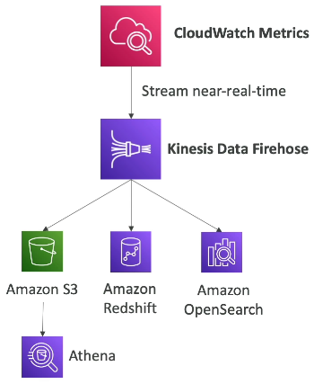

From Kinesis Data Firehose, you can send your metrics to:

1.  Amazon S3: Use Amazon Athena to analyze the data.
2.  Amazon Redshift: For data warehousing.
3.  Amazon OpenSearch: To build dashboards and perform analytics.
4.  Third-party service providers: Datadog, Dynatrace, New Relic, Splunk, Sumo Logic, etc.

### Streaming Options

You can stream all metrics for all namespaces or filter to include only a subset of namespaces.

### Console Walkthrough

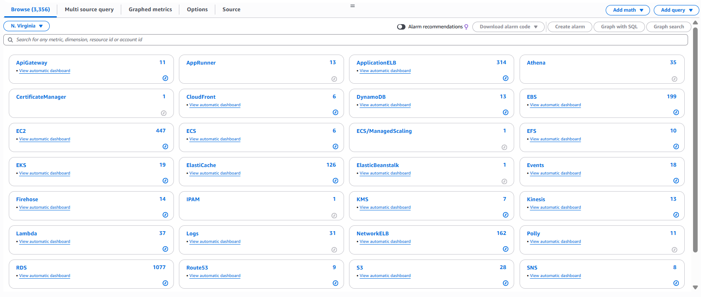

In the CloudWatch console, you can find all available metrics under the "Metrics" section on the left-hand side.

*   You'll see a list of namespaces based on AWS services (e.g., ELB, Auto Scaling, EBS, EC2, EFS).
*   You can filter metrics by service and then by specific dimensions.

📌 **Example:** To view CPU Credit Balance for an EC2 instance:

1.  Select EC2.
2.  Choose "per instance metric".
3.  Search for "credit".
4.  Select the desired instance.
5.  Choose a custom time range to view historical data.

The console allows you to select a time span to view metrics.

### Data Granularity

By default, you might see data points every five minutes. This is because detailed monitoring is not enabled by default. If you enable detailed monitoring, you'll get data every one minute.

### Visualization Options

You can visualize metrics in different formats:

*   Stacked area
*   Line
*   Number
*   Pie chart

You can also add metrics to a dashboard, download the data as a .csv file, or share the metric view.

### Filtering

CloudWatch Metrics allows you to filter by:

*   Region
*   Dimension
*   Resource ID

---

## 3. CloudWatch Logs

CloudWatch Logs is an ideal solution for storing your application logs in AWS. Here's a breakdown of its key features and functionalities:

*   Log Groups: 📁 Define log groups, typically representing your applications.
*   Log Streams: 🌊 Within each log group, you'll find multiple log streams, representing log instances within an application, specific log files, or containers in a cluster.
*   Log Expiration: ⏳ Configure log retention policies, ranging from indefinite retention to expiration periods between one day and 10 years.
*   Destinations: ➡️ Send CloudWatch Logs to various destinations, including:
    *   Amazon S3 (batch export)
    *   Kinesis Data Streams (streaming)
    *   Kinesis Data Firehose (streaming)
    *   AWS Lambda
    *   Amazon OpenSearch

All logs are encrypted by default. You can also configure KMS-based encryption with your own keys. 🔑

### Sending Logs to CloudWatch Logs

You can send logs using several methods:

*   SDK
*   CloudWatch Logs Agent (deprecated)
*   CloudWatch Unified Agent (recommended)

Additionally, several AWS services directly integrate with CloudWatch Logs:

*   Elastic Beanstalk: Collects logs directly from applications.
*   ECS: Sends logs directly from containers.
*   Lambda: Sends logs from Lambda functions.
*   VPC Flow Logs: Sends logs related to VPC network traffic.
*   API Gateway: Sends requests made to the API Gateway.
*   CloudTrail: Sends logs based on defined filters.
*   Route53: Logs all DNS queries.

### Querying Logs with CloudWatch Logs Insights

To query logs within CloudWatch Logs, use CloudWatch Logs Insights.

1.  Write your query. ✍️
2.  Specify the timeframe. ⏱️
3.  View the results as a visualization and specific log lines. 📊

You can export the visualization or add it to a dashboard for later use. This allows you to search and analyze log data effectively.

```
fields @timestamp, @message, @logStream, @log
| sort @timestamp desc
| limit 10000
```

CloudWatch Logs Insights provides simple queries in the console, such as:

*   Finding the 25 most recent events.
*   Identifying events with exceptions or errors.
*   Searching for a specific IP address.

It uses a purpose-built query language. Fields are automatically detected, allowing you to:

*   Filter based on conditions.
*   Calculate aggregate statistics.
*   Sort events.
*   Limit the number of events.

You can save queries and add them to CloudWatch Dashboards. You can also query multiple log groups simultaneously, even across different accounts.

⚠️ **Warning:** CloudWatch Logs Insights is a query engine for historical data, not a real-time engine.

### Exporting CloudWatch Logs

CloudWatch Logs can be exported to various destinations:

1.  **Amazon S3 (Batch Export):**

    *   Use for batch exporting logs to S3.
    *   The export can take up to 12 hours.
    *   API call: `CreateExportTask`

    ⚠️ **Warning:** This is not a real-time or near real-time solution.

2.  **CloudWatch Logs Subscriptions (Real-time Streaming):**

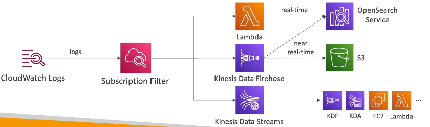

*   Provides a real-time stream of log events for processing and analysis.
* We can create up to two subscription filters per log group.
*   Destinations: Kinesis Data Streams, Kinesis Data Firehose, or Lambda.
*   Use subscription filters to specify which log events to deliver.
    *   **Kinesis Data Streams:** Ideal for integration with Kinesis Data Firehose, Kinesis Data Analytics, Amazon EC2, or Lambda.
    *   **Kinesis Data Firehose:** Enables near real-time delivery to Amazon S3, OpenSearch Service, or Lambda.
    *   **Lambda:** Use custom or managed Lambda functions to send data in real-time to OpenSearch Service.


📌 **Example:**

Example of a subscription filter
```text
{
    "filterPattern": "{ $.severity = \"ERROR\" }",
    "destinationArn": "arn:aws:kinesis:us-east-1:123456789012:stream/my-kinesis-stream"
}
```

### Log Aggregation Across Accounts and Regions

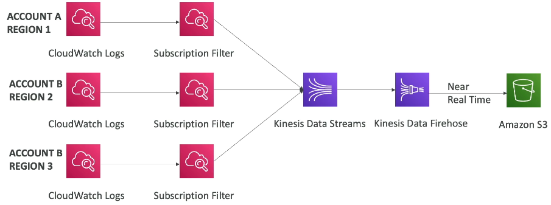

Subscription filters enable aggregating data from different CloudWatch Logs across accounts and regions into a common destination, such as a Kinesis Data Stream in a specific account, and then to Kinesis Data Firehose and Amazon S3 in near real-time.

### Cross-Account Log Delivery Details - CloudWatch Logs Subscriptions

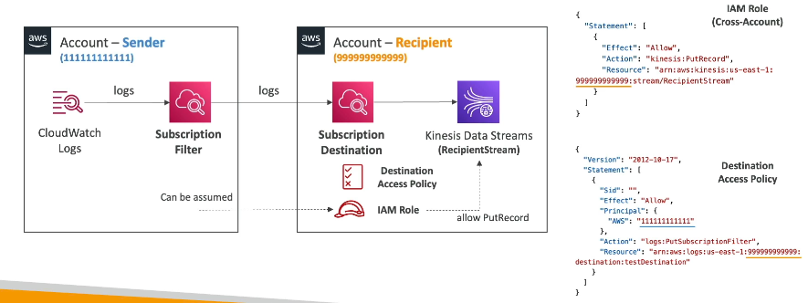

To send logs from CloudWatch Logs in one account to a destination in another account, you must use destinations:

1.  **Sender Account:** Create a CloudWatch Log subscription filter.
2.  **Recipient Account:**
    *   Create a subscription destination, representing the Kinesis Data Stream.
    *   Attach a destination access policy to allow the sender account to send data.
    *   Create an IAM role with permission to send records to the Kinesis Data Stream.
    *   Ensure the sender account can assume this role.

Once these steps are completed, cross-account log delivery is enabled.

---

## 4. CloudWatch Logs Overview

CloudWatch Logs allows you to monitor, store, and access your log files from various sources. Let's explore its key features and functionalities.

### Log Groups and Streams

*   CloudWatch Logs organizes logs into **log groups**.
*   Each log group can contain multiple **log streams**.
*   📌 **Example:** Log groups can be created by services like Lambda, DataSync, and Glue.
*   Log streams often represent different instances or executions of a process.
*   📌 **Example:** When using SSM Run Command, each instance that the command runs on will have its own log stream within the log group.
*   Each log stream contains `stdout` and `stderr` logs.

### Searching Logs

*   You can search for specific keywords within your logs.
*   📌 **Example:** Searching for "http" will show all log lines containing that word.
*   This helps in quickly identifying relevant information within large log files.

### Metric Filters 📊

*   Metric filters allow you to extract numerical data from your logs and create CloudWatch metrics.
*   You define a **filter pattern** to identify specific events in your logs.
*   📌 **Example:** You can create a filter pattern for the word "installing".
*   You can then assign a metric value to each matching event.
*   📌 **Example:** Increment a counter by 1 each time the "installing" pattern is found.
*   Steps to create a metric filter:
    1.  Enter a filter name (e.g., `DemoFilter`).
    2.  Define a metric namespace (e.g., `DemoMetricFilterNamespace`).
    3.  Specify a metric name (e.g., `DemoMetric`).
    4.  Set the metric value (e.g., `1`).
*   Once created, the metric will appear in CloudWatch Metrics under the specified namespace.
*   You can then create alarms based on these metrics.
*   📌 **Example:** Create an alarm if the "installing" count exceeds a certain threshold.

### Subscription Filters 📤

*   Subscription filters allow you to send log data to other AWS services.
*   Supported destinations include:
    *   Elasticsearch
    *   Kinesis Data Streams
    *   Kinesis Data Firehose
    *   Lambda
*   You can create up to two subscription filters per log group.
*   This enables real-time log processing and analysis.

### Retention Settings ⏳

*   You can configure how long CloudWatch Logs retains your log data.
*   Retention periods range from "never expire" to 120 months (10 years).
*   This helps you manage storage costs and comply with data retention policies.

### Exporting Data to S3 📦

*   You can export log data to Amazon S3 for long-term storage or further analysis.
*   You can specify a date range, stream prefix, S3 bucket, and bucket prefix for the export.
*   This allows you to archive your logs and access them as needed.

### Creating Log Groups ➕

*   You can manually create log groups with custom settings.
*   You can specify:
    *   Log group name (e.g., `demo-log-group`).
    *   Retention settings.
    *   KMS key for encryption.
*   Encryption ensures the security and confidentiality of your log data.

### CloudWatch Logs Insights 🔎

*   CloudWatch Logs Insights provides a powerful query language for analyzing your logs.
*   You can query specific log groups and search for patterns, errors, or other relevant information.
*   📌 **Example:**
    ```
    fields @timestamp, @message
    | filter @message like /error/
    | limit 20
    ```
*   You can save your queries for future use.
*   Logs Insights also provides sample queries for common use cases, such as:
    *   Latency statistics for Lambda functions.
    *   Top 10 transfers by source and destination IP addresses for VPC Flow Logs.
*   You can export the query results for further analysis or reporting.

---

## 5. CloudWatch Logs: Live Tail Feature

Let's explore the Live Tail feature in CloudWatch Logs, a handy tool for real-time debugging.

First, we need to create a log group:

1.  Create a new log group. 📌 **Example:** Name it "DemoLogGroup".
2.  Click on the newly created log group.
3.  Create a log stream within the log group. 📌 **Example:** Name it "DemoLogStream".
4.  Click on the log stream to enter it.

Now, let's start tailing:

1.  Click the "Start tailing" button. This opens the Live Tail UI.
2.  The Live Tail UI allows you to filter based on:
    *   Specific log group (e.g., "demo log group").
    *   Specific log stream (e.g., "DemoLogStream") - This is optional.
3.  Apply your filter. The Live Tail will now wait for log events that match your criteria.
4.  As events are posted to CloudWatch Logs, they will appear in real-time in the Live Tail UI. This is very useful for debugging. 💡 **Tip:** This is especially helpful when logs are streaming quickly.

📌 **Example:** Let's post a log event to see Live Tail in action:

1.  Go back to your demo log stream.
2.  Under "Actions", select "Create log event".
3.  Enter your log message. 📌 **Example:** "hello world".
4.  Create the log event.

You should now see "hello world" appear in your Live Tail UI.

From the Live Tail UI, you can:

*   Get more information about the log event, such as the timestamp and the log group.
*   Click on a link to go directly to the log stream where the event originated.

This feature provides a very easy way to debug your CloudWatch logs.

⚠️ **Warning:** Pricing Considerations:

*   You have approximately one hour of free usage of Live Tail per day.
*   📝 **Note:** Ensure you cancel and close your Live Tail session when you're finished to avoid incurring costs.

---

## 6. Using CloudWatch Agents for Logs and Metrics for EC2 📝

- By default, your EC2 instances do not send logs to CloudWatch. 
- To enable this, you need to create and start a CloudWatch Agent, which is a small program running on your EC2 instances that pushes the log files you specify to CloudWatch.
- Your EC2 instance must have an IAM role that allows it to send logs to CloudWatch Logs. 

📝 **Note:** This agent can also be set up on on-premises servers, such as VMware virtual servers. You can install the same Linux program, and your logs will end up in CloudWatch Logs.

There are two different agents available in CloudWatch:

*   CloudWatch Logs Agent (the older one)
*   CloudWatch Unified Agent (the newer one)

Both agents are for virtual servers, EC2 instances, and on-premises servers.

### CloudWatch Logs Agent vs. CloudWatch Unified Agent

The CloudWatch Logs Agent is the older version and can only send logs to CloudWatch Logs. The CloudWatch Unified Agent, on the other hand, collects additional system-level metrics (RAM, processes, etc.) and sends logs to CloudWatch Logs. 💡 **Tip:** The Unified Agent is better because it handles both metrics and logs.

Key differences:

*   **CloudWatch Logs Agent:** Only sends logs.
*   **CloudWatch Unified Agent:** Sends logs and collects system-level metrics (e.g., RAM, processes, etc.).
*   **Configuration:** The Unified Agent can be easily configured using the SSM Parameter Store, a feature not available in the older agent. This allows for centralized configuration of all your Unified Agents.

### Metrics Collected by CloudWatch Unified Agent

The CloudWatch Unified Agent can collect the following metrics from your EC2 instances or Linux servers:

*   **CPU Metrics:** Active, guest, idle, system, user, steal.
*   **Disk Metrics:** Free, used, total.
*   **Disk IO:** Number of writes, reads, bytes, IOPS.
*   **RAM:** Free, inactive, used, total, cached.
*   **Netstats:** Number of TCP and UDP connections, net packets, bytes.
*   **Processes:** Total number of processes, dead, blocked, idle, running, sleep.
*   **Swap Space:** Free, used, used percentage.

💡 **Tip:** Take a mental screenshot of these metrics. The CloudWatch Unified Agent provides more granular details than the default EC2 monitoring.

Out-of-the-box EC2 monitoring provides some information on disk, CPU, and network, but not memory or swap, and at a high level. If you need more granularity, consider using the CloudWatch Unified Agent.

---

## 7. CloudWatch Alarms

CloudWatch Alarms are used to trigger notifications based on any metric. You can define complex alarms with various options such as sampling, percentage, or maximum values.

An alarm has three possible states:

*   OK: The alarm is not triggered. ✅
*   INSUFFICIENT_DATA: There is not enough data to determine the alarm state. ❓
*   ALARM: The threshold has been breached, and a notification will be sent. 🚨

The **period** is the duration for which the alarm evaluates the metric. It can be very short (e.g., 10 seconds, 30 seconds) or longer (multiples of 60 seconds), and it can apply to high-resolution custom metrics.

Alarms have three main target actions:

1.  Actions on EC2 instances:
    *   Stopping 🛑
    *   Terminating 💥
    *   Rebooting 🔄
    *   Recovering instances ⛑️
2.  Triggering auto-scaling actions:
    *   Scaling out ⬆️
    *   Scaling in ⬇️
3.  Sending notifications to SNS:
    *   SNS can then trigger a Lambda function to perform custom actions based on the alarm state. ✉️➡️ ⚙️

### Composite Alarms

CloudWatch Alarms typically monitor a single metric. Composite Alarms allow you to monitor the states of multiple other alarms, each potentially relying on a different metric.

*   Composite Alarms combine other alarms using AND or OR conditions. ➕
*   This provides flexibility in defining complex conditions.

Composite Alarms are helpful for reducing alarm noise. You can create complex conditions such as: "Alert me only when CPU is high AND network is low." 🔇

📌 **Example:**

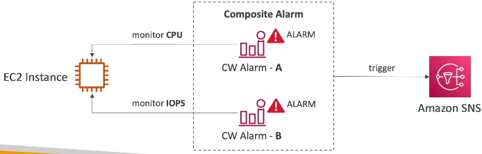

Consider an EC2 instance.

1.  Create Alarm A to monitor the CPU of the EC2 instance. 🖥️
2.  Create Alarm B to monitor the IOPS of the EC2 instance. 💾
3.  Define a Composite Alarm as the junction of Alarm A and Alarm B. 🔗

If Alarm A is in the ALARM state AND Alarm B is in the ALARM state, the Composite Alarm will also enter the ALARM state and trigger an SNS notification. ✉️

### EC2 Instance Recovery

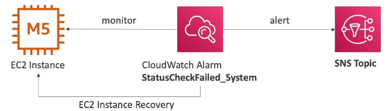

Status checks are used to monitor the health of EC2 instances:

*   Instance status check: Checks the EC2 virtual machine. ✅
*   System status check: Checks the underlying hardware. ⚙️
*   Attached EBS status check: Checks the health of attached EBS volumes. 💽

You can define CloudWatch Alarms on these checks. If an alarm is breached, you can initiate an EC2 instance recovery. ⛑️

During recovery:

*   The instance is moved to another host. ➡️
*   The instance retains the same private, public, and elastic IP addresses. 🌐
*   The instance retains the same metadata. ℹ️
*   The instance retains the same placement group. 📍

You can also send an alert to an SNS topic to notify you when an EC2 instance is being recovered. ✉️

### Additional Considerations

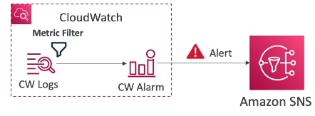

*   You can create alarms based on CloudWatch Logs metric filters. 📝
    *   For example, trigger an alarm when the word "error" appears too many times in the logs. ❗
    *   This alarm can then send a message to Amazon SNS. ✉️

*   To test alarms and notifications, use the CLI call `set-alarm-state`. ⌨️

```bash
aws cloudwatch set-alarm-state --alarm-name <your-alarm-name> --state-value ALARM --state-reason "Testing alarm trigger"
```

💡 **Tip:** This is helpful for verifying that triggering an alarm results in the correct action for your infrastructure, even if the threshold hasn't been reached.

---

## 8. CloudWatch Alarms Hands On - Creating CloudWatch Alarms to Terminate EC2 Instances

This note explains how to create a CloudWatch Alarm that automatically terminates an EC2 instance when CPU utilization exceeds a defined threshold.

### Creating an EC2 Instance 🚀

1.  Launch a new EC2 instance. For this 📌 **Example**, a `t2.micro` instance is sufficient.
2.  Quickly configure the instance and launch it. The primary goal is to have a running instance for alarm configuration.

### Configuring the CloudWatch Alarm ⚙️

1.  **Select a Metric:**
    *   Navigate to CloudWatch Alarms and choose to create a new alarm.
    *   Select the EC2 instance for which you want to monitor CPU utilization. You'll need the instance ID.
    *   Choose the `CPUUtilization` metric.
2.  **Define the Evaluation Criteria:**
    *   Choose how to compute the metric (e.g., average, sum, maximum).
    *   Set the **Period** for evaluation. 5 minutes is suitable if detailed monitoring is not enabled.
    *   Configure the threshold conditions:
        *   Choose between **Static** or **Anomaly detection**.
        *   Set the threshold value (e.g., greater than 70%).
        *   Specify the evaluation period (e.g., three out of three periods, meaning 15 minutes at 95% CPU).

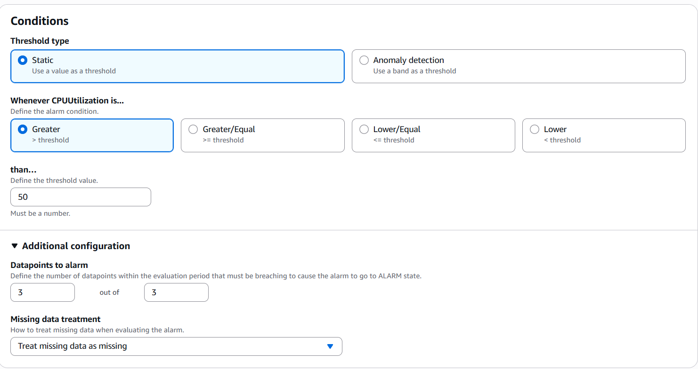

3.  **Define the Action:**
    *   Select an **EC2 action**.
    *   Choose to **terminate** the instance when the alarm is in the `ALARM` state. This is useful if you know that a prolonged high CPU indicates a critical application failure that requires instance termination.

### Naming and Reviewing the Alarm 🏷️

1.  Give the alarm a descriptive name (e.g., "Terminate EC2 on high CPU").
2.  Review the configuration to ensure all settings are correct.
3.  Create the alarm.

### Testing the Alarm 🧪

Initially, the alarm will show "insufficient data" until metrics are collected. To test the alarm without waiting:

1.  Use the AWS CLI to manually set the alarm state to `ALARM`.
2.  Find the API call name: `SetAlarmState`.
3.  Use the following command structure:

    ```bash
    aws cloudwatch set-alarm-state \
        --alarm-name "your-alarm-name" \
        --state-value ALARM \
        --state-reason "Testing" \
        --region us-east-1
    ```

    Replace `"your-alarm-name"` with the actual name of your CloudWatch alarm.
4.  Verify that the EC2 instance is being terminated.

### Verifying the Termination ⚰️

1.  Go to the EC2 Instances dashboard.
2.  Refresh the page.
3.  Confirm that the instance is in the "shutting-down" state and is being terminated.

### Conclusion ✅

By configuring a CloudWatch Alarm with an EC2 termination action, you can automatically terminate instances experiencing prolonged high CPU utilization, mitigating potential application failures. 💡 **Tip:** Always test your alarms in a non-production environment before deploying them to production. ⚠️ **Warning:** Ensure you understand the implications of automatic termination before configuring such alarms. 📝 **Note:** The state reason is just for logging purposes, and can be any string.

---

## 9. Amazon EventBridge

Amazon EventBridge, formerly known as CloudWatch Events, allows you to react to events happening within your AWS environment and beyond.

With EventBridge, you can:

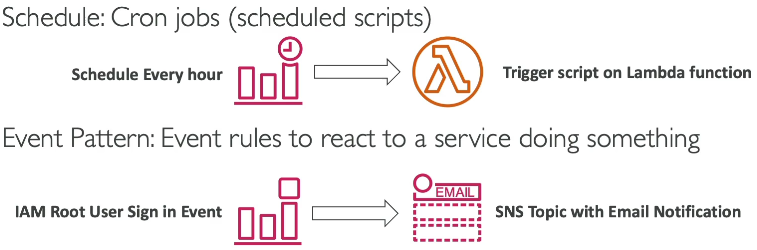

*   ⏰ Schedule cron jobs in the cloud. For instance, trigger a Lambda function every hour to run a script.
*   🔄 React to event patterns. Event rules can respond to actions performed by AWS services.

📌 **Example:** React to an IAM root user sign-in in the console by sending a message to an SNS topic, providing email notification. This enhances security.

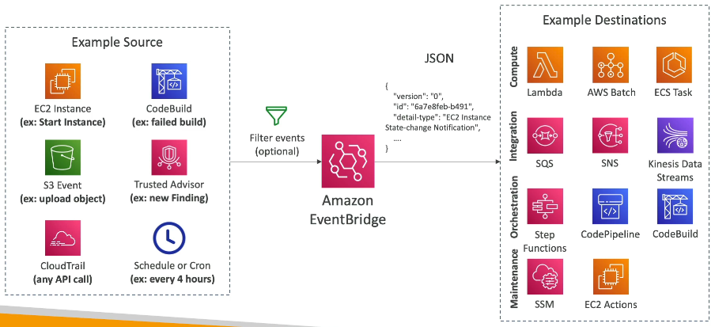

EventBridge acts as a central hub, receiving events from various sources. These sources include:

*   🖥️ EC2 instances (start, stop, terminate events).
*   🏗️ CodeBuild (build failures).
*   🗄️ S3 (object uploads).
*   🛡️ Trusted Advisor (new security findings).
*   ☁️ CloudTrail (intercept any API call made within your AWS accounts).

You can also schedule events using cron expressions, such as every four hours or every Monday at 8:00 AM.

Events sent to EventBridge can be filtered.

📌 **Example:** Filter events for a specific S3 bucket.

EventBridge generates a JSON document representing the event details, including instance IDs, timestamps, and IP addresses. This event can then be sent to various destinations, enabling powerful integrations.

Destinations include:

*   ⚡ Lambda functions.
*   📦 AWS Batch.
*   🐳 Amazon ECS tasks.
*   ✉️ SQS queues.
*   📢 SNS topics.
*   🌊 Kinesis Data Streams.
*   ⚙️ Step Functions.
*   🚀 CodePipeline (CI/CD).
*   🏗️ CodeBuild.
*   🛠️ SSM Automation.
*   🖥️ EC2 actions (start, stop, restart).

The possibilities are vast and depend on your specific use case.

EventBridge offers three types of event buses:

1.  **Default Event Bus:** Receives events from AWS services.
2.  **Partner Event Bus:** Receives events from integrated partners (typically SaaS providers like Zendesk, Datadog, and Auth0). Check the partner list for supported integrations.
3.  **Custom Event Bus:** Allows your own applications to send events, enabling the same destination capabilities as other event buses.

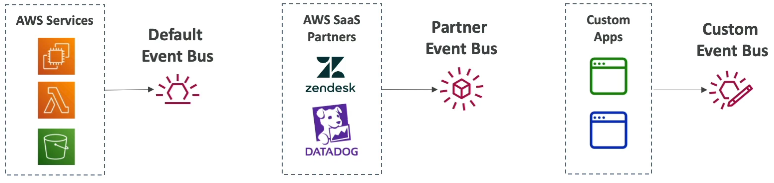

Event buses can be accessed cross-account using resource-based policies.

You can also archive events (all or a subset based on filters) with indefinite or defined retention periods. Archived events can be replayed.

📌 **Example:** Replay archived events to retest a Lambda function after fixing a bug. This is useful for debugging and troubleshooting.

### EventBridge Schema Registry

EventBridge provides a Schema Registry to help you understand the structure of events.

*   EventBridge analyzes events in your bus and infers the schema.
*   The Schema Registry allows you to generate code for your applications, enabling them to understand the data structure in advance.

📌 **Example:** The schema for a CodePipeline action can be downloaded, allowing you to infer the schema and structure data from the event bus.

Schemas can be versioned, allowing for iterative changes over time.

### EventBridge - Resource-Based Policies

EventBridge uses resource-based policies to manage permissions for event buses.

*   You can allow or deny events from other regions or accounts.

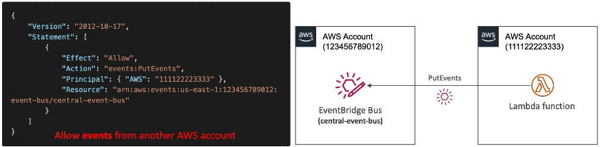

📌 **Example:** Create a central event bus within your AWS organization. Add a resource-based policy allowing other accounts to send events to it using the `PutEvents` API.

```
{
  "Version": "2012-10-17",
  "Statement": [
    {
      "Effect": "Allow",
      "Principal": {
        "AWS": "arn:aws:iam::OTHER_ACCOUNT_ID:root"
      },
      "Action": "events:PutEvents",
      "Resource": "arn:aws:events:REGION:YOUR_ACCOUNT_ID:event-bus/default"
    }
  ]
}
```

In summary, EventBridge enables you to:

*   React to events within your accounts (default event bus).
*   Integrate with partner events.
*   Handle your own events with custom buses.
*   Utilize the Schema Registry.
*   Leverage resource-based policies for cross-account event bus capabilities.

---

## 10. Amazon EventBridge: A Deep Dive into Rules, Schedules, and Integrations

Amazon EventBridge is a powerful event bus service that allows you to react to events within AWS, integrate with SaaS providers, and build automation pipelines without needing custom glue code. Let’s break down the key components and see how they work.

### 🔑 Core Features of EventBridge

* **Rules** – React to events in your AWS account.
* **Pipes** – Connect event sources to targets.
* **Schedules** – Run tasks at regular intervals.
* **Schema Registry** – Organize and manage event schemas.

The **most important part** of EventBridge is its **rules**, so let’s start there.

### 📌 EventBridge Rules

Rules allow you to respond to specific AWS events.

📌 **Example: EC2 Instance State Change**

* You can create a rule to capture `EC2InstanceStateChangeNotification`.
* The rule listens for events like an EC2 instance being **terminated** or **shutting down**.
* This is useful for monitoring unexpected behavior or ensuring visibility into changes.

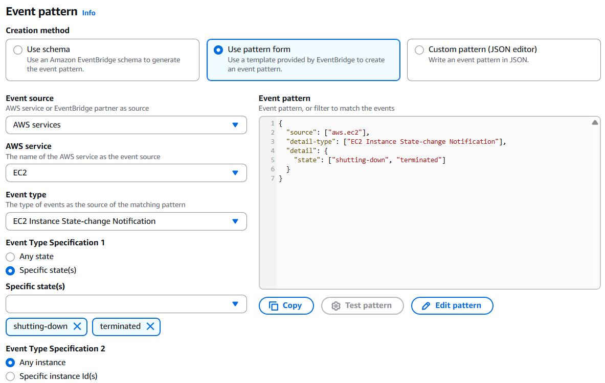

Steps:

1. Define a **rule type** → use an **Rule with an event pattern**.
2. Keep Events section as it is.
3. In Event Pattern:-
    - Creation Method: Use pattern form
    - Event Source: AWS Services
    - AWS Service: **EC2**
    - Event Type: **EC2 Instance State Change Notification**
    - Event Type Specification 1: Specific state(s) => shutting-down or terminated

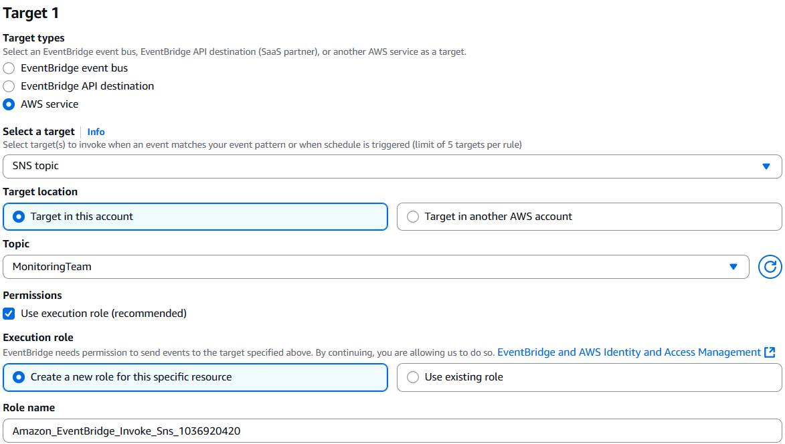

4. Choose a target action.

💡 **Target options include:**

* Sending a notification to **SNS**.
* Sending a message to **SQS**.
* Starting/stopping **EC2** or **ECS tasks**.
* Invoking a **Lambda function**.

Then link this topic as the target. If the topic is subscribed to email, you’ll receive an email every time the EC2 instance state changes.

### ⏰ EventBridge Scheduler

EventBridge also provides a **Scheduler** to invoke actions at defined intervals.

📌 **Example: Hourly Task**

* Create a rule to run a task every hour:- name: `RunEveryHour`.
* Rule type: `Schedule`.
* Click on "Continue in EventBridge Scheduler". It will take you to the Scheduler page (different UI).

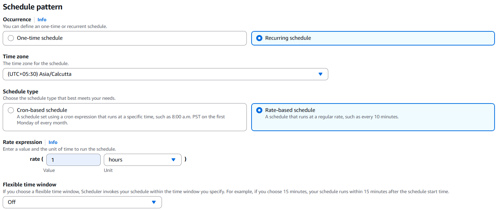

* Occurrence: Recurring Schedule.
* Schedule Type: Rate-based.
* Rate Expression: `rate(1 hour)`.
* Flexible Time Windows: Off.

Select Target:
* Target can be a **Lambda function**, **SQS queue**, or **any AWS API**.
* Useful for cleanup jobs, automations, or regular monitoring tasks.

📝 **Options available:**

* **One-time schedules**
* **Recurring schedules**
* Flexible time windows for execution

### 🎛 Event Buses

* **Default Event Bus**: Automatically available in every account.
* **Custom Event Buses**: Create for security separation, environment isolation, or special workflows.
* You can also **replay events** for debugging or recovery.

### 🤝 Partner Event Sources

EventBridge integrates directly with SaaS providers.

📌 **Example: Auth0 Integration**

* When a user signs up in Auth0, it can trigger an EventBridge event.
* This event can then trigger AWS automations like sending an SNS notification or invoking a Lambda.

This removes the need to write custom glue code between SaaS apps and AWS.

### 🌍 API Destinations

You can configure EventBridge to send events **outside AWS** to external APIs.

📌 **Example:**

* Invoke an external API endpoint of your own system.
* Integrate with SaaS applications like Slack, Jira, or custom dashboards.

### 📑 Schema Registry

The Schema Registry lets you explore **event structures** and generate **code bindings** for supported languages.

Benefits:

* View JSON schema for AWS events (e.g., EC2 state changes).
* Download code bindings for **Java, Python, TypeScript, and Go**.
* Automatically build applications that consume events without manually defining schemas.

### ✅ Key Takeaways

* **Rules**: React to AWS or partner events.
* **Schedules**: Automate recurring or one-time tasks.
* **Event Buses**: Organize events with default or custom buses.
* **Partner Sources & API Destinations**: Integrate AWS with SaaS apps and external systems.
* **Schema Registry**: Simplify schema management and code generation.

Amazon EventBridge is an incredibly versatile tool for automation, integration, and event-driven architecture. Mastering rules and schedules is the best starting point for leveraging its full potential.

---

## 11. CloudWatch Insights Types

Let's explore the different types of CloudWatch Insights products. These tools help you gain deeper visibility into your applications and infrastructure.

### a. CloudWatch Container Insights 🐳

This feature helps you collect, aggregate, and summarize metrics and logs from your containers.

*   It supports containers running on:
    *   Amazon ECS
    *   Amazon EKS
    *   Kubernetes directly on EC2
    *   Fargate (both for ECS and EKS)

CloudWatch Container Insights allows you to extract metrics and logs from your containers and visualize them in detailed dashboards within CloudWatch.

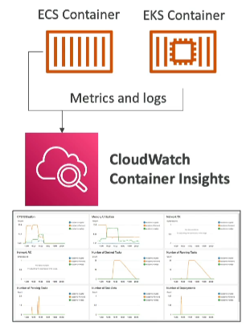

📝 **Note:** When using CloudWatch Container Insights with Kubernetes (Amazon EKS or Kubernetes on EC2), it uses a containerized version of the CloudWatch agent to discover containers.

### b. Lambda Insights ⚡️

Lambda Insights is a monitoring and troubleshooting solution for serverless applications running on AWS Lambda.

*   It collects, aggregates, and summarizes system-level metrics, including:
    *   CPU time
    *   Memory
    *   Disk
    *   Network
*   It also provides information about:
    *   Cold starts
    *   Lambda worker shutdowns

Lambda Insights is provided as a Lambda layer that runs alongside your Lambda function. It creates a dedicated Lambda Insights dashboard to monitor the performance of your Lambda functions. Use this for detailed monitoring of your serverless applications.

### c. Contributor Insights 📊

Contributor Insights analyzes logs and creates time series that display contributed data. **See Metrics about the top-N contributors**. This helps you identify top contributors and understand their usage.

📌 **Example:** Find top talkers on your network and understand who is impacting system performance.

You can run it on any logs generated by AWS services, such as VPC Flow Logs or DNS logs.

📌 **Example:** Identifying Bad Hosts (Like heaviest network users, or find the URLs that generate the most errors.)

1.  Look at VPC Flow Logs (logs of all network requests within your VPC).
2.  Pass the logs to CloudWatch Logs.
3.  Analyze the logs using CloudWatch Contributor Insights.

This allows you to find the top 10 IP addresses generating traffic on your VPC and determine if they are legitimate or malicious.

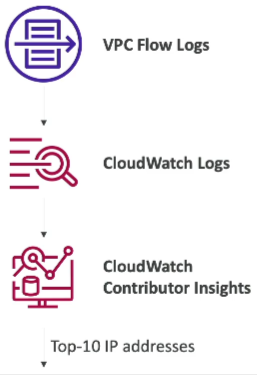

You can build rules from scratch or use pre-built rules provided by AWS. It leverages CloudWatch Logs behind the scenes. Built-in rules can also analyze metrics from other AWS services.

### d. CloudWatch Application Insights ⚙️

CloudWatch Application Insights provides an automated dashboard that shows potential problems with monitored applications, helping you isolate ongoing issues.

*   Supports applications running on Amazon EC2.
*   Supports technologies like Java, .NET, Microsoft IIS web server, and specific databases.

It integrates with other AWS resources, including:

*   EBS
*   RDS
*   ELB
*   ASG
*   Lambda
*   SQS
*   DynamoDB
*   S3 buckets
*   ECS cluster
*   EKS cluster
*   SNS topics
*   API Gateway

If there's an issue with your application, CloudWatch Application Insights automatically creates a dashboard showing potential problems with related services.

This automated dashboard uses SageMaker machine learning internally to provide enhanced visibility into your application health, reducing troubleshooting and repair time.

If a problem originates from one of the AWS resources your application uses, it will surface in the Application Insights dashboard.

Alerts and findings are sent to Amazon EventBridge and SSM OpsCenter, allowing you to be alerted to detected issues.

**Summary:**

*   **CloudWatch Container Insights:** Metrics and logs from ECS, EKS, Kubernetes on EC2, and Fargate. Requires an agent for Kubernetes.
*   **CloudWatch Lambda Insights:** Detailed metrics to troubleshoot serverless applications running on AWS Lambda.
*   **CloudWatch Contributor Insights:** Find top contributors through your CloudWatch Logs.
*   **CloudWatch Application Insights:** Create automatic dashboards to troubleshoot your applications and related AWS services.

---

## 12. ☁️ AWS CloudTrail: Governance, Compliance, and Auditing

CloudTrail provides governance, compliance, and auditing capabilities for your AWS accounts. **It's enabled by default**, giving you a history of events and API calls made within your AWS environment. These calls can originate from the console, SDK, CLI, or other AWS services.

Logs generated by CloudTrail can be stored in CloudWatch Logs or Amazon S3. You can configure a trail to apply to all regions or a single region. This is useful if you want to centralize all event history from across all regions into a specific S3 bucket, for example.

📌 **Example:** If an EC2 instance is terminated and you need to determine who initiated the action, CloudTrail contains the relevant API call details, allowing you to identify the user, the action performed, and the timestamp.

In summary, CloudTrail acts as a central repository for actions performed via the SDK, CLI, console, IAM users, IAM roles, and other AWS services. You can inspect and audit these logs to understand what happened in your AWS environment.

If you need to retain events for longer than 90 days, you can send them to CloudWatch Logs or an S3 bucket.

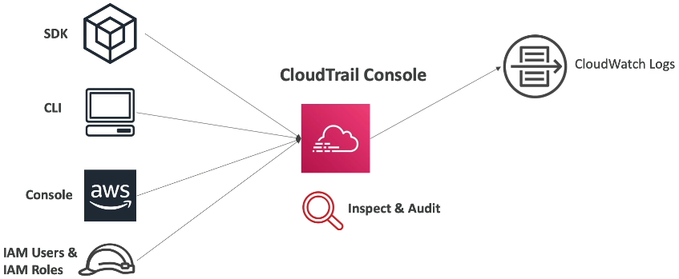

### 🔍 CloudTrail Event Types

There are three main types of events you'll encounter in CloudTrail:

1.  **Management Events:** ⚙️
    *   Represent operations performed on resources within your AWS accounts. Anything that modifies resources in your AWS account is considered as a Management Event.
    *   📌 **Example:** 
        - Configuring security (IAM AttachRolePolicy)
        - Configuring rules for routing data (Amazon EC2 CreateSubnet)
        - Setting up logging (AWS CloudTrail CreateTrail).
    *   Trails are configured to log Management Events by default.
    *   These can be further divided into:
        *   **Read Events:** Do not modify resources. 📌 **Example:** Listing all users in IAM or EC2 instances.
        *   **Write Events:** May modify resources. 📌 **Example:** Deleting a DynamoDB table. Write Events are generally more critical due to their potential impact on your infrastructure.

2.  **Data Events:** 🗂️
    *   Not logged by default due to their high volume.
    *   📌 **Example:** Amazon S3 object-level activity (GetObject, DeleteObject, PutObject).
    *   You can choose to log these events and separate them into Read and Write events:
        *   **Read Event:** GetObject
        *   **Write Event:** DeleteObject, PutObject
    *   AWS Lambda function execution activities (Invoke API) are also considered Data Events.

3.  **CloudTrail Insights Events:** 📊
    *   Analyzes Management Events to detect unusual activity in your accounts.
    *   Requires enabling and incurs additional costs.

### 💡 CloudTrail Insights: Detecting Anomalies

CloudTrail Insights helps identify unusual activity within your AWS accounts, such as:

*   Inaccurate resource provisioning
*   Hitting service limits
*   Bursts of AWS IAM actions
*   Gaps in periodic maintenance activity

It works by establishing a baseline of normal management activities and then **continuously analyzes write events to detect deviations from this baseline**.

Management Events are continuously analyzed by CloudTrail Insights, which generates Insight Events when anomalies are detected.

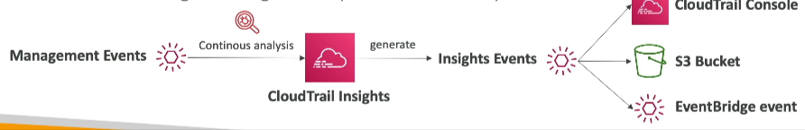

These Insight Events are visible in the CloudTrail console and can also be sent to Amazon CloudWatch and EventBridge for automated responses (e.g., sending an email notification).

### ⏳ CloudTrail Event Retention

By default, events are stored in CloudTrail for 90 days. After this period, they are deleted.

To retain events for longer periods (e.g., for auditing purposes), you need to log them to S3.

To analyze these long-term logs in S3, you can use Amazon Athena, a serverless service that allows you to query data directly in S3.

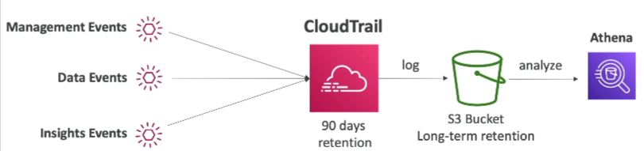

In summary:

*   Management Events, Data Events, and Insights Events are stored in CloudTrail for 90 days.
*   For long-term retention, log these events to S3 buckets.
*   Use Athena to analyze the logs stored in S3.

---

## 13. CloudTrail Overview - Hands On

CloudTrail is a service that intercepts API calls and user activity within your AWS accounts. Let's explore its capabilities.

*   CloudTrail captures all API calls and user actions.
*   It provides a centralized view of activities within your AWS environment.

You can access the event history in the CloudTrail console. This history provides a record of management events for the last 90 days.

*   The event history shows all API calls made over time in your account.
*   Even seemingly uninteresting events are recorded.

📌 **Example:** Terminating an EC2 Instance and Tracking it in CloudTrail

Let's walk through a practical example of how CloudTrail captures events.

1.  I navigated to my EC2 console and located a demo instance.
2.  I terminated the instance by right-clicking and selecting "Terminate."
3.  I then went back to CloudTrail to check if this event was recorded.
4.  After waiting a few minutes and refreshing the page, the "TerminateInstances" API call appeared in the event history.

The event details include:

*   Event source (e.g., EC2)
*   Access key used
*   Region where the action occurred
*   Full event details in JSON format

```json
{
  "eventSource": "ec2.amazonaws.com",
  "eventName": "TerminateInstances",
  "awsRegion": "us-east-1",
  "userIdentity": {
    "accessKeyId": "ASIA...",
    "type": "IAMUser"
  }
}
```

The power of CloudTrail lies in its ability to provide a comprehensive view of events happening within your AWS environment directly from the UI.

This overview provides a good starting point for understanding CloudTrail at the practitioner level and should be sufficient to answer related questions on the exam.

---

## 14. Integrating Amazon EventBridge with CloudTrail

A crucial cultural integration to understand is using Amazon EventBridge to intercept API calls. Let's explore how this works.

Imagine you want to receive an SNS notification whenever a user deletes a table in DynamoDB using the `DeleteTable` API call. Here's the process:

1.  When an API call is made in AWS, it's logged in CloudTrail. This applies to all API calls.
2.  These API calls also appear as events in Amazon EventBridge.
3.  You can create a rule in EventBridge that specifically looks for the `DeleteTable` API call.
4.  This rule can then have a destination, such as Amazon SNS.
5.  Finally, this setup allows you to create alerts based on specific API calls. 🔔

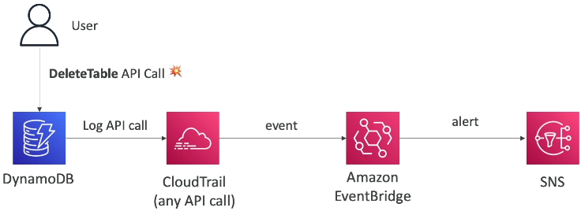

Let's look at some more 📌 **Examples** of how you can integrate Amazon EventBridge and CloudTrail:

*   **Role Assumption:** Get notified whenever a user assumes a role in your accounts. The `AssumeRole` API in IAM is logged by CloudTrail. Using EventBridge, you can trigger a message to an SNS topic. 👤
*   **Security Group Changes:** Intercept API calls that modify Security Group inbound rules. The `AuthorizeSecurityGroupIngress` call (an EC2 API call) is logged by CloudTrail, appears in EventBridge, and can trigger an SNS notification. 🛡️

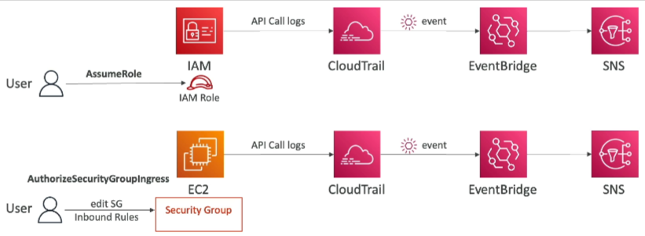

As you can see, the possibilities are vast. You now have some initial ideas on how this integration can be used. 🚀

---

## 15. AWS Config

AWS Config is a service that provides auditing and compliance recording for your AWS resources. It allows you to:

*   Record configurations and their changes over time. ⏱️
*   Quickly roll back to previous configurations. ⏪
*   Identify what happened in your infrastructure. 🔍

Config helps answer questions like:

*   Is there unrestricted SSH access to my security groups? 🔓
*   Do my buckets have public access? 🗄️
*   Has an ALB configuration changed over time? ⚙️

Based on rule compliance, you can receive alerts or SNS notifications for any changes. 🔔

📝 **Note:** Config is a per-region service. Configure it for all relevant regions.

You can aggregate data across regions and accounts to centralize it. Configuration data can be stored in Amazon S3 for later analysis using services like Athena. 📊

### Config Rules

What types of rules can you use in Config?

*   **AWS Managed Config Rules:** There are over 75 pre-built rules. ✅
*   **Custom Config Rules:** Define your own rules using Lambda functions. ⚙️

📌 **Example:**

*   Evaluate if each EBS disk is of type `gp2`.
*   Evaluate if each EC2 instance in your development account is of type `t2.micro`.

Rules can be triggered:

*   On configuration change. 🔄
    📌 **Example:** Evaluate the type of an EBS disk whenever its configuration changes.
*   At regular time intervals. ⏰
    📌 **Example:** Every two hours, ensure all EBS disks are of type `gp2`.

⚠️ **Warning:** **Config Rules are for compliance monitoring only. They do not prevent actions and do not replace security mechanisms** like IAM. Config provides an overview of your configuration and resource compliance.

### Cost

Config can become expensive quickly. 💰

*   \$0.003 per configuration item recorded per region.
*   \$0.001 per config rule evaluation per region.

### Resource Compliance

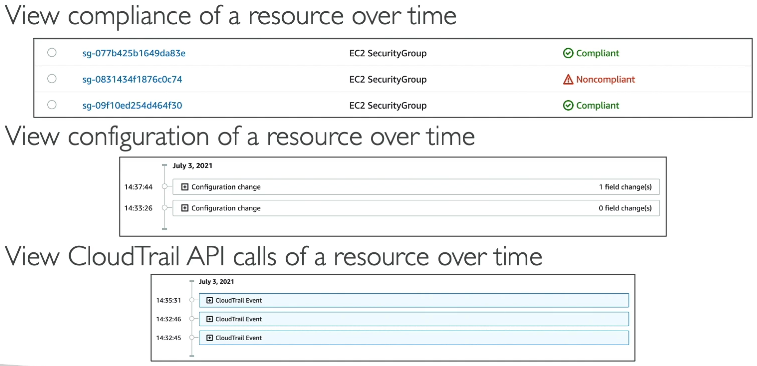

You can view the compliance of a resource over time.

📌 **Example:** A security group has been non-compliant.

You can also view the resource configuration over time, including when the change occurred and who made it. Link Config to CloudTrail to view the API calls made for that resource and get a full picture of events. 🖼️

### Remediation

Although Config cannot deny actions, you can remediate non-compliant resources using SSM Automation Documents. 🛠️

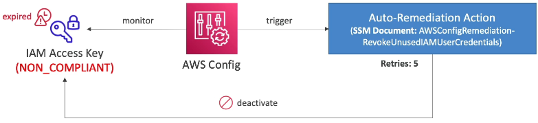

📌 **Example:**

1.  Monitor if IAM access keys have expired (e.g., older than 90 days).
2.  Mark them as non-compliant.
3.  Trigger a remediation action using an SSM document like `RevokeUnusedIAMUserCredentials`.
4.  This document deactivates the IAM access keys.

You can use AWS-managed documents or create your own automation documents. You can even create a document that invokes a Lambda function for custom remediation logic. ⚙️

Remediations may have retries in case the resource is still non-compliant after the initial attempt (e.g., up to five times). 🔁

### Notifications

You can use EventBridge to trigger notifications when resources are non-compliant. 📢

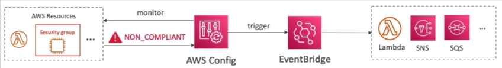

📌 **Example:**

1.  Monitor a security group.
2.  If it becomes non-compliant, trigger an event in EventBridge.
3.  Pass the event to other resources.

Alternatively, you can send all changes and compliance notifications to SNS from Config. Filter SNS topics to send specific events to admin emails, Slack channels, etc. 📧

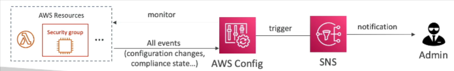

```text
# SNS Filtering Example
{
  "source": ["aws.config"],
  "detail-type": ["ConfigurationItemChangeNotification"],
  "detail": {
    "configurationItem": {
      "resourceType": ["AWS::EC2::SecurityGroup"],
      "compliance": {
        "status": ["NON_COMPLIANT"]
      }
    }
  }
}
```

---

## 16. Configuring AWS Config Service

Let's dive into configuring the AWS Config service.

To get started, click on "Get Started" to begin recording settings.

You can choose to record:

*   All resources supported in the current region.
*   Specific resource types by selecting resource categories and types.

For this demonstration, we'll record all resources.

➕ You can also include global resources like IAM users, groups, roles, and customer-managed policies.

⚠️ **Warning:** The more resources you record, the more it will cost. If you don't want to incur costs during this course, avoid following along with the hands-on steps.

Here's the process:

1.  Record all resources.
2.  Include global resources.
3.  Create a Config service-linked role.
4.  Deliver all configuration information into an Amazon S3 bucket. The bucket name may already be entered for you. You can optionally add a prefix.
5.  Optionally, stream configuration changes and notifications to an Amazon SNS topic. 📝 **Note:** This will send everything to one topic.

We'll skip defining AWS Managed Rules for now, but you can explore them.

Review your configuration:

*   Record all resources, including global resources.
*   Deliver data to an S3 bucket.
*   A role is created automatically.

Click "Confirm" to start the process. The role and bucket will be created, and Config will start.

It takes some time for Config to analyze your account and its configurations.

Even while resources are still being discovered, you can navigate to "Resources" on the left-hand side to see what has already been identified. 📌 **Example:** You might see route tables, subnets, VPCs, etc.

You can filter by resource type. 📌 **Example:** Look for EC2 security groups. Initially, they may not have a compliance status because no rules have been defined.

Let's examine a specific EC2 security group.

*   You can view the applied rules (initially none).
*   You can inspect the security group's configuration.
*   You can view the resource timeline, which shows all events related to the resource. This includes configuration changes and CloudTrail events. 📌 **Example:** `AuthorizeSecurityGroupIngress`, `CreateLaunchConfiguration`, and `CreateSecurityGroup`. You can find these events in CloudTrail.

To determine if security groups are compliant, navigate to "Rules."

You can add either an AWS-managed rule or create a custom rule using a Lambda function.

To keep things simple, let's add an AWS-managed rule.

📌 **Example:** The `approved-amis-by-id` rule checks if running instances use specified AMIs.

This rule can be triggered when a resource changes. You'd need to specify the approved AMI IDs as a parameter.

Instead, let's use a managed rule for SSH, which applies to security groups. The goal is to ensure that incoming SSH traffic isn't allowed from anywhere.

This rule is called "restricted-ssh." The trigger is a configuration change to a resource. 📝 **Note:** Some rules can be run periodically.

This rule applies only to AWS EC2 security groups and has no parameters.

After adding the rule, it will initially show as not evaluated and without remediation.

After a refresh, an evaluation should occur automatically.

📌 **Example:** The "restricted-ssh" rule might identify several non-compliant security groups.

Filtering resources by EC2 security group will show which are compliant and which are not.

A compliant security group will have the rule marked as "compliant." If you examine its inbound rules, you'll likely find that it doesn't have port 22 open.

A non-compliant security group, like "launch-wizard-3," will likely have port 22 open to the world (0.0.0.0/0) in its inbound rules.

To fix this, you can delete the offending rule (port 22 open to the world). This will trigger a re-evaluation and should make the resource compliant.

After deleting the rule and saving the changes, the resource timeline will show:

1.  The initial configuration change.
2.  The rule evaluation (non-compliant).
3.  The configuration change after deleting the rule.
4.  A CloudTrail event for revoking the security group ingress rule.
5.  The rule re-evaluation (compliant).

You can also manage remediation actions directly from the rule.

Under the rule, you can choose "Manage Remediation." You can select manual or automatic remediation.

Automatic remediation allows you to specify the number of retries and the interval between them.

For manual remediation, you'll need to choose a remediation action. These are SSM Automation documents defined by AWS or custom-created. 📌 **Example:** You could delete a snapshot or an image if it's non-compliant.

📌 **Example:** You could attach an EBS volume.

You'll need to define a remediation action that makes sense for the rule. You can also pass parameters to the document.

That covers the basics of AWS Config!

Aggregators allow you to integrate across multiple accounts.

Under "Settings," you can review the configurations you defined earlier, including sending data to an SNS topic.

You can also set up Amazon CloudWatch Event rules to intercept specific non-compliant events for certain rules. These can be configured from the CloudWatch or Events rules console.

That concludes this section.

---

## 17. CloudTrail vs CloudWatch vs Config

When working with AWS services, especially for exams like the AWS Certified Solutions Architect, it's crucial to understand the **differences and use cases** for:

- **CloudWatch**
- **CloudTrail**
- **AWS Config**

Let’s break them down with a helpful analogy using **Elastic Load Balancer (ELB)**.

### 📊 Amazon CloudWatch – *Performance Monitoring*

**Purpose**: Real-time monitoring of metrics and logs

- Tracks **performance metrics**: CPU, memory, disk I/O, network, etc.
- Visualizes data with **dashboards**.
- Enables **alarms and alerts** based on metric thresholds.
- Aggregates and analyzes **logs** (CloudWatch Logs).

🔍 **Example (ELB)**:
- Monitor number of **incoming requests**.
- Track **4XX/5XX error codes** over time.
- Display **latency** and performance graphs on a dashboard.
- Build a **global dashboard** across multiple ELBs.

### 🕵️‍♂️ AWS CloudTrail – *Who Did What, When*

**Purpose**: Auditing and tracking **API activity**

- Records all **API calls** made in your account.
- Captures activity by **users, roles, and services**.
- Can be scoped to specific **resources** or **regions**.
- Stores events in **S3** for long-term auditability.
- Global by default.

🔍 **Example (ELB)**:
- Who changed the **security group rules** on the ELB?
- Who modified or deleted the **SSL certificate**?
- Who **created**, **updated**, or **terminated** the load balancer?

### 🛡️ AWS Config – *Configuration Compliance & History*

**Purpose**: Evaluate and audit **resource configurations** over time

- Captures **point-in-time snapshots** of configuration.
- Maintains **timeline** of changes.
- Checks **compliance** against custom or managed **rules**.
- Ideal for **security**, **audit**, and **governance**.

🔍 **Example (ELB)**:
- Track **configuration changes** like SSL cert updates or listener changes.
- Monitor changes in **security groups** associated with ELB.
- Enforce compliance rules like:
  - ELB must have **SSL certificate**.
  - ELB must not allow **unencrypted traffic (HTTP)**.

### 🧠 Quick Comparison Table

| Feature          | CloudWatch                         | CloudTrail                          | AWS Config                             |
|------------------|------------------------------------|--------------------------------------|----------------------------------------|
| **Focus**        | Performance & health monitoring    | API activity auditing                | Resource configuration & compliance    |
| **Type of Data** | Metrics, logs, alarms              | API calls (who, what, when, where)  | Configuration snapshots & drift        |
| **Retention**    | Customizable                      | Long-term via S3                     | Snapshots stored & queryable           |
| **Common Use**   | Alerts, dashboards, metrics        | Forensic analysis, audit logs       | Security, compliance, governance       |
| **Example**      | Track ELB request count, errors    | Who modified ELB cert or SG         | Ensure ELB always has SSL, no HTTP     |

### ✅ Summary: Complementary Services

- Use **CloudWatch** to monitor **how the system is performing**.
- Use **CloudTrail** to **audit who did what**.
- Use **AWS Config** to understand **what changed and whether it complies**.

When preparing for your AWS certification or working with infrastructure, these tools are essential for **visibility, security, and compliance**.

👋 That’s a wrap on this comparison—see you in the next lecture!

---

## 18. Q & A

### Question 1

You have an RDS DB instance that pushes its database logs to CloudWatch. You want to create a CloudWatch alarm if there's an `Error` in the logs. How would you do that?

**Options:**
- A) Create a scheduled CloudWatch Event that triggers an AWS Lambda every 1 hour, scans the logs, and notifies you through SNS topic.
- B) Create a CloudWatch Logs Metric Filter that filters the logs for the keyword `Error`, then create a CloudWatch Alarm based on that Metric Filter.
- C) Create an AWS Config Rule that monitors `Error` in your database logs and notifies you through SNS topic.

<details>

<summary>Explanation</summary>

* **A is not valid** – Running a scheduled Lambda to scan logs is inefficient, adds cost, and is not the intended use of CloudWatch alarms.
* **B is correct** – Metric Filters are designed to extract patterns (like `Error`) from logs and trigger alarms directly.
* **C is not valid** – AWS Config monitors resource configurations, not log contents, so it cannot detect errors in database logs.

**Correct Answer:** B) Create a CloudWatch Logs Metric Filter that filters the logs for the keyword `Error`, then create a CloudWatch Alarm based on that Metric Filter.

</details>

### Question 3

How would you monitor your EC2 instance memory usage in CloudWatch?

**Options:**
- A) Enable EC2 Detailed Monitoring
- B) By default, the EC2 instance pushes memory usage to CloudWatch
- C) Use the Unified CloudWatch Agent to push memory usage as a custom metric to CloudWatch

<details>

<summary>Explanation</summary>

* **A is not valid** – Detailed Monitoring only increases the frequency of existing metrics (like CPU, network, disk), not memory.
* **B is not valid** – By default, EC2 does not report memory usage to CloudWatch.
* **C is correct** – Memory usage must be collected using the CloudWatch Agent and published as a custom metric.

**Correct Answer:** C) Use the Unified CloudWatch Agent to push memory usage as a custom metric to CloudWatch

</details>

### Question

You have made a configuration change and would like to evaluate the impact of it on the performance of your application. Which AWS service should you use?

**Options:**
- A) Amazon CloudWatch
- B) AWS CloudTrail

<details>

<summary>Explanation</summary>

* **Amazon CloudWatch** monitors performance metrics, application health, and resource utilization, making it the right service to measure the impact of configuration changes.
* **AWS CloudTrail** is for auditing API calls and tracking user activity, not for performance monitoring.

**Answer:** Option **A** – Amazon CloudWatch.

</details>

### Question

You have enabled AWS Config to monitor Security Groups if there's unrestricted SSH access to any of your EC2 instances. Which AWS Config feature can you use to automatically re-configure your Security Groups to their correct state?  

**Options:**  
- A) AWS Config Remediations  
- B) AWS Config Rules  
- C) AWS Config Notifications  

<details>

<summary>Explanation</summary>

AWS Config Remediations allow you to automatically correct non-compliant resources by triggering actions (e.g., AWS Lambda functions or SSM documents) to restore them to a compliant state. In this case, it can fix Security Groups with unrestricted SSH access.

**Answer:** A) AWS Config Remediations

**Why other options are not valid:**

- **AWS Config Rules**: These only evaluate resource compliance and flag issues but do not take corrective actions.
- **AWS Config Notifications**: These alert you to compliance changes (e.g., via SNS) but do not perform automatic remediation.

</details>

### Question

You are running a critical website on a set of EC2 instances with a tightened Security Group that has restricted SSH access. You have enabled AWS Config in your AWS Region and you want to be notified via email when someone modifies your EC2 instances' Security Group. Which AWS Config feature helps you do this?  

**Options:**  
- A) AWS Config Remediations  
- B) AWS Config Rules  
- C) AWS Config Notifications  

<details>

<summary>Explanation</summary>

AWS Config Notifications can publish configuration changes to an Amazon SNS topic, which can then send email alerts. This allows you to be notified immediately when a Security Group is modified.

**Answer:** C) AWS Config Notifications

**Why other options are not valid:**

- **AWS Config Remediations**: This feature automatically corrects non-compliant resources, but it does not send notifications.
- **AWS Config Rules**: These evaluate resource compliance against desired configurations, but they do not directly send notifications; they can trigger events that might be used with notifications, but the notification itself is handled by SNS via Config Notifications.

</details>

### Question

Which is a CloudWatch feature that allows you to send CloudWatch metrics in near real-time to an S3 bucket (through Kinesis Data Firehose) and 3rd party destinations (e.g., Splunk, Datadog, ...)?  

**Options:**  
- A) CloudWatch Metric Stream  
- B) CloudWatch Log Stream  
- C) CloudWatch Metric Filter  
- D) CloudWatch Log Group  

<details>

<summary>Explanation</summary>

CloudWatch Metric Streams provide a continuous, near real-time stream of CloudWatch metrics to destinations like Amazon S3 (via Kinesis Data Firehose) or third-party services (e.g., Splunk, Datadog). This allows for automated metric forwarding without custom code.

**Answer:** A) CloudWatch Metric Stream

**Why other options are not valid:**

- **CloudWatch Log Stream**: Represents a sequence of log events from a single source (e.g., an EC2 instance), but it does not stream metrics.
- **CloudWatch Metric Filter**: Cloudwatch Metric Filters are used to extract metrics from log events by filtering patterns, but it does not stream metrics to external destinations.
- **CloudWatch Log Group**: A container for CloudWatch Log Streams that share retention and permissions, but it is not used for streaming metrics.

</details>

### Question

A company has a running Serverless application on AWS which uses EventBridge as an inter-communication channel between different services. There is a requirement to use the events in the prod environment in the dev environment for testing every 6 months. The events need to be stored and used later. What is the most efficient and cost-effective way to store EventBridge events and use them later?  

**Options:**  
- A) Use EventBridge Archive and Replay feature  
- B) Create a Lambda function to store the EventBridge events in an S3 bucket for later usage  
- C) Configure EventBridge to store events in a DynamoDB table  

<details>

<summary>Explanation</summary>

EventBridge Archive and Replay is a built-in feature that allows you to archive events (with configurable retention) and replay them later to specified targets. It is efficient and cost-effective because it is managed by AWS, requires no custom code, and is designed specifically for this use case.

**Answer:** Use EventBridge Archive and Replay feature

**Why other options are not valid:**

- **Lambda function to S3**: This requires custom code, adds complexity, and may incur higher costs due to Lambda invocations and S3 storage management.
- **Store in DynamoDB**: This is not a native EventBridge feature, requires custom setup, and could be less cost-effective for long-term storage and infrequent access (every 6 months).

</details>

---