# 25 Identity And Access Management (Iam) - Advanced

Sections:-
- [1. AWS Organizations](#1-aws-organizations)
- [2. Organizations - Hands On](#2-organizations---hands-on)
- [3. AWS Organizations: Tag Policies](#3-aws-organizations-tag-policies)
- [4. IAM - Advance Policies](#4-iam---advance-policies)
- [4. IAM Roles vs. Resource-Based Policies: Key Differences 🔑](#4-iam-roles-vs-resource-based-policies-key-differences-)
- [5. IAM Permission Boundaries](#5-iam-permission-boundaries)
- [6. AWS IAM Identity Center](#6-aws-iam-identity-center)
- [7. Microsoft Active Directory and AWS Directory Services](#7-microsoft-active-directory-and-aws-directory-services)
- [8. AWS Directory Services](#8-aws-directory-services)
- [9. AWS Control Tower](#9-aws-control-tower)

---

## 1. AWS Organizations

AWS Organizations is a global service that allows you to manage multiple AWS accounts simultaneously. 🌍

Here's how it works:

*   You create an organization.
*   The main account is the **management account**.
*   Other accounts are **member accounts**.
*   Member accounts can only be part of one organization.

### Consolidated Billing & Pricing Benefits 💰

A key benefit is consolidated billing across all accounts.

*   Single payment method on the management account.
*   Aggregated usage leads to pricing benefits.
    *   Discounts on services like EC2 and S3.
*   Share reserved instances and savings plans discounts across accounts.

### Account Creation Automation

You can automate account creation using the AWS Organizations API.

### Organizational Units (OUs) 🌳

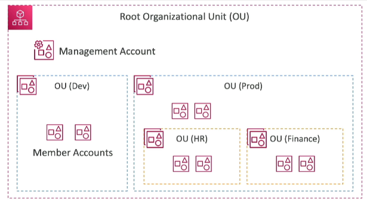

*   **Root OU:** The outermost OU containing all accounts. The management account resides within the root OU.
*   **Sub-OUs:** Create nested OUs for different purposes.

📌 **Example:**

```
Root OU
└── Management Account
└── Dev OU
    ├── Member Account 1
    └── Member Account 2
└── Prod OU
    ├── HR OU
    │   └── HR Member Account
    └── Finance OU
        └── Finance Member Account
```

You can organize OUs by:

1.  Business units (Sales, Retail, Finance)
2.  Environment (Prod, Test, Dev)
3.  Project

You can mix and match these approaches.

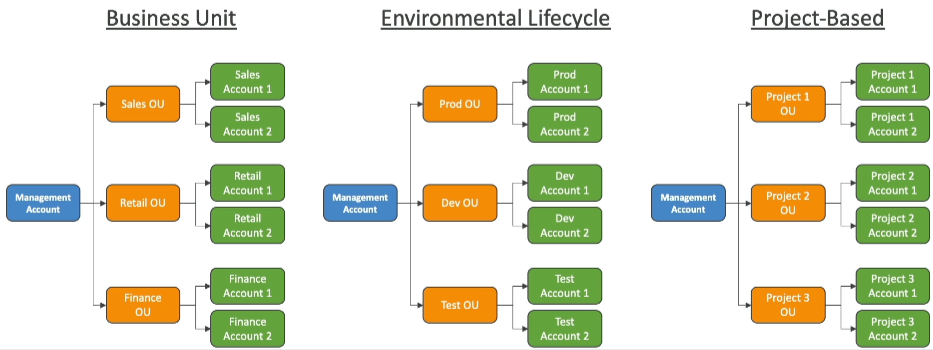

### Advantages of Using Organizations ✅

*   **Improved Security:** Better separation compared to using multiple VPCs within a single account.
*   **Enforced Tagging Standards:** For billing and resource management.
*   **Centralized Logging:** Enable CloudTrail for all accounts and send logs to a central S3 bucket or CloudWatch Logs to a central logging account.
*   **Cross-Account Roles:** Establish roles for administrative purposes from the management account.

### Service Control Policies (SCPs) 🛡️

SCPs are IAM policies applied to specific OUs or accounts. They restrict what users and roles can do within those accounts.

*   SCPs **do not** apply to the management account. The management account always has full admin power. ⚠️ **Warning:** This is a safety measure to prevent accidental lockout.
*   To allow an action, each OU in the hierarchy, including the root, must have an explicit `Allow` statement.

📌 **Example:** SCP Behavior

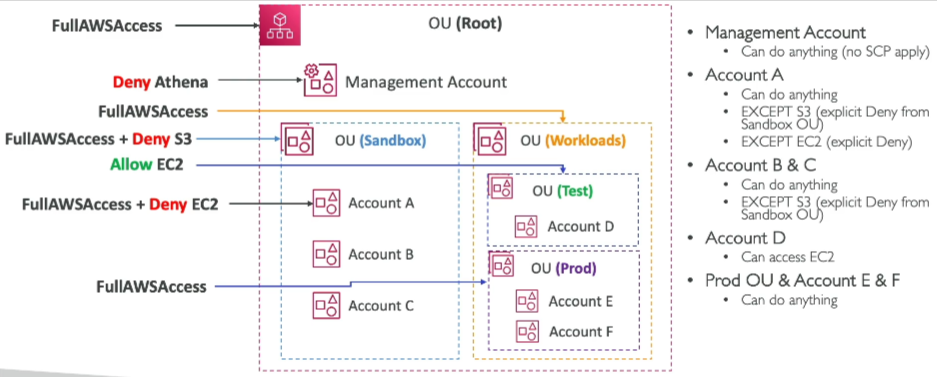

Consider a root OU with full AWS access. Underneath, there are Sandbox, Workloads, Test, and Prod OUs.

1.  **Management Account:** Can do anything (SCPs don't apply).
2.  **Sandbox OU:** Full AWS access + `Deny S3`.
    *   Account A: Full AWS access + `Deny EC2`. Account A cannot access S3 or EC2.
    *   Accounts B & C: Can do anything except access S3 (due to the Sandbox OU's SCP).
3.  **Workloads OU:** Full AWS access.
4.  **Test OU:** `Allow EC2`.
    *   Account D: Can only access EC2.
5.  **Prod OU:** Full AWS access.
    *   Accounts E & F: Can do anything.

📌 **Example:** SCP Structures

*   Blocking a specific service: First statement: `Allow All Actions`, Second statement: `Deny DynamoDB`.

```json
{
  "Version": "2012-10-17",
  "Statement": [
    {
      "Sid": "AllowAllActions",
      "Effect": "Allow",
      "Action": "*",
      "Resource": "*"
    },
    {
      "Sid": "DenyDynamoDB",
      "Effect": "Deny",
      "Action": "dynamodb:*",
      "Resource": "*"
    }
  ]
}
```

*   Allowing only specific services (Allow List):

```json
{
  "Version": "2012-10-17",
  "Statement": [
    {
      "Effect": "Allow",
      "Action": [
        "ec2:*",
        "cloudwatch:*"
      ],
      "Resource": "*"
    }
  ]
}
```

---

## 2. Organizations - Hands On

We're going to practice using **AWS Organizations**.

To get started:
- Navigate to the **Organizations** service in the AWS Console.
- Organizations is a **global service** because it manages AWS accounts across the globe.

### ✅ Account Setup

- A **new AWS master account** named *AWS Course Master Account* was created.
- A second account named *AWS Course Child Account* was also set up in a separate browser window.
- 💡 **Tip**: Don't use your main AWS accounts for this practice. Instead, create two fresh accounts:
  - One as the **management (master)** account.
  - Another as the **member (child)** account.

From the **master account**:
1. Go to Organizations and **create a new organization**.
2. An organization is created with a **root organizational unit (OU)**.
3. The master account becomes the **management account** within the root OU.

### ✅ Adding a Member Account

You can add accounts in two ways:
1. **Create a new account** by specifying:
   - Account name
   - Email of the owner
   - IAM role that the organization can assume
2. **Invite an existing account** using:
   - The email address
   - Or the AWS account ID

📌 Example:
```text
Email: aws-child-account@stephanemaarek.com
````

* Once the invitation is sent, it appears in the **Invitations** section of the child account.
* Accepting the invitation gives the **organization full control** of the account.
* The child account becomes part of the organization.

### ✅ Organizing Accounts with OUs

You can group accounts into **Organizational Units (OUs)** for better management.

Steps:

1. Go inside the Root => Go to **Actions > Create new OU** under the root.
2. Create OUs such as:

   * `Dev`
   * `Test`
   * `Prod`
3. You can **nest OUs** inside other OUs (e.g., `HR`, `Finance` inside `Prod`). Go inside the `Prod` OU and create the `HR` and `Finance` OU.

This hierarchy allows you to:

* Reflect business units or environments.
* Apply fine-grained policies.

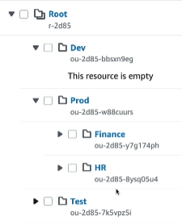

### ✅ Moving Accounts into OUs

* You can **move the child account** into a specific OU, such as:

  * `Prod > Finance`
* Best practice: Leave the **management account** under the root OU.

### ✅ Enabling and Using Service Control Policies (SCPs)

SCPs let you **restrict account permissions** across the organization.

Steps:

1. Go to the **Policies** section.
2. Enable **Service Control Policies (SCPs)**.
3. 📌 Other policy types you can enable:

   * Backup policies
   * Tag policies

> 📝 Note: For exam prep, **SCPs** are the most relevant.

### ✅ Creating a Deny Policy

Create a policy named `DenyAccessToS3`:

```json
{
  "Version": "2012-10-17",
  "Statement": [
    {
      "Sid": "denyS3",
      "Effect": "Deny",
      "Action": "s3:*",
      "Resource": "*"
    }
  ]
}
```

* Attach this policy to the `Finance` OU.
* It **automatically applies** to all accounts within that OU due to **inheritance**.

📌 Example of inheritance:

* `Root` has full access
* `Prod` inherits full access from `Root`
* `Finance` inherits from `Prod`
* `Child Account` inherits from `Finance`

### ✅ Verifying SCP Effect

* Open the **S3 Console** from the **child account**.
* You'll see an error: **no permission to list buckets**.
* ✅ Even the **root user of the child account** is affected by SCPs.

### ✅ Summary

* SCPs offer powerful account-wide restrictions.
* Organizational structure via OUs simplifies policy management.
* Inheritance ensures policies are **consistently applied** across all levels.

---

## 3. AWS Organizations: Tag Policies

AWS Organizations supports a special type of policy called a **Tag Policy**. The main purpose of tag policies is to ensure that resources across all your accounts follow a **consistent tagging strategy** ✅.

### Why Use Tag Policies?

* Ensure consistent **tagging** across resources.
* Audit tagged resources to verify compliance.
* Maintain proper resource **categorization**.
* Enable accurate **cost allocation** and **resource tracking**.

### How Tag Policies Work

* You define **tag keys** and their allowed values.
* These policies enforce restrictions on how tags can be applied to resources across accounts.
* They help prevent non-compliant tagging operations on supported services and resources.
* Important: tag policies don’t affect resources that have **no tags**.

📌 **Example:**
If your organization requires a `Project` tag with values like `Finance`, `HR`, or `IT`, you can enforce this rule using a tag policy.

```json
{
  "tags": {
    "Project": {
      "enforcedFor": ["ec2:instance", "s3:bucket"],
      "values": ["Finance", "HR", "IT"]
    }
  }
}
```

### Benefits of Using Tag Policies

* ✅ **Cost Allocation Tags**: Maintain consistency so billing can be broken down by tags.
* ✅ **Attribute-Based Access Control (ABAC)**: Enforce access rules based on consistent tag usage.
* ✅ **Compliance Monitoring**: Generate reports listing tagged, untagged, and non-compliant resources.
* ✅ **Event-Driven Monitoring**: Use **Amazon EventBridge** to detect and respond to non-compliant tagging in real time.

### Exam Tip 📝

If you get a question about **how to enforce consistent tagging across multiple accounts**, always think of **AWS Organizations Tag Policies**.

---

## 4. IAM - Advance Policies

IAM conditions are crucial for refining your policies and enhancing security. They apply broadly within IAM, affecting policies for:

*   Users
*   Resource policies (e.g., S3 buckets)
*   Endpoint policies
*   And more!

Here's a breakdown of some key IAM conditions:

### `aws:SourceIP`

This condition restricts API calls based on the client's IP address.

📌 **Example:**

```json
{
  "Version": "2012-10-17",
  "Statement": [
    {
      "Effect": "Deny",
      "Action": "*",
      "Resource": "*",
      "Condition": {
        "NotIpAddress": {
          "aws:SourceIp": [
            "192.0.2.0/24", 
            "203.0.113.0/24"
          ]
        }
      }
    }
  ]
}
```

This policy denies access unless the API call originates from within the specified IP address ranges. This is useful for limiting AWS access to your company network. 🏢

### `aws:RequestedRegion`

This condition restricts API calls based on the AWS region.

📌 **Example:**

```json
{
  "Effect": "Deny",
  "Action": [
    "ec2:*",
    "rds:*",
    "dynamodb:*"
  ],
  "Condition": {
    "StringEquals": {
      "aws:RequestedRegion": [
        "eu-central-1",
        "eu-west-1"
      ]
    }
  }
}
```

This policy denies access to EC2, RDS, and DynamoDB in the `eu-central-1` and `eu-west-1` regions. This can be applied at the organization level using SCPs to enforce regional compliance. 🌍

### `ec2:ResourceTag` and `aws:PrincipalTag`

`ec2:ResourceTag` applies to tags on EC2 instances, while `aws:PrincipalTag` applies to user tags.

📌 **Example:**

```json
{
  "Effect": "Allow",
  "Action": [
    "ec2:StartInstances",
    "ec2:StopInstances"
  ],
  "Resource": "*",
  "Condition": {
    "StringEquals": {
      "ec2:ResourceTag/Project": "DataAnalytics",
      "aws:PrincipalTag/Department": "Data"
    }
  }
}
```

This policy allows starting and stopping EC2 instances only if the instance has the tag `Project=DataAnalytics` and the user has the tag `Department=Data`. This allows for fine-grained access control based on both resource and user attributes. 🏷️

### `aws:MultiFactorAuthPresent`

This condition enforces multi-factor authentication (MFA).

📌 **Example:**

The user can perform any action on EC2, but can only stop and terminate instances if MFA is present.

```json
{
  "Effect": "Deny",
  "Action": [
    "ec2:TerminateInstances",
    "ec2:StopInstances"
  ],
  "Condition": {
    "Bool": {
      "aws:MultiFactorAuthPresent": "false"
    }
  }
}
```

This policy denies the ability to terminate or stop EC2 instances if MFA is not enabled for the user. 🔐

### S3 Bucket Policies

S3 bucket policies control access to buckets and objects.

📝 **Note:** Bucket-level permissions (e.g., `ListBucket`) require specifying the bucket ARN directly (`arn:aws:s3:::test`). Object-level permissions (e.g., `GetObject`, `PutObject`, `DeleteObject`) require specifying the object ARN with `/*` to represent all objects within the bucket (`arn:aws:s3:::test/*`).

📌 **Example:**

```json
{
  "Effect": "Allow",
  "Action": "s3:ListBucket",
  "Resource": "arn:aws:s3:::test"
},
{
  "Effect": "Allow",
  "Action": [
    "s3:GetObject",
    "s3:PutObject",
    "s3:DeleteObject"
  ],
  "Resource": "arn:aws:s3:::test/*"
}
```

### `aws:PrincipalOrgID`

This condition restricts resource policies to accounts within an AWS Organization.

📌 **Example:**

```json
{
  "Effect": "Allow",
  "Action": [
    "s3:PutObject",
    "s3:GetObject"
  ],
  "Resource": "arn:aws:s3:::my-bucket/*",
  "Condition": {
    "StringEquals": {
      "aws:PrincipalOrgID": "o-xxxxxxxxxxx"
    }
  }
}
```

This policy allows `PutObject` and `GetObject` actions only if the API call originates from an account within the specified AWS Organization. This ensures that only member accounts can access the S3 bucket. 🏢

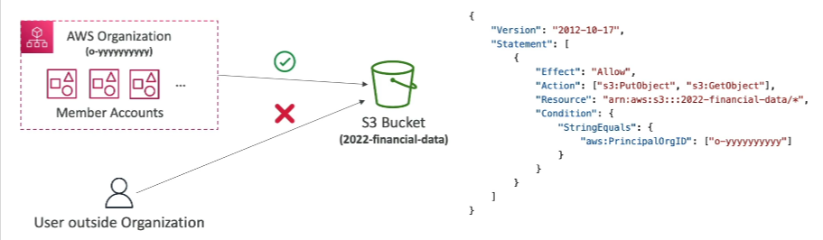

By using these conditions, you can create highly specific and secure IAM policies tailored to your organization's needs. 🛡️

---

## 4. IAM Roles vs. Resource-Based Policies: Key Differences 🔑

**When dealing with cross-account access**, especially for API calls to services like S3, you have two primary options:

*   Resource-based policies (e.g., S3 bucket policies).
*   IAM roles.

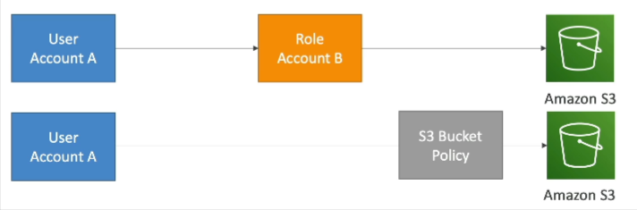

Let's illustrate with an example: A user in Account A needs to access an S3 bucket in Account B. This can be achieved in two ways:

*   The user in Account A assumes a role in Account B, granting them permissions to access the S3 bucket.
*   A bucket policy is placed on the S3 bucket in Account B, allowing the user in Account A to access it.

Both approaches are valid, but there are crucial differences.

### IAM Roles 🎭

When you assume an IAM role (user, application or service):

*   You give up your original permissions.
*   You inherit all the permissions associated with the assumed role.

💡 **Tip:** Think of it as temporarily becoming the role. You can only do what the role is permitted to do.

### Resource-Based Policies 🛡️

With resource-based policies:

*   The principal (e.g., user) does not assume a role.
*   The principal retains their original permissions.

📌 **Example:** A user in Account A needs to scan a DynamoDB table in Account A and then write the data to an S3 bucket in Account B. Using a resource-based policy allows the user to both scan the DynamoDB table (using their original permissions) and write to the S3 bucket in Account B (because the bucket policy grants them permission).

#### Service Supporting Resource-Based Policies ⚙️

Resource-based policies are supported by a growing number of AWS services, including:

*   Amazon S3 buckets
*   SNS topics
*   SQS queues
*   Lambda functions
*   API Gateway

### Amazon EventBridge Integration 🌉

The choice between IAM roles and resource-based policies becomes particularly relevant with Amazon EventBridge.

*   When an EventBridge rule runs, it requires permissions to access its targets.
*   If the target supports resource-based policies (e.g., Lambda functions, SNS topics, SQS queues, S3 buckets, API Gateway), EventBridge can directly add a resource-based policy to the target, allowing invocation from the EventBridge rule.
*   If the resource does not support resource-based policies, EventBridge will use an IAM role to invoke the target service (e.g., Kinesis Data Streams, EC2 Auto Scaling, System Manager Run Command, ECS task).

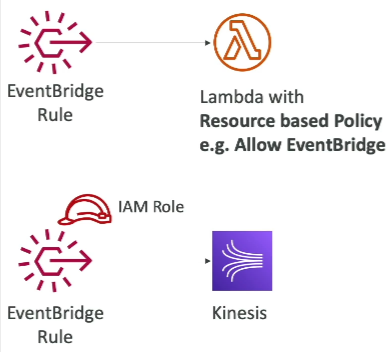

📝 **Note:** Even if a service supports resource-based policies, EventBridge might still opt to use an IAM role.

📌 **Example:** Kinesis Data Streams supports resource-based policies, but EventBridge uses an IAM role for invocation.

### Determining the Method 🔍

To determine whether EventBridge will use a resource-based policy or an IAM role, examine the configuration of the EventBridge role itself.

Here's a summary of common services and their typical integration method with EventBridge:

*   **Resource-Based Policies:** Lambda, SNS, SQS, S3 buckets, API Gateway
*   **IAM Roles:** Kinesis Data Streams, EC2 Auto Scaling, System Manager Run Command, ECS task

⚠️ **Warning:** While Kinesis Data Streams supports resource-based policies, EventBridge currently uses IAM roles.

---

## 5. IAM Permission Boundaries

IAM Permission Boundaries are an advanced feature supported for users and roles, but **not** for groups. They allow you to define the maximum permissions an IAM entity can have.

📌 **Example:**

Imagine an IAM permission boundary that allows everything on S3, CloudWatch, and EC2. If you attach this boundary to an IAM user, they can only perform actions within those services.

To grant specific permissions, you need to attach an IAM policy in addition to the permission boundary.

📌 **Example:**

If you attach a policy allowing `iam:CreateUser` with resource `*` to the same user, the user will **NOT** be able to create other IAM users. This is because the `iam:CreateUser` action is outside the scope of the S3, CloudWatch, and EC2 permission boundary.

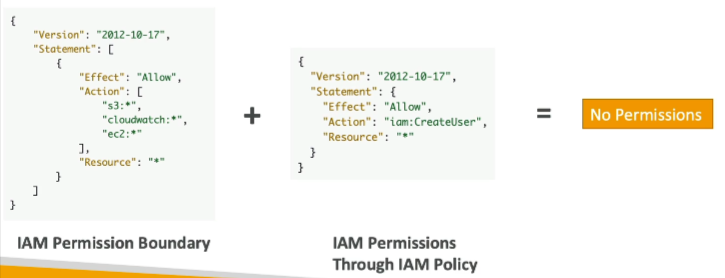

Let's see how to create an IAM permission boundary in the AWS console:

1.  Create a new user (e.g., "John") and grant programmatic access.
2.  Do not assign any permissions initially.
3.  After the user is created, navigate to the user's details.
4.  Add permissions to the user.
    *   📌 **Example:** You could attach the `AdministratorAccess` policy. This would normally give the user full access.
5.  Set a permission boundary.
    *   📌 **Example:** Limit the user to `AmazonS3FullAccess`.
6.  Now, even though the user has `AdministratorAccess` attached, the permission boundary restricts them to only accessing S3.

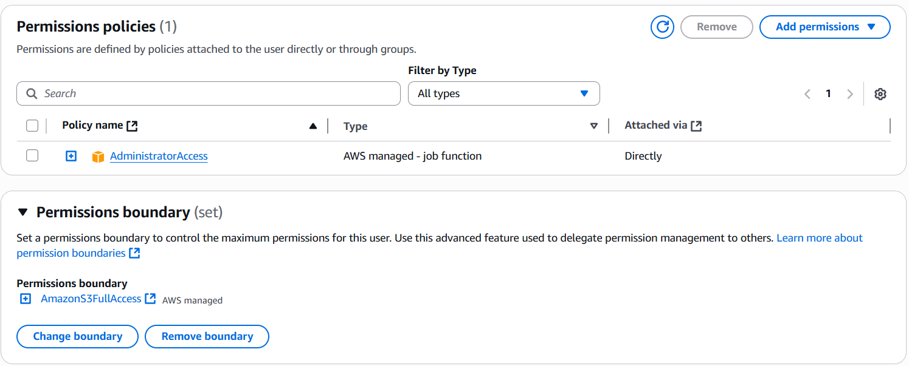

💡 **Tip:** The permission boundary is more restrictive than the attached policies.

IAM Permission Boundaries can be used in conjunction with AWS Organizations Service Control Policies (SCPs).

The effective permissions are determined by the intersection of:

*   Identity-based policies (attached to users or roles)
*   IAM permission boundaries (for users and roles only - not for groups)
*   Organization SCPs (applied to all IAM entities in an account)

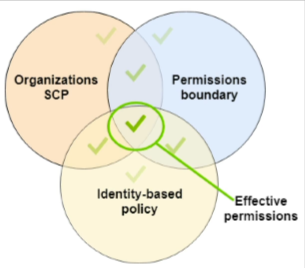

Use Cases for Permission Boundaries:

*   Delegate responsibilities to non-administrators within defined boundaries, such as creating new IAM users.
*   Allow developers to self-assign and manage their own permissions, preventing privilege escalation (e.g., becoming administrators).
*   Restrict a specific user within an organization instead of applying a broad SCP to the entire account.

### IAM Policy Evaluation Logic

The IAM Policy Evaluation Logic determines whether an action is allowed or denied. You don't need to memorize it, but understanding the flow is crucial.

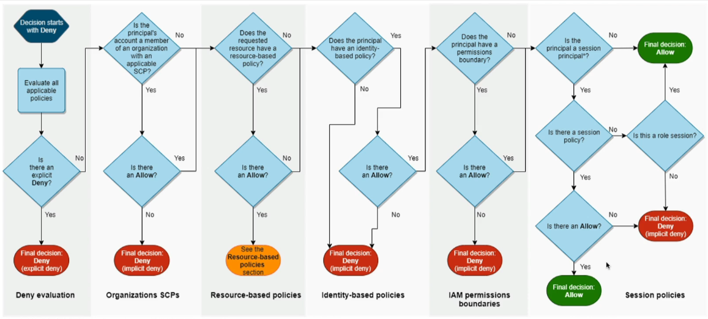

The evaluation process involves several steps:

1.  **Explicit Deny:** If there's an explicit deny in any policy, the action is denied.
2.  **Organizations SCP:** Is there an allow? If not, the action is denied (implicit deny).
3.  **Resource-Based Policy:** (e.g., S3 bucket policies, SQS policies). Is there an allow? If not, continue to the next step.
4.  **Identity-Based Policy:** (attached to users, groups, or roles). Is there an allow? If not, continue to the next step.
5.  **IAM Permission Boundaries:** Is the action within the boundary? If not, the action is denied.
6.  **Session Policies:** (related to STS).

Only if **all** applicable policies allow the action (and no policy explicitly denies it) will the action be permitted.

Resources:- [Policy Evaluation Logic](https://docs.aws.amazon.com/IAM/latest/UserGuide/reference_policies_evaluation-logic.html)

Let's analyze a policy 📌 **Example:**

```json
{
  "Version": "2012-10-17",
  "Statement": [
    {
      "Effect": "Deny",
      "Action": "sqs:*",
      "Resource": "*"
    },
    {
      "Effect": "Allow",
      "Action": "sqs:DeleteQueue",
      "Resource": "*"
    }
  ]
}
```

*   Can you perform `sqs:CreateQueue`? No. There's a `Deny` on `sqs:*`, and `CreateQueue` falls under that.
*   Can you perform `sqs:DeleteQueue`? No. Even though there's an `Allow` for `sqs:DeleteQueue`, the explicit `Deny` on `sqs:*` takes precedence.
*   Can you perform `ec2:DescribeInstances`? No. There's nothing about EC2 in this policy, so there is no explicit allow, and therefore the action is not permitted.

---

## 6. AWS IAM Identity Center

The AWS IAM Identity Center is the successor to the AWS Single Sign-On (SSO) service. It's essentially the same service, but with a new name. It provides a single login for:

*   All your AWS accounts in AWS Organizations.
*   Your business cloud applications (Salesforce, Box, Microsoft 365, etc.).
* SAML2.0-enabled applications
*   Your EC2 Windows Instances.

This "one login access to everything" approach is highly beneficial. The exam will likely focus on the single login aspect for multiple AWS accounts.

The identity provider (where user credentials are stored) can be:

*   A built-in identity store within IAM Identity Center.
*   A third-party identity provider such as Active Directory (AD), OneLogin, or Okta.

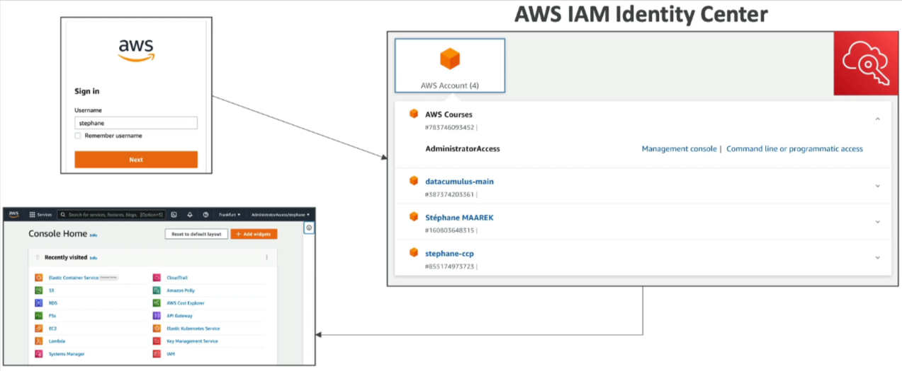

Here's a simplified login flow:

1.  Navigate to the AWS IAM Identity Center login page.
2.  Enter your username and password.
3.  You are then directed to the IAM Identity Center.
4.  From there, you can select the AWS account or application you want to access.
5.  Clicking on an account takes you directly to the management console for that account, already logged in.

No need to enter passwords for each individual account or application! You gain SSO access to accounts, business applications, and more. If you manage multiple AWS accounts, using this service is highly recommended.

### How it Works

The browser interface connects to the login page of your AWS IAM Identity Center. This needs to be integrated with your user stores:

*   Active Directory (cloud or on-premises) for managing users and groups.
*   IAM Identity Center's built-in identity store for defining users and groups, similar to IAM.

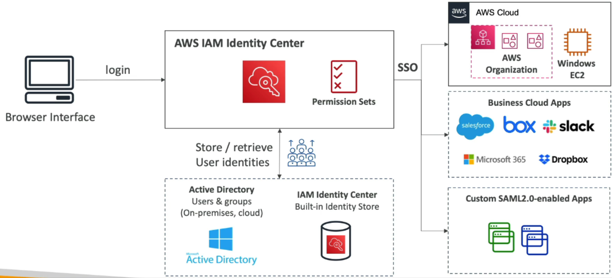

Identity Center integrates with SSO for:

*   Your organization.
*   Windows EC2 Instances.
*   Business Cloud Applications.
*   Custom SAML 2.0 enabled applications.

Again, the key benefit is a single login for all these resources, simplifying the overall workflow.

⚠️ **Warning:** Logging in doesn't grant access to everything by default.

You define **permission sets** within Identity Center to control which users have access to specific resources.

### Permissions, Users, and Groups

Let's illustrate how permissions, users, and groups relate within IAM Identity Center:

1.  You have an organization with IAM Identity Center set up in the management account.
2.  You have two Organizational Units (OUs): Development and Production, each with its own accounts.
3.  You have two developers: Bob and Alice.

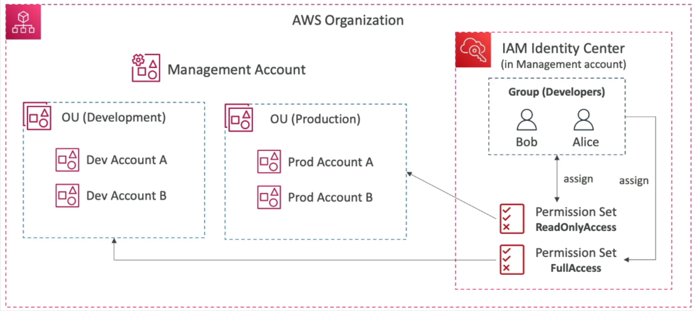

Here's how you would manage their access:

1.  In IAM Identity Center (in the management account), Create a "Developers" group for Bob and Alice, similar to IAM.
2.  Create a permission set called "AdminAccess" for the Development OU, granting administrative privileges.
3.  Associate the "AdminAccess" permission set with the Development OU.
4.  Assign the "AdminAccess" permission set to the "Developers" group. This allows Bob and Alice to assume a role on any Development account, granting them full access.
5.  Create another permission set called "ReadOnlyAccess" for the Production OU.
6.  Associate the "ReadOnlyAccess" permission set with the Production OU.
7.  Assign the "ReadOnlyAccess" permission set to the "Developers" group.

This demonstrates how users relate to groups, permission sets, and specific account assignments within IAM Identity Center.

### Fine-Grained Permissions and Assignments

IAM Identity Center offers fine-grained permissions and assignments:

*   **Multi-Account Permissions:** Manage access across multiple accounts within your organization.
*   **Permission Sets:** Define one or more IAM Policies assigned to users and groups, determining their access within AWS.

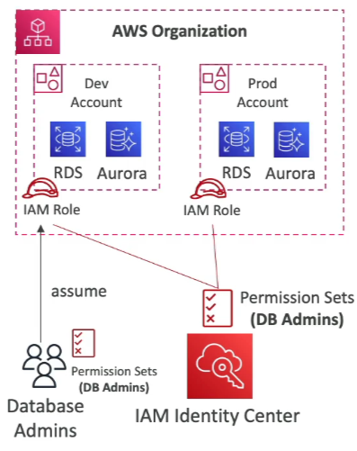

📌 **Example:**

Imagine you have a permission set for "Database Admins." This permission set is a collection of IAM policies that grant access to RDS and Aurora in both your Development and Production accounts.

When a user in the "Database Admins" group logs in through IAM Identity Center and accesses the console of either the Development or Production account, they automatically assume an IAM role within that specific account, granting them the appropriate permissions.

*   **Application Assignments:** Define which users or groups can access specific applications, providing them with the necessary URLs, certificates, and metadata.

### Attribute-Based Access Control (ABAC)

IAM Identity Center enables Attribute-Based Access Control (ABAC). This allows for fine-grained permissions based on user attributes stored in the IAM Identity Center Store.

*   You can assign users to cost centers, give them titles (Junior, Senior), or assign them a locale.
*   This allows you to define IAM permission sets once, leveraging these attributes. You can then modify user access to AWS by simply changing the underlying attributes.

💡 **Tip:**  ABAC is an advanced use case enabled by AWS IAM Identity Center.

---

## 7. Microsoft Active Directory and AWS Directory Services

Microsoft Active Directory (AD) is a software found on any Windows Server with AD Domain Services. It's a database of objects, including:

*   User accounts
*   Computers
*   Printers
*   File shares
*   Security groups

All users within a Microsoft ecosystem on-premise are managed by Microsoft Active Directory, providing centralized security management. You can create accounts, assign permissions, and so on. 

- Objects are organized into a **trees**. 
- A group of trees is called a **forest**.

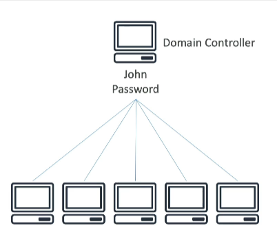

📌 **Example:** Creating a user account "John" with password "Password" on a domain controller. All other Windows machines within the network connected to this domain controller can then authenticate using these credentials. This allows users to access any machine within the domain.

AWS Directory Services provides a way to create an Active Directory on AWS. There are three main flavors:

1.  AWS Managed Microsoft AD
2.  AD Connector
3.  Simple AD

It's important to understand the differences between these.

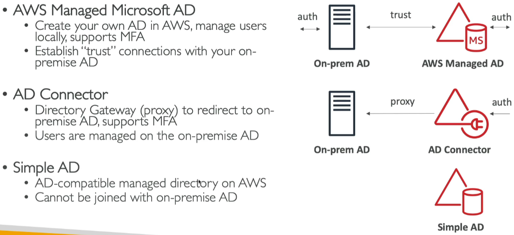

### 1. AWS Managed Microsoft AD

This allows you to create your own Active Directory in AWS.

*   You can manage users locally.
*   It supports multi-factor authentication (MFA).
*   You can create a trust connection with your on-premise AD.

This trust relationship is two-way: AWS trusts the on-premise AD, and the on-premise AD trusts AWS. This allows users to be shared between the on-premise Active Directory and AWS. If a user authenticates using an account not managed by AWS, it can look up the account in the on-premise Active Directory, and vice versa.

### 2. AD Connector

This acts as a direct gateway proxy to redirect to the on-premise AD.

*   It supports MFA.
*   Users are solely managed in the on-premise AD.

📌 **Example:** When a user tries to authenticate with the AD Connector, it proxies the request back to the on-premise AD for lookup.

The key difference between AWS Managed Microsoft AD and AD Connector is that with the former, users can reside in both AWS Managed AD and on-premise AD, while with the latter, all user management is done on the on-premise AD.

### 3. Simple AD

This is an AD-compatible managed directory on AWS.

*   It doesn't use Microsoft Directory.
*   It cannot be joined with an on-premise Active Directory.

If you don't have an on-premise AD and need an Active Directory for your AWS Cloud, Simple AD is a good option. You can create EC2 instances running Windows that can join the domain controllers for your network and share logins and credentials. This is why having a directory in AWS is useful – it's closer to your EC2 instances running Windows.

📝 **Note:** The exam may contain high-level questions asking which service to use based on specific requirements:

*   Proxy users to on-premise: Use AD Connector.
*   Manage users in AWS with MFA: Use AWS Managed AD.
*   Need a simple AD without on-premise integration: Use Simple AD.

### Integrating IAM Identity Center with Active Directory

#### Connect to an AWS Managed Microsoft AD (Directory Service)

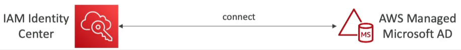

If you connect to an Active Directory managed on AWS using Directory Service, the integration with IAM Identity Center is out-of-the-box. You simply tell IAM Identity Center to integrate and connect to your AWS Managed Microsoft AD.

#### Connect to a self-managed directory (on-premises)

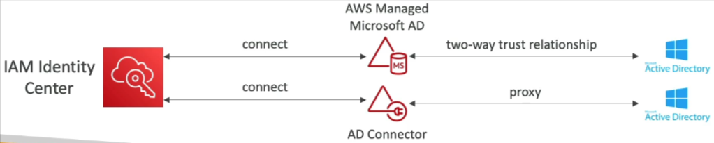

However, if you have a self-managed directory (e.g., on-premises), you have two options:

1.  **Two-way trust relationship using AWS Managed Microsoft AD:** Create a Managed Microsoft AD from the directory service and set up a two-way trust relationship between your on-premise AD and your Managed AD. Then, use the out-of-the-box integration from IAM Identity Center for single sign-on.

2.  **AD Connector:** Use an AD Connector to integrate with IAM Identity Center. The AD Connector will proxy any request to your self-managed directory.

The choice between these options depends on whether you want to manage users within the cloud on Active Directory in the cloud. If so, the first solution is better. If you only want to proxy API calls, the second solution could be a fit, although with potentially more latency.

---

## 8. AWS Directory Services

Let's explore the different directory service options available in AWS. 💻 To see these options, navigate to the console and type "directory service."

We have four main options, but it's important to 📝 **Note:** that the fourth option, Amazon Cognito User Pool, redirects to the Cognito service and isn't considered a directory service in this context. So, we'll focus on the other three:

1.  **AWS Managed Microsoft AD:** This allows you to have an Active Directory integrated with the AWS Cloud. ☁️ It can establish a trust relationship with your on-premise directory. There are two editions:

    *   Standard Edition: Up to 30,000 objects.
    *   Enterprise Edition: Up to 500,000 objects.

    The setup process is quite involved and AD-specific, so we won't cover it in detail here. ⚠️ **Warning:** You don't need to know the detailed setup for the exam.

2.  **Simple AD:** This is a standalone managed directory with an Active Directory-compatible API. However, it cannot be connected to your on-premise Active Directory. 🚫

3.  **AD Connector:** This acts as a proxy, redirecting directory requests to your existing on-premise Microsoft Active Directory. ➡️ It comes in two sizes:

    *   Connector for up to 500 users.
    *   Connector for up to 5,000 users.

To summarize:

*   AWS Managed Microsoft AD supports MFA. ✅
*   Simple AD is a standalone directory. 🧍
*   AD Connector is a proxy. 📡

---

## 9. AWS Control Tower

Let's dive into **AWS Control Tower**, a service that makes it easy to set up and govern a **secure** and **compliant multi-account AWS environment**—all based on AWS best practices.

### ✅ What is AWS Control Tower?

- A **simplified setup** for creating and managing AWS accounts.
- Automates:
  - Account creation (via **AWS Organizations**).
  - Configuration based on pre-set rules.
  - Ongoing compliance and governance.
- Ensures all created accounts follow **security** and **compliance** standards.
- Provides a **centralized dashboard** to monitor your environment.

### ✅ Key Benefits

1. **Quick setup** of multi-account environments in just a few clicks.
2. **Pre-configured settings** and security policies applied automatically.
3. **Ongoing policy management** via **guardrails**.
4. Detect and automatically remediate policy violations.
5. Monitor overall **compliance** across all accounts using an interactive dashboard.

> 📝 Note: Control Tower builds **on top of AWS Organizations**.

### 🛡️ What Are Guardrails?

Guardrails are **governance rules** that help ensure your accounts stay secure and compliant. Control Tower supports two types of guardrails:

#### 1. **Preventive Guardrails** 🔒
- **Restrict behavior** before it happens.
- Implemented via **Service Control Policies (SCPs)**.
- Applied across all member accounts.
- 📌 Example: Restrict all accounts to only operate in `us-east-1` and `eu-west-2`.

💡 **Tip**: Preventive guardrails enforce hard boundaries to ensure compliance.

#### 2. **Detective Guardrails** 🔍
- **Detect non-compliant behavior** after it happens.
- Powered by **AWS Config**.
- Monitor configurations across all accounts.
- 📌 Example: Detect **untagged resources**.

⚙️ How it works:
- Control Tower enables AWS Config in all member accounts.
- Config evaluates rules continuously.
- If a resource violates compliance:
  - Triggers an **SNS topic** to alert admins.
  - SNS can invoke a **Lambda function** for **auto-remediation** (e.g., auto-tagging).

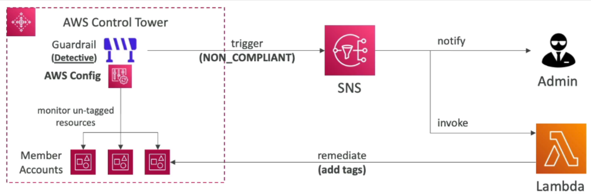

### ✅ Summary

- **Control Tower** automates the setup and governance of multi-account environments.
- **Guardrails** provide powerful mechanisms for both **prevention** and **detection**.
- **Preventive guardrails** use SCPs to restrict actions.
- **Detective guardrails** use AWS Config to monitor and report violations.
- Supports **automated remediation** for faster compliance resolution.

This gives you a centralized, secure, and scalable way to manage all your AWS accounts effectively.

---

## Q & A

**Question:** 

**Which of the following IAM condition keys can you use to allow API calls only to a specified AWS Region?**

**Options:**

* aws:RequiredRegion
* aws:SourceRegion
* aws:InitialRegion
* aws:RequestedRegion

<details>

<summary>Explanation</summary>

`aws:RequestedRegion` is used in IAM policies to restrict API requests to specific AWS Regions. It checks the region being requested and allows or denies the call based on the policy, helping enforce region-based access control.

**Answer:** **aws:RequestedRegion**

</details>

---