# 27 Networking - VPC

Sections:-
- [1. Section Introduction](#1-section-introduction)
- [2. Understanding CIDR (Classless Inter-Domain Routing)](#2-understanding-cidr-classless-inter-domain-routing)
- [3. Default VPC Overview](#3-default-vpc-overview)
- [4. VPC in AWS - IPv4](#4-vpc-in-aws---ipv4)
- [5. VPC Hands On](#5-vpc-hands-on)
- [6. Subnet Overview](#6-subnet-overview)
- [7. Creating Subnets](#7-creating-subnets)
- [8. Internet Gateways & Route Tables](#8-internet-gateways--route-tables)
- [9. Internet Gateways & Route Tables - Hands On](#9-internet-gateways--route-tables---hands-on)
- [10. Bastion Hosts 🛡️](#10-bastion-hosts-️)
- [11. Using a Bastion Host to Access a Private EC2 Instance](#11-using-a-bastion-host-to-access-a-private-ec2-instance)
- [12. NAT Instances (Outdated, But Still at the Exam)](#12-nat-instances-outdated-but-still-at-the-exam)
- [13. Creating a NAT Instance for Internet Access](#13-creating-a-nat-instance-for-internet-access)
- [14. NAT Gateways: A Better Alternative to NAT Instances](#14-nat-gateways-a-better-alternative-to-nat-instances)
- [15. Setting Up a NAT Gateway](#15-setting-up-a-nat-gateway)
- [16. Security Groups and Network ACLs (NACLs)](#16-security-groups-and-network-acls-nacls)
- [17. Network ACLs Deep Dive](#17-network-acls-deep-dive)
- [18. VPC Peering](#18-vpc-peering)
- [19. Peering VPCs](#19-peering-vpcs)
- [20. VPC Endpoints](#20-vpc-endpoints)
- [21. Practicing with VPC Endpoints](#21-practicing-with-vpc-endpoints)
- [22. VPC Flow Logs](#22-vpc-flow-logs)
- [23. VPC Flow Logs - Hands On](#23-vpc-flow-logs---hands-on)
- [24. Site to Site VPN, Virtual Private Gateway & Customer Gateway](#24-site-to-site-vpn-virtual-private-gateway--customer-gateway)
- [25. Site to Site VPN, Virtual Private Gateway & Customer Gateway Hands On](#25-site-to-site-vpn-virtual-private-gateway--customer-gateway-hands-on)
- [26. Direct Connect (DX)](#26-direct-connect-dx)
- [27. Direct Connect with VPN Backup](#27-direct-connect-with-vpn-backup)
- [28. Common Network Topologies in AWS: Transit Gateway](#28-common-network-topologies-in-aws-transit-gateway)
- [29. VPC Traffic Mirroring 🛡️](#29-vpc-traffic-mirroring-️)
- [30. IPv6 in AWS](#30-ipv6-in-aws)
- [31. Practicing with IPv6](#31-practicing-with-ipv6)
- [32. Egress-Only Internet Gateways](#32-egress-only-internet-gateways)
- [33. Setting Up an Egress-Only Internet Gateway](#33-setting-up-an-egress-only-internet-gateway)
- [34. Cleaning Up AWS Resources to Avoid Unnecessary Costs 💰](#34-cleaning-up-aws-resources-to-avoid-unnecessary-costs-)
- [35. VPC Deep Dive: Summary and Key Concepts 🚀](#35-vpc-deep-dive-summary-and-key-concepts-🚀)
- [36. Understanding Networking Costs in AWS per GB](#36-understanding-networking-costs-in-aws-per-gb)
- [37. AWS Network Firewall](#37-aws-network-firewall)
- [Q & A](#q--a)

---

## 1. Section Introduction

Welcome to the **VPC (Virtual Private Cloud)** section — one of the most critical and foundational parts of AWS!

### 🧠 Why VPC Is So Important

- VPC is the **backbone** of all the AWS resources you've worked with so far.
- It controls **networking, security, and access** — core concepts every AWS professional must master.
- This section formalizes everything you've previously seen into a structured, deep-dive learning experience.

### 📌 Before You Begin...

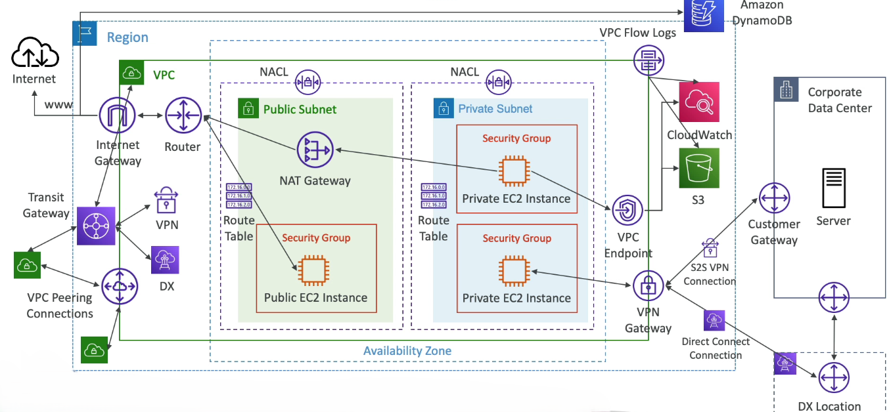

Take a look at the following VPC diagram (if provided).  
- If **everything in the diagram makes sense** to you — great! You may **skip this section**.
- But if it looks unfamiliar or overwhelming — **don’t worry**. That's completely expected.

💡 **Tip**: We’ll walk through **each concept step by step**, and by the end, you’ll confidently understand and build your own VPC.

### ✅ What You’ll Learn

- Build a **custom VPC** from scratch.
- Understand key networking components:
  - Subnets
  - Route tables
  - Internet gateways
  - NAT gateways
  - Security groups and NACLs
- Practice real-world architecture with **hands-on exercises**.

### ⚠️ Cost Consideration

- Some resources (like **NAT Gateways**) may **incur charges**.
- 💡 **Tip**: Do this section **in one go** or within **1–2 days**, so you can delete resources afterwards and minimize cost.

### 🚀 Final Note

Don’t be afraid of networking or VPCs:
- It **took time** for even experienced engineers to master.
- This course is designed to get you there with **clear explanations and practice**.
- You **will** understand VPCs — step by step.

Let’s dive in and **master AWS networking** together! 🌐💪

---

## 2. Understanding CIDR (Classless Inter-Domain Routing)

CIDR is a method for allocating IP addresses. We've encountered CIDRs before, especially when configuring security group rules in AWS.

📌 **Example:** Security group rules often use CIDR notation in the source column (e.g., `10.0.0.0/16`).

CIDRs define IP ranges. Let's explore some simple examples:

*   `/32` represents a single IP address.
*   `0.0.0.0/0` represents all IP addresses.
*   `192.168.0.0/26` represents a range of 64 IP addresses from `192.168.0.0` to `244.178.0.63`.

### How CIDR Works ⚙️

CIDR has two main components:

1.  **Base IP:** An IP address contained within the range. Typically, it's the beginning of the range (e.g., `10.0.0.0` or `192.168.0.0`).
2.  **Subnet Mask:** Defines how many bits are fixed (can't be changed) in the IP address. It's represented as `/0`, `/24`, up to `/32`.

The subnet mask can be expressed in two forms:

| CIDR Notation | Subnet Mask | Description |
| :------------ | :------------ | :----------------- |
| `/8`         | `255.0.0.0`   | First octet is fixed, the rest can be changed. |
| `/16`        | `255.255.0.0` | First two octets are fixed, the rest can be changed. |
| `/24`        | `255.255.255.0` | First three octets are fixed, the rest can be changed. |
| `/32`        | `255.255.255.255` | All octets are fixed, nothing can be change. It represents a single IP. |

We will primarily use the `/` form in this course and in AWS.

### Detailed Look at Subnet Masks 🔍

Subnet masks determine which values can change from the base IP.

| CIDR Notation | Number of IPs Allowed | IP Range Example     |
| :------------ | :--------------------- | :------------------- |
| `/32`         | 1 (2^0)                      | `192.168.0.0`        |
| `/31`         | 2 (2^1)                     | `192.168.0.0` - `192.168.0.1` |
| `/30`         | 4 (2^2)                     | `192.168.0.0` - `192.168.0.3` |
| `/29`         | 8 (2^3)                     | `192.168.0.0` - `192.168.0.7` |
| `/28`         | 16 (2^4)                    | `192.168.0.0` - `192.168.0.15`|
| `/24`         | 256 (2^8)              | `192.168.0.0` - `192.168.0.255`|
| `/16`         | 65,536 (2^16)          | `192.168.0.0` - `192.168.255.255`|
| `/0`          | All IPs                | All IPv4 addresses (`0.0.0.0` - `244.178.44.111`)   |

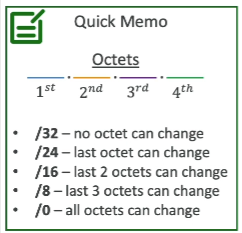

📝 **Note:** An IP address is made of 4 octets.

*   `/32`: No octets can change.
*   `/24`: The last octet can change.
*   `/16`: The last two octets can change.
*   `/8`: The last three octets can change.
*   `/0`: All octets can change.

### CIDR Exercises 🏋️‍♀️

Let's test your understanding:

*   `192.168.0.0/24`:  The last octet can change, resulting in 256 IPs (0-255).
*   `192.168.0.0/16`:  The last two octets can change, resulting in 65,536 IPs.
*   `134.56.78.123/32`: Only one IP address.
*   `0.0.0.0/0`: Represents all IPv4 space.

💡 **Tip:** Use online CIDR calculators to help you visualize and calculate IP ranges.

### Useful Tool 🧰

There are online tools like [https://www.ipaddressguide.com/cidr
](https://www.ipaddressguide.com/cidr
) that can help you convert between CIDR notation and IP ranges. These tools typically offer two options:

*   **CIDR to IP Range:** Input a CIDR (e.g., `10.0.0.0/16`) and get the first and last IP addresses in the range, as well as the total number of IPs.
*   **IP Range to CIDR:** Input a range of IP addresses and the tool will determine the corresponding CIDR notation.

📌 **Example:**

*   CIDR `10.0.0.0/17` gives you the first IP and the last IP, and the number of IPs in the range.
*   IP range `10.0.0.0` to `10.0.127.255` corresponds to the CIDR `10.0.0.0/17`.

### Public vs. Private IPs 🌐

The Internet Assigned Numbers Authority (IANA) has reserved certain blocks of IPv4 addresses for private LAN networks.

Private IP ranges:

*   `10.0.0.0/8` (`10.0.0.0` - `10.255.255.255`): Used in large networks.
*   `172.16.0.0/12` (`172.16.0.0` - `172.31.255.255`): Often used for default VPCs in cloud environments.
*   `192.168.0.0/16` (`192.168.0.0` - `192.168.255.255`): Commonly used in home networks.

All other IP addresses are considered public IP addresses and are used on the internet.

---

## 3. Default VPC Overview

Let's take a quick tour of the **Default VPC**, which is automatically created with every new AWS account.

### 🧰 What is the Default VPC?

- **Every new AWS account** comes with a **default VPC**, so you can start using AWS services immediately without needing to configure complex networking.
- When you launch an EC2 instance without specifying a VPC or subnet, it gets placed into the **default VPC**.

### ✅ Default VPC Features

- Comes with **internet connectivity** by default.
- Each EC2 instance launched into it:
  - Gets a **public IPv4 address**.
  - Has both **public and private DNS names**.
- Enables quick and easy **internet access** to instances right out of the box.

### 🌐 Exploring the Default VPC in Console

- Navigate to **VPC Dashboard** → **Your VPCs**.
- You'll see a single VPC with:
  - A **default IPv4 CIDR block** (e.g., `/16` giving ~65,536 IPs).
  - No IPv6 CIDRs.
  - No flow logs or tags (by default).

📌 Example:
- A `/16` CIDR allows all addresses from `x.x.0.0` to `x.x.255.255`.

### 🧱 Subnets in the Default VPC

- Comes with **1 subnet** in each and every **Availability Zone (AZ)** for **high availability**.
- Each subnet has:
  - Its own **IPv4 CIDR block**.
  - Automatically enabled **public IP assignment**.
  - **Default route table** and **network ACLs**.
- Each subnet shows:
  - About **4,091 available IPs** (from 4,096 possible) due to 5 reserved IPs.

> 💡 **Reserved IPs** will be explained later in the course.

### 🔁 Routing in the Default VPC

- The **main route table** routes:
  - All non-local traffic (`0.0.0.0/0`) to an **Internet Gateway (IGW)**.
- This IGW:
  - Is attached to the VPC.
  - Provides **internet access** to EC2 instances.

📌 Note:
- This main route table is **implicitly associated** with the subnets (since they don't have their own custom route table).

### 🔐 Network ACLs

- By default, **all inbound and outbound traffic** is allowed.
- This ensures **network connectivity** for resources in the VPC.

### 📝 Summary

You now understand why:
- Your EC2 instances **had internet access**.
- They **received public IPs**.
- You didn’t need to configure anything manually early on.

In this section, we'll:
- Deep dive into each component:
  - **VPCs**
  - **Subnets**
  - **Route tables**
  - **Internet Gateways**
  - **Network ACLs**
- Recreate our own **custom VPC** to fully understand how everything fits together.

Get ready to level up your AWS networking skills! 🚀

---

## 4. VPC in AWS - IPv4

So let's go ahead and create our first **VPC (Virtual Private Cloud)** in AWS.

- You can have **multiple VPCs within a single AWS region**.
- The default soft limit is **5 VPCs per region**, but ✅ **you can request an increase**.
- Each VPC can have **up to 5 CIDR blocks** assigned.

### 📌 CIDR Block Details:
- **Minimum CIDR size**: `/28` → 16 IP addresses
- **Maximum CIDR size**: `/16` → 65,536 IP addresses

Since a VPC is a **private resource**, it can only use **private IPv4 address ranges**, such as:

- `10.0.0.0/8`
- `172.16.0.0/12`
- `192.168.0.0/16`

### 💡 Tip:
When selecting a CIDR block for your VPC, follow these rules:
- Choose **any private IP range** from the allowed ranges.
- **Avoid overlapping IP ranges** between VPCs or with your on-premise/corporate networks.

⚠️ **Why it matters:**  
If you ever want to **connect your VPCs together** (e.g., via VPC peering or VPN), **overlapping CIDR ranges will prevent routing between them**.

At the end of this hands-on session, you will have:
- A simple VPC set up within a single region
- Better understanding of VPC CIDR configuration

Let’s get started!

---

## 5. VPC Hands On

Let's walk through creating your **first VPC** from scratch — without using the VPC wizard — so you can truly understand each component.

### 🛠️ Why Not Use the VPC Wizard?
- The wizard automates the process, but **skips the learning**.
- To **really understand** how VPCs work, we'll **create everything manually**, step by step.

### 🔧 Step 1: Create the VPC

- Go to the **VPC console**.
- You might already see one default VPC, but we’ll **create a new one**.
- Set a **Name tag**:  
  ➤ `DemoVPC`

### 🌐 Choose IPv4 CIDR Block

- We'll use:  
  ➤ `10.0.0.0/16`  
  This gives us **65,536 IP addresses**.

📌 **Reminder:**
- `/16` is the **largest allowed block** for a single CIDR.
- `/15` or larger would **exceed the limit** and result in an error.

### 🚫 Skip IPv6 for Now

- We'll **leave IPv6 unassigned** — we'll come back to this later in the course.

### ⚙️ Tenancy Option

- Choose between:
  - `Default`: Shared hardware (✅ **recommended**)
  - `Dedicated`: Dedicated EC2 hardware (⚠️ **very expensive**)
- We'll use `Default` tenancy.

### 🏷️ Tags

- Add a Name tag:  
  ➤ `DemoVPC`

Click **Create VPC** and voilà — your VPC is created.

### 🔍 What Gets Created Automatically?

When the VPC is created:
- One **IPv4 CIDR block**
- A **main route table**
- A **main network ACL**

These are created **behind the scenes** by AWS.

### ➕ Add More CIDRs (Optional)

- A VPC can have up to **five IPv4 CIDR blocks**.
- You can add more later by going to:
  ➤ `Actions` → `Edit CIDRs`

📌 **Example**:

```text
Existing: 10.0.0.0/16  
New CIDR: 10.1.0.0/16
```

You could also assign **IPv6 CIDRs**, but we’ll keep things simple for now and stick with just **one IPv4 CIDR**.

✅ That’s it — you’ve successfully created your **DemoVPC**.
This is the **foundation** for everything else we'll build in this section.

---

## 6. Subnet Overview

Now that we’ve created our VPC, the next step is to add **subnets**. We'll create:

- ✅ One **public subnet**
- ✅ One **private subnet**

These will both be created in **a single availability zone (AZ)** for simplicity.

### 🌐 What Is a Subnet?

A **subnet** is a **subdivision of your VPC’s IPv4 CIDR block**.  
It allows you to organize and isolate your resources.

📌 **Each subnet is a smaller range** within the overall VPC range.

### 🚫 Reserved IP Addresses in Subnets

AWS **reserves 5 IP addresses** in every subnet:

- `.0`: Network address
- `.1`: AWS VPC router
- `.2`: Amazon DNS mapping
- `.3`: Reserved for **future use**
- `.255`: Broadcast address (not supported in VPC)

📝 **Note:** These reserved addresses **cannot** be assigned to instances.

### 📌 Example

If your subnet is `10.0.0.0/24`:

- Total IPs: 256  
- Reserved: 5  
- Usable: 251

### 💡 Tip: Subnet Sizing for EC2

Exam Tip: If you need **at least 29 usable IPs**, then:

- `/27` gives 32 IPs → 32 - 5 = 27 usable ❌ **Not enough**
- `/26` gives 64 IPs → 64 - 5 = 59 usable ✅ **Sufficient**

⚠️ **Warning:** Always **account for AWS’s reserved IPs** when planning subnets.

In the next lecture, we’ll **create the actual subnets** and explore how to make one public and one private.

---

## 7. Creating Subnets

Let's create our subnets within the DemoVPC.

First, filter the view by selecting the DemoVPC to avoid UI clutter. This allows us to focus solely on the resources associated with our VPC.

1.  Navigate to Subnets.
2.  Select "Select a VPC" and choose "DemoVPC".

Now, we can create the subnets. We'll create four subnets: two public and two private, distributed across two Availability Zones (AZs) for high availability.

### Creating Public Subnets

We'll start by creating the public subnets.

1.  Click "Create Subnet".
2.  Select the "DemoVPC".
3.  Define the first public subnet:
    *   Subnet name: PublicSubnetA
    *   Availability Zone: eu-central-1a
    *   IPv4 CIDR block: 10.0.0.0/24 🌐

        💡 **Tip:** Use a smaller subnet size for public subnets, as they are typically used for load balancers and front-facing infrastructure. A /24 CIDR block provides 256 addresses.

        ```
        10.0.0.0 - 10.0.0.255
        ```
4.  Add a second public subnet:
    *   Subnet name: PublicSubnetB
    *   Availability Zone: eu-central-1b
    *   IPv4 CIDR block: 10.0.1.0/24 🌐

        📝 **Note:** The next available range after 10.0.0.255 is 10.0.1.0.

        ```
        10.0.1.0 - 10.0.1.255
        ```

### Creating Private Subnets

Next, we'll create the private subnets.

1.  Add a third subnet:
    *   Subnet name: PrivateSubnetA
    *   Availability Zone: eu-central-1a
    *   IPv4 CIDR block: 10.0.16.0/20 🌐

        💡 **Tip:** Use a larger subnet size for private subnets. A /20 CIDR block provides 4,096 addresses.

        ```
        10.0.16.0 - 10.0.31.255
        ```
2.  Add a fourth subnet:
    *   Subnet name: PrivateSubnetB
    *   Availability Zone: eu-central-1b
    *   IPv4 CIDR block: 10.0.32.0/20 🌐

        📝 **Note:** This is the next logical range after 10.0.31.255.

### Finalizing Subnet Creation

1.  Click "Create Subnets".

    🎉 The subnet creation should be successful if there are no overlapping IP addresses.

2.  Verify the subnets:
    *   Check the number of available IP addresses. You'll notice that the available IPs are the CIDR size minus five. This is because AWS reserves five IP addresses within each subnet.
    *   Confirm that the subnets are distributed across eu-central-1a and eu-central-1b for high availability.

⚠️ **Warning:** At this point, the subnets are not yet configured as public or private. Further configuration is required to define their roles. We will cover this in future lectures.

For now, our subnet setup is complete. We have successfully created four subnets within our DemoVPC, spanning two Availability Zones.

---

## 8. Internet Gateways & Route Tables

Currently, neither of our subnets has internet access. We need to understand the difference between a Public Subnet and a Private Subnet.

### 🌐 What Is an Internet Gateway?

An **Internet Gateway** will allow resources within a **VPC** to connect to the internet. This includes **EC2** instances and other functions.

Here's what you need to know about Internet Gateways:

*   It scales horizontally. 📈
*   It's highly available and redundant. ✅
*   It's a managed resource. ⚙️
*   It must be created separately from a **VPC**. 🏗️
*   One **VPC** can only be attached to one Internet Gateway, and vice versa. 🔗
*   Internet Gateways alone do not grant internet access. 🚫 We must also edit the **Route Tables**. ✍️

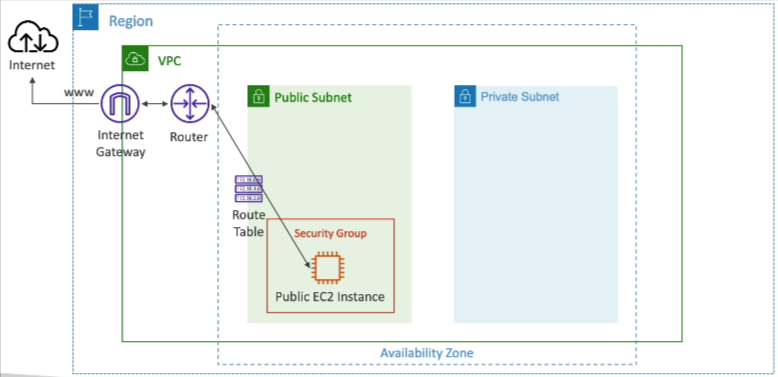

Here's the process:

1.  We have a **VPC** with two subnets. 🌐
2.  We create an Internet Gateway in this **VPC**. 🚪
3.  Creating the Internet Gateway alone is not enough. ⚠️
4.  We need to edit the **Route Tables**. ✍️
5.  We create a Public **EC2** Instance in our Public Subnet. 🖥️
6.  We edit the **Route Table** so that the **EC2** Instance can connect to the Router. ➡️
7.  The Router connects to the Internet Gateway. ➡️
8.  The Internet Gateway connects to the internet. ➡️

Essentially, the path looks like this:

`EC2 Instance` -> `Router` -> `Internet Gateway` -> `Internet`

---

## 9. Internet Gateways & Route Tables - Hands On

Let's ensure our EC2 instances in specific subnets have the desired internet access.

### Launching EC2 Instance

First, we'll launch an EC2 instance into one of our subnets.

1.  Go to the EC2 console and click "Launch Instances".
2.  Select "Amazon Linux 2" and choose the "t2.micro" instance type.
3.  Do not select a key pair for now.
4.  Edit the network settings:
    *   Choose the VPC named "DemoVPC".
    *   Select the "Public Subnet A".
    *   📝 **Note:** Initially, "Auto-assign public IP" is disabled.

The "Auto-assign public IP" setting is disabled by default. To enable it, we need to modify the subnet settings.

1.  Go to the subnet settings for "Public Subnet A".
2.  Choose "Actions" and then "Edit subnet settings".
3.  Enable "Auto-assign public IPv4 address" and save.
4.  Repeat for "Public Subnet B".

Now, refresh the EC2 instance launch page and reconfigure the network settings. You should see that "Auto-assign public IP" is enabled by default for the public subnets.

Next, configure the security group:

1.  Create a new security group.
2.  Add an SSH rule on port 22 to allow SSH access to the EC2 instance.

Launch the instance. You'll see it has a public IPv4 address.

However, having a public IP address doesn't guarantee internet connectivity. Let's test this by trying to connect to the instance using EC2 Instance Connect.

If the connection fails, it indicates a network configuration issue. This is where the **Internet Gateway** comes into play.

### Creating an Internet Gateway

1.  Go to your VPC. You'll notice there's no Internet Gateway attached.
2.  Create a new Internet Gateway:
    *   Name it "DemoIGW".
    *   Click "Create internet gateway".
3.  Attach the newly created Internet Gateway to your "DemoVPC".

Even with an Internet Gateway attached, the EC2 instance might still not have internet access. This is because we need to configure the **Route Table**.

### Creating Route Tables

1.  Create two new route tables:
    *   "PublicRouteTable" for public subnets.
    *   "PrivateRouteTable" for private subnets.
2.  Associate the subnets with their respective route tables:
    *   Edit "PublicRouteTable" and associate it with "Public Subnet A" and "Public Subnet B".
    *   Edit "PrivateRouteTable" and associate it with "Private Subnet A" and "Private Subnet B".

Now, edit the routes in the "PublicRouteTable":

1.  Go to "PublicRouteTable" and edit the routes.
2.  You'll see a default route for `10.0.0.0/16` (the VPC CIDR) to "local".
3.  Add a new route:
    *   Destination: `0.0.0.0/0` (any IP address).
    *   Target: Choose the "DemoIGW" Internet Gateway.

```
Destination     Target
-----------     ------
10.0.0.0/16     local
0.0.0.0/0       igw-xxxxxxxxxxxxxxxxx (DemoIGW)
```

This configuration ensures that traffic within the VPC CIDR (10.0.0.0/16) is routed locally, while all other traffic (except the VPC CIDR 10.0.0.0/16) (including public IPs) is routed through the Internet Gateway.

Save the changes. Now, retry connecting to the EC2 instance using EC2 Instance Connect. You should now be able to connect and the instance should have internet access.

📌 **Example:** You can verify internet access by running `ping google.com` in the EC2 instance's terminal.

We have now successfully given internet access to our public subnets using the public route table. The next step is to figure out how to give internet access to private EC2 instances.

---

## 10. Bastion Hosts 🛡️

Our users often need to access EC2 instances located in private subnets, but they are connecting from the public internet. Since EC2 instances in private subnets don't have direct internet access, we need a solution. The bastion host is one such solution.

A bastion host is an EC2 instance specifically placed in a public subnet. It acts as a secure gateway.

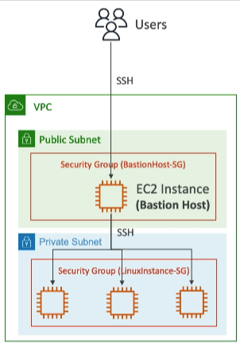

Here's how it works:

1.  The bastion host resides in a public subnet.
2.  It has its own security group, the bastion host security group.
3.  The EC2 instance in the private subnet also has its own security group.
4.  The bastion host has access to the EC2 instance(s) in the private subnet because they are all within the same VPC.
5.  To access the private EC2 instance, you first connect to the bastion host via SSH, and then from the bastion host, you SSH into the private EC2 instance.

In summary, a bastion host provides a secure way to SSH into your private EC2 instances. 🔑 It **must** be placed in a public subnet.

### Security Group Rules 🔒

Understanding the security group rules is crucial ( **Crucial for exam** ).

For the bastion host (the EC2 instance in the public subnet):

*   The security group **must** allow access from the internet.
*   ⚠️ **Warning:** Instead of allowing access from anywhere on the internet, restrict access to specific IP ranges, such as your corporation's public CIDR or your internet access IP.
*   Restrict the bastion host's security group as much as possible. This limits the potential attack surface. If an attacker gains access to the bastion host, it could compromise your entire infrastructure.

For the EC2 instances in the private subnets:

*   They **must** allow SSH access (port 22).
*   This access should be allowed from the private IP of the bastion host or, equivalently, from the bastion host's security group.
*   The traffic seen by the private EC2 instances originates from the bastion host.

📌 **Example:**

Let's say your bastion host has a private IP of `10.0.1.10`. The security group rule for your private EC2 instance would allow inbound SSH traffic from `10.0.1.10` on port 22.

Alternatively, if your bastion host's security group is named `sg-bastion`, you can allow inbound SSH traffic from `sg-bastion`.

```
# Example Security Group Rule (Conceptual)
Type: SSH
Port: 22
Source: 10.0.1.10  # Bastion Host Private IP
```

or

```
# Example Security Group Rule (Conceptual)
Type: SSH
Port: 22
Source: sg-bastion  # Bastion Host Security Group ID
```

📝 **Note:** Using the security group ID is often preferred as it automatically adapts to IP changes of the bastion host.

---

## 11. Using a Bastion Host to Access a Private EC2 Instance

The previously created EC2 instance was in public subnet, therefore we can rename it as "BastionHost".

This note explains how to SSH into an EC2 instance located in a private subnet using a bastion host. A bastion host acts as a secure gateway, allowing you to connect to instances that are not directly accessible from the internet.

### Creating a Key Pair 🔑

If you don't already have one, create a key pair. This key pair will be used to SSH into the EC2 instance in the private subnet.

1.  Navigate to the EC2 dashboard in the AWS Management Console.
2.  Under "Key Pairs," click "Create key pair."
3.  Give your key pair a name (📌 **Example:** "demo-key-pair").
4.  Choose the "PEM" format.
5.  Click "Create key pair." The `.pem` file will be downloaded to your computer.  Save this file securely.

### Launching an EC2 Instance in a Private Subnet 🚀

1.  Go to the EC2 Instances section and click "Launch Instance." Name: "PrivateInstance"
2.  Choose an Amazon Machine Image (AMI). 📌 **Example:** Amazon Linux 2 AMI.
3.  Select an instance type. 📌 **Example:** t2.micro.
4.  Configure Instance Details:
    *   **Network:** Select your demo VPC.
    *   **Subnet:** Choose a private subnet (📌 **Example:** private subnet A).
    *   **Auto-assign Public IP:** Ensure this is disabled, as it's a private subnet.
5.  Configure Security Group:
    *   Create a new security group (📌 **Example:** "private-sg").
    *   Add an inbound rule to allow SSH traffic.
        *   **Type:** SSH
        *   **Source:** Custom, and select the security group associated with your bastion host (📌 **Example:** "launch-wizard-1" -> You can change the name of that security group to "bastion-host-sg" for better understanding). This allows SSH access only from the bastion host.
6.  Select the `demo-key-pair` created earlier.
7.  Launch the instance.

📝 **Note:**  Because the instance is in a private subnet, you cannot use EC2 Instance Connect directly.

### Connecting to the Bastion Host 💻

1.  Go to the EC2 Instances section and select your bastion host.
2.  Click "Connect" and choose "EC2 Instance Connect."
3.  This will open a terminal window connected to your bastion host. Alternatively, you can use your terminal and the SSH command.

### Connecting to the Private Instance Through the Bastion Host 🔐

1.  Get the private IP address of the EC2 instance in the private subnet.  You can find this in the EC2 console under the instance details.
2.  On the bastion host, you need to create the key pair file. Use a text editor like `vi` or `nano`.

    ```bash
    vi demo-key-pair.pem
    ```

3.  Open the `demo-key-pair.pem` file you downloaded earlier with a text editor on your local machine.
4.  Copy the entire content of the `.pem` file and paste it into the `demo-key-pair.pem` file on the bastion host.
5.  Save the file.
6.  Change the permissions of the key pair file:

    ```bash
    chmod 400 demo-key-pair.pem
    ```

    ⚠️ **Warning:**  Incorrect permissions on the key file will prevent SSH from working.
7.  Now, SSH into the private instance using its private IP address and the key pair:

    ```bash
    ssh -i demo-key-pair.pem ec2-user@<private_ip_address>
    ```

    Replace `<private_ip_address>` with the actual private IP address of your private EC2 instance.

    📌 **Example:**

    ```bash
    ssh -i demo-key-pair.pem ec2-user@10.0.2.15
    ```

8.  If prompted, type `yes` to continue connecting.

You should now be successfully SSH'd into your EC2 instance in the private subnet through the bastion host! 🎉

📝 **Note:** At this point, the private EC2 instance likely does not have internet access (`ping google.com`). The next step would be to configure Network Address Translation (NAT) to allow outbound internet access.

---

## 12. NAT Instances (Outdated, But Still at the Exam)

NAT (Network Address Translation) instances are an older method for enabling EC2 instances in private subnets to connect to the internet. While **NAT gateways are now the recommended solution**, NAT instances can still appear on the AWS Certified Cloud Practitioner exam. Let's explore how they work.

To enable internet access for private subnets using a NAT instance:

1.  Launch a NAT instance in a **public subnet**.
2.  Disable the **source/destination check** on the NAT instance.
3.  Attach a fixed **Elastic IP** to the NAT instance.

Here's a breakdown of the process:

1.  An EC2 instance in a private subnet needs to access a public server (e.g., with IP `50.60.4.10`).
2.  The EC2 instance sends a request. The source IP is its private IP (e.g., `10.0.0.20`), and the destination IP is the public server's IP.
3.  The request is routed to the NAT instance.
4.  The NAT instance rewrites the network packet:
    *   The destination IP remains the same (`50.60.4.10`).
    *   The source IP is changed to the NAT instance's public IP (e.g., `12.34.56.78`).
5.  The public server receives the request and responds to the NAT instance's public IP.
6.  The NAT instance forwards the response back to the original EC2 instance in the private subnet.

This process allows instances in private subnets to initiate outbound connections to the internet without being directly exposed.

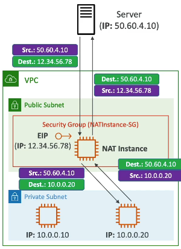

📌 **Example:**

Let's say an EC2 instance with a private IP of `10.0.0.20` in a private subnet wants to access a public server with an IP of `50.60.4.10`. The NAT instance, with a public IP of `12.34.56.78`, facilitates this connection by rewriting the source IP address.

```
Private EC2 Instance (10.0.0.20) -> NAT Instance (12.34.56.78) -> Public Server (50.60.4.10)
```

The public server only sees traffic originating from the NAT instance's public IP.

📝 **Note:** The NAT instance rewrites network packets, changing the source IP address.

⚠️ **Warning:** Because the NAT instance rewrites IP addresses, the **source/destination check** must be disabled on the NAT instance.

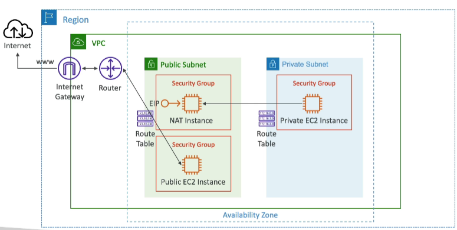

### Steps to Configure a NAT Instance:

1.  Create a NAT instance within a public subnet.
2.  Configure the route table for the private subnet to route traffic to the NAT instance. This allows private instances to communicate with the NAT instance and, subsequently, the internet gateway.

### Considerations for NAT Instances:

*   An Amazon Linux AMI was previously available for NAT instances, but it reached its end of standard support on December 31st, 2020.
*   NAT gateways are now the recommended solution due to their improved scalability and availability.
*   NAT instances are not highly available or resilient out-of-the-box. Achieving high availability requires configuring multiple NAT instances across multiple Availability Zones (AZs), potentially with an Auto Scaling Group (ASG) and a resilient user-data script. This adds complexity.
*   The instance size affects bandwidth. Smaller instances provide less bandwidth than larger instances.
*   You must manage Security Groups and rules for the NAT instance.

    *   Inbound rules should allow HTTP/HTTPS traffic from private subnets and SSH from your home network (optional).
    *   Outbound rules should allow necessary traffic to the internet.

💡 **Tip:** While NAT instances are becoming less common, understanding how they work provides valuable insight into network address translation concepts.

NAT instances provide a way to understand how NAT works at a high level. The exam may present scenarios where you need to choose between NAT instances and NAT gateways.

---

## 13. Creating a NAT Instance for Internet Access

This section details how to create a NAT instance to provide internet access to private subnets.

1.  **Launch an EC2 Instance:** 🚀
    *   Click on "Launch instance".
    *   Type "NAT instance" as the name.

2.  **Find the Amazon Machine Image (AMI):** 🖼️
    *   Click on "Browse more AMIs".
    *   Search for "NAT" or "amzn-ami-vpc-nat-2018".
    *   Select "Community AMIs".
    *   Choose an AWS NAT instance AMI with architecture "X86\_64". Look for a recent published date.
        📌 **Example:** "Amazon AMI VPC NAT 2018"

3.  **Instance Configuration:** ⚙️
    *   Choose an instance type. A `t2.micro` instance is sufficient.
    *   Select a key pair (e.g., "demo key pair").

4.  **Network Settings:** 🌐
    *   Edit the network settings.
    *   Select your demo VPC.
    *   Deploy the NAT instance in a public subnet (e.g., public subnet A).
    *   Create a new security group named "NAT instance SG".
    *   Add the following inbound rules:
        *   SSH from anywhere.
        *   HTTP from your VPC CIDR block (e.g., `10.0.0.0/16`).
        *   HTTPS from your VPC CIDR block (e.g., `10.0.0.0/16`).

5.  **Launch the Instance:** 🚀
    *   Review the settings and launch the instance.

6.  **Disable Source/Destination Check:** ⚠️
    *   Edit the networking settings. Go to "Change the Source/Destination Check".
    *   Disable the "Source/Destination Check". This is crucial for the NAT instance to forward traffic.
    📝 **Note:** The NAT instance must be able to receive and send traffic where the source or destination is not itself.

7.  **Configure the Private Route Table:** 🛣️
    *   Go to your "PrivateRouteTable".
    *   Edit the routes.
    *   Add a new route:
        *   Destination: `0.0.0.0/0` (all internet traffic).
        *   Target: Instance.
        * Select your NAT instance.
    *   Save the changes. This directs all internet-bound traffic from the private subnet through the NAT instance.

8.  **Enable ICMP (PING) on the NAT Instance:** 📶
    *   Go to the NAT instance's security group ("NAT instance SG").
    *   Edit the inbound rules.
    *   Add a rule for ICMP:
        *   Type: All ICMP IPv4.
        *   Source: Your VPC CIDR block (e.g., `10.0.0.0/16`).
    *   Save the rule. This allows PING requests to be routed through the NAT instance.

9.  **Testing:** ✅
    *   SSH into your private instance via the Bastion Host.
    *   Run `ping google.com`. You should now receive replies.
    *   Run `curl example.com`. You should see the HTML content of the page.

10. **Verification:** 🧐
    *   Confirm that the private subnet instance does not have a public IP address. It relies on the NAT instance for internet access.

11. **Clean Up:** 🧹
    *   Stop or terminate the NAT instance as it will not be needed in the next lecture.

---

## 14. NAT Gateways: A Better Alternative to NAT Instances

NAT Gateways offer a significant improvement over NAT Instances. They are managed by AWS, provide higher bandwidth, high availability, and require no administration on your part.

### Key Features and Benefits

*   💰 **Cost:** You pay per hour of usage and bandwidth.
*   📍 **Placement:** Created in a specific Availability Zone (AZ) and inherits an Elastic IP.
*   ⚠️ **Limitation:** Cannot be used with an EC2 instance within the same subnet. It must be accessed from another subnet.
*   🌐 **Connectivity:** NAT Gateway is created in a public subnet and connects instances in private subnets to the internet.
*   ➡️ **Traffic Flow:** Private subnet -> NAT Gateway -> Internet Gateway.  A NAT Gateway requires an Internet Gateway to function (It means NAT gateway cannot work without an internet gateway).
*   🚀 **Bandwidth:** 5 Gbps, automatically scaling up to 100 Gbps.
*   🛡️ **Security:** No need to manage security groups.

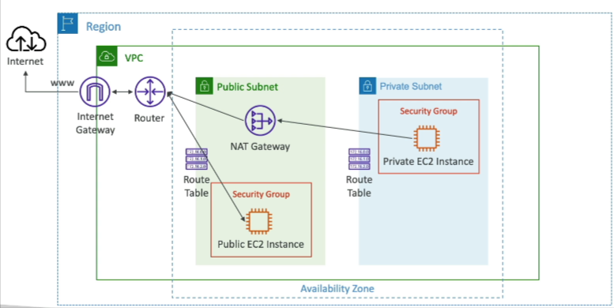

### How it Works

1.  You have a private instance in a private subnet that cannot access the internet.
2.  Create a NAT Gateway in a public subnet.
3.  The public subnet is already connected to the Internet Gateway.
4.  The NAT Gateway now has internet connectivity.
5.  Edit the route table of the private subnet to route traffic to the NAT Gateway.
6.  Your EC2 instance in the private subnet can now access the internet through the NAT Gateway.

### High Availability

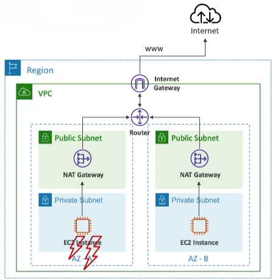

*   NAT Gateways are resilient within a single AZ.
*   For fault tolerance across AZs, you need multiple NAT Gateways in multiple AZs.
*   Each NAT Gateway handles traffic within its AZ.
*   If an AZ goes down, the NAT Gateway in another AZ will continue to function.
*   There's no need to connect AZs through route tables because if an AZ goes down, the EC2 instances in that AZ are also unavailable.

### NAT Gateway vs. NAT Instance

Here's a comparison to help you decide which to use:

| Feature              | NAT Gateway                                                                 | NAT Instance                                                             |
|----------------------|------------------------------------------------------------------------------|---------------------------------------------------------------------------|
| **Availability**     | Highly available within AZ (create in another AZ)                            | Use a script to manage failover between instances                         |
| **Bandwidth**        | Up to 100 Gbps                                                               | Depends on EC2 instance type                                              |
| **Maintenance**      | Managed by AWS                                                               | Managed by you (e.g., software, OS patches, …)                            |
| **Cost**             | Per hour & amount of data transferred                                        | Per hour, EC2 instance type and size, + network $                         |
| **Public IPv4**      | ✅                                                                            | ✅                                                                         |
| **Private IPv4**     | ✅                                                                            | ✅                                                                         |
| **Security Groups**  | ❌                                                                            | ✅                                                                         |
| **Use as Bastion?**  | ❌                                                                            | ✅                                                                         |

NAT instance also can be used as Bastion Host but NAT Gateway can't be used as Bastion Host.

---

## 15. Setting Up a NAT Gateway

After stopping or terminating NAT instances, internet access is lost. Let's explore how to fix this using a NAT Gateway.

Initially, the private route table had a destination targeting an ENI, which became a "black hole" after the NAT instance was stopped. This highlights the benefit of using managed services like NAT Gateways over managing NAT instances.

### Creating a NAT Gateway 🚀

1.  Navigate to the NAT Gateway creation page.
2.  Name the NAT Gateway (📌 **Example:** 'DemoNATGW').
3.  Choose a subnet. 📝 **Note:** For high availability, use multiple subnets across different Availability Zones. For this demo, we'll start with one: `PublicSubnetA`.
4.  Set the connectivity type to `Public`.
5.  Allocate an Elastic IP to the NAT Gateway.
6.  Click "Create NAT Gateway".

### Configuring the Route Table ⚙️

While the NAT Gateway is being created (status will be `pending`), edit the private route table:

1.  Go to the route table associated with your private subnet.
2.  Edit the routes.
3.  Remove the route that was previously pointing to the NAT instance (the "black hole").
4.  Add a new route:
    *   Destination: `0.0.0.0/0` (all internet traffic)
    *   Target: NAT Gateway, selecting the 'DemoNATGW' created earlier.
5.  Save the changes.

Now, the route table should have active rules, including one directing internet traffic to the NAT Gateway.

### Verifying Connectivity ✅

It takes a few minutes for the NAT Gateway to become active (status changes to `available`). Once active:

1.  Connect to an EC2 instance in the private subnet.
2.  Test internet connectivity using commands like:

```bash
curl google.com
ping google.com
```

If these commands work, the NAT Gateway is functioning correctly, and the EC2 instance can access the internet.

### Benefits of Using a NAT Gateway ✨

*   No need to configure security group rules specifically.
*   Simplified setup: just create the NAT Gateway, place it in a public subnet, and update the route table.
*   Allows instances in private subnets to access the internet for updates (📌 **Example:** `sudo yum update`) without making them publicly accessible.

### High Availability Considerations ⚠️

For a highly available setup:

1.  Create multiple NAT Gateways in different Availability Zones.
2.  Configure route tables to utilize these NAT Gateways.

When you create **multiple NAT Gateways in different Availability Zones (AZs)**, and want to use **one NAT Gateway per private subnet (per AZ)**, the **destination CIDR (0.0.0.0/0)** in the route tables **stays the same**, but the **target (NAT Gateway ID)** will differ for each **private subnet's route table**.

This architecture ensures resilience against Availability Zone failures. 💡 **Tip:** Refer to the architecture diagrams for a visual representation of this setup.

---

## 16. Security Groups and Network ACLs (NACLs)

Let's explore Security Groups and Network ACLs (NACLs) and how they work together to protect your EC2 instances.

The full form of **NACL** is **Network Access Control List** ✅

In AWS and networking, a **Network ACL** is a set of rules that controls inbound and outbound traffic at the **subnet level**. It acts as a **firewall** for subnets within a VPC (Virtual Private Cloud).

When you launch an EC2 instance, you attach a **Security Group** to it. However, there's another layer of protection at the subnet level: the **Network ACL (NACL)**.

To understand the role of a NACL, let's examine incoming and outgoing requests.

### Incoming Request Flow ➡️

1.  A request arrives for your EC2 instance.
2.  The request first encounters the **NACL** associated with the subnet.
3.  **NACL Inbound Rules** are evaluated.
    *   If the request is **not allowed**, it's dropped.
    *   If the request is **allowed**, it proceeds to the subnet.
4.  The request then reaches the **Security Group** attached to the EC2 instance.
5.  **Security Group Inbound Rules** are evaluated.
    *   If the request is **not allowed**, it's denied.

⚠️ **Warning:** NACLs are **stateless**, while Security Groups are **stateful**.

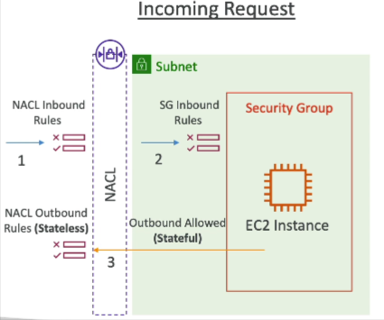

What does this mean?

*   **Stateful (Security Groups):** If an incoming request is allowed by the Security Group inbound rules and reaches the EC2 instance, the *outbound response is automatically allowed*, regardless of outbound rules. No outbound rules are evaluated.
*   **Stateless (NACLs):** Even if an incoming request is allowed and a response is generated, the **NACL outbound rules are still evaluated** for the response traffic. If the outbound rules don't allow the response, it will be blocked.

### Outgoing Request Flow ⬅️

Let's consider an EC2 instance making an outbound request (e.g., connecting to `www.google.com`).

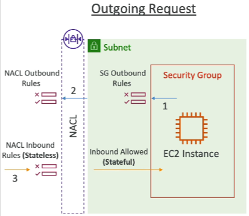

1.  The EC2 instance initiates the request (e.g., `curl google.com`).
2.  **Security Group Outbound Rules** are evaluated first. Is the traffic allowed to leave the instance?
3.  If allowed, the request proceeds to the **NACL**.
4.  **NACL Outbound Rules** are evaluated.
5.  The request reaches its destination (`www.google.com`).
6.  The response from `www.google.com` travels back to AWS.
7.  **NACL Inbound Rules** are evaluated because NACLs are stateless.
8.  Finally, the traffic reaches the Security Group. Because Security Groups are stateful, the **Security Group Inbound Rules are bypassed** because the outbound request was already allowed.

### Network Access Control Lists (NACLs) Explained 🛡️

*   NACLs act as firewalls controlling traffic at the subnet level.
*   Each subnet has **one** NACL associated with it.
*   New subnets are automatically assigned the **default NACL**.

#### NACL Rules ⚙️

*   NACL rules have a number from 1 to 32,766.
*   Rules are evaluated in order, from lowest number e.g. 1 (highest priority) to highest number e.g. 32,766 (lowest priority).
*   The **first rule that matches** determines whether the traffic is allowed or denied.
*   If no rules match, an implicit "deny all" rule applies.

📌 **Example:**

If you have two rules:

*   Rule 100: Allow traffic from CIDR A
*   Rule 200: Deny traffic from IP address X (within CIDR A)

Traffic from IP address X will be **allowed** because Rule 100 has higher precedence.

💡 **Tip:** AWS recommends adding rules in increments of 100 to allow for easy insertion of new rules later.

Newly created NACLs deny all traffic by default.

NACLs are useful for blocking specific IP addresses at the subnet level.

#### Default NACL 🌐

The default NACL is configured to allow all inbound and outbound traffic.

📝 **Note:** It's generally recommended **not to modify the default NACL**. Instead, create custom NACLs for specific security requirements.

If the exam mentions a default NACL associated with subnets, remember that it allows all traffic in and out by default.

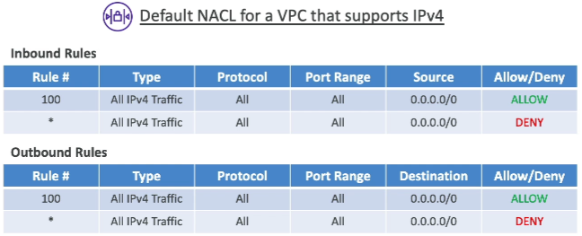

### Ephemeral Ports 🔌

When a client connects to a server, they use IP addresses and ports. The client connects to the server on a defined port (e.g., HTTP port 80, HTTPS port 443, SSH port 22).

The server needs to send a response back to the client. The client doesn't have a permanently open port. Instead, the client opens a **random, temporary port** for the duration of the connection. This is called an **ephemeral port**.

The range of ephemeral ports varies depending on the operating system:

*   Windows 10: 49152 - 65535
*   Linux: 32768 - 60999

📌 **Example:**

A client (IP: 11.22.33.44) connects to a web server (IP: 55.66.77.88) on port 80. The client opens an ephemeral port 50105.

The client sends a request:

*   Destination IP: 55.66.77.88
*   Destination Port: 80
*   Source IP: 11.22.33.44
*   Source Port (Ephemeral): 50105

The web server responds:

*   Source IP: 55.66.77.88
*   Source Port: 80
*   Destination IP: 11.22.33.44
*   Destination Port (Ephemeral): 50105

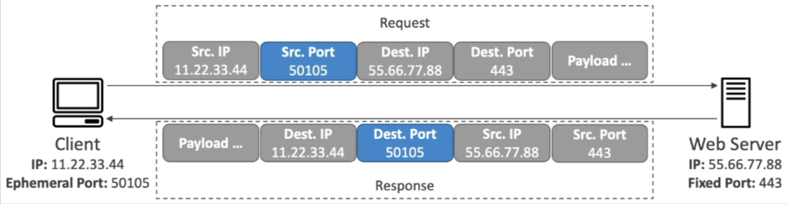

#### Ephemeral Ports and NACLs 🤝

Ephemeral ports are crucial when configuring NACLs.

Consider a client connecting to a database in a private subnet.

*   **Web NACL (Outbound):** Allow outbound TCP on port 3306 (MySQL) to the database subnet CIDR.
*   **DB NACL (Inbound):** Allow inbound TCP on port 3306 from the web subnet CIDR.

For the database to send a response back to the client:

*   **DB NACL (Outbound):** Allow outbound TCP on ephemeral port range (e.g., 1024-65535) to the web subnet CIDR.
*   **Web NACL (Inbound):** Allow inbound TCP on the same ephemeral port range from the DB subnet CIDR.

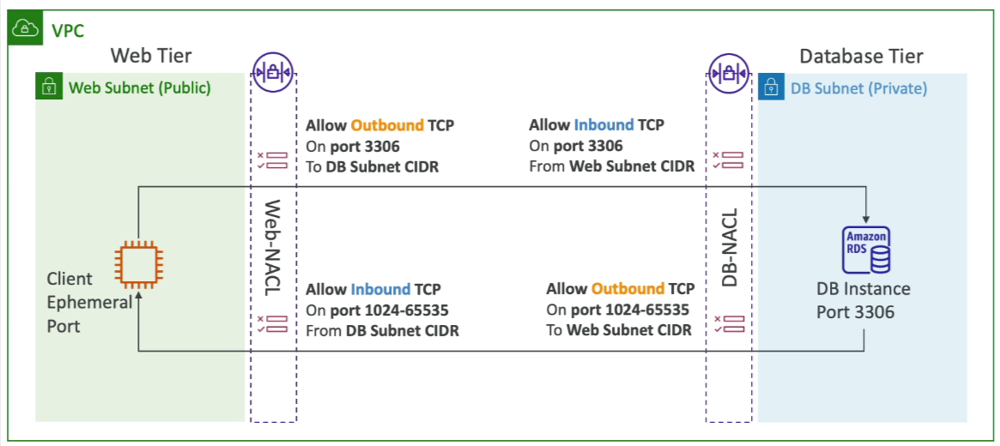

If you have multiple NACLs and subnets, ensure that all necessary combinations of connections are allowed within the NACL rules, considering the CIDR ranges of each subnet.

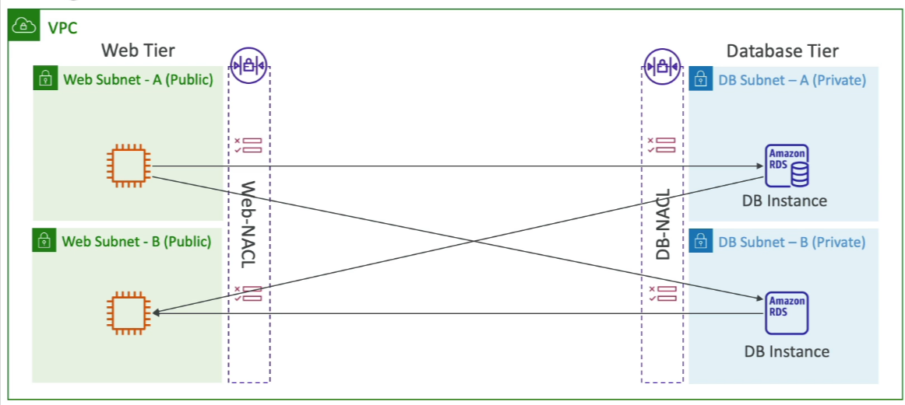

### Security Groups vs. NACLs: Key Differences 🆚

| **Security Group**                                                            | **NACL**                                                             |
|-------------------------------------------------------------------------------|----------------------------------------------------------------------|
| Operates at the instance level                                                 | Operates at the subnet level                                         |
| Supports allow rules only                                                     | Supports allow rules and deny rules                                  |
| Stateful: return traffic is automatically allowed, regardless of any rules    | Stateless: return traffic must be explicitly allowed by rules (think of ephemeral ports) |
| All rules are evaluated before deciding whether to allow traffic              | Rules are evaluated in order (lowest to highest) when deciding whether to allow traffic, first match wins |
| Applies to an EC2 instance when specified by someone                          | Automatically applies to all EC2 instances in the subnet that it’s associated with |

---

## 17. Network ACLs Deep Dive

Let's explore Network ACLs (NACLs) and how they function within a VPC.

First, navigate to the "Network ACLs" section in the VPC Dashboard -> Security Section. You'll find a default NACL associated with your VPC.

📝 **Note:** The default NACL is automatically associated with any subnets you create.

This default NACL has both inbound and outbound rules. By default:

*   Inbound rules allow all traffic on all ports from everywhere.
*   Outbound rules also allow all traffic on all ports to everywhere.

⚠️ **Warning:** The default NACL allows all traffic by default, so it's crucial to configure it according to your security requirements.

To demonstrate NACL behavior, we'll set up a simple HTTP server on a Bastion host.

1.  Connect to your Bastion host instance (We will install HTTPD on the Bastion host NOT on the private EC2 instance).
2.  Install the HTTPD web server:

    ```bash
    sudo yum install -y httpd
    ```

3.  Enable and start the HTTPD service:

    ```bash
    sudo systemctl enable httpd
    sudo systemctl start httpd
    ```

4.  Create a simple "hello world" webpage:

    ```bash
    sudo su -c "echo 'hello world' > /var/www/html/index.html"
    ```

5.  Configure the Bastion host's security group to allow inbound HTTP traffic (port 80) from anywhere.

Now, you should be able to access the "hello world" page by navigating to the Bastion host's public IP address in your web browser.

### Testing Inbound NACL Rules

Let's modify the default NACL's inbound rules to block HTTP traffic.

1.  Edit the inbound rules of the default NACL.
2.  Add a new rule with the following settings:

    *   Rule number: 80
    *   Type: HTTP
    *   Source: Anywhere
    *   Action: Deny

3.  Save the changes and ensure the rules are sorted by rule number.

Now, rule 80 (Deny HTTP) has precedence over the default "Allow All" rule. If you refresh the "hello world" page in your browser, you'll see it's no longer accessible. The NACL is acting as a firewall and blocking the HTTP request.

If you change the rule number to 140, the "Allow All" rule will take precedence, and the "hello world" page will be accessible again.

💡 **Tip:** NACLs are evaluated based on rule number, with lower numbers taking precedence.

### NACL Statelessness

NACLs are stateless. This means that return traffic is not automatically allowed. You must explicitly define rules for both inbound and outbound traffic.

1.  Edit the outbound rules of the default NACL.
2.  Change the "Allow All" rule to "Deny All".

Now, even though the inbound rule allows HTTP traffic, the outbound rule blocks the return traffic. If you refresh the "hello world" page, it will time out because the server cannot send the response back to your browser.

### Security Groups vs. NACLs

⚠️ **Warning:** NACLs and security groups work together. Even if your security group allows traffic, the NACL can still block it.

Security groups are stateful. If traffic is allowed inbound, the return traffic is automatically allowed, regardless of outbound rules.

To demonstrate this:

1.  Edit the Bastion host's security group.
2.  Remove the outbound rule that allows all traffic.

Even without an outbound rule in the security group, you can still access the "hello world" page because the security group is stateful. However, the Bastion host would not be able to initiate outbound connections (e.g., to Google) because there's no outbound rule allowing it.

To restore the original functionality, add an outbound rule to the security group that allows all traffic.

📌 **Example:**

*   NACLs are stateless and act as a first line of defense at the subnet level.
*   Security Groups are stateful and act as a second line of defense at the instance level.

It's crucial to understand the differences between security groups and NACLs to properly secure your AWS environment.

---

## 18. VPC Peering

VPC Peering allows you to connect VPCs across different regions and AWS accounts using the AWS network. 🌐 The goal is to make these VPCs behave as if they are part of the same network.

Why use VPC Peering? 🤔

*   Connect VPCs in different regions.
*   Connect VPCs in different accounts.
*   Connect VPCs within the same account.

⚠️ **Warning:** For VPC Peering to work, the VPC network CIDRs must be distinct and non-overlapping. If CIDRs overlap, the VPCs will not be able to communicate.

Key characteristics of VPC Peering:

*   VPC peerings happen between two VPCs.
*   VPC peerings are **not** transitive. 🚫 This is crucial!

Consider three VPCs: A, B, and C.

1.  A peering connection exists between A and B. ✅
2.  A peering connection exists between B and C. ✅
3.  A and B can communicate, and B and C can communicate.
4.  However, A and C **cannot** communicate unless you explicitly create a VPC peering connection between them. ❌

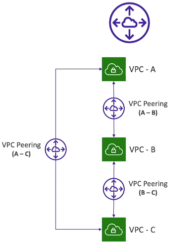

Even with peered VPCs, you **must update the route tables in each VPC's subnets**. 📝 **Note:** This ensures that instances in different VPCs can communicate with each other. We'll explore this in a hands-on demonstration.

Benefits of VPC Peering:

*   Can occur within the same AWS account. ✅
*   Can occur across different AWS accounts. ✅
*   Can occur across different AWS regions. ✅

Security Groups and VPC Peering:

*   You can reference security groups from peered VPCs across accounts within the same region. 🛡️
*   This allows you to reference a security group instead of specifying a CIDR IP range as the source.

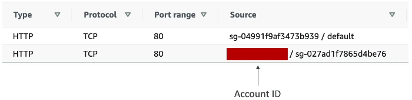

📌 **Example:** Instead of allowing traffic from `10.0.0.0/16`, you can allow traffic from the security group `sg-xxxxxxxx`.

This is a very powerful feature for managing security across peered VPCs. 💪

We are now adding VPC peering connections to our networking diagram to connect our VPC to other VPCs. 🤝

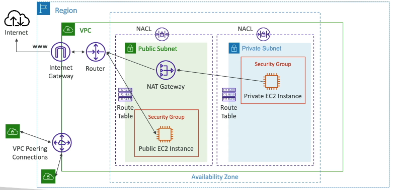

---

## 19. Peering VPCs

In this section, we'll explore how to peer two VPCs together. We'll start by demonstrating that the VPCs are initially isolated and then establish a peering connection to enable communication between them.

First, let's confirm that our VPCs are not connected. We'll do this by launching an EC2 instance in each VPC and attempting to connect between them.

1.  Launch an EC2 instance in the **default VPC**.
    * Name: defaultVPCInstance
    *   Choose an AMI.
    *   Select the `demo key pair` (though we won't actually need it for SSH).
    *   Create a security group (`launch-wizard-2`) with an SSH rule.
2.  Launch an EC2 instance (BastionHost) in the **demo VPC** -> already exist.
3.  Verify the private IP addresses of the instances.
    *   The BastionHost has an IP address in the `10.0.0.0/16` range.
    *   The default VPC instance has an IP address in the `172.31.0.0/16` range.
    *   This confirms they are in different VPCs.

Now, let's try to connect from the default VPC instance to the BastionHost.

1.  Connect to both instances using EC2 Instance Connect.
2.  From the BastionHost, run (use private IP):

    ```bash
    curl 10.0.0.71:80
    ```

    This should return "Hello World", indicating the web server on the BastionHost is working.
3.  From the default VPC instance, run:

    ```bash
    curl <BastionHost_Private_IP>:80
    ```

    ⚠️ **Warning:** This will time out because the VPCs are isolated.

Now that we've confirmed the VPCs are isolated, let's create a peering connection.

1.  Go to VPC Peering Connections in the AWS Management Console.
2.  Create a new peering connection named `DemoPeeringConnection`.
3.  Configure the peering connection:
    *   Requester VPC: `demo VPC`
    *   Acceptor VPC: `default VPC`
    *   Ensure that the CIDR blocks of the two VPCs do not overlap. This is a requirement for creating a VPC peering connection.
4.  Create the peering connection. It will initially be in a "pending acceptance" state.
5.  Accept the peering connection request. Since both VPCs are in the same account, you can accept the request yourself.
    📝 **Note:** If the VPCs were in different accounts, the owner of the acceptor VPC would need to accept the request.

Even after creating and accepting the peering connection, traffic will not flow until we modify the route tables.

1.  Try the `curl` command again from the default VPC instance to the BastionHost.
    ⚠️ **Warning:** It will still time out.

Now, let's modify the route tables.

1.  Modify the **public route table** associated with the `demo VPC`:
    *   Add a route with the destination CIDR block of the `default VPC` (`172.31.0.0/16`).
    *   Set the target to the `DemoPeeringConnection`.
2.  Modify the **main route table** associated with the `default VPC`:
    *   Add a route with the destination CIDR block of the `demo VPC` (`10.0.0.0/16`).
    *   Set the target to the `DemoPeeringConnection`.

Now that we've added routes in both directions, let's try the `curl` command again.

1.  From the default VPC instance, run:

    ```bash
    curl <BastionHost_Private_IP>:80
    ```

    🎉 You should now see "Hello World", indicating that the VPC peering connection is working!

We have successfully established a VPC peering connection and enabled communication between the two VPCs.

---

## 20. VPC Endpoints

VPC endpoints allow you to privately access AWS services without traversing the public internet. This enhances security and reduces costs.

Instead of routing traffic through a NAT gateway and internet gateway, VPC endpoints enable direct access to services via the private AWS network.

Consider a scenario where an EC2 instance in a private subnet needs to access Amazon SNS.  Without a VPC endpoint, the traffic would flow through the NAT gateway, then the internet gateway, and finally to the public Amazon SNS endpoint.  This is inefficient and potentially costly.

By deploying a VPC endpoint within your VPC, the EC2 instance can directly access Amazon SNS without ever leaving the AWS network. 🚀

Every AWS service has a public URL. VPC endpoints leverage **AWS PrivateLink** to provide private access. This means you can connect to AWS services using a private network instead of the public internet.

VPC endpoints are redundant, scale horizontally, and eliminate the need for internet gateways or NAT gateways for accessing AWS services. This simplifies your network infrastructure.

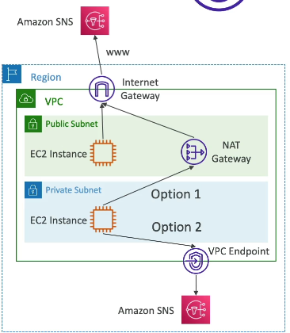

📝 **Note:** When troubleshooting, check DNS settings resolution in your VPC and your route tables.

There are two types of VPC endpoints:

1.  Interface Endpoints
2.  Gateway Endpoints

### Interface Endpoints

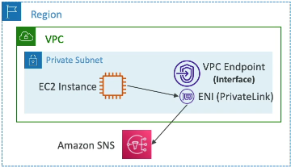

*   Powered by **PrivateLink**.
*   Provision an Elastic Network Interface (ENI) with a private IP address in your VPC.
*   The ENI serves as an entry point to your private AWS service.
*   Requires attaching a security group.
*   Supports most, if not all, AWS services.
*   Incur a cost per hour and per gigabyte of data processed. 💰

📌 **Example:** An EC2 instance in a private subnet accesses a service through a PrivateLink interface VPC endpoint, utilizing the ENI.

### Gateway Endpoints

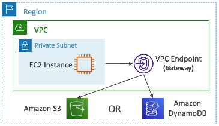

*   Provision a gateway that must be used as a target in a route table.
*   Do not use IP addresses or security groups.
*   Limited to Amazon S3 and DynamoDB.
*   Free to use and scale automatically. 💸

📌 **Example:** A VPC endpoint of type gateway provides access to Amazon S3 or DynamoDB.

### Gateway vs. Interface Endpoints for S3 and DynamoDB

If both Interface Endpoints and Gateway Endpoints can access Amazon S3 and DynamoDB, which should you use?

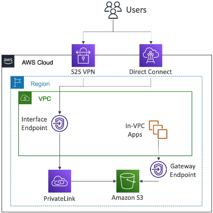

For the AWS Certified Cloud Practitioner exam, the Gateway Endpoint is generally the preferred solution. Why?

*   It only requires modifying a route table.
*   Access to Amazon S3 is free of charge.
*   It scales more efficiently.

Interface Endpoints incur costs.

The Interface Endpoint might be preferable in specific scenarios:

*   When you need private access from on-premises data centers via Site-to-Site VPN or Direct Connect.
*   When you want to connect from another VPC through the Interface Endpoint.

These are advanced use cases.

💡 **Tip:** Most of the time, the Gateway Endpoint is the preferred option for accessing Amazon S3 and DynamoDB.

---

## 21. Practicing with VPC Endpoints

Let's practice using VPC endpoints to securely access AWS services from within a private VPC.

First, we'll terminate an existing default VPC instance as it's no longer needed.

Next, we'll connect to a bastion host (a public instance) and then SSH into the private EC2 instance.

```bash
ssh -i "demoKeyPair.pem" ec2-user@<private_instance_ip>
```

### Accessing S3 Without a VPC Endpoint

Initially, to access S3, we need to create an IAM role for the private EC2 instance with read-only access to S3.

1.  Navigate to the EC2 instance in the AWS Management Console.
2.  Go to **Security**.
3.  Modify the IAM role.
4.  Create a new role with the **AmazonS3ReadOnlyAccess** policy.
    *   📌 **Example:** `DemoRoleEC2-S3ReadOnly`
5.  Attach the new role to the EC2 instance.

Now, from within the private EC2 instance, we can list S3 buckets:

```bash
aws s3 ls
```

We can also verify internet connectivity using `curl`:

```bash
curl google.com
```

### Removing Internet Access

To demonstrate the need for a VPC endpoint, we'll remove the NAT gateway route from the private subnet's route table. This effectively isolates the private EC2 instance from the internet.

1.  Go to the **Route Tables** in the VPC section of the AWS Management Console.
2.  Select the route table associated with the private subnet.
3.  Edit the routes and remove the route to the NAT gateway (or internet gateway).

After removing the internet access, `aws s3 ls` and `curl google.com` will no longer work.

### Creating a VPC Endpoint for S3

Now, let's create a VPC endpoint to allow the private EC2 instance to access S3 without internet access.

1.  Navigate to **Endpoints** in the VPC section of the AWS Management Console.
2.  Click **Create Endpoint**.
3.  Choose **AWS services** as the service category.
4.  Select **Amazon S3** as the service.
5.  Choose **Gateway** as the type of endpoint.
6.  Select the **Demo VPC**.
7.  Select the **private route table** to update the route table. This will route traffic destined for S3 through the endpoint.
8.  Choose **Full access** for the endpoint policy.
9.  Click **Create Endpoint**.

### Verifying the VPC Endpoint

After the endpoint is created, verify that it's associated with the private route table.

1.  Go to **Route Tables**.
2.  Select the private route table.
3.  Check the routes. You should see a new route with the destination as `s3.<region>.amazonaws.com` and the target as the VPC endpoint ID.

### Testing the S3 Connection

Reconnect to the private EC2 instance via the bastion host.

Attempting `curl google.com` should still fail, confirming the lack of internet access.

However, `aws s3 ls` might still fail initially due to the AWS CLI defaulting to the `us-east-1` region.

To fix this, explicitly specify the correct region when running the `aws s3 ls` command.

```bash
aws s3 ls --region <your_region>
```

📌 **Example:**

```bash
aws s3 ls --region eu-central-1
```

Now, the `aws s3 ls` command should successfully list the S3 buckets, demonstrating that the private EC2 instance is accessing S3 through the VPC endpoint without internet access.

📝 **Note:** VPC endpoints provide secure and private access to AWS services, enhancing the security posture of your VPC.

💡 **Tip:** Always ensure your AWS CLI is configured with the correct region to avoid connectivity issues when using VPC endpoints.

---

## 22. VPC Flow Logs

VPC Flow Logs allow you to capture information about IP traffic going into network interfaces. This can be configured at the:

*   VPC level
*   Subnet level
*   Elastic Network Interface (ENI) level

There are three kinds of Flow Logs. They are very helpful for monitoring and troubleshooting connectivity issues within your VPC.

These logs can be sent to:

*   Amazon S3
*   CloudWatch Logs
*   Kinesis Data Firehose

They will capture information for AWS managed interfaces such as:

*   ELB
*   RDS
*   ElastiCache
*   Redshift
*   WorkSpaces
*   NAT gateway
*   Transit gateway

and so on.

### VPC Flow Logs Syntax

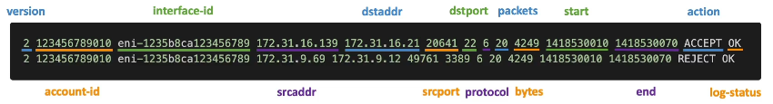

This is what a VPC Flow Log looks like. There is a specific format associated with it, including:

*   Version
*   Account ID
*   Interface ID
*   Source address
*   Destination address
*   Source port
*   Destination port
*   Protocol packets
*   Start and action
*   Log status

This is metadata about the network packets going into your VPC.

Let's look at what information we can get from these flow logs:

* `srcaddr` and `dstaddr` :- The source and destination addresses help identify problematic IPs. You can see if an IP is repeatedly being denied, which could indicate an issue with that IP or a potential attack.
* `srcport` and `dstport` :-  Source and destination ports help you identify problematic ports.
* **Action** :-  The "Action" field will be either "accept" or "reject," indicating success or failure at the Security Group or NACL level.

VPC Flow Logs can be used for:

*   Analytics on usage patterns
*   Detecting management behavior
*   Identifying port scans

To query these Flow Logs, you have two main options:

1.  Athena on S3 (best for large-scale analysis)
2.  CloudWatch Logs Insights (for streaming analysis)

📌 **Example:** Refer to the AWS documentation for detailed examples of Flow Log queries and use cases.

### Troubleshooting Security Group and NACL Issues with Flow Logs

We can use the "Action" field in Flow Logs to troubleshoot Security Group and NACL issues.

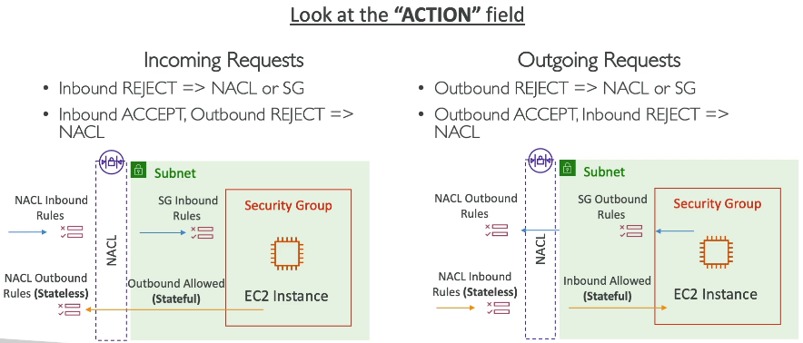

Let's consider a typical incoming request for your NACL and subnet. Remember that NACLs are stateless, and Security Groups are stateful.

*   **Inbound Reject:** If you see an inbound request rejected, it means either the NACL or the Security Group is refusing the request.
*   **Inbound Accept and Outbound Reject:** This *only* indicates a NACL issue. Because Security Groups are stateful, if the inbound traffic is allowed, the outbound traffic is automatically allowed as well.

For outgoing requests:

*   **Outbound Reject:** This indicates a NACL or Security Group issue.
*   **Outbound Accept and Inbound Reject:** This *must* mean a NACL issue.

### VPC Flow Log Architectures

Here are a few common architectures for using VPC Flow Logs:

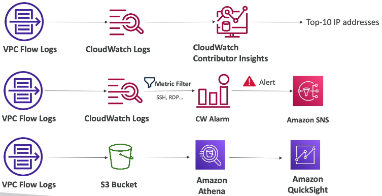

1.  **CloudWatch Logs for Real-time Analysis:**

    *   VPC Flow Logs -> CloudWatch Logs -> CloudWatch Contributor Insights
    *   Use CloudWatch Contributor Insights to find the top 10 IP addresses contributing the most network traffic on your VPC or ENI.

2.  **CloudWatch Logs with Metric Filters and Alarms:**

    *   VPC Flow Logs -> CloudWatch Logs -> Metric Filter -> CloudWatch Alarm -> SNS Topic
    *   Set up a metric filter to look for protocols like SSH or RDP. If there's an unusual amount of SSH or RDP traffic, trigger a CloudWatch alarm and send an alert via an Amazon SNS topic. This can help detect suspicious activity.

3.  **S3 Storage with Athena and QuickSight for Analysis and Visualization:**

    *   VPC Flow Logs -> S3 Bucket -> Amazon Athena -> Amazon QuickSight
    *   Send everything to an S3 bucket for storage. Use Amazon Athena to analyze the VPC Flow Logs with SQL, and then visualize the data with Amazon QuickSight.

---

## 23. VPC Flow Logs - Hands On

Let's practice using VPC flow logs. We'll create flow logs and send them to both Amazon S3 and CloudWatch Logs, then query the S3 logs using Athena.

First, we'll create a flow log that sends data to S3.

1.  Navigate to your demo VPC and select "Flow Logs."
2.  Click on "Create flow log."
3.  Give the flow log a name. 📌 **Example:** `DemoS3FlowLog`
4.  Choose the type of traffic to capture: All. Options are:-
    *   Accept: Only capture accepted traffic.
    *   Reject: Only capture rejected traffic. Useful for debugging traffic issues.
    *   All: Capture all traffic.
5.  Select the aggregation interval. This determines how long to wait before aggregating records.
    *   💡 **Tip:** Shorter intervals (e.g., 1 minute) create more records and can be more expensive.
    *   ⚠️ **Warning:** One-minute aggregation can lead to high costs due to frequent writes to S3 or CloudWatch Logs.
    *   10 minutes is often a better option for long-term analysis.
6.  Choose "Amazon S3 bucket" as the destination.
7.  Specify the S3 bucket ARN.

Now, let's create the S3 bucket:

1.  Go to the S3 service.
2.  Create a new bucket in the same region as your VPC. 📌 **Example:** `demo-vpc-flow-logs-v2-<acc-id>`
3.  View the bucket details and copy the bucket ARN from the "Properties" section.
4.  Paste the ARN into the flow log configuration.
    *   📝 **Note:** A resource-based policy will be automatically created and attached to the bucket, allowing the VPC service to send data.
5.  The default format is the standard AWS format.
6.  Click "Create Flow Log."

Next, we'll create an another flow log that sends data to CloudWatch Logs.

1.  Click "Create flow log."
2.  Give the flow log a name. 📌 **Example:** `DemoFlowLogCloudWatchLogs`
3.  Select "All" traffic.
4.  Choose a one-minute interval.
5.  Select "CloudWatch Logs" as the destination.
6.  You'll need to create a log group and an IAM role.

Let's create the IAM role:

1.  Click on "Set Up Permissions" and then "Create a role."
2.  Choose "Custom trust policy."
3.  Enter the following trust policy:

```json
{
	"Version": "2012-10-17",
	"Statement": [
		{
			"Sid": "Statement1",
			"Effect": "Allow",
			"Principal": {
			    "Service": "vpc-flow-logs.amazonaws.com"
			},
			"Action": "sts:AssumeRole"
		}
	]
}
```

*   📝 **Note:** This policy allows VPC flow logs to assume this role.
4.  For permissions, select **CloudWatchLogsFullAccess**.
5.  Give the role a name. 📌 **Example:** `flowlogsrole`
6.  Create the role.
7.  Refresh the flow log creation page and select the newly created role.

Now, let's create the CloudWatch Logs log group:

1.  Go to the CloudWatch Logs console.
2.  Under "Logs" and "Log Groups," create a new log group.
3.  Give the log group a name. 📌 **Example:** `VPCFlowLogs`
4.  Set the retention policy (e.g., one day).
5.  Create the log group.
6.  Refresh the flow log creation page and select the newly created log group.
7.  Click "Create Flow Log."

Now that the flow logs are created, let's examine the data:

*   **Amazon S3:**
    1.  Go to your S3 bucket.
    2.  You should see `AWSLogs` folders created.
    3.  Drill down to find the VPC flow logs, organized by region and timestamp.
*   **CloudWatch Logs:**
    1.  Go to the CloudWatch Logs console.
    2.  You should see log streams corresponding to the ENIs in your account.
    3.  Find the log stream for a specific EC2 instance by matching the ENI ID.
    4.  Examine the traffic logs, including accepted and rejected traffic.

Now, let's use Athena to query the data in S3.

1.  In Athena, you first need to set up a query result location in S3.
2.  Click on "New Settings" and then "Manage."
3.  Specify an S3 bucket where you want to store the query results.

Let's create an S3 bucket for Athena results:

1.  Go to the S3 service.
2.  Create a new bucket. 📌 **Example:** `demo-athena-v2-vpc-log-flow`
3.  View the bucket details and copy the ARN from the "Properties" section.
4.  Back in Athena, paste the ARN, **add `athena` to the path, and prefix it with `s3://`**. 📌 **Example:** `s3://demo-athena-v2-vpc-log-flow/athena`
5.  Save the settings.

Now, let's create a table in Athena to query the VPC flow logs:

1.  Search for "AWS VPC flow logs Athena" to find the [AWS documentation](https://docs.aws.amazon.com/athena/latest/ug/vpc-flow-logs.html).
2.  Find the `CREATE TABLE` statement.
3.  Paste the statement into the Athena UI.
4.  Modify the `LOCATION` clause to point to your VPC flow logs data in S3. Use the S3 URI of the folder containing the logs (e.g., `s3://your-vpc-flow-logs-bucket/AWSLogs/your-account-id/vpcflowlogs/your-region/`).
5.  Run the statement.

Next, create partitions to read the data:

1.  Find the `ALTER TABLE ADD PARTITION` statement in the AWS documentation.
2.  Paste the statement into the Athena UI.
3.  Modify the `LOCATION` clause to point to a specific date's logs in S3.
4.  Update the `PARTITION` values to match the date in the `LOCATION`.
5.  Run the statement.
    *   📝 **Note:** This process is manual, but AWS Glue can help automate it.

```sql
ALTER TABLE vpc_flow_logs
ADD PARTITION (`date`='2025-10-12')
LOCATION 's3://amzn-s3-demo-bucket/prefix/AWSLogs/{account_id}/vpcflowlogs/{region_code}/YYYY/MM/dd';
```

Finally, query the flow logs:

1.  Use a `SELECT` statement to query the `vpc_flow_logs` table. 📌 **Example:** `SELECT * FROM vpc_flow_logs WHERE action = 'REJECT'`
2.  Run the query.
3.  Examine the results.

💡 **Tip:** You can use Athena to perform complex queries, group by IP addresses, and analyze attack patterns.

Don't forget to clean up! Go to the VPC and delete the flow logs to avoid ongoing costs.

---

## 24. Site to Site VPN, Virtual Private Gateway & Customer Gateway

Let’s explore how to connect your **AWS VPC** with an **on-premises corporate data center** using a secure **Site-to-Site VPN**.

### 🌐 What is a Site-to-Site VPN?

- A **Site-to-Site VPN** allows **private, encrypted communication** between:
  - Your AWS VPC
  - Your corporate (on-premises) data center
- It uses the **public internet** but creates a **private tunnel** between networks.

### 🏗️ Components Involved

1. **Virtual Private Gateway (VGW)**  
   - Deployed on the AWS side  
   - Acts as a **VPN concentrator**
   - Must be **created and attached** to your VPC from which you want to create the Site-to-Site VPN connection 
   - You can optionally **customize the ASN (Autonomous System Number)**

2. **Customer Gateway (CGW)**  
   - Deployed on the **corporate data center side**
   - Can be a **physical device** or **software appliance**
   - Must be **publicly routable**, or placed **behind a NAT device** with NAT-T enabled.
   - See more: [Customer Gateway Devices](https://docs.aws.amazon.com/vpn/latest/s2svpn/your-cgw.html#DevicesTested)

    - What IP address to use?
      - A **public Internet-routable IP address** for your Customer Gateway device.
      - If it's behind a **NAT device** that's enabled for NAT traversal (NAT-T), use the **public IP address** of the NAT device.

### 🔗 VPN Setup Process

- Create a **VGW** and attach it to the VPC
- Configure the **CGW** with:
  - A **public IP address** if it's directly accessible
  - A **NAT device’s public IP** if it's behind NAT
- Establish the **Site-to-Site VPN connection** over the public internet

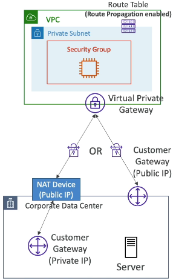

### ⚠️ Important Exam Tips

- ✅ **Enable Route Propagation** for the Virtual Private Gateway in the route tables that is associated with your subnets. Without it, the VPN connection won’t function even if everything is configured

- ✅ If you need to **ping EC2 instances from on-prem**, make sure:
  - The **ICMP protocol is allowed** in the **inbound security group rules**
  - Otherwise, the ping will fail even though the VPN works

### AWS VPN CloudHub 🌐🔒

One last important concept to understand about **site-to-site VPN** is **AWS VPN CloudHub**.

The idea is simple:

* You have a **VPC** with a **Virtual Private Gateway (VGW)**.
* You also have **multiple customer networks** or **data centers**, each with its own **Customer Gateway (CGW)**.
* **CloudHub** allows these customer networks to communicate securely with one another using multiple VPN connections.

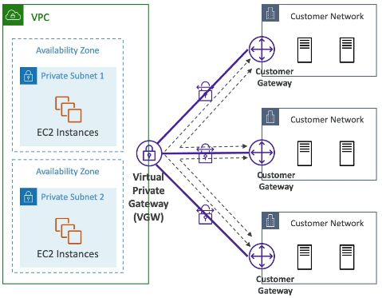

#### How AWS VPN CloudHub Works ⚙️

* It follows a **hub-and-spoke model** to provide secure, low-cost connectivity.
* You establish a **site-to-site VPN connection** between each **CGW** and the single **VGW** inside your VPC.
* Once connected, your customer networks can communicate with each other through the VPN.

#### Key Characteristics ✅

* **Public Internet transport:** All traffic flows over the **public internet**, not through a private network.
* **Encryption:** Even though it uses the public internet, all communication is **encrypted** via VPN.
* **Flexibility:** Can be used for **primary** or **secondary** connectivity between different locations.

#### Setup Process 🛠️

1. Create multiple **site-to-site VPN connections** on the same **Virtual Private Gateway**.
2. Enable **dynamic routing**.
3. Configure your **route tables**.
4. That’s it — your networks are securely connected!

### ✅ Summary

- Use **Site-to-Site VPN** for secure communication between AWS and on-prem
- Components: **VGW (AWS)** and **CGW (on-prem)**
- VPN uses the **public internet** but provides **encrypted traffic**
- **Enable route propagation** and **security group rules** for full connectivity
- Use **CloudHub** for multi-site-to-site VPN scenarios

🔒 Secure, scalable, and exam-critical — that’s Site-to-Site VPN!

---

## 25. Site to Site VPN, Virtual Private Gateway & Customer Gateway Hands On

Let’s walk through the basic **hands-on process** of creating a **Site-to-Site VPN connection** in AWS.

### 🧱 Step 1: Create a Customer Gateway (CGW)

- Go to **VPN** section in the AWS console and click **Customer Gateways**
- This represents the **on-premises VPN device**
- Fill in the following:
  - **Name**: Any friendly name, like `AWS`
  - **BGP ASN** (optional): Used for Border Gateway Protocol (can be skipped for basic setup)
  - **IP Address**: This should be the **public IP** of your **on-premises VPN device**
  - **Certificate ARN**: Required for **secure authentication** between AWS and your VPN device

📌 **Note**: The instructor skipped this step in the demo because there was **no actual on-prem infrastructure** available.

### 🏗️ Step 2: Create a Virtual Private Gateway (VGW)

- Go to **Virtual Private Gateways**
- Click **Create Virtual Private Gateway**
- Specify an optional **ASN number** (or use default)
- This will be the AWS-side endpoint of your VPN

📝 **Note**: VGW is attached to your **VPC** later to enable routing between the VPN and your AWS resources.

### 🔗 Step 3: Create the VPN Connection

- Click **Create VPN Connection**
- Choose **Type**: `Virtual Private Gateway`
- Select the **Virtual Private Gateway** created earlier
- Select the **Customer Gateway** created earlier
- Advanced settings (routing, IPv4, tunneling, etc.) can be left as default for now

💡 **Tip**: These advanced options are **out of scope for the exam**, so don’t worry about them during hands-on or certification prep.

### ✅ Summary: Key Steps to Remember

1. **Create a Customer Gateway** – represents on-prem
2. **Create a Virtual Private Gateway** – AWS endpoint
3. **Create a Site-to-Site VPN Connection** – connects the two

📝 **Note**: Even if you don’t configure this end-to-end in practice, **knowing the flow and components** is essential for AWS exams.

👍 That’s it! You've now seen how to conceptually and practically set up a **Site-to-Site VPN connection** in AWS. See you in the next lecture.

---

## 26. Direct Connect (DX)

Direct Connect (DX) provides a dedicated, private connection from your remote network into your VPC.

*   You need to set up a Direct Connect connection.
*   This connection uses an AWS Direct Connect location.
*   You also need to set up a virtual private gateway (VGW) on your VPC side to enable connectivity between your on-premise data center and AWS.

The same connection can access both:

*   Public resources (e.g., Amazon S3) using a public Virtual Interface (VIF).
*   Private resources (e.g., EC2 Instances) using a private VIF.

### Use Cases for Direct Connect

*   **Increased Bandwidth Throughput:** 🚀 Faster data transfer for large datasets because traffic doesn't traverse the public internet.
*   **Lower Cost:** 💰 Utilizing a private connection can be more cost-effective than public internet.
*   **Consistent Network Experience:** 🌐 More reliable connectivity compared to the public internet, especially beneficial for applications using real-time data feeds.
*   **Hybrid Environments:** ☁️ Supports connectivity between your on-premises data center and the cloud.
*   Supports both IPv4 and IPv6.

### Direct Connect Diagram

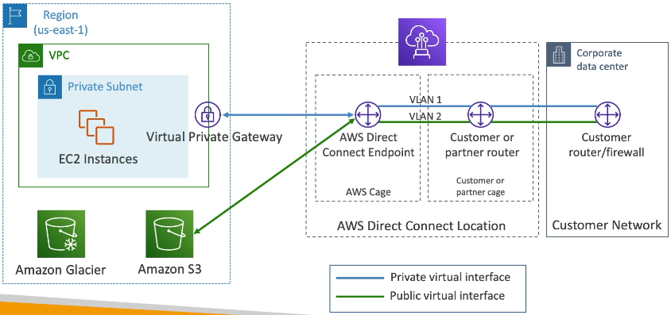

To connect a region to your corporate data center:

1.  Commission an AWS Direct Connect location. These are physical locations listed on the AWS website.
2.  A Direct Connect endpoint will be present.
3.  A customer or partner router is required, rented from a customer or partner cage. There are two cages in the Direct Connect location.
4.  In your on-premise data center, set up a customer router with a firewall.

To access private resources in your VPC:

1.  Set up a private VIF between your data center, the Direct Connect location, and a virtual private gateway.
2.  The virtual private gateway is attached to your VPC.
3.  Through the private VIF, you can access your private subnets with your EC2 Instances.

📝 **Note:** This connection is private and doesn't traverse the public internet. Setting up a Direct Connect can take up to a month.

To connect to public services within AWS (e.g., Amazon S3, Amazon Glacier):

1.  Set up a public virtual interface (public VIF).
2.  The connection goes through the same path but connects directly to AWS instead of a virtual private gateway.

### Direct Connect Gateway - Connecting to Multiple VPCs in Different Regions

To connect to one or more VPCs in different regions, use a Direct Connect gateway.

1.  Establish a Direct Connect connection.
2.  Use a private VIF to connect to the Direct Connect gateway.
3.  The Direct Connect gateway will have a private virtual interface to a virtual private gateway in each region.

This setup allows you to connect to multiple VPCs across multiple regions.

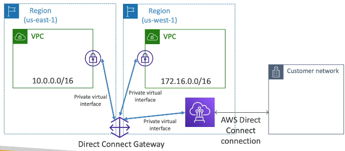

### Connection Types

*   **Dedicated Connection:**
    *   Capacities: 1 Gbps, 10 Gbps, or 100 Gbps.
    *   Provides a physical Ethernet port dedicated to you.
    *   Request is made to AWS and completed by an AWS Direct Connect partner.
*   **Hosted Connection:**
    *   Capacities: 50 Mbps, 500 Mbps, up to 10 Gbps.
    *   Connection requests are made via AWS Direct Connect Partners.
    *   Allows adding capacity on demand.
    *   Available at select locations.

⚠️ **Warning:** Setting up either a dedicated or hosted connection often takes longer than one month.

💡 **Tip:** In the exam, if a question asks about transferring data within a week and requires high speed, Direct Connect is likely NOT the answer unless a connection is already established. Consider the time required to establish the connection.

### Encryption

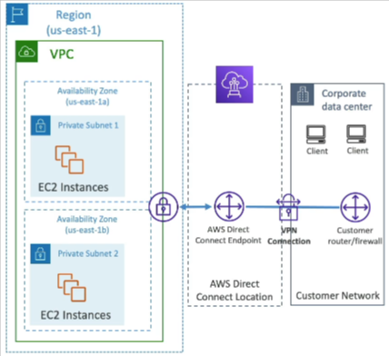

By default, Direct Connect does not encrypt data. It is a private connection, but not encrypted.

To add encryption:

*   Set up Direct Connect alongside a VPN to provide an IPsec encrypted private connection.
*   This adds an extra layer of security but increases complexity.

To set up:

1.  Establish the Direct Connect location.
2.  Set up a VPN connection on top of the Direct Connect.

This encrypts all traffic between your corporate data center and AWS.

### Resiliency

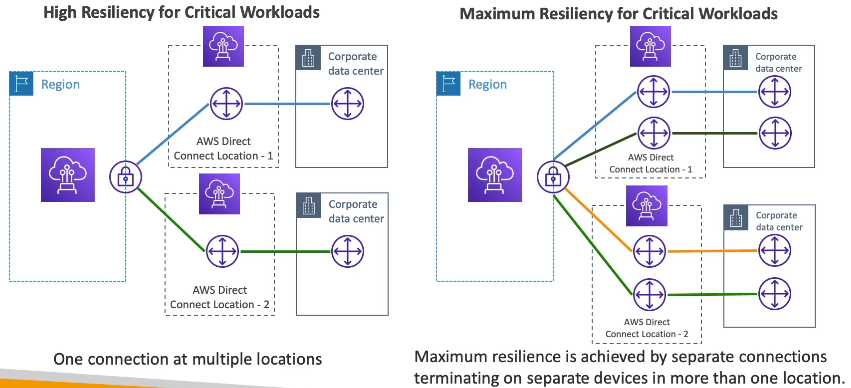

Two modes of resiliency for Direct Connect:

*   **High Resiliency for Critical Workloads:**
    *   Set up multiple Direct Connects.
    *   Use two corporate data centers and two different Direct Connect locations.
    *   Each location has a private VIF.
    *   Provides redundancy if one Direct Connect location goes down.
*   **Maximum Resiliency for Critical Workloads:**
    *   Use two Direct Connect locations.
    *   Each Direct Connect location has two independent connections.
    *   This results in four connections across two locations going into AWS.

Maximum resilience is achieved by using separate connections terminating on separate devices in more than one location.

---

## 27. Direct Connect with VPN Backup

This note covers an architecture pattern that might appear in the exam: using Direct Connect with a VPN backup.

The scenario involves connecting your corporate data center to your VPC.

*   Your primary connection is established via **Direct Connect**. 💰 This offers a dedicated, high-performance link.

*   However, Direct Connect can be expensive, and it's susceptible to occasional outages. ⚠️

To ensure continuous connectivity, consider these options:

1.  **Secondary Direct Connect:** Using a second Direct Connect connection as a backup. This is costly. 💸
2.  **Site-to-Site VPN:** Implementing a Site-to-Site VPN connection over the public internet as a backup. This is a more cost-effective solution. 🌐

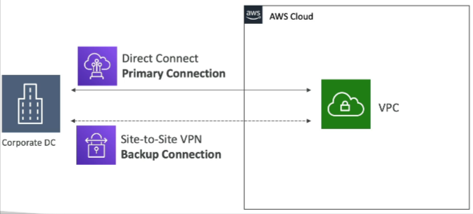

The recommended approach is to use a **Site-to-Site VPN** as a backup connection.

*   This setup ensures that if the primary Direct Connect connection fails, the VPN connection automatically activates. ✅
*   Traffic is then routed through the public internet via the VPN.
*   The public internet is generally more resilient, providing a reliable backup path. 🛡️

In summary:

*   **Primary Connection:** Direct Connect (fast, dedicated, expensive)
*   **Backup Connection:** Site-to-Site VPN (reliable, cost-effective)

This architecture provides redundancy and ensures continuous connectivity to your VPC, even if your Direct Connect connection experiences issues. 🚀

---

## 28. Common Network Topologies in AWS: Transit Gateway

**Network Topologies Can become Complicated**

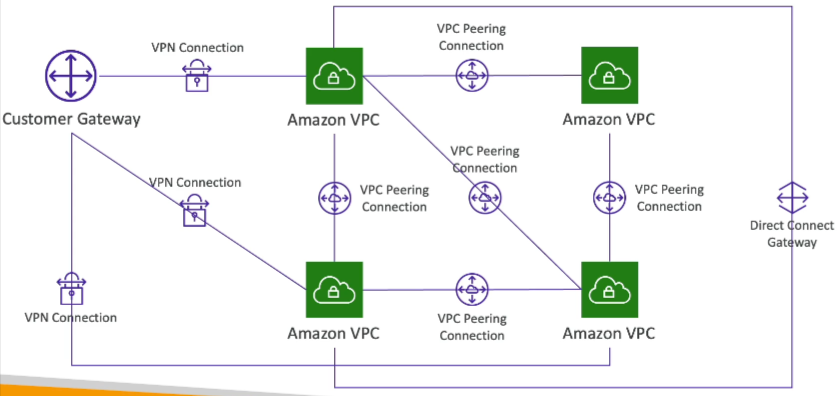

AWS network topologies can become complex, especially when dealing with multiple VPCs, VPN connections, and Direct Connect. The **Transit Gateway** 💡 was introduced to simplify this. It provides transitive peering between thousands of VPCs, on-premises data centers, site-to-site VPNs, and Direct Connect connections in a hub-and-spoke (star) configuration.

Imagine a central hub:

*   The Transit Gateway sits in the center.
*   Multiple VPCs connect to it.
*   No direct VPC peering is required; connectivity is transitive through the gateway.
*   All connected VPCs can communicate with each other.

You can also connect:

*   A Direct Connect Gateway to the Transit Gateway, providing direct access to multiple VPCs.
*   Site-to-site VPN connections through a Customer Gateway to the Transit Gateway, granting access to all connected VPCs.

This setup simplifies network management and provides a centralized point for connectivity.

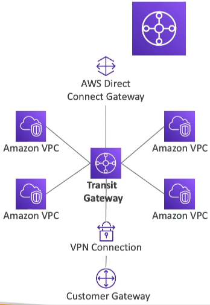

The Transit Gateway is:

*   A regional resource, can work cross-region.
*   Share cross-account using Resource Access Manager (RAM).
*   Peerable with other Transit Gateways across regions.

To control traffic flow, you can create **route tables** for the Transit Gateway. These tables define which VPCs can communicate with each other, providing network security and granular control over routing.

The Transit Gateway supports:

*   Direct Connect Gateway.
*   VPN connections.
*   IP multicast (the only AWS service that supports it). ⚠️ **Warning:** If you see IP multicast in an exam question, the answer is likely Transit Gateway.

### Increasing Bandwidth with ECMP

Another key use case for Transit Gateway is increasing the bandwidth of site-to-site VPN connections using **ECMP** (Equal-Cost Multi-Path routing).

*   ECMP is a routing strategy that forwards packets over multiple best paths.
*   It's used to create multiple site-to-site VPN connections, increasing bandwidth to AWS via VPN.

📌 **Example:**

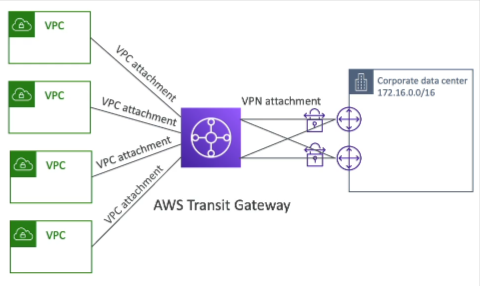


Consider a Transit Gateway with four attached VPCs and a corporate data center connected via site-to-site VPN.

When establishing a site-to-site VPN connection, there are two tunnels: one forward and one backward. When connecting a VPN directly to a VPC, both tunnels are used as part of one connection. However, with a Transit Gateway, these two tunnels can be used simultaneously.

You can create a second site-to-site VPN attachment to the Transit Gateway, resulting in four tunnels. This increases the throughput of your connection, which isn't possible when connecting directly to a VPC.

### Transit Gateway: Throughput and ECMP

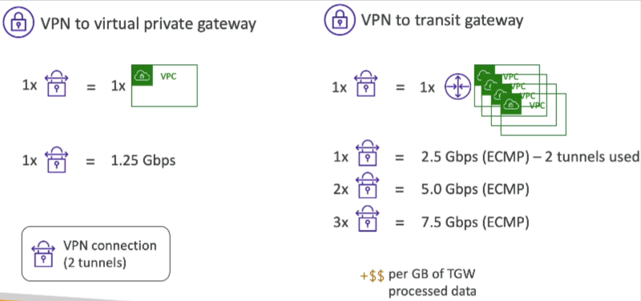

VPN to VGW vs. VPN to Transit Gateway:

*   VPN to Virtual Private Gateway (VGW): One connection to one VPC, limited to 1.5 Gbps. This connection consists of two tunnels.
*   VPN to Transit Gateway: One site-to-site VPN to many VPCs (due to transitive connectivity).  One site-to-site VPN connection provides 2.5 Gbps thanks to ECMP, utilizing both tunnels.

You can add more site-to-site VPN connections (e.g., two or three) to the Transit Gateway to double or triple your throughput via ECMP. 📝 **Note:** This is a common exam topic.

Keep in mind that using Transit Gateway incurs costs for each GB of data processed. This added cost should be considered when optimizing for performance.

### Sharing Direct Connect Connections

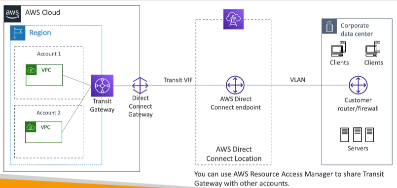

Finally, Transit Gateway enables sharing Direct Connect connections between multiple accounts.

To achieve this:

1.  Establish a Direct Connect connection between your corporate data center and a Direct Connect location.
2.  Set up a Transit Gateway in VPCs across different accounts.
3.  Connect the Direct Connect location to a Direct Connect Gateway.
4.  Connect the Direct Connect Gateway to the Transit Gateway.

This allows you to share a Direct Connect connection across multiple accounts and VPCs, which is a significant advantage of using Transit Gateway.

These architectures are common in exam questions, so ensure you understand how they work.

---

## 29. VPC Traffic Mirroring 🛡️

VPC Traffic Mirroring is a security feature that allows you to capture and inspect network traffic within your VPC in a non-intrusive way. The goal is to route traffic to security appliances that you manage for analysis.

Here's how it works:

1.  **Capture Traffic**: Define the source Elastic Network Interfaces (ENIs) from which you want to capture traffic.
2.  **Define Targets**: Specify where you want to send the captured traffic. This could be your own ENIs or a Network Load Balancer (NLB).

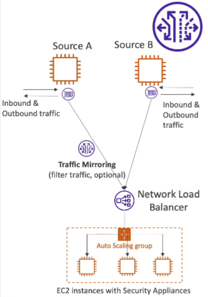

📌 **Example:**

Imagine you have an EC2 instance (Source A) with an ENI attached. This instance is accessing the internet and being accessed, resulting in inbound and outbound traffic on its ENI. You want to analyze this traffic.

To do this:

1.  Set up a Network Load Balancer (NLB).
2.  Behind the NLB, create an Auto Scaling Group of EC2 instances. These instances will run your security software.
3.  Configure VPC Traffic Mirroring to capture all traffic from Source A. Optionally, you can apply a filter to capture only specific information.

With Traffic Mirroring in place, all traffic sent to or from Source A's ENI is mirrored to your Network Load Balancer. Source A continues to function normally, unaware of the mirroring process. The NLB then distributes the mirrored traffic to your security appliances for analysis.

This setup can be extended to multiple sources. If you have a second EC2 instance with another ENI, you can also mirror its traffic to the same Network Load Balancer.

Key Requirements:

*   The source and target must be in the same VPC.
*   Traffic mirroring can also work across different VPCs if VPC Peering is enabled.

Use Cases:

*   Content inspection
*   Threat monitoring
*   Troubleshooting network issues

📝 **Note:** It's difficult to demonstrate VPC Traffic Mirroring in a live demo, but the diagram illustrates the concept effectively.

---

## 30. IPv6 in AWS

IPv4 was initially designed to provide 4.3 billion addresses. However, it's becoming exhausted, necessitating a new IP scheme: IPv6.

IPv6 is the successor to IPv4 and is designed to provide 3.4 x 10^38 unique IP addresses. That's a massive increase! **All IPv6 addresses in AWS are public and internet-routable** (no private range).

The format of an IPv6 address is `x.x.x.x.x.x.x.x` repeated 8 times, where `x` is a hexadecimal value ranging from `0000` to `ffff`.

📌 **Example:** Here are some examples of IPv6 addresses: `2001:0db8:85a3:0000:0000:8a2e:0370:7334`

You don't need to memorize the exact structure, but you should be able to recognize an IPv6 address when you see one.

Examples:

- 2001:db8:3333:4444:5555:6666:7777:8888
- 2001:db8:3333:4444:cccc:dddd:eeee:ffff
- ::  ⇒ all 8 segments are zero
- 2001:db8::  ⇒ the last 6 segments are zero
- ::1234:5678  ⇒ the first 6 segments are zero
- 2001:db8::1234:5678  ⇒ the middle 4 segments are zero

### IPv6 Support in VPC

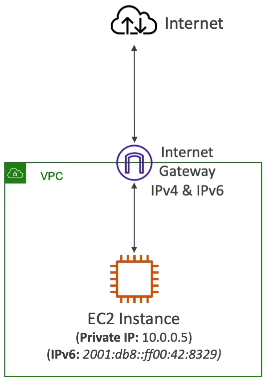

**IPv4 can never be disabled for your VPC and subnets.**

We can enable IPv6 support in our VPCs. You can enable IPv6 to operate in dual-stack mode. This means that EC2 instances launched in your VPC will get at least a private internal IPv4 address and a public IPv6 address. They can communicate using either IPv4 or IPv6 to the internet through an internet gateway.

📌 **Example:** An EC2 instance has a private IPv4 and a public IPv6. To access the internet, it uses the internet gateway, which provides connectivity for both IPv4 and IPv6. Because the EC2 instance has a public IPv6 address, it is publicly accessible.

### IPv6 Troubleshooting Exam Scenario

⚠️ **Warning:** IPv4 cannot be disabled for your VPC and subnets.

If you have an IPv6-enabled VPC and cannot launch an EC2 instance in your subnets, it's likely *not* because you've run out of IPv6 addresses. The IPv6 address space is vast.

The problem is likely that there are no available IPv4 addresses left in your subnets.

The solution is to create an IPv4 CIDR in your subnet.

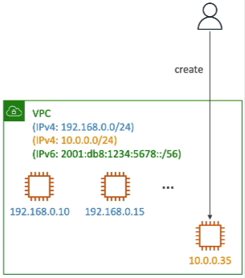

📌 **Example:**

1.  You have a VPC with IPv4 and IPv6 address spaces.
2.  You launch many EC2 instances, each getting a private IPv4 and a public IPv6.
3.  Eventually, you exhaust the IPv4 address space.
4.  If a user tries to create a new EC2 instance, they'll get an error, not because of IPv6 exhaustion, but because the IPv4 space within the subnets or VPC is depleted.
5.  To resolve this, add a new IPv4 CIDR within your VPC and subnets.
6.  You can then launch new EC2 instances, which will get IPv4 addresses from the new range.

That concludes the theory on IPv6 in AWS.

---

## 31. Practicing with IPv6

Let's walk through enabling and using IPv6 for your EC2 instances within a VPC.

First, we need to enable IPv6 for our VPC.

1.  Go to your VPC in the AWS Management Console.
2.  Right-click on your VPC (📌 **Example:** "demo VPC").
3.  Select "Edit CIDRs".
4.  Add a new IPv6 CIDR range. You have two options:
    *   Use an Amazon-provided CIDR block.
    *   Provide your own CIDR block.
5.  For simplicity, let's use one generated by AWS. Select the CIDR.
6.  The IPv6 CIDR block is now associated with your VPC.

Next, configure your subnets to use the IPv6 CIDR block.

1.  Go to your subnets.
2.  Select a subnet (📌 **Example:** "public subnet A").
3.  Choose "Actions" and then "Edit IPv6 CIDRs".
4.  Assign an IPv6 CIDR to your subnet.  A simple option is to use `00`.
5.  Click "Save".
6.  Now, edit the subnet settings to allow auto-assigning IPv6 addresses. This allows instances launched in this subnet to automatically receive an IPv6 address. You can do this for all your subnets.

Now, let's assign an IPv6 address to an EC2 instance.

1.  Go to your EC2 instances.
2.  Right-click on an instance (📌 **Example:** "BastionHost").
3.  Go to "Networking" and then "Manage IP Addresses".
4.  The interface `eth0` might not have an IPv6 address initially.
5.  Assign a new IPv6 address, which will be auto-assigned.
6.  Click "Save" and confirm.
7.  Your instance now has an IPv6 address.

To access your EC2 instance via IPv6, you need to configure your security group.

1.  Edit the security group of your instance.
2.  Edit the inbound rules.
3.  Add an SSH rule that allows traffic from anywhere IPv6 (`::/0`). This is in addition to your existing IPv4 rule.

```
Type: SSH
Protocol: TCP
Port: 22
Source: Anywhere IPv6 (::/0)
```

Now, you can SSH into your BastionHost directly using its IPv6 address, provided your own computer also has an IPv6 address.

📝 **Note:** IPv6 addresses are not yet universally common for internet providers.

To check if you have an IPv6 address:

1.  Visit a website like [Test-IPv6](http://test-ipv6.com/).
2.  The website will run tests and display your IPv6 address if you have one.

If you don't have an IPv6 address, you'll need to wait for your internet provider to upgrade to IPv6.

**Test via browser**

In most modern browsers, you can directly open the IPv6 address like this:

```
http://[2600:1f18:abcd:1234:5678:9abc:def0:1234]/
```

⚠️ **Note**: The IPv6 address **must** be enclosed in square brackets `[]` when used in a URL.

If the page loads — your IPv6 connectivity is working fine! 🎉

✅ **Test from your local terminal** 🌐 Using `curl`

```bash
curl -6 http://[2600:1f18:abcd:1234:5678:9abc:def0:1234]
```

* The `-6` flag forces IPv6.
* If you see the HTML response, IPv6 is working.

Note: The HTTPD might not be enabled for the IPV6, check that once.

**Let's examine the route tables**.

1.  Go to your public route table.
2.  Look at the routes.
3.  You'll see a rule that anything using the IPv6 CIDR is local. This means that EC2 instances with IPv6 addresses can communicate with each other using their IPv6 addresses, and the traffic will remain local within the VPC.

⚠️ **Warning:** Even with many available IPv6 addresses, you can still run out of IPv4 addresses in your subnet. Each EC2 instance requires an IPv4 address. If you exhaust your IPv4 addresses, you'll need to assign a new CIDR block to your subnet to create more instances.

---

## 32. Egress-Only Internet Gateways

Egress-only internet gateways are used exclusively for IPv6 traffic. They function similarly to NAT gateways but specifically for IPv6. 🌐

### Functionality

They allow instances within your VPC to initiate outbound connections over IPv6. 📤 However, they prevent the internet from initiating inbound IPv6 connections to your instances. 🛡️

To implement this, you need to update your route tables. 🔄

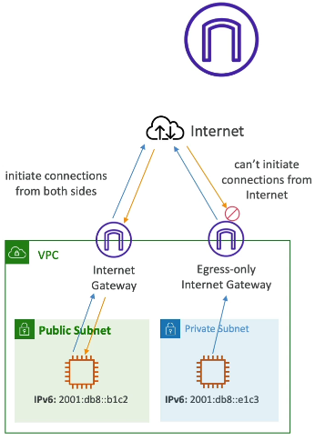

### 📌 Example Scenario

Let's illustrate with an example:

1.  **Internet Gateway (Two-Way Communication):**
    *   An EC2 instance in a public subnet can access the internet through an internet gateway.
    *   The internet can also initiate a connection to the instance via IPv6 because it's connected to the internet gateway.

2.  **Egress-Only Internet Gateway (Outbound Only):**
    *   Consider an EC2 instance in a private subnet (no internet gateway).
    *   Create an egress-only internet gateway.
    *   The EC2 instance in the private subnet can now access the internet over IPv6 through the egress-only internet gateway.
    *   Crucially, the internet cannot initiate a connection to the EC2 instance. 🚫

### IPv6 Routing Diagram

Let's consider a VPC with IPv6 enabled, containing both public and private subnets.

#### Public Subnet

*   A web server can access the internet over both IPv4 and IPv6 through an internet gateway. 🌐

*   Route table configuration:

    *   Local IPv4 and IPv6 traffic (within the CIDRs of your subnets/VPC) is routed locally.
    *   `0.0.0.0/0` (everything IPv4) and `::/0` (everything IPv6) are routed through the internet gateway.

    ```
    Destination     | Target
    ----------------|------------------
    local IPv4 CIDR | local
    local IPv6 CIDR | local
    0.0.0.0/0       | internet gateway
    ::/0            | internet gateway
    ```

    This setup enables bidirectional IPv4 and IPv6 communication in a public subnet. ↔️

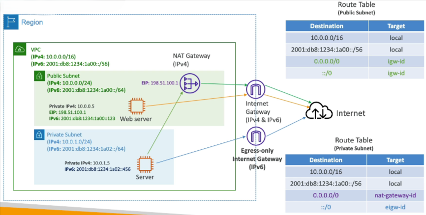

#### Private Subnet

*   A server has a private IPv4 and IPv6 address.

*   To allow the server to access the internet without being accessible from the outside:

    *   For IPv4, use a NAT gateway. The server connects to the NAT gateway, which then connects to the internet gateway to access the internet.
    *   For IPv6, use an egress-only internet gateway. The server connects to the egress-only internet gateway to access the internet over IPv6.

*   Route table configuration:

    *   Local IPv4 and IPv6 traffic is routed locally.
    *   `0.0.0.0/0` (all IPv4 IPs) is routed to the NAT gateway.
    *   `::/0` (all IPv6 IPs) is routed to the egress-only internet gateway.

    ```
    Destination     | Target
    ----------------|--------------------------------
    local IPv4 CIDR | local
    local IPv6 CIDR | local
    0.0.0.0/0       | nat-xxxxxxxxxxxxxxxxx
    ::/0            | eigw-xxxxxxxxxxxxxxxxx
    ```

### Key Differences

Understanding the route table configurations clarifies the distinctions between:

*   Internet Gateway: Allows bidirectional traffic (inbound and outbound). ↔️
*   NAT Gateway: Enables outbound IPv4 traffic from private subnets. 📤
*   Egress-Only Internet Gateway: Enables outbound IPv6 traffic from private subnets, preventing inbound connections. 📤🛡️

---

## 33. Setting Up an Egress-Only Internet Gateway

This note explains how to set up an Egress-Only Internet Gateway (EIGW) in your VPC. This allows instances in your private subnets to access the internet over IPv6 without being directly reachable from the outside.

First, navigate to the Egress Only Internet Gateways section in your VPC console.

1.  Create a new Egress Only Internet Gateway:
    *   Click on "Create Egress Only Internet Gateway".
    *   Give it a name. 📌 **Example:** `DemoEIGW`
    *   Attach it to your VPC. 📌 **Example:** `DemoVPC`
    *   Click "Create Egress Only Internet Gateway".
2.  Edit the route table for your **private** subnets. ⚠️ **Warning:** This should *not* be done for public subnets.
3.  Edit the routes:
    *   Add a new route.
    *   Set the destination to `::/0` (all IPv6 traffic).
    *   Set the target to the Egress Only Internet Gateway you created.
    *   Save the changes.

```
Destination: ::/0
Target: Egress Only Internet Gateway (DemoEIGW)
```

Now, your EC2 instances in your private subnets can access the internet over IPv6 but are not directly reachable from the internet. 💡 **Tip:** This enhances security by preventing direct inbound connections.

---

## 34. Cleaning Up AWS Resources to Avoid Unnecessary Costs 💰

It's crucial to clean up your AWS resources after you're done with them to avoid unexpected charges. Here's a checklist of what to remove:

### EC2 Instances 💻

*   Terminate or stop your EC2 instances. If you're done experimenting, **terminate** them. If you plan to use them again soon, **stop** them.

### VPC Components 🌐

To completely remove a VPC, you need to delete its components in a specific order:

1.  **Subnets** 🏘️: Delete all subnets within the VPC.
2.  **Route Tables** 🗺️: Delete any custom route tables.
3.  **Internet Gateway** 🚪: Detach the internet gateway from the VPC and then delete it.
4.  **Egress-Only Internet Gateway** 📤: Delete the egress-only internet gateway.
5.  **Elastic IPs** 📍:
    *   ⚠️ **Warning:** Elastic IPs can incur charges if they are allocated but not associated with a running instance.
    *   Release any Elastic IPs you allocated, especially those associated with your NAT gateway.
6.  **VPC Endpoints** 🔌: Delete any VPC endpoints you created. These have a per-hour fee.
7.  **NAT Gateway** 📡: Delete the NAT gateway and then release its associated Elastic IP.
8.  **Peering Connections** 🤝: Delete any VPC peering connections.
9.  **Network ACLs** 🛡️: While Network ACLs generally don't cost money, review and remove any custom ones if needed.
10. **VPC** 📦: Once all associated components are removed, you can delete the VPC itself.

### Route 53 🚦

*   Don't forget to delete any Route 53 hosted zones you created. These can cost around $0.50 per month each.

### Billing Dashboard 📊

*   💡 **Tip:** Regularly check your AWS billing dashboard to monitor your spending.

### Checking Your Bill 🧾

1.  Go to your AWS **Billing Dashboard**.
2.  Look at the current month's bill.
3.  Review the charges for services like:
    *   Elastic Compute Cloud (EC2)
    *   NAT Gateway
    *   Route 53
    *   VPC Reachability Analyzer

📌 **Example:**

You might see charges like:

*   EC2: $1.25
*   NAT Gateway: $1.25
*   Route 53: $0.70
*   VPC Reachability Analyzer: Some amount

📝 **Note:** Keeping an eye on your billing dashboard and cleaning up unused resources will help you avoid unexpected costs.

---

## 35. VPC Deep Dive: Summary and Key Concepts 🚀

This section was packed with information! If you're feeling overwhelmed, don't worry. It's a complex topic. Revisiting the content is a great idea. Let's recap the key takeaways:

### Core VPC Components 🧱

*   **CIDR:** An IP address range.
*   **VPC (Virtual Private Cloud):** A logically isolated section of the AWS Cloud where you can launch AWS resources in a virtual network that you define. Supports both IPv4 and IPv6.
*   **Subnets:** Subdivisions of a VPC, tied to a specific Availability Zone (AZ). You define CIDRs for your subnets. Can be public or private.

### Public vs. Private Subnets 🌐

How do we make a subnet public?

1.  Attach an **Internet Gateway (IGW)** to the VPC.
2.  Create a **route** in the subnet's route table that directs traffic to the IGW.

This provides IPv4 and IPv6 internet access (if IPv6 is enabled).

### Route Tables 🗺️

*   Edited to define routes to various destinations:
    *   Internet Gateway
    *   VPC Peering Connections
    *   VPC Endpoints
    *   Etc.
*   Essential for controlling network traffic flow within your VPC.

### Bastion Hosts 🛡️

*   A public EC2 instance used to SSH into other EC2 instances located in private subnets.
*   Acts as a secure jump box.

### NAT Instances (Legacy) 🕰️

*   An EC2 instance deployed in a public subnet to provide internet access to EC2 instances in private subnets.
*   ⚠️ **Warning:** Older technology, being deprecated.
*   Requires specific configuration:
    *   Disable the source/destination check flag.
    *   Configure appropriate security group rules.

### NAT Gateway 🚀

*   AWS-managed service that provides scalable internet access to private EC2 instances.
*   Much preferred over NAT instances.
*   Handles IPv4 traffic.

### Network ACLs (NACLs) 🔥

*   Network Access Control Lists.
*   Firewall rules that control inbound and outbound traffic at the subnet level.
*   Stateless: Inbound and outbound rules are evaluated independently.
*   📝 **Note:** Remember ephemeral ports!

### Security Groups 🔒

*   Firewall rules applied at the EC2 instance level.
*   Stateful: If inbound traffic is allowed, outbound traffic is automatically allowed (and vice versa).

### VPC Peering 🤝

*   Connects two VPCs together.
*   Requires non-overlapping CIDR blocks.
*   Non-transitive: Connecting three VPCs requires three peering connections.

### VPC Endpoints 🎯

*   Enable private access to AWS services (e.g., S3, DynamoDB, CloudFormation, SSM) within your VPC.
*   Two types:
    *   Gateway Endpoints: For S3 and DynamoDB.
    *   Interface Endpoints: For all other services.

### VPC Flow Logs 🪵

*   Capture metadata about network traffic within your VPC.
*   Can be created at the VPC, subnet, or ENI level.
*   Capture information about accepted and rejected traffic.
*   Analysis options:
    *   Send to Amazon S3 and analyze with Athena.
    *   Send to CloudWatch Logs and analyze with CloudWatch Log Insights.

### Connecting to Your Data Center 🏢

Two main options:

1.  **Site-to-Site VPN:**
    *   VPN connection over the public internet.
    *   Requires a Virtual Private Gateway (VGW) on AWS and a Customer Gateway (CGW) in your data center.
    *   VPN CloudHub: Allows you to create a hub-and-spoke VPN model using multiple VPN connections to the same VGW.
2.  **Direct Connect:**
    *   Private connection that bypasses the public internet.
    *   Requires physical connection to a Direct Connect location.
    *   More secure and stable than Site-to-Site VPN.

### Direct Connect Gateway 🌉

*   Enables you to connect a Direct Connect connection to multiple VPCs in different AWS regions.

### PrivateLink (VPC Endpoint Services) 🔗

*   Enables private connectivity to services within your VPC for other AWS accounts.
*   Doesn't require VPC peering, the public internet, NAT Gateways, or route tables.
*   Typically used with a Network Load Balancer (NLB) and Elastic Network Interfaces (ENIs).
*   Allows you to expose services to many customer VPCs without exposing your network.

### ClassicLink (Legacy) 🦕

*   Connects EC2-Classic instances privately to your VPC.
*   ⚠️ **Warning:** Being deprecated.

### Transit Gateway 🚏

*   Provides transitive peering between VPCs, VPN connections, and Direct Connect connections.
*   Simplifies network topology by acting as a central hub.

### Traffic Mirroring 🔎

*   Copies network traffic from ENIs to other destinations for analysis.

### IPv6 in VPC 🌎

*   You can enable IPv6 for your VPC.
*   Egress-Only Internet Gateway: Functions like a NAT Gateway, but for IPv6 traffic.

Hopefully, this summary helps! If anything is unclear, revisit the relevant sections. You've got this! 👍

---

## 36. Understanding Networking Costs in AWS per GB

This section provides a simplified overview of networking costs in AWS to help you understand key concepts. 📝 **Note:** Networking costs can be complex, but this high-level view should be helpful for exam preparation.

### Intra-Region Costs

We'll start by examining costs within a single AWS region.

*   Imagine a region with two Availability Zones (AZs).

*   **EC2 Instance in AZ 1:**
    *   Any traffic *coming into* your EC2 instance is free. 💰

*   **Second EC2 Instance in the Same AZ:**
    *   Traffic between two EC2 instances within the *same* AZ is free, assuming they communicate using their **private IPs**. 🤝
    *   This is because an AZ consists of multiple data centers geographically close to each other.
    *   By using private IPs, the traffic stays within the internal network.
        ```
        # Example: Using private IP for communication
        ping 10.0.0.10 # Assuming 10.0.0.10 is the private IP
        ```

*   **EC2 Instance in a Different AZ (Within the Same Region):**
    *   If two EC2 instances in different AZs need to communicate, there are two options:
        1.  **Public IP or Elastic IP:** Using a public or elastic IP incurs a cost of $0.02 per gigabyte. 💸 This is because the traffic has to leave and re-enter the AWS network.
        2.  **Private IP:** Using a private IP costs half as much (i.e., $0.01 per gigabyte). 💸 This is because the internal AWS network is used to link the AZs.
    *   💡 **Tip:**  **To reduce costs and improve network performance, prioritize using private IPs for communication between instances within the same region.**

### Inter-Region Costs

*   Traffic between different AWS regions costs $0.02 per gigabyte. 💸
*   This means that cross-region data transfer can become quite expensive.

### Key Takeaways for Cost Optimization

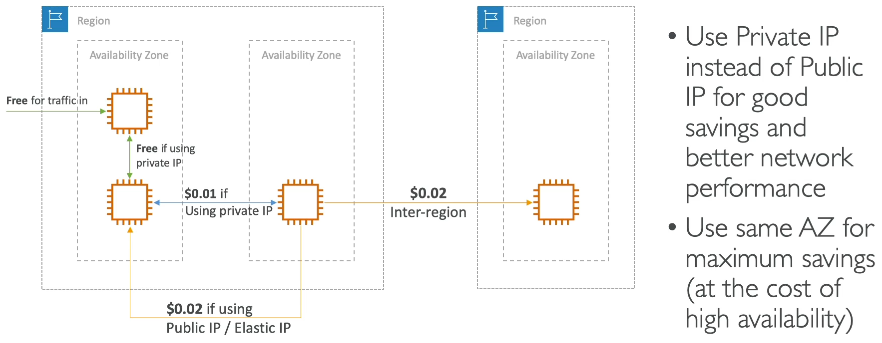

*   💡 **Tip:** Use private IPs instead of public IPs for better savings and network performance. Avoid using public IPs for communication between instances in the same region and AZ.
*   If you have a cluster requiring significant communication between EC2 instances, consider placing them in the same AZ for maximum cost savings. 💰
*   ⚠️ **Warning:**  Placing all instances in a single AZ reduces high availability. If that AZ goes down, you'll have no failover. You must balance cost savings with high availability based on your application's requirements.
*   📌 **Example:**  Consider an RDS database with a read replica for analytics. Creating the read replica in the same AZ avoids network costs for replication. Creating it in a different AZ incurs a cost of $0.01 per gigabyte of data transfer.

### Optimizing Networking Costs Through Architecture

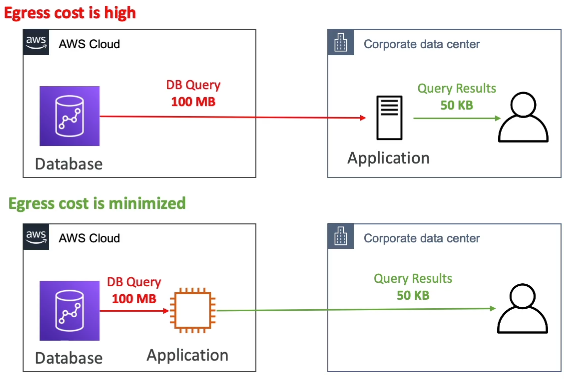

*   **Egress Traffic:** Outbound traffic (from AWS to the outside).
*   **Ingress Traffic:** Inbound traffic (from the outside to AWS), which is typically free.
*   The goal is to minimize internet traffic leaving AWS to reduce costs.

*   **Scenario 1: Application in Corporate Data Center:**
    *   An application in a corporate data center queries a database in AWS, retrieving 100 MB of data.
    *   The application processes the data and returns only 50 KB to the user.
    *   The egress traffic (100 MB) is high and costly.

*   **Scenario 2: Application Moved to AWS:**
    *   Move the application to an EC2 instance in AWS, ideally in the same AZ as the database.
    *   The database query data transfer becomes free.
    *   Only the 50 KB of query results are sent to the user, minimizing egress costs.

*   💡 **Tip:** **Keep as much internet traffic as possible within AWS to minimize costs.**

*   **Direct Connect:**
    *   If using Direct Connect, choose a location co-located in the same AWS region for lower egress network costs.

### S3 Data Transfer Pricing (USA Example)

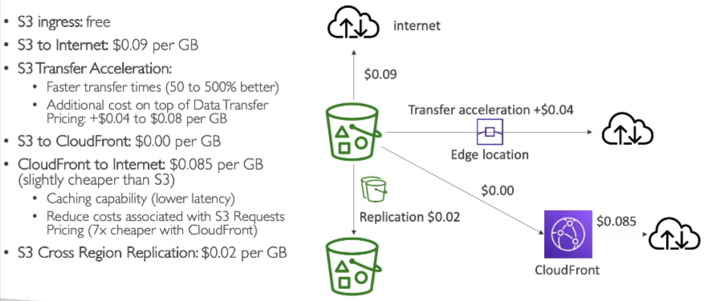

*   Data going *into* an S3 bucket (ingress) is free. 💰
*   Downloading data from S3 to your computer over the internet incurs an egress traffic cost of $0.09 per gigabyte. 💸

*   **S3 Transfer Acceleration:**
    *   Provides faster transfer times (50-500% improvement).
    *   Adds an additional cost of $0.04 to $0.08 per gigabyte on top of the data transfer pricing. 💸

*   **S3 to CloudFront:**
    *   Data transfer between S3 and CloudFront is free. 💰
    *   Data transfer from CloudFront to the internet costs $0.085 per gigabyte, slightly cheaper than S3. 💸
    *   CloudFront also provides caching capabilities, reducing latency and costs.
    *   Requests to CloudFront are significantly cheaper (seven times) than requests to S3.
    *   💡 **Tip:** Using CloudFront on top of S3 can save money if it fits your use case.

*   **Cross-Region Replication:**
    *   Costs $0.02 per gigabyte. 💸

*   📝 **Note:** These numbers can change and vary by region. The key is to understand how different services impact costs.

### NAT Gateway vs. Gateway VPC Endpoint

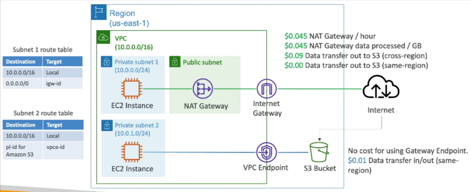

*   **Scenario:** EC2 instances in private subnets need to access data in an S3 bucket.

*   **Option 1: NAT Gateway**
    *   Requires a public subnet with a NAT Gateway and a route to an Internet Gateway.
    *   EC2 instances connect through the NAT Gateway and Internet Gateway to access S3 over the internet.
    *   Costs:
        *   $0.045 per hour for the NAT Gateway. 💸
        *   $0.045 per gigabyte of data processed through the NAT Gateway. 💸
        *   $0.09 per gigabyte for data transfer out to S3 cross-region (or $0 if in the same region). 💸

*   **Option 2: Gateway VPC Endpoint**
    *   Creates a private connection to S3 without using the internet.
    *   Requires a route to the VPC Endpoint.
    *   EC2 instances connect directly to the VPC Endpoint and then to S3.
    *   Costs:
        *   No cost for using the Gateway Endpoint itself. 💰
        *   $0.01 per gigabyte of data transferred in and out of S3 for the same region. 💸

*   💡 **Tip:** **Using a VPC Endpoint can be significantly cheaper than using a NAT Gateway for accessing S3.**
*   The exam may test you on these cost differences.

---

## 37. AWS Network Firewall

The AWS Network Firewall is a service designed to protect your entire VPC with a comprehensive firewall solution. Let's explore its capabilities and how it fits into your AWS security strategy.

Previously, we discussed several ways to protect your network on AWS:

*   Network Access Control Lists (NACLs)
*   Amazon VPC Security Groups
*   AWS WAF (protects against malicious HTTP requests)
*   AWS Shield and Shield Advanced (protects against DDoS attacks)
*   AWS Firewall Manager (manages WAF and Shield rules across multiple accounts)

But what if you need more sophisticated protection for your entire VPC? 🤔

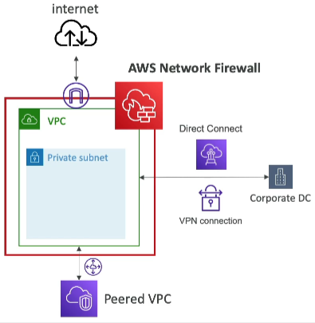

The AWS Network Firewall provides layer 3 to layer 7 protection, allowing you to inspect traffic in any direction:

*   VPC to VPC traffic
*   Outbound traffic to the internet
*   Inbound traffic from the internet
*   Traffic to and from Direct Connect and Site-to-Site VPN connections

Essentially, it protects anything coming in and out of:

*   The internet 🌐
*   A peered VPC
*   Direct Connect or a Site-to-Site VPN connection 🔒

You define rules to control network traffic. Internally, the Network Firewall leverages the AWS Gateway Load Balancer, but AWS manages the underlying appliances, simplifying the setup and maintenance.

These rules can be centrally managed across multiple accounts and VPCs using the AWS Firewall Manager service.

With the Network Firewall, you gain fine-grained control over all types of network traffic.

Here's what you can do:

*   Support thousands of rules at the VPC level 🛡️
*   Filter by IP and port (with tens of thousands of IPs) 📍
*   Filter by protocol. 📌 **Example:** Disable the SMB protocol for outbound communication.
*   Filter at the domain level. 📌 **Example:** Allow outbound traffic only to your `mycorp` domain or specific third-party software repositories.
*   Use general pattern matching with regex 🔍
*   Choose to allow, drop, or get alerted on traffic that matches your rules 🚦

The Network Firewall also offers active flow inspection, providing an intrusion prevention capability similar to the Gateway Load Balancer, but fully managed by AWS.

Rule matches can be sent to:

*   Amazon S3 🗄️
*   CloudWatch Logs 📝
*   Kinesis Data Firehose 🔥

...for analysis.

In summary, the AWS Network Firewall is a firewall that operates at the VPC level, enabling traffic filtering and flow inspection. Remember this key point! 🔑

---

## Q & A

### ❓ Question

You have attached an **Internet Gateway** to your VPC, but your EC2 instances still don't have access to the internet.
What is **NOT** a possible issue?

1. Route Tables are missing entries
2. The EC2 instances don't have public IPs
3. The Security Group does not allow traffic in
4. The NACL does not allow network traffic out

<details>

<summary>Explanation</summary>

To allow an EC2 instance to access the internet, several conditions must be met:

1. **Route Table Entries**

   * The subnet must have a route to the Internet Gateway (IGW).
   * 📌 Example: `0.0.0.0/0 → igw-xxxxxxxx`

2. **Public IP or Elastic IP**

   * The instance must have a public IPv4 address or Elastic IP associated.
   * Without it, the internet can't reach the instance.

3. **Network ACL (NACL)**

   * Must allow both **inbound and outbound traffic**.
   * If outbound rules block traffic, internet access won't work.

#### ⚠️ Why Security Group is NOT an Issue Here?

* **Security Groups are stateful**:

  * If outbound traffic is allowed, the **return inbound traffic** is automatically allowed, even if there are no inbound rules.
  * So, blocking inbound rules in SG won't stop the instance from reaching the internet.

📌 **Example:**

* Outbound rule: Allow `0.0.0.0/0` on port 80/443.
* Instance can access the web.
* Return traffic from the internet is allowed back in automatically.

✅ Correct Answer: **The Security Group does not allow traffic in**

#### ✅ Summary

* **Possible issues**: Missing route table entries, no public IP, restrictive NACL.
* **NOT an issue**: Security Group inbound rules → because SGs are stateful.

</details>

---

### ❓ Question 13

If you want a **500 Mbps Direct Connect** connection between your corporate datacenter and AWS, you would choose a **……………… connection**.

Options:

1. Dedicated 
2. Hosted

<details>

<summary>Explanation</summary>

AWS Direct Connect offers two types of connections:

1. **Dedicated Connections**

   * Available at **1 Gbps, 10 Gbps, and 100 Gbps**.
   * Provided directly by AWS.
   * Not suitable for 500 Mbps because the minimum is 1 Gbps.

2. **Hosted Connections**

   * Provided by AWS Direct Connect partners.
   * Bandwidth ranges from **50 Mbps up to 10 Gbps**.
   * Ideal for lower speeds such as **500 Mbps**.

✅ Correct Answer: **Hosted**

📌 **Example Use Case:**

* If your company wants a reliable private connection to AWS but doesn't need the full 1 Gbps, a **Hosted Direct Connect** is the correct choice.

✅ **Summary:** For **500 Mbps**, you must choose a **Hosted Direct Connect** because Dedicated only supports **1 Gbps+**.

</details>

---

### **Question:**

You need to set up a dedicated connection between your on-premises corporate datacenter and AWS Cloud. This connection must be private, consistent, and traffic must not travel through the Internet. Which AWS service should you use?

**Options:**

1. **Site-to-Site VPN**
2. **AWS PrivateLink**
3. **AWS Direct Connect**
4. **Amazon EventBridge**

<details>

<summary>Explanation</summary>

* **AWS Direct Connect** provides a **dedicated, private network connection** between your on-premises datacenter and AWS. It does not use the public Internet, which ensures **higher bandwidth, lower latency, and more consistent performance**. This is ideal for workloads requiring secure and reliable connectivity.

* **Site-to-Site VPN**: Connects on-premises to AWS over the **public Internet**. Although traffic is encrypted, it's still subject to Internet latency and fluctuations, so it does not meet the "must not travel through the Internet" requirement.

* **AWS PrivateLink**: Provides private connectivity between VPCs and AWS services **within AWS**, but it does not extend to on-premises data centers.

* **Amazon EventBridge**: A serverless event bus for application integration; not related to network connectivity.

**Correct Answer:** **AWS Direct Connect**

</details>

---

### **Question 17:**

Using a Direct Connect connection, you can access both public and private AWS resources.

#### **Options:**

1. **True**
2. **False**


<details>

<summary>Explanation</summary>

* **AWS Direct Connect** provides a **dedicated private network connection** between your on-premises environment and AWS.
* With Direct Connect, you can create two types of **virtual interfaces (VIFs):**

  1. **Private VIF** → Allows access to **private AWS resources** (e.g., EC2 instances in a VPC).
  2. **Public VIF** → Allows access to **public AWS resources** (e.g., S3, DynamoDB, or public AWS endpoints).

**Correct Answer:** **True**

✅ This flexibility means that **one Direct Connect connection can be used to access both private and public AWS resources**, depending on how you configure the VIFs.

</details>

---

### **Question:**

You want to scale up an AWS Site-to-Site VPN connection throughput, established between your on-premises data and AWS Cloud, beyond a single IPsec tunnel's maximum limit of 1.25 Gbps. What should you do?

**Options:**

1. **Use 2 Virtual Private Gateways**
2. **Use Direct Connect Gateway**
3. **Use Transit Gateway**

<details>

<summary>Explanation</summary>

* A **single AWS Site-to-Site VPN IPsec tunnel** has a maximum throughput limit of **1.25 Gbps**.
* To achieve higher throughput, you need a way to **aggregate multiple VPN tunnels** and distribute traffic across them.
* **AWS Transit Gateway (TGW)** allows you to:

  * Create **multiple VPN tunnels**.
  * Aggregate them into a **single logical connection**.
  * Achieve **greater combined throughput** than a single VPN tunnel can provide.

**Correct Answer:** **Use Transit Gateway**

#### Why not the other options?

* **Use 2 Virtual Private Gateways**: You cannot attach more than one Virtual Private Gateway (VGW) to a VPC, so this option is invalid.
* **Use Direct Connect Gateway**: This is used for **Direct Connect private connections**, not for scaling VPN throughput.

✅ Therefore, the correct solution is to **use Transit Gateway**.

</details>

---

### Question 20:

A web application backend is hosted on **EC2 instances in private subnets**, fronted by an **Application Load Balancer (ALB)** in **public subnets**.

There is a requirement to give some developers **SSH access** to the backend EC2 instances **without exposing them to the Internet**.

You have created a **bastion host EC2 instance** in the **public subnet** and configured the backend EC2 instances’ Security Group to allow traffic from the bastion host.

**Which of the following is the best configuration for the bastion host Security Group to make it secure?**

Options:

1. Allow traffic only on port 80 from the company’s public CIDR
2. Allow traffic only on port 22 from the company’s public CIDR
3. Allow traffic only on port 22 from the company’s private CIDR
4. Allow traffic only on port 80 from the company’s private CIDR

<details>

<summary>Explanation</summary>

* The **bastion host** acts as a secure entry point for SSH access to private EC2 instances.
* To ensure **security**, only **SSH (port 22)** traffic should be allowed — since SSH is used to log in remotely.
* The **source** should be restricted to the **company's public CIDR**, not the whole internet (`0.0.0.0/0`), so that **only trusted corporate IPs** can access the bastion.

This ensures:

* ✅ Only developers in the company network can SSH into the bastion host.
* ✅ The bastion is not publicly open to everyone.
* ✅ Private EC2 instances remain isolated and can only be reached through the bastion.

**Option 2 is correct because developers connect from the Internet, so their traffic comes from the company’s *public* IP.**

**Option 3 is wrong because private CIDRs belong to the VPC, not developer machines — developers never originate traffic from a private VPC IP.**

✅ Correct Answer: **Allow traffic only on port 22 from the company's public CIDR**

</details>

---


