# 28 Disaster Recovery & Migrations

Sections-
1. [Disaster Recovery for Solutions Architects](#1-disaster-recovery-for-solutions-architects)
2. [Database Migration Service (DMS)](#2-database-migration-service-dms)
3. [AWS Database Migration Service (DMS) Options 🗂️](#3-aws-database-migration-service-dms-options-)
4. [Migrating to Aurora MySQL](#4-migrating-to-aurora-mysql)
5. [On-Premise Strategy with AWS Services](#5-on-premise-strategy-with-aws-services)
6. [AWS Backup](#6-aws-backup)
7. [AWS Backup: Creating Your First Backup Plan](#7-aws-backup-creating-your-first-backup-plan)
8. [Migrating to AWS](#8-migrating-to-aws)
9. [Transferring Large Amounts of Data into AWS ☁️](#9-transferring-large-amounts-of-data-into-aws-)
10. [VMware Cloud on AWS ☁️](#10-vmware-cloud-on-aws-)

---

## 1. Disaster Recovery for Solutions Architects

Disaster recovery is crucial for solutions architects, and you can expect related questions on the exam. This note summarizes key concepts and strategies to simplify your understanding.

### What is a Disaster? ⚠️

A disaster is any event that negatively impacts a company's business continuity or finances. Disaster recovery involves preparing for and recovering from such events.

### Disaster Recovery Options

There are several disaster recovery approaches:

*   **On-Premise to On-Premise:** Traditional disaster recovery between two data centers. This is often very expensive.
*   **Hybrid Recovery:** Using the cloud as a secondary site for on-premise infrastructure.
*   **Full Cloud:** Utilizing multiple AWS regions for disaster recovery.

### Key Terminology: RPO and RTO 📝

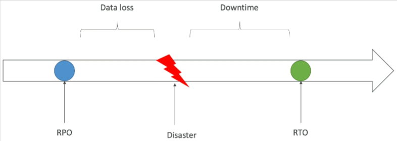

Before implementing a disaster recovery plan, it's essential to understand two key terms:

1.  **RPO (Recovery Point Objective):** ⏱️
    *   Defines the acceptable amount of data loss (in time) when a disaster occurs.
    *   Determines how frequently backups should be performed.
    *   For instance, if backups are done hourly, the RPO is one hour, meaning you could lose up to one hour of data.

2.  **RTO (Recovery Time Objective):** ⏳
    *   Defines the acceptable downtime after a disaster.
    *   Represents the time it takes to restore services to a functional state.
    *   The smaller the RPO and RTO, the higher the cost.

### Disaster Recovery Strategies 🛡️

There are four main disaster recovery strategies, each with different RTOs and costs:

1.  Backup and Restore
2.  Pilot Light
3.  Warm Standby
4.  Hot Site/Multi-Site

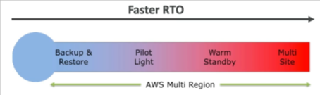

The strategies are listed from highest RTO (longest downtime) to lowest RTO (shortest downtime) and also from lowest cost to highest cost.

#### 1. Backup and Restore 💾

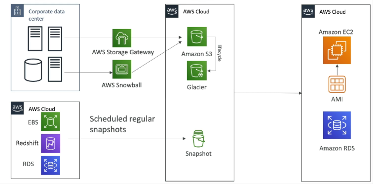

*   **Description:** Backing up data and restoring it when needed.
*   **RPO:** High (can be hours or days depending on backup frequency).
*   **RTO:** High (restoring data can take a significant amount of time).
*   **Cost:** Low (primarily storage costs for backups).
*   **Implementation:**
    *   Back up data to S3, S3 IA, or Glacier using AWS Storage Gateway or Snowball.
    *   Use lifecycle policies for cost optimization.
    *   Schedule regular snapshots of EBS volumes, Redshift, and RDS.
    *   Restore AMIs to recreate EC2 instances or restore directly from snapshots to recreate RDS databases, EBS volumes, or Redshift clusters.
*   **Benefits:** Simple and cost-effective.
*   **Drawbacks:** Long recovery times.

#### 2. Pilot Light 💡

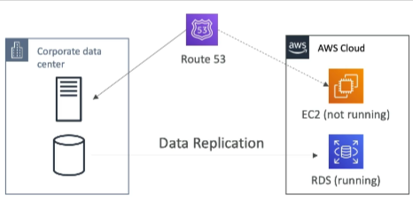

*   **Description:** A small version of the app is always running in the cloud. Used for critical core (pilot light).
*   **RPO:** Lower than Backup and Restore (depends on data replication frequency).
*   **RTO:** Lower than Backup and Restore (critical systems are already running).
* It is faster than Backup and Restore as critical systems are already up.
*   **Cost:** Moderate (cost of running the minimal system).
*   **Implementation:**
    *   Continuously replicate critical data from your on-premise database to RDS.
    * RDS is always running in the cloud.
    *   Have a Route 53 configuration ready to fail over.
    *   In case of a disaster, fail over using Route 53 and recreate EC2 instances in the cloud.
*   **Benefits:** Faster recovery than Backup and Restore.
*   **Drawbacks:** Requires continuous data replication and some always-on resources.

#### 3. Warm Standby 🔥

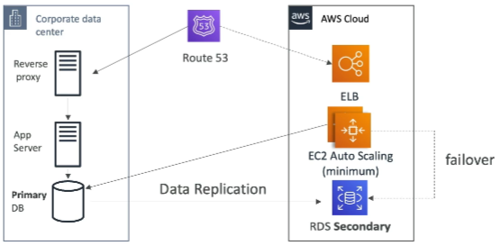

*   **Description:** Running a scaled-down version (minimum size) of the full system in the cloud. Upon Disaster Recovery, scale the application using Auto Scaling to production load.
*   **RPO:** Lower than Pilot Light (data replication is continuous).
*   **RTO:** Lower than Pilot Light (full system is running at minimum capacity).
*   **Cost:** Higher than Pilot Light (requires more always-on resources).
*   **Implementation:**
    *   Replicate data to a secondary RDS database.
    *   Maintain an EC2 Auto Scaling group at minimum capacity (which is currently talking to the corporate data-center for data).
    *   Use an Elastic Load Balancer (ELB) ready to go.
    *   In case of a disaster:- 
        *   Use Route 53 to redirect traffic to the ELB in the cloud.
        *   The ELB will then distribute traffic to the EC2 instances in the Auto Scaling group.
        *   The Auto Scaling group will then scale the application to match the production load.
        *   Additionally, update the application to get data from the cloud-based RDS database instead of the on-premises data center.
*   **Benefits:** Faster recovery than Pilot Light.
*   **Drawbacks:** More expensive due to always-on resources.

#### 4. Hot Site/Multi-Site 🚀

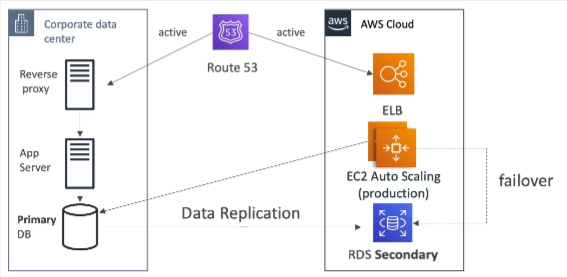

*   **Description:** Running two full production environments, one on-premise and one in the cloud.
*   **RPO:** Very Low (near zero data loss).
*   **RTO:** Very Low (minutes or seconds).
*   **Cost:** Very High (requires maintaining two full production environments).
*   **Implementation:**
    *   Maintain a full production environment on-premise and in AWS.
    *   Replicate data between the two environments.
    *   Use Route 53 to route requests to both environments in an active-active setup.
    *   In case of a disaster, failover is seamless.
*   **Benefits:** Fastest recovery times.
*   **Drawbacks:** Most expensive option.

For a full cloud approach, you can use a multi-region setup with services like Aurora Global Databases for seamless replication and failover.

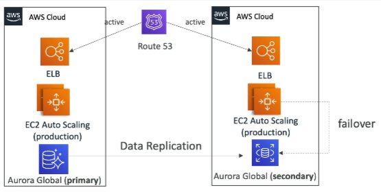

### Disaster Recovery Tips 💡

*   **Backups:**
    *   Use EBS Snapshots, RDS automated snapshots and backups.
    *   Push snapshots to S3, S3 IA, or Glacier.
    *   Implement lifecycle policies.
    *   Use Cross-Region Replication for backup redundancy.
    *   Use Snowball or Storage Gateway for on-premise to cloud data transfer.
*   **High Availability:**
    *   Use Route 53 to migrate DNS between regions.
    *   Utilize RDS Multi-AZ, ElastiCache Multi-AZ, EFS, and S3 for built-in high availability.
    *   Use Site-to-Site VPN as a backup for Direct Connect.
*   **Replication:**
    *   Use RDS Replication (Cross-Region), Aurora Global Databases.
    *   Consider database replication software for on-premise to RDS replication.
    *   Use Storage Gateway for replication.
*   **Automation:**
    *   Use CloudFormation and Elastic Beanstalk to recreate environments quickly.
    *   Use CloudWatch to recover or reboot EC2 instances.
    *   Use AWS Lambda to customize automation.

### Chaos Testing 🐒

To ensure your disaster recovery plan works, simulate disasters. 📌 **Example:** Netflix's "Simian Army" randomly terminates EC2 instances in production to test the resilience of their infrastructure.

By automating your disaster recovery and regularly testing it, you can ensure your infrastructure is prepared for any event.

---

## 2. Database Migration Service (DMS)

Let's explore how to migrate a database from on-premise systems to the AWS Cloud using DMS (Database Migration Service).

DMS is a quick and secure database service that allows you to migrate your database from on-premise to AWS. 🚀

Key features of DMS:

*   Resilient and self-healing. 💪
*   Source database remains available during migration. ⏳
*   Supports 🔄: 
    *   Homogeneous (e.g., Oracle to Oracle, Postgres to Postgres).
    *   Heterogeneous migrations (e.g., Microsoft SQL Server to Aurora).
*   Supports continuous data replication using CDC (Change Data Capture). ⏱️

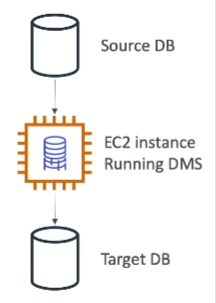

To use DMS, you need to create an EC2 instance. This EC2 instance performs the replication tasks. The DMS software on the EC2 instance pulls data from the source database and puts it into the target database continuously.

### Sources and Targets

It's helpful to understand the types of databases that can be used as sources and targets with DMS.

**Sources:**

*   On-premises databases or EC2 instance-based databases:
    *   Oracle
    *   Microsoft SQL Server
    *   MySQL
    *   MariaDB
    *   PostgreSQL
    *   MongoDB
    *   SAP
    *   DB2
*   Azure databases (e.g., Azure SQL Database)
*   Amazon RDS (including Aurora)
*   Amazon S3
*   DocumentDB

**Targets:**

*   On-premises and EC2 instances databases:
    *   Oracle
    *   Microsoft SQL Server
    *   MySQL
    *   MariaDB
    *   PostgreSQL
    *   SAP
*   Amazon RDS
*   Redshift
*   DynamoDB
*   Amazon S3
*   OpenSearch Service
*   Kinesis Data Streams
*   Apache Kafka
*   DocumentDB
*   Amazon Neptune
*   Redis
*   Babelfish

The general idea is that DMS can help you migrate a database (e.g., an on-premise database) to almost any database that AWS offers.

AWS Database Migration Service (AWS DMS) works for **both**:

* **On-premises ➝ AWS** ✅
* **AWS ➝ AWS** ✅
* **AWS ➝ On-premises** (less common, but also possible) ✅

### How DMS Works?

**How it works**:

* You define a **source endpoint** (on-prem DB, RDS, S3, DynamoDB, Aurora, etc.)
* You define a **target endpoint** (another AWS DB, on-prem DB, or S3, etc.)
* DMS then replicates the data either **one-time** (migration) or **ongoing** (CDC – Change Data Capture).

**📌 Examples of AWS ➝ AWS migrations:**

* Migrating from **Amazon RDS for MySQL ➝ Amazon Aurora MySQL**
* Migrating from **RDS PostgreSQL ➝ RDS PostgreSQL (different region/account)**
* Migrating from **Amazon DynamoDB ➝ Amazon S3 (for analytics)**
* Migrating between **different AWS regions** (cross-region migration/replication).

💡 Tip: For **homogeneous migrations** (e.g., MySQL ➝ MySQL), AWS often recommends **native engine tools** (like `mysqldump`, `pg_dump`, or `Data Pump` for Oracle) if downtime is acceptable. But if you need **near-zero downtime**, DMS is the right choice.

⚠️ Important: DMS mainly handles **data migration**, not **schema migration**. For schema changes (tables, indexes, constraints, stored procs, etc.), you use the **AWS Schema Conversion Tool (SCT)**.

**🔹 What DMS actually does with schema?**

* **By default**, AWS DMS **does not** migrate the full schema (tables, indexes, views, stored procedures, triggers, users, etc.).
* DMS is focused on **data migration + ongoing replication (CDC)**.
* That’s why AWS recommends **AWS Schema Conversion Tool (SCT)** (for heterogeneous migrations) or **native engine tools** (for homogeneous migrations) to create the schema first.

**🔹 But then how does DMS insert data?**

When you create a **DMS replication task**, you can choose task settings:

1. **Do nothing** → Assume the schema already exists in the target.

   * DMS just inserts/updates/deletes rows.
   * If the table isn’t there, the task fails.

2. **Create tables (basic schema)** → DMS can auto-create tables for you.

   * It only creates **table structures (columns, datatypes)**.
   * It does **not** create:

     * Primary keys (sometimes yes, depending on engine support)
     * Foreign keys
     * Indexes
     * Constraints
     * Stored procedures / triggers / views

   👉 Basically, DMS makes “bare-bones” tables so it has somewhere to put the data.

3. **Drop and recreate** → DMS can drop existing tables and recreate minimal schema. Useful if you want a clean load.

Hence:-
* **Homogeneous migration:** Schema should usually be created using native DB tools (`mysqldump --no-data`, `pg_dump -s`, Oracle Data Pump, etc.).
* **Heterogeneous migration:** Use **AWS SCT**.
* **DMS only job:** Move the **data** (full load + optional CDC).

👉 So, even in **homogeneous migrations**, if you rely only on DMS, you’ll end up with “schema-lite” (just columns), not a fully functional schema.

### AWS Schema Conversion Tool (SCT)

What if the source and target databases have different engines? 🤔

You need to use AWS SCT (Schema Conversion Tool). SCT converts the database schema from one engine to another.

📌 **Example:** Migrating from SQL Server or Oracle to MySQL, PostgreSQL, or Aurora (OLTP). Or transforming from Teradata or Oracle to Amazon Redshift (analytics).

- OLTP: (SQL Server or Oracle) ➝ (MySQL, PostgreSQL, Aurora)
- OLAP: (Teradata or Oracle) ➝ Amazon Redshift

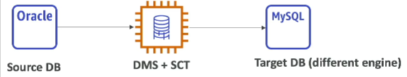

In this scenario, DMS runs alongside SCT.

📝 **Note:** You **do not** need to use SCT if you are migrating the same database engine.

📌 **Example:** On-premise PostgreSQL to RDS PostgreSQL (same engine: PostgreSQL) - No SCT needed.
📌 **Example:** Oracle to Postgres - SCT is needed.

### Setting up Continuous Replication for DMS

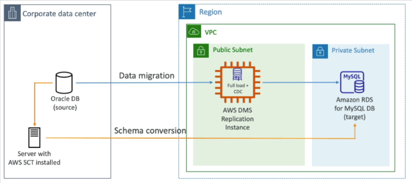

Here's how to set up continuous replication for DMS:

1.  Assume you have an Oracle database as a source in your corporate data center and an Amazon RDS database for MySQL as a target. 🏢
2.  Since the database types are different, you **must** use SCT. ⚠️
3.  Set up a server with AWS SCT installed (ideally on-premises). ⚙️
4.  Perform the schema conversion to your Amazon RDS database running MySQL. 🔄
5.  Set up a DMS replication instance. This instance will perform the full load and Change Data Capture (CDC) for continuous replication. ⏱️
6.  DMS will read the source Oracle database on-premises and insert the data into your private subnets. ➡️

### Multi-AZ Deployment for DMS

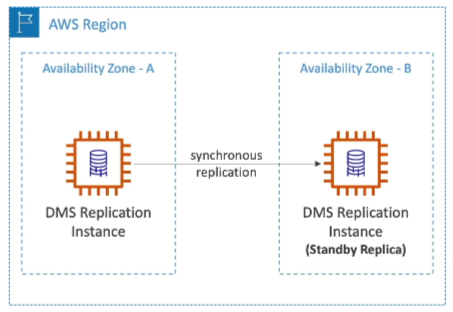

DMS offers a Multi-AZ deployment option.

*   You have a DMS replication instance in one AZ. 📍
*   Synchronous replication of that instance to another AZ (standby replica). 👯

Benefits:

*   Resilience to failures in a specific AZ. 💪
*   Data redundancy. 💾
*   Eliminates IO freezes. 🧊
*   Minimizes latency spikes. ⚡

---

## 3. AWS Database Migration Service (DMS) Options 🗂️

Let's explore the different options offered by AWS Database Migration Service (DMS) to help you choose the right migration strategy.

### Discover and Assess 🔎

*   Use AWS DMS Fleet Advisor to analyze your on-premises database inventory.
*   Fleet Advisor helps identify the optimal migration path.
*   ⏱️ Provides results in hours, saving significant planning time.
*   Avoids the need for third-party tools or migration experts.

### Convert 🔄

*   Utilize the DMS Schema Conversion Tool to convert database schemas between different database technologies.
*   This is useful for understanding the types of transformations possible.

### Migration Options 🚚

There are different types of migrations available:

1.  **Homogenous Data Migration:**
    *   Migrating from one database to the same database technology (e.g., Oracle to Oracle).
    *   Leverages native database tools for faster migration.
2.  **Heterogeneous Data Migration:**
    *   Migrating between different database types (e.g., Oracle to Aurora, Oracle to PostgreSQL).
    *   Options include:
        *   Serverless replication
        *   Instance-based migration

### Instance-Based vs. Serverless Migration ☁️

*   **Instance-Based Migration:**
    *   Uses an EC2 instance managed by DMS to perform the migration.
*   **Serverless Migration:**
    *   No resource management required.
    *   ⚠️ **Warning:** Doesn't support all database engines.
    *   💡 **Tip:** Try serverless first for ease of use. If your database engine is not supported, then use instance-based migration.

### Creating a Replication Instance ⚙️

Here's a breakdown of the options when creating a replication instance:

1.  **Name and Description:** Provide a descriptive name for your instance.
2.  **Instance Configuration:**
    *   Size the instance based on the amount of data being transferred.
    *   Options range from `t3.micro` to larger instances.
    *   Choose a DMS version.
    *   📝 **Note:** Review the DMS release notes for updates related to different engine versions.
3.  **High Availability:**
    *   Multi-AZ for production workloads to ensure resilience.
    *   Single-AZ may be sufficient for dev/test environments.
4.  **Storage:** Specify the amount of storage needed on the EC2 instance.
5.  **Connectivity and Security:**
    *   Configure VPC, subnet group, and public accessibility.
6.  **Advanced Settings:** Customize further settings as needed.
7.  **Maintenance:** Configure maintenance settings for the instance's operating system.

### Endpoints 📍

*   Endpoints define the location of your source and target databases.
*   You can create source and target endpoints.
*   For RDS databases, there's an easy selector option.
*   For other databases, you'll need to configure:
    *   Endpoint identifier
    *   Source engine type
    *   Target engine type
    *   Endpoint settings (using a wizard or JSON editor)
    *   📝 **Note:** Endpoint settings are specific to your database.
*   Test your connection from a specific replication instance.

### Database Migration Tasks 🚀

1.  Create a new task.
2.  Specify the replication instance, source endpoint, and target endpoint.
3.  Choose a migration type:
    *   Migrate existing data.
    *   Migrate existing data and replicate ongoing changes (continuous data replication).
    *   Replicate data changes only.
4.  Configure task settings using the wizard or JSON editor.
    *   📝 **Note:** The JSON editor provides access to a wide range of configurable settings.
5.  Perform an assessment and configure settings.
6.  Create the task.

### Summary ✅

1.  Create a replication instance.
2.  Define endpoints.
3.  Create a database migration task.

### DMS Evolution 📈

*   DMS is evolving towards serverless replication, enabling direct database-to-database replication without managing replication instances.
*   Enhanced features include schema conversion, Fleet Advisor recommendations, and homogenous data migrations leveraging native database tooling.

---

## 4. RDS to Aurora Migrations 🌳

This note outlines the different methods for migrating your existing databases to Aurora MySQL and PostgreSQL. This is important for the exam, so pay close attention! 📝

### Migrating to Aurora MySQL

Here are the options for migrating to Aurora MySQL:

#### RDS MySQL to Aurora MySQL

1.  **Database Snapshot** 📸
    *   Take a database snapshot from your existing RDS MySQL database.
    *   Restore this snapshot as a new Aurora MySQL database.
    *   ⚠️ **Warning:** This option may involve some downtime, as you might need to stop operations on the original MySQL database before migrating.

2.  **Aurora Read Replica** 🔄
    *   Create an Amazon Aurora Read Replica on top of your RDS MySQL database.
    *   Wait for the replica lag to reach zero, indicating that the Aurora Replica has fully synchronized with the MySQL database.
    *   Promote the Aurora Read Replica into its own database cluster.
    *   📝 **Note:** This process might take longer than using a database snapshot and could incur network costs due to replication.

#### External MySQL to Aurora MySQL

1.  **Percona XtraBackup** 📦
    *   If your MySQL database is external to RDS, you can use the Percona XtraBackup utility to create a backup.
    *   Upload the backup file to Amazon S3.
    *   Import the backup file directly into a new Aurora MySQL DB cluster using the Aurora import functionality.
    *   📝 **Note:** This method only supports backups created with the Percona XtraBackup utility.

2.  **MySQL Dump Utility** ⚙️
    *   Create an Aurora MySQL DB cluster.
    *   Use the `mysqldump` utility against your MySQL database.
    *   Pipe the output directly into your existing Amazon Aurora database.
    *   ⚠️ **Warning:** This method can be time-consuming and doesn't leverage Amazon S3.
    *   📌 **Example:**
        ```bash
        mysqldump -u [user] -p[password] [database] | mysql -u [user] -p[password] -h [aurora_endpoint] [database]
        ```
#### Both Databases Running

1. **Amazon DMS (Database Migration Service)** 🚚
    *   If both databases are up and running, use Amazon DMS to perform continuous replication between the two databases.

### Migrating to Aurora PostgreSQL

The migration process for PostgreSQL is similar to MySQL.

#### RDS PostgreSQL to Aurora PostgreSQL

1.  **Database Snapshot** 📸
    *   Take a database snapshot from your RDS PostgreSQL database.
    *   Restore the snapshot as an Amazon Aurora PostgreSQL database.

2.  **Aurora Read Replica** 🔄
    *   Create an Amazon Aurora Read Replica of your PostgreSQL database.
    *   Wait for the replication lag to reach zero.
    *   Promote the Read Replica into its own database cluster.

#### External PostgreSQL to Aurora PostgreSQL

1.  **Backup and AWS S3 Aurora Extension** 📦
    *   If your PostgreSQL database is external to RDS, create a backup.
    *   Upload the backup to Amazon S3.
    *   Import the data using the `aws_s3` Aurora extension.
    *   This will create a new Aurora PostgreSQL database from the backup.

#### Both Databases Running

1.  **Amazon DMS (Database Migration Service)** 🚚
    *   Use Amazon DMS to migrate from PostgreSQL to Amazon Aurora continuously.


---

## 5. On-Premise Strategy with AWS Services

This lecture provides a high-level overview of AWS services that facilitate on-premise to cloud migration strategies. It's important to be familiar with these services for the exam.

### Amazon Linux 2 AMI

You can download the Amazon Linux 2 AMI as a virtual machine in ISO format. ⬇️

*   This allows you to run Amazon Linux 2 on your on-premise infrastructure.
*   You can load the ISO image into common VM software such as:
    *   VMWare
    *   KVM
    *   Virtual Box (Oracle VM)
    *   Microsoft Hyper-V
*   You can configure it with user data.

### VM Import/Export 📦

This feature allows you to migrate existing VMs and applications into EC2.

*   It also enables creating a disaster recovery repository strategy by backing up on-premise VMs to the cloud.
*   You can export VMs from EC2 back to your on-premise environment.

### AWS Application Discovery Service 🔍

This service helps you gather information about your on-premise servers to plan a migration.

*   It provides server utilization information and dependency mappings.
*   This is helpful for large-scale migrations from on-premise to the cloud.
* AWS Migration Hub 🧳: You can track your migration progress using the AWS Migration Hub.

### AWS Database Migration Service (DMS) 🗄️

DMS allows you to replicate databases between on-premise and AWS, AWS to AWS, or AWS to on-premise.

*   It supports various database technologies, including Oracle, MySQL, and DynamoDB.
*   📌 **Example:** You can migrate data from MySQL to DynamoDB.
*   This is useful for moving workloads to AWS gradually. You can replicate your on-premise database to AWS and then fully transition when ready.

### AWS Application Migration Service (MGN) 🖥️

MGN is used for incremental replication of on-premise live servers to AWS.

*   It replicates volumes directly into AWS.
*   This is suited for ongoing replication (e.g., incremental replication).

### Summary 📝

AWS offers several services to help with on-premise migration:

*   VM Import/Export
*   AWS Application Discovery Service
*   AWS Migration Hub
*   AWS Database Migration Service (DMS)
*   AWS Application Migration Service (MGN)

It's important to remember these services at a high level. If you see them in a question, you'll know they relate to on-premise migration. 💡 **Tip:** Familiarize yourself with the names and basic functionalities of these services.

---

## 6. AWS Backup

AWS Backup is a fully managed service that allows you to centrally manage and automate backups across your AWS services. 🚀 The goal is to provide a central view of your backup strategy without the need for custom scripts or manual processes.

Here's a breakdown of its key features:

*   Centralized Management: Manage and automate backups from a single place. 🗂️
*   Wide Service Support: Supports a growing list of AWS services. ➕
*   No Custom Scripts: Eliminates the need for manual processes. 🛠️

### Supported Services

AWS Backup supports a wide range of AWS services, including:

*   Amazon EC2
*   EBS
*   Amazon S3
*   RDS (all database engines)
*   Aurora
*   DynamoDB
*   DocumentDB
*   Amazon Neptune
*   EFS
*   FSx (Lustre and Windows File Server)
*   AWS Storage Gateway (Volume Gateway)

📝 **Note:** The list of supported services is constantly expanding.

### Key Features

AWS Backup offers several important features:

*   Cross-Region Backups: Replicate backups to another region for disaster recovery. 🌍
*   Cross-Account Backups: Supports backups across multiple AWS accounts. 👥
*   Point-in-Time Recovery: Recover supported services like Aurora to a specific point in time. ⏱️
*   On-Demand and Scheduled Backups: Create backups as needed or on a schedule. 🗓️
*   Tag-Based Backup Policies: Backup only resources tagged with specific values (e.g., "production"). 🏷️

### Backup Plans

You can create backup policies known as **Backup Plans**. These plans allow you to define:

*   Frequency: How often backups are performed (e.g., every 12 hours, weekly, monthly, or using a cron expression). ⏰
*   Backup Window: The time frame during which backups can occur. ⏳
*   Transition to Cold Storage: Move backups to cold storage after a specified period (never, days, weeks, months, or years). ❄️
*   Retention Period: How long backups are retained (always, days, weeks, months, or years). 🗑️

### How it Works

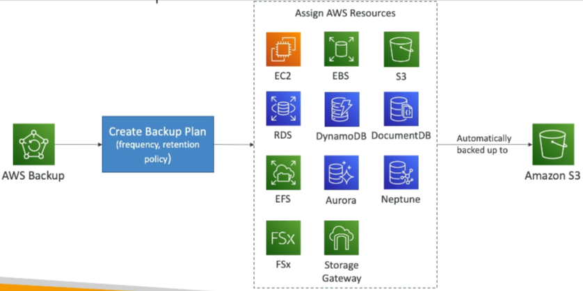

1.  Create a Backup Plan. 📝
2.  Assign specific AWS resources to the plan. ➕
3.  AWS Backup automatically backs up your data to Amazon S3 in an internal bucket specific to the service. 📦

### Vault Lock

Another crucial feature is **Vault Lock**, which enforces a **WORM** (Write Once Read Many) policy. 🔒

*   Backups stored in a Backup Vault with Vault Lock cannot be deleted. 🚫
*   Provides an additional layer of defense against accidental or malicious deletion or modification of retention periods.🛡️
*   Even the root user cannot delete backups when Vault Lock is enabled. 👑

⚠️ **Warning:** Vault Lock provides strong guarantees on the safety of your backups.

```text
# Example: Vault Lock ensures backups are immutable
# and protected from unauthorized deletion.
```

---

## 7. AWS Backup: Creating Your First Backup Plan

Let's walk through creating your first backup plan using AWS Backup.

1.  Navigate to the AWS Backup service. Type "AWS Backup" in the search bar and open the service.

2.  Create a Backup Plan: Click on "Create Backup plan".

    *   You have three options:
        *   Start with a template.
        *   Build a new plan.
        *   Define a plan using JSON.

3.  Choose a Template: Select "Start with a template". This is the simplest option.

    *   📌 **Example:** Choose "Daily-Monthly-1yr-Retention".
    *   Name your plan.
        *   📌 **Example:** "TestPlan".

4.  Configure Backup Rules: Click on "Backup rules". You can have multiple rules within a plan.

    *   Examine the existing rules. The template includes "daily" and "monthly" backups.
    *   **Daily Backup Rule:**
        *   Rule Name: (Pre-defined)
        *   Backup Vault: This is where the backups will be stored. You can use the default AWS vault or create a new one.
        *   Backup Frequency: When the backup will occur.
            *   📌 **Example:** 5:00 AM UTC, starting within eight hours. You can customize this.
        *   Transition to Cold Storage: Choose when (or if) to transition backups to cold storage.
            *   📌 **Example:** Never, after days, weeks, months, or years.
        *   Retention Period: How long to retain the backup.
            *   📌 **Example:** Five weeks.
        *   Copy to Destination: You can copy backups to another region for disaster recovery.
    *   **Monthly Backup Rule:**
        *   Similar settings to the daily rule.
        *   📌 **Example:** Backups occur monthly on the first day of each month.
        *   📌 **Example:** Transition to cold storage after one month and retain for one year.

5.  Create the Plan: Once the rules are configured, scroll down and click "Create plan".

6.  Assign Resources: Now that the plan is created, you need to assign resources to it. Click on "Assign resources".

    *   Name the assignment.
        *   📌 **Example:** "TestAssignments".
    *   IAM Role:
        *   Choose the default role. This will create a role with the necessary permissions. You can also select a custom role.
    *   Resource Selection: You have two options:
        *   Include all resource types.
        *   Include specific resource types.
            *   📌 **Example:** DynamoDB tables. You can select specific tables or all tables.
    *   Tag-Based Selection: If you choose "all resource types", you'll typically use tags to filter which resources are backed up.
        *   📌 **Example:** Only backup resources with the tag `environment: production`.

7.  Assign Resources: Click "Assign resources" to complete the assignment.

    *   To illustrate, if you create an EC2 EBS volume with the tag `environment: production`, it will be automatically backed up by this plan.

    ```text
    Key: environment
    Value: production
    ```

8.  Verify Assignments: The assignments are now active. You can have multiple assignments within a plan.

9.  Automatic Backups: The backup plan will run automatically according to the schedule you defined.

10. Monitor Backups: You can monitor the backups in the "Backup vaults" section.

    *   "Jobs" shows scheduled and running backup, restore, and copy jobs.

11. Settings: Explore the settings for backup policies, cross-account monitoring, and cross-account backups.

### Cleaning Up Resources 🧹

⚠️ **Warning:** Remember to clean up your resources to avoid unnecessary charges.

1.  Delete the EBS Volume: If you created an EBS volume for testing, delete it. Alternatively, wait a day to confirm the backup worked.
2.  Delete the Assignment: Select the assignment and delete it. You'll need to type the assignment name to confirm.
3.  Delete the Backup Plan: Delete the backup plan. You'll need to enter the name of the backup plan to confirm deletion.

---

## 8. Migrating to AWS - AWS Application Discovery Service

When moving to the cloud, there are two primary scenarios:

1.  Starting fresh and leveraging the cloud directly. In this case, no migration is needed.
2.  Migrating from on-premises servers and data centers. This requires careful planning.

To plan your migration effectively, consider using the AWS Application Discovery Service.

*   This service scans your servers and gathers crucial information:
    *   Server utilization data.
    *   Dependency mapping. 🗺️

This information helps you understand:

*   How to migrate your resources.
*   The optimal migration order.

There are two discovery methods:

1.  **Agentless Discovery (using a Connector - AWS Agentless Discovery Connector):**
    *   Provides information about virtual machines.
    *   Includes configuration details.
    *   Captures performance history (CPU, memory, disk usage).
2.  **Agent-based Discovery (AWS Application Discovery Agent):**
    *   Offers more detailed and frequent updates from within your virtual machines.
    *   Collects system configuration.
    *   Monitors performance metrics.
    *   Tracks running processes.
    *   Details all network connections between systems (essential for dependency mapping).

All collected data can be viewed in the AWS Migration Hub. The Application Discovery Service helps you map out what needs to be moved and how components are interconnected.

### AWS Application Migration Service (MGN)

Once you've mapped your migration, you need to execute the move. The simplest way to migrate from on-premises to AWS is using the AWS Application Migration Service (MGN).

*   📝 **Note:** MGN was formerly known as CloudEndure Migration.

With MGN, you can perform rehosting, also known as a "lift-and-shift" migration. This involves converting your physical, virtual, or other cloud-based resources to run natively on AWS.

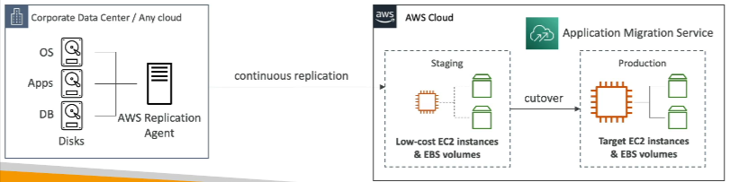

Here's how it works:

1.  Assume you have a corporate data center with operating systems, applications, and databases running on disks.
2.  You run the AWS Application Migration Service.
3.  Install a replication agent in your data center.
4.  The agent continuously replicates your disks to low-cost EC2 instances and EBS volumes.
5.  When ready, perform a cutover to production.
6.  Migrate from staging to production, using EC2 instances and EBS volumes sized to meet your performance requirements.

The core idea is to replicate data continuously and then perform a cutover at a chosen point in time. This is a straightforward migration approach.

MGN supports a wide range of platforms, operating systems, and databases. It offers:

*   Minimal downtime. ⏱️
*   Reduced costs. 💰
*   Automation, reducing the need for specialized engineers. ⚙️

---

## 9. Transferring Large Amounts of Data into AWS ☁️

This note summarizes different methods for transferring large datasets into AWS, highlighting their pros, cons, and suitability based on constraints.

Let's consider transferring 200 TB of data to AWS with a 100 Mbps internet connection as an 📌 **Example**.

### Option 1: Public Internet or Site-to-Site VPN 🌐

*   Leverages your existing internet connection.
*   Advantage: Immediate setup.
*   Disadvantage: Can be very slow for large datasets.

Calculation:

```
200 TB * 1024 GB/TB * 1024 MB/GB * 8 Mb/MB / 100 Mbps = ~16 million seconds ≈ 185 days
```

*   This method could take almost half a year! ⏳
*   Suitable for smaller datasets or ongoing replications where the initial transfer isn't time-critical.
*   ⚠️ **Warning:** Not ideal for large, one-time transfers with tight deadlines.

### Option 2: AWS Direct Connect 🔗

*   Establishes a dedicated network connection from your on-premises environment to AWS.
*   📌 **Example:** Provisioning a 1 Gbps Direct Connect line.
*   Disadvantage: Longer setup time (approximately one month).
*   Advantage: Faster transfer speeds compared to the public internet.

Calculation (using the previous 📌 **Example**):

*   Approximately 10 times faster than a 100 Mbps connection.
*   Estimated transfer time: ~18.5 days.
*   Suitable for ongoing replications and large datasets where faster transfer speeds are required, but initial setup time is acceptable.

### Option 3: AWS Snowball ❄️

*   Physical data transfer solution using ruggedized appliances.
*   Advantage: Significantly faster for large, one-time transfers.
*   📌 **Example:** Transferring a database using Snowball combined with DMS for ongoing replication.
*   Estimated end-to-end transfer time: Approximately one week (including ordering, delivery, loading, and data transfer to AWS).
*   Ideal for initial data migration or transferring large datasets when network bandwidth is limited.
*   📝 **Note:** Snowball is best for one-off transfers.

### Ongoing Replications 🔄

For continuous or periodic data synchronization, consider the following:

*   Site-to-Site VPN: Suitable for smaller, incremental updates.
*   Direct Connect: Provides faster and more reliable connectivity for larger, ongoing replications.
*   AWS Database Migration Service (DMS): Migrates databases to AWS quickly and securely.
*   AWS DataSync: Automates and accelerates data transfers between on-premises storage and AWS.

### Key Takeaways 🔑

*   The best method depends on the size of the data, available bandwidth, time constraints, and whether it's a one-time transfer or ongoing replication.
*   Snowball is highly effective for speeding up the initial data transfer to AWS.
*   💡 **Tip:** Consider the trade-offs between setup time, transfer speed, and cost when choosing a data transfer method.
*   Be prepared to evaluate scenarios and determine the most efficient and reliable data transfer solution for different dataset sizes and requirements.

---

## 10. VMware Cloud on AWS ☁️

Let's discuss VMware Cloud on AWS.

### Context 🏢

Many organizations have on-premises data centers. They often use VMware Cloud to manage these on-premise data centers. This means they have a vSphere-based environment and VMs managed through VMware Cloud.

Consumers with VMware-based data centers often want to:

*   Extend their data center capacity.
*   Leverage the cloud, specifically AWS.
*   Continue managing their entire infrastructure (on-premises and cloud) using VMware Cloud software.

### The Core Idea 💡

VMware Cloud on AWS allows you to extend your VMware Cloud infrastructure to AWS. You can run vSphere, vSAN, NSX, and other VMware services directly on AWS.

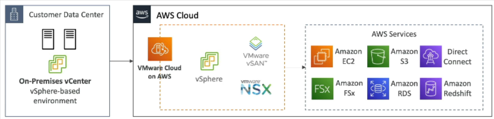

### Use Cases 🚀

With VMware Cloud on AWS, you can:

1.  Extend computing power and storage from your data center to the cloud.
2.  Migrate your VMware-based workloads to AWS.
3.  Run production workloads across private, public, or hybrid cloud environments.
4.  Implement a disaster recovery strategy by quickly transitioning to the cloud using familiar VMware tools.

### AWS Integration 🤝

Being on AWS allows you to access and leverage various AWS services, including:

*   Amazon EC2
*   Amazon FSx
*   S3
*   RDS
*   Direct Connect
*   Redshift

...and many more.

### Summary 📝

This is a high-level overview of VMware Cloud on AWS.

---