# 30 Other Services

Sections-
1. [Other Services Overview](#1-other-services-overview)
2. [Deploying and Managing Infrastructure at Scale: CloudFormation](#2-deploying-and-managing-infrastructure-at-scale-cloudformation)
3. [CloudFormation Introduction](#3-cloudformation-introduction)
4. [CloudFormation Service Roles and Security](#4-cloudformation-service-roles-and-security)
5. [Amazon SES: Simple Email Service](#5-amazon-ses-simple-email-service)
6. [Amazon Pinpoint](#6-amazon-pinpoint)
7. [SSM Session Manager](#7-ssm-session-manager)
8. [Systems Manager Services: Run Command, Patch Manager, Maintenance Windows, and Automation](#8-systems-manager-services-run-command-patch-manager-maintenance-windows-and-automation)
9. [Cost Explorer: Visualize, Understand, and Manage AWS Costs 📊](#9-cost-explorer-visualize-understand-and-manage-aws-costs-)
10. [AWS Cost Anomaly Detection 💰](#10-aws-cost-anomaly-detection-)
11. [AWS Outposts: Extending the Cloud to Your Data Center](#11-aws-outposts-extending-the-cloud-to-your-data-center)
12. [AWS Batch](#12-aws-batch)
13. [Amazon AppFlow 🚀](#13-amazon-appflow-)
14. [AWS Amplify Overview](#14-aws-amplify-overview)
15. [Instance Scheduler on AWS](#15-instance-scheduler-on-aws)


---

## 1. Other Services Overview

This section is a bit special because we'll be covering technologies that might appear in one or two very basic exam questions. 📝 **Note:** This lecture is an overview, not a deep dive.

As the exam evolves, I'll add more detailed lectures to this section as needed. 📌 **Example:** If a new service becomes prominent, I'll create a dedicated lecture.

Everything you need to know for now is included here. I guarantee it! 👍

Let's get started and explore these other services. 🚀

---

## 2. Deploying and Managing Infrastructure at Scale: CloudFormation

In this section, we'll explore different methods for deploying your workloads onto AWS, starting with CloudFormation.

CloudFormation is a crucial technology in AWS because it provides a declarative way of defining your AWS infrastructure for almost all resources.

📌 **Example:** In CloudFormation, you can define:

*   A security group
*   Two EC2 instances using that security group
*   An S3 bucket
*   A load balancer in front of all the machines

CloudFormation then automatically creates all these resources in the correct order and with the specified configurations.

**AWS CloudFormation** can be seen as an **alternative** to **Terraform**, but the choice depends on your use case. Here’s how they compare:

| Feature              | AWS CloudFormation ✅                                     | Terraform ✅                                                                    |
| -------------------- | -------------------------------------------------------- | ------------------------------------------------------------------------------ |
| **Provider**         | Native AWS service                                       | HashiCorp (open source + enterprise)                                           |
| **Scope**            | AWS-only (with some custom extensions)                   | Multi-cloud + on-prem + SaaS                                                   |
| **Language**         | YAML / JSON                                              | HCL (HashiCorp Configuration Language)                                         |
| **Integration**      | Deep AWS integration (IAM, CloudWatch, CloudTrail, etc.) | Supports thousands of providers (AWS, Azure, GCP, Kubernetes, Databases, SaaS) |
| **State Management** | Managed by AWS (no manual state files)                   | Requires state management (local or remote backends like S3, Terraform Cloud)  |
| **Cost**             | Free (only pay for AWS resources)                        | Free OSS, with optional paid Terraform Cloud/Enterprise                        |
| **Learning Curve**   | More verbose, AWS-specific                               | Easier to read, modular, reusable                                              |
| **Lock-in**          | High (AWS-only)                                          | Low (works across providers)                                                   |
| **Best for**         | AWS-only environments needing tight AWS integration      | Multi-cloud, hybrid setups, vendor-neutral deployments                         |

👉 **Bottom line:**

* Choose **CloudFormation** if you are **fully AWS-focused**.
* Choose **Terraform** if you need **multi-cloud flexibility** or want to avoid vendor lock-in.

### Benefits of Using CloudFormation

There are several advantages to using CloudFormation:

*   **Infrastructure as Code:** 💻 All your infrastructure is defined as code. This means you avoid manual resource creation, which enhances control. Any changes to your AWS cloud infrastructure must undergo code review, promoting a robust operational model.
*   **Cost Advantage:** 💰 Each resource within a CloudFormation stack is tagged, allowing for easy cost estimation and management.
*   **Saving Strategy:** 📉 You can automate the deletion of templates (and their associated resources) during off-peak hours (e.g., deleting at 5:00 PM and recreating at 8:00 AM) to save costs.
*   **Easy Resource Management:** 🚀 CloudFormation makes it easy to create and delete resources, aligning with core cloud principles.

### Productivity Enhancements

CloudFormation offers several productivity benefits:

*   **On-the-Fly Infrastructure Management:** ⚙️ You can quickly destroy and recreate infrastructure.
*   **Diagram Generation:** 📊 CloudFormation can generate diagrams of your templates.
*   **Declarative Programming:** ✨ You don't need to worry about the order in which resources are created (e.g., DynamoDB table vs. EC2 instance). CloudFormation intelligently handles dependencies.

### Leveraging Existing Resources

With CloudFormation, you don't have to start from scratch:

*   **Existing Templates:** 📚 You can leverage existing templates available online.
*   **Comprehensive Documentation:** 📖 Extensive documentation is available.
*   **Broad AWS Resource Support:** ✅ CloudFormation supports almost all AWS resources.
*   **Custom Resources:** 🛠️ For unsupported resources, you can use custom resources.

CloudFormation is the foundation of infrastructure as code on AWS.

### Visualizing CloudFormation Templates

You can visualize CloudFormation templates using the Infrastructure Composer service.

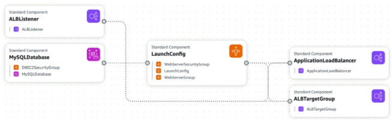

📌 **Example:** Visualizing a WordPress CloudFormation stack allows you to see:

*   ALB Listener
*   Database security group
*   SQL database
*   Different security groups
*   Launch configuration
*   Application balancers

You can also see the relationships between these components, which is helpful for understanding your architecture.

### Exam Perspective

From an exam perspective, remember that CloudFormation is used when:

*   You need infrastructure as code.
*   You need to repeat an architecture across different environments, regions, or AWS accounts.

---

## 3. CloudFormation Introduction

This note provides a quick introduction to CloudFormation and an overview of how it works. We'll cover creating and updating stacks using templates.

### Creating a Stack

1.  **Region Selection**: ⚠️ **Warning:** Ensure you are in the **US East (N. Virginia) us-east-1** region. The provided template is specifically designed for this region due to Availability Zone and AMI ID constraints.

2.  **Template Preparation**:
    *   Multiple options exist for template creation:
        *   Choose an existing template.
        *   Use a sample template.
        *   Build from Application Composer.
    *   For this demo, we'll select:- 
        * Prepare Template: Choose an existing template.
        * Template Source: Upload a template file.

3.  **Template File**:
    *   The template file is located in your course code under `CloudFormation/0-just-EC2.yaml`.
    *   📌 **Example:** The `0-just-EC2.yaml` file contains:

        ```yaml
        ---
        Resources:
            MyInstance:
                Type: AWS::EC2::Instance
                Properties:
                AvailabilityZone: us-east-1a
                ImageId: ami-0453ec754f44f9a4a
                InstanceType: t2.micro
        ```

    *   📝 **Note:**  The template defines how to launch an EC2 instance. The `ImageId` (AMI ID) is region-specific, and the `AvailabilityZone` is `us-east-1a`, hence the region requirement.

4.  **Uploading the Template**: Select the `0-just-EC2.yaml` file to upload.

5.  **Application Composer**:
    *   You can view the template in Application Composer for a visual representation.
    *   Application Composer provides a canvas showing the resources defined in your template.
    *   You can switch between YAML and JSON formats.
    *   Double-clicking components in the canvas provides more details.

6.  **Stack Details**:
    *   Provide a stack name (e.g., "demo CloudFormation").
    *   Since the initial template doesn't define parameters, no parameter input is needed.

7.  **Tags**:
    *   Add tags for identification and management.
    *   📌 **Example:** Add a tag with key "Name" and value "CFDemo".

8.  **Review and Create**: Review the stack configuration and click "Submit" to create the stack.

9.  **Stack Creation**:
    *   CloudFormation will generate events during the stack creation process.
    *   Upon successful creation, an EC2 instance will be launched based on the template.
    *   This demonstrates Infrastructure as Code (IaC), where code defines and manages infrastructure.

10. **Verification**:
    *   In the EC2 console, verify that the instance is running with the specified instance type (t2.micro) and AMI ID.
    *   Check the instance tags. CloudFormation automatically adds tags including the stack name, logical ID, and stack ID. The custom tag ("Name: CFDemo") is also applied.

### Updating a Stack

1.  **Initiate Update**: Select the stack and click "Update" > "Make a Direct Update".

2.  **Replace Template**: Choose to replace the existing template.

3.  **New Template File**: Select the [`1-ec2-with-sg-eip.yaml`](/resources/cloudformation/1-ec2-with-sg-eip.yaml) file. This template includes:
    *   A parameter section for the security group description.
    *   EC2 instance configuration with security groups.
    *   An Elastic IP (EIP) attached to the instance.
    *   Security group definitions for SSH (port 22) and server (port 80) access.

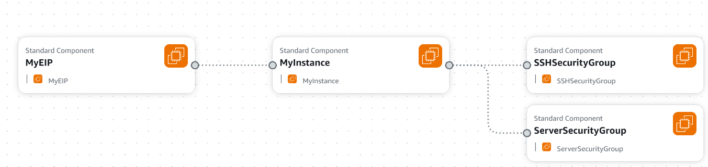

4.  **Parameter Input**: Provide the required parameter value (e.g., "demo description" for the security group description).

5.  **Change Sets**:
    *   CloudFormation generates a change set to preview the changes that will be applied to the stack.
    *   The change set shows resources being added (EIP, SSH security group, server security group) and modified (EC2 instance).
    *   ⚠️ **Warning:**  Pay attention to the "Replacement" column.  If it's "True" for a resource, it will be deleted and recreated.

6.  **Submit Update**: Review the change set and submit the update.

7.  **Update Process**:
    *   CloudFormation intelligently determines the order of operations.
    *   Security groups are created first, followed by the EC2 instance update.
    *   The old EC2 instance is terminated and a new one is created.
    *   The Elastic IP is created and associated with the new EC2 instance.

8.  **Verification**:
    *   In the EC2 console, verify that a new EC2 instance is running.
    *   Check the Elastic IP console to confirm that an EIP has been created, tagged, and associated with the EC2 instance.
    *   Verify the Elastic IP address is associated with the EC2 instance in the instance's networking details.

9.  **Cleanup**: CloudFormation automatically terminates the previous EC2 instance.

10. **Resources Tab**: The "Resources" tab in CloudFormation shows all resources created and managed by the stack.

11. **Application Composer (Updated)**: View the updated architecture in Application Composer, showing the EC2 instance connected to the Elastic IP and security groups.

### Deleting a Stack

1.  **Deletion**: ⚠️ **Warning:**  Do not manually delete resources managed by CloudFormation.
2.  **Stack Deletion**: To remove all resources, select the stack and click "Delete".
3.  **Orderly Deletion**: CloudFormation will delete the resources in the correct order to ensure a clean removal.

### Conclusion

CloudFormation is a powerful Infrastructure as Code (IaC) service. It's declarative, allowing you to define the desired state of your infrastructure, and CloudFormation handles the provisioning and management. Mastering CloudFormation is a valuable skill for AWS users.

---

## 4. CloudFormation Service Roles and Security

CloudFormation can leverage service roles to enhance security and implement the principle of least privilege. Let's explore how they work.

### What are CloudFormation Service Roles? 🤔

CloudFormation service roles are IAM roles specifically created and dedicated to CloudFormation. They grant CloudFormation the necessary permissions to create, update, and delete stack resources on your behalf.

### Why Use Service Roles? 🛡️

Service roles are useful when you want to allow users to manage CloudFormation stacks without granting them direct permissions to the underlying resources.

📌 **Example:**
Imagine you have users who need to deploy applications using CloudFormation, but you don't want them to have full S3 or EC2 permissions. You can use a service role to grant CloudFormation the necessary permissions, while limiting the users' direct access.

### How Service Roles Work ⚙️

1.  **Define a CloudFormation Template:** This template describes the resources you want to create.
2.  **User Permissions:** The user initiating the CloudFormation stack creation needs permissions to perform actions on CloudFormation itself and, crucially, the `iam:PassRole` permission. **To create a CloudFormation stack, the user must have the `iam:PassRole` permission.**
3.  **Create a Service Role:**  This IAM role is specifically for CloudFormation and has the permissions required to create, update, and delete the resources defined in your template.  For example, it might have `s3:*Bucket` permissions.
4.  **CloudFormation Assumes the Role:** When creating the stack, the user specifies the service role. CloudFormation then assumes this role and uses its permissions to manage the stack's resources.

📌 **Example:**

Let's say a user wants to create an S3 bucket using CloudFormation.

*   The user has permissions to create CloudFormation stacks and has `iam:PassRole`.
*   A service role exists with `s3:*` permissions.
*   The user creates a CloudFormation stack and specifies the service role.
*   CloudFormation assumes the service role and creates the S3 bucket.

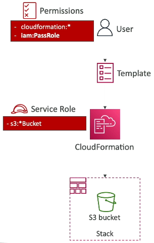

### Least Privilege Principle 🔑

Service roles help you adhere to the principle of least privilege. You avoid granting users excessive permissions by only giving them the ability to invoke a service role on CloudFormation.

### The `iam:PassRole` Permission ⚠️

For service roles to work, the user initiating the CloudFormation stack creation **must** have the `iam:PassRole` permission. This permission allows the user to pass the service role to CloudFormation.

### Demo: Creating a Service Role and Using it in CloudFormation 🚀

Here's a demonstration of creating a service role and using it within CloudFormation:

1.  **Create an IAM Role:**
    *   Go to the IAM console and navigate to the "Roles" section.
    *   Create a new role.
    *   Select "AWS service" as the trusted entity and choose "CloudFormation" as the service.
    *   Attach the necessary permission policies. 📌 **Example:** For this demo, we'll grant `AmazonS3FullAccess` to the role.
    *   Name the role something descriptive, like `DemoRoleForCFNWithS3Capabilities`.

2.  **Create a CloudFormation Stack:**
    *   Go to the CloudFormation console and create a new stack.
    *   Choose an existing template `0-just-ec2.yaml`.
    *   On the "Specify Details" page, you'll find a "Permissions" section.
    *   Select the "IAM role" option and choose the service role you created ("DemoRoleForCFNWithS3Capabilities").

📝 **Note:** If you don't specify an IAM role, CloudFormation will use your own user permissions.

⚠️ **Warning:** If the service role doesn't have the necessary permissions for all the resources in your template, the stack creation will fail. 📌 **Example:** If your template creates an EC2 instance, but your service role only has S3 permissions, the stack will fail.

### Key Takeaways 💡

*   CloudFormation service roles enhance security by allowing you to grant CloudFormation specific permissions without giving users direct access to resources.
*   The `iam:PassRole` permission is crucial for users to be able to pass a service role to CloudFormation.
*   Ensure your service role has all the necessary permissions to create, update, and delete the resources defined in your CloudFormation template.

---

## 5. Amazon SES: Simple Email Service

Amazon SES (Simple Email Service) is a fully managed service that enables you to send emails securely, globally, and at scale. 📧

Your application interacts with Amazon SES through:

*   The SES API
*   An SMTP server

Amazon SES then handles sending bulk emails to your users.

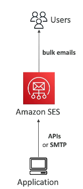

Key features include:

*   Outbound and inbound email capabilities (receiving replies). 📤📥
*   A reputation dashboard providing insights into:
    *   Email open rates. 📊
    *   Performance.
    *   Anti-spam feedback. 🚫
*   Email statistics, including:
    *   Deliveries. ✅
    *   Bounces. 💥
    *   Feedback loop results.
    *   Email open tracking. 👀
*   Support for standard email security protocols:
    *   DKIM (DomainKeys Identified Mail).
    *   SPF (Sender Policy Framework).

Deployment options are flexible:

*   Shared IP. 🌐
*   Dedicated IP. 🏢
*   Customer-owned IP (for sending emails from a specific IP address). 📍

APIs are accessible through:

*   The AWS Management Console. 💻
*   Specific AWS SDKs/APIs.
*   The SMTP protocol.

Common use cases for Amazon SES:

*   Transactional emails. 🧾
*   Marketing emails. 📣
*   Bulk email communications. ✉️

---

## 6. Amazon Pinpoint

Amazon Pinpoint is a scalable inbound and outbound marketing communication service. It allows you to send messages via multiple channels:

*   📧 Email
*   💬 SMS
*   📱 Push Notifications
*   🗣️ Voice
*   ✉️ In-App Messaging

One of the primary use cases is sending SMS messages. Customers receive SMS messages sent through Amazon Pinpoint.

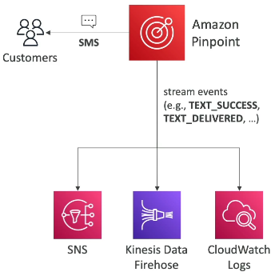

You can segment and personalize messages to deliver the right content to the right customers. This involves creating groups and segments. You also have the ability to receive replies. Pinpoint scales to billions of messages per day.

Use cases for Pinpoint include:

*   Running marketing campaigns by sending bulk marketing emails.
*   Sending transactional SMS messages.

When messages are sent, and events occur (e.g., text success, text delivered, replies), these events are delivered to:

*   Amazon SNS
*   Kinesis Data Firehose
*   CloudWatch Logs

This allows you to build automation on top of Amazon Pinpoint.

🤔 **What's the difference between Pinpoint, Amazon SNS, and Amazon SES?**

With SNS and SES, you manage each message's audience, content, and delivery schedule within your application. This can be a lot of work and may not be very scalable.

With Amazon Pinpoint, you create:

*   Message templates
*   Delivery schedules
*   Highly targeted segments
*   Full campaigns

All of this is managed by the Pinpoint service itself.

💡 **Tip:** Think of Pinpoint as the next evolution of SNS and SES for full-blown marketing communications services.

---

## 7. SSM Session Manager

SSM Session Manager allows you to start a secure shell on your EC2 instances and on-premises servers without needing SSH access, bastion hosts, or SSH keys. This enhances security by eliminating the need to open port 22 on your EC2 instances.

* **No SSH access, bastion hosts, or SSH keys required**
* **No port 22 needed (better security)**

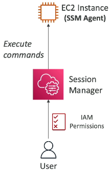

### How it Works
*   The EC2 instance has an SSM Agent.
*   The SSM Agent connects to the Session Manager service.
*   Users can access the instance through the Session Manager service and execute commands.
*   Supports Linux, macOS, and Windows.
*   Log data can be sent to Amazon S3 or CloudWatch Logs for enhanced security.

### Hands-On Demonstration

Let's walk through a hands-on example to illustrate how to use SSM Session Manager.

#### Launching an EC2 Instance

1.  Launch a new EC2 instance.
2.  Choose **Amazon Linux 2 AMI** and a **t2.micro** instance type.
3.  Do not use a key pair.
4.  Disable SSH traffic by configuring the security group to allow no inbound rules (no HTTP, HTTPS, or SSH).
    *   This demonstrates that we can access the instance without opening port 22.
5. In Advance details, we need to select the IAM instance profile for the instance to allow it to communicate with the SSM service.

#### Creating an IAM Role

1.  Attach an IAM instance profile to the EC2 instance to allow it to communicate with the SSM service.
2.  Create a new IAM role:
    *   Select **Amazon EC2** as the service that will use this role.
    *   Filter for **SSM** in the permissions.
    *   Choose the **AmazonSSMManagedInstanceCore** policy.
    *   Name the role (📌 **Example:** `DemoEC2RoleForSSM`).
    *   This role allows the EC2 instance to use the policy to communicate with the SSM service.
    *   This is necessary for the instance to be managed by the SSM service and to use the SSM Session Manager feature.
3.  Refresh the IAM role list and select the newly created role.

#### Launching the Instance

1.  Create and launch the EC2 instance.
2.  Wait for the instance to boot up.

#### Verifying in Fleet Manager

1.  Navigate to **Systems Manager** > **Fleet Manager**.
2.  Fleet Manager displays all EC2 instances registered with SSM (managed nodes).
3.  Wait for the EC2 instance to appear in Fleet Manager.
    *   It may take a few minutes for the instance to boot up and register.
4.  Once the instance appears, you can see:
    *   The SSM Agent is online.
    *   The platform (operating system).
    *   The SSM Agent version.
    *   Links to the EC2 instance.

#### Starting a Session

1.  Navigate to **Systems Manager** > **Session Manager**.
2.  Select **Start a session**.
3.  Choose the EC2 instance.
4.  Click **Start session**.
5.  A secure shell will open in your browser.
    *   You now have a secure shell without needing SSH access.
    *   📌 **Example:** You can run commands like `ping google.com` or `hostname`.
    *   The hostname will correspond to the private IP address of your instance.

```bash
ping google.com
hostname
```

### Accessing EC2 Instances: Three Methods

1.  **SSH with Port 22:** Open port 22 (from MyIP or everywhere) and use SSH keys with a terminal.
2.  **EC2 Instance Connect:** Does not require SSH keys (they are temporarily uploaded), but still requires port 22 to be open (from everywhere because will be connecting from AWS).
3.  **SSM Session Manager:** Does not require opening port 22 or using SSH keys (no inbound rules required).

### Key Requirements for Session Manager

*   Use an EC2 instance with **Amazon Linux 2**.
*   Attach an IAM role to the EC2 instance that allows access from the EC2 instance to Systems Manager (using the **AmazonSSMManagedInstanceCore** policy).

### Session History

*   Session history is saved as logs.
*   You can view the session history in the Session Manager console.

### Cleanup

*   Terminate the EC2 instance when you are finished.

---

## 8. Systems Manager Services: Run Command, Patch Manager, Maintenance Windows, and Automation

Let's explore some key services within Systems Manager. 📝 **Note:** These are important for the exam, so grasp the general idea even if you don't understand every detail.

### Run Command

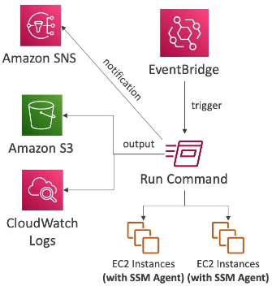

The Run Command is used to execute a document (script or single command) on multiple instances using resource groups.

*   These instances can be:
    *   EC2 instances
    *   On-premises servers registered with Systems Manager (SSM Agent must be running).
*   No SSH is required. It uses the same mechanism as Session Manager, running commands through the SSM Agent.
*   Output can be sent to:
    *   Amazon S3
    *   CloudWatch Logs
*   Status notifications (in-progress, success, failed, etc.) are sent to Amazon SNS.
*   Full integration with IAM for security and CloudTrail for auditing.
*   Automation is possible: EventBridge can directly trigger a Run Command.

### Patch Manager

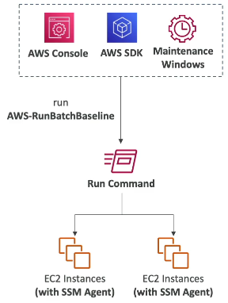

Patch Manager automates the process of patching managed instances.

*   Applies:
    *   Operating system updates
    *   Application updates
    *   Security updates
*   Supports:
    *   EC2 instances
    *   On-premises servers
    *   Linux, Mac, and Windows
*   Patching can be:
    *   On-demand
    *   Scheduled using Maintenance Windows
*   Can scan instances and generate patch compliance reports to identify missing patches.

The process involves invoking Patch Manager (using the `AWS-RunPatchBaseline` Run Command) from the console, SDK, or a Maintenance Window to patch EC2 instances. Reports are then available within Patch Manager.

### Maintenance Windows

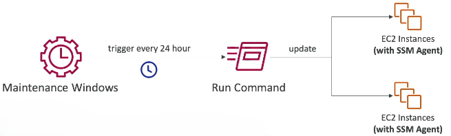

Maintenance Windows define a schedule for performing actions on your instances.

*   Used for tasks like:
    *   OS patching
    *   Updating drivers
    *   Installing software
*   When defining a Maintenance Window, you specify:
    1.  Schedule: When it will be triggered.
    2.  Duration: How long it will run.
    3.  Target Instances: Which instances it applies to.
    4.  Tasks: What actions will be performed.

📌 **Example:** A Maintenance Window can be triggered every 24 hours to run a command to patch EC2 instances.

### Automation

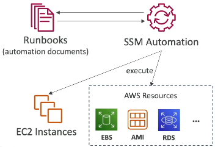

Automation simplifies common maintenance and deployment tasks on EC2 instances or other AWS resources.

*   📌 **Example:** Restarting many instances at once, creating AMIs, or creating EBS snapshots.
*   Uses **Automation Runbooks**:
    *   Represent SSM Documents.
    *   Contain predefined actions on EC2 instances or AWS resources.
*   The SSM Automation service uses these runbooks to execute actions.

📌 **Example:** Restart all EC2 instances or take snapshots of all RDS databases.

**Can be triggered using:**

* Manually using AWS Console, AWS CLI or SDK
* Amazon EventBridge
* On a schedule using Maintenance Windows
* By AWS Config for rules remediations

💡 **Tip:** AWS Config integration allows for automatic remediation. If Config finds a non-compliant resource, it can trigger an SSM Automation to remediate it.

---

## 9. Cost Explorer: Visualize, Understand, and Manage AWS Costs 📊

Cost Explorer is a billing service that helps you visualize, understand, and manage your AWS costs and usage over time. It's a valuable tool for cost optimization and planning.

Here's what you can do with Cost Explorer:

*   Create custom reports to analyze your cost and usage data. 📈
*   Use dashboards and diagrams for easy visualization. 📉
*   Analyze data at different levels of granularity:
    *   Total cost and usage across all accounts.
    *   Monthly, hourly, or resource level. 🗓️

Cost Explorer enables cost savings by:

*   Helping you choose an optimal Savings Plan to lower your bill. 💰
*   **Forecasting usage up to 12 months in the future based on past usage**. 🔮

📌 **Example:** Monthly cost by AWS Service

Cost Explorer allows you to identify expensive resources. For instance, you can see that certain instance types are more costly than others. This prompts you to ask questions like:

*   Are these instances being used efficiently? 🤔
*   Are they being used to their full potential? 🚀
*   Are they the right size for the workload? ⚙️

📌 **Example:** Hourly and Resource Level Cost

Cost Explorer provides detailed information at the resource level, showing costs over time. This allows you to understand your bill with an hourly breakdown.

### Savings Plans

Savings Plans are an alternative to Reserved Instances. Cost Explorer can help you identify potential Savings Plans based on your usage.

*   Cost Explorer provides recommendations and estimated monthly spend for different Savings Plans. 💡

### Forecasting Usage

Cost Explorer forecasts future usage based on your past costs.

*   You'll get a forecast and a confidence level for your expected bill based on previous usage. 📈
*   This is very helpful for cost planning. 🗓️

📝 **Note:** Cost Explorer is likely the only AWS billing service you'll be asked about in the exam. ⚠️

---

## 10. AWS Cost Anomaly Detection 💰

AWS Cost Anomaly Detection is a service that continuously monitors your cost and usage data. It leverages machine learning to detect unusual spending patterns. 🚀

Here's a breakdown:

*   It learns from your unique historical patterns. 🧠
*   It detects one-time cost spikes and continuous cost increases. 📈

The best part? You don't need to define any thresholds! The service automatically identifies what looks out of the ordinary. ✨

It monitors:

*   AWS services.
*   Member accounts.
*   Cost allocation tags.
*   Cost categories.

You'll receive an anomaly detection report with root cause analysis, helping you understand what's happening in your account. 🕵️‍♀️

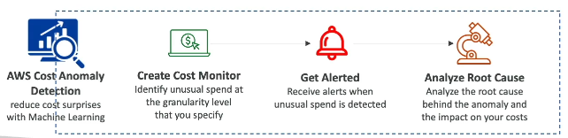

Notifications can be configured via:

*   Individual alerts.
*   Daily or weekly summaries using SNS. 🔔

In summary, AWS Cost Anomaly Detection allows you to:

1.  Monitor your AWS costs using machine learning. 🤖
2.  Get alerted to anomalies. 🚨
3.  Quickly analyze the root cause of unexpected spending. 🔍

All of this is achieved using the AWS Cost Anomaly Detection service! 🎉

---

## 11. AWS Outposts: Extending the Cloud to Your Data Center

Let's explore AWS Outposts, a game-changing solution for hybrid cloud environments.

### What is Hybrid Cloud? 🤔

A hybrid cloud strategy involves businesses maintaining both:

*   An on-premises infrastructure.
*   A cloud infrastructure.

Previously, managing these two environments presented challenges.

### The Problem with Traditional Hybrid Cloud 😫

Managing a hybrid cloud traditionally meant:

*   Two different IT systems.
*   Separate skillsets required.
*   Distinct APIs for on-premises and cloud.
*   Increased complexity.

### Introducing AWS Outposts: The Solution! 🚀

AWS Outposts addresses these challenges by providing:

*   Server racks that offer the same AWS infrastructure on-premises as in the cloud.
*   Consistent AWS services, APIs, and tools for building applications.
*   AWS manages the Outpost racks within your on-premises infrastructure.

Essentially, AWS extends its services directly into your corporate data center. This is a revolutionary approach!

### How it Works ⚙️

1.  AWS sets up and manages Outpost racks (servers) within your on-premises infrastructure.
2.  These servers come preloaded with AWS services.
3.  You benefit from on-premises resources with AWS cloud consistency.

### Your Responsibilities 🛡️

⚠️ **Warning:** While AWS manages the Outpost service, you are responsible for the physical security of the rack itself, as it resides within your data center.

### Benefits of Using Outposts 🏆

*   **Low Latency Access:** ⚡ Get faster access to on-premises systems.
*   **Local Data Processing:** 💾 Process data locally, potentially without sending it to the cloud.
*   **Data Residency:** 📍 Keep data within your own data centers to meet compliance requirements.
*   **Easy Migration:** ➡️ Simplify migration from on-premises to Outposts, and then from Outposts to the cloud.
*   **Fully Managed Service:** ✅ AWS manages the Outpost service for you.

### Available Services on Outposts ☁️

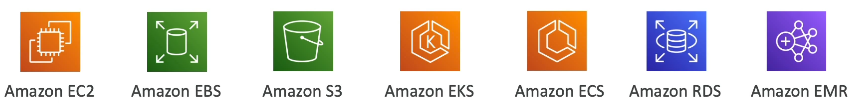

With Outposts, you can launch a variety of AWS services, including:

*   Amazon EC2
*   Amazon EBS
*   Amazon S3
*   Amazon EKS
*   Amazon ECS
*   Amazon RDS
*   Amazon EMR

### Conclusion 🎉

AWS Outposts offers a powerful way to extend the cloud directly into your on-premises infrastructure, making it a revolutionary solution for hybrid cloud environments.

📝 **Note:** AWS Outposts is a key concept and may appear on the exam!

---

## 12. AWS Batch

AWS Batch is a fully managed batch processing service that allows you to perform batch processing at any scale. With Batch, you can efficiently run hundreds of thousands of computing batch jobs on AWS very easily.

### What is a Batch Job?

A batch job is a job that has a defined start and end time. This is in contrast to continuous or streaming jobs that run indefinitely. 📌 **Example:** A batch job might start at 1:00 AM and finish at 3:00 AM.

The Batch service dynamically launches EC2 instances or Spot Instances to accommodate the load required to run these batch jobs. Batch provisions the right amount of compute and memory for your batch queue. You simply submit or schedule batch jobs into the queue, and Batch handles the rest.

### Defining a Batch Job

A batch job is defined as a Docker image and a task definition that you run on the ECS service. This means that anything that can run on ECS can also run on Batch.

Using Batch to run batch jobs is beneficial because it automatically scales the right number of EC2 instances or Spot Instances to perform the jobs. This leads to cost optimization, and allows you to focus less on infrastructure and more on your batch jobs.

### Batch Job Workflow ⚙️

📌 **Example:** Processing images submitted by users to Amazon S3 in a batch manner.

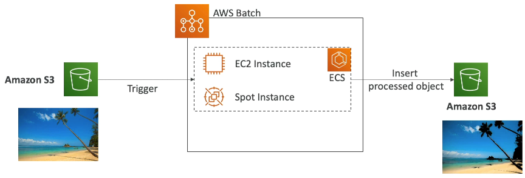

1.  An image is uploaded to Amazon S3.
2.  This upload triggers a batch job.
3.  Batch automatically manages an ECS cluster made of EC2 instances or Spot Instances.
4.  Batch ensures that you have the right amount of instances to accommodate the load of batch jobs in the queue.
5.  These instances run your Docker images to perform the job.
6.  The job might involve inserting the processed object (e.g., an image with a filter applied) into another Amazon S3 bucket.

### Batch vs. Lambda 🤔

What is the difference between Batch and Lambda? While they may seem similar, there are key differences:

**Lambda:**

*   Has a time limit of 15 minutes.
*   Supports a limited number of programming languages.
*   Has limited temporary disk space.
*   Is a serverless service.

**Batch:**

*   Has no time limit, as it relies on EC2 instances.
*   Supports any runtime that can be packaged as a Docker image.
*   Relies on the storage that comes with an EC2 instance (EBS volume or EC2 instance store), which can provide significantly more disk space.
*   Is not a serverless service; it is a managed service that relies on EC2 instances.

| Feature           | Lambda                         | Batch                            |
| ----------------- | ------------------------------ | -------------------------------- |
| Time Limit        | 15 minutes                     | None                             |
| Runtime           | Limited programming languages  | Any (Docker image)               |
| Storage           | Limited temporary disk space   | EC2 instance storage (EBS, etc.) |
| Serverless        | Yes                            | No                               |

While Batch relies on EC2 instances, these instances are managed by AWS, so you don't have to worry about auto-scaling and other infrastructure management tasks.

---

## 13. Amazon AppFlow 🚀

Amazon AppFlow is a fully managed integration service that simplifies data transfer between Software-as-a-Service (SaaS) applications and AWS services. ☁️

Writing integrations can be complex, but AppFlow streamlines the process.

**Data Sources:**

AppFlow supports various data sources, including:

*   Salesforce ☁️
*   SAP 🏢
*   Zendesk 💬
*   Slack 🗣️
*   ServiceNow 🛠️

📌 **Example:** Salesforce is a common source and frequently appears in exam scenarios.

**Data Destinations:**

You can send data from these sources to destinations such as:

* AWS Services like: Amazon S3 🗄️, Amazon Redshift 📊
* Non-AWS Services like: Snowflake ❄️, Salesforce ☁️

**Integration Options:**

You can configure integrations to run (frequency):

*   On a schedule 🗓️
*   In response to specific events 🚦
*   On demand ⚙️

**Data Transformation:**

AppFlow provides built-in data transformation capabilities, including:

*   Filtering 🔍
*   Validation ✅

**Security:**

*   Data is encrypted over the public internet. 🔒
*   You can transfer data privately using PrivateLink. 🛡️

The core benefit of AppFlow is that you can immediately leverage APIs without spending time writing custom integrations. This allows you to quickly access and utilize your data within your AWS accounts. ⚡

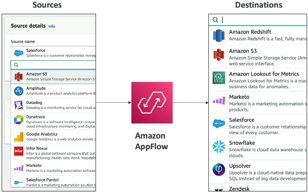

**Using the AppFlow Interface:**

1.  Select a **source** from the available options. Remember that Salesforce is a key source to be familiar with.
2.  Choose a **destination** to send the data to, such as Redshift or S3.

That concludes this introduction to Amazon AppFlow! 🎉

---

## 14. AWS Amplify Overview

AWS Amplify is a powerful web and mobile application development tool. 🚀 Think of it as a central hub for integrating various AWS services to streamline your development process. It allows developers to build and deploy applications more efficiently.

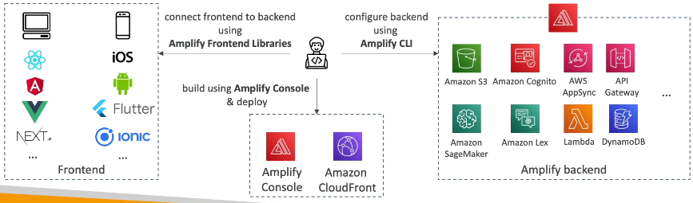

Here's a breakdown of how Amplify works:

1.  **Create an Amplify Backend:**
    *   Use the Amplify CLI to create a backend.
    *   This backend leverages numerous AWS resources:
        *   Amazon S3 for data storage 🗄️
        *   Amazon Cognito for identity 👤
        *   AppSync for APIs ⚙️
        *   API Gateway for APIs 🌐
        *   SageMaker for machine learning 🤖
        *   Lex for text detection 💬
        *   Lambda for functions and data services ⚡
        *   DynamoDB for data storage 💾
2.  **Configure Backend Services:**
    *   Amplify provides a single interface to configure:
        *   Authentication 🔑
        *   Storage 🗄️
        *   APIs (REST or GraphQL) ⚙️
        *   CI/CD 🚀
        *   PubSub 📢
        *   Analytics 📊
        *   AI/ML Predictions 🤖
        *   Monitoring 📈
3.  **Connect Your Code:**
    *   Connect your code repository:
        *   GitHub 🐙
        *   AWS CodeCommit ☁️
        *   Bitbucket 🪣
        *   GitLab 🦊
    *   Alternatively, upload your code directly.
4.  **Integrate Backend Services:**
    *   Integrate all backend services directly from within Amplify.
5.  **Add Amplify Frontend Libraries:**
    *   Connect to your Amplify Backend using Frontend Libraries.
    *   Frontend Libraries are available for:
        *   Web applications 🌐
        *   Mobile applications 📱
        *   Various frameworks ⚙️
6.  **Deploy Your Application:**
    *   Use the Amplify Console to deploy.
    *   Deploy to Amplify itself and Amazon CloudFront.
    *   Your web or mobile application becomes available. 🚀

📝 **Note:** Amplify simplifies the integration of AWS services for web and mobile app development.

Amplify can be thought of as the Elastic Beanstalk for web and mobile applications. It provides a high-level overview and allows you to integrate various AWS services into a single, developer-friendly platform. 💡 **Tip:** Consider Amplify as a one-stop shop for building web and mobile applications on AWS.

---

## 15. Instance Scheduler on AWS

**Instance Scheduler is an AWS solution, not a service, that you deploy using CloudFormation**. It provides the capability to **automatically start and stop your AWS services to reduce costs, potentially by up to 70%**.

📌 **Example:** You can use Instance Scheduler to stop your company's EC2 instances outside of business hours.

### Key Features and Support

*   Supports:
    *   EC2 instances
    *   EC2 Auto Scaling Groups
    *   RDS instances

*   Schedules are managed in a DynamoDB table.
*   A Lambda function looks up the schedule in DynamoDB.
*   This triggers other Lambda functions to automatically stop or start the required instances in the required services.
*   Complete solution: Supports cross-account and cross-region resources and is production-ready.

💡 **Tip:** The exam may ask you about the core idea behind this solution: stopping and starting resources to save on costs.

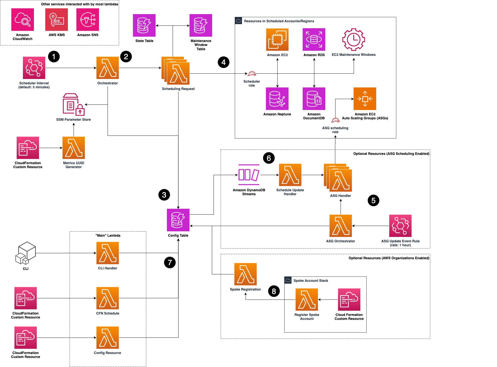

See More:- [Instance Scheduler on AWS](https://aws.amazon.com/solutions/implementations/instance-scheduler-on-aws/)

### Deployment Process

Here's a quick overview of how to deploy Instance Scheduler:

1.  Search for "Instance Scheduler AWS" and click on the solution.
2.  On the solution webpage, you'll find information about the version, release, implementation guide, source code, and CloudFormation template.
3.  Click on "Launch Solution." This redirects you to the CloudFormation console.
4.  CloudFormation pre-fills the template instance and Amazon S3 URL. Click "Next."
5.  Provide a name for the stack (e.g., "Instance Scheduler").
6.  Configure the parameters:
    *   **Tag Key:** The tag used for scheduling (e.g., "Schedule").
    *   **Scheduling Interval:** How often to check for shutdown opportunities (e.g., every 5 minutes).
    *   **Default Time Zone:** The time zone to use for scheduling.
    *   **Enable Scheduling:** Enable or disable the solution (yes/no).
    *   **Services:** Enable scheduling for EC2, RDS, RDS Cluster, Neptune, DocumentDB, and Auto Scaling.
        📝 **Note:** The available services may expand over time, but EC2 and RDS are the core services to remember.
    *   **Tagging:** When an instance is started or stopped, a tag is automatically added, describing the action performed by Instance Scheduler, including the date and time.
    *   **RDS Snapshot on Stop:** Option to snapshot RDS instances when they are stopped.
    *   **ASG Settings:** Configuration options for Auto Scaling Groups.
7.  Review the configuration and acknowledge that CloudFormation will create IAM resources.
8.  Click "Create Stack."

### Key Components After Deployment

After the CloudFormation stack is created, you'll find several resources, including:

*   **DynamoDB Tables:** The most important table is the configuration table, where you define your schedules.
    *   You can explore the table items to see examples of how to schedule events, such as office hours, working days, or specific days of the month.
*   **Lambda Functions:** A collection of Lambda functions that handle the scheduling logic.

While understanding the detailed architecture isn't crucial, grasping the core concept is essential.

---