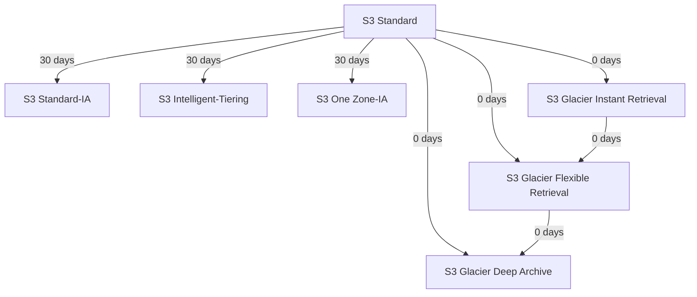

# AWS S3 - Handnote 📝

## 🪣 S3 BASICS

### What is S3?
- **Simple Storage Service** - Object storage service for storing and retrieving any amount of data
- **Scalable, durable, and secure** storage with 99.999999999% (11 9's) durability

### Buckets & Objects
- **Bucket**: Top-level directory (like a folder)
- **Object**: Files stored in buckets
- **Key**: Full path to file (e.g., `my-folder/file.txt`)
- **Prefix**: Folder path (e.g., `my-folder/`)
- **Object Name**: File name (e.g., `file.txt`)

### Bucket Naming
- ✅ **Globally unique** across all AWS accounts & regions
- ✅ **Region-specific** (buckets exist in specific regions)
- ✅ **3-63 characters**
- ✅ **Lowercase letters, numbers, hyphens only**
- ❌ No uppercase, no underscores
- ❌ Cannot be IP address
- ❌ Cannot start with `xn--`
- ❌ Cannot end with `-s3alias`

### Object Properties
- **Max size**: **5 TB** per object
- **>5 GB**: Must use **multi-part upload**
- **Metadata**: Key-value pairs (system/user-defined)
- **Tags**: Up to 10 Unicode key-value pairs
- **Version ID**: Present if versioning enabled

---

## 🔒 S3 SECURITY

### Security Methods
1. **IAM Policies**: User-based permissions
2. **Bucket Policies**: Bucket-wide rules (most common) ✅
3. **Object ACLs**: Fine-grained (can be disabled)
4. **Bucket ACLs**: Less common (can be disabled)

### Bucket Policy Structure
```json
{
  "Version": "2012-10-17",
  "Statement": [{
    "Effect": "Allow",
    "Principal": "*",
    "Action": "s3:GetObject",
    "Resource": "arn:aws:s3:::bucket-name/*"
  }]
}
```

> **`Principal` defines *who* gets access; `Action` defines *what* they can do; `Resource` defines *on what*.**

> **`Principal` specifies the AWS account, user, role, service, or everyone (`*`) to whom the permission applies.**

#### Common exam trap

* **IAM identity-based policies** ❌ do **not** use `Principal`
* **Resource-based policies (like S3 bucket policies)** ✅ **require `Principal`**

### Access Patterns
- **Public Access**: Use **Bucket Policy**
- **User Access**: Use **IAM Permissions**
- **EC2 Access**: Use **IAM Roles** (not IAM users)
- **Cross-Account**: Use **Bucket Policy**

### Block Public Access
- ⚠️ **Overrides bucket policies** - even if policy allows public, Block Public Access will prevent it
- ✅ Enable if bucket should never be public
- ✅ Can be set at account level

---

## 🔐 S3 ENCRYPTION

### Encryption Methods
1. **Server-Side Encryption (SSE)** - 3 flavors
2. **Client-Side Encryption**

### Server-Side Encryption (SSE)

#### SSE-S3 (S3-Managed Keys)
- ✅ **Default**: Enabled by default for new buckets (since Jan 5, 2023)
- ✅ **AWS manages keys**: You never have access
- ✅ **AES-256**: Encryption algorithm
- ✅ **Header**: `x-amz-server-side-encryption: AES256`
- ✅ **Automatic**: Objects encrypted even without header (if default enabled)

#### SSE-KMS (KMS Keys)
- ✅ **User control**: Create and manage keys in KMS
- ✅ **Audit**: Key usage logged in CloudTrail
- ✅ **Header**: `x-amz-server-side-encryption: aws:kms`
- ✅ **Extra security**: Need access to object AND KMS key
- ⚠️ **Limitation**: KMS API quotas (5,500-30,000 req/s by region)
- ⚠️ **Throttling**: High throughput may hit limits
- ✅ **Bucket Key**: Reduces KMS API calls (enabled by default)

#### SSE-C (Customer-Provided Keys)
- ✅ **Customer manages keys**: Outside AWS
- ✅ **S3 never stores key**: Discarded after use
- ⚠️ **Must use HTTPS**: Required
- ⚠️ **Key in headers**: Must pass key with every request
- ⚠️ **Console**: Not available (CLI/SDK only)

### Client-Side Encryption
- ✅ **Client encrypts**: Before sending to S3
- ✅ **Client decrypts**: After downloading
- ✅ **Full control**: Client manages keys and encryption
- 💡 **Tip**: Use Client-Side Encryption Library

### Encryption in Transit
- **HTTP**: Not encrypted
- **HTTPS**: Encrypted (recommended)
- ⚠️ **SSE-C**: Must use HTTPS

### Force HTTPS
Use bucket policy to deny HTTP:
```json
{
  "Effect": "Deny",
  "Principal": "*",
  "Action": "s3:GetObject",
  "Resource": "arn:aws:s3:::bucket/*",
  "Condition": {
    "Bool": {
      "aws:SecureTransport": "false"
    }
  }
}
```

### Default Encryption vs Bucket Policies
- **Default Encryption**: SSE-S3 enabled by default (new buckets), changeable to SSE-KMS, automatic for new objects
- **Bucket Policies**: Evaluated before default encryption, can enforce encryption (deny unencrypted uploads)

---

## 🌐 CORS (CROSS-ORIGIN RESOURCE SHARING)

### What is CORS?
- **Browser security**: Allows/denies cross-origin requests
- **Origin defined by**: Scheme, Host, Port
- **Same origin**: Same scheme, host, port
- **Different origin**: Any difference in scheme, host, or port

### CORS Workflow
1. Browser makes request to origin A
2. Origin A HTML requests resource from origin B
3. Browser sends **pre-flight OPTIONS** request to origin B
4. Origin B responds with **CORS headers**:
   - `Access-Control-Allow-Origin`
   - `Access-Control-Allow-Methods`
5. Browser makes actual request if CORS allows

### CORS Configuration
```json
[{
  "AllowedHeaders": ["Authorization"],
  "AllowedMethods": ["GET"],
  "AllowedOrigins": ["https://example.com"],
  "ExposeHeaders": [],
  "MaxAgeSeconds": 3000
}]
```

### Important Notes
- ⚠️ **No trailing slash**: In AllowedOrigins URL
- ✅ **Include protocol**: `http://` or `https://`
- ✅ **Wildcard**: Use `*` for all origins (less secure)

---

## 🌐 STATIC WEBSITE HOSTING

### Requirements
1. S3 bucket
2. Files (HTML, images, etc.)
3. Enable static website hosting
4. **Public read access** (bucket policy)

### Website URLs
- `s3-website-region.amazonaws.com` OR
- `s3-website.region.amazonaws.com`

### Setup
1. Enable static website hosting in Properties
2. Set index document (e.g., `index.html`)
3. Configure bucket policy for public read
4. Upload files

---

## 📦 VERSIONING

### Features
- ✅ **Best practice** - enable on all buckets
- ✅ Protects against unintended deletes
- ✅ Allows rollback to previous versions
- ✅ **Delete marker** added when object "deleted" (not permanent)
- ✅ Files uploaded before versioning have `null` version ID

### How It Works
1. Enable versioning at bucket level
2. Each upload creates new version
3. "Delete" adds delete marker (original still exists)
4. Remove delete marker to restore

### Important Notes
- ⚠️ **Suspending versioning does NOT delete versions**
- ⚠️ **Permanent delete** (by version ID) is NOT replicated
- ⚠️ Only **delete markers** are replicated

---

## 🔄 S3 REPLICATION

### Types
- **CRR (Cross-Region Replication)**: Different regions
- **SRR (Same-Region Replication)**: Same region

### Requirements
- ✅ **Versioning must be enabled** on both buckets
- ✅ IAM permissions for S3 service
- ✅ Can be different AWS accounts

### Use Cases
- **CRR**: Compliance, lower latency, cross-account
- **SRR**: Log aggregation, prod/test replication

### Important Notes
- ⚠️ Only **new objects** replicated after enabling
- ⚠️ Use **S3 Batch Replication** for existing objects
- ⚠️ **Delete markers** can be replicated (optional)
- ⚠️ **Permanent deletes** (by version ID) are NOT replicated
- ⚠️ **No chaining**: A→B→C does NOT mean A→C

---

## 💾 S3 STORAGE CLASSES

### Durability vs Availability
- **Durability**: **99.999999999% (11 nines)** - same for all classes
- **Availability**: Varies by storage class

### Storage Classes

| Class | Availability | Min Days | Use Case | Notes |
|-------|-------------|-----------|----------|-------|
| **S3 Standard** | 99.99% | 0 | Frequently accessed | Default, low latency, high throughput |
| **S3 Standard-IA** | 99.9% | 30 | Infrequent access | Lower cost, retrieval fees |
| **S3 One Zone-IA** | 99.5% | 30 | Secondary backups | Single AZ, 20% cheaper than Standard-IA |
| **S3 Glacier Instant Retrieval** | - | 90 | Archive, ms retrieval | Min 90 days, accessed quarterly |
| **S3 Glacier Flexible Retrieval** | - | 90 | Archive, flexible retrieval | Min 90 days, 3-5 hours (standard), 5-12 hours (bulk) |
| **S3 Glacier Deep Archive** | - | 180 | Long-term archive | Min 180 days, 12 hours (standard), 48 hours (bulk) |
| **S3 Intelligent-Tiering** | 99.99% | 0 | Auto-optimization | Small monitoring fee, no retrieval charges |

### Glacier Retrieval Options
- **Expedited**: 1-5 minutes ($$$) - only available in Flexible Retrieval
- **Standard**: 3-5 hours (Flexible) / 12 hours (Deep Archive)
- **Bulk**: 5-12 hours (Flexible) / 48 hours (Deep Archive) - FREE

### S3 Intelligent-Tiering Tiers
- **Frequent Access** (default)
- **Infrequent Access** (30 days)
- **Archive Instant Access** (90 days)
- **Archive Access** (90-700+ days, optional)
- **Deep Archive Access** (180-700+ days, optional)

---

## 🔄 S3 LIFECYCLE RULES

### Purpose
- **Automate transitions** between storage classes
- **Automate expiration** of objects
- **Cost optimization**: Move to cheaper storage over time

### Transition Actions
- Move objects to different storage classes
- **Examples**:
  - Standard → Standard-IA after 60 days
  - Standard-IA → Glacier after 6 months
  - Glacier → Deep Archive after 1 year

### Expiration Actions
- Delete objects after specified time
- **Examples**:
  - Delete access logs after 365 days
  - Delete old versions (if versioning enabled)
  - Delete incomplete multipart uploads (>2 weeks)

### Rule Scope
- ✅ **Entire bucket**
- ✅ **Specific prefixes**: e.g., `s3://bucket/mp3/*`
- ✅ **Object tags**: e.g., "finance" department only

### S3 Analytics
- ✅ **Recommendations**: Optimal transition times
- ✅ **Works with**: Standard and Standard-IA only
- ❌ **Doesn't work**: One-Zone-IA, Glacier
- ✅ **CSV report**: Updated daily
- ⏱️ **Time to data**: 24-48 hours




### One-line exam takeaway

> **Only IA and Glacier tiers enforce minimum storage days — Standard to Glacier is immediate (0 days).**

### Key clarification (this removes the confusion)

There are **two different rules** that often get mixed up:
- 1️⃣ Lifecycle **transition timing**: *When AWS allows you to transition an object*
- 2️⃣ **Minimum storage duration charge**: *How long AWS bills you for, even if you move early*

📌 **Important truth**

* **Minimum storage duration does NOT block transitions**
* It only affects **billing**

### Correct AWS rules (authoritative)
From **S3 Standard**
* ➜ **IA / One Zone-IA / Intelligent-Tiering**
  * ❌ **Cannot transition before 30 days**
* ➜ **Any Glacier class**
  * ✅ **Can transition at 0 days**

This is why **Standard → Glacier = 0 days is VALID**, even though IA requires 30 days.

### Retention rule vs lifecycle rule

**Deleting S3 objects after 30 days is a *Lifecycle rule*, not a retention rule.**

In **Amazon S3**, there are **two different concepts** that sound similar but mean different things:

✅ Lifecycle rule

* **Purpose:** Automate actions on objects over time
* **Actions include:**
  * Transition objects to another storage class
  * **Expire (delete) objects after X days**
* **Optional & configurable**
* 📌 Example: Delete objects **after 30 days** → **Lifecycle expiration rule**

❌ Retention rule (Object Lock)

* **Purpose:** Prevent deletion or overwrite
* **Used for:** Compliance (WORM – Write Once Read Many)
* **Deletion is NOT allowed** until retention expires
* **Overrides lifecycle rules**
* 📌 Example: Retain objects for **7 years**, no one can delete them → **Retention rule**

One-line exam takeaway

> **Deleting objects after 30 days is done using an S3 lifecycle expiration rule, not a retention rule.**

---

## 💰 S3 REQUESTER PAYS

### Normal Model
- **Bucket owner pays**: Storage + data transfer
- **Requester downloads**: Owner pays networking costs

### Requester Pays Model
- **Bucket owner pays**: Storage costs only
- **Requester pays**: Data download costs
- ✅ **Use Case**: Large datasets shared with other AWS accounts
- ⚠️ **Requirement**: Requester must be authenticated

---

## 🔔 S3 EVENT NOTIFICATIONS

### Event Types
- **ObjectCreated**: Put, Copy, Post, CompleteMultipartUpload
- **ObjectRemoved**: Delete, DeleteMarkerCreated
- **ObjectRestored**: Restore from Glacier
- **Replication**: Replication events
- **Lifecycle**: Lifecycle transitions

### Destinations
1. **SNS Topic**: Publish notifications
2. **SQS Queue**: Queue messages
3. **Lambda Function**: Invoke function
4. **EventBridge**: Advanced routing (all events sent automatically)

### IAM Permissions
- **SNS**: Resource access policy on topic
- **SQS**: Resource access policy on queue
- **Lambda**: Resource policy on function
- **Note**: S3 needs permission to send to destination

### EventBridge Integration
- ✅ **All events** sent to EventBridge automatically
- ✅ **Advanced filtering**: Metadata, object size, name
- ✅ **Multiple destinations**: Send to 18+ AWS services
- ✅ **Features**: Event archiving, replay, reliable delivery

---

## ⚡ S3 PERFORMANCE

### Baseline Performance
- **Latency**: 100-200ms for first byte
- **Request Limits** (per prefix):
  - **PUT/COPY/POST/DELETE**: 3,500 per second
  - **GET/HEAD**: 5,500 per second

### Understanding Prefixes
- **Prefix**: Path to object (e.g., `folder1/sub1/`)
- **No limit**: Number of prefixes
- **Distribution**: Spread objects across prefixes for higher throughput
- **Example**: 4 prefixes = 22,000 GET/sec (5,500 × 4)

### Optimization Techniques

#### 1. Multi-Part Upload 🚀
- ✅ **Recommended**: Files > 100 MB
- ✅ **Required**: Files > 5 GB
- ✅ **Parallel upload**: Multiple parts simultaneously
- ✅ **Benefit**: Maximize bandwidth utilization

#### 2. S3 Transfer Acceleration 🚀
- ✅ **Use Case**: Speed up uploads/downloads
- ✅ **How**: Upload to edge location → AWS private network → S3
- ✅ **Benefit**: Minimize public internet usage
- ✅ **Compatible**: Works with multi-part upload

#### 3. S3 Byte Range Fetches 🚀
- ✅ **Parallel GET**: Retrieve specific byte ranges
- ✅ **Benefits**:
  - Faster downloads
  - Better resilience (retry smaller ranges)
  - Retrieve only portion needed (e.g., headers)

---

## 🔧 S3 BATCH OPERATIONS

### Purpose
- **Bulk operations** on existing objects
- **Single request**: Process many objects

### Use Cases
- Modify object metadata/properties
- Copy objects between buckets
- Encrypt unencrypted objects
- Modify ACLs or tags
- Restore objects from Glacier
- Invoke Lambda for custom actions

### Job Components
- **Object list**: List of objects to process
- **Action**: What to perform
- **Parameters**: Optional parameters

### Benefits vs Scripting
- ✅ **Retry management**: Automatic
- ✅ **Progress tracking**: Real-time
- ✅ **Completion notifications**: Alerts
- ✅ **Report generation**: Detailed reports

### Object List Generation
1. **S3 Inventory**: Get list of objects
2. **Athena**: Query and filter list
3. **S3 Batch Operations**: Process filtered list

---

## 📊 S3 STORAGE LENS

### Purpose
- **Understand**: Storage across AWS Organization
- **Analyze**: Usage and activity metrics
- **Optimize**: Cost and protection

### Aggregation Levels
- 🏢 Organization
- 🔑 Accounts
- 🌍 Regions
- 🗄️ Buckets
- 📂 Prefixes

### Metrics Categories

#### Summary Metrics
- Storage bytes, object counts
- **Use Case**: Identify fastest-growing/unused buckets

#### Cost Optimization Metrics
- Non-current version storage
- Incomplete multipart upload storage
- **Use Case**: Identify failed uploads, transition opportunities

#### Data Protection Metrics
- Versioning enabled buckets
- MFA delete enabled buckets
- **Use Case**: Identify buckets not following best practices

#### Access Management Metrics
- Object ownership settings
- **Use Case**: Track ownership configurations

#### Event Metrics
- Event notifications configured
- **Use Case**: Track event setup

#### Performance Metrics
- Transfer Acceleration enabled
- **Use Case**: Track acceleration usage

#### Activity Metrics
- GET/PUT requests, bytes downloaded
- **Use Case**: Understand usage patterns

#### HTTP Status Code Metrics
- 200 OK, 403 Forbidden, etc.
- **Use Case**: Understand access patterns

### Free vs Paid Metrics

#### Free Metrics
- ✅ **28 usage metrics**: Automatically available
- ✅ **14 days**: Data retention
- ✅ **No cost**: Included

#### Advanced (Paid) Metrics
- ✅ **Activity metrics**: GET/PUT requests
- ✅ **Advanced cost optimization**: Detailed insights
- ✅ **Advanced data protection**: Detailed tracking
- ✅ **Status codes**: HTTP response codes
- ✅ **CloudWatch publishing**: No additional charge
- ✅ **Prefix aggregation**: Prefix-level metrics
- ✅ **15 months**: Data retention

### Default Dashboard
- ✅ **Pre-configured**: No setup needed
- ✅ **Multi-region/account**: Aggregated view
- ✅ **Cannot delete**: Can disable
- ✅ **Summary insights**: Trends and patterns

---

## 🔐 MFA DELETE

### What is MFA Delete?
- **Extra protection**: Against accidental/malicious deletions
- **MFA required for**:
  - 🗑️ Permanently deleting object version
  - 🚫 Suspending versioning
- **MFA NOT required for**:
  - ✅ Enabling versioning
  - ✅ Listing deleted versions

### Requirements
- ✅ **Versioning**: Must be enabled first
- ✅ **Root account only**: Only bucket owner can enable/disable
- ⚠️ **CLI only**: Cannot enable via console UI

### Setup (CLI)
```bash
aws s3api put-bucket-versioning \
  --bucket bucket-name \
  --versioning-configuration Status=Enabled,MFADelete=Enabled \
  --mfa "arn:aws:iam::account:mfa/device 123456"
```

---

## 📝 S3 ACCESS LOGS

### Purpose
- **Audit**: Log all access attempts
- **All requests**: Authorized and denied
- **Logs stored**: In another S3 bucket
- **Analysis**: Use Athena to query logs

### Requirements
- ⚠️ **Same region**: Logging bucket must be in same region
- ⚠️ **Different bucket**: Never use same bucket (creates loop)
- ⚠️ **Logging loop**: Same bucket = exponential growth + costs

### Format
- **Specific format**: See AWS documentation
- **Log files**: Created in logging bucket
- **Analysis**: Query with Athena

---

## 🔗 S3 PRE-SIGNED URLS

### What are Pre-Signed URLs?
- **Temporary access**: Time-limited URLs
- **Expiration**: 
  - Console: Up to 12 hours (1 min to 12 hours)
  - CLI: Up to 7 days (default 3600 secs)
- **Permissions**: Inherits permissions of URL generator

### Use Cases
- ✅ **Private bucket**: Grant temporary access to file
- ✅ **Download**: Allow user to download specific file
- ✅ **Upload**: Allow user to upload to specific location
- ✅ **No public access**: Keep bucket private

### Generation
- **Console**: Object actions → Share pre-signed URL
- **CLI**: `aws s3 presign s3://bucket/object --expires-in 3600`
- **SDK**: Generate programmatically

---

## 🔒 S3 OBJECT LOCK

### Purpose
- **WORM model**: Write Once Read Many
- **Compliance**: Prevent deletion/modification
- **Requirement**: Versioning must be enabled

### Retention Modes

#### Compliance Mode
- ✅ **Strictest**: No one can override (including root)
- ✅ **Cannot change**: Retention period cannot be shortened
- ✅ **Use Case**: Regulatory/legal compliance

#### Governance Mode
- ✅ **Flexible**: Admins with permissions can override
- ✅ **IAM permission**: `s3:BypassGovernanceRetention`
- ✅ **Use Case**: Internal governance policies

### Legal Hold
- ✅ **Indefinite**: Protects object regardless of retention
- ✅ **Independent**: Works with or without retention
- ✅ **IAM permission**: `s3:PutObjectLegalHold`
- ✅ **Removable**: Can be removed when no longer needed

---

## 🗄️ S3 GLACIER VAULT LOCK

### Purpose
- **WORM model**: Write Once Read Many
- **Vault level**: Applies to entire Glacier vault
- **Immutable**: Cannot be changed once locked

### Process
1. Create Vault Lock Policy
2. Lock the policy (cannot be changed/deleted)
3. Objects in vault cannot be deleted

### Use Case
- **Compliance**: Legal/regulatory requirements
- **Immutable archive**: Long-term data retention

---

## 🎯 S3 ACCESS POINTS

### Purpose
- **Simplify security**: Manage access per data subset
- **Multiple access points**: Different policies per subset
- **Scalable**: Easier than complex bucket policies

### How It Works
1. **Create access point**: e.g., "finance", "sales"
2. **Access point policy**: Grants access to specific prefix
3. **Users access**: Via access point (not bucket directly)
4. **DNS name**: Each access point has unique DNS

### VPC Access Points
- ✅ **Private access**: Via VPC endpoint
- ✅ **No internet**: Traffic stays on AWS network
- ✅ **VPC endpoint policy**: Additional security layer
- ✅ **Security layers**: VPC endpoint + Access point + Bucket

---

## ⚙️ S3 OBJECT LAMBDA

### Purpose
- **Transform objects**: Modify on-the-fly before retrieval
- **Single bucket**: No need for multiple buckets
- **Lambda function**: Processes object before returning

### Architecture
1. **S3 bucket**: Original objects
2. **S3 Access Point**: On bucket
3. **Lambda function**: Transforms object
4. **Object Lambda Access Point**: On Lambda
5. **Application**: Accesses via Object Lambda Access Point

### Use Cases
- ✅ **PII redaction**: Remove sensitive data for analytics
- ✅ **Format conversion**: XML to JSON
- ✅ **Image processing**: Watermarking, resizing
- ✅ **Data enrichment**: Add data from other sources

---

## ⚠️ CRITICAL EXAM POINTS

1. **Bucket names are globally unique** (only thing in AWS)
2. **Buckets are region-specific** (not global service)
3. **Versioning is best practice** - protects against deletes
4. **Replication requires versioning** on both buckets
5. **Only new objects replicated** after enabling (use Batch for existing)
6. **Delete markers replicated** (optional), **permanent deletes NOT**
7. **No replication chaining** - A→B→C doesn't mean A→C
8. **S3 Standard is default** storage class
9. **Durability is 11 nines** for all classes
10. **Bucket policies** are most common security method
11. **SSE-S3**: Default, AWS-managed keys, AES-256
12. **SSE-KMS**: User control, audit via CloudTrail, KMS quotas
13. **SSE-C**: Customer keys, HTTPS required, CLI/SDK only
14. **Bucket Key**: Reduces KMS API calls (SSE-KMS)
15. **Default Encryption**: SSE-S3 by default (new buckets)
16. **Bucket Policies**: Evaluated before default encryption
17. **CORS**: Browser security, pre-flight OPTIONS, configure on destination
18. **MFA Delete**: Root account only, CLI only, requires versioning
19. **Access Logs**: Same region, different bucket, use Athena
20. **Pre-Signed URLs**: Temporary access, inherits generator permissions
21. **Object Lock**: Compliance (strict) vs Governance (flexible), Legal Hold
22. **Access Points**: Simplify security, per-prefix policies, VPC support
23. **Object Lambda**: Transform objects on-the-fly, single bucket
24. **Lifecycle Rules**: Automate transitions and expiration
25. **S3 Analytics**: Recommendations for Standard/Standard-IA only
26. **Requester Pays**: Requester pays download, owner pays storage
27. **Event Notifications**: SNS, SQS, Lambda, EventBridge
28. **EventBridge**: All events sent automatically, advanced routing
29. **Performance**: 3,500 PUT/5,500 GET per prefix per second
30. **Prefixes**: Distribute objects across prefixes for higher throughput
31. **Multi-Part Upload**: Recommended >100MB, required >5GB
32. **Transfer Acceleration**: Edge location → AWS private network
33. **Byte Range Fetches**: Parallel GET requests, retrieve portions
34. **Batch Operations**: Bulk operations with retry/progress tracking
35. **Storage Lens**: Organization-wide storage analytics

---

## 📋 QUICK REFERENCE

### Making Bucket Public
1. Disable Block Public Access
2. Create bucket policy allowing `s3:GetObject` for `*`

### Enabling Versioning
1. Go to Properties → Bucket Versioning
2. Enable versioning
3. ⚠️ Cannot be disabled (only suspended)

### Setting Up Replication
1. Enable versioning on source & destination
2. Create replication rule
3. Configure IAM role
4. Choose replication options (delete markers, etc.)

### Static Website Hosting
1. Enable in Properties
2. Set index document
3. Configure bucket policy for public read
4. Upload files

### Encryption Selection
- **Default/Simple**: SSE-S3
- **Control/Audit**: SSE-KMS
- **Customer keys**: SSE-C (CLI/SDK)
- **Client control**: Client-side encryption

### CORS Setup
1. Identify origin (scheme, host, port)
2. Configure CORS on destination bucket
3. Set AllowedOrigins, AllowedMethods
4. Test with browser developer tools

### Lifecycle Rule Example
```
Standard → Standard-IA (30 days)
Standard-IA → Glacier (90 days)
Glacier → Deep Archive (365 days)
Delete incomplete uploads (14 days)
```

### Performance Optimization
- **High throughput**: Distribute across multiple prefixes
- **Large files**: Use multi-part upload
- **Global uploads**: Use Transfer Acceleration
- **Partial reads**: Use Byte Range Fetches

### Event Notification Setup
1. Create destination (SNS/SQS/Lambda)
2. Configure resource policy (allow S3)
3. Create event notification in S3
4. Select event types and destination

### Security Checklist
- ✅ Enable versioning
- ✅ Enable default encryption
- ✅ Use bucket policies to enforce encryption
- ✅ Enable MFA Delete (if needed)
- ✅ Configure CORS (if cross-origin)
- ✅ Use pre-signed URLs (for temporary access)
- ✅ Enable access logs (for audit)

---

*Last Updated: Based on AWS SAA-C03 Exam Guide*

