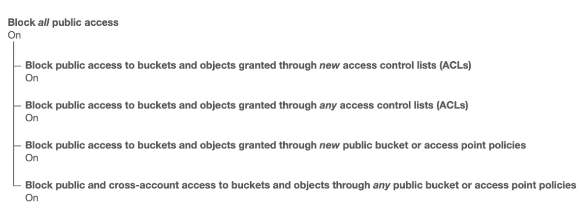
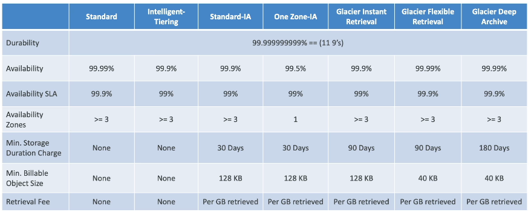
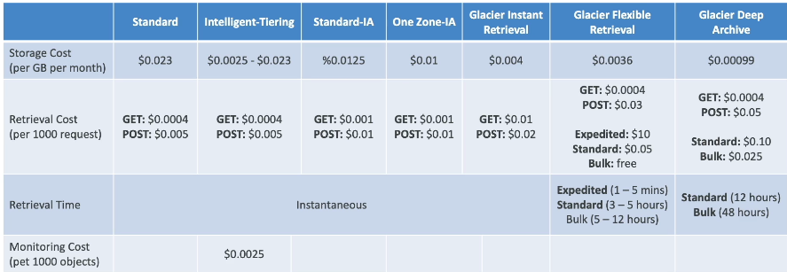

# AWS S3 Introduction

Sections:-
- [1. Amazon S3: Introduction](#1-amazon-s3-introduction)
- [2. Creating Your First S3 Bucket and Uploading Objects 🚀](#2-creating-your-first-s3-bucket-and-uploading-objects-🚀)
- [3. Amazon S3 Security](#3-amazon-s3-security)
- [4. Making a Bucket Policy](#4-making-a-bucket-policy)
- [5. Creating Static Websites with Amazon S3](#5-creating-static-websites-with-amazon-s3)
- [6. Enabling S3 Bucket for Static Website Hosting](#6-enabling-s3-bucket-for-static-website-hosting)
- [7. Versioning in Amazon S3](#7-versioning-in-amazon-s3)
- [8. S3 Bucket Versioning Practice](#8-s3-bucket-versioning-practice)
- [9. Amazon S3 Replication](#9-amazon-s3-replication)
- [10. Amazon S3 Replications Notes 🗂️](#10-amazon-s3-replications-notes-️)
- [11. Replication on Amazon S3](#11-replication-on-amazon-s3)
- [12. Amazon S3 Storage Classes](#12-amazon-s3-storage-classes)
- [13. S3 Storage Classes Demo](#13-s3-storage-classes-demo)
- [14. S3 Express One Zone Storage Class](#14-s3-express-one-zone-storage-class)
- [15. Q & A](#15-q--a)

---

## 1. Amazon S3: Introduction

Amazon S3 is a core building block of AWS, offering infinitely scalable storage. Many websites and AWS services rely on it. This section provides a step-by-step approach to understanding its main features.

### Use Cases for Amazon S3
There are numerous use cases for Amazon S3 due to its fundamental nature as storage:
*   Backup and storage for files and disks.
*   Disaster recovery by replicating data to another region. 🌍
*   Archival purposes for long-term, low-cost storage. 💾
*   Hybrid cloud storage, extending on-premises storage to the cloud. ☁️
*   Hosting applications and media files (videos, images, etc.). 🎬
*   Data lakes for storing and analyzing large datasets. 📊
*   Delivering software updates. 📦
*   Hosting static websites. 🌐

📌 **Example:**
*   Nasdaq stores seven years of data in S3 Glacier for archival.
*   Sysco runs analytics on its data using Amazon S3 for business insights.

### Buckets and Objects
Amazon S3 stores files into **buckets**, which can be thought of as top-level directories. The files within these buckets are called **objects**.

*   Buckets are created in your AWS account.
*   **Bucket names must be globally unique**. This means the name must be unique across all regions and all AWS accounts. This is the only thing that must be globally unique in AWS.
*   **Buckets are defined at the region level**. Even though the name is unique, the bucket exists within a specific AWS region.


⚠️ **Warning:** A common mistake for beginners is assuming S3 is a global service, but buckets are region-specific.

### Bucket Naming Conventions
📝 **Note:** While not essential to memorize, it's good to be aware of the naming conventions for S3 buckets:
*   Must contain no uppercase letters.
*   Must contain no underscores.
*   Must be between 3 and 63 characters long.
*   Must not be an IP address.
*   Must start with a lowercase letter or number.
*   Must NOT start with the prefix `xn--`
*   Must NOT end with the suffix `-s3alias`
*   Generally, using lowercase letters, numbers, and hyphens is safe.

### Objects and Keys

Objects are the files stored in S3. Each object has a **key**, which is the full path to the file.

📌 **Example:**
If you have a bucket, the top-level directory, and a file named `my_file.txt`, the key is `my_file.txt`.

If you nest the file in folders, then the key becomes the full path:- 
* s3://my-bucket/my_file.txt 
* s3://my-bucket/my_folder/another_folder/my_file.txt

The key is composed of a **prefix** and an **object name**.

📌 **Example:**
Using the previous example `s3://my-bucket/my_folder/another_folder/my_file.txt`:- 
* The prefix is `my_folder/another_folder/` 
* The object name is `my_file.txt`.

📝 **Note:** Amazon S3 doesn't have a concept of directories per se. Everything is a key, which is a long name containing slashes. Keys are made of a prefix and an object name.

### Object Values, Metadata, and Tags
*   **Values:** The content of the file (the body).
*   The maximum object size is 5 TB (5,000 GB).
*   If a file is larger than 5 GB, you must use the multi-part upload feature.
    *   For example, a 5 terabyte file must be uploaded in at least 1,000 parts of 5 gigabytes each.
*   **Metadata:** Key-value pairs that describe the object, set by the system or the user.
*   **Tags:** Unicode key-value pairs (up to 10) useful for security and lifecycle management.
*   **Version ID:** Present if versioning is enabled on the bucket.

With this introduction to Amazon S3 complete, let's explore the console to see how it works. 🚀

---

## 2. Creating Your First S3 Bucket and Uploading Objects 🚀

Let's walk through creating an S3 bucket and uploading your first objects.

### Bucket Creation 🏗️

1.  **Region Selection**: Choose the AWS region where you want to create your bucket. 🌍 Amazon S3 provides a global view of all your buckets across all regions.
2.  **Bucket Type** (May or May Not See):
    *   If you see the option, choose **General Purpose**. ✅
    *   If you don't see it, don't worry! It will default to General Purpose. ✅
    *   Directory buckets are for specific use cases not covered in this course.
3.  **Bucket Name**:
    *   Bucket names must be unique across all AWS accounts and regions. ⚠️
    *   💡 **Tip:** Use a personal naming convention to ensure uniqueness. 📌 **Example:** `stephane-demo-s3-v5`.
    *   If you get an error that the bucket name already exists, you'll need to choose a different name.
4.  **Object Ownership**: Leave ACLs disabled (recommended for security). ✅
5.  **Block Public Access**: Keep this enabled to block all public access for maximum security. ✅
6.  **Bucket Versioning**: Disable bucket versioning for now. We'll cover enabling it later. ✅
7.  **Tags**: No tags are needed at this stage. ✅
8.  **Default Encryption**:
    *   Use server-side encryption with Amazon S3 managed keys (SSE-S3). ✅
    *   Enable bucket key. ✅

With these settings configured (primarily the bucket name), go ahead and create your bucket.

### Uploading Objects 📤

1.  **Navigate to Your Bucket**: Once created, you'll see your bucket in the S3 console.
2.  **Upload Files**: Click the "Upload" button.
3.  **Add Files**: Select a file from your computer. 📌 **Example:** `coffee.jpg` from the S3 folder in your course materials.
4.  **Verify Destination**: Ensure the destination shows your bucket name.
5.  **Upload**: Click "Upload" to upload the file.

Now you should see your uploaded object in your S3 bucket!

### Object Details and URLs 🔗

1.  **Object Overview**: Click on the object to view its properties, including size, type, and object URL.
2.  **Opening the Object**: Clicking "Open" will display the object in your browser using a pre-signed URL.
3.  **Public URL**:
    *   The standard object URL will likely result in an "Access Denied" error because public access is blocked. ⚠️
    *   The "Open" button uses a pre-signed URL, which includes your credentials and allows you to view the object.
    *   We'll explore making objects publicly accessible later.

### Folders 📁

1.  **Create a Folder**: You can create folders within your bucket to organize your objects. 📌 **Example:** Create a folder named "images".
2.  **Upload to Folder**: Upload files directly into your newly created folder. 📌 **Example:** Upload `beach.jpg` into the "images" folder.
3.  **Folder Structure**: The S3 console provides a familiar folder structure similar to cloud storage services like Google Drive or Dropbox.
4.  **Deleting Folders**: To delete a folder, you must type `permanently delete` into the text input to confirm the deletion. This will delete all objects within the folder.

```
# Example of deleting a folder using the AWS CLI
aws s3 rm s3://your-bucket-name/your-folder-name --recursive
```

📝 **Note:** Remember to replace `your-bucket-name` and `your-folder-name` with your actual bucket and folder names.

That's it! You've successfully created an S3 bucket, uploaded objects, explored object URLs, and created folders. 🎉

---

## 3. Amazon S3 Security

Amazon S3 security can be implemented using several methods:

*   User-Based Security: IAM policies can authorize which API calls are allowed for a specific IAM user.
*   Resource-Based Security: This includes S3 Bucket policies and Object Access Control Lists (ACLs).
    *   Bucket Policies - Bucket wide rules from the S3 console - allows cross account. This is the **most common way to manage security on an S3 Bucket**. ✔️
    *   Object Access Control Lists (ACLs) - fine grain (can be disabled).
    *   Bucket Access Control Lists (ACLs) - less common (can be disabled).

Let's explore these in more detail.

### S3 Bucket Policies

S3 Bucket policies are bucket-wide rules that you can assign directly from the S3 console. They allow you to:

*   Grant access to a specific user.
*   Grant access to a user from another AWS account (cross-account access).
*   Make your S3 Buckets public.

> Object ACLs provide finer-grained security but can be disabled. Bucket ACLs are less common and can also be disabled. The most common way to manage security on an S3 Bucket is through Bucket policies.

**An IAM principal can access an S3 object if**:

* The User IAM permissions allow it **OR** the Resource policies allows it.
* **AND** There is no explicit deny in the action.

### Encryption

Another way to secure your S3 data is to encrypt the objects using encryption keys.

### S3 Bucket Policy Structure

S3 Bucket policies are JSON-based policies. 📌 **Example:**

```json
{
  "Version": "2012-10-17",
  "Statement": [
    {
      "Sid": "PublicRead",
      "Effect": "Allow",
      "Principal": "*",
      "Action": [
        "s3:GetObject"
      ],
      "Resource": [
        "arn:aws:s3:::examplebucket/*"
      ]
    }
  ]
}
```

Let's break down the key components:

*   **Resource**: Specifies the buckets and objects to which the policy applies. In the example above, it applies to every object within the `exampleBucket`. The `*` indicates all objects.
*   **Effect**: Determines whether to `Allow` or `Deny` actions.
*   **Action**: Defines the API actions that are allowed or denied. In this example, `GetObject` is allowed.
*   **Principal**: Specifies the account or user to which the policy applies. A `*` indicates that the policy applies to anyone.

In the example above, the policy allows anyone to retrieve an object from the `exampleBucket`. This effectively sets public read access on all objects within the bucket.

You can use S3 Bucket policies to:

*   Grant public access to the bucket.
*   Force objects to be encrypted at upload.
*   Grant access to another AWS account.

### Use Cases

*   **Public Access - Use Bucket Policy**: Attach an S3 Bucket policy that allows public access to allow website visitors to access files within your S3 Bucket.


*   **User Access to S3 - IAM Permissions**: Assign IAM permissions to a user through a policy to allow that user to access S3 Buckets.


*   **EC2 Instance Access - Use IAM Roles**: Use an IAM role with the correct IAM permissions to allow an EC2 instance to access S3 Buckets. IAM users are not appropriate for EC2 instances.


*   **Cross-Account Access - Use Bucket Policy**: Use a Bucket Policy to allow an IAM user in another AWS account to make API calls to your S3 Buckets.


### Block Public Access

AWS provides Bucket settings for Block Public Access as an extra layer of security to prevent data leaks. ⚠️ **Warning:** **Even if an S3 Bucket policy makes a bucket public, these settings, if enabled, will prevent the bucket from actually becoming public.**



💡 **Tip:** If you know that your bucket should never be public, leave these settings enabled. You can also set this at the account level if none of your S3 Buckets should ever be public.

---

## 4. Making a Bucket Policy

To access a file (e.g., a coffee file) from a public URL, you need to create a bucket policy. Here's how:

1.  Navigate to the **Permissions** tab of your S3 bucket.

2.  Allow public access from the bucket settings:
    *   Initially, all public access is blocked.
    *   Edit the settings and uncheck the box that blocks public access.
    *   ⚠️ **Warning:** Only disable this if you intend to set a public bucket policy. Making your bucket public can lead to data leaks if you store sensitive information.

3.  Verify that the **Permissions overview** indicates that **objects can be public**. This confirms the first step is complete.

4.  Create a Bucket Policy:
    *   Scroll down to the **Bucket policy** section.
    *   Click **Edit** to create a new policy.

5.  Use the AWS Policy Generator:
    *   You can find policy examples in the AWS documentation to understand different use cases.
    *   Alternatively, use the **AWS Policy Generator** for a guided approach.

6.  Configure the Policy Generator:
    *   Select **S3 Bucket Policy** as the policy type.
    *   Set the **Effect** to "Allow".
    *   Set the **Principal** to "\*" to allow access to anyone.
    *   Choose "**GetObject**" as the action to allow reading objects.

7.  Specify the Amazon Resource Name (ARN):
    *   The ARN must be the bucket name followed by "/*".
    *   📌 **Example:**
        *   Go back to your S3 bucket and copy the bucket ARN.
        *   Paste the ARN into the Policy Generator.
        *   Append "/*" to the ARN. This applies the `GetObject` action to all objects within the bucket.
        ```
        arn:aws:s3:::your-bucket-name/*
        ```
    *   Add the statement and generate the policy.

8.  Apply the Policy:
    *   Copy the generated policy from the Policy Generator.
    *   Paste it into the Bucket Policy editor in the S3 console.
    *   📝 **Note:** The policy allows `GetObject` actions from anyone on any object in the bucket.
    *   Save the changes. Ensure there are no extra spaces in the policy.

9.  Verify the Policy:
    *   Confirm that the bucket policy has been applied correctly.

10. Test Public Access:
    *   Navigate to an object in your bucket (e.g., `coffee.jpg`).
    *   Copy the object URL.
    *   Paste the URL into your browser.
    *   The image should now be publicly visible.

🎉 Your image (and any other objects in the bucket) is now publicly accessible.

---

## 5. Creating Static Websites with Amazon S3

Amazon S3 can be used to host static websites and make them accessible on the internet. The website URL will depend on the AWS region where you create the S3 bucket.

The URLs look very similar:

*   `s3-website-region.amazonaws.com` Or,
*   `s3-website.region.amazonaws.com`

The only difference is the dash (`-`) versus the dot (`.`). It's not crucial to memorize this, but it's good to be aware of.

To host a website, you'll need:

1.  An S3 bucket. 🗂️
2.  Files within the bucket (HTML, images, etc.). 🖼️
3.  Enable the bucket for website hosting. ⚙️

This setup allows users to access your S3 bucket as a website.

However, this will only work if public read access is enabled on the S3 bucket. This is where S3 bucket policies come into play.

If you encounter a `403 Forbidden` error after enabling your S3 bucket for website hosting, it means your bucket is not publicly accessible. 🚫

To resolve this, you must attach an S3 bucket policy that allows public read access.

---

## 6. Enabling S3 Bucket for Static Website Hosting

Let's enable our S3 bucket to function as a static website. 🌐

First, we'll upload the necessary files to our bucket.

1.  Upload `beach.jpg` to the bucket. 🏖️
2.  Verify that both `beach.jpg` and `coffee.jpg` are present in the bucket. ✅

Next, configure the static website hosting settings:

1.  Navigate to the **Properties** tab of your bucket. ⚙️
2.  Scroll down to the **Static website hosting** section and click **Edit**. ✍️
3.  Enable **Static website hosting**.
4.  Specify `index.html` as the **Index document**. This will serve as the default homepage. 🏠

⚠️ **Warning:** To enable the website endpoint, ensure all content is publicly readable. We configured this in the previous lecture.

5.  Save the changes. 💾

Now, upload the `index.html` file:

1.  Go back to the **Objects** tab. 📁
2.  Click **Upload**.
3.  Add the `index.html` file.
4.  Click **Upload**. 🚀

With the `index.html` file uploaded, verify the website endpoint:

1.  Return to the **Properties** tab. ⚙️
2.  Scroll down to the **Static website hosting** section.
3.  You should now see a **Bucket website endpoint** URL. 🔗
4.  Copy the URL and paste it into your browser. 💻

You should see the content defined in your `index.html` file (e.g., "I love coffee. Hello world!" and the `coffee.jpg` image). 🎉

📌 **Example:** The `index.html` file might contain the following:

```html
<h1>I love coffee. Hello world!</h1>

```

To access other files directly:

1.  Right-click on `coffee.jpg` in the S3 console and select **Open in new tab**. ☕
2.  This will display the public URL of the image.

You can also access other images, like `beach.jpg`, using its corresponding URL. 🌊

Since the S3 bucket policy is set to public, all files are accessible via their respective URLs. 👍

Our S3 bucket is now successfully enabled for static website hosting! 🥳

---

## 7. Versioning in Amazon S3

Versioning in Amazon S3 allows you to keep multiple versions of your objects in one bucket. This is a crucial feature for data protection and recovery. Let's explore how it works and why it's a best practice.

To enable versioning, you need to configure it at the bucket level. Once enabled, every object upload creates a new version.

Here's how versioning works:

1.  Enable versioning on your S3 bucket. ⚙️
2.  When a user uploads a file to a specific key (e.g., `index.html`), S3 creates version 1 of that file. ⬆️
3.  If the user re-uploads a file with the same key, S3 creates version 2, and so on. Subsequent uploads create version 3, version 4, etc. 🔄

It is a **best practice** to version your buckets. Why? 🤔

*   It protects against unintended deletes. 🛡️ When you "delete" a version, S3 actually adds a delete marker. The original version remains stored and can be restored.
*   It allows you to easily roll back to a previous version. ⏪ If you want to revert to the state of your files from a few days ago, you can easily retrieve the older versions.

📝 **Note:** Here are some important considerations:

*   Any file uploaded *before* versioning was enabled will have a version ID of "null".
*   Suspending versioning does *not* delete any existing versions. It simply stops creating new versions. This is a safe operation. ✅

Let's consider a scenario:

📌 **Example:**

You have a file named `website.txt` in your S3 bucket.

1.  You upload `website.txt` *before* enabling versioning. Its version ID is `null`.
2.  You enable versioning on the bucket. ⚙️
3.  You upload a new version of `website.txt`. This becomes version 1 (with a unique version ID). ⬆️
4.  You upload another version of `website.txt`. This becomes version 2 (with a different unique version ID). 🔄
5.  You "delete" version 2. A delete marker is added, but version 2 is still stored. 🗑️
6.  You can restore version 2 by removing the delete marker. ⏪

This example illustrates how versioning provides a safety net for your data in S3.

---

## 8. S3 Bucket Versioning Practice

Let's explore S3 bucket versioning and how it works.

First, you need to enable versioning for your S3 bucket:

1.  Go to the **Properties** tab of your S3 bucket.
2.  Find the **Bucket Versioning** setting.
3.  Edit the setting and enable versioning. ⚙️

Enabling bucket versioning ensures that any file overrides will create new versions in your bucket.

Let's update a website file to demonstrate versioning:

1.  Locate your website URL. 🌐
2.  Edit your `index.html` file. For 📌 **example**, change "I love coffee" to "I really love coffee."
3.  Upload the updated `index.html` file to your S3 bucket. ⬆️

Now, refresh your webpage. You should see the updated content ("I REALLY love coffee").

To see the different versions of your files, enable the "Show versions" toggle in the S3 console. You'll notice:

*   Files uploaded before versioning was enabled have a **null** version ID.
*   The `index.html` file has multiple versions: one with a **null** version ID (the original file) and one with a unique version ID (the updated file).

Thanks to versioning, you can easily roll back to previous versions of your page. For 📌 **example**, let's revert from "I REALLY love coffee" back to "I love coffee":

1.  Ensure "Show versions" is enabled.
2.  Click on the version ID of the version you want to restore (the one with "I love coffee").
3.  Delete the specific version ID. ⚠️ **Warning:** This is a permanent delete and cannot be undone.
4.  Type "permanently delete" in the text box and click "Delete objects."

Refresh your webpage. You should now see "I love coffee" again.

Now, let's explore deleting objects with versioning enabled:

1.  **Disable "Show versions."** It's important, otherwise it will opt for the permanent delete.
2.  Select the `coffee.jpg` file and delete it.
3.  Type "delete" and click "Delete objects." 📝 **Note:** This doesn't permanently delete the underlying object; it adds a delete marker.

If you refresh your webpage, the `coffee.jpg` image will be gone. However, if you enable "Show versions," you'll see a delete marker on the `coffee.jpg` file. The original `coffee.jpg` file is still in your bucket, but it's being hidden by the delete marker.

To restore the `coffee.jpg` image:

1.  Ensure "Show versions" is enabled. 
2.  Click on the delete marker for `coffee.jpg`.
3.  Delete the delete marker. ⚠️ **Warning:** This is a permanent delete of the delete marker.
4.  Type "permanently delete" in the text box and click "Delete objects."

Refresh your webpage. The `coffee.jpg` image should now be visible again.

💡 **Tip:** Experiment with versioning by adding multiple file versions, deleting them, and observing the results. This will help you understand how versioning works and how to manage your S3 objects effectively.

---

## 9. Amazon S3 Replication

Amazon S3 Replication comes in two flavors:

*   **CRR**: Cross-Region Replication
*   **SRR**: Same-Region Replication

The core idea is to set up asynchronous replication between an S3 Bucket in one region (source) and a target S3 Bucket, potentially in another region.

To configure replication:

1.  Enable **Versioning** in both the source and destination buckets. 🔄
2.  For CRR, ensure the two buckets are in **different** AWS regions. 🌍➡️🌍
3.  For SRR, the two buckets must be in the **same** AWS region. 🌍➡️🌍

📝 **Note:** The buckets can reside in different AWS accounts.

Replication occurs asynchronously in the background. ⚙️

To ensure replication functions correctly, grant appropriate IAM permissions to the S3 service. This allows it to read from and write to the specified buckets. 🔑

Use Cases:

*   **CRR (Cross-Region Replication):**
    *   Compliance requirements. ✅
    *   Lower latency access to data by placing it closer to users in another region. 🚀
    *   Data replication across different AWS accounts. 🤝
*   **SRR (Same-Region Replication):**
    *   Aggregate logs from multiple S3 Buckets within the same region. 🪵
    *   Live replication between production and test environments. 🧪➡️✅

---

## 10. Amazon S3 Replications Notes 🗂️

Here are some important points to remember about Amazon S3 Replication:

*   After enabling replication, only **new objects** will be replicated. 🆕
*   To replicate existing objects, you must use the **S3 Batch Replication** feature. 🔄 This feature also replicates objects that have failed replication.

### S3 Batch Replication

S3 Batch Replication is useful for:

1.  Replicating existing objects.
2.  Replicating objects that have failed replication.

### Delete Markers

*   You can replicate delete markers from the source bucket to the target bucket. 🗑️ This is an optional setting.
*   ⚠️ **Warning:** If a deletion occurs with a specific version ID, it will **not** be replicated. This is to prevent malicious or accidental permanent deletions from propagating across buckets.

### No Chaining

*   There is no chaining of replications. 🔗
*   This means that if:
    *   Bucket 1 replicates to Bucket 2
    *   Bucket 2 replicates to Bucket 3
*   Then, objects in Bucket 1 will **not** be replicated to Bucket 3.

```
Bucket 1 --> Bucket 2 (Replication)
Bucket 2 --> Bucket 3 (Replication)
Bucket 1 -/-> Bucket 3 (No Replication)
```

---

## 11. Replication on Amazon S3

Let's walk through how to set up replication on Amazon S3.

1.  **Create an Origin Bucket**:
    *   Choose a region. 📌 **Example:** `eu-west-1`, and go to that region.
    *   Create a new bucket. 📌 **Example:** `s3-stephane-bucket-origin-v2`.
    *   Enable **versioning**. ⚠️ **Warning:** Replication only works if versioning is enabled!

2.  **Create a Target (Replica) Bucket**:
    *   Choose a region. This can be the same as the origin bucket for same-region replication, or different for cross-region replication. 📌 **Example:** `us-east-1`. Go to that region.
    *   Create a second bucket. 📌 **Example:** `s3-stephane-bucket-replica-v2`.
    *   Enable **versioning** on the target bucket.

3.  **Upload a File to the Origin Bucket**:
    *   Upload a file to the origin bucket. 📌 **Example:** `beach.jpg`.
    *   📝 **Note:** This file won't be replicated yet, as replication hasn't been configured.

4.  **Configure Replication Rule on the Origin Bucket**:
    *   Go to **Management** > **Replication rules** in the origin bucket.
    *   Create a new replication rule.
        *   Give it a name. 📌 **Example:** `DemoReplicationRule`.
        *   Enable the rule.
        *   Set the scope to "Apply to all objects in the bucket".
        *   Specify the destination bucket.
            *   Choose "Bucket in this account".
            *   Enter the target bucket name.
            *   Verify the destination region is correctly identified.
        *   IAM Role: Choose dropdown **Create a new IAM role** for replication.
        *   Choose whether to replicate existing objects.
            *   No: Only new uploads will be replicated. We can proceed with this.
            *   Yes: Use S3 Batch Operations to replicate existing objects. This is separate from the replication feature itself.

5.  **Test Replication**:
    *   Upload a new file to the origin bucket. 📌 **Example:** `coffee.jpg`.
    *   Check the target bucket. It may take a few seconds, but the file should be replicated.
    *   Verify the version ID of the replicated object in the target bucket matches the origin bucket.

6.  **Delete Marker Replication**:
    *   By default, delete markers are not replicated.
    *   To enable delete marker replication:
        *   Edit the replication rule.
        *   Enable "Delete marker replication".
    *   If you delete a file in the origin bucket (which creates a delete marker because versioning is enabled), the delete marker will be replicated to the target bucket.

7.  **Permanent Deletes**:
    *   If you delete a specific version of a file (permanent delete) in the origin bucket, it will **not** be replicated to the target bucket. Only delete markers are replicated, not the actual deletion of specific versions.

💡 **Tip:** Delete markers are replicated, but permanent deletes are not.

---

## 12. Amazon S3 Storage Classes

Let's explore the different storage classes available in Amazon S3. Understanding these classes is crucial, especially for the exam. 📚

- Amazon S3 Standard - General Purpose
- Amazon S3 Standard Infrequent Access (IA)
- Amazon S3 One Zone Infrequent Access
- Amazon S3 Glacier Instant Retrieval
- Amazon S3 Glacier Flexible Retrieval
- Amazon S3 Glacier Deep Archive
- Amazon S3 Intelligent-Tiering

When creating an object in S3, you can choose its storage class. You can also modify the storage class manually or use S3 Lifecycle configurations to automate object movement between classes. 🔄

### Durability and Availability

Before diving into the classes, let's define durability and availability:

*   **Durability:** Represents how resistant your data is to loss. Amazon S3 boasts exceptional durability, often referred to as "11 nines" (99.999999999%). This means that, on average, if you store 10 million objects, you might expect to lose a single object once every 10,000 years. 🤯 The durability is the same for all storage classes.
*   **Availability:** Represents how readily available the service is. This varies depending on the storage class.

For example, **S3 Standard** offers **99.99% availability**. This means that, on average, the service might be **unavailable for about 53 minutes per year**. During this time, you could experience occasional **errors or failed requests** when interacting with S3.

💡 **Tip:** Always design your applications to handle such rare disruptions gracefully — include **retry logic**, **error handling**, and possibly **fallback mechanisms** to ensure reliability.

### S3 Storage Classes Overview

Here's a breakdown of the different S3 storage classes:

1.  **S3 Standard - General Purpose:**
    *   Availability: 99.99% (approximately 53 minutes of unavailability per year).
    *   It is default storage class.
    *   Used for frequently accessed data.
    *   Low latency and high throughput.
    *   Can withstand two concurrent facility failures.
    *   Use Cases: Big data analytics, mobile and gaming applications, content distribution. 🚀

2.  **S3 Standard-Infrequent Access (IA):**
    *   Availability: 99.9% (slightly less available than S3 Standard).
    *   For data accessed less frequently but requiring rapid access when needed.
    *   Lower cost than S3 Standard, but with retrieval costs. 💰
    *   Use Cases: Disaster recovery and backups. 💾

3.  **S3 One Zone-Infrequent Access (One Zone-IA):**
    *   High durability within a single Availability Zone (AZ). ⚠️ Data loss can occur if the AZ is destroyed.
    *   Availability: 99.5% (lower than S3 Standard-IA).
    *   Use Cases: Storing secondary copies of backups (e.g., on-premises data) or data that can be recreated. ♻️

4.  **Glacier Storage Classes:**
    *   Low-cost object storage for archiving and backup. 🧊
    *   Pricing: Pay for storage plus retrieval costs.

    *   **Glacier Instant Retrieval:**
        *   Milliseconds retrieval times. ⚡
        *   Suitable for data accessed once a quarter.
        *   Minimum storage duration: 90 days.
    *   **Glacier Flexible Retrieval:**
        *   Offers flexibility in retrieval times.
        *   Minimum storage duration: 90 days.
        *   Retrieval Options:
            *   Expedited: 1-5 minutes.
            *   Standard: 3-5 hours.
            *   Bulk: 5-12 hours (free).
    *   **Glacier Deep Archive:**
        *   Lowest-cost storage option for long-term archiving. ⏳
        *   Minimum storage duration: 180 days.
        *   Retrieval Options:
            *   Standard: 12 hours.
            *   Bulk: 48 hours.

5.  **S3 Intelligent-Tiering:**
    *   Automatically moves objects between access tiers based on usage patterns. 🧠
    *   Incurs a small monthly monitoring and auto-tiering fee.
    *   No retrieval charges.
    *   Tiers:
        *   Frequent Access (default).
        *   Infrequent Access (for objects not accessed for 30 days).
        *   Archive Instant Access (for objects not accessed for 90 days).
        *   Archive Access (optional, configurable from 90 to 700+ days).
        *   Deep Archive Access (optional, configurable from 180 to 700+ days).

S3 Intelligent-Tiering simplifies storage management by automatically optimizing costs. 😌

### Comparing Storage Classes

While you don't need to memorize specific numbers, understanding the trade-offs between durability, availability, and cost is essential. Durability remains consistent across all classes (11 nines), while availability and cost vary.



### Pricing Considerations

Pricing varies by region (e.g., us-east-1). Review the pricing details on your own to gain a better understanding of the cost implications for each storage class. 💰



Understanding the names of the classes will help you make sense of their features and pricing.

---

## 13. S3 Storage Classes Demo

Let's explore S3 storage classes and how to manage them.

First, we'll create a new S3 bucket. Let's name it `s3-storage-classes-demos-2022`. You can create it in any region.

Next, we'll upload an object to the bucket.

1.  Go to your bucket.
2.  Click on "Upload".
3.  Click on "Add files".
4.  Choose a file (e.g., `coffee.JPEG`).

Now, let's examine the storage class options.

*   After uploading, navigate to the object's properties.
*   Under "Storage class", you'll see a range of options.

Here's a breakdown of the available S3 storage classes:

*   **S3 Standard:** The default storage class.
*   **Intelligent-Tiering:** 🤖 AWS automatically tiers data based on access patterns. Ideal if you're unsure about your data usage.
*   **Standard-IA (Infrequent Access):** Suitable for data accessed infrequently but requiring low latency.
*   **One-Zone-IA:** Data is stored in a single Availability Zone (AZ). ⚠️ **Warning:** Risk of data loss if the AZ is destroyed.
*   **Glacier Instant Retrieval:** For archival data with immediate retrieval needs.
*   **Glacier Flexible Retrieval:** For archival data with retrieval times ranging from minutes to hours.
*   **Glacier Deep Archive:** The lowest-cost storage option for long-term archival, with retrieval times of several hours.
*   **Reduced Redundancy (Deprecated):** Not covered in this course.

📌 **Example:** Let's set the storage class to "Standard-IA" during upload.

After uploading, you can verify the storage class of the object. It should now be "Standard-IA".

You can also change the storage class of an existing object:

1.  Go to the object's properties.
2.  Scroll down to the "Storage class" section.
3.  Click "Edit".
4.  Select a new storage class (e.g., "One-Zone-IA").
5.  Save the changes.

The object will now be stored using the selected storage class. For instance, changing to "One-Zone-IA" means the object is stored in only one Availability Zone.

You can further edit and move the object to other storage classes like "Glacier-Instant-Retrieval" or "Intelligent-Tiering" as needed.

The real power comes from automating these transitions.

To automate moving objects between storage classes, you can use Lifecycle Rules:

1.  Go to your bucket.
2.  Click on the "Management" tab.
3.  Click on "Create lifecycle rule".
4.  Give the rule a name (e.g., "DemoRule").
5.  Apply the rule to all objects in the bucket.
6.  Choose "Move current versions of objects between storage classes".
7.  Define the transitions:

    *   After 30 days, transition to Standard-IA.
    *   After 60 days, transition to Intelligent-Tiering.
    *   After 180 days, transition to Glacier-Flexible-Retrieval.

You can review all the transitions you've defined.

Lifecycle rules allow you to automate the movement of objects between different storage tiers based on their age.

```
# Example Lifecycle Rule Configuration
{
  "Rules": [
    {
      "ID": "DemoRule",
      "Filter": {},
      "Status": "Enabled",
      "Transitions": [
        {
          "Days": 30,
          "StorageClass": "STANDARD_IA"
        },
        {
          "Days": 60,
          "StorageClass": "INTELLIGENT_TIERING"
        },
        {
          "Days": 180,
          "StorageClass": "GLACIER"
        }
      ]
    }
  ]
}
```

📝 **Note:** Carefully consider the implications of each storage class and the transition rules you define to optimize costs and performance.

💡 **Tip:** Regularly review your storage class usage and lifecycle rules to ensure they align with your data access patterns and business requirements.

---

## 14. S3 Express One Zone Storage Class

The **S3 Express One Zone storage class** is unique compared to other S3 storage classes. It deserves special attention because of its **performance characteristics and availability trade-offs**.

### ⚡ What Makes It Different?

* Unlike standard S3 buckets, S3 Express One Zone uses a **directory bucket**.
* Objects are stored in a **single Availability Zone (AZ)**, not replicated across multiple AZs.
* You can **choose which AZ** to store your data in.

### 🚀 Performance Benefits

* Handles **hundreds of thousands of requests per second**.
* Achieves **single-digit millisecond latency**.
* Offers up to **10x the performance of S3 Standard**.
* Costs are about **50% lower** compared to S3 Standard.

📌 **Code Example: Creating a directory bucket in AWS CLI**

```bash
aws s3express create-bucket \
  --bucket my-express-bucket \
  --availability-zone us-east-1a
```

### ⚠️ Availability Trade-offs

* Durability remains strong, but availability is **lower** than multi-AZ storage.
* Since data resides in **only one AZ**, any outage in that AZ directly impacts your data access.

### 🎯 Use Cases

S3 Express One Zone is ideal when **latency and performance** are top priorities:

* 🔹 **AI & ML training** (e.g., SageMaker model training)
* 🔹 **Financial modeling**
* 🔹 **Media processing**
* 🔹 **High-performance computing (HPC)**
* 🔹 **Data-intensive applications**
* 🔹 **Latency-sensitive apps**

It integrates seamlessly with services like **SageMaker, Athena, EMR, and Glue**, making it a strong choice for big data and analytics workloads.

📝 **Note:** This storage class is best when you need **co-location of compute and storage** within the same AZ, helping reduce latency and even networking costs.

### 📊 S3 Standard vs. S3 Express One Zone

| Feature                             | **S3 Standard**                                   | **S3 Express One Zone**                                                                       |
| ----------------------------------- | ------------------------------------------------- | --------------------------------------------------------------------------------------------- |
| **Availability Zone (AZ) Coverage** | Multi-AZ (3+ AZs)                                 | Single AZ                                                                                     |
| **Durability**                      | 99.999999999% (11 9s)                             | High, but depends on single AZ                                                                |
| **Availability**                    | 99.99%                                            | Lower (due to single AZ risk)                                                                 |
| **Performance**                     | High                                              | ⚡ Ultra-high (10x S3 Standard)                                                                |
| **Latency**                         | Low                                               | 🚀 Single-digit ms latency                                                                    |
| **Cost**                            | Standard pricing                                  | \~50% lower than S3 Standard                                                                  |
| **Storage Type**                    | Standard bucket                                   | Directory bucket                                                                              |
| **Best For**                        | General workloads needing durability & resilience | Latency-sensitive, compute-heavy workloads (AI/ML, HPC, financial modeling, media processing) |
| **Integration**                     | Works with all AWS services                       | Optimized for SageMaker, Athena, EMR, Glue, etc.                                              |

💡 **Tip:** Use **S3 Standard** when durability and availability are most important, but consider **S3 Express One Zone** when **performance and cost** outweigh the risks of single-AZ dependency.

---

## 15. Q & A

### Question 3:

You have updated an S3 bucket policy to allow IAM users to read/write files in the S3 bucket, but one of the users complains that he can't perform a **PutObject** API call. What is a possible cause for this?

**Options:**

1. The S3 bucket policy must be wrong
2. The user is lacking permissions
3. The IAM user must have an explicit DENY in the attached IAM Policy
4. You need to contact AWS Support to lift this limit

<details>

<summary>Explanation</summary>

* In AWS, **explicit DENY always takes precedence** over any ALLOW, even if the S3 bucket policy grants permissions.
* So if the user's IAM policy contains an **explicit DENY** for the `s3:PutObject` action, it will override the bucket policy and prevent the user from uploading objects.

#### ❌ Why Not the Other Options?

* **The S3 bucket policy must be wrong** → Not correct because the bucket policy already allows read/write.
* **The user is lacking permissions** → This would be true if there were no permissions, but here the bucket policy allows it. The problem is stronger: an explicit DENY in IAM.
* **You need to contact AWS Support to lift this limit** → Not applicable. This is not a service limit issue but a permissions conflict.

👉 The key takeaway: **Explicit DENY in IAM > ALLOW in S3 Bucket Policy**.

✅ **Correct Answer**: **The IAM user must have an explicit DENY in the attached IAM Policy**

</details>

---

### Question 7:

Which of the following is **NOT** a Glacier Flexible retrieval mode?

**Options:**

1. Instant (10 seconds)
2. Expedited (1 – 5 minutes)
3. Standard (3 – 5 hours)
4. Bulk (5 – 12 hours)

<details>

<summary>Explanation</summary>

Amazon S3 Glacier offers multiple retrieval modes depending on cost and retrieval time.

* **Flexible Retrieval (Glacier):**

  * **Expedited:** 1–5 minutes ⏱️
  * **Standard:** 3–5 hours ⏳
  * **Bulk:** 5–12 hours 🕒

* **Instant Retrieval (10 seconds)** is **NOT part of Glacier Flexible Retrieval**. Instead, it belongs to **S3 Glacier Instant Retrieval**, a **separate storage class** designed for data that requires immediate access but still needs cost efficiency.

✅ Correct Answer: **Instant (10 seconds)**

#### ❌ Why Not the Other Options?

* **Expedited (1–5 minutes):** Valid Glacier Flexible retrieval option.
* **Standard (3–5 hours):** Valid Glacier Flexible retrieval option.
* **Bulk (5–12 hours):** Valid Glacier Flexible retrieval option.

👉 **Key takeaway:**
If you see **Instant (10 seconds)**, think **S3 Glacier Instant Retrieval class**, not Glacier Flexible Retrieval mode.

</details>

---

### Question 6:

Which of the following is **NOT** a Glacier Deep Archive retrieval mode?

**Options:**

1. Expedited (1–5 minutes)
2. Standard (12 hours)
3. Bulk (48 hours)

<details>

<summary>Explanation</summary>

Amazon S3 **Glacier Deep Archive** is designed for **long-term archival storage** with the **lowest cost** but with **longer retrieval times**. It only supports two retrieval modes:

* **Standard:** \~12 hours
* **Bulk:** \~48 hours

⚠️ **Expedited (1–5 minutes)** retrieval is available in **S3 Glacier Flexible Retrieval**, not in Glacier Deep Archive. Deep Archive does not support expedited retrievals because it is optimized for data that is **rarely accessed** and retrieval speed is not a priority.

✅ Correct Answer: **Expedited (1–5 minutes)**

#### ❌ Why Not the Other Options?

* **Standard (12 hours):** Valid Deep Archive retrieval mode.
* **Bulk (48 hours):** Valid Deep Archive retrieval mode.

👉 **Key takeaway:**
If you need **faster retrievals (minutes to hours)** → use **S3 Glacier Flexible Retrieval**.
If you need **ultra-low-cost, long-term storage with slow retrieval (12–48 hrs)** → use **S3 Glacier Deep Archive**.

</details>

---

