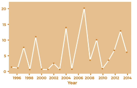
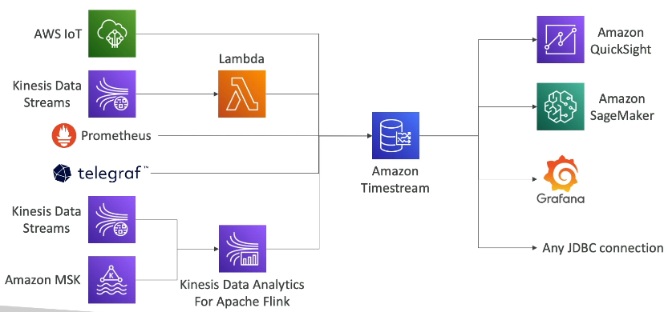

# Databases In Aws

Sections:-
- [1. Choosing the right database](#1-choosing-the-right-database)
- [2. Amazon RDS Summary](#2-amazon-rds-summary)
- [3. Amazon Aurora Summary](#3-amazon-aurora-summary)
- [4. Amazon ElastiCache](#4-amazon-elasticache)
- [5. DynamoDB](#5-dynamodb)
- [6. S3](#6-s3)
- [7. DocumentDB: Aurora for MongoDB](#7-documentdb-aurora-for-mongodb)
- [8. Neptune](#8-neptune)
- [9. Amazon Keyspaces: Managed Apache Cassandra on AWS](#9-amazon-keyspaces-managed-apache-cassandra-on-aws)
- [10. Amazon Timestream: A Time Series Database](#10-amazon-timestream-a-time-series-database)
- [Q & A](#q--a)

---

## 1. Choosing the right database

Choosing the right database on AWS depends on your application's **workload characteristics**, data model, access patterns, and business requirements. AWS offers a wide variety of managed database solutions, and during the exam, you'll be expected to match the best option for a given scenario.

### 📊 Key Considerations When Choosing a Database

When evaluating which AWS database service to use, consider the following:

- Is the workload **write-heavy**, **read-heavy**, or **balanced**?
- Will the workload **fluctuate** or stay consistent during the day?
- What is the **total data volume** and how long will it be stored?
- Will the dataset **grow** over time?
- What is the **average object size**?
- How frequently will data be **accessed** and how?
- What are the **durability** requirements?
- What is the **source of truth** for your data?
- Are there any **latency** requirements?
- How many **concurrent users** will access the database?
- What is the **data model**: structured, semi-structured, or unstructured?
- Will you need to run **joins** or complex **queries**?
- Do you require a **strong schema**, or is **schema flexibility** important?
- Will the database support **reporting** or **analytics**?
- Do you need **search** functionality?
- Do you prefer a **relational** database or a **NoSQL** database?
- Are there any **licensing costs** involved?
- Are you open to using **cloud-native** solutions like Amazon Aurora?

💡 **Tip:**  
Always base your choice on the **architecture and workload described in the question**. There's no one-size-fits-all answer.

### 📚 Database Categories on AWS

AWS provides several types of databases tailored to different use cases. Here's a quick overview:

#### a. 🗃️ Relational Databases (RDBMS)

Used when you need **SQL support** and **online transaction processing (OLTP)**.

- **Amazon RDS**
- **Amazon Aurora**

📌 **Example:**  
Ideal for applications that require **joins**, **ACID transactions**, and structured data.

#### b. 🧱 NoSQL Databases

Provide **flexibility** in data structure, often lacking joins and SQL support (no joins, no SQL).

- **Amazon DynamoDB** (~JSON)
- **Amazon ElastiCache** (~ key-value)
- **Amazon Neptune** (~ graphs)
- **Amazon DocumentDB** (For MongoDB)
- **Amazon Keyspaces** (For Apache Cassandra)

📝 **Note:**  
These databases are more scalable and are optimized for **specific NoSQL models** (key-value, document, graph, etc.).

#### c. 🗂️ Object Stores

Used to store large unstructured objects like files and backups.

- **Amazon S3** (for active object storage)
- **Amazon Glacier** (for archival and backup)

📌 **Example:**  
S3 is often used as a basic, scalable, and durable "database" for big object storage.

#### d. 📈 Data Warehousing & Analytics

Optimized for **business intelligence** (BI), **reporting**, and **analytics at scale** (SQL Analytics).

- **Amazon Redshift** (OLAP)
- **Amazon Athena**
- **Amazon EMR**

📝 **Note:**  
Use these when running complex **analytical queries** on large datasets.

#### e. 🔍 Search Databases

Enable full-text search and indexing for unstructured or semi-structured data.

- **Amazon OpenSearch Service**

📌 **Example:**  
Use OpenSearch when you need fast, flexible searching over large volumes of text data.

#### f. 🧬 Graph Databases

Used to model and traverse **relationships** between data entities.

- **Amazon Neptune**

📌 **Example:**  
Ideal for social networks, recommendation engines, and fraud detection.

#### g. 📓 Ledger Databases

Immutable and cryptographically verifiable **transaction logs**.

- **Amazon QLDB** (Quantum Ledger Database)

📝 **Note:**  
Use when you need an **auditable**, tamper-evident log of data changes.

#### h. ⏱️ Time Series Databases

Optimized for **time-stamped** data like metrics, logs, and events.

- **Amazon Timestream**

📌 **Example:**  
Best for IoT, DevOps, and real-time monitoring use cases.

### 📝 Final Notes

- You **don’t need to memorize** everything from this overview.
- All database types will be covered in **detail** throughout this section.
- Additional database services may be covered later in the **Data & Analytics** section.

💡 **Tip:**  
Focus on **matching features to use cases**—understanding when and why to use each service is key for the exam.

---

## 2. Amazon RDS Summary

Here's a recap of key concepts related to Amazon RDS. If you need more detailed information, refer back to the individual lectures on each topic.

Amazon RDS is a managed relational database service that supports various database engines:

*   PostgreSQL
*   MySQL
*   Oracle
*   SQL Server
*   DB2
*   MariaDB
*   Custom versions of RDS

When using Amazon RDS, you need to provision:

*   RDS instance size 🖥️
*   EBS volume type and size 💾

While you provision these resources, keep in mind that auto-scaling is available for the storage layer.

To enhance read performance:

*   Amazon RDS supports **read replicas** to scale read capabilities. 🚀
    *   📌 **Example:** Use read replicas for applications running analytics against a production database.

For high availability:

*   You can use **Multi-AZ** to have a standby database. 🛡️
    *   📝 **Note:** The standby database is only for disaster recovery and cannot be used for querying.

Security is paramount:

*   IAM is used for security. 🔑
    *   You can use username/password or IAM authentication (for some database engines).
*   Security Groups provide network security. 🌐
*   KMS is used for at-rest encryption. 🔒
*   SSL/TLS provides in-transit encryption. 🚦

Backups are crucial:

*   Automated backups are available for up to 35 days. ⏱️
    *   This allows for point-in-time restores, creating a new database.
*   Manual database snapshots are used for long-term backup retention. 📸

Maintenance is managed:

*   Managed and scheduled maintenance will introduce downtime. ⏳
    *   This is necessary for database engine updates and patching the underlying EC2 instance.

IAM authentication is supported:

*   IAM authentication can be enforced through RDS Proxy. ✅
*   Integration with Secrets Manager helps manage database credentials. ⚙️

For customization:

*   If you need access to the underlying instance and customize it, use RDS Custom. 🛠️
    *   This is available for Oracle and SQL Server databases.

Use Cases:

*   Store relational databases (RDBMS). 🗄️
*   Online Transaction Processing (OLTP) databases. 🛒
*   Performing SQL queries and transactions. 📊

---

## 3. Amazon Aurora Summary

Aurora is a database service with a compatible API for two database engines: PostgreSQL and MySQL. It's unique because storage and compute are separated.

### Storage 💾

*   Data is stored in 6 replicas across 3 Availability Zones by default. This configuration cannot be changed.
*   Because of this setup, Aurora is highly available.
*   There's a self-healing process behind the scenes to address any storage issues.
*   Storage auto-scaling is available out of the box.

### Compute 🧮

*   This refers to the actual database instances.
*   Database instances are clustered.
*   They can be spread across multiple Availability Zones.
*   Read replicas can be auto-scaled to handle increased load.

### Endpoints 📍

*   Because you have a cluster of database instances, you need custom endpoints.
*   There is a writer endpoint for writing data.
*   There is a reader endpoint for reading data.

### Features ⚙️

*   Aurora shares the same security, monitoring, and maintenance features as RDS.
*   📝 **Note:** Backup and restore options for Aurora are not summarized here. Refer to the dedicated lecture for details.

### Extra Features ✨

*   **Aurora Serverless:**
    *   Useful for unpredictable and intermittent workloads.
    *   Eliminates the need for capacity planning.
*   **Aurora Global:**
    *   Provides up to 16 database read instances in each replicated region.
    *   Storage replication typically occurs in less than one second across regions.
    *   ⚠️ **Warning:** This replication speed is important for the exam.
    *   In case of a primary region failure, a secondary region can be promoted to become the new primary.
*   **Aurora Machine Learning:**
    *   Allows you to perform machine learning on Aurora data.
    *   Integrates with SageMaker and Comprehend.
*   **Aurora Database Cloning:**
    *   Enables the creation of testing or staging databases from a production database.
    *   Much faster than snapshot and restore methods.

### Use Cases ✅

Aurora's use cases are similar to RDS, but it offers:

*   Less maintenance.
*   More flexibility.
*   Higher performance.
*   More features out of the box.

These advantages make Aurora a great choice for many database needs.

---

## 4. Amazon ElastiCache

Amazon ElastiCache is a **fully managed in-memory data store** service that supports **Redis** and **Memcached** engines. It's designed to deliver **sub-millisecond latency** for high-throughput applications that need rapid data access.

### 🚀 What Is a Cache?

- A **cache** stores data **in memory** (RAM) for fast retrieval.
- Offers **sub-millisecond latency** for reads.
- Commonly used to offload read-heavy workloads from databases.

### 🛠️ ElastiCache Features

- Supports **Redis** and **Memcached**.
- **Provisioning** is required (you must choose an ElastiCache instance type e.g. `cache.m6g.large`).
- **Redis-specific features**:
  - **Clustering** and **Sharding**
  - **Multi-AZ** support
  - **Read Replicas**
  - **Redis Authentication**
- **Security**:
  - Integrates with **IAM** and **Security Groups**
  - **KMS encryption at rest**
- **Backup & Maintenance**:
  - Snapshots and **point-in-time restore**
  - Scheduled maintenance like in RDS

### ⚠️ Important Exam Tip

> If the exam asks for a **caching solution that does _not_ require code changes**, ElastiCache is **not suitable**.

- ❗ You must **modify your application code** to leverage ElastiCache.
- This makes it powerful, but **not drop-in**.

### ✅ Use Cases for ElastiCache

- **Key/Value store**
- **Frequent read access** on top of a relational database
- **Caching database queries**
- **Session data** storage for user sessions in web apps

### ❌ Limitations

- Does **not support SQL**
- Requires **manual integration** with your app logic

ElastiCache is ideal when **speed** and **scalability** are needed and you can adjust your application code accordingly. Be sure to evaluate whether caching logic can be added at the application level when selecting it on the exam.

---

## 5. DynamoDB

Amazon **DynamoDB** is a **proprietary, fully managed, serverless NoSQL database** provided by AWS. It delivers **millisecond latency** at any scale and is frequently covered in the AWS exam.

### ⚙️ Core Features

- **Managed** and **serverless**
- Provides **millisecond latency** out of the box
- **NoSQL** — not a relational database
- Built for **high availability** — spans **multiple Availability Zones (AZs)** by default
- **Reads and writes are decoupled**
- Supports **transactions** 💳

### ⚡ Capacity Modes

1. **Provisioned Capacity**
   - Pre-allocate read/write throughput
   - ✅ Great for **predictable workloads** that scale gradually
   - Optional **auto-scaling**

2. **On-Demand Capacity**
   - No provisioning needed
   - ⚡ Automatically scales to accommodate demand
   - ✅ Best for **unpredictable or spiky workloads**

### 📌 Example: Session Storage with TTL

DynamoDB can be used as a **key/value store** and is ideal for:
- **Session storage** in web apps
- Using the **TTL (Time To Live)** feature to automatically expire rows

### 🚀 Performance Boost with DAX

You can integrate DynamoDB with **DAX (DynamoDB Accelerator)** for:
- **Microsecond read latency**
- Fully compatible caching layer for DynamoDB

💡 **Tip:** Look for DAX when microsecond latency or read caching is needed.

### 🔐 Security and Access

- Fully integrated with **IAM** for authentication and authorization
- Uses IAM policies for table-level and item-level access control

### 🔄 Real-Time Event Processing

DynamoDB supports **event-driven architectures**:
- **DynamoDB Streams** can capture changes in your table
- Trigger **AWS Lambda** functions on each change for reactive workflows

💡 **Tip:** Great for **serverless event processing pipelines**

📌 **Example:** You can also stream to **Kinesis Data Streams**:
- Supports **longer data retention** (up to 1 year)
- Can be paired with **Kinesis Data Firehose** or other consumers

### 🌐 Global Tables

- Enable **active-active replication** across regions
- Users can **read and write** to DynamoDB from **any region**
- Ensures **low-latency access** globally

⚠️ **Warning:** Data consistency and replication conflicts must be managed in global architectures.

### 🔁 Backup and Restore Options

1. **Point-in-Time Recovery (Automated Backups)**
   - Must be enabled
   - Restore to any point in the last **35 days**
   - Can restore to a **new table**

2. **On-Demand Backups**
   - Manual snapshots
   - Retain data **long-term**
   - Can also restore to a **new table**

### ☁️ Export and Import from S3

- **Export** data to **Amazon S3** without consuming read capacity — within the **35-day window**
- **Import** from S3 without using write capacity — creates a **new table**

📝 **Note:** This is useful for archiving, migration, and disaster recovery.

### ✅ Use Cases

DynamoDB is a strong choice when you need:

- **Flexible, evolving schemas**
- A database for **serverless applications**
- Storing **small documents** (hundreds of KB in size => max size of row 400 KB)
- A **distributed serverless cache**

⌨️ **Shortcut:** Choose DynamoDB over ElastiCache if you need **data persistence**, **global availability**, and **schema flexibility** in a **NoSQL** format.

DynamoDB is a highly scalable, event-driven, serverless NoSQL solution ideal for modern cloud applications. Be familiar with its modes, caching, streams, and global replication when preparing for the exam.

---

## 6. S3

Amazon **S3** is a highly durable, scalable, and secure **key-value store for objects**. It's optimized for storing **large files**, making it ideal for static content, backups, media, and data lakes.

### 🔹 Core Characteristics

- **Serverless** architecture with **infinite scaling**
- Designed to store **big objects** (not optimized for many small files)
- Supports **versioning** to maintain object history
- Maximum object size is **5 TB**

### 🧱 Storage Tiers

- **S3 Standard**
- **S3 Infrequent Access**
- **S3 Intelligent-Tiering**
- **Glacier** (for archival)

💡 **Tip:** Use **lifecycle policies** to transition objects between tiers automatically.

### 🔐 Security Features

- **IAM** security for access control
- **Bucket Policies** for fine-grained control
- **ACLs (Access Control Lists)**
- **Access Points** to manage shared access
- **MFA Delete** for protected deletion operations
- **Access Logs** to monitor usage

📌 **Example:** Use **MFA Delete** to prevent accidental or malicious deletions.

### 🧠 Advanced Features

- **S3 Object Lambda**: Customize and transform objects before delivering them to applications
- **CORS**: Enable cross-origin access
- **Object Lock / Vault Lock (Glacier)**: For data immutability

### 🔐 Encryption Options

- **SSE-S3**: Server-side with Amazon-managed keys
- **SSE-KMS**: Server-side with customer-managed AWS KMS keys
- **SSE-C**: Server-side with customer-provided keys
- **Client-side encryption**
- **TLS**: For data encryption **in transit**
- Default encryption can be set per bucket

⚠️ **Warning:** Always use encryption when handling sensitive data.

### 🧰 Operational Tools

- **S3 Batch Operations**: Perform operations across all objects
  - Encrypt existing unencrypted objects
  - Copy files before enabling replication

📌 **Example:** Use **S3 Inventory** to generate a manifest of all objects for batch processing.

### 🚀 Performance Enhancements

- **Multi-part Upload**: Upload large files in parallel chunks
- **S3 Transfer Acceleration**: Speed up cross-region uploads
- **S3 Select**: Retrieve specific data from within objects

### ⚙️ Automation & Integration

- **S3 Event Notifications** support:
  - **SNS**
  - **SQS**
  - **Lambda**
  - **EventBridge**

📝 **Note:** You can trigger actions (e.g., Lambda functions) automatically when new files are uploaded.

### 📦 Use Cases

- Hosting **static websites**
- Storing **large media files**
- Acting as a **key-value store for massive files**
- Archiving with **Glacier**

💡 **Tip:** S3 is not ideal for rapid access of millions of tiny files—use a database or caching solution instead.

If you’re unsure about any of these features, it’s highly recommended to revisit the **Amazon S3** section in depth, as many of these can show up in the exam.

---

## 7. DocumentDB: Aurora for MongoDB

DocumentDB is AWS's answer to a cloud-native version of MongoDB, similar to how Aurora is for PostgreSQL and MySQL.

*   MongoDB (logo in the top right corner) is another NoSQL database. 📝 **Note:** Remember this for the exam!

DocumentDB is:

*   A NoSQL database 💾
*   Based on MongoDB technology ⚙️
*   Compatible with MongoDB 👍

MongoDB is used for:

*   Storing 🗄️
*   Querying ❓
*   Indexing JSON data ⬇️

DocumentDB shares similar deployment concepts with Aurora:

*   Fully managed database ⚙️
*   Highly available 🚀
*   Data replicated across three Availability Zones 🌐
*   Storage automatically grows in 10 GB increments 📈
*   Engineered to scale to workloads with millions of requests per second ⚡

💡 **Tip:** For the exam:

*   If you see anything related to MongoDB, think DocumentDB.
*   If you see anything related to NoSQL databases, think DocumentDB and also DynamoDB.

### Amazon DynamoDB vs Amazon DocumentDB

| Feature                     | Amazon DynamoDB                                | Amazon DocumentDB                              |
|----------------------------|--------------------------------------------------|------------------------------------------------|
| **Database Type**          | NoSQL (Key-Value, Document)                     | NoSQL (Document, MongoDB-compatible)           |
| **Data Model**             | Key-Value / JSON documents                      | JSON documents (MongoDB API)                   |
| **Query Language**         | Proprietary (DynamoDB API, PartiQL)             | MongoDB Query Language                         |
| **Use Case**               | High-speed, low-latency workloads               | MongoDB-compatible applications                |
| **Scalability**            | Automatically scales (serverless option too)    | Manual or cluster-based scaling                |
| **Indexing**               | Primary key, GSIs, LSIs                         | Supports rich secondary indexes                |
| **Consistency**            | Eventually or strongly consistent reads         | Tunable read consistency (MongoDB-like)        |
| **Performance**            | Single-digit millisecond latency                | Millisecond latency (depends on instance type) |
| **Backup & Restore**       | Point-in-time recovery, on-demand backups       | Automated snapshots, manual backups            |
| **Fully Managed**          | ✅ Yes                                           | ✅ Yes                                          |
| **Pricing Model**          | On-demand or provisioned throughput             | Instance-based pricing                         |
| **Best For**               | Serverless apps, IoT, gaming, ad tech           | Migrating MongoDB apps to AWS                  |

---

## 8. Neptune

Amazon **Neptune** is a **fully managed graph database** service optimized for storing and querying **highly connected data** such as social networks, recommendation engines, fraud detection systems, and knowledge graphs.

### 🔹 What is a Graph Database?

A **graph** consists of **nodes** (entities) and **edges** (relationships).  
Example:  
In a social network:
- Users are **nodes**
- Friendships, likes, comments are **edges**

🧠 **Neptune excels** at handling these relationships efficiently and at scale.


### ⚙️ Core Features

- **Fully managed** by AWS
- **Replication across 3 AZs** for high availability
- **Up to 15 Read Replicas**
- Handles **billions of relationships** with **low-latency (ms)** queries
- Supports **SPARQL**, **Gremlin**, and **open graph models** like RDF and Property Graph
- Build and run applications working with highly connected datasets - optimized for those complex and hard queries.

📌 Ideal for:
- **Social networks**
- **Knowledge graphs** (e.g., Wikipedia-style data)
- **Fraud detection**
- **Recommendation engines**

### 🔁 Neptune Streams

**Neptune Streams** provide **real-time change logs** of your graph database.

- Streams record a **strictly ordered**, **no-duplicate** sequence of changes
- Accessed via **HTTP REST API**
- **Real-time applications** can consume the stream


#### 🔄 Use Cases

- **Trigger notifications** based on data changes
- **Sync data** to:
  - **Amazon S3**
  - **OpenSearch**
  - **ElastiCache**
  - Other Neptune clusters (cross-region replication)
- **Change Data Capture (CDC)** patterns

💡 **Tip:** Use Neptune Streams for event-driven architectures involving graph updates.

### 📌 Exam Tips

- **Keyword: Graph database** ➝ Think **Amazon Neptune**
- Ideal when you see terms like:
  - “interconnected datasets”
  - “social graph”
  - “recommendation system”
  - “fraud detection”

Amazon Neptune is purpose-built for complex, connected data relationships and offers rich integration and streaming capabilities for modern real-time graph-based applications.

---

## 9. Amazon Keyspaces: Managed Apache Cassandra

Amazon Keyspaces is a managed Apache Cassandra service on AWS. Cassandra is an open-source NoSQL distributed database. With Keyspaces, you get Cassandra directly managed on the cloud by AWS.

Here's a breakdown of its key features:

*   ☁️ **Serverless:** It's a serverless service, meaning you don't have to manage the underlying infrastructure.
*   📈 **Scalable:** It automatically scales tables up and down based on your application's traffic.
*   ✅ **Highly Available:** Data is **replicated 3 times across multiple Availability Zones (AZs)**.
*   ⚙️ **Fully Managed:** AWS handles the management overhead.

To query Keyspaces, you use the Cassandra Query Language (CQL).

```cql
SELECT * FROM my_keyspace.my_table WHERE id = 1;
```

This allows for:

*   ⚡ **Low Latency:** Single-digit millisecond latency at any scale.
*   🚀 **High Throughput:** Support for thousands of requests per second.

Capacity Modes:

*   **On-Demand Mode:** Pay-per-request pricing.
*   **Provisioned Mode with Auto-Scaling:** Define capacity and let AWS auto-scale.

📝 **Note:** These capacity modes are similar to those in DynamoDB.

Additional Features:

*   🔒 **Encryption:** Data encryption for security.
*   💾 **Backup:** Backup and restore capabilities.
*   ⏪ **Point-In-Time Recovery:** Recover data up to 35 days in the past.

Use Cases:

*   📡 IoT device information storage.
*   ⏱️ Time-series data storage.

💡 **Tip:** For the exam, if you see Apache Cassandra, think Amazon Keyspaces.

---

## 10. Amazon Timestream: A Time Series Database

Amazon Timestream is a fully managed, fast, scalable, and serverless time series database. It's designed specifically for time-series data, offering performance and cost advantages over relational databases for this type of data.

What is a time series? It's essentially a series of data points, each associated with a specific timestamp. 📌 **Example:** A graph showing data points plotted against years.



With Timestream, you can:

*   Automatically scale the database capacity up or down as needed.
*   Store and analyze trillions of events per day. 🚀
*   1000s times faster & 1/10th the cost of relational databases.
*   Schedule queries.
*   Have records with multiple measures.
*   Leverage full SQL compatibility.

Timestream optimizes storage by keeping recent data in memory for fast access and moving historical data to a cost-optimized storage tier. It also provides time series analytics functions to help you analyze your data and identify patterns in near real-time.

Security is a priority. Like other AWS databases, Timestream supports encryption in transit and at rest. 🛡️

Use Cases:

*   IoT applications 🌐
*   Operational applications
*   Real-time analytics 📊
*   Any application dealing with time series data

### Architecture Overview



Timestream can ingest data from various sources, including:

*   AWS IoT
*   Kinesis Data Streams (via Lambda)
*   Prometheus
*   Telegraf
*   Kinesis Data Analytics for Apache Flink (with Kinesis Data Streams or Amazon MSK)
*   Amazon MSK (via the same process as Kinesis Data Streams)

Timestream can be connected to:

*   Amazon QuickSight (for building dashboards)
*   Amazon SageMaker (for machine learning)
*   Grafana
*   Any application compatible with JDBC and SQL (due to standard JDBC connection)

📝 **Note:** Because Timestream uses a standard JDBC connection, any application that can connect to a SQL database using JDBC can connect to Timestream.

For the exam, focus on understanding what Timestream is at a high level. 💡 **Tip:** Remember its key features and use cases.

---

## Q & A

**An online payment company is using AWS to host its infrastructure. Due to the application’s nature, they have a strict requirement to store an accurate record of financial transactions such as credit and debit transactions. Those transactions must be stored in secured, immutable, encrypted storage which can be cryptographically verified. Which AWS service is best suited for this use case?**

### **Options:**

* 🅐 Amazon DocumentDB
* 🅑 Amazon Aurora
* 🅒 Amazon QLDB
* 🅓 Amazon Neptune

<details>

<summary>Explanation</summary>

* **Amazon QLDB** is a **ledger database** purpose-built to provide a **transparent, immutable, and cryptographically verifiable transaction log**.
* It is **ideal for financial and regulatory applications** where **integrity and auditability** are critical.
* QLDB automatically maintains a complete and verifiable history of all changes to your data.
* **Immutability** ensures that once data is written, it cannot be altered or deleted — perfect for compliance.

#### **Why Other Options Are Not Suitable**

| Option         | Reason It's Not Ideal                                                                                                    |
| -------------- | ------------------------------------------------------------------------------------------------------------------------ |
| **DocumentDB** | Designed for document-based (JSON-like) data. Doesn't provide cryptographic verification or immutable storage.           |
| **Aurora**     | A relational database — great for traditional workloads, but lacks built-in immutability and cryptographic audit trails. |
| **Neptune**    | Purpose-built for graph databases (e.g., relationships and social networks), not ledgers or financial transactions.      |

✅ **Summary:**

* For **secure, immutable, cryptographically verifiable financial records**, **Amazon QLDB** is the best-fit AWS database service.

**Correct Answer:**

**Amazon QLDB (Quantum Ledger Database)** ✅ *(Correct)*

</details>

---