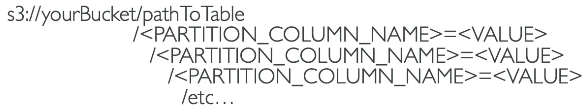
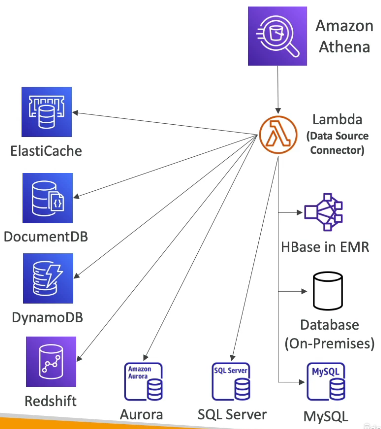
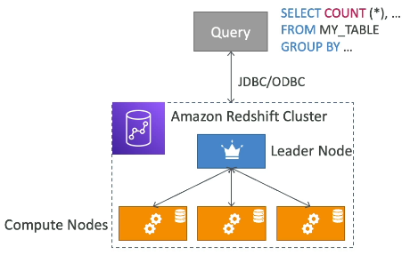
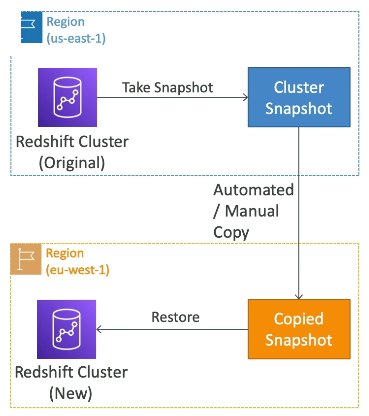
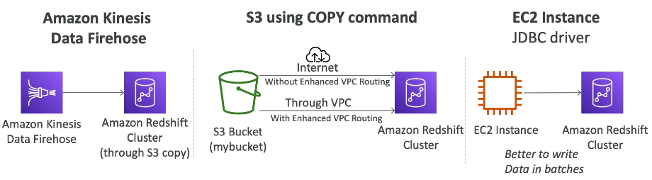
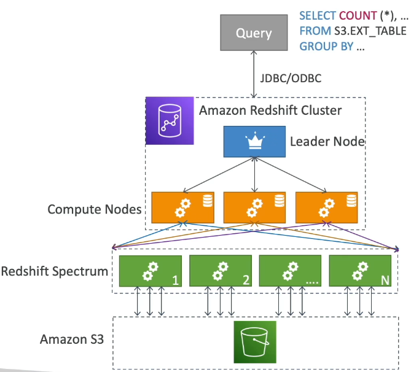
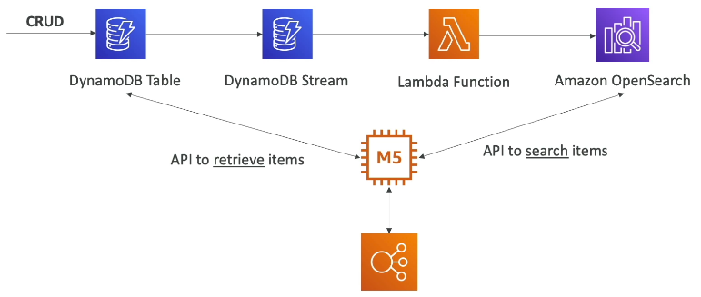
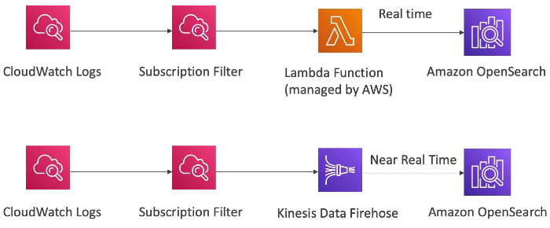
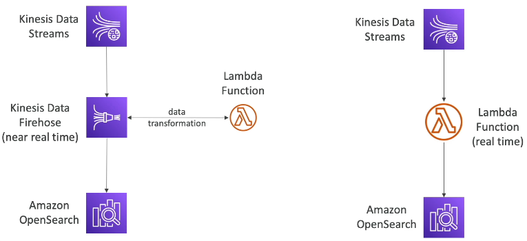

# Data & Analytics

Sections:-
- [1. Amazon Athena 📊](#1-amazon-athena-)
- [2. Athena Hands On](#2-athena-hands-on)
- [3. Redshift](#3-redshift)
- [4. OpenSearch (formerly: ElasticSearch)](#4-opensearch-formerly-elasticsearch)
- [5. Amazon EMR (Elastic MapReduce)](#5-amazon-emr-elastic-mapreduce)
- [6. QuickSight](#6-quicksight)
- [7. AWS Glue: Managed ETL Service](#7-aws-glue-managed-etl-service)
- [8. AWS Lake Formation](#8-aws-lake-formation)
- [9. Amazon Managed Service for Apache Flink (Managed Apache Flink)](#9-amazon-managed-service-for-apache-flink-managed-apache-flink)
- [10. Managed Apache Flink - Hands On](#10-managed-apache-flink---hands-on)
- [11. Amazon MSK (Managed Streaming for Apache Kafka)](#11-amazon-msk-managed-streaming-for-apache-kafka)
- [12. Big Data Ingestion Pipeline Architecture 🚀](#12-big-data-ingestion-pipeline-architecture-🚀)
- [Q & A](#q--a)

---

## 1. Amazon Athena 📊

Amazon Athena is a serverless query service that enables you to analyze data stored in Amazon S3 buckets. You use standard SQL to query the files.

*   Athena is built on the Presto engine, which also uses SQL.
*   You load data into your S3 bucket and then use Athena to query and analyze this data directly in S3 without moving it.
*   Athena is serverless and analyzes data directly in your S3 bucket.

### Supported Formats

Athena supports various formats, including:

*   CSV
*   JSON
*   ORC
*   Avro
*   Parquet

### Pricing 💰

The pricing is straightforward: you pay a fixed amount per terabyte of data scanned ($5/TB). You don't need to provision any databases, as the service is entirely serverless.

### Integration with Amazon QuickSight 📈

Athena is commonly used with Amazon QuickSight to create reports and dashboards. QuickSight connects to Athena, which in turn connects to your S3 buckets.


### Use Cases 🚀

Common use cases for Athena include:

*   Ad hoc queries
*   Business intelligence
*   Analytics
*   Reporting
*   Analyzing and querying logs from AWS services (e.g., VPC flow logs, load balancer logs, CloudTrail trails).

💡 **Exam Tip:** If you need to analyze data in Amazon S3 using a serverless SQL engine, consider Athena.

### Performance Improvements ⚙️

You can improve Athena's performance using several techniques (exam will test on this):

1.  **Columnar Data Formats:** Use columnar data types for cost savings, as you only scan the necessary columns. The recommended formats are Apache Parquet and ORC. It will provide huge performance improvement.

    *   To convert files to Parquet or ORC, you can use a service like AWS Glue as an ETL job (e.g., converting from CSV to Parquet).

2.  **Data Compression:** Compress data for smaller retrievals (e.g., with bzip2, GZIP, LZ4, Snappy, Zlip, Zstandard or Hadoop-Compatible Snappy).

3.  **Data Partitioning:** Partition datasets if you frequently query specific columns. This involves organizing your data in S3 with a path structure that reflects column values.

    📌 **Example:**

    ```
    s3://bucket/flight/parquet/year=1991/month=01/day=01/
    ```

    When you query for a specific year, month, and day, Athena knows exactly which S3 folder to scan, reducing the amount of data retrieved.

    

4.  **Larger Files:** Use larger files (e.g., 128 MB and over) to minimize overhead. Athena performs better with fewer, larger files than with many small files.

### Federated Query 🔗

Athena can query data not only in S3 but also in relational and non-relational databases, objects, and custom data sources, whether on AWS or on-premises.

*   This is achieved using **Data Source Connectors**, which are Lambda functions that run Federated Queries (e.g. CloudWatch Logs, DynamoDB, RDS, ...) in other services.

*   You'll have one Lambda function per Data Source Connector.



*   Through Athena, you can query across services like:

    *   ElastiCache
    *   DocumentDB
    *   DynamoDB
    *   Redshift
    *   Aurora
    *   SQL Server
    *   MySQL
    *   HBase on EMR
    *   On-premises databases
    *   Amazon S3

*   The results of these queries can be stored in your Amazon S3 buckets for later analysis.
  
The above diagram shows Athena querying various data sources through Lambda functions.

📝 **Note:** Athena's Federated Query capability allows you to query data across multiple data sources from a single interface.

---

## 2. Athena Hands On

Amazon **Athena** is a serverless, interactive query service that makes it easy to analyze data in **Amazon S3** using standard SQL. Here's a hands-on walkthrough of how to use Athena to query S3 access logs.

### 🎯 Setting Up Athena

- Launch the **Query Editor** in Athena (by selecting the option: Query your data with Trino SQL).
- Before running your first query, you **must configure a query result location** in S3.
  - Go to the **Settings** and enter the name of an S3 bucket where query results will be stored.
  - 📌 **Example**: Create a new bucket in the S3 Console named `aws-athena-demo-us-east-1-v2`.
  - Copy and paste the full S3 path into the settings.
- Confirm Athena can browse the S3 bucket successfully.
- Save the settings. This will be the S3 location where Athena will store query results.

### 🛠️ Creating the Database

In S3 we have a bucket `access-logs-demo-123-us-east-1`, and we are going to query it. 

- Navigate to your Athena editor and begin by creating a **new database**.
- 📝 Note: You can find the SQL scripts [here](/resources/s3-advanced/athena-s3-access-logs.sql).

```sql
CREATE DATABASE s3_access_logs_db;
````

* Once executed, the new database will appear in the left-hand panel alongside the `default` database. Select the newly created database.
  
### 📋 Creating the Table

* Now, create a **table** in Athena to represent your S3 access logs.
* 📌 Example: Use the AWS documentation-provided SQL template.
* Modify the query by updating:

  * **Location**: Set it to your S3 bucket URL.
  * **Prefix**: Only required if objects are stored inside folders. In our case, all logs are stored in the root folder, so we don't need to specify a prefix. 
  *  ⚠️ **Warning**: Ensure you add a **trailing slash (`/`)** at the end of the location path.

```sql
CREATE EXTERNAL TABLE IF NOT EXISTS s3_access_logs_db.mybucket_logs(
    BucketOwner STRING,
    Bucket STRING,
    RequestDateTime STRING,
    RemoteIP STRING,
    Requester STRING,
    RequestID STRING,
    Operation STRING,
    Key STRING,
    RequestURI_operation STRING,
    RequestURI_key STRING,
    RequestURI_httpProtoversion STRING,
    HTTPstatus STRING,
    ErrorCode STRING,
    BytesSent BIGINT,
    ObjectSize BIGINT,
    TotalTime STRING,
    TurnAroundTime STRING,
    Referrer STRING,
    UserAgent STRING,
    VersionId STRING,
    HostId STRING,
    SigV STRING,
    CipherSuite STRING,
    AuthType STRING,
    EndPoint STRING,
    TLSVersion STRING
) 
ROW FORMAT SERDE 'org.apache.hadoop.hive.serde2.RegexSerDe'
WITH SERDEPROPERTIES (
    'serialization.format' = '1', 'input.regex' = '([^ ]*) ([^ ]*) \\[(.*?)\\] ([^ ]*) ([^ ]*) ([^ ]*) ([^ ]*) ([^ ]*) \\\"([^ ]*) ([^ ]*) (- |[^ ]*)\\\" (-|[0-9]*) ([^ ]*) ([^ ]*) ([^ ]*) ([^ ]*) ([^ ]*) ([^ ]*) (\"[^\"]*\") ([^ ]*)(?: ([^ ]*) ([^ ]*) ([^ ]*) ([^ ]*) ([^ ]*) ([^ ]*))?.*$' )
LOCATION 's3://target-bucket-name/prefix/';
```

* Run the query to create the table. The table (`mybucket_logs`) and its fields will now be visible in the UI in the left-hand panel under the tables section.

### 🔍 Preview and Query the Data

* Click on the **three dots** next to the table name and select **Preview Table** to retrieve the first 10 rows. It will execute the following query: `SELECT * FROM "s3_access_logs_db"."mybucket_logs" limit 10;`
* You'll see useful details such as:

  * `bucket_owner`, `request_datetime`, `remote_ip`, `request_uri`, `http_status`, etc.

💡 **Tip**: Previewing is much more efficient than opening raw files in S3.

### 📊 Running Advanced Queries

You can now run **aggregations and analytics** using SQL directly in Athena.

📌 **Example**: Count all requests by HTTP status and operation.

```sql
SELECT requesturi_operation, httpstatus, count(*) 
FROM "s3_access_logs_db"."mybucket_logs" 
GROUP BY requesturi_operation, httpstatus;
```

* This helps you identify common patterns and anomalies, such as:

  * HTTP `404` errors (not found)
  * HTTP `403` errors (unauthorized)

💡 **Tip**: Use these insights to identify potential access issues or security concerns.

📌 **Example**: Query all unauthorized access attempts (`403`):

```sql
SELECT * FROM "s3_access_logs_db"."mybucket_logs"
where httpstatus='403';
```

You can then inspect who made these requests and whether they were legitimate or suspicious.

### ✅ Summary

* **Athena** lets you query S3 data directly using **SQL**.
* It's **fully serverless**—no infrastructure to manage.
* You only need to:

  1. Create a database.
  2. Define your table with the correct S3 location.
  3. Run SQL queries to analyze the data.

💡 **Tip**: This is one of the easiest and most powerful ways to perform analytics on data stored in S3.

Hope this walkthrough was helpful! 🚀

---

## 3. Redshift

Amazon **Redshift** is a high-performance, scalable data warehouse service built on **PostgreSQL**, but it's not used for OLTP (Online Transaction Processing). Instead, it’s designed for **OLAP (Online Analytical Processing)**—making it ideal for analytics and data warehousing.

### 🚀 Key Features of Redshift

- Designed for heavy-duty **analytics** and **data computation**.
- Offers up to **10x better performance** compared to other data warehouses.
- Supports **petabyte-scale** data storage.
- Uses **columnar storage** (data stored in columns instead of rows) to speed up analytical queries.
- Employs a **parallel query engine** to enhance performance.

### 🛠️ Cluster Modes

Redshift provides **two modes** to start a cluster:

1. **Provisioned Cluster**  
   - Choose instance types in advance.
   - Reserve instances to save costs.
   - Manually manage the cluster.

2. **Serverless Cluster**  
   - AWS fully manages the infrastructure.
   - No need to handle cluster or node configurations.

### 🧠 Querying in Redshift

- Uses **SQL** for querying.
- Integrates directly with **BI tools** like:
  - Amazon **QuickSight**
  - **Tableau**

### 🔁 Redshift vs. Athena

| Feature               | Redshift                           | Athena                          |
|-----------------------|------------------------------------|----------------------------------|
| Query Speed           | ⚡ Faster joins & aggregations      | Moderate speed                  |
| Architecture          | Requires a cluster                 | Fully serverless                |
| Data Location         | Managed inside Redshift            | Directly queries data in S3     |

### 🧱 Redshift Architecture

- **Leader Node**
  - Handles query planning and result aggregation.
- **Compute Nodes**
  - Execute the actual queries and send results back to the leader node.

📌 Example: When running a query like  
```sql
SELECT COUNT(*) FROM my_table GROUP BY column_name;
````

* The **leader node** plans the query.
* Sends it to **compute nodes** for execution.
* Results are returned to the **leader**.



### 🗄️ Snapshots & Disaster Recovery (DR)

* Redshift is typically **Single-AZ**, but some types support **Multi-AZ**.
* For Single-AZ clusters, use **snapshots** for Disaster Recovery (DR).

📝 **Snapshot Basics**:

* **Point-in-time** backups.
* Stored **incrementally** in Amazon S3 (only changes are saved).
* Can be restored into a new cluster.

🧰 **Types of Snapshots**:

* **Manual Snapshots**

  * Retained until deleted manually.
* **Automated Snapshots**

  * Taken every **8 hours** or every **5 GB** of data change.
  * Retention is configurable.



💡 Tip: You can configure Amazon Redshift to **automatically copy snapshots (automated or manual) of a cluster to another AWS region** — ideal for disaster recovery!

### 📥 Ingesting/Loading Data into Redshift

**Large inserts are MUCH better**



There are **three primary ways** to load data:

1. **Kinesis Data Firehose**

   * Receives data from various sources.
   * Writes to S3 first, then uses the `COPY` command to load into Redshift.

2. **Manual S3 Copy**

   * Load data into S3 yourself.
   * Run Redshift's `COPY` command using an **IAM role**.

   📌 Example:

   ```sql
   COPY my_table FROM 's3://my-bucket/data.csv'
   IAM_ROLE 'arn:aws:iam::account-id:role/MyRedshiftRole'
   CSV;
   ```

3. **JDBC Insert**

   * Ideal for applications writing directly to Redshift (e.g., from EC2).
   * ⚠️ **Avoid row-by-row inserts** — use **batch inserts** for performance!

### 🌐 Enhanced VPC Routing

⚠️ **Without Enhanced VPC Routing**:

* Data may flow through the internet from S3 to Redshift.

✅ **With Enhanced VPC Routing**:

* Keeps all data transfer **within your VPC** for improved security.

### 🧠 Redshift Spectrum

**Redshift Spectrum** allows querying data **directly from S3**—without loading it into Redshift first.

📝 Requirements:

* Must have a **Redshift cluster** provisioned.
* Query is submitted to **thousands of Spectrum nodes**.
* These nodes:

  * Read the S3 data.
  * Perform the computation.
  * Send results to the Redshift cluster.
  * Return final results to the requester.

📌 Example:

```sql
SELECT * FROM spectrum_schema.my_s3_table;
```

💡 Tip: Spectrum gives you access to **more processing power** than what's available in your provisioned cluster!

### Amazon Redshift Spectrum Explained with Example

Let’s walk through an example to understand how **Amazon Redshift Spectrum** works.



Imagine you have a **Redshift cluster** with a **leader node** and several **compute nodes**. However, the data you want to analyze is stored in **Amazon S3**, not directly in Redshift.

Here's what happens:

1. You run a **SQL query** from your Redshift cluster.
2. The **target table** in your query points to data stored in **S3** (e.g., using `s3://bucket/path`).
3. **Redshift Spectrum** is automatically invoked behind the scenes.
4. The query is distributed to **thousands of Spectrum nodes**, which:

   * Read the raw data from S3.
   * Perform the necessary **aggregations or transformations**.
5. Once processing is complete, the results are sent back to your **Redshift cluster**.
6. Finally, the results are returned to the user or application that initiated the query.

#### ✅ Key Benefits

* You can **query data directly in S3** without loading it into Redshift.
* **Spectrum scales independently**, giving you access to more processing power than your Redshift cluster alone.
* Ideal for **analyzing large datasets** without the need to provision extra resources up front.

---

## 4. OpenSearch (formerly: ElasticSearch)

Amazon **OpenSearch** is the successor to **Amazon Elasticsearch Service**, rebranded due to licensing changes. While similar in functionality, OpenSearch brings improved capabilities and a more open development model.

### 🔍 What is OpenSearch?

- **Search Engine**: Unlike DynamoDB, which requires querying by primary key or indexes, OpenSearch allows you to **search any field**, including **partial matches**.
- **Use Case**: Often used as a **complement** to other databases, adding powerful search capabilities to applications.
- **Bonus**: Despite its name, OpenSearch can also handle **analytic queries**!

### 🏗️ Cluster Provisioning Modes

You can run OpenSearch in two ways:

1. **Managed Cluster**
   - Physical EC2 instances are provisioned for your cluster.
   - You get visibility and control over the instances.

2. **Serverless Cluster**
   - AWS handles provisioning, scaling, and operations.
   - No need to manage infrastructure.

### 📄 Querying OpenSearch

- OpenSearch has its own **query language**.
- **💡 Tip:** It does not natively support SQL but you can enable **SQL compatibility** through a plugin for familiar querying.

### 📥 Ingesting Data into OpenSearch

OpenSearch supports ingestion from multiple AWS services and custom apps:

- **Kinesis Data Firehose**
- **AWS IoT**
- **Amazon CloudWatch Logs**
- **Custom Applications**

### 🔐 Security Features

- **Integration with**:
  - **Cognito**
  - **IAM**
- **Encryption**:
  - **At rest**
  - **In-flight**

### 📊 OpenSearch Dashboards

Use **OpenSearch Dashboards** (formerly Kibana) to create **visualizations and dashboards** on top of your indexed data.

### 🧩 Common Architecture Patterns

#### a. 🔁 DynamoDB + OpenSearch Pattern



1. **DynamoDB** is the source of truth (data insert/update/delete).
2. **DynamoDB Stream** captures data changes.
3. A **Lambda Function** processes the stream and inserts data into **OpenSearch** in real time.
4. Application queries **OpenSearch** for fast item lookup (e.g., by name).
5. Once an item ID is found, the full record is fetched from **DynamoDB**.

💡 **Tip**: OpenSearch provides fast **search capabilities**, while DynamoDB remains the **authoritative data store**.

### b. 📜 Ingesting CloudWatch Logs into OpenSearch



You have two primary methods:

1. **Lambda-Based Flow**
   - Use a **CloudWatch Log Subscription Filter**.
   - Send logs in **real time** to a Lambda Function (AWS-managed).
   - Lambda then inserts them into OpenSearch.

2. **Kinesis Firehose-Based Flow**
   - CloudWatch Logs ➡️ Subscription Filter ➡️ **Kinesis Data Firehose** ➡️ OpenSearch.
   - Supports **near real-time ingestion**.

### c. 🔄 Ingesting from Kinesis Data Streams



Two strategies to push data from **Kinesis** to OpenSearch:

1. **Using Kinesis Data Firehose**
   - Near real-time delivery.
   - Can use **Lambda for transformation** before sending data.

2. **Using a Lambda Consumer**
   - Lambda reads data directly from **Kinesis Data Streams**.
   - Custom logic pushes data into OpenSearch in **real time**.

### 🧠 Summary

Amazon OpenSearch is a flexible, scalable search and analytics engine that fits into a variety of real-time data processing architectures. Key highlights:

- Ideal for **full-text search**, **partial match**, and **analytics**.
- Easily integrates with AWS services like **DynamoDB**, **Kinesis**, **CloudWatch**, and **Lambda**.
- Offers both **managed** and **serverless** options.
- Equipped with built-in **security**, **visualization**, and **SQL support** (via plugin).

---

## 5. Amazon EMR (Elastic MapReduce)

Amazon **EMR (Elastic MapReduce)** is AWS’s managed service for creating and running **Hadoop clusters** to process and analyze **large-scale big data**. Anytime you encounter big data clusters—especially Hadoop—think of **Amazon EMR**.

These clusters can be made up of **hundreds of EC2 instances**, provisioned and managed automatically by AWS.

### Why Use Amazon EMR?

EMR comes pre-bundled with many popular **big data tools** that are otherwise difficult to install and configure manually, such as:

* **Apache Spark**
* **HBase**
* **Presto**
* **Apache Flink**

✅ **Benefits of EMR**

* AWS handles provisioning and configuration of services.
* Supports **auto-scaling** of clusters.
* Integration with **EC2 Spot Instances** for cost savings.

### Common Use Cases

From an exam perspective, EMR is primarily associated with **big data workloads** such as:

* Large-scale **data processing**
* **Machine learning** tasks
* **Web indexing**
* General **big data analytics** using Hadoop, Spark, HBase, Presto, Flink, and more.

### EMR Cluster Architecture

An EMR cluster is composed of **different types of EC2 nodes**:

1. **Master Node** 🧑‍💻

   * Manages the cluster, coordinates tasks, and monitors node health.
   * Must always be **long-running**.

2. **Core Node** ⚙️

   * Runs tasks and stores data.
   * Must also be **long-running**.

3. **Task Node (Optional)** 🏃

   * Runs tasks only (no data storage).
   * **Optional** and a good fit for **Spot Instances**.

### Purchasing Options

You can mix EC2 purchasing models in your EMR cluster:

* **On-Demand Instances** 💰

  * Reliable and predictable.
  * Never terminated by AWS.

* **Reserved Instances** 📉

  * Minimum 1-year commitment.
  * Provide significant cost savings.
  * Best for **Master** and **Core Nodes** (since they are long-running).

* **Spot Instances** ⚡

  * Cheaper but less reliable (can be terminated anytime).
  * Best for **Task Nodes**, where interruptions are acceptable.

📌 **Tip:** A smart strategy is to run Master/Core nodes on reserved or on-demand instances, while Task nodes use spot instances for cost efficiency.

### Deployment Models

* **Long-Running Clusters**

  * Ideal with reserved instances for continuous workloads.

* **Transient (Temporary) Clusters**

  * Spin up for specific jobs, then shut down after processing.
  * Saves costs when workloads are not constant.

✅ With this, you now have a solid understanding of **Amazon EMR** for both real-world use and AWS exam scenarios.

---

## 6. QuickSight

Amazon **[QuickSight](https://aws.amazon.com/quicksight/)** is a **serverless**, **machine learning–powered** business intelligence (**BI**) service that enables users to create **interactive dashboards** and **visualizations** from various data sources.


### 📊 What is QuickSight?

- A **machine-learning powered business intelligence** tool designed for:
  - Creating **interactive dashboards**
  - Performing **ad-hoc data analysis**
  - Gaining insights from data via **visual exploration**
- It is:
  - **Serverless** and **auto-scalable**
  - Offers **per-session pricing**
  - Supports **web embedding** for dashboards

### ⚙️ How QuickSight Works

- Dashboards are connected to various **data sources** including RDS, Aurora, Redshift, Athena, Amazon S3, OpenSearch, and Timestream.
- Users build **visuals** and **charts** based on real-time or imported data.
- Offers **fast performance** through the **SPICE engine**.

### ⚡ SPICE Engine (Super-fast, Parallel, In-memory Calculation Engine)

- Performs **in-memory computations**.
- Only works when **data is imported** directly into QuickSight.
- ❌ Does **not work** when connecting to external databases live.

💡 **Tip**: Import your data to use SPICE for lightning-fast performance.

### 🔐 Security Features

- **Column-Level Security (CLS)** available in **Enterprise Edition**.
- Prevents specific columns from being viewed by unauthorized users.
- Offers user- and group-based access control (internal to QuickSight).

### 🔌AWS QuickSight Integrations


#### ✅ AWS Data Sources
- **RDS**, **Aurora** – Relational databases
- **Redshift** – Data warehousing
- **Athena** – Querying data in S3
- **Amazon S3** – Raw file storage
- **OpenSearch** – Search and analytics engine
- **Timestream** – Time series database

#### 🔄 Third-Party Integrations
- **SaaS platforms** like:
  - **Salesforce**
  - **Jira**
- **External databases** like:
  - **Teradata**
  - **On-prem databases** via **JDBC**

#### 📁 File-Based Imports
- **Excel (.xlsx)**
- **CSV**
- **JSON**
- **TSV**
- **EFS CLF** (Common log format)

📝 **Note**: Imported files can use the **SPICE engine** for performance optimization.

> You will very commonly see at the exam using QuickSight with Athena or QuickSight with Redshift, but any of these is possible to be seen.

### 🧱 Components: Dashboards vs. Analysis

In **Amazon QuickSight**, you work with two key components: **dashboards** and **analyses**.

### Users and Groups

* **Users** 👤 → Available in the **Standard edition**.
* **Groups of users** 👥 → Available only in the **Enterprise edition**.

⚠️ **Important:** QuickSight users and groups exist **only inside QuickSight**. They are **not equivalent to IAM users**.

* **IAM users** are used only for **administration**.
* QuickSight users/groups are created and managed **within QuickSight** itself.

### Dashboards vs. Analysis

* **Analysis** ✨

  * A complete, interactive workspace where you build visuals, apply filters, parameters, controls, and sorting.
  * Can be shared with users or groups.

* **Dashboard** 📊

  * A **read-only snapshot** of an analysis.
  * Preserves the configuration of the analysis (filters, parameters, sorting, controls).
  * Must first be **published** before sharing.

📌 **Example:**
You build an **analysis** with filters and sorting → Publish it → Share it as a **dashboard** with your team.

### Sharing Content

* You can share **both analyses and dashboards** with specific **users or groups**.
* If a user has access to a **dashboard**, they can also see the **underlying data** behind it.

### Exam Tip

For the AWS exam:

* Remember the difference between **users (Standard)** and **groups (Enterprise)**.
* Dashboards are **read-only snapshots** of analyses.
* IAM users are only for **administration**, not for dashboard/analysis sharing.
---

## 7. AWS Glue: Managed ETL Service

AWS Glue is a managed **extract, transform, and load (ETL)** service. 

It's a **fully serverless** service that helps you **prepare and transform data for analytics**.

Here's how it works:

1.  **Extract:** Glue extracts data from various sources.
2.  **Transform:** You can transform the data by filtering, adding columns, and more.
3.  **Load:** Glue loads the transformed data into a target data warehouse.


📌 **Example:** You can extract data from an S3 bucket or an Amazon RDS database, transform it, and load it into a Redshift data warehouse.

Another common use case is converting data into the Parquet format.

### Convert data into Parquet Format

The Parquet format is a columnar data format that's optimized for analytics. It works very well with services like Athena.


Here's how you can use Glue to convert CSV files to Parquet:

1.  Import CSV data from an S3 bucket using Glue.
2.  Convert the data to Parquet format within Glue.
3.  Send the Parquet data to an output S3 bucket.

When data is in Parquet format, Amazon Athena can analyze it much more efficiently.

You can automate this process by using S3 event notifications.

1.  When a file is inserted into the S3 bucket, send an event notification.
2.  This notification can trigger a Lambda function or EventBridge.
3.  The Lambda function or EventBridge then triggers a Glue ETL job.

### Glue Data Catalog: Catalog of Datasets


The Glue Data Catalog is used to catalog datasets. It uses Glue data crawlers to connect to various data sources, including:

*   Amazon S3
*   Amazon RDS
*   Amazon DynamoDB
*   Compatible JDBC databases (e.g., on-premises databases)

The Glue Data Catalog crawls these databases and writes metadata (tables, columns, data types, etc.) into the catalog. This metadata is then used by Glue jobs for ETL.

Amazon Athena, Redshift Spectrum, and Amazon EMR also leverage the AWS Glue Data Catalog for data and schema discovery. The Glue Data Catalog service is central to many other AWS services.

### Other Important Glue Features

Here are some other Glue features to be aware of:

*   **Glue Job Bookmarks:** 🔖 Prevents reprocessing old data when running a new ETL job. This is important for efficiency.
*   **Glue Data Brew:** 🍺 Used to clean and normalize data using pre-built transformations.
*   **Glue Studio:** 🎨 A GUI to create, run, and monitor ETL jobs in Glue.
*   **Glue Streaming ETL:** 🌊 Built on top of Apache Spark Structured Streaming. Allows you to run ETL jobs as streaming jobs instead of batch jobs. You can read data from Kinesis Data Streams, Kafka, or MSK (Managed Kafka on AWS).

---

## 8. AWS Lake Formation

AWS Lake Formation helps you create data lakes, which are central repositories for all your data, enabling comprehensive analytics.

**Data lake = central place to have all your data for analytics purposes.**

Lake Formation is a fully managed service that simplifies data lake setup, reducing the time from months to just a few days. It assists in discovering, cleansing, transforming, and ingesting data into your data lake.

Lake Formation automates complex manual steps like collecting, cleansing, moving, and cataloging data. It also handles de-duplication using machine learning transforms.

In a data lake created with Lake Formation, you can combine structured and unstructured data sources.

*   Key features:
    *   Blueprints for migrating data from various sources into the central data lake.
    *   Support for Amazon S3, Amazon RDS, on-premises relational databases, and NoSQL databases.

The primary benefit of Lake Formation is having all your data in one place, coupled with fine-grained access controls at the row and column level for your applications. Any application connecting to Lake Formation benefits from this fine-grained access control.

Lake Formation functions as a layer on top of AWS Glue, but direct interaction with Glue is not required.

### AWS Lake Formation


Lake Formation allows you to create a data lake stored in Amazon S3. Data sources can include Amazon S3, RDS, Aurora, and on-premises databases (SQL, NoSQL). Data ingestion is facilitated by the blueprints available in Lake Formation.

Lake Formation includes:

*   Source Crawlers
*   ETL and data preparation tools
*   Data cataloging tools (all powered by the underlying Glue service)
*   Security settings and access controls to protect data.

Services that can leverage Lake Formation include Athena, Redshift, EMR, and other analytics tools like Apache Spark. Users connect to these services, which in turn connect to Lake Formation and the data lake.

### Why use Lake Formation - Centralized Permissions Example

A key aspect, often highlighted in exams, is **centralized permissions**. 🔑

📌 **Example:** Imagine your company uses Athena and QuickSight for data analysis. Users should only view the data they need, with appropriate permissions. Data sources include Amazon S3, RDS, and Aurora.

Without Lake Formation, you might try to set up security in Athena, QuickSight, S3 bucket policies, RDS, or Aurora, leading to a complex and unmanageable security landscape.


Lake Formation solves this by providing access control with column and row-level security.

With Lake Formation:

1.  Ingest data into a central S3 bucket.
2.  Manage access control for row and column-level security within Lake Formation.
3.  Any service connecting to Lake Formation will only have access to the data it is authorized to see.

If you use Athena, QuickSight, or other tools and connect them to Lake Formation, you manage security in one central place: Lake Formation. This is a significant advantage and a key point to remember for exams. 📝

---

## 9. Amazon Managed Service for Apache Flink (Managed Apache Flink)

Let's explore the Amazon Managed Service for Apache Flink. This service was formerly known as Kinesis Data Analytics for Apache Flink, but has since been renamed.


So, what exactly is Flink? 🤔

*   Flink is a framework typically used with Java, SQL, or Scala.
*   It's designed for processing data streams in real-time. ⏱️

With Amazon Managed Service for Apache Flink, you can ingest data from sources like:

*   Kinesis Data Streams
*   Amazon MSK (Managed Streaming for Apache Kafka) - a managed service for Apache Kafka.

Thanks to this service, you can run any Apache Flink application on a managed cluster within AWS. This means:

*   AWS provisions the necessary compute resources for you. 💻
*   You gain access to parallel computation and automatic scaling. 📈
*   AWS manages your application backups using checkpoints and snapshots. 💾
*   You're free to use any Apache Flink supported programming features to transform your data. ✨

You have flexibility in the types of transformations you apply to your streams.

⚠️ **Warning:** Flink can read from Kinesis Data Streams, but it **cannot** read from Amazon Data Firehose. This is a common exam trick! 🚨

📝 **Note:** Amazon Managed Service for Apache Flink is specifically for processing data streams. 🌊

---

## 10. Managed Apache Flink - Hands On

Here's an overview of the options available within Managed Apache Flink:

We have two primary options:

*   Creating a streaming application.
*   Using the studio.

### Streaming Applications (Apache Flink) 🚀

*   This option leverages Apache Flink for real-time analytics.
*   You'll need to select a supported runtime version for Apache Flink.
*   You'll need to provide an application name.
*   At some point, you'll need to enter your production information.
*   You'll need to upload your Apache Flink application.
*   You can monitor your application using the Apache Flink dashboard.
*   📝 **Note:** Creating Apache Flink applications can be complex.

### Studio Notebooks 💻

*   You can quickly create a notebook to start running streaming applications, again using Apache Flink.

### SQL Applications (Legacy) 📜

> SQL Applications (Legacy) (also known as Kinesis Data Analytics for SQL Applications) is being phased out/discontinued by AWS. 
> - October 15, 2025 → Creation of new SQL Applications will be blocked.
> - January 27, 2026 → All existing SQL Applications will be deleted; no further operation/support.

*   The original Kinesis Data Analytics for SQL Applications is now considered legacy.
*   You can find it under "SQL applications (legacy)" in the console.
*   AWS recommends using Kinesis Data Analytics Studio and Apache Flink for new applications.
*   However, if you need to read from Kinesis Data Firehose, you would create a SQL application in the legacy form.
*   You'll need to define an application name.
*   Once the application name is defined, you can go to real-time analytics and write the SQL you want to execute.

### Console Visualization 📊

*   You can visualize your data analytics on the console.

### Exam Relevance 📚

*   You don't need in-depth knowledge of Kinesis Data Analytics for the exam, but this overview provides a quick introduction to the available options.

---

## 11. Amazon MSK (Managed Streaming for Apache Kafka)

Another important analytics service you need to know is **Amazon Managed Streaming for Apache Kafka (MSK)**.

### What is Apache Kafka?

Apache Kafka is a **real-time data streaming platform**, often compared (alternative) to **Amazon Kinesis**. Both let you **stream data at scale**, but Kafka comes with its own ecosystem and flexibility.

A **Kafka cluster** is made up of:

* **Brokers** 🖥️ → Store and manage Kafka topics.
* **Producers** ✍️ → Ingest data from sources like IoT, RDS, or Kinesis and push it into Kafka topics.
* **Consumers** 📥 → Read data from Kafka topics in real time and process it or forward it to destinations like **EMR, S3, SageMaker, Kinesis, or RDS**.


### What is Amazon MSK?

Amazon MSK gives you a **fully managed Kafka cluster** on AWS. With just a few clicks, you can create, update, or delete clusters without the complexity of setting up Kafka manually.

✅ **Key Features:**

* AWS provisions and manages **Kafka broker nodes** and **ZooKeeper nodes**.
* Clusters run inside your **VPC** across up to **3 Availability Zones** for high availability.
* **Automatic recovery** from common Kafka failures.
* Data is stored on **EBS volumes** for as long as you need.
* Option to run **Amazon MSK Serverless**, where you don’t provision or manage capacity—AWS automatically handles compute and storage scaling.

💡 **Personal Note:** Setting up Kafka manually is notoriously difficult. With MSK, AWS does the heavy lifting, making deployment much simpler.

### Comparing Amazon MSK vs. Kinesis Data Streams

| Feature                  | Amazon Kinesis Data Streams           | Amazon MSK (Kafka)                                      |
| ------------------------ | ------------------------------------- | ------------------------------------------------------- |
| **Message size**         | Max 1 MB                              | 1 MB by default, configurable for high (e.g., 10 MB)             |
| **Streaming**         | Data Streams with Shards                              | Kafka Topics with Partitions                            |
| **Data retention**       | Limited (default hours to days)       | Keep data **as long as you want** (pay for EBS storage) |
| **Scaling**              | Scale by splitting/merging **shards** | Scale by adding **partitions** (cannot remove)          |
| **Encryption in-flight** | TLS in-flight encryption                                | Plaintext or TLS in-flight encryption                                       |
| **Encryption at rest**   | KMS at-rest encryption                               | KMS at-rest encryption                                               |
| **Concepts**             | Shards                                | Topics with Partitions                                  |

📌 **Exam Tip:** Remember that **Kinesis → shards**, while **Kafka/MSK → topics & partitions**.

And also for Amazon MSK, you can keep data for as long as you want, you can go over one year, as long as you pay for the underlying EBS storage, you're good to go.

### Producing and Consuming Data in MSK


* **Producers** → Write to Kafka topics.
* **Consumers** → Multiple options:

  * ⌨️ **Apache Flink (via Kinesis Data Analytics)** → Stream processing directly from MSK.
  * 🛠 **AWS Glue (ETL with Spark Streaming)**.
  * ⚡ **AWS Lambda** → MSK can be an event source.
  * 📝 **Custom Kafka Consumer** → Run on **EC2, ECS, or EKS**.

📌 **Code Example (Kafka Producer in Python):**

```python
from kafka import KafkaProducer

producer = KafkaProducer(bootstrap_servers='b-1.mskcluster.amazonaws.com:9092')
producer.send('my-topic', b'Hello from Amazon MSK!')
producer.flush()
```

### Summary

* **Amazon MSK** = Fully managed Apache Kafka on AWS.
* Supports **serverless mode** for automatic scaling.
* Similar to **Kinesis**, but with different terminology and scaling behavior.
* Use cases: **real-time streaming, analytics pipelines, ML pipelines, and ETL workflows**.

✅ With this knowledge, you’re well-prepared for **Amazon MSK** questions on the AWS exam.

---

## 12. Big Data Ingestion Pipeline Architecture 🚀

Let's explore a serverless, fully managed AWS architecture for a Big Data Ingestion Pipeline. The goal is to:

*   Collect data in real-time. ⏱️
*   Transform the data. ⚙️
*   Query the transformed data using SQL. 🗃️
*   Store reports (created from queries) in S3. 📦
*   Load data into a data warehouse. 🏢
*   Create dashboards. 📊

This addresses the common big data challenges of ingestion, collection, transformation, querying, and analysis.

Here's a breakdown of the pipeline:

1.  **Data Producers (IoT Devices):** Assume data originates from IoT devices.
2.  **AWS IoT Core:** ☁️ Use **IoT Core** to manage these devices. 📝 **Note:** Remember this service for the exam!
3.  **Kinesis Data Streams:** IoT Core sends data in real-time to a **Kinesis Data Stream**. Kinesis allows for piping big data in real-time.
4.  **Kinesis Data Firehose:** 🌊 Kinesis Data Stream connects to **Kinesis Data Firehose**. Firehose offloads data into an Amazon S3 bucket (the ingestion bucket) at specified intervals (e.g., every minute).
5.  **AWS Lambda (Optional Transformation):** ⚙️ Use an **AWS Lambda** function, directly linked to Kinesis Data Firehose, to quickly cleanse or transform the data.
6.  **Amazon S3 (Ingestion Bucket):** 📦 The raw or transformed data lands in the ingestion bucket.
7.  **SQS (Optional):** ✉️ Trigger an **SQS Queue**. This is optional; Lambda can be directly triggered by the S3 bucket. The SQS Queue can then trigger an AWS Lambda function.
8.  **AWS Lambda (Athena Trigger):** ⚙️ This Lambda function triggers an **Amazon Athena** SQL query.
9.  **Amazon Athena:** 🗃️ Athena pulls data from the ingestion bucket and executes a serverless SQL query.
10. **Amazon S3 (Reporting Bucket):** 📦 The output of the Athena query is stored in a separate Amazon S3 bucket (the reporting bucket).
11. **Data Visualization & Warehousing:**
    *   **QuickSight:** 📊 Directly visualize the data in the reporting bucket using **QuickSight**.
    *   **Amazon Redshift:** 🏢 Load the data into a data warehouse like **Amazon Redshift** for more in-depth analytics. Redshift can also serve as an endpoint for QuickSight.


**Pipeline Summary:**

*   **IoT Core:** Manages data from numerous IoT devices.
*   **Kinesis:** Facilitates real-time data collection.
*   **Firehose:** Delivers data to S3 in near real-time (minimum frequency of one minute).
*   **Lambda:** Supports data transformation within Firehose.
*   **Amazon S3:** Triggers notifications to SQS, SNS, or Lambda.
*   **Athena:** Provides a serverless SQL service.
*   **Reporting Buckets:** Store analyzed data.
*   **QuickSight/Redshift:** Enable data visualization and advanced analytics.

📝 **Note:** S3 can trigger notifications to SQS, SNS, or Lambda. Lambda can subscribe to SQS, or S3 can directly trigger Lambda.

This architecture offers a high-level solution for big data ingestion, real-time transformation, serverless processing, data warehousing, and visualization. Understanding how these components interact is crucial for solution architecture.

---

## Q & A

### ❓ Question 4

Which feature in **Amazon Redshift** forces all **COPY** and **UNLOAD** traffic moving between your cluster and data repositories through your VPCs?

* Improved VPC Routing
* Redshift Spectrum
* Enhanced VPC Routing

<details>

<summary>Explanation</summary>

Normally, Amazon Redshift clusters can send **COPY** (load data into Redshift) and **UNLOAD** (export data from Redshift) traffic directly over the internet to services like Amazon S3, DynamoDB, or Amazon EMR.

But with **Enhanced VPC Routing enabled**, this traffic is instead routed **through your Amazon VPC**.

#### 📌 Benefits of Enhanced VPC Routing

* ✅ **Control** – You can use VPC **security groups** and **network ACLs** to control COPY/UNLOAD traffic.
* ✅ **Monitoring** – You can monitor traffic with **VPC Flow Logs**.
* ✅ **Compliance** – Ensures that all COPY and UNLOAD data stays inside your private network (no internet path).

✅ Answer: **Enhanced VPC Routing**

#### ⚠️ Why not the others?

* **Improved VPC Routing** → Not an actual Redshift feature.
* **Redshift Spectrum** → Used for querying data directly in S3 without loading into Redshift, unrelated to VPC routing.

✅ **Takeaway:** If you need **fine-grained security and compliance controls** for data transfer between Redshift and other AWS services, always enable **Enhanced VPC Routing**.

</details>

### ❓ Question 7

A company is using AWS to host its public websites and internal applications. These different systems generate **a lot of logs and traces**.

There is a requirement to:

* Centrally store all logs
* Efficiently search them
* Analyze logs in **real-time** to detect errors or threats

👉 Which AWS service can help efficiently store and analyze logs?

* Amazon S3
* Amazon ElastiCache
* Amazon QLDB
* Amazon OpenSearch Service

<details>

<summary>Explanation</summary>

Amazon OpenSearch Service (successor of Elasticsearch Service) is designed for:

* ✅ **Centralized log storage** – store logs from multiple apps/websites
* ✅ **Real-time search & analytics** – quickly query logs and traces
* ✅ **Error & threat detection** – monitor anomalies, failures, or suspicious behavior
* ✅ **Integration with CloudWatch, Kinesis, and Firehose** – makes it easy to ingest logs

#### 📌 Why not the others?

* **Amazon S3** → Great for storing logs, but lacks **search & analytics** capabilities out-of-the-box. You'd still need Athena or OpenSearch.
* **Amazon ElastiCache** → Used for caching (Redis/Memcached), not log analysis.
* **Amazon QLDB** → Ledger database for immutable, cryptographically verifiable records, not for log analytics.

✅ Answer: **Amazon OpenSearch Service**

#### ⚡ Use Case Example

Logs from multiple applications → pushed into **Amazon CloudWatch Logs** → streamed into **Amazon OpenSearch Service** → use **Kibana dashboards** for visualization and real-time monitoring.

✅ **Takeaway:** If you need to **store, search, and analyze logs in real-time**, the best service is **Amazon OpenSearch Service**.

</details>

---
