# AWS Storage Extras

Sections:-
- [1. AWS Snowball ❄️](#1-aws-snowball-️)
- [2. AWS Snow Family: Ordering a Snow Device](#2-aws-snow-family-ordering-a-snow-device)
- [3. Snowball to Glacier Data Import](#3-snowball-to-glacier-data-import)
- [4. Amazon FSx](#4-amazon-fsx)
- [5. Amazon FSx Overview](#5-amazon-fsx-overview)
- [6. AWS Storage Gateway](#6-aws-storage-gateway)
- [7. Storage Gateway Hands-On](#7-storage-gateway-hands-on)
- [8. AWS Transfer Family](#8-aws-transfer-family)
- [9. AWS DataSync](#9-aws-datasync)
- [10. AWS Storage Options: A Comprehensive Overview 🗄️](#10-aws-storage-options-a-comprehensive-overview-️)
- [11. Q & A](#11-q--a)

---

## 1. AWS Snowball ❄️

AWS Snowball is a highly secure and portable device designed for two primary use cases:

*   Collecting and processing data at the edge.
*   Migrating data in and out of AWS.

If you're dealing with petabytes of data for migration, Snowball is worth considering.

### Snowball Edge Devices 📦

There are two main types of Snowball Edge devices:

1.  **Edge Storage Optimized:** Primarily for storage.
2.  **Edge Compute Optimized:** Primarily for compute.

The key difference is their storage capacity:

*   Edge Storage Optimized: 210 TB
*   Edge Compute Optimized: 28 TB

### Data Migrations 🚚

Transferring large datasets over a network can be time-consuming. 📌 **Example:** Transferring 100 TB over a 1 Gbps connection can take 12 days.

|              | **100 Mbps** | **1 Gbps** | **10 Gbps** |
|--------------|--------------|------------|-------------|
| **10 TB**    | 12 days      | 30 hours   | 3 hours     |
| **100 TB**   | 124 days     | 12 days    | 30 hours    |
| **1 PB**     | 3 years      | 124 days   | 12 days     |

Challenges with network data transfer include:

*   Slow connection speeds.
*   Limited connectivity or bandwidth.
*   High network costs.
*   Shared bandwidth with other applications.
*   Unstable connections.

If data transfer takes over a week, consider using a Snowball device.

What is Snowball device? Snowball is a device that is shipped to you, you load your data, and then ship it back to AWS. It's a portable device that can be used for data migrations and edge computing.

**Traditional Upload vs. Snowball**

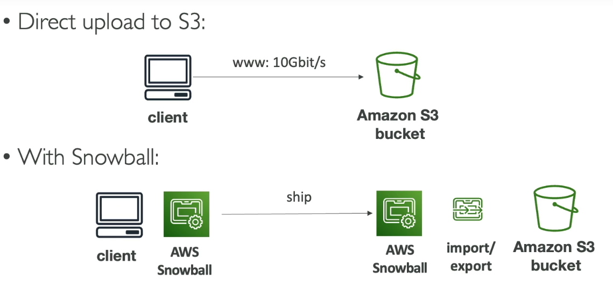

*   Direct upload to Amazon S3: Simple but can consume all your bandwidth.
*   Snowball:
    1.  Receive a physical Snowball device.
    2.  Load the device with your data.
    3.  Ship the device back to AWS.
    4.  AWS imports the data from the Snowball to, for example, an Amazon S3 bucket.

### Edge Computing 🖥️

Snowball can also be used for edge computing, processing data where it's created. 📌 **Example:** Trucks, ships, or mining stations with limited or no internet access.


In these scenarios, you can order a Snowball Edge device to perform computations locally. The **Edge Compute Optimized** device is designed for this.

**Capabilities:**

*   Run EC2 instances directly on the device.
*   Execute Lambda functions directly on the device.

**Benefits:**

*   Pre-process data at the edge.
*   Perform machine learning at the edge.
*   Transcode media at the edge.

Once processed, the data can be sent back to AWS.

📝 **Note:** The Snowball service is primarily for data migrations and edge computing.

---

## 2. AWS Snow Family: Ordering a Snow Device

Let's explore the process of ordering a device from the AWS Snow family. This will give us a good overview of the available options.

First, you'll need to provide some basic information:

*   Job Name: Give your import job a descriptive name. 📌 **Example:** "My Import Job"
*   Job Type: Select the type of job you want to perform. The main options are:
    *   Import into Amazon S3: 📦 Amazon ships a Snowball device to you, you load your data, and then ship it back to AWS.
    *   Export from Amazon S3: 📤 Data is exported from your Amazon S3 buckets onto a Snowball device, which is then shipped to you.
    *   Local Compute and Storage Only: 💻 Use the device for edge computing tasks.

Let's assume we choose "Import from Amazon S3".

Next, you'll select the specific Snow device you need. Available options may vary, but here are a couple of examples:

*   Snowball Edge Storage Optimized: Offers a large storage capacity (e.g., 210 TB).
*   Snowball Edge Compute Optimized: Designed for compute-intensive tasks at the edge.

📝 **Note:** The specific devices available may change over time. The key is to understand the general concept of the Snow family.

After selecting the device, you'll configure the pricing and data transfer details:

*   Pricing Option: Choose between on-demand per-day pricing.
*   Storage Transfer: Configure S3 data transfer settings.
*   Buckets: Specify the S3 buckets you want to transfer data into. 📌 **Example:** Select the bucket where you want the data to be imported.

Then, configure security settings:

*   Encryption: Choose how you want to encrypt your data.
*   Service Access: Select a service role that grants the Snow device the necessary permissions to access your S3 buckets. This is crucial for the device to write data to your S3 buckets.

    ```text
    IAM Role -> Allows Snow Device to write to S3
    ```

Shipping information is next:

*   Shipping Address: Provide the address where you want the Snow device to be shipped.
*   Shipping Speed: Choose your preferred shipping speed (e.g., one-day or two-day shipping).
*   Notifications: Configure notifications to track the status of your job.

Finally, review the job summary.

Once the job is created, you'll receive a Snowball Edge device. Load your data onto the device and then ship it back to AWS using the provided shipping label.

That's a high-level overview of how the Snow family works! We won't actually order a device in this example, but hopefully, this gives you a good understanding of the process.

---

## 3. Snowball to Glacier Data Import

This section covers a common scenario that might appear in the exam. The goal is to import data from Snowball directly into Glacier.

Unfortunately, Snowball cannot directly import data into Glacier. ⚠️ **Warning:** This is a key limitation to remember.

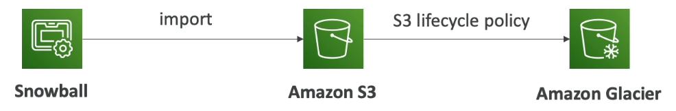

The solution involves a two-step process using Amazon S3 as an intermediary:

1.  **Snowball Import:** Use Snowball to import the data into Amazon S3. 📦
2.  **Lifecycle Policy:** Create an S3 lifecycle policy to transition the objects from S3 into Amazon Glacier. 🔄

Here's a summary:

*   Snowball imports data into Amazon S3.
*   An S3 lifecycle policy automatically moves the data to Amazon Glacier.

💡 **Tip:** Understanding S3 lifecycle policies is crucial for cost optimization and data management.

📝 **Note:** Remember this workflow for the exam! It's a simple but important concept.

---

## 4. Amazon FSx

Amazon FSx allows you to launch third-party high-performance file systems on AWS as a fully managed service. It's similar to RDS, but for file systems. You can launch:

- Lustre on FSx
- Windows File Server on FSx
- NetApp ONTAP on FSx
- OpenZFS on FSx

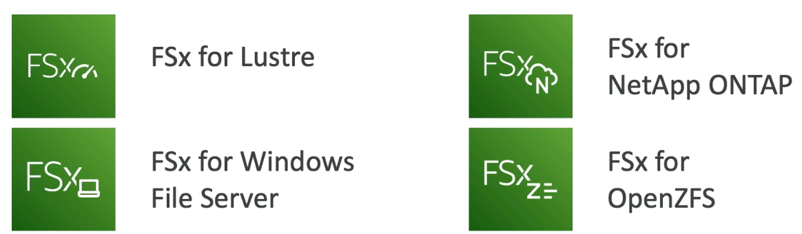

📝 **Note:** There may be more options available at the time you're reading this. Make sure to check the latest AWS documentation. This lecture will be updated if significant new file systems appear on the exam. You should know the four listed above.

### a. Amazon FSx for Windows File Server

It's a fully managed Windows File Server share drive.

- Supports the SMB protocol and Windows NTFS.
- Integrates with Microsoft Active Directory for security.
- Uses ACLs (access control lists) and user quotas.
- **You can mount them on Linux EC2 instances.**
- If you have an existing Windows File Server on-premises, you can use the Microsoft Distributed File System (DFS) feature to group your file systems together and join your FSx for Windows File Server to your on-premises Windows File Server.


> **SMB** stands for **Server Message Block**. It’s a network file-sharing protocol used mainly in Windows systems to allow computers to share files, printers, and other resources over a network.

> **NTFS** stands for **New Technology File System**. It is the default file system used by Windows operating systems for storing and organizing files on hard drives.

**Performance:**

- Scales up to 10s of GB/s.
- Millions of IOPS.
- 100s of petabytes of data.

**Storage Options:**

- SSD: For very low latency sensitive workloads (e.g., databases, media processing, data analytics).
- HDD: For a broad spectrum of workloads (e.g., home directories, CMS). Cheaper than SSD.

**Access & Availability:**

- Access from your on-premises infrastructure with a private connection (VPN or Direct Connect).
- Can be configured to be Multi-AZ for high availability.
- Data is backed up daily to Amazon S3 for disaster recovery.

### b. Amazon FSx for Lustre

Lustre is a distributed file system used for large-scale computing. Lustre is derived from Linux and cluster.

- Used for **machine learning** and **high-performance computing** (HPC). 💡 **Tip:** Look for the keyword "HPC" to identify when FSx for Lustre is needed.
- Applications: Video processing, financial modeling, electronic design automation.
- Massive scale: Scales up to hundreds of gigabytes of data per second, millions of IOPS, and sub-milliseconds latency.

**Storage Options:**

- SSD: For very low latency, IOPS intensive workloads, and small and random file operations. More expensive than HDD.
- HDD: For throughput-intensive workloads for large and sequential file operations.

**Integration:**

- Seamless integration with Amazon S3. You can read S3 as a file system through FSx, and you can write the output of the computations from FSx back to Amazon S3. 📌 **Example:** The exam may ask you about this.
- Can be used from on-premises servers through VPN or Direct Connect.

**File System Deployment Options:**

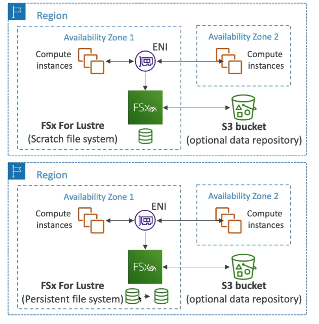

1.  **Scratch File System:**
    - Temporary storage.
    - Data is **not** replicated. ⚠️ **Warning:** You will lose data if the underlying server fails.
    - High bursts: Six times the performance of a persistent file system (e.g., 200 MB/s per TB of throughput).
    - Use case: Short-term processing of data, optimizing cost by not having data replicated.
    - Only one copy of your data.
    - Optional S3 buckets underlying for the data repository.
2.  **Persistent File System:**
    - Long-term storage.
    - Data is replicated within the **same** Availability Zone (AZ).
    - If there is a failure of an underlying server, the files will be replaced transparently within minutes.
    - Use case: Long-term processing and storage of sensitive data.
    - Two copies of the data.

### c. Amazon FSx for NetApp ONTAP

It's a managed NetApp ONTAP file system on AWS.

- Compatible with the NFS, SMB, and iSCSI protocols.
- Use case: Move workloads that are already running on ONTAP or running on a NAS on your on-premises system into AWS.
- Broad compatibility with different operating systems: Linux, Windows, and macOS, as well as VMware Cloud on AWS, WorkSpaces, AppStream, EC2, ECS, and EKS.
- Storage will automatically shrink or grow (auto-scaling).
- Replication and snapshot features available.
- Low cost: Data compression and data de-duplication are available.
- Point-in-time instantaneous cloning: Very helpful for testing new workloads. You can clone your file system very quickly and have a staging file system.

💡 **Tip:** Look for these benefits in the exam when it's hinted that you should be using NetApp ONTAP.

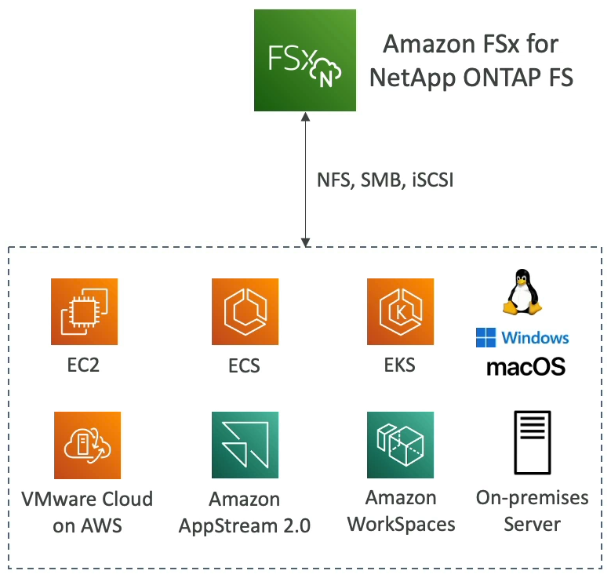

### d. Amazon FSx for OpenZFS

It's a managed OpenZFS file system on AWS.

- Compatible only with the NFS protocol on multiple versions.
- Use case: Move workloads that are already running on ZFS internally to AWS.
- Broad compatibility with:- 
  - Linux
  - MacOS
  - Windows
  - VMware Cloud on AWS
  - Amazon WorkSpaces & AppStream 2.0
  - Amazon EC2, ECS and EKS
- High performance: Scales up to 1 million (1,000,000) IOPS with less than 0.5 millisecond latency.
- Supports snapshots, compression, and low cost.
- **No** data de-duplication.
- Support for point-in-time instantaneous cloning: Very helpful again to test new workloads.

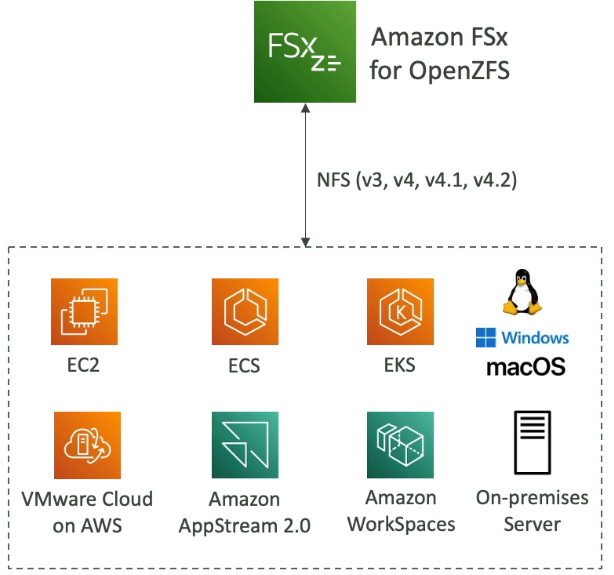

---

## 5. Amazon FSx Overview

Amazon FSx provides managed file systems on AWS. Let's explore the different file system options available. 🗄️

When creating a file system, you'll need to choose from several options. For the exam, focus on these four:

*   FSx for Lustre
*   FSx for Windows File Server
*   FSx for NetApp ONTAP
*   FSx for OpenZFS

📝 **Note:** If more file systems are added in the future, this section will only be updated if they appear on the exam.

### FSx for Lustre

FSx for Lustre provides a Lustre file system for your workloads.

*   You can configure deployment and storage types for better performance.
*   You can also choose your throughput and specify the VPC.
*   Encryption options are available.
*   There are Persistent and Scratch file system options.

### FSx for Windows File Server

FSx for Windows File Server allows you to run a Windows File Server on AWS. 💻 It's accessible using the Server Message Block (SMB) protocol.

*   You can choose between Multi-AZ and Single-AZ deployments (Single-AZ is suitable for development).
*   Storage types include SSD and HDD. The throughput capacity depends on the storage capacity.
*   You can deploy it into a specific VPC.
*   Windows authentication with Active Directory integration is supported, either through a hosted Active Directory on AWS or a self-managed Microsoft Active Directory.
*   Additional options include auditing, access management, backup, and maintenance.

### FSx for NetApp ONTAP

FSx for NetApp ONTAP brings the popular NetApp ONTAP file system to AWS. 🌐

*   It is compatible with Linux, Windows, and macOS.
*   It offers high performance.
*   You can choose between Multi-AZ and Single-AZ deployments.
*   You can specify storage type and capacity.
*   Storage efficiency features like deduplication, compression, and compaction are available.
*   You can choose between Quick Create and Standard Create, with Standard Create offering more options.

### FSx for OpenZFS

FSx for OpenZFS provides a ZFS file system on AWS.

*   It is compatible with Linux, Windows, and macOS.
*   Explore the configuration options to tailor the file system to your needs.

From an exam perspective, understand the differences between these four options. 🧐 The previous lecture covered the details for choosing the right one.

---

## 6. AWS Storage Gateway

AWS is increasingly focusing on hybrid cloud solutions. Hybrid cloud means:- 
- A portion of your infrastructure resides on AWS
- While the remainder stays on-premises. 
 
This setup can stem from various reasons:
*   Long cloud migration processes.
*   Specific security 
*   Compliance needs
*   A IT strategic decision to use the cloud only for elastic workloads, keeping core operations on-premises.

S3 is a proprietary storage solution (unlike EFS/NFS), so how do you expose the S3 data on-premises.

AWS Storage Gateway acts as a bridge between your on-premises data and your AWS cloud storage.

### Cloud Native Storage Options on AWS

AWS offers several cloud-native storage options:

*   Block Storage: Amazon EBS, EC2 Instance Store.
*   File Systems: Amazon EFS, Amazon FSx.
*   Object Storage: Amazon S3, Amazon Glacier.

### What is AWS Storage Gateway? 🌉

AWS Storage Gateway bridges on-premises data with cloud storage. While seemingly simple, it supports diverse use cases:

*   Disaster Recovery: Backing up on-premises data to the cloud.
*   Backup and Restore: Facilitating cloud migration.
*   Storage Extension: Expanding on-premises storage to the cloud.
*   Low-Latency Access: Using the gateway as an on-premises cache for data primarily stored on AWS.

### Types of Storage Gateways

There are several types of Storage Gateways, each designed for specific scenarios:

1.  S3 File Gateway
2.  Volume Gateway
3.  Tape Gateway

> Note: FSx File Gateway was also there but it has been **discontinued by AWS**. You can assume it will not appear at the exam after June 2025.

Let's examine each in detail.

### 1. Amazon S3 File Gateway 🗄️

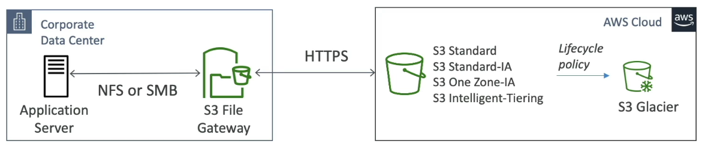

The S3 File Gateway connects an S3 bucket to an on-premises application server using standard network file systems.

*   It supports various S3 storage classes (S3 Standard, S3 Standard-IA, S3 One Zone-IA, S3 Intelligent-Tiering), but not Glacier directly.
*   It allows application servers to use NFS or SMB protocols.
*   Behind the scenes, the gateway translates these requests into HTTPS requests for Amazon S3.
*   To the application server, it appears as a normal file share.

📌 **Example:** Exposing S3 objects to on-premises application servers.

You can archive objects by creating a lifecycle policy for your S3 bucket to transition objects to S3 Glacier.

Any buckets configured with the S3 File Gateway are accessible via NFS and SMB. **The most recently used data is cached in the file gateway for faster access.**

📝 **Note:** Only the most recently used files are cached, not the entire S3 bucket.

- It supports different storage classes, including S3 Standard, S3 Standard-IA, S3 One Zone-IA, and S3 Intelligent-Tiering. 
- Transition to S3 Glacier is also supported using lifecycle policies.

To access your bucket, you need to create IAM roles for each file gateway. If using SMB protocol (which is native to Windows), there's integration with Active Directory (AD) for user authentication.

### 2. Volume Gateway 💾

The Volume Gateway provides block storage using the iSCSI protocol, backed by Amazon S3. Volumes are backed up by EBS snapshots, which can be used to restore on-premises volumes.

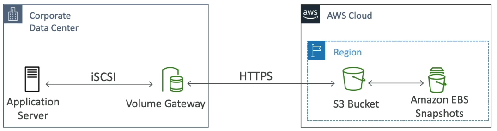

There are two types of Volume Gateway:

*   Cached Volumes: Provide low-latency access to the most recent data. Your primary data is stored in Amazon S3 while your frequently accessed data is retained locally in the cache for low-latency access.
*   Stored Volumes: The entire dataset is on-premises, with scheduled backups to Amazon S3. Your entire dataset is stored locally while also being asynchronously backed up to Amazon S3.

The primary goal of the Volume Gateway is to back up volumes from your on-premises servers. The Volume Gateway creates Amazon EBS snapshots backed by Amazon S3.

### 3. Tape Gateway 📼

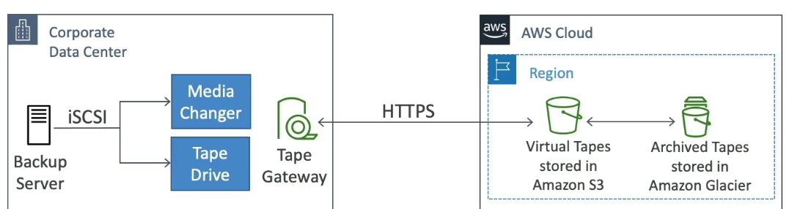

The Tape Gateway is designed for companies using tape backup systems. It backs up virtual tapes to the cloud.

*   The virtual tape library (VTL) is backed by Amazon S3 and Glacier.
*   It uses existing tape-based processes and the iSCSI interface.
*   It works with leading backup software vendors.

The Tape Gateway interfaces with the cloud by storing tapes in Amazon S3 or Amazon Glacier.

### Storage Gateway Hardware Appliance ⚙️


From all the above gateway diagrams, we have seen that they run on-premises. The gateway typically runs within your corporate data center. If you lack virtual servers to run the gateway, you can use the Storage Gateway Hardware Appliance.

*   It's a physical appliance that you can order on Amazon.
*   Once installed, it can be configured as a File Gateway, Volume Gateway, or Tape Gateway.
*   It provides sufficient CPU, memory, network, and SSD cache resources.

📌 **Example:** Useful for daily NFS backups in small data centers without virtualization.

### Storage Gateway Summary 📝

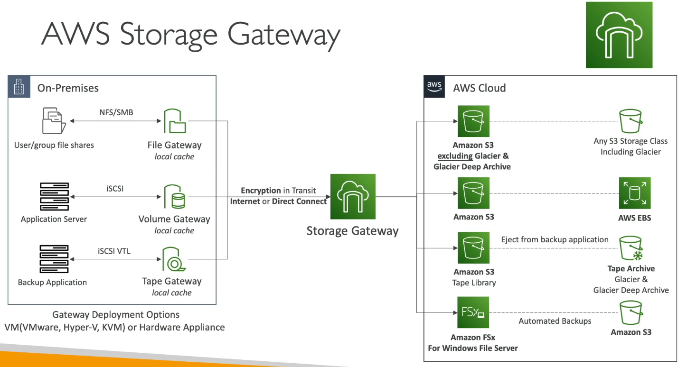

Here's a summary of the Storage Gateway service:

*   **On-Premises:** Deploy a Storage Gateway VM or Hardware Appliance.
*   **Storage Gateway Service:** The core service managing the connection.
*   **AWS Cloud:** The destination for your data.

**Use Cases:**

*   **File Gateway (S3):** User group file shares accessed over NFS or SMB, backed by Amazon S3 (excluding Glacier and Glacier Deep Archive initially, but lifecycle policies can transition data to Glacier).
*   **Volume Gateway:** Application servers mount volumes over iSCSI, with data stored in Amazon S3 and potentially transformed into AWS EBS volumes for restoration on AWS.
*   **Tape Gateway:** Backup applications connect over iSCSI VTL to a Tape Gateway, which stores data in Amazon S3 as a tape library, with the option to transition tapes to Glacier and Glacier Deep Archive.
---

## 7. Storage Gateway Hands-On

Let's explore the different types of Storage Gateways available in AWS. 📝 **Note:** You don't need to know how to configure these for the exam, just the different types.

We can create a gateway and see the four main options:

*   Amazon S3 File Gateway
*   Volume Gateway
*   Tape Gateway

### Amazon S3 File Gateway 🗄️

The Amazon S3 File Gateway provides a local cache for Amazon S3 on-premises, storing your most recently used data. This is the primary purpose of this gateway.

When configuring, you have several platform options:

*   On-premises virtualization platforms (VMware, Hyper-V, Linux KVM)
*   Amazon EC2 (⚠️ **Warning:** This removes some of the caching benefits)
*   Hardware appliance (ordered directly from AWS)

The hardware appliance is particularly useful as you can hook it into your data center and run a file gateway.

### Volume Gateway 💾

The Volume Gateway offers two distinct options:

1.  **Cached Volume:** Provides low-latency access to your most recently used data for your storage volumes. Your primary data is stored in Amazon S3 while your frequently accessed data is retained locally in the cache for low-latency access.
2.  **Stored Volume:** Keeps your on-premise data with scheduled offsite backups. Your entire dataset is stored locally while also being asynchronously backed up to Amazon S3.

These are two very different use cases, and it's important to understand the differences for the exam.

The Volume Gateway uses block storage in Amazon S3 and point-in-time backups as EBS snapshots, effectively creating volumes.

### Tape Gateway 📼

The Tape Gateway allows you to backup your data into Amazon S3 and archive it into Glacier. It uses your existing tape-based processes and the same protocols you're familiar with in your Virtual Tape Library (VTL).

---

## 8. AWS Transfer Family

The AWS Transfer Family allows you to transfer data in and out of Amazon S3 or EFS without directly using the S3 APIs or the EFS network file system. Instead, you can use standard file transfer protocols.

It supports the following protocols:

*   AWS Transfer for FTP (File Transfer Protocol)
*   FTPS (File Transfer Protocol over SSL - encrypted)
*   SFTP (Secure File Transfer Protocol)

📝 **Note:** FTP is unencrypted, while FTPS and SFTP provide encryption during data transfer.

Using these protocols, you can upload data to S3 or EFS. The Transfer Family provides a fully managed, scalable, reliable, and highly available infrastructure.

### Pricing

You are charged based on:

*   Per provisioned endpoint per hour.
*   A fee per gigabyte of data transferred in and out of the Transfer Family.

### User Authentication

You have options for managing user credentials:

*   Store and manage credentials within the Transfer Family service itself.
*   Integrate with existing authentication systems such as:
    *   Microsoft Active Directory
    *   LDAP
    *   Okta
    *   Amazon Cognito
    *   Any custom source

### Use Cases

The primary use case is to provide an FTP interface to Amazon S3 or EFS for:

*   Sharing files
*   Sharing public datasets
*   CRM and ERP systems

### Architecture

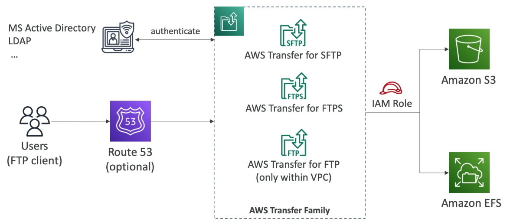

The Transfer Family has three protocol options. Users access the service through endpoints using FTP, FTPS, or SFTP.

Optionally, you can use Amazon Route 53 to provide your own hostname for the FTP service.

The Transfer Family service (e.g., Transfer for FTP) assumes an IAM role to read and write files to Amazon S3 or Amazon EFS. This process is transparent.

To secure the Transfer Family services, you can authenticate users using an external authentication system like Active Directory or LDAP.

---

## 9. AWS DataSync

AWS DataSync is a service used to synchronize data between various locations. It's important to understand its core functionality for the exam. This topic is asked frequently in the exam.

The main idea is to move large amounts of data to and from different places, including:

*   On-premises locations - Agent needed
*   Other cloud locations - Agent needed
*   Between AWS services (AWS to AWS - Different Storage service - no agent needed)

To connect to on-premises servers or other cloud locations, DataSync uses protocols like NFS, SMB, and HDFS.

*   An agent is required to run on-premises or in the other cloud environment to facilitate this connection.

DataSync can synchronize data to:

*   Amazon S3 (including all storage classes, even Glacier)
*   Amazon EFS (Elastic File System)
*   Amazon FSx (all supported file systems)

📝 **Note:** Replication tasks are not continuous; they are scheduled. You can configure DataSync to run hourly, daily, or weekly. There will be a lag, but the data will be synchronized according to the schedule.

**DataSync preserves file permissions and metadata**, including security settings. This ensures compliance with NFS POSIX file systems and SMB permissions.

📌 **Example:** This is often the only option that preserves file metadata when moving data between locations, which is a key point for the exam.

A single DataSync agent can be quite powerful:

*   It can run one task at a time.
*   It can use up to 10 gigabits of data per second.
*   You can set bandwidth limits to avoid maxing out your network.

### DataSync Architecture

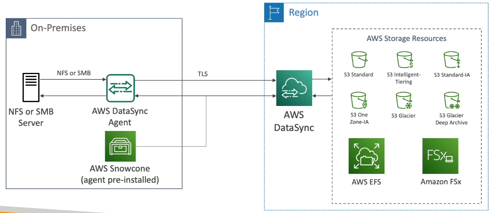

Consider the use case of synchronizing on-premises files (using SMB or NFS) to AWS (S3, EFS, or FSx).

1.  You have your on-premises environment and your AWS region where DataSync is running.
2.  You have your NFS or SMB server on-premises.
3.  Install the AWS DataSync agent on-premises and configure it to connect to your NFS or SMB server.
4.  The DataSync agent establishes a connection and connects in an encrypted fashion to the DataSync service.
5.  From there, you can direct the data to any storage class in Amazon S3, AWS EFS, or Amazon FSx.

The synchronization can be one-way (on-premises to AWS) or bi-directional (AWS back to on-premises).

### Using AWS Snowcone with DataSync

> Sometime in exam, will say wants to use DataSync but lacks sufficient network capacity in that case we can use AWS Snowcone.

If you lack sufficient network capacity for DataSync, consider using AWS Snowcone.

*   The Snowcone device comes with the DataSync agent pre-installed.
*   Run Snowcone on-premises to pull your data using the DataSync agent.
*   Ship the Snowcone device back to your AWS region.
*   Synchronize the data to your AWS storage resources.

### Synchronizing Between AWS Storage Services

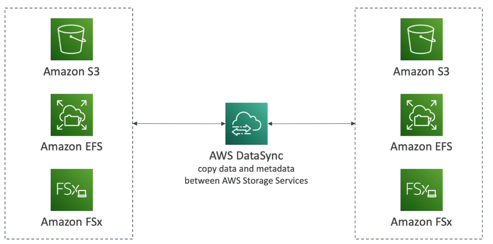

DataSync can also synchronize data between different AWS storage services, such as:

*   Amazon S3
*   Amazon EFS
*   Amazon FSx

Data can be moved between any of these services.

Again, the AWS DataSync service copies both the data and the metadata between the different AWS storage services. This is a crucial point and may appear on the exam.

### Key Takeaways

To reiterate:

*   DataSync can synchronize data between various locations.
*   Synchronization is not continuous; it's a scheduled task (hourly, daily, weekly).
*   DataSync preserves metadata and file permissions.
*   You need to run DataSync agents when connecting to an NFS or SMB server.
---

## 10. AWS Storage Options: A Comprehensive Overview 🗄️

AWS offers a wide array of storage options, each tailored for specific use cases. Understanding their differences is crucial for choosing the right solution for your architecture. Here's a summary:

### Object Storage 📦

*   **Amazon S3:** Ideal for object storage with a specific API. Great for anything related to AWS.
*   **S3 Glacier:** For archiving objects stored in S3. 🧊

### Block Storage 💾

*   **EBS Volumes:** Attach storage to a single EC2 instance at a time.
    *   IO1 and IO2 volumes support multitask functionality.
    *   Different volume types exist, such as GP3 and IO2.
*   **EC2 Instance Storage:** Provides high-performance, physical storage directly attached to your EC2 instance with very high IOPS. ⚠️ **Warning:** This is not network storage, it's a physical storage.

### Network File Systems 🌐

*   **Amazon EFS:** A Network File System for Linux instances that can be mounted across multiple Availability Zones with a POSIX filesystem.
*   **Amazon FSx for Windows:** A Windows server file system.
*   **FSx for Lustre:** High-Performance Computing Linux file system compatible with a Lustre client.
*   **FSx for NetApp ONTAP:** Offers super High Operating System Compatibility for a network file system.
*   **FSx for OpenZFS:** Provides a managed ZFS file system.

### Bridging On-Premises and AWS 🌉

*   **Storage Gateway:** Bridges storage between on-premises environments and AWS.
    *   **S3 Gateway:** Synchronizes files between on-premises and Amazon S3.
    *   **Volume Gateway:** Mounts volumes onto on-premises servers with backups in the cloud.
    *   **Tape Gateway:** For backups in tape form.
*   **AWS Transfer Family:** Provides FTP, FTPS, or SFTP interfaces on top of Amazon S3 or Amazon EFS.
*   **DataSync:** Synchronizes data on a schedule from on-premises to AWS, or AWS to AWS.
*   **Snow Family (Snowcone, Snowball, Snowmobile):** For physically moving large amounts of data when network capacity is limited. 🚚
    *   📝 **Note:** Snowcone comes with a DataSync agent pre-installed.

### Databases 💽

*   Databases are suitable for specific workloads that require indexing and querying. A dedicated section will cover choosing the right database.

### Key Takeaways 🔑

*   Understanding the differences between these storage options is crucial for your role as a Solutions Architect on AWS.
*   Choosing the right storage solution is essential for optimal architecture design.

---

## 11. Q & A

### ❓ Question-1

You need to move hundreds of terabytes into Amazon S3, then process the data using a fleet of EC2 instances. You have a 1 Gbit/s broadband. You would like to move the data faster and possibly process it while in transit. What do you recommend?

* Use your network
* Use Snowcone
* Use AWS Data Migration
* Use Snowball Edge

<details>

<summary>Explanation</summary>

* **Use your network**

  * At **1 Gbit/s**, transferring **hundreds of TBs** would take **weeks or even months**.
  * Not practical for large-scale bulk data migration.

* **Use Snowcone**

  * Lightweight edge device for smaller-scale transfers (up to **8 TB usable storage**).
  * Not suitable when dealing with **hundreds of TBs**.

* **Use AWS Data Migration**

  * More relevant for **databases** (e.g., Database Migration Service, DMS).
  * Not designed for raw bulk storage migration at this scale.

* **Use Snowball Edge** ✅

  * Purpose-built for **large-scale data transfer (up to 80 TB per device)**.
  * Comes with **on-board compute capabilities (EC2 & Lambda)**.
  * Enables **data preprocessing or transformation** before uploading to S3.
  * Much faster and cost-efficient compared to network transfer at 1 Gbit/s.

✅ Answer **Use Snowball Edge**

#### 📊 Quick Comparison

| Option               | Best For                                    | Limitations                       |
| -------------------- | ------------------------------------------- | --------------------------------- |
| **Network Transfer** | Small to medium datasets                    | Very slow for 100s of TB          |
| **Snowcone**         | Edge use cases, small (≤8 TB)               | Too small for this case           |
| **AWS DMS**          | Database migrations                         | Not bulk file transfer            |
| **Snowball Edge** ✅  | Bulk transfer (100s of TBs) + preprocessing | Requires physical device shipping |

⚡ **In this scenario:** Since you need to move **hundreds of TBs quickly** and possibly process it before uploading to S3, the best solution is **AWS Snowball Edge**.

</details>

### ❓ Question-4

You have **hundreds of terabytes** that you want to migrate to **AWS S3** as soon as possible. You tried to use your **network bandwidth**, and it will take around **3 weeks** to complete the upload process.

What is the **recommended approach** to use in this situation?

1. **AWS Storage Gateway – Volume Gateway**
2. **S3 Multi-part Upload**
3. **AWS Snowball Edge**
4. **AWS Data Migration Service**

<details>

<summary>Explanation</summary>

When transferring **large volumes of data (tens to hundreds of terabytes or more)** to AWS, network-based uploads often become **impractical** due to limited bandwidth, high transfer time, and potential reliability issues.

**AWS Snowball Edge** is a **physical data transport solution** designed for exactly this scenario.

##### 📦 What AWS Snowball Edge Does:

* AWS ships you a **secure, ruggedized device** (50–80 TB per device).
* You copy your data locally onto the device using the **Snowball client or AWS OpsHub**.
* You then **ship it back to AWS**, where AWS uploads your data directly into your **S3 bucket**.
* Data is **encrypted** and the device **auto-erases** after ingestion for security.

This method **bypasses network bottlenecks** and significantly **reduces transfer time** — often from weeks to just a few days.

#### ⚖️ Option Comparison:

| Option                                   | Description                                                                                              | Why Not the Best                                                     |
| ---------------------------------------- | -------------------------------------------------------------------------------------------------------- | -------------------------------------------------------------------- |
| **AWS Storage Gateway – Volume Gateway** | Used for hybrid cloud storage (on-prem + AWS). Best for continuous sync, not one-time massive transfers. | ❌ Not ideal for bulk migration of hundreds of TB.                    |
| **S3 Multi-part Upload**                 | Uploads large files in parts to S3. Useful for large files, but still depends on **network bandwidth**.  | ❌ Won't solve the 3-week bandwidth limitation.                       |
| **AWS Snowball Edge**                    | Physical data transport solution for massive offline data transfer.                                      | ✅ Best option — fast, secure, and efficient for large-scale uploads. |
| **AWS Data Migration Service (DMS)**     | Used for **database** migration, not for object storage like S3.                                         | ❌ Wrong service for S3 file uploads.                                 |

#### 📝 Summary:

* ⚙️ **Use case:** Migrating hundreds of TBs of data to S3 quickly
* 🚫 **Problem:** Limited network bandwidth (takes 3 weeks)
* ✅ **Solution:** Use **AWS Snowball Edge** for fast, secure offline transfer to AWS

</details>

### ❓ Question-7

You would like to have a distributed **POSIX-compliant file system** that will allow you to maximize the IOPS in order to perform **High-Performance Computing (HPC)** and **genomics computational research**. This file system has to easily scale to millions of IOPS. What do you recommend?

* EFS with Max. IO enabled
* Amazon FSx for Lustre
* Amazon S3 mounted on the EC2 instances
* EC2 Instance Store

<details>

<summary>Explanation</summary>

* **EFS with Max. IO enabled**

  * Good for scalable workloads requiring shared access across many EC2 instances.
  * However, it **cannot scale to millions of IOPS** — it's designed for general-purpose workloads, not HPC.

* **Amazon FSx for Lustre** ✅

  * Purpose-built for **High-Performance Computing (HPC)** and large-scale analytics.
  * Provides **POSIX-compliant distributed file system**.
  * Can scale to **millions of IOPS** with **sub-millisecond latencies**.
  * Integrates seamlessly with Amazon S3, allowing fast processing of S3 data sets.
  * Ideal for **genomics, financial modeling, machine learning, and big data workloads**.

* **Amazon S3 mounted on the EC2 instances**

  * S3 is **object storage**, not a POSIX-compliant file system.
  * Mounting S3 with third-party tools (e.g., s3fs) introduces performance bottlenecks and does not meet HPC requirements.

* **EC2 Instance Store**

  * Provides **high IOPS** locally, but storage is **ephemeral** (lost when instance stops/terminates).
  * Not distributed or scalable across multiple nodes.
  * Not suitable for long-term HPC workloads requiring shared access.

✅ Answer: **Amazon FSx for Lustre**

#### 📊 Quick Comparison

| Option                  | POSIX Compliant | IOPS Scaling           | Best Use Case                 |
| ----------------------- | --------------- | ---------------------- | ----------------------------- |
| **EFS (Max I/O)**       | ✅ Yes           | Limited (not millions) | General shared workloads      |
| **FSx for Lustre** ✅    | ✅ Yes           | Millions of IOPS       | HPC, genomics, ML, big data   |
| **Amazon S3 (mounted)** | ❌ No            | Not IOPS-based         | Object storage, analytics     |
| **EC2 Instance Store**  | ✅ Yes (local)   | High (local only)      | Temporary, local fast storage |

⚡ **In this scenario:** Since you need a **distributed POSIX file system** that can **scale to millions of IOPS** for HPC and genomics research, the best choice is **Amazon FSx for Lustre**.

</details>

### ❓ Question-10

A **Solutions Architect** is planning the migration of a **startup company’s on-premises infrastructure** to AWS.
Currently, their setup consists of **many servers** and **30 TB of data** stored on a **shared NFS storage**.

The architect has decided to use **Amazon S3** to host this data.
Which **AWS service** can efficiently migrate the data from on-premises to S3?

Options:

1. **AWS Storage Tape Gateway**
2. **Amazon EBS**
3. **AWS Transfer Family**
4. **AWS DataSync** 

<details>

<summary>Explanation</summary>

**AWS DataSync** is designed for **automating, accelerating, and simplifying** data transfer between on-premises storage and AWS services like **S3, EFS, and FSx**.

It is **optimized for high-speed online data transfer** and supports:

* **NFS** and **SMB** file systems (perfect for this question scenario).
* **Incremental transfers** and **data validation**.
* **Encryption** in transit and at rest.

DataSync can **transfer terabytes to petabytes** of data **up to 10x faster** than traditional tools (like rsync or custom scripts) because it uses a dedicated **data transfer protocol** over HTTPS.

#### ⚖️ Option Comparison:

| Option                       | Description                                                                   | Why Not Suitable                                                 |
| ---------------------------- | ----------------------------------------------------------------------------- | ---------------------------------------------------------------- |
| **AWS Storage Tape Gateway** | Emulates a tape library for backup/archival to S3 Glacier.                    | ❌ Not for direct file or NFS data transfer to S3.                |
| **Amazon EBS**               | Block storage used for EC2 instances.                                         | ❌ Not used for migrating files from on-prem to S3.               |
| **AWS Transfer Family**      | Used for **SFTP, FTPS, FTP** transfers into S3 or EFS.                        | ⚠️ Works for user uploads, not large-scale automated migrations. |
| **AWS DataSync**             | Purpose-built for **bulk data migration** from NFS/SMB to AWS (S3, EFS, FSx). | ✅ Most efficient and secure choice.                              |

#### 📝 Summary:

* 🗃️ **Source:** On-prem NFS shared storage
* ☁️ **Destination:** Amazon S3
* ⚙️ **Best Tool:** **AWS DataSync**
* 🚀 **Reason:** Fast, automated, scalable, and secure data migration

**In short:**

> Use **AWS DataSync** for migrating large amounts of structured file data (like NFS) from on-premises to S3 efficiently and securely.

</details>

### ❓ Question 11

**Which AWS service is best suited to migrate a large amount of data from an S3 bucket to an EFS file system?**

#### Options:

1. **AWS Snowball**
2. **AWS DataSync**
3. **AWS Transfer Family**
4. **AWS Backup**

<details>

<summary>Explanation</summary>

**AWS DataSync** is the best service for **automating and accelerating large-scale data transfers** between AWS storage services or from on-premises to AWS.

In this case, since you're migrating **a large amount of data from S3 to EFS**, DataSync provides the following advantages:

* ⚡ **High-speed transfer** (up to 10× faster than traditional tools like `rsync`).
* 🔄 **Automated synchronization** — can be scheduled or run continuously.
* 🔒 **Secure transfers** — encryption in transit and at rest.
* 🧩 **Native integration** with both **Amazon S3** and **Amazon EFS**.

You can simply:

1. Create a DataSync **task**.
2. Choose **S3** as the **source location**.
3. Choose **EFS** as the **destination**.
4. Run or schedule the task — DataSync will handle metadata, consistency checks, and retries automatically.

#### ⚖️ Option Comparison:

| Option                  | Description                                                             | Why Not Correct                                                  |
| ----------------------- | ----------------------------------------------------------------------- | ---------------------------------------------------------------- |
| **AWS Snowball**        | Physical device for offline bulk data transfer from on-premises to AWS. | ❌ Used for on-premise transfers, not between AWS services.       |
| **AWS DataSync**        | Automates and accelerates data transfers between AWS storage services.  | ✅ Best fit for S3 ↔ EFS migrations.                              |
| **AWS Transfer Family** | Provides SFTP/FTP/FTPS access to S3 or EFS.                             | ⚠️ Useful for individual uploads/downloads, not bulk migrations. |
| **AWS Backup**          | Centralized service for backups across AWS resources.                   | ❌ For backups and restores, not data migration.                  |

#### 📝 Summary:

* **Scenario:** Migrate large datasets from **S3 → EFS**
* **Goal:** Efficient, automated, and fast transfer
* **Solution:** ✅ **AWS DataSync**

**In short:**

> Use **AWS DataSync** to efficiently move or synchronize large amounts of data between **Amazon S3** and **Amazon EFS** — it's purpose-built for this type of transfer.

</details>


### ❓ Question-12

A Machine Learning company is working on a set of datasets that are hosted on **S3 buckets**. The company decided to release those datasets to the public to be used for research, but they don’t want to configure the S3 bucket to be **public**. Also, those datasets should be exposed over the **FTP protocol**.

What can they do to meet the requirement **efficiently** and with the **least effort**?

* Create an EC2 instance with an FTP server installed then copy the data from S3 to the EC2 instance
* Use AWS Storage Gateway
* Copy the data from S3 to an EFS file system, then expose them over the FTP protocol
* Use AWS Transfer Family

<details>

<summary>Explanation</summary>

* **Create an EC2 instance with FTP server**

  * Possible but requires a lot of management (server setup, scaling, patching, maintaining storage).
  * Data also needs to be copied from S3 to EC2, which adds **extra storage and transfer costs**.
  * Not efficient.

* **Use AWS Storage Gateway**

  * Storage Gateway is used to connect **on-premises environments** with AWS storage (e.g., caching S3 locally).
  * Not designed for exposing datasets over FTP to external users.

* **Copy the data from S3 to EFS and expose over FTP**

  * Adds unnecessary complexity — you'd need EC2 + EFS + FTP setup.
  * Increases cost and effort compared to direct integration.

* **Use AWS Transfer Family** ✅

  * Fully managed service for **FTP, FTPS, and SFTP** access directly into S3.
  * No need to make the S3 bucket public.
  * Minimal setup and serverless (no EC2 maintenance required).
  * Scales automatically and integrates natively with S3.
  * The **most efficient and least effort** solution.

✅ Answer: **Use AWS Transfer Family**

⚡ **Final Note:**
The company should use **AWS Transfer Family** since it directly exposes **S3 data over FTP/FTPS/SFTP**, without making the bucket public or managing extra infrastructure.

</details>

### ❓ Question 13

Amazon FSx for **NetApp ONTAP** is compatible with the following protocols, **EXCEPT** …

* NFS
* SMB
* iSCSI
* FTP

<details>

<summary>Explanation</summary>

Amazon FSx for NetApp ONTAP is a managed file system that supports multiple industry-standard storage protocols. These protocols allow you to access the same dataset in different ways depending on your application needs:

* **NFS (Network File System)**

  * Commonly used for Linux/Unix clients.
  * Fully supported by FSx for ONTAP.

* **SMB (Server Message Block)**

  * Used for Windows-based clients and applications.
  * Supported natively by FSx for ONTAP.

* **iSCSI (Internet Small Computer Systems Interface)**

  * Block-level storage access.
  * Useful for applications requiring raw storage volumes.
  * Supported by FSx for ONTAP.

* **FTP (File Transfer Protocol)** ❌

  * **Not supported.** FSx for ONTAP does not expose data over FTP.
  * FTP is an older, less secure protocol, and AWS does not provide it as part of FSx ONTAP.
  * If FTP is required, you'd need to integrate with **AWS Transfer Family** to expose data stored on FSx indirectly.

✅ Answer: **FTP**

⚡ **Key Point to Remember:**
Amazon FSx for NetApp ONTAP supports **NFS, SMB, and iSCSI**, but **not FTP**.

</details>

### ❓ Question 17

AWS DataSync supports the following locations, **EXCEPT** …

* Amazon S3
* Amazon EFS
* Amazon FSx for Windows File Server
* Amazon EBS

<details>

<summary>Explanation</summary>

**AWS DataSync** is a managed service designed for moving large amounts of data quickly and securely between on-premises storage and AWS services, or between AWS storage services.

Supported locations include:

* **Amazon S3** – Store and retrieve any amount of data (object storage).
* **Amazon EFS** – Fully managed elastic NFS file system.
* **Amazon FSx** family – Including Windows File Server, Lustre, NetApp ONTAP, and OpenZFS.
* **On-premises storage systems** – NFS, SMB servers, and Hadoop Distributed File System (HDFS).

❌ **Not Supported:**

* **Amazon EBS (Elastic Block Store)** is **not** a supported DataSync location.

  * EBS is block storage attached to EC2 instances.
  * DataSync is built for file and object transfers, not block-level device replication.
  * If you want to move data in/out of EBS, you would first need to mount the EBS volume to an EC2 instance and then transfer files using other supported mechanisms.

✅ Answer: **Amazon EBS**

⚡ **Key Point to Remember:** AWS DataSync works with **file- and object-based services** (S3, EFS, FSx, NFS, SMB, HDFS), **not block storage (EBS)**.

</details>

---