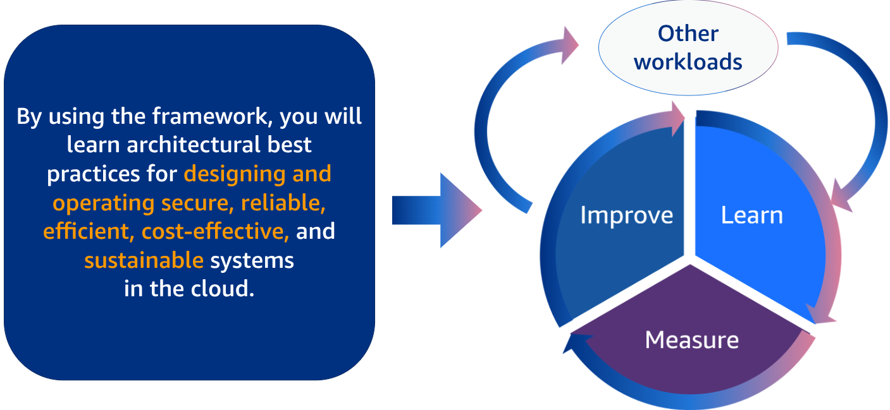
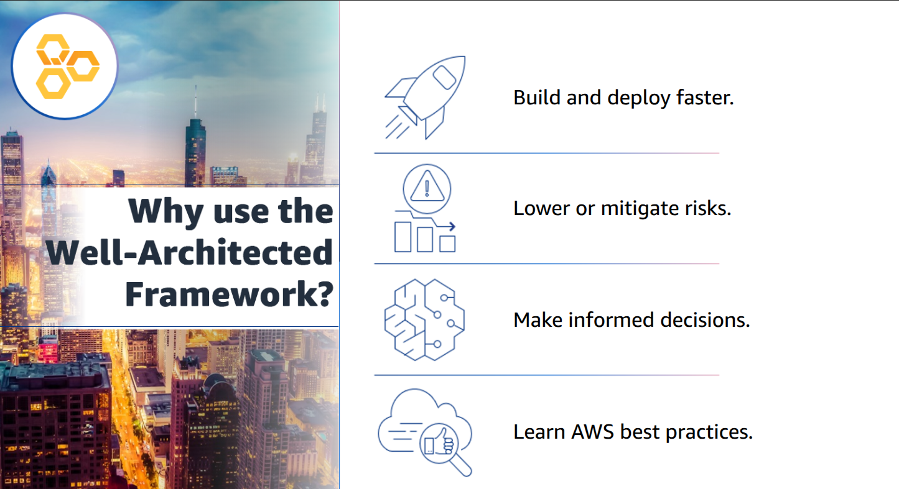
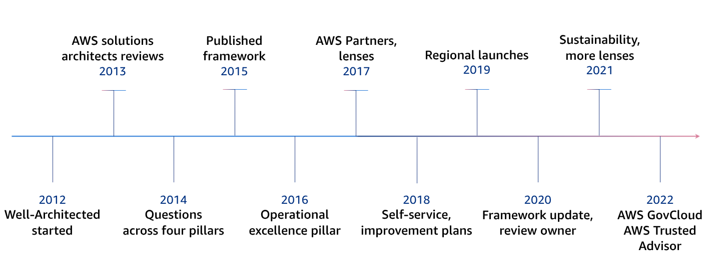
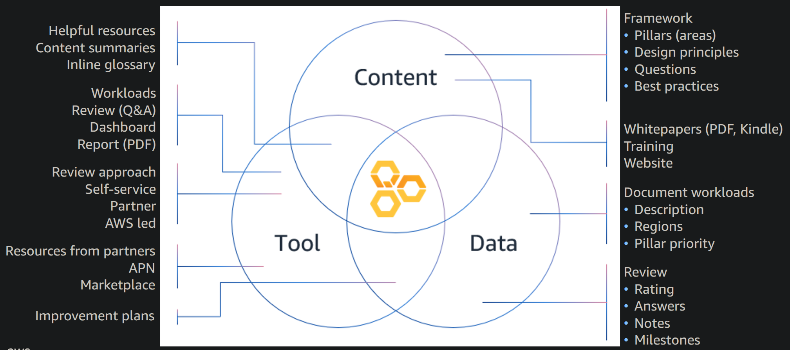
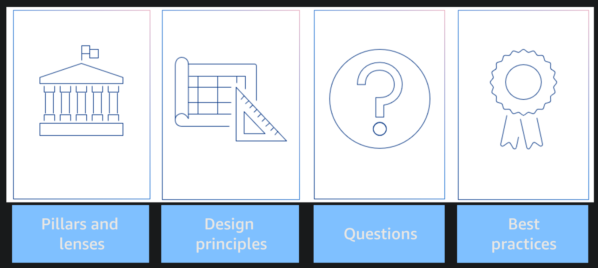
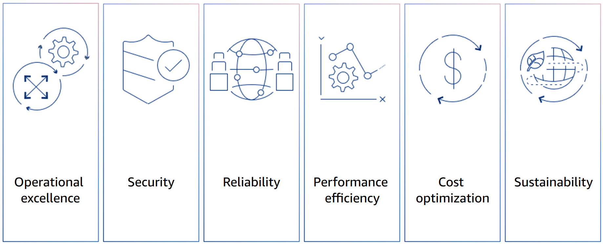
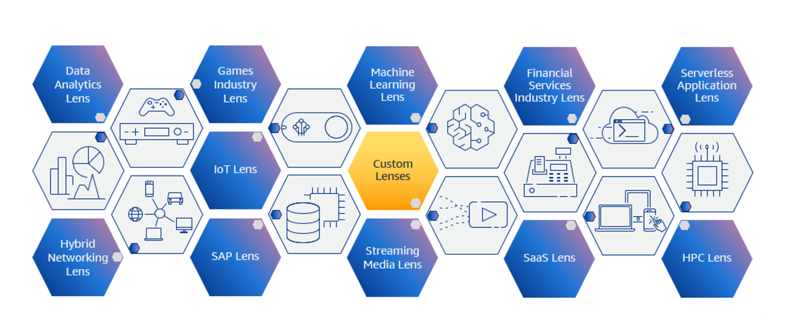

# Module 1 AWS Well-Architected - Framework Overview 

## 1.1 AWS Well-Architected 
Welcome to module one of AWS Well-Architected – AWS Well-Architected Framework Overview. In this module, you will learn about the Well-Architected Framework and its definition, pillars, history, and value propositions.  

---

## 1.2 Learning objectives 
In this module, you learn about:- 
- The AWS Well-Architected (AWS WA) Framework 
- The components of the Well-Architected Framework
- The pillars and general design principles of the Well-Architected Framework. 

## 1.3 What is the Well-Architected Framework? 
To begin, you will learn general information about the framework, its benefits, and its history. 

---

## 1.4 Are you Well-Architected? 
When evaluating the workloads your team is building, ask yourself: **How confident are you that your systems follow cloud best practices?**

The **AWS Well-Architected Framework** was designed to help you answer that question — **“Are you Well-Architected?”**

This framework provides a comprehensive set of **design principles** and **best practices** that guide you in making informed architectural decisions when building systems on AWS.

It serves as a **benchmark** to:

* **Measure** your architecture against established AWS best practices.
* **Identify** gaps or areas that need improvement.
* **Implement** strategies to strengthen your workloads and ensure they are **secure**, **reliable**, **efficient**, and **cost-effective**.

In essence, the Well-Architected Framework helps you **understand the impact of your architectural choices** and ensures your systems are built the right way — **the AWS Well-Architected way**.

---

## 1.5 What is the Well-Architected Framework? 

**AWS Solutions Architects** bring extensive experience across diverse **industries**, **business verticals**, and **use cases**. Over the years, they have **designed and reviewed thousands of customer architectures** on AWS. From this wealth of experience, AWS has identified a set of **best practices** and **core strategies** for building well-architected systems in the cloud.

By applying the **AWS Well-Architected Framework**, you can:

* **Learn proven architectural best practices** for designing and operating workloads that are **secure**, **reliable**, **efficient**, **cost-effective**, and **sustainable**.
* **Continuously measure** your architectures against these best practices to ensure alignment with AWS standards.
* **Identify areas for improvement** and implement changes to strengthen your workloads over time.

Repeating this process regularly establishes a **continuous improvement lifecycle**, helping you evolve and optimize your cloud architectures as your business grows.

As you move through this training, you’ll explore these **design principles** and **best practices** in greater depth—and learn how to **integrate them effectively** into your own workloads on AWS.

---

## 1.6 Why use the Well-Architected Framework 

There are several key benefits to applying the **AWS Well-Architected Framework**:

1. **Build and Deploy Faster 🚀**
   By following the framework’s principles, you can **reduce unplanned actions**, improve **capacity management**, and leverage **automation**. This allows your teams to **experiment confidently**, **iterate quickly**, and **deliver value more frequently**.

2. **Lower and Mitigate Risks ⚠️**
   The framework helps you **identify potential risks** in your architecture early on, so you can **address them proactively**—before they affect your business operations or distract your teams.

3. **Make Better, Data-Driven Decisions 💡**
   With clear insights into your workloads and architecture, you can make **informed architectural decisions** that directly support your **business goals** and **long-term strategy**.

4. **Plan for the Future with Confidence 📈**
   Understanding your current architectural state enables you to make **strategic decisions** about **future improvements**, ensuring your cloud environment continues to evolve efficiently and effectively.

5. **Leverage AWS Best Practices 🧠**
   The framework incorporates **proven insights and best practices** derived from AWS’s experience reviewing **thousands of customer architectures**, helping you build secure, high-performing, resilient, and efficient workloads from day one.

---

## 1.7 A brief history of the Well-Architected Framework 

The Well-Architected Framework has a rich history, spanning over a decade of development and evolution. Here is a brief timeline of the major milestones:

* 2012: The AWS Well-Architected Framework was first conceived
* 2013: AWS solutions architects started reviewing customer workloads
* 2014: AWS standardized the questions across four pillars
* 2015: AWS published a formal framework based on the four pillars
* 2016: The operational excellence pillar was added to the Well-Architected Framework
* 2017: AWS trained select AWS Partners to review customer workloads
* 2018: The AWS Well-Architected Tool launched in the AWS console
* 2019: The AWS Well-Architected Tool and the Well-Architected Partner Program were launched in multiple Regions
* 2020: The framework was updated, additional lenses were added, and API access to the AWS Well-Architected Tool was launched
* 2021: The sustainability pillar was added to the framework, and additional lenses were added
* 2022: The AWS Well-Architected Tool was launched in AWS GovCloud Regions, and integration with AWS Trusted Advisor was added
* 2023: The Well-Architected Framework continues to evolve, with new features, lenses, and integrations with other AWS services being added.

---

## 1.8 Components of the Well-Architected Framework 
You will now learn about the three components of the framework.  

---

### 1.9 Components of the Well-Architected Framework 

The **AWS Well-Architected Framework** is made up of **three key components**: **content, tools, and data**.

* **Content:** Provides comprehensive learning materials about AWS best practices, including the **six pillars**, **design principles**, and **implementation guidelines** that form the foundation of a well-architected workload.
* **Tools:** Includes the **AWS Well-Architected Tool**, which helps you **assess and measure** your workloads and teams against AWS best practices. This tool offers insights into your current architecture and identifies areas for improvement.
* **Data:** Refers to the information collected during **Well-Architected Framework Reviews**. This data enables you to **analyze**, **track**, and **continuously enhance** your workloads and operational efficiency over time.

In this module, you’ll explore the **content** component in depth. The upcoming modules will cover the **AWS Well-Architected Tool** and the **Well-Architected Framework Review** in greater detail.

---

### 1.10 Well-Architected Framework content 

The **AWS Well-Architected Framework** consists of a comprehensive set of **design principles** and **questions** organized around its **six pillars**.

In addition to these pillars, the framework includes **lenses**—specialized extensions that offer guidance tailored to specific **industry** or **technology domains** (such as machine learning, serverless, or data analytics).

To assess the **health and maturity** of your workloads, you answer a structured set of **foundational questions** derived from the framework, its pillars, and any applicable lenses.

These questions help determine whether your workload **follows AWS best practices** and highlight areas that may need improvement to achieve a **well-architected** and **resilient cloud environment**.

---

### 1.11 Pillars of AWS Well-Architected 

The **AWS Well-Architected Framework** is built upon **six foundational pillars**, which together define the core principles for designing and operating secure, efficient, and resilient cloud architectures:

1. **Operational Excellence** – Focuses on running and monitoring systems effectively, and continually improving processes and procedures.
2. **Security** – Protects information, systems, and assets through risk assessment and mitigation strategies.
3. **Reliability** – Ensures workloads perform correctly and consistently, even as demands or conditions change.
4. **Performance Efficiency** – Uses computing resources efficiently to meet system requirements and adapt to evolving technologies.
5. **Cost Optimization** – Helps you avoid unnecessary costs and maximize value from your cloud investments.
6. **Sustainability** – Focuses on minimizing the environmental impact of your cloud workloads and promoting long-term efficiency.

Together, these pillars form the **foundation for building well-architected technology solutions** in the AWS Cloud.

One liner to remember these pillers:-

> Operate securely, stay reliable, perform efficiently, control cost, think long term.

---

### 1.12 Well-Architected lenses 

The **AWS Well-Architected Lenses** enhance the core guidance of the AWS Well-Architected Framework by focusing on specific **industry** and **technology domains**. These domains include:

* **Machine Learning (ML)**
* **Data Analytics**
* **Serverless Applications**
* **High-Performance Computing (HPC)**
* **Internet of Things (IoT)**
* **SAP**
* **Streaming Media**
* **Gaming Industry**
* **Hybrid Networking**
* **Financial Services**

To perform a comprehensive evaluation of your workloads, you should use the **relevant lenses** alongside the **Well-Architected Framework** and its **six pillars**.

Additionally, AWS allows you to **create custom lenses**—either user-defined or managed—to better align with your organization’s **industry**, **operational goals**, and **internal processes**. With custom lenses, you can define your own **question sets**, add **context**, and document **best practices** specific to your environment.

While not all lenses are currently available directly within the **Well-Architected Tool**, every lens can still be accessed as part of the broader **Well-Architected Framework**.

---

## 1.13 General Design Principles

**General design principles** apply across **all workloads** and **all six pillars** of the AWS Well-Architected Framework. In addition, each pillar has its own **specific design principles**, which you’ll explore later.

Cloud computing has transformed the way we think about architecture by removing many of the constraints that existed in traditional on-premises environments.

In a **traditional IT environment**, you typically had to:

* **Estimate infrastructure needs** upfront, often based on rough business requirements before any code was written.
* **Avoid large-scale testing** due to the high cost of duplicating production environments.
* **Discover performance and scaling issues** only after going live.
* **Perform manual proof of concepts** or architectural experiments, usually just once—early in the project.
* **Operate with static architectures** that made change difficult and time-consuming.
* **Rely on assumptions and models** for capacity planning instead of data-driven insights.
* **Test your operational runbooks only during failures**, rather than proactively.

In the **cloud environment**, these limitations no longer apply. You can **design, test, scale, and evolve** your workloads dynamically, taking advantage of **on-demand infrastructure, automation, and real-time data**.

By embracing **general design principles**, you can fully leverage the **agility, elasticity, and innovation** that the cloud offers.

---

## 1.14 Design Principles

Each **pillar** of the AWS Well-Architected Framework also has its own **pillar-specific design principles**. These principles help guide architectural decisions tailored to that pillar’s focus area — for example, security, performance, or cost optimization.

One of the **general design principles** is to **improve through game days**.
💡 **Game days** are exercises where you **simulate real-world events** in production to test your architecture and operational readiness. They help you:

* Identify weaknesses in your systems or processes.
* Improve your response strategies.
* Build organizational confidence and experience in handling incidents.

📌 **Example (Security Pillar):**
A design principle for the **Security Pillar** is to **prepare for security events**. This means:

* Establishing **incident management** and **investigation processes** that align with organizational requirements.
* Running **incident response simulations**.
* Using **automation tools** to increase the speed and accuracy of **detection, investigation, and recovery**.

---

## 1.15 Questions and Best Practices

The final two components of the framework are **Questions** and **Best Practices**.

* **Questions** help you determine whether a specific **best practice** has been implemented in your workload.
* Each **pillar** includes a tailored set of **questions** and **associated best practices** to guide your assessment.

These best practices are **based on what successful AWS customers have done**, but they’re **not absolute rules**. The right answer depends on your **workload’s specific context and business goals**.

📌 **Example (Security Pillar Question):**

> “How do you protect your data at rest?”

The framework provides **context** for this question and outlines **recommended best practices**, such as:

* Encrypting data using AWS-managed or customer-managed keys.
* Implementing access control and audit logging.
* Regularly reviewing encryption configurations.

Architects should apply their **judgment** to determine which practices best fit their workloads.

---

## Questions

**1. What was the AWS Well-Architected Tool created to do?**

**Options:**

* A. Identify the threats associated with the customer’s business model.
* B. Analyze the configuration of a customer’s Amazon Elastic Kubernetes Service (Amazon EKS) cluster.
* C. Determine if a customer’s bill is correct.
* D. Measure a customer’s workloads and teams against AWS Well-Architected best practices.

Answer and Explanation

**✅ Correct Answer:**

* **D. Measure a customer’s workloads and teams against AWS Well-Architected best practices.**

**Explanation:**
The **AWS Well-Architected Tool** is designed to help customers **review and evaluate their workloads** against the **AWS Well-Architected Framework**. It measures how well workloads align with AWS **best practices across the six pillars** and provides improvement recommendations.

**Why the other options are incorrect:**

* **A** – Threat modeling is part of security design, but not the tool’s primary purpose
* **B** – EKS configuration analysis is handled by other tools (e.g., EKS best practices, third-party tools)
* **C** – Billing accuracy is handled by AWS Billing & Cost Management, not this tool

 

**2. What are some parts of the AWS Well-Architected Framework content? (Select THREE.)**

**Options:**

* A. Pillars
* B. Questions
* C. Checklists
* D. Design principles
* E. Software framework
* F. Metrics

Answer and Explanation

**✅ Correct Answers:**

* **A. Pillars**
* **B. Questions**
* **D. Design principles**

**Explanation:**
The AWS Well-Architected Framework is structured around:

* **Pillars** (Operational Excellence, Security, Reliability, Performance Efficiency, Cost Optimization, Sustainability)
* **Design principles** for each pillar
* **Questions** used during Well-Architected Reviews to evaluate workloads

**Why others are incorrect:**

* **C. Checklists** – Not an official component (questions serve this purpose)
* **E. Software framework** – It’s a guidance framework, not software
* **F. Metrics** – Metrics may be used in practice but are not a defined content part of the framework

---

## Summary

In this module, you explored the **value and benefits** of the **AWS Well-Architected Framework**. You learned how it helps you:

* Apply **general and pillar-specific design principles** across your workloads.
* Use **questions and best practices** to assess and improve your architectures.
* Embrace **continuous improvement** through regular reviews and learning from real-world experience.

Together, these practices empower you to **build secure, reliable, efficient, cost-optimized, and sustainable systems** on AWS.

---