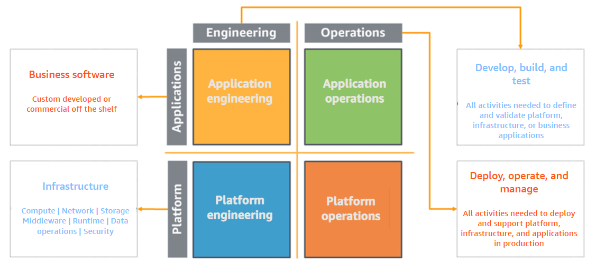

# Module 4: AWS Well-Architected – Operational Excellence Pillar

## 1.1 Welcome

Welcome to **Module Four of AWS Well-Architected: Deep Dive on the Operational Excellence Pillar**.

---

## 1.2 Learning Objectives

In this module, you will learn:

* An **overview of the Operational Excellence Pillar** of the AWS Well-Architected Framework.
* The **design principles** of the Operational Excellence Pillar.
* **Best practices** to achieve operational excellence in the cloud.

---

## 1.3 Operational Excellence Pillar Overview

To begin, you will get a **high-level overview** of the Operational Excellence Pillar.

---

## 1.4 Pillars of the Well-Architected Framework

The AWS Well-Architected Framework currently has **six pillars**:

1. **Operational Excellence**
2. **Security**
3. **Reliability**
4. **Performance Efficiency**
5. **Cost Optimization**
6. **Sustainability**

These pillars form the **foundations of cloud architecture** for technology solutions. This module focuses specifically on **Operational Excellence**.

One liner to remember these pillars:-

> Operate securely, stay reliable, perform efficiently, control cost, think long term.

---

## 1.5 What is the Operational Excellence Pillar?

Operational Excellence ensures that your **workloads, processes, and procedures deliver business value**.

Key points:

* Workloads must deliver **effective business value**.
* Supporting functions around workloads should **reinforce value delivery**.

> ⚠️ Operational excellence is about **running workloads effectively**.  
> A workload that is secure, cost-optimized, reliable, and performant is excellent, but if your teams cannot operate it efficiently, it becomes **an overhead to the business**.

---

## 1.6 Operational Excellence

Now that you understand the pillar, let’s dive deeper into its **design principles**.

---

## 1.7 Design Principles of Operational Excellence

There are **five design principles** for operational excellence in the cloud:

1. **Perform Operations as Code**

   * Apply the same engineering discipline used for application code to your **entire environment**.
   * Define applications, infrastructure, and other components as **code**, updating them programmatically.
   * Script operations procedures and automate responses to events to **limit human error** and drive **consistency**.

2. **Make Frequent, Small, and Reversible Changes**

   * Design workloads for **regular component updates**.
   * Make **small, reversible changes** to quickly identify and resolve issues without impacting customers.

3. **Refine Operations Procedures Frequently**

   * Continuously improve operations procedures as workloads evolve.
   * Conduct **regular game days** to review and validate procedures and ensure team familiarity.

4. **Anticipate Failure**

   * Perform **pre-mortem exercises** to identify potential sources of failure.
   * Test failure scenarios and response procedures to ensure **team readiness**.
   * Conduct **regular game days** to simulate events and validate responses.

5. **Learn from All Operational Failures**

   * Capture **lessons learned** from operational events and failures.
   * Share insights **across teams and the entire organization** to drive continuous improvement.

---

## 1.8 Operational Excellence Best Practices

With an understanding of the design principles, we now focus on **best practices** for operational excellence.

---

## 1.9 Focus Areas of Operational Excellence

The Operational Excellence Pillar emphasizes **four focus areas**:

1. **Organization**

   * Understand your organization’s **priorities and structure**.
   * Ensure teams are supported to **achieve business outcomes**.

2. **Prepare**

   * Understand your workloads and their **expected behaviors**.
   * Design workloads to provide **insight into their status** and develop **supporting procedures**.

3. **Operate**

   * Measure **success using defined metrics**.
   * Monitor workload health to identify and respond when **business outcomes are at risk**.

4. **Evolve**

   * Implement **continuous improvement** based on lessons learned.
   * Make **frequent, small incremental changes** and evaluate their impact on improving operations.

---

## 1.10 Organization

**Organization** is the first operational excellence best practice area. It focuses on structuring teams, priorities, and processes to **maximize business outcomes**.

---

## 1.11 Organization Priorities

Teams need to **understand the entire workload, their role in it, and shared business goals**. Clear priorities help drive business success and maximize the impact of efforts.

**Best practices for setting and maintaining priorities include:**

1. **Evaluate External Customer Needs**

   * Involve key stakeholders (business, development, operations) to focus on **external customer needs**.
   * Ensure operations support aligns with desired **business outcomes**.

2. **Evaluate Internal Customer Needs**

   * Collaborate with stakeholders to identify **internal operational requirements**.
   * Use established priorities to focus improvement efforts where they have the **greatest impact** (e.g., team skills, workload performance, cost reduction, automation, monitoring).
   * Update priorities as organizational needs evolve.

3. **Evaluate Governance Requirements**

   * Governance includes **policies, rules, and frameworks** supporting business goals.
   * Incorporate organizational governance requirements into workloads.
   * Conformance demonstrates implementation of governance requirements.

4. **Evaluate Compliance Requirements**

   * Regulatory, industry, and internal compliance influence **organization priorities**.
   * Compliance frameworks may restrict certain technologies or locations.
   * Implement audits or reports to validate ongoing compliance.
   * Examples: **PCI DSS, FedRAMP, HIPAA**.
   * Applicable standards depend on data type, storage/transmission, and geographic regions.

5. **Evaluate the Threat Landscape**

   * Consider risks such as competition, operational failures, liabilities, and information security threats.
   * Maintain a **risk registry** and factor impacts into priority decisions.

6. **Evaluate Trade-Offs**

   * Weigh competing interests or alternative approaches to make informed decisions.
   * Example: Prioritize speed to market over cost optimization or choose relational databases for migration simplicity over optimization.

7. **Manage Benefits and Risks**

   * Balance potential benefits against risks to guide focus and decision-making.
   * Example: Deploy workloads with unresolved issues to deliver new features, but mitigate risks as needed.
   * Emphasize subsets of priorities as necessary while maintaining long-term balance.

> ⚠️ Update priorities regularly to reflect changing organizational needs.

---

## 1.12 Operating Models

The **operating model** helps visualize responsibilities across teams:

* **Vertical Axis:**

  * **Applications:** Workloads delivering business outcomes (custom or purchased).
  * **Platform:** Physical/virtual infrastructure and supporting software.

* **Horizontal Axis:**

  * **Engineering:** Development, building, testing applications and infrastructure.
  * **Operations:** Deployment, updates, ongoing support.

> 💡 Note: Variations exist showing how responsibilities are distributed across teams. See Operational Excellence pillar documentation for details.

---

## 1.13 Organizational Culture

Supporting your team is key to operational excellence. Focus areas include:

1. **Executive Sponsorship**

   * Senior leadership sets expectations, evaluates success, and drives adoption of best practices.

2. **Empowering Team Members**

   * Workload owners define guidance and scope to enable **decision-making when outcomes are at risk**.

3. **Escalation Mechanisms**

   * Teams escalate concerns to decision-makers if outcomes are at risk.
   * Escalate **early and often** to prevent incidents.

4. **Effective Communication**

   * Provide timely, clear, actionable information about risks and planned events.
   * Include necessary context to determine action and timing.
   * Example: Notice of software vulnerabilities or planned sales promotions.

5. **Encourage Experimentation**

   * Experimentation accelerates learning and drives innovation.
   * Teams are **not punished** for undesired results, fostering a culture of safe experimentation.

6. **Skill Growth and Knowledge Transfer**

   * Grow skills to adopt new technologies and handle evolving workloads.
   * Support certifications, cross-training, and structured learning time.

7. **Resource Team Appropriately**

   * Maintain team capacity and provide tools/resources.
   * Avoid overtasking; automation can **scale team effectiveness**.

8. **Diverse Perspectives**

   * Encourage inclusion, diversity, and accessibility.
   * Leverage multiple viewpoints to increase innovation, challenge assumptions, and reduce bias.

---

## 1.14 Prepare

To prepare for operational excellence, you must **understand your workloads and their expected behaviors**.

* Design workloads to **provide insight into their status**.
* Build **procedures and processes** to support workload operations.

---

## 1.15 Design Telemetry

Telemetry provides the **information needed to understand a workload’s internal state**. Examples include **metrics, logs, events, and traces**.

Key practices for telemetry:

1. **Application Telemetry**

   * Forms the **foundation for observability**.
   * Provides insight into application state and business outcomes.
   * Includes:

     * **Metrics:** Diagnostic information (e.g., pulse or temperature) used to track application health over time, detect anomalies, and establish baselines.
     * **Logs:** Messages about internal state or events (e.g., error codes, transaction IDs, user actions).

2. **Workload Telemetry**

   * Emits information about **workload internal state and status**, e.g., API call volume, HTTP status codes, scaling events.
   * Helps determine when a response is required.

3. **User Activity Telemetry**

   * Instrument applications to track **user behavior**, e.g., click streams, started/abandoned/completed transactions.
   * Provides insight into **patterns of usage** and informs when operational responses are needed.
   * Can support synthetic activity monitoring in production.

4. **Dependency Telemetry**

   * Track the status of **external resources** your workload depends on, e.g., databases, DNS, network connectivity.
   * Provides context for workload state and determines when action is required.

5. **Transaction Traceability**

   * Emit events for **single logical operations**, consolidated across workload boundaries.
   * Create **maps of traces** to visualize relationships between components.
   * Identify issues and determine contributing factors for remediation.

> 💡 Iteratively develop telemetry to monitor workload health, identify risks, and drive effective operational responses.

---

## 1.16 Design for Operations

Design workloads to **accelerate beneficial changes**, **limit errors**, and **improve feedback loops**.

**Best practices include:**

1. **Treat Workloads as Code**

   * Define applications, infrastructure, policies, governance, and operations as code.
   * Apply the same engineering discipline used for application code to all components.

2. **Version Control**

   * Track all changes and releases using version control.

3. **Test and Validate Changes**

   * Test all changes, including application code, infrastructure, configurations, security controls, and operational procedures.
   * Move testing **earlier in the development lifecycle** to increase quality certainty.
   * Automate tests when possible to reduce manual errors; manual testing may be used selectively.
   * Ensure feedback loops are available to developers.

4. **Configuration Management**

   * Track configuration changes to **reduce errors** and simplify deployments.

5. **Build and Deployment Management**

   * Automate build and deployment processes to **reduce manual effort and errors**.

6. **Patch and Vulnerability Management**

   * Automate patch management wherever possible.
   * Prefer **immutable infrastructure**; patch in place only if necessary.
   * Integrate patch management into **benefit and risk management** activities.

7. **Shared Design Standards and Best Practices**

   * Document and maintain shared standards.
   * Ensure mechanisms exist for **additions, changes, and exceptions** to avoid constraining innovation.

8. **Improve Code Quality**

   * Practices include: test-driven development, code reviews, standards adoption, pair programming.
   * Integrate into **continuous integration and delivery processes**.

9. **Use Multiple Environments**

   * Experiment, develop, and test workloads in controlled environments.
   * Increase controls progressively toward production to ensure reliability.

10. **Frequent, Small, and Reversible Changes**

    * Reduce impact of changes, ease troubleshooting, enable faster remediation, and allow rollbacks.

11. **Full Automation of Integration and Deployment**

    * Automate build, deployment, and testing to **reduce errors** and **effort** required for change management.

> ✅ Applying these practices ensures workloads are **observable, manageable, and resilient**, enabling operational excellence.

---

## 1.17 Mitigate Deployment Risks

Mitigating deployment risks ensures changes are safe, predictable, and reversible.

**Key practices include:**

* **Plan for Unsuccessful Changes**

  * Prepare to **revert to a known good state** or remediate in production if changes fail.
  * Reduces recovery time through faster responses.

* **Test and Validate Changes**

  * Validate changes at **all lifecycle stages** to confirm functionality and minimize risk.

* **Use Deployment Management Systems**

  * Track and implement changes systematically.
  * Reduces manual errors and simplifies deployment effort.

* **Limited Deployments**

  * Test using **canary deployments or one-box deployments** before full-scale rollout.

* **Parallel Environments**

  * Implement changes in parallel environments, maintaining the prior environment until success is confirmed.
  * Minimizes recovery time by enabling quick rollback.

* **Frequent, Small, Reversible Changes**

  * Reduces scope and impact of changes.
  * Facilitates troubleshooting and faster remediation.

* **Full Automation of Integration and Deployment**

  * Automate build, deployment, and testing.
  * Reduces errors caused by manual processes and effort required.

* **Automate Testing and Rollback**

  * Automate verification of deployed environments.
  * Automate rollback to a known good state if outcomes are not achieved.

---

## 1.18 Operational Readiness and Change Management

Ensure workloads, processes, procedures, and personnel are ready to **support production workloads safely and effectively**.

**Key practices include:**

### 1. Evaluate Operational Readiness

Evaluate the operational readiness of your **workload, processes, procedures, and personnel** to understand operational risks.

* Use a **consistent readiness process** before going live or deploying changes
* Include **manual or automated checklists**
* Identify gaps early and create plans to address them
* Manage the **flow of change** into environments in a controlled way

### 2. Change Management

Use a formal mechanism to manage changes that:

* Supports **delivery of business value**
* Helps **mitigate risks** associated with change
* Covers both **successful and unsuccessful deployments**
* Ensures all changes comply with **governance requirements**

**Pre-mortems**

* Simulate potential failures before deployment
* Anticipate risks and define mitigation strategies
* Decide whether benefits outweigh risks before deploying

### 3. Runbooks and Playbooks

#### Runbooks

Runbooks are **documented procedures** used to perform routine operational tasks.

* Step-by-step instructions to achieve a specific outcome
* Reduce risk and improve consistency
* Can be as simple as a checklist
* Used for standard, repeatable operations

#### Playbooks

Playbooks are **incident investigation guides**.

* Help investigate incidents, assess impact, and find root cause
* Used for scenarios such as:

  * Failed deployments
  * Performance issues
  * Security incidents
* Often identify issues that are resolved using runbooks
* Core component of incident response plans

### 4. Personnel Readiness and Capability

Ensure you have **enough trained personnel** to support the workload.

* Staff must be trained on:

  * The platform
  * Services used by the workload
* Provide sufficient operational knowledge
* Ensure coverage for:

  * Normal operations
  * Incident troubleshooting
  * On-call rotations
  * Vacations (to avoid burnout)

### 5. Operational Readiness Reviews (ORRs)

Use **Operational Readiness Reviews (ORRs)** to validate that workloads can be safely operated.

* ORR is a structured review and inspection process
* Uses a **checklist-based, self-service approach**
* Includes best practices derived from real-world incidents

**ORR Checklist Areas**

* Architecture recommendations
* Operational processes
* Event and incident management
* Release quality
* Lessons learned from post-incident analysis
* Security, governance, and compliance (optional but recommended)

ORRs are not just about best practices — they are meant to **prevent recurrence of past failures**.

### 6. Support Plans for Production Workloads

Ensure production workloads are fully supported.

* Select appropriate **support plans** to meet service-level needs
* Cover all dependencies:

  * Cloud services
  * Third-party software
  * External vendors
* Document:

  * Support plans
  * How to request support
  * Escalation paths
* Maintain mechanisms to ensure **support contacts remain up to date**

---

## 1.19 Operate

Success is measured by the **achievement of business outcomes** and the ability to respond to risks effectively.

---

### 1.20 Understanding Workload Health

To maintain operational excellence, define and monitor **workload health metrics**:

* **Key Performance Indicators (KPIs)**

  * Based on business and customer outcomes.
  * Examples: order rate, customer retention, profit vs. operating expense, customer satisfaction.

* **Workload Metrics**

  * Measure the health of components and applications.
  * Examples: abandoned carts, orders placed, cost, allocated workload expense.
  * Adjust metrics over time as business needs change.

* **Collect and Analyze Metrics**

  * Aggregate metrics centrally for analysis using dashboards and analytics tools.
  * Conduct periodic health reviews with stakeholders.

* **Establish Baselines**

  * Helps identify under-performing or over-performing components.
  * Supports anomaly detection and proactive mitigation.

* **Define Patterns of Activity**

  * Identify expected workload behavior to detect anomalies.

* **Raise Alerts**

  * Trigger alerts when outcomes or anomalies indicate risk.
  * Use automated responses when appropriate.

* **Validate Outcomes**

  * Review KPIs and metrics to ensure they reflect business goals.
  * Adjust metrics as needed to continuously improve insights.

---

### 1.21 Understanding Operational Health

Operations metrics provide visibility into the **health of operations activities** supporting workloads.

* **Define Operations KPIs**

  * Examples: new features delivered, customer support cases, successful vs. failed deployments.

* **Operations Metrics**

  * Measure activities such as **mean time to detect (MTTD)** and **mean time to recovery (MTTR)**.

* **Collect and Analyze Metrics**

  * Aggregate logs and operational API calls for insight into performance.
  * Conduct regular proactive reviews to identify trends and required actions.

* **Establish Baselines and Patterns**

  * Compare actual metrics to expected values to detect deviations.

* **Alerting**

  * Raise actionable alerts when operations outcomes or anomalies occur.
  * Reference corresponding runbooks or playbooks to avoid alert fatigue.

* **Validate Outcomes**

  * Ensure operations support business outcomes effectively.
  * Revise KPIs and metrics as needed to maintain operational excellence.

---

## 1.22 Responding to Events

Anticipating and responding effectively to operational events ensures workload stability and business continuity.

**Key practices include:**

* **Anticipate Events**

  * Planned events: sales promotions, deployments, failure tests.
  * Unplanned events: surges in utilization, component failures.
  * Use **runbooks and playbooks** to deliver consistent responses.
  * Assign a **role or team accountable** for alerts and escalations.

* **Event Classification**

  * **Events:** occur in workloads, may not require intervention.
  * **Incidents:** require intervention.
  * **Problems:** recurring events that require intervention or cannot be resolved.

* **Define Response per Alert**

  * Each alert should have a **well-defined response** (runbook/playbook) and a **specific owner**.
  * Ensures prompt, effective responses and prevents important events from being overlooked.

* **Prioritize Based on Business Impact**

  * Address events with highest impact first: safety, financial loss, reputation, or trust.

* **Define Escalation Paths**

  * Include triggers, procedures, and owners in runbooks/playbooks.
  * Identify human decision points in advance to avoid long **MTTR** delays.

* **Communication Plans**

  * Define plans for system outages to keep stakeholders informed.
  * Communicate both during service impact and recovery.
  * Use dashboards tailored to internal teams, leadership, and customers.

* **Automate Responses**

  * Reduce human error and ensure **prompt, consistent responses** to events.

---

## 1.23 Evolve

**Evolution is a continuous cycle of improvement** over time.

* Implement **frequent, small incremental changes** based on lessons learned.
* Evaluate improvements to determine their success in enhancing operational performance.

---

## 1.24 Learn, Share, and Improve

Continuous learning and sharing strengthen organizational resilience and operational excellence.

**Key practices include:**

* **Analyze Operations Activities**

  * Review failures, experimentations, and improvements regularly.
  * Share lessons learned across teams and engineering communities.

* **Continuous Improvement Process**

  * Evaluate workloads against **best practices** internally and externally.
  * Conduct **workload reviews at least annually**.
  * Prioritize improvement opportunities in software development cadence.

* **Post-Incident Analysis**

  * Review customer-impacting events, identify contributing factors, and implement preventative actions.
  * Develop procedures for prompt and effective responses.
  * Communicate findings tailored to target audiences.

* **Feedback Loops**

  * Build actionable feedback loops into procedures and workloads.
  * Identify areas for improvement and validate investment effectiveness.

* **Knowledge Management**

  * Centralized systems (e.g., Wiki) allow team members to **find accurate, up-to-date information**.
  * Supports creation, updates, and archiving of information.

* **Identify Drivers for Improvement**

  * Evaluate and prioritize opportunities.
  * Validate insights through cross-functional reviews to align understanding and determine actions.

* **Retrospective Analysis**

  * Review operations metrics with cross-team participants.
  * Identify improvements across all environments: development, test, production.

* **Document and Share Lessons Learned**

  * Increases organizational benefit and prevents avoidable errors.
  * Supports focus on delivering desired features.

* **Dedicate Time and Resources**

  * Ensure continuous incremental improvements are achievable.

---

## Questions

**1. Which of the following are best practice areas for the Operational Excellence pillar? (Select THREE.)**

**Options:**

* A. Performance efficiency
* B. Prepare
* C. Cost effectiveness
* D. Organization
* E. Security
* F. Evolve

Answer and Explanation

**✅ Correct Answers:**

* **B. Prepare**
* **D. Organization**
* **F. Evolve**

**Explanation:**
The **Operational Excellence pillar** of the AWS Well-Architected Framework focuses on running and improving workloads effectively. Its best practice areas are:

* **Organization** – Structure teams, define responsibilities, and establish governance.
* **Prepare** – Prepare for operations by understanding workloads, risks, and procedures.
* **Operate** – (Not listed in options) Run workloads and respond to events.
* **Evolve** – Continuously improve processes and procedures through lessons learned.

**Why the other options are incorrect:**

* **A. Performance efficiency** – Belongs to the Performance Efficiency pillar
* **C. Cost effectiveness** – Part of the Cost Optimization pillar
* **E. Security** – Its own dedicated pillar

---

**2. What is a design principle of operational excellence?**

**Options:**

* A. Implement a strong identity foundation.
* B. Automatically recover from failure.
* C. Measure overall efficiency.
* D. Perform operations as code.

Answer and Explanation

**✅ Correct Answer:**

* **D. Perform operations as code.**

**Explanation:**
A key **design principle of the Operational Excellence pillar** is to **perform operations as code**. This means defining operational procedures and processes in code so they can be **automated, version-controlled, tested, and consistently executed**.

**Why the other options are incorrect:**

* **A** – Security pillar design principle
* **B** – Reliability pillar design principle
* **C** – Not an official AWS Well-Architected design principle

---

## 1.27 Summary

In this module, you explored the **Operational Excellence Pillar** of the AWS Well-Architected Framework.

You learned:

* The **value proposition** of operational excellence. ✅
* **Design principles**, including:

  * Operations as code
  * Frequent, small, reversible changes
  * Refining procedures regularly
  * Anticipating failure
  * Learning from operational failures ✅
* **Best practices**, focusing on:

  * Organization, culture, and priorities
  * Preparing workloads with telemetry and operational readiness
  * Mitigating deployment risks and managing change
  * Understanding workload and operational health
  * Responding to events effectively
  * Continuous evolution through learning, sharing, and improvement ✅

By applying these principles and practices, organizations can **run workloads effectively, minimize risk, and continuously improve** operations to achieve business outcomes in the cloud.

---
